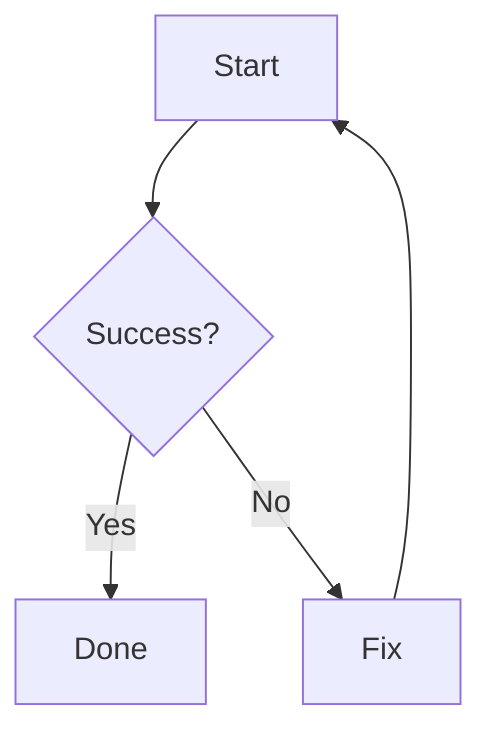

# Documentation Format & Rules

This page describes the writing format, file naming conventions, and contribution rules that apply to every piece of documentation in the Lectures project.

::: info Purpose
These rules exist to keep every page consistent, easy to read, and easy to maintain, in line with the study program's vision to be excellent, adaptive, and innovative in the dissemination of knowledge in software engineering.
:::

## Core Principles

Three principles form the foundation of all documentation:

1. **Order.** Folder structure, file names, and page format must be consistent throughout the project.
2. **Readability.** Content must be easy to understand for both new and returning readers.
3. **Sustainability.** Documentation must be easy to update without breaking other parts.

## Folder Structure

All documentation lives inside the `docs/` directory:

```

docs/
├── index.md
├── format.md
├── public/
│ ├── favicon.svg
│ ├── logo.svg
│ └── images/
└── v1/
├── index.md
├── about.md
├── license.md
├── courses/
│ ├── index.md
│ └── <course-code>.md
├── information/
│ ├── index.md
│ ├── kontak-dosen.md
│ ├── jadwal-kuliah.md
│ ├── info-team-pbl.md
│ └── judul-dan-team-pbl.md
└── task/
├── index.md
└── <assignment-name>.md

```

Every new documentation release is stored in a new folder such as `v2/`, `v3/`, and so on. Global pages like `format.md` and all static assets under `public/` are version-independent and apply to every version.

## File Naming Conventions

### General Rules

- Use all lowercase letters.
- Use hyphens as separators, not underscores or spaces.
- File names must be descriptive and concise.
- Avoid special characters except hyphens.

### Naming Examples

| Type             | Format                  | Example                     |
| ---------------- | ----------------------- | --------------------------- |
| Course page      | `<course-code>.md`      | `pemrograman-web.md`        |
| Lecture material | `materi-XX-<topic>.md`  | `materi-03-linux-basics.md` |
| Assignment       | `tugas-XX-<name>.md`    | `tugas-01-resume-paper.md`  |
| Daily note       | `catatan-YYYY-MM-DD.md` | `catatan-2026-09-12.md`     |
| Lab session      | `lab-XX-<name>.md`      | `lab-02-html-css.md`        |
| Midterm exam     | `uts-YYYY-MM-DD.md`     | `uts-2026-10-20.md`         |
| Reference        | `ref-<topic>.md`        | `ref-algoritma-sorting.md`  |

## Frontmatter

Every page must include frontmatter at the very top:

```yaml
---
title: Page Title
description: A short description of the page.
---
```

### Common Frontmatter Fields

| Field         | Required | Purpose                                             |
| ------------- | -------- | --------------------------------------------------- |
| `title`       | Yes      | Page title, shown in the browser tab and sidebar    |
| `description` | Yes      | Short description for SEO                           |
| `outline`     | No       | Set to `deep` for a more detailed table of contents |
| `layout`      | No       | Set to `home` for the landing page                  |
| `order`       | No       | Display order in the sidebar                        |
| `draft`       | No       | Set to `true` to temporarily hide the page          |

### Complete Example

```yaml
---
title: Web-Based Programming
description: Materials, assignments, and notes for the Web-Based Programming course.
outline: deep
order: 6
---
```

## Markdown Writing Format

### Headings

- Use `#` for the page title, only once per page.
- Use `##` for main sections.
- Use `###` for sub-sections.
- Never skip levels, such as jumping from `##` straight to `####`.

```markdown
# Page Title

## Main Section

### Sub-section

#### Sub-sub-section
```

### Paragraphs

- Separate paragraphs with a single blank line.
- Keep paragraphs to three or four lines when possible.
- Avoid long paragraphs without breaks.

### Text Emphasis

| Format        | Syntax       | Example        |
| ------------- | ------------ | -------------- |
| Bold          | `**text**`   | **important**  |
| Italic        | `_text_`     | _foreign term_ |
| Inline code   | `` `code` `` | `bun install`  |
| Strikethrough | `~~text~~`   | ~~wrong~~      |

### Lists

Use `-` for unordered lists and `1.` for ordered lists:

```markdown
- First item
- Second item
  - Sub-item
  - Another sub-item

1. First step
2. Second step
```

### Links

- Internal link: `[Text](/v1/path/without-extension)`
- External link: `[Text](https://example.com)`
- Always use descriptive link text, avoid phrases like "click here"

```markdown
- [View class schedule](/v1/information/jadwal-kuliah)
- [VitePress documentation](https://vitepress.dev)
```

## Tables

Use standard markdown tables with consistent separators:

```markdown
| Column 1 | Column 2 | Column 3 |
| -------- | -------- | -------- |
| Data 1   | Data 2   | Data 3   |
| Data 4   | Data 5   | Data 6   |
```

For alignment:

```markdown
| Left | Center | Right |
| :--- | :----: | ----: |
| a    |   b    |     c |
```

## Code Blocks

Always specify the language so syntax highlighting works:

````markdown
```ts
const hello = 'world';
```

```bash
bun install
```

```json
{ "key": "value" }
```
````

Common languages: `ts`, `js`, `bash`, `json`, `yaml`, `markdown`, `html`, `css`, `sql`, `python`.

### Line Highlighting

To mark important lines:

````markdown
```ts{2}
const a = 1;
const b = 2;
const c = 3;
```
````

## Admonitions

VitePress supports special boxes to highlight information:

```markdown
::: info Optional Title
General information.
:::

::: tip Tips
Suggestions or good practices.
:::

::: warning Warning
Things to be careful about.
:::

::: danger Danger
Risky or forbidden actions.
:::

::: details Details
Content that can be expanded or collapsed.
:::
```

### Usage Guide

| Type      | When to Use                               |
| --------- | ----------------------------------------- |
| `info`    | Context or additional explanation         |
| `tip`     | Suggestions, shortcuts, or best practices |
| `warning` | Things that may cause problems            |
| `danger`  | Dangerous or forbidden actions            |
| `details` | Optional content or spoilers              |

## Images

Store images under `docs/public/images/`:

```
docs/public/images/
├── screenshot-web.png
├── diagram-pbl.svg
└── foto-lab.jpg
```

Reference them in markdown:

```markdown

```

### Image Rules

- Always provide descriptive alt text.
- Keep each image file under 500 KB when possible.
- Format: `.svg` for diagrams, `.png` for screenshots, `.jpg` for photos.
- For large images, host them outside the repository and link externally.

## Definition Lists

For glossaries:

```markdown
Term
: Explanation of the term.

Another Term
: Explanation of another term.
```

## Footnotes

For footnotes:

```markdown
This sentence has a footnote.[^1]

[^1]: This is the footnote content.
```

## Abbreviations

For abbreviations:

```markdown
*[HTML]: HyperText Markup Language

HTML is a markup language.
```

## Additional Text Markers

```markdown
==highlighted text==

++inserted text++

~~subscript~~

^superscript^
```

## Mathematics

For mathematical formulas:

```markdown
Inline: $E = mc^2$

Block:

$$
\int_0^\infty e^{-x^2} dx = \frac{\sqrt{\pi}}{2}
$$
```

## Task Lists

```markdown
- [x] Completed task
- [ ] Incomplete task
- [ ] Another task
```

## Mermaid Diagrams

For diagrams:

````markdown

````

## Content Rules

### Language

- Use clear, well-formed English for English pages and proper Indonesian for Indonesian pages.
- Technical terms may remain in English when they are more common that way.
- Be consistent within a single page.

### Tone of Voice

- Formal but not stiff. Avoid overly casual language.
- Objective. Avoid personal opinions except on note pages.
- Concise. Get to the point and avoid rambling sentences.

### Standard Page Structure

Every course page must contain at least:

1. Frontmatter with `title` and `description`.
2. Page title.
3. Brief info: course code, credits, lecturer, schedule.
4. Materials section.
5. Assignments section.
6. References section.

## Date Conventions

Always use ISO 8601:

| Format         | Example             | When Used                   |
| -------------- | ------------------- | --------------------------- |
| `YYYY-MM-DD`   | `2026-09-12`        | File names, technical dates |
| `DD MMMM YYYY` | `12 September 2026` | Human-readable content      |

## Git Commit Rules

Commit format:

```
<type>: <short description>
```

Accepted types:

| Type       | Purpose                               |
| ---------- | ------------------------------------- |
| `feat`     | New content                           |
| `fix`      | Content fix or typo correction        |
| `docs`     | Documentation change                  |
| `chore`    | Routine task                          |
| `refactor` | Restructuring without content change  |
| `style`    | Formatting, whitespace, or semicolons |

Examples:

```
feat: add RPL105 lecture note for session 3
fix: correct typo in class schedule
docs: update writing format rules
```

## Internal Link Rules

- Use absolute paths from the root, including the version prefix.
- Never include the `.md` extension in the URL.
- Never use relative paths, as they break when files are moved.

```markdown
Correct: [Web Programming](/v1/courses/pemrograman-web)
Wrong: [Web Programming](../courses/pemrograman-web.md)
Wrong: [Web Programming](./pemrograman-web)
```

## Sidebar Rules

The sidebar is configured in `docs/.vitepress/sidebar.json`. Each key is a path prefix, and VitePress selects the key with the longest matching prefix.

```json
{
  "/v1/courses/": [
    {
      "text": "Courses",
      "items": [{ "text": "Overview", "link": "/v1/courses/" }]
    }
  ]
}
```

Every new page must be followed by a sidebar update.

## Pre-Commit Checklist

Before running `git commit`, make sure:

- [ ] The file has frontmatter with `title` and `description`.
- [ ] The file name follows kebab-case.
- [ ] Headings do not skip levels.
- [ ] Code blocks specify their language.
- [ ] Internal links use absolute paths with the version prefix.
- [ ] Tables are neat and consistent.
- [ ] There are no typos.
- [ ] The file is properly formatted.
- [ ] The sidebar has been updated if a new page was added.
- [ ] The commit message follows `<type>: <description>`.

## Automated Validation

The project provides several commands to maintain quality:

| Command                | Purpose                             |
| ---------------------- | ----------------------------------- |
| `bun run format`       | Auto-format with Prettier           |
| `bun run format:check` | Check format without changing files |
| `bun run lint`         | Check code quality with ESLint      |
| `bun run typecheck`    | Check types with TypeScript         |

Run these before committing, or let the pre-commit hook handle them.

## Versioning Rules

Because the documentation is versioned, a few extra rules apply.

### Adding a New Version

When a new academic term starts:

1. Duplicate the previous version folder:

   ```bash
   cp -r docs/v1 docs/v2
   ```

2. Update the content inside `docs/v2/`.

3. Add a matching block for `/v2/` to `docs/.vitepress/sidebar.json`.

4. Register the new version in the `VERSIONS` array inside `docs/.vitepress/config.ts`.

5. Update the navigation links in `themeConfig.nav` to point to the new version.

6. Update the versions table on `docs/index.md`.

### Editing an Old Version

Past versions are frozen. Do not edit them, except for:

- Critical factual errors that mislead readers.
- Broken links that no longer resolve.
- Security or privacy corrections.

If a change is significant, add a note at the top of the affected page and mention it in the changelog.

### Deprecating a Version

Mark a version as deprecated in the versions table on `docs/index.md`. Keep the folder and sidebar entries so old links remain valid. Do not delete a version unless it has been publicly withdrawn for more than one release cycle.

## Accessibility Rules

Documentation must be usable by everyone.

- Provide descriptive `alt` text for every image, even decorative ones.
- Use descriptive link text, not raw URLs.
- Maintain sufficient color contrast when using custom containers.
- Do not rely on color alone to convey meaning.
- Keep heading hierarchy logical, as screen readers use it to navigate.

## SEO Rules

Each page is automatically enhanced by build hooks in `config.ts`:

- `og:title` is generated from the page title and site name.
- `og:image` is set to the site-wide Open Graph image.
- `canonical` is generated from the page path.

To keep SEO healthy:

- Always write a unique `description` in the frontmatter.
- Use meaningful, descriptive titles.
- Avoid duplicate content across versions unless intentional.
- Never delete a version folder without updating the canonical links.

## Performance Rules

- Prefer `.svg` for icons and diagrams.
- Keep image files under 500 KB.
- Avoid embedding large base64 images directly in markdown.
- Use code groups instead of repeated blocks.
- Do not include heavy interactive components unless necessary.

## Relationship to the Study Program's Vision and Mission

These rules are not a formality. They support the study program's vision and mission.

Vision:

> To become a vocational study program that is qualified, excellent, adaptive, innovative, and closely partnered with industry and society.

Tidy documentation reflects quality and excellence. An adaptive structure reflects adaptability. The use of modern technology reflects innovation.

Mission:

> To be active in the process of creating, disseminating, and applying science and technology in software engineering through vocational higher education services and applied research that are qualified, open, relevant, and closely collaborative with society and industry.

Open and relevant documentation helps spread knowledge to fellow students and the wider community.

::: tip Example
See existing pages such as [Class Schedule](/v1/information/jadwal-kuliah) or [PBL Titles and Teams](/v1/information/judul-dan-team-pbl) as format references.
:::

::: warning Note
These rules may evolve over time. If a better format emerges, discuss it first before applying it.
:::
