## Purpose

This page is the **single source of truth** for documentation format in the Lectures project. Every page — from course materials to PBL registries — follows the rules described here.

::: info Why This Matters
Consistent documentation is not a formality. It is a **reflection of the study program's commitment to quality, adaptability, and innovation** — values that are explicitly part of the program's vision and mission. Tidy docs help students, lecturers, and the wider community navigate knowledge more effectively.
:::

## Quick Reference

The most frequently needed rules, condensed for fast lookup.

| Topic              | Rule                                                                                |
| ------------------ | ----------------------------------------------------------------------------------- |
| **File names**     | Lowercase, kebab-case, descriptive — `pemrograman-web.md`, not `Pemrograman_Web.md` |
| **Page title**     | Only one `#` per page                                                               |
| **Frontmatter**    | Always include `title` and `description`                                            |
| **Internal links** | Absolute path with version prefix — `/v1/courses/`, no `.md`                        |
| **Code blocks**    | Always specify language — ` ```ts `, not just ` ``` `                               |
| **Tables**         | Consistent separators with alignment markers                                        |
| **Admonitions**    | Use `info`, `tip`, `warning`, `danger`, `details` appropriately                     |
| **Commit format**  | `<type>: <short description>` — e.g., `feat: add RPL105 lecture note`               |
| **Versioning**     | New folder per term — `v1/`, `v2/`, frozen past versions                            |
| **Checklist**      | Run the pre-commit checklist before every commit                                    |

## Core Principles

Three principles form the foundation of everything in this documentation. Every rule that follows exists to support one of them.

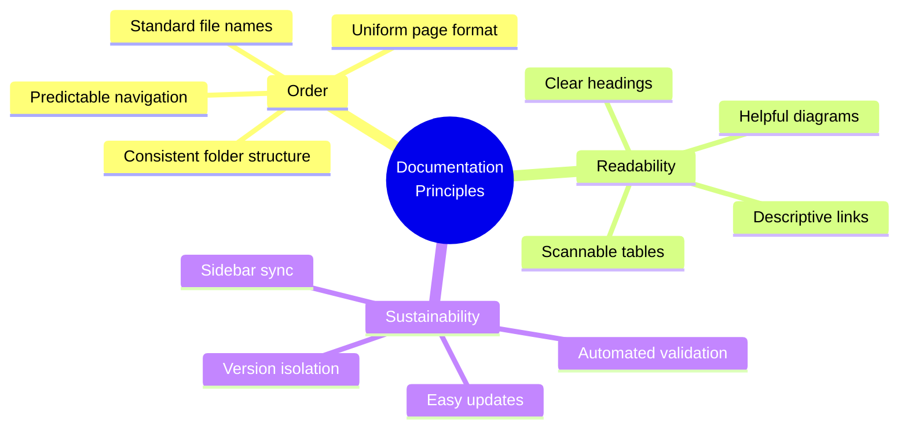

### 1. Order

Folder structure, file names, and page format must be **consistent throughout the project**. Predictability reduces cognitive load — readers shouldn't have to re-learn the structure on every page.

### 2. Readability

Content must be **easy to understand for both new and returning readers**. Assume the reader is intelligent but unfamiliar with the specific context. Define terms, provide examples, and structure content for scanning.

### 3. Sustainability

Documentation must be **easy to update without breaking other parts**. This is why we version, freeze past versions, and automate checks — so the project can grow without accumulating technical debt.

## Documentation Lifecycle

Every page in this documentation follows the same lifecycle — from creation to maintenance.

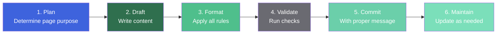

## Folder Structure

All documentation lives inside the `docs/` directory. The structure is deliberate — it separates global pages from versioned content.

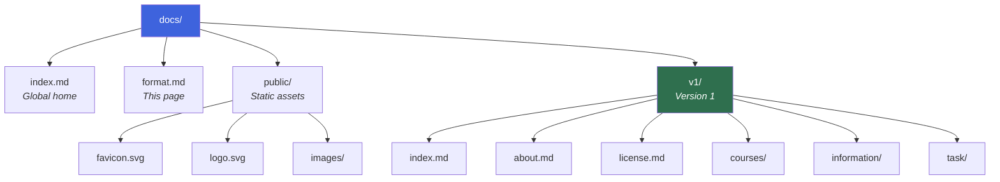

### Text Representation

```text
docs/
├── index.md
├── format.md
├── public/
│   ├── favicon.svg
│   ├── logo.svg
│   └── images/
└── v1/
    ├── index.md
    ├── about.md
    ├── license.md
    ├── courses/
    │   ├── index.md
    │   └── <course-code>/
    │       └── index.md
    ├── information/
    │   ├── index.md
    │   ├── kontak-dosen.md
    │   ├── jadwal-kuliah.md
    │   ├── info-team-pbl.md
    │   └── judul-dan-team-pbl.md
    └── task/
        ├── index.md
        └── <assignment-name>.md
```

### Two Types of Pages

| Type          | Location               | Version Scope           | Examples                           |
| ------------- | ---------------------- | ----------------------- | ---------------------------------- |
| **Global**    | `docs/` root           | Applies to all versions | `index.md`, `format.md`, `public/` |
| **Versioned** | `docs/v1/`, `docs/v2/` | Scoped to one term      | `about.md`, `courses/`, `task/`    |

::: tip Adding a New Version
When a new academic term starts, duplicate the previous version folder (`cp -r docs/v1 docs/v2`) and update the content. Global pages remain shared across versions.
:::

## File Naming Conventions

### General Rules

Four rules govern every file name in the project.

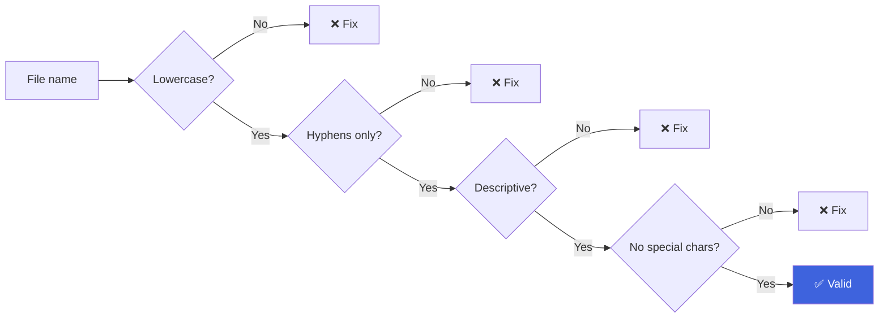

1. **Use all lowercase letters.**
2. **Use hyphens as separators** — not underscores or spaces.
3. **File names must be descriptive and concise.**
4. **Avoid special characters** except hyphens.

### Naming Examples

| Type             | Format                   | Example                           |
| ---------------- | ------------------------ | --------------------------------- |
| Course page      | `<course-code>/index.md` | `rpl105-pemrograman-web/index.md` |
| Lecture material | `materi-XX-<topic>.md`   | `materi-03-linux-basics.md`       |
| Assignment       | `tugas-XX-<name>.md`     | `tugas-01-resume-paper.md`        |
| Daily note       | `catatan-YYYY-MM-DD.md`  | `catatan-2026-09-12.md`           |
| Lab session      | `lab-XX-<name>.md`       | `lab-02-html-css.md`              |
| Midterm exam     | `uts-YYYY-MM-DD.md`      | `uts-2026-10-20.md`               |
| Reference        | `ref-<topic>.md`         | `ref-algoritma-sorting.md`        |

::: warning Two Conventions Coexist
Courses use **folder + `index.md`** (e.g., `rpl105-pemrograman-web/index.md`) so URLs stay clean (`/v1/courses/rpl105-pemrograman-web/`). Other sections use **flat files** (e.g., `kontak-dosen.md`). Choose the pattern that fits the section — consistency within a section matters more than uniformity across sections.
:::

## Frontmatter

Every page must include **frontmatter at the very top**. This is YAML metadata that VitePress reads to render the page correctly.

### Minimum Required

```yaml
---
title: Page Title
description: A short description of the page.
---
```

### Common Fields

| Field         | Required | Purpose                                             |
| ------------- | :------: | --------------------------------------------------- |
| `title`       | **Yes**  | Page title — shown in browser tab, sidebar, and SEO |
| `description` | **Yes**  | Short description for SEO and social sharing        |
| `outline`     |    No    | Set to `deep` for a more detailed table of contents |
| `layout`      |    No    | Set to `home` for landing pages                     |
| `order`       |    No    | Display order in the sidebar                        |
| `draft`       |    No    | Set to `true` to temporarily hide the page          |

### Complete Example

```yaml
---
title: Web-Based Programming
description: Materials, assignments, and notes for the Web-Based Programming course.
outline: deep
order: 6
---
```

### Layout Types

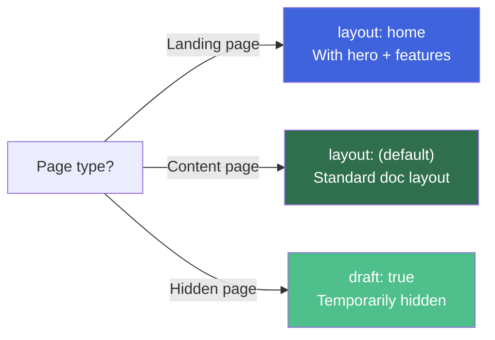

## Markdown Writing Format

### Headings

- Use `#` for the page title — **only once per page**.
- Use `##` for main sections.
- Use `###` for sub-sections.
- **Never skip levels** — do not jump from `##` straight to `####`.

```markdown
# Page Title

## Main Section

### Sub-section

#### Sub-sub-section
```

::: warning Heading Hierarchy
Screen readers rely on logical heading hierarchy for navigation. Skipping levels (e.g., `##` → `####`) breaks accessibility and makes the table of contents harder to follow.
:::

### Paragraphs

- Separate paragraphs with a **single blank line**.
- Keep paragraphs to **three or four lines** when possible.
- Avoid long paragraphs without breaks.

### Text Emphasis

| Format        | Syntax       | Example        |
| ------------- | ------------ | -------------- |
| Bold          | `**text**`   | **important**  |
| Italic        | `_text_`     | _foreign term_ |
| Inline code   | `` `code` `` | `bun install`  |
| Strikethrough | `~~text~~`   | ~~wrong~~      |

### Lists

Use `-` for unordered lists and `1.` for ordered lists:

```markdown
- First item
- Second item
  - Sub-item
  - Another sub-item

1. First step
2. Second step
```

### Links

- **Internal link:** `[Text](/v1/path/without-extension)`
- **External link:** `[Text](https://example.com)`
- **Always use descriptive link text** — avoid phrases like "click here"

```markdown
- [View class schedule](/v1/information/jadwal-kuliah)
- [VitePress documentation](https://vitepress.dev)
```

## Tables

Standard markdown tables with **consistent separators**:

```markdown
| Column 1 | Column 2 | Column 3 |
| -------- | -------- | -------- |
| Data 1   | Data 2   | Data 3   |
| Data 4   | Data 5   | Data 6   |
```

### Alignment

| Left        |   Center    |       Right |
| :---------- | :---------: | ----------: |
| a           |      b      |           c |
| longer text | longer text | longer text |

```markdown
| Left | Center | Right |
| :--- | :----: | ----: |
| a    |   b    |     c |
```

### Table Rules

::: tip Table Best Practices

- **Keep column widths visually balanced** — align pipes where possible.
- **Use bold for the first column** when it labels the row.
- **Avoid overly wide tables** — if a table has more than 6 columns, consider splitting it.
- **Never leave a table cell empty** — use `—` (em dash) if there's no value.
  :::

## Code Blocks

Always specify the language so syntax highlighting works.

### Inline Code

Use backticks for inline code: `const x = 42`.

### Fenced Blocks

````markdown
```ts
const hello = 'world';
```

```bash
bun install
```

```json
{ "key": "value" }
```
````

**Common languages:** `ts`, `js`, `bash`, `json`, `yaml`, `markdown`, `html`, `css`, `sql`, `python`.

### Line Highlighting

To mark important lines:

````markdown
```ts{2}
const a = 1;
const b = 2;
const c = 3;
```
````

### Code Group

For side-by-side code examples (e.g., multiple language versions):

````markdown
::: code-group

```ts [TypeScript]
const x: number = 42;
```

```js [JavaScript]
const x = 42;
```

:::
````

## Admonitions

VitePress supports special boxes to highlight information. Use them consistently and purposefully.

```markdown
::: info Optional Title
General information.
:::

::: tip Tips
Suggestions or good practices.
:::

::: warning Warning
Things to be careful about.
:::

::: danger Danger
Risky or forbidden actions.
:::

::: details Details
Content that can be expanded or collapsed.
:::
```

### Usage Guide

| Type      |  Color  | When to Use                               |
| --------- | :-----: | ----------------------------------------- |
| `info`    |  Blue   | Context or additional explanation         |
| `tip`     |  Green  | Suggestions, shortcuts, or best practices |
| `warning` | Yellow  | Things that may cause problems            |
| `danger`  |   Red   | Dangerous or forbidden actions            |
| `details` | Neutral | Optional content or collapsible sections  |

### Decision Tree

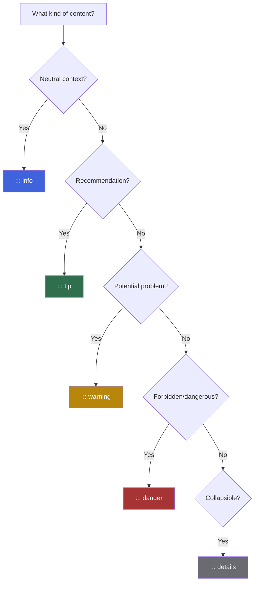

::: warning Avoid Overuse
Admonitions lose impact when overused. If everything is highlighted, nothing is. Reserve them for genuinely important content — not every paragraph.
:::

## Images

Store images under `docs/public/images/`:

```text
docs/public/images/
├── screenshot-web.png
├── diagram-pbl.svg
└── foto-lab.jpg
```

Reference them in markdown:

```markdown

```

### Image Rules

| Rule             | Detail                                                           |
| ---------------- | ---------------------------------------------------------------- |
| **Alt text**     | Always provide descriptive alt text — even for decorative images |
| **File size**    | Keep each image under 500 KB when possible                       |
| **Format**       | `.svg` for diagrams, `.png` for screenshots, `.jpg` for photos   |
| **Large images** | Host externally and link, rather than storing in the repo        |

## Advanced Markdown Features

### Definition Lists

For glossaries:

```markdown
Term
: Explanation of the term.

Another Term
: Explanation of another term.
```

### Footnotes

For supplementary notes:

```markdown
This sentence has a footnote.[^1]

[^1]: This is the footnote content.
```

### Abbreviations

For repeatedly used terms:

```markdown
*[HTML]: HyperText Markup Language

HTML is a markup language.
```

### Text Markers

```markdown
==highlighted text==

++inserted text++

~~subscript~~

^superscript^
```

### Mathematics

For mathematical formulas:

```markdown
Inline: $E = mc^2$

Block:

$$
\int_0^\infty e^{-x^2} dx = \frac{\sqrt{\pi}}{2}
$$
```

### Task Lists

For checklists:

```markdown
- [x] Completed task
- [ ] Incomplete task
- [ ] Another task
```

### Mermaid Diagrams

For visualizations:

````markdown
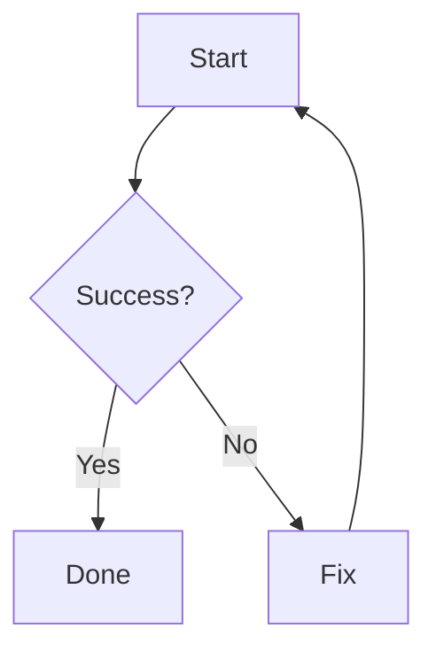
````

::: tip Mermaid Best Practices

- **Keep diagrams focused** — one diagram, one concept.
- **Use readable node names** — short, clear labels.
- **Add `<br/>` for line breaks** inside node labels.
- **Choose the right diagram type:**
  - `flowchart` — process flows
  - `mindmap` — hierarchical concepts
  - `gantt` — timelines
  - `pie` — proportions
  - `erDiagram` — data models
  - `sequenceDiagram` — interactions
  - `timeline` — chronological events
    :::

## Content Rules

### Language

- Use **clear, well-formed English** for English pages and **proper Indonesian** for Indonesian pages.
- Technical terms may remain in English when they are more common that way.
- **Be consistent within a single page** — do not mix languages arbitrarily.

### Tone of Voice

| Aspect          | Guideline                                                |
| --------------- | -------------------------------------------------------- |
| **Formality**   | Formal but not stiff. Avoid overly casual language.      |
| **Objectivity** | Objective. Avoid personal opinions except on note pages. |
| **Conciseness** | Concise. Get to the point and avoid rambling sentences.  |

### Standard Page Structure

Every **course page** must contain at least:

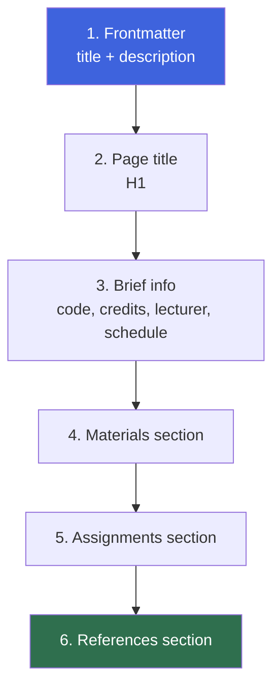

## Date Conventions

Always use **ISO 8601**:

| Format         | Example             | When Used                   |
| -------------- | ------------------- | --------------------------- |
| `YYYY-MM-DD`   | `2026-09-12`        | File names, technical dates |
| `DD MMMM YYYY` | `12 September 2026` | Human-readable content      |

::: warning Avoid Ambiguous Formats
Never use formats like `12/09/26` — they're ambiguous (is it Sept 12 or Dec 9?). Stick to ISO 8601 or spelled-out months.
:::

## Git Commit Rules

### Format

```text
<type>: <short description>
```

### Accepted Types

| Type       | Purpose                               |
| ---------- | ------------------------------------- |
| `feat`     | New content                           |
| `fix`      | Content fix or typo correction        |
| `docs`     | Documentation change                  |
| `chore`    | Routine task                          |
| `refactor` | Restructuring without content change  |
| `style`    | Formatting, whitespace, or semicolons |

### Examples

```text
feat: add RPL105 lecture note for session 3
fix: correct typo in class schedule
docs: update writing format rules
```

::: tip Writing Good Commit Messages

- **Start with the type** — `feat:`, `fix:`, `docs:`, etc.
- **Use imperative mood** — "add", "fix", "update" — not "added", "fixed".
- **Keep the first line under 72 characters.**
- **Describe what changed**, not how — the diff shows the how.
  :::

## Internal Link Rules

Three rules govern every internal link.

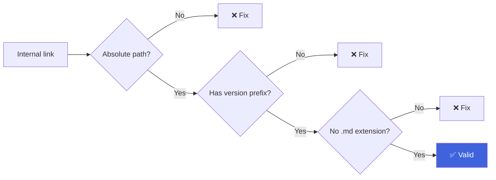

1. **Use absolute paths from the root**, including the version prefix.
2. **Never include the `.md` extension** in the URL.
3. **Never use relative paths** — they break when files are moved.

### Examples

```markdown
✅ Correct: [Web Programming](/v1/courses/rpl105-pemrograman-web/)
❌ Wrong: [Web Programming](../courses/rpl105-pemrograman-web.md)
❌ Wrong: [Web Programming](./rpl105-pemrograman-web)
```

::: warning Why Absolute Paths?
Relative paths break the moment you move a file. Absolute paths (`/v1/...`) stay valid regardless of where the current page lives. This is especially important in a versioned documentation where structure changes between terms.
:::

## Sidebar Rules

The sidebar is configured in `docs/.vitepress/sidebar.json`. Each key is a **path prefix**, and VitePress selects the key with the **longest matching prefix**.

### Structure

```json
{
  "/v1/courses/": [
    {
      "text": "Courses",
      "items": [{ "text": "Overview", "link": "/v1/courses/" }]
    }
  ]
}
```

### How Prefix Matching Works

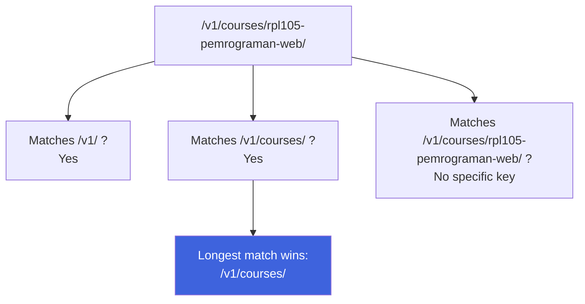

::: warning Every New Page Needs a Sidebar Update
Adding a page without updating the sidebar means the page is **reachable by URL but invisible in navigation**. Always update `sidebar.json` when adding new pages.
:::

## Pre-Commit Checklist

Before running `git commit`, verify each item below.

- [ ] The file has frontmatter with `title` and `description`.
- [ ] The file name follows **kebab-case**.
- [ ] Headings **do not skip levels**.
- [ ] Code blocks **specify their language**.
- [ ] Internal links use **absolute paths with the version prefix**.
- [ ] Tables are **neat and consistent**.
- [ ] There are **no typos**.
- [ ] The file is **properly formatted**.
- [ ] The **sidebar has been updated** if a new page was added.
- [ ] The commit message follows `<type>: <description>`.

::: tip Run Automated Checks
The pre-commit hook runs formatting and linting automatically. But automated checks cannot catch everything — review the checklist manually before pushing.
:::

## Automated Validation

The project provides several commands to maintain quality:

| Command                | Purpose                               |
| ---------------------- | ------------------------------------- |
| `bun run format`       | Auto-format with Prettier             |
| `bun run format:check` | Check format without changing files   |
| `bun run lint`         | Check code quality with ESLint        |
| `bun run typecheck`    | Check types with TypeScript           |
| `bun run rebuild`      | Full clean + format + build + preview |

Run these before committing, or let the pre-commit hook handle them.

::: info CI Integration
The GitHub Actions workflow runs the same checks on every push. If your commit passes locally, it should pass in CI — but always verify.
:::

## Versioning Rules

Because the documentation is versioned, a few extra rules apply.

### Adding a New Version

When a new academic term starts, follow these six steps:

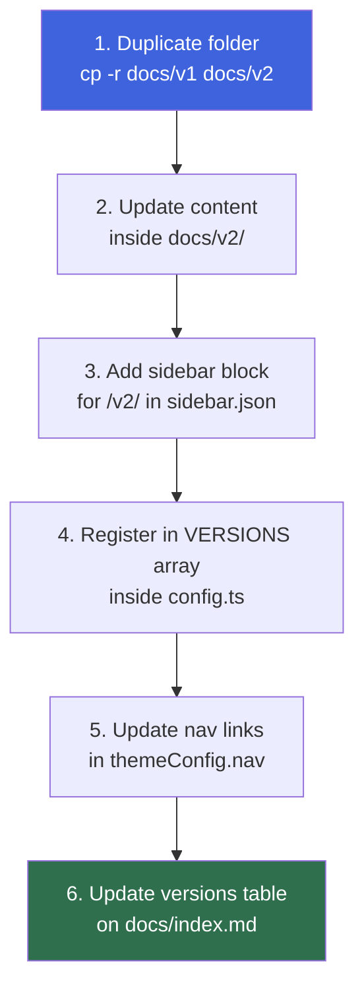

### Editing an Old Version

Past versions are **frozen**. Do not edit them, except for:

- Critical factual errors that mislead readers.
- Broken links that no longer resolve.
- Security or privacy corrections.

If a change is significant, add a note at the top of the affected page and mention it in the changelog.

### Deprecating a Version

Mark a version as **deprecated** in the versions table on `docs/index.md`. Keep the folder and sidebar entries so old links remain valid.

::: danger Never Delete a Version
Do not delete a version unless it has been publicly withdrawn for more than one release cycle. Old links from external sources must remain valid.
:::

## Accessibility Rules

Documentation must be usable by everyone — regardless of ability.

| Rule                   | Detail                                                       |
| ---------------------- | ------------------------------------------------------------ |
| **Alt text**           | Descriptive `alt` text for every image, even decorative ones |
| **Link text**          | Descriptive link text — never raw URLs                       |
| **Contrast**           | Sufficient color contrast when using custom containers       |
| **Color independence** | Do not rely on color alone to convey meaning                 |
| **Heading hierarchy**  | Logical hierarchy — screen readers use it to navigate        |

## SEO Rules

Each page is automatically enhanced by build hooks in `config.ts`:

- `og:title` is generated from the page title and site name.
- `og:image` is set to the site-wide Open Graph image.
- `canonical` is generated from the page path.

### To Keep SEO Healthy

- **Always write a unique `description`** in the frontmatter.
- **Use meaningful, descriptive titles** — not just "Page 1".
- **Avoid duplicate content** across versions unless intentional.
- **Never delete a version folder** without updating the canonical links.

## Performance Rules

| Rule                                                    | Why                                  |
| ------------------------------------------------------- | ------------------------------------ |
| **Prefer `.svg`** for icons and diagrams                | Smaller, scalable, crisp at any size |
| **Keep images under 500 KB**                            | Faster page loads                    |
| **Avoid base64 images in markdown**                     | Bloats file size                     |
| **Use code groups** instead of repeated blocks          | Cleaner and more efficient           |
| **Avoid heavy interactive components** unless necessary | Keeps pages fast                     |

## Relationship to the Study Program's Vision and Mission

These rules are **not a formality**. They support the study program's vision and mission.

### Vision

> To become a vocational study program that is qualified, excellent, adaptive, innovative, and closely partnered with industry and society.

**How this connects:**

- Tidy documentation reflects **quality and excellence**.
- An adaptive structure reflects **adaptability**.
- The use of modern technology reflects **innovation**.

### Mission

> To be active in the process of creating, disseminating, and applying science and technology in software engineering through vocational higher education services and applied research that are qualified, open, relevant, and closely collaborative with society and industry.

**How this connects:**

- **Open and relevant documentation** helps spread knowledge to fellow students and the wider community.
- **Collaborative structure** supports the mission of partnership with society and industry.

## Examples

See existing pages as format references:

| Example                                                         | What It Demonstrates                        |
| --------------------------------------------------------------- | ------------------------------------------- |
| [Class Schedule](/v1/information/jadwal-kuliah)                 | Weekly table formatting, time notation      |
| [PBL Titles and Teams](/v1/information/judul-dan-team-pbl)      | Long-form tables, `::: details` usage       |
| [Courses Overview](/v1/courses/)                                | `layout: home` with hero and features       |
| [RPL105 — Web Programming](/v1/courses/rpl105-pemrograman-web/) | Full course page with all required sections |
| [Root Home](/)                                                  | Global landing page with versions table     |

## FAQ

::: details What if a rule doesn't fit my page?

These rules are designed to be **comprehensive but not rigid**. If a specific page genuinely needs a different approach:

1. **Ask first** — discuss with the maintainer before deviating.
2. **Document the exception** — if approved, note it in the page itself.
3. **Update this page** — if the exception is broadly useful, propose adding it as a rule.

The goal is consistency, not bureaucracy. But change should be deliberate, not ad hoc.

:::

::: details Can I use relative links for nearby pages?

**No.** All internal links must use **absolute paths with version prefix** — even for pages in the same folder. Relative paths break when files move, and moving is inevitable in a versioned documentation.

The correct format: `[Text](/v1/courses/rpl105-pemrograman-web/)`

:::

::: details How often should I update the sidebar?

**Every time you add a new page.** The sidebar does not auto-update. If you add a page and forget the sidebar, the page becomes orphaned — reachable by URL but invisible in navigation.

Consider this checklist item as important as frontmatter.

:::

::: details What if I need to correct a page in a frozen version?

**Only for critical corrections:**

- Factual errors that mislead readers
- Broken links that no longer resolve
- Security or privacy issues

For anything else, add the correction to the current version instead. Past versions are historical artifacts — they represent what was true at that time.

:::

::: details Can I write in Bahasa Indonesia instead of English?

**Yes — but be consistent within a page.** The documentation supports both languages:

- **English pages** — for pages aimed at a broader audience.
- **Indonesian pages** — for pages tied to Indonesian academic context.

Course pages and information pages often use Indonesian because they mirror Indonesian academic terminology. Format guides, technical documentation, and contribution rules are typically English.

:::

::: details How do I handle a page that needs many images?

Store images in `docs/public/images/` and reference them by absolute path. If the page has more than 10 images:

1. **Group them** by section with clear headings.
2. **Consider** whether some could be hosted externally.
3. **Optimize** images before committing — compress PNGs, use SVG where possible.

If a page becomes image-heavy, consider splitting it into multiple pages.

:::

::: details Why do some pages use folders and others use flat files?

**Folders are used when the page has sub-pages.** For example:

- `courses/rpl105-pemrograman-web/index.md` — because the course might have materials, assignments, and sub-pages.
- `information/kontak-dosen.md` — a single flat file because there are no sub-pages.

The choice depends on the page's expected growth. If a page will likely have sub-content, start with a folder. Otherwise, a flat file is fine.

:::

::: details Can I add a new field to frontmatter?

**Only if the build system supports it.** VitePress reads specific fields (`title`, `description`, `outline`, `layout`, `order`, `draft`). Adding arbitrary fields has no effect.

If you need a new field, you would need to modify the build hooks in `config.ts` to use it. Consult the maintainer before doing so.

:::

::: details How do I handle code that spans multiple languages?

Use the **`::: code-group`** directive:

````markdown
::: code-group

```ts [TypeScript]
const x: number = 42;
```

```js [JavaScript]
const x = 42;
```

:::

This creates a tabbed interface — cleaner than repeating blocks.

:::

::: details What is the difference between "frozen" and "deprecated"?

| Term           | Meaning                                                                                                      |
| -------------- | ------------------------------------------------------------------------------------------------------------ |
| **Frozen**     | The version exists and is accessible, but no new content is added. Only critical corrections.                |
| **Deprecated** | The version is marked as outdated in the versions table — still accessible, but discouraged for new readers. |
| **Deleted**    | Removed entirely — only after the version has been withdrawn for more than one release cycle.                |

A version can be **frozen without being deprecated** — e.g., v1 is frozen once v2 is released, but still considered "the previous valid version" for reference.

:::

## Related Pages

| Page                        | Description                              |
| --------------------------- | ---------------------------------------- |
| [**Root Home**](/)          | Project home — versions, getting started |
| [**Version 1**](/v1/)       | First semester documentation             |
| [**About**](/v1/about)      | About this project and its maintainer    |
| [**License**](/license)     | Licensing terms for all content          |
| [**Courses**](/v1/courses/) | Course list with materials               |

## Final Notes

::: tip These Rules Will Evolve
Documentation format rules are not static. If a better approach emerges — from this project or from the wider documentation community — discuss it before applying it broadly.

The goal is not adherence to rules for their own sake. The goal is **consistent, readable, sustainable documentation** that serves students, lecturers, and the wider community.
:::

::: warning Discuss Before Deviating
If you find a rule that doesn't fit your use case, **open an issue or start a discussion** — do not silently deviate. Silent deviation erodes the consistency that makes this documentation valuable.
:::
````
