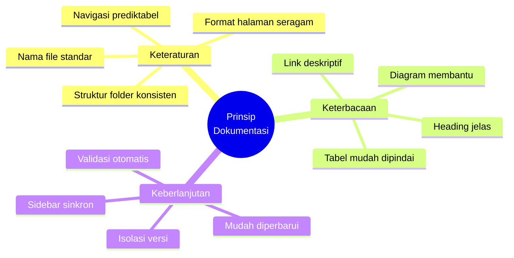
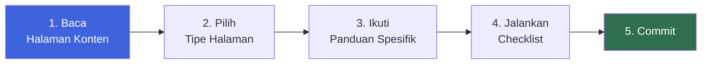

::: tip Tujuan Halaman Ini
Folder `format/` adalah **pusat referensi** untuk semua panduan penulisan dokumentasi. Setiap file di dalamnya fokus pada satu aspek spesifik, sehingga lebih mudah dipelajari dan dipelihara.
:::

## Panduan yang Tersedia

Folder `format/` berisi lima halaman panduan yang saling melengkapi:

| Halaman                                    | Fokus                                | Untuk Apa                      |
| ------------------------------------------ | ------------------------------------ | ------------------------------ |
| [**Halaman Konten**](/format/page)         | Format penulisan markdown lengkap    | Menulis halaman konten standar |
| [**Halaman Homepage**](/format/homepage)   | Layout `home` dengan hero + features | Membuat landing page           |
| [**Halaman Tugas**](/format/task)          | Format halaman tugas & assignment    | Menulis halaman tugas          |
| [**Tugas Selesai**](/format/task-complite) | Marking tugas yang sudah selesai     | Menandai tugas yang tuntas     |
| [**Format Lengkap**](/format/page)         | Aturan lengkap dalam satu halaman    | Referensi komprehensif         |

## Tiga Prinsip Utama

Semua aturan dalam folder ini berpijak pada tiga prinsip:



### 1. Keteraturan

Struktur folder, nama file, dan format halaman harus **konsisten di seluruh proyek**. Prediktabilitas mengurangi beban kognitif — pembaca tidak perlu mempelajari ulang struktur di setiap halaman.

### 2. Keterbacaan

Konten harus **mudah dipahami oleh pembaca baru maupun yang kembali**. Asumsikan pembaca cerdas tapi belum familiar dengan konteks spesifik. Definisikan istilah, berikan contoh, dan susun konten agar mudah dipindai.

### 3. Keberlanjutan

Dokumentasi harus **mudah diperbarui tanpa merusak bagian lain**. Karena itu kami menerapkan versioning, membekukan versi lama, dan mengotomatiskan validasi — supaya proyek bisa tumbuh tanpa menumpuk utang teknis.

## Mulai dari Mana?

Jika kamu baru pertama kali menulis halaman di dokumentasi ini:



| Langkah | Aksi                                          | Panduan                                              |
| :-----: | --------------------------------------------- | ---------------------------------------------------- |
|  **1**  | Pelajari format penulisan dasar               | [Halaman Konten](/format/page)                       |
|  **2**  | Tentukan tipe halaman (konten / home / tugas) | —                                                    |
|  **3**  | Buka panduan spesifik untuk tipe tersebut     | [Homepage](/format/homepage) · [Tugas](/format/task) |
|  **4**  | Jalankan pre-commit checklist                 | [Checklist](/format/page#pre-commit-checklist)       |
|  **5**  | Commit dengan format yang benar               | [Commit Rules](/format/page#git-commit-rules)        |

## Ringkasan Cepat

Aturan yang paling sering dipakai, diringkas untuk pencarian cepat:

| Topik             | Aturan                                                         |
| ----------------- | -------------------------------------------------------------- |
| **Nama file**     | Lowercase, kebab-case, deskriptif — `pemrograman-web.md`       |
| **Judul halaman** | Hanya satu `#` per halaman                                     |
| **Frontmatter**   | Wajib ada `title` dan `description`                            |
| **Link internal** | Path absolut dengan prefix versi — `/v1/courses/`, tanpa `.md` |
| **Code block**    | Selalu sebutkan bahasa — ` ```ts `                             |
| **Tabel**         | Separator konsisten dengan penanda alignment                   |
| **Admonitions**   | `info`, `tip`, `warning`, `danger`, `details`                  |
| **Commit format** | `<tipe>: <deskripsi singkat>`                                  |
| **Versioning**    | Folder baru per semester — `v1/`, `v2/`                        |
| **Checklist**     | Jalankan pre-commit checklist sebelum setiap commit            |

## Halaman Terkait

| Halaman                                    | Deskripsi                                  |
| ------------------------------------------ | ------------------------------------------ |
| [**Root Home**](/)                         | Homepage utama proyek — daftar semua versi |
| [**Halaman Konten**](/format/page)         | Panduan lengkap format penulisan           |
| [**Halaman Homepage**](/format/homepage)   | Panduan layout `home`                      |
| [**Halaman Tugas**](/format/task)          | Panduan halaman tugas                      |
| [**Tugas Selesai**](/format/task-complite) | Panduan menandai tugas selesai             |

::: info Tentang Halaman Ini
Halaman ini adalah **indeks** dari folder `format/`. Semua panduan detail tersedia di halaman-halaman spesifik yang ditautkan di atas.
:::
