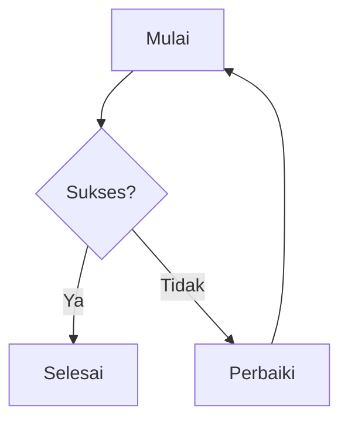

# Panduan Halaman Konten

Halaman ini menjelaskan cara menulis **halaman konten standar** di dokumentasi Lectures — mencakup format penulisan markdown, konvensi penamaan file, dan aturan kontribusi.

::: info Untuk Siapa Panduan Ini?
Panduan ini untuk siapa saja yang menulis halaman **konten** — bukan halaman `layout: home` (lihat [Halaman Homepage](/format/homepage)), bukan halaman tugas (lihat [Halaman Tugas](/format/task)).
:::

## Prinsip Dasar

Tiga prinsip yang menjadi fondasi:

1. **Keteraturan.** Struktur folder, nama file, dan format halaman harus konsisten.
2. **Keterbacaan.** Konten harus mudah dipahami oleh pembaca baru dan lama.
3. **Keberlanjutan.** Dokumentasi harus mudah diperbarui tanpa merusak bagian lain.

## Struktur Folder

Seluruh dokumentasi berada di dalam direktori `docs/`:

```text
docs/
├── index.md
├── license.md
├── format/
│   ├── index.md
│   ├── homepage.md
│   ├── page.md
│   ├── task.md
│   └── task-complite.md
├── public/
│   ├── favicon.svg
│   └── images/
└── v1/
    ├── index.md
    ├── about.md
    ├── courses/
    ├── information/
    └── task/
```

Setiap rilis dokumentasi baru disimpan di folder baru seperti `v2/`, `v3/`, dan seterusnya. Halaman global seperti `format/` dan aset di `public/` tidak bergantung pada versi.

## Konvensi Penamaan File

### Aturan Umum

- Gunakan **huruf kecil semua**.
- Gunakan **hyphen** sebagai pemisah, bukan underscore atau spasi.
- Nama file harus **deskriptif dan ringkas**.
- Hindari karakter khusus kecuali hyphen.

### Contoh Penamaan

| Tipe                | Format                  | Contoh                            |
| ------------------- | ----------------------- | --------------------------------- |
| Halaman mata kuliah | `<kode-mk>/index.md`    | `rpl105-pemrograman-web/index.md` |
| Materi kuliah       | `materi-XX-<topik>.md`  | `materi-03-linux-basics.md`       |
| Tugas               | `tugas-XX-<nama>.md`    | `tugas-01-resume-paper.md`        |
| Catatan harian      | `catatan-YYYY-MM-DD.md` | `catatan-2026-09-12.md`           |
| Sesi lab            | `lab-XX-<nama>.md`      | `lab-02-html-css.md`              |
| UTS                 | `uts-YYYY-MM-DD.md`     | `uts-2026-10-20.md`               |
| Referensi           | `ref-<topik>.md`        | `ref-algoritma-sorting.md`        |

## Frontmatter

Setiap halaman **wajib** menyertakan frontmatter di bagian paling atas:

```yaml
---
title: Judul Halaman
description: Deskripsi singkat halaman.
---
```

### Field Umum

| Field         | Wajib | Fungsi                                            |
| ------------- | :---: | ------------------------------------------------- |
| `title`       |  Ya   | Judul halaman, tampil di tab browser dan sidebar  |
| `description` |  Ya   | Deskripsi singkat untuk SEO                       |
| `outline`     | Tidak | Set ke `deep` untuk daftar isi lebih detail       |
| `layout`      | Tidak | Set ke `home` untuk landing page                  |
| `order`       | Tidak | Urutan tampil di sidebar                          |
| `draft`       | Tidak | Set `true` untuk menyembunyikan halaman sementara |

### Contoh Lengkap

```yaml
---
title: Pemrograman Berbasis Web
description: Materi, tugas, dan catatan untuk mata kuliah Pemrograman Berbasis Web.
outline: deep
order: 6
---
```

## Format Penulisan Markdown

### Heading

- Gunakan `#` untuk judul halaman, **hanya sekali per halaman**.
- Gunakan `##` untuk section utama.
- Gunakan `###` untuk sub-section.
- **Jangan lompati level** — misal dari `##` langsung ke `####`.

```markdown
# Judul Halaman

## Section Utama

### Sub-section

#### Sub-sub-section
```

### Paragraf

- Pisahkan paragraf dengan **satu baris kosong**.
- Usahakan paragraf **3–4 baris**.
- Hindari paragraf panjang tanpa jeda.

### Penekanan Teks

| Format        | Sintaks      | Contoh          |
| ------------- | ------------ | --------------- |
| Bold          | `**teks**`   | **penting**     |
| Italic        | `_teks_`     | _istilah asing_ |
| Inline code   | `` `kode` `` | `bun install`   |
| Strikethrough | `~~teks~~`   | ~~salah~~       |

### Daftar

Gunakan `-` untuk daftar tak berurut dan `1.` untuk daftar berurut:

```markdown
- Item pertama
- Item kedua
  - Sub-item

1. Langkah pertama
2. Langkah kedua
```

### Link

- **Internal:** `[Teks](/v1/path/tanpa-ekstensi)`
- **Eksternal:** `[Teks](https://contoh.com)`
- **Selalu gunakan teks deskriptif** — hindari "klik di sini"

```markdown
- [Lihat jadwal kuliah](/v1/information/jadwal-kuliah)
- [Dokumentasi VitePress](https://vitepress.dev)
```

## Tabel

Gunakan tabel markdown standar dengan separator konsisten:

```markdown
| Kolom 1 | Kolom 2 | Kolom 3 |
| ------- | ------- | ------- |
| Data 1  | Data 2  | Data 3  |
```

### Alignment

| Kiri | Tengah | Kanan |
| :--- | :----: | ----: |
| a    |   b    |     c |

```markdown
| Kiri | Tengah | Kanan |
| :--- | :----: | ----: |
| a    |   b    |     c |
```

## Code Block

Selalu sebutkan bahasa untuk syntax highlighting:

````markdown
```ts
const hello = 'world';
```

```bash
bun install
```

```json
{ "key": "value" }
```
````

Bahasa umum: `ts`, `js`, `bash`, `json`, `yaml`, `markdown`, `html`, `css`, `sql`, `python`.

### Line Highlighting

````markdown
```ts{2}
const a = 1;
const b = 2;
const c = 3;
```
````

````

## Admonitions

VitePress mendukung kotak khusus:

```markdown
::: info Judul Opsional
Informasi umum.
:::

::: tip Tips
Saran atau praktik baik.
:::

::: warning Peringatan
Hal yang perlu dihati-hati.
:::

::: danger Bahaya
Tindakan berisiko atau terlarang.
:::

::: details Detail
Konten yang bisa diperluas atau diringkas.
:::
````

### Panduan Penggunaan

| Tipe      | Kapan Dipakai                        |
| --------- | ------------------------------------ |
| `info`    | Konteks atau penjelasan tambahan     |
| `tip`     | Saran, shortcut, atau praktik baik   |
| `warning` | Hal yang mungkin menimbulkan masalah |
| `danger`  | Tindakan berbahaya atau terlarang    |
| `details` | Konten opsional atau spoiler         |

## Gambar

Simpan gambar di `docs/public/images/`:

```text
docs/public/images/
├── screenshot-web.png
├── diagram-pbl.svg
└── foto-lab.jpg
```

Referensikan di markdown:

```markdown

```

### Aturan Gambar

- Selalu berikan **alt text** deskriptif.
- Jaga ukuran file **di bawah 500 KB**.
- Format: `.svg` untuk diagram, `.png` untuk screenshot, `.jpg` untuk foto.
- Untuk gambar besar, host di luar repositori.

## Fitur Markdown Lanjutan

### Definition List

```markdown
Istilah
: Penjelasan istilah.

Istilah Lain
: Penjelasan istilah lain.
```

### Footnote

```markdown
Kalimat ini punya catatan kaki.[^1]

[^1]: Isi catatan kaki.
```

### Abbreviation

```markdown
*[HTML]: HyperText Markup Language

HTML adalah bahasa markup.
```

### Marker Teks

```markdown
==teks disorot==

++teks disisipkan++

~~subskrip~~

^superskrip^
```

### Matematika

```markdown
Inline: $E = mc^2$

Block:

$$
\int_0^\infty e^{-x^2} dx = \frac{\sqrt{\pi}}{2}
$$
```

### Task List

```markdown
- [x] Tugas selesai
- [ ] Tugas belum
- [ ] Tugas lain
```

### Diagram Mermaid

````markdown

````

## Aturan Konten

### Bahasa

- Gunakan **bahasa Inggris** yang baik untuk halaman Inggris dan **Bahasa Indonesia** yang baik untuk halaman Indonesia.
- Istilah teknis boleh tetap dalam bahasa Inggris jika lebih umum.
- **Konsisten dalam satu halaman**.

### Nada

- **Formal tapi tidak kaku.** Hindari bahasa terlalu kasual.
- **Objektif.** Hindari opini pribadi kecuali di halaman catatan.
- **Ringkas.** Langsung ke inti, hindari kalimat bertele-tele.

### Struktur Halaman Standar

Setiap halaman mata kuliah minimal harus berisi:

1. Frontmatter dengan `title` dan `description`.
2. Judul halaman.
3. Info singkat: kode mata kuliah, SKS, dosen, jadwal.
4. Section materi.
5. Section tugas.
6. Section referensi.

## Konvensi Tanggal

Selalu gunakan **ISO 8601**:

| Format         | Contoh              | Kapan Dipakai              |
| -------------- | ------------------- | -------------------------- |
| `YYYY-MM-DD`   | `2026-09-12`        | Nama file, tanggal teknis  |
| `DD MMMM YYYY` | `12 September 2026` | Konten yang dibaca manusia |

## Aturan Git Commit

Format commit:

```text
<tipe>: <deskripsi singkat>
```

Tipe yang diterima:

| Tipe       | Fungsi                                 |
| ---------- | -------------------------------------- |
| `feat`     | Konten baru                            |
| `fix`      | Perbaikan konten atau typo             |
| `docs`     | Perubahan dokumentasi                  |
| `chore`    | Tugas rutin                            |
| `refactor` | Restrukturisasi tanpa mengubah konten  |
| `style`    | Formatting, whitespace, atau semicolon |

Contoh:

```text
feat: add RPL105 lecture note for session 3
fix: correct typo in class schedule
docs: update writing format rules
```

## Aturan Link Internal

- Gunakan **path absolut dari root**, termasuk prefix versi.
- **Jangan sertakan ekstensi `.md`** di URL.
- **Jangan gunakan path relatif** — rusak saat file dipindah.

```markdown
✅ Benar: [Pemrograman Web](/v1/courses/rpl105-pemrograman-web/)
❌ Salah: [Pemrograman Web](../courses/rpl105-pemrograman-web.md)
❌ Salah: [Pemrograman Web](./rpl105-pemrograman-web)
```

## Aturan Sidebar

Sidebar dikonfigurasi di `docs/.vitepress/sidebar.json`. Setiap key adalah prefix path, dan VitePress memilih key dengan prefix terpanjang yang cocok.

```json
{
  "/v1/courses/": [
    {
      "text": "Courses",
      "items": [{ "text": "Overview", "link": "/v1/courses/" }]
    }
  ]
}
```

Setiap halaman baru **wajib** diikuti dengan update sidebar.

## Checklist Pre-Commit

Sebelum `git commit`, pastikan:

- [ ] File punya frontmatter dengan `title` dan `description`.
- [ ] Nama file mengikuti **kebab-case**.
- [ ] Heading **tidak melompati level**.
- [ ] Code block **menyebutkan bahasanya**.
- [ ] Link internal menggunakan **path absolut dengan prefix versi**.
- [ ] Tabel rapi dan konsisten.
- [ ] Tidak ada typo.
- [ ] File **terformat dengan benar**.
- [ ] **Sidebar sudah diperbarui** jika menambah halaman.
- [ ] Commit message mengikuti `<tipe>: <deskripsi>`.

## Validasi Otomatis

| Command                | Fungsi                                |
| ---------------------- | ------------------------------------- |
| `bun run format`       | Auto-format dengan Prettier           |
| `bun run format:check` | Cek format tanpa mengubah file        |
| `bun run lint`         | Cek kualitas kode dengan ESLint       |
| `bun run typecheck`    | Cek tipe dengan TypeScript            |
| `bun run rebuild`      | Full clean + format + build + preview |

## Aturan Versioning

Karena dokumentasi di-version, ada beberapa aturan tambahan.

### Menambah Versi Baru

Saat semester baru dimulai:

1. Duplikasi folder versi sebelumnya: `cp -r docs/v1 docs/v2`
2. Update konten di dalam `docs/v2/`.
3. Tambahkan blok untuk `/v2/` di `docs/.vitepress/sidebar.json`.
4. Daftarkan versi baru di array `VERSIONS` di `docs/.vitepress/config.ts`.
5. Update link navigasi di `themeConfig.nav`.
6. Update tabel versi di `docs/index.md`.

### Mengedit Versi Lama

Versi lama **dibekukan**. Jangan edit, kecuali:

- Kesalahan faktual kritis yang menyesatkan pembaca.
- Link rusak yang tidak resolve.
- Koreksi keamanan atau privasi.

### Deprekasi Versi

Tandai versi sebagai **deprecated** di tabel versi `docs/index.md`. Simpan folder dan entri sidebar agar link lama tetap valid.

## Aturan Aksesibilitas

- Berikan `alt` text deskriptif untuk setiap gambar.
- Gunakan teks link deskriptif, bukan URL mentah.
- Jaga kontras warna yang cukup.
- Jangan mengandalkan warna saja untuk menyampaikan makna.
- Jaga hierarki heading tetap logis.

## Aturan SEO

Setiap halaman otomatis ditingkatkan oleh build hook di `config.ts`:

- `og:title` di-generate dari judul halaman dan nama situs.
- `og:image` diset ke gambar Open Graph situs.
- `canonical` di-generate dari path halaman.

Untuk menjaga SEO:

- Selalu tulis `description` unik di frontmatter.
- Gunakan judul yang bermakna.
- Hindari duplikasi konten antar versi.

## Aturan Performa

- Prefer `.svg` untuk ikon dan diagram.
- Jaga ukuran gambar di bawah 500 KB.
- Hindari menyematkan gambar base64 besar.
- Gunakan code group untuk blok berulang.
- Jangan sertakan komponen interaktif berat kecuali perlu.

## Hubungan dengan Visi dan Misi Program Studi

Aturan ini bukan formalitas — mereka mendukung visi dan misi program studi.

**Visi:**

> Menjadi program studi vokasi yang berkualitas, unggul, adaptif, inovatif, dan bermitra erat dengan industri dan masyarakat.

**Misi:**

> Aktif dalam proses penciptaan, penyebaran, dan penerapan ilmu pengetahuan dan teknologi di bidang rekayasa perangkat lunak melalui layanan pendidikan tinggi vokasi dan penelitian terapan yang berkualitas, terbuka, relevan, dan kolaboratif dengan masyarakat dan industri.

## FAQ

::: details Bagaimana jika ada aturan yang tidak cocok?

Aturan ini dirancang **komprehensif tapi tidak kaku**. Jika halaman spesifik butuh pendekatan berbeda:

1. **Diskusikan dulu** dengan maintainer.
2. **Dokumentasikan pengecualian**.
3. **Update halaman ini** jika pengecualian berguna secara umum.

:::

::: details Bisakah pakai link relatif?

**Tidak.** Semua link internal wajib pakai **path absolut dengan prefix versi**.

:::

::: details Kapan sidebar perlu diupdate?

**Setiap kali menambah halaman baru.** Sidebar tidak auto-update.

:::

## Halaman Terkait

| Halaman                                    | Deskripsi                      |
| ------------------------------------------ | ------------------------------ |
| [**Format & Rules**](/format/page)         | Landing page panduan format    |
| [**Halaman Homepage**](/format/homepage)   | Panduan layout `home`          |
| [**Halaman Tugas**](/format/task)          | Panduan halaman tugas          |
| [**Tugas Selesai**](/format/task-complite) | Panduan menandai tugas selesai |

::: warning Catatan
Aturan ini dapat berkembang seiring waktu. Jika ada format yang lebih baik, diskusikan dulu sebelum diterapkan secara luas.
:::
