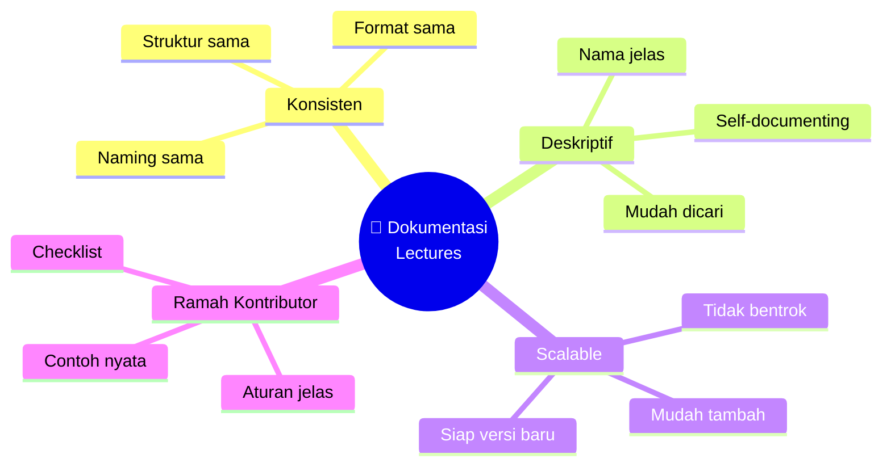
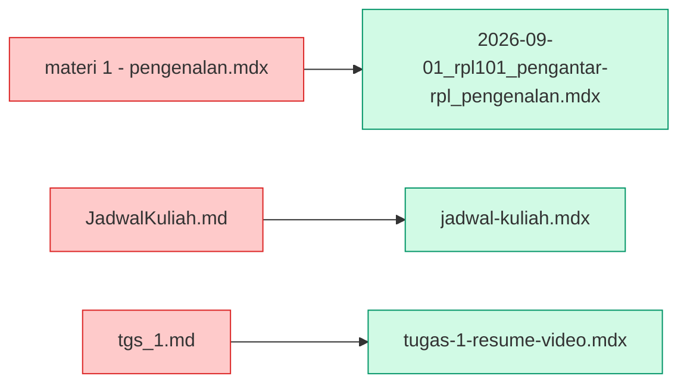
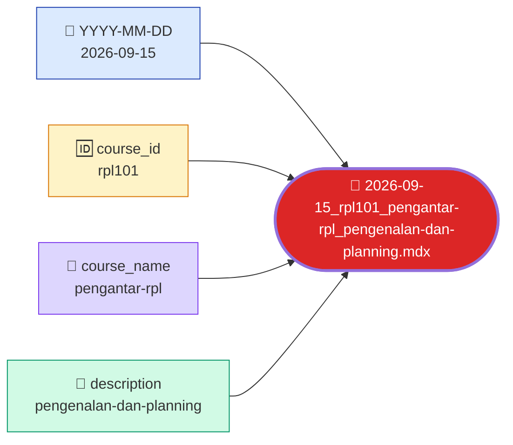
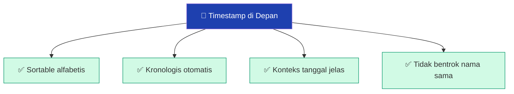
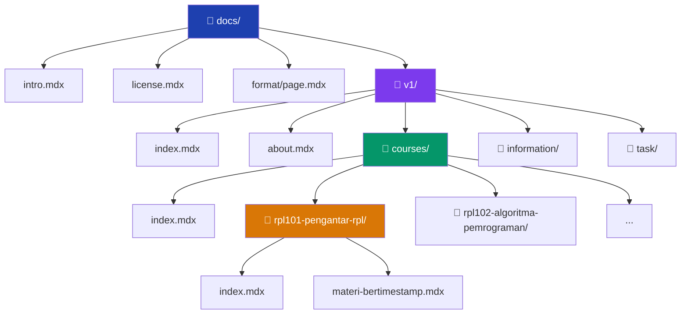
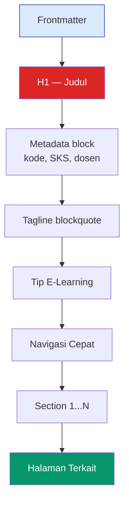
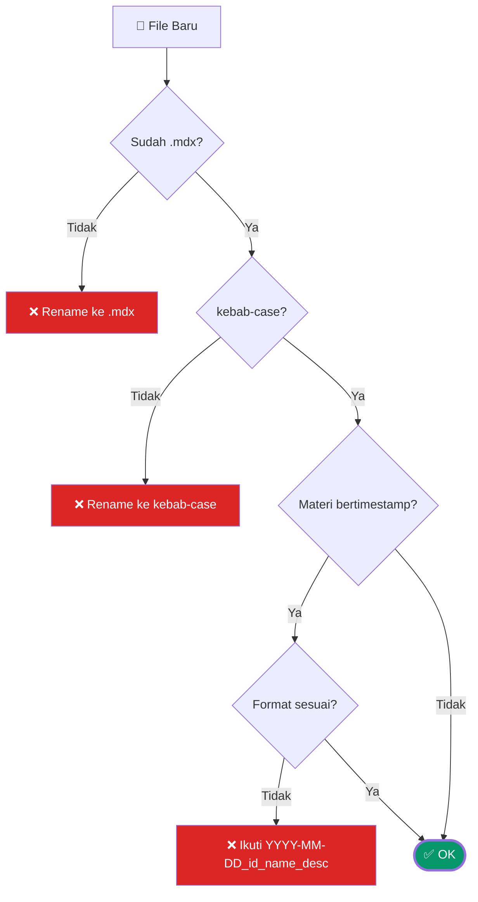

# Format & Aturan Dokumentasi

Konvensi penulisan, aturan penamaan file, dan panduan kontribusi agar dokumentasi tetap konsisten.

:::tip Tujuan Halaman Ini
Halaman ini adalah **referensi tunggal** untuk siapa saja yang menulis, mengedit, atau menambahkan konten di dokumentasi **Lectures**. Ikuti konvensi di sini agar struktur tetap konsisten, mudah dicari, dan tidak berantakan seiring bertambahnya konten.
:::

## Navigasi Cepat

- [Prinsip Dasar](#prinsip-dasar)
- [Penamaan File](#penamaan-file)
- [Konvensi Materi Bertimestamp](#konvensi-materi-bertimestamp)
- [Ekstensi](#ekstensi)
- [Frontmatter](#frontmatter)
- [Struktur Folder](#struktur-folder)
- [Urutan Sidebar](#urutan-sidebar)
- [Format Konten](#format-konten)
- [MDX Gotchas](#mdx-gotchas)
- [Checklist Kontribusi](#checklist-kontribusi)

---

## Prinsip Dasar

Empat prinsip yang jadi dasar semua aturan di bawah:



| Prinsip               | Artinya                                                      |
| --------------------- | ------------------------------------------------------------ |
| **Konsisten**         | Pola sama di semua file — tidak ada pengecualian.            |
| **Deskriptif**        | Nama file & folder menjelaskan isinya tanpa perlu dibuka.    |
| **Scalable**          | Struktur tetap rapi ketika konten bertambah (v2, v3, dst.).  |
| **Ramah Kontributor** | Siapa pun bisa ikut menulis tanpa harus bertanya-tanya dulu. |

---

## Penamaan File

Aturan umum: **kebab-case**, **lowercase**, **deskriptif**.

| Aturan         | Benar               | Salah              |
| -------------- | ------------------- | ------------------ |
| **kebab-case** | `kontak-dosen.mdx`  | `kontakDosen.mdx`  |
| **lowercase**  | `jadwal-kuliah.mdx` | `JadwalKuliah.mdx` |
| **deskriptif** | `info-team-pbl.mdx` | `itp.mdx`          |

### Hindari

| Karakter           | Contoh Salah        | Kenapa Salah                            |
| ------------------ | ------------------- | --------------------------------------- |
| **Spasi**          | `kontak dosen.mdx`  | URL harus di-encode jadi `%20`.         |
| **Kapital campur** | `JadwalKuliah.mdx`  | Case-sensitive di server Linux; kacau.  |
| **Underscore**     | `kontak_dosen.mdx`  | Bukan konvensi web; diganti kebab-case. |
| **Singkatan**      | `jk.mdx`, `itp.mdx` | Tidak deskriptif, sulit dicari.         |
| **Karakter unik**  | `kontak-dosen!.mdx` | Bisa bermasalah di URL & Git.           |

### Contoh Konversi



---

## Konvensi Materi Bertimestamp

Untuk file **materi perkuliahan** (bukan `index.mdx`), wajib pakai pola:

```text
{YYYY-MM-DD}_{course_id}_{course_name}_{description}.mdx
```

### Anatomi



### Aturan Tiap Komponen

| Komponen        | Format                         | Contoh                                  |
| --------------- | ------------------------------ | --------------------------------------- |
| **timestamp**   | ISO 8601 (`YYYY-MM-DD`)        | `2026-09-15`                            |
| **course_id**   | kode lowercase, tanpa spasi    | `rpl101`, `rpl106`, `pk001`             |
| **course_name** | sama dengan nama folder        | `pengantar-rpl`, `pengantar-basis-data` |
| **description** | kebab-case, deskriptif singkat | `pengenalan-dan-planning`, `er-diagram` |

### Contoh Lengkap

| File Lama                    | File Baru                                                                   |
| ---------------------------- | --------------------------------------------------------------------------- |
| `materi-01-pengenalan.md`    | `2026-09-01_rpl101_pengantar-rpl_pengenalan-dan-planning.mdx`               |
| `materi-02-analisy.md`       | `2026-09-08_rpl101_pengantar-rpl_analisis.mdx`                              |
| `15-09-2026-rpl104-intro.md` | `2026-09-15_rpl104_analisis-kebutuhan-pl_intro-requirement-engineering.mdx` |

### Kenapa Pakai Timestamp?



Dengan timestamp di depan, saat `ls` atau sorting di file explorer, file akan otomatis urut kronologis — sesuai urutan pertemuan.

### Pengecualian

**`index.mdx`** di setiap folder **tidak pakai timestamp** — dia adalah landing page folder tersebut.

| File                                                          | Fungsi              |
| ------------------------------------------------------------- | ------------------- |
| `rpl106-pengantar-basis-data/index.mdx`                       | Landing page RPL106 |
| `rpl106-pengantar-basis-data/2026-09-01_..._introduction.mdx` | Materi pertemuan 1  |
| `rpl106-pengantar-basis-data/2026-09-08_..._er-diagram.mdx`   | Materi pertemuan 2  |

---

## Ekstensi

Semua file dokumentasi pakai **`.mdx`** — Markdown + JSX. Konten murni Markdown tetap valid, tapi kita dapat kemampuan MDX saat butuh komponen.

### `.md` vs `.mdx`

| Aspek                   | `.md`          | `.mdx`                                   |
| ----------------------- | -------------- | ---------------------------------------- |
| **Markdown**            | ✅ Didukung    | ✅ Didukung                              |
| **JSX / React**         | ❌ Tidak       | ✅ Ya                                    |
| **Impor komponen**      | ❌ Tidak       | ✅ Ya (`import Tabs from '@theme/Tabs'`) |
| **Direktif Docusaurus** | ✅ Ya          | ✅ Ya                                    |
| **Cocok untuk**         | Dokumen statis | Semua dokumentasi (default)              |

:::warning Wajib `.mdx`
Di dokumentasi Lectures, **semua file dokumentasi wajib `.mdx`**. Tidak boleh ada `.md` — kecuali file lain di luar `docs/` (mis. `README.md` di root repo).
:::

### Cek File `.md` yang Tersisa

```bash
# Cari semua .md di folder docs
find docs -name '*.md' -not -name '*.mdx'

# Kalau ada, rename massal:
find docs -name '*.md' -not -name '*.mdx' -exec sh -c 'mv "$1" "${1%.md}.mdx"' _ {} \;
```

---

## Frontmatter

Setiap file **wajib** punya minimal:

```yaml
---
title: Judul Halaman
description: Deskripsi singkat (opsional tapi disarankan).
---
```

### Frontmatter Lengkap

```yaml
---
title: Judul Halaman yang Jelas
description: Deskripsi singkat 1-2 kalimat untuk SEO dan preview.
slug: /path/kustom/jika-perlu
sidebar_position: 10
sidebar_label: Label Singkat (opsional)
---
```

| Field                  | Wajib | Fungsi                                                     |
| ---------------------- | :---: | ---------------------------------------------------------- |
| **`title`**            |  ✅   | Judul halaman — tampil di tab browser & TOC.               |
| **`description`**      |  ⚠️   | Deskripsi untuk SEO & social preview (sangat disarankan).  |
| **`slug`**             |  ⚠️   | URL kustom — pakai kalau nama file punya timestamp.        |
| **`sidebar_position`** |  ⚠️   | Urutan di sidebar — makin kecil, makin atas.               |
| **`sidebar_label`**    |  ❌   | Label alternatif di sidebar kalau `title` terlalu panjang. |

### Contoh Frontmatter per Tipe

**Landing page folder** (`index.mdx`):

```yaml
---
title: RPL106 — Pengantar Basis Data
description: Materi, praktikum, dan referensi mata kuliah RPL106.
slug: /v1/courses/rpl106-pengantar-basis-data/
sidebar_position: 70
---
```

**Materi bertimestamp** (butuh `slug` untuk URL bersih):

```yaml
---
title: 'Pertemuan 2 — ER Diagram'
description: Pemodelan data konseptual — entitas, atribut, relasi, kardinalitas.
slug: /v1/courses/rpl106-pengantar-basis-data/er-diagram
sidebar_position: 2
---
```

**Catatan penting:** slug di materi bertimestamp **tidak menyertakan** timestamp — biar URL bersih. `2026-09-08_rpl106_..._er-diagram.mdx` → `/v1/courses/rpl106-pengantar-basis-data/er-diagram`.

---

## Struktur Folder

### Struktur Global



### Aturan Folder

| Aturan                                     | Contoh                                               |
| ------------------------------------------ | ---------------------------------------------------- |
| **Nama folder = kebab-case**               | `rpl101-pengantar-rpl/`                              |
| **Setiap folder course punya `index.mdx`** | `rpl101-pengantar-rpl/index.mdx`                     |
| **Materi berada di dalam folder course**   | `rpl101-pengantar-rpl/2026-09-01_..._pengenalan.mdx` |
| **Folder per versi**                       | `v1/`, `v2/`                                         |

### Format Nama Folder Course

```text
{kode-lowercase}-{nama-kebab-case}
```

| Kode     | Nama Folder                    |
| -------- | ------------------------------ |
| RPL101   | `rpl101-pengantar-rpl`         |
| RPL102   | `rpl102-algoritma-pemrograman` |
| RPL103   | `rpl103-matematika-diskrit`    |
| RPL104   | `rpl104-analisis-kebutuhan-pl` |
| RPL105   | `rpl105-pemrograman-web`       |
| RPL106   | `rpl106-pengantar-basis-data`  |
| PK001RPL | `pk001-pendidikan-agama`       |

---

## Urutan Sidebar

Urutan di sidebar ditentukan oleh **`sidebar_position`** di frontmatter. Atau, kamu bisa override di `sidebars.ts`.

### Konvensi Angka

| Nilai  | Dipakai untuk                                   |
| :----: | ----------------------------------------------- |
| **1**  | `index.mdx` (landing page di paling atas)       |
| **2+** | Materi-materi di dalam folder course, urut naik |
| **10** | Course pertama (dalam kategori)                 |
| **20** | Course kedua                                    |
| **30** | Course ketiga                                   |
|  ...   | dst. — kelipatan 10 biar mudah disisipkan       |

### Contoh Urutan Course

```
sidebar_position: 10  →  pk001-pendidikan-agama
sidebar_position: 20  →  rpl101-pengantar-rpl
sidebar_position: 30  →  rpl102-algoritma-pemrograman
sidebar_position: 40  →  rpl103-matematika-diskrit
sidebar_position: 50  →  rpl104-analisis-kebutuhan-pl
sidebar_position: 60  →  rpl105-pemrograman-web
sidebar_position: 70  →  rpl106-pengantar-basis-data
```

### Contoh Urutan Materi dalam Course

```
sidebar_position: 1  →  2026-09-01_..._introduction.mdx
sidebar_position: 2  →  2026-09-08_..._er-diagram.mdx
sidebar_position: 3  →  2026-09-15_..._normalisasi.mdx
```

Kelipatan 10 di course memudahkan penyisipan course baru tanpa harus renumber semua.

---

## Format Konten

### Struktur Halaman Standar



### Elemen Standar

| Elemen                 | Wajib | Contoh                            |
| ---------------------- | :---: | --------------------------------- |
| **H1**                 |  ✅   | `# RPL106 — Pengantar Basis Data` |
| **Metadata block**     |  ⚠️   | Kode, SKS, semester, dosen        |
| **Tagline blockquote** |  ⚠️   | `> **Tagline:** ...`              |
| **Tip E-Learning**     |  ⚠️   | `:::tip E-Learning` + link        |
| **Navigasi Cepat**     |  ❌   | List anchor link ke section       |
| **Section**            |  ✅   | H2 per topik utama                |
| **Halaman Terkait**    |  ⚠️   | Tabel link ke halaman relevan     |

### Format Tabel

Semua tabel pakai alignment marker:

```markdown
| Kolom Kiri | Tengah | Kanan |
| :--------- | :----: | ----: |
| teks       |  teks  |   100 |
```

| Marker  | Alignment |
| ------- | --------- |
| `:---`  | Kiri      |
| `:---:` | Tengah    |
| `---:`  | Kanan     |

### Format Kode

Selalu pakai **language tag** di fenced code block:

````markdown
```python
def hello():
    print("hi")
```
````

| Language     | Kapan Pakai           |
| ------------ | --------------------- |
| `bash`       | Command line          |
| `python`     | Kode Python           |
| `typescript` | Kode TypeScript       |
| `jsx`        | Komponen React        |
| `yaml`       | Frontmatter, config   |
| `json`       | Data JSON             |
| `mdx`        | Contoh MDX            |
| `text`       | Diagram ASCII, output |

### Format Admonition

Docusaurus mendukung 4 tipe admonition:

```mdx
:::note
Catatan biasa.
:::

:::tip
Tips bermanfaat.
:::

:::info
Informasi tambahan.
:::

:::warning
Peringatan penting.
:::

:::danger
Bahaya — jangan dilakukan!
:::
```

**Aturan penting:** **JANGAN** pakai spasi setelah `:::`. `::: tip` (salah) → `:::tip` (benar).

---

## MDX Gotchas

MDX lebih ketat dari Markdown biasa. Ini yang paling sering bikin error:

### 1. HTML Comment

```mdx
<!-- Ini error di MDX -->

{/* Ini benar */}
```

### 2. Curly Braces `{}`

```mdx
Teks dengan {variabel} akan error.

Teks dengan `{variabel}` aman.
```

### 3. Self-Closing Tag

```mdx
<br>         ❌ error
<br />       ✅ benar

     ❌ error
   ✅ benar
```

### 4. `<details>` Butuh Blank Line

```mdx
<details>
<summary>Judul</summary>

Konten di sini — ada blank line di atas.

</details>
```

### 5. Karakter `<` di Teks

```mdx
Loading < 2 detik. ❌ error
Loading `< 2 detik`. ✅ benar
Loading &lt; 2 detik. ✅ benar
```

### Peta MDX Gotchas

```mermaid
mindmap
  root((⚠️ MDX<br/>Gotchas))
    HTML Comment
      Ganti {* *}
      Jangan <!-- -->
    Curly Braces
      Escape dengan backtick
      Atau pakai HTML entity
    Self-Closing
      Tag harus ditutup
      br, img, hr
    Details
      Butuh blank line
      Di dalam & setelah summary
    Karakter Khusus
      Kurang dari
      Ampersand
      Escape dengan backtick
```

### Konversi Cepat

| VitePress           | Docusaurus MDX                            |
| ------------------- | ----------------------------------------- |
| `::: tip` (spasi)   | `:::tip` (rapat)                          |
| `::: info`          | `:::info`                                 |
| `::: warning`       | `:::warning`                              |
| `::: danger`        | `:::danger`                               |
| `::: details Judul` | `<details><summary>Judul</summary>`       |
| `::: code-group`    | `<Tabs>` + `<TabItem>` dari `@theme/Tabs` |
| `<!-- comment -->`  | `{/* comment */}`                         |
| `outline: deep`     | (hapus — Docusaurus TOC otomatis)         |

---

## Checklist Kontribusi

Sebelum submit PR / commit, pastikan:

### Naming & Ekstensi



### Checklist Lengkap

- [ ] Frontmatter lengkap (`title` minimal; `description` disarankan)
- [ ] File ekstensi `.mdx` (bukan `.md`)
- [ ] Nama file **kebab-case** + **lowercase**
- [ ] Materi bertimestamp mengikuti `YYYY-MM-DD_{course_id}_{course_name}_{description}.mdx`
- [ ] `slug` di-set untuk materi bertimestamp (URL bersih tanpa timestamp)
- [ ] `sidebar_position` di-set biar urutan rapi
- [ ] Tidak ada `<!-- -->` (pakai `{/* */}`)
- [ ] Tidak ada `{` atau `}` literal (escape dengan backtick)
- [ ] Semua tag self-closing: `<br />`, ``
- [ ] `<details>` punya blank line di dalam
- [ ] Link internal valid (tidak broken)
- [ ] Kode pakai language tag
- [ ] Admonition tanpa spasi setelah `:::`
- [ ] Bahasa konsisten (Indonesia formal)
- [ ] Tidak ada typo

### Verifikasi Otomatis

```bash
# 1. Cek tidak ada .md tersisa
find docs -name '*.md' -not -name '*.mdx'

# 2. Cek format build
bun run build

# 3. Cek broken links
# (otomatis — Docusaurus akan warning saat build)
```

### Kalau Build Gagal

| Error                                    | Solusi                                     |
| ---------------------------------------- | ------------------------------------------ |
| `Unexpected character '!'`               | Ganti `<!-- -->` dengan `{/* */}`          |
| `Unexpected character '{'`               | Bungkus dengan backtick                    |
| `Broken link`                            | Cek URL atau target file                   |
| `Duplicate routes`                       | Hapus duplikat file atau ubah `slug`       |
| `Tags [...] are not defined in tags.yml` | Buat `blog/tags.yml` atau ignore di config |

---

## Referensi Cepat

### Template Frontmatter

**Landing page course** (`index.mdx`):

```yaml
---
title: RPL1XX — Nama Mata Kuliah
description: Materi, praktikum, dan referensi mata kuliah RPL1XX.
slug: /v1/courses/rpl1xx-nama-mata-kuliah/
sidebar_position: NN
---
```

**Materi bertimestamp**:

```yaml
---
title: 'Pertemuan N — Topik'
description: Deskripsi singkat materi.
slug: /v1/courses/rpl1xx-nama-mata-kuliah/topik
sidebar_position: N
---
```

### Template Halaman Minimal

```mdx
---
title: Judul Halaman
description: Deskripsi singkat.
slug: /path/kustom
sidebar_position: 1
---

# Judul Halaman

Metadata atau tagline.

:::tip E-Learning
[**Buka E-Learning →**](https://learningif.polibatam.ac.id)
:::

## Section 1

Konten...

## Halaman Terkait

| Halaman       | Deskripsi |
| ------------- | --------- |
| [Link](/path) | Deskripsi |
```

---

## Halaman Terkait

| Halaman                                        | Deskripsi                                 |
| ---------------------------------------------- | ----------------------------------------- |
| [Pengantar](/docs/intro)                       | Selamat datang di dokumentasi Lectures.   |
| [Mata Kuliah](/docs/v1/courses/)               | Daftar mata kuliah dengan materi & tugas. |
| [Informasi Perkuliahan](/docs/v1/information/) | Jadwal, kontak dosen, tim PBL.            |
| [Lisensi](/docs/license)                       | Ketentuan CC BY-NC-SA 4.0.                |
