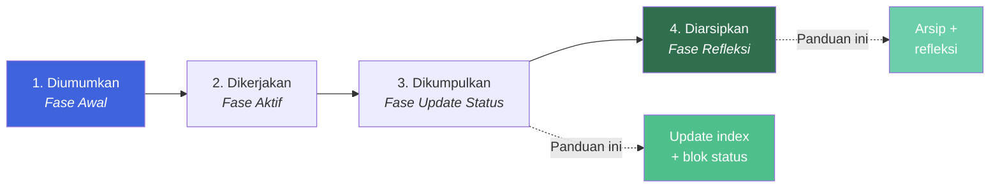
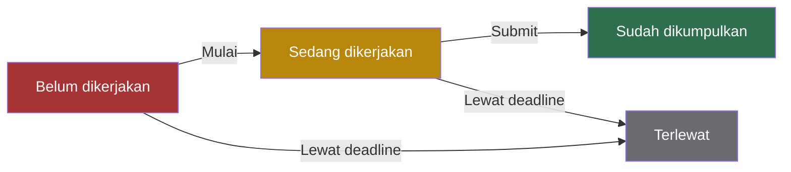
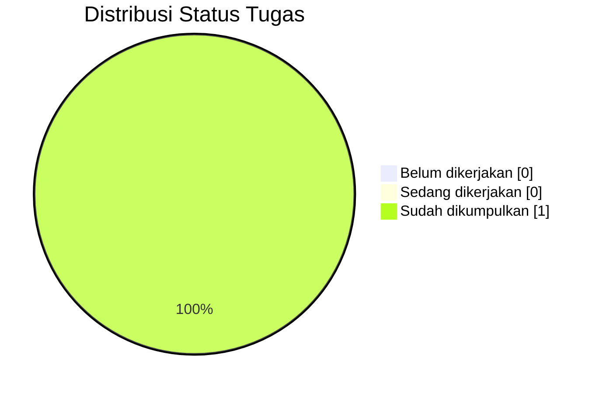
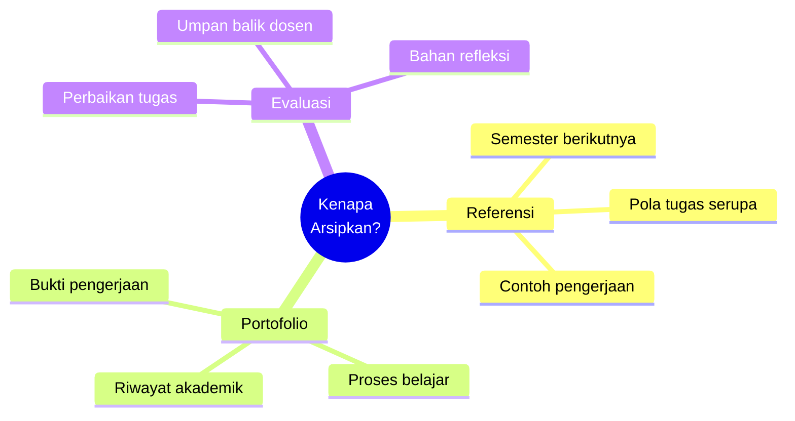
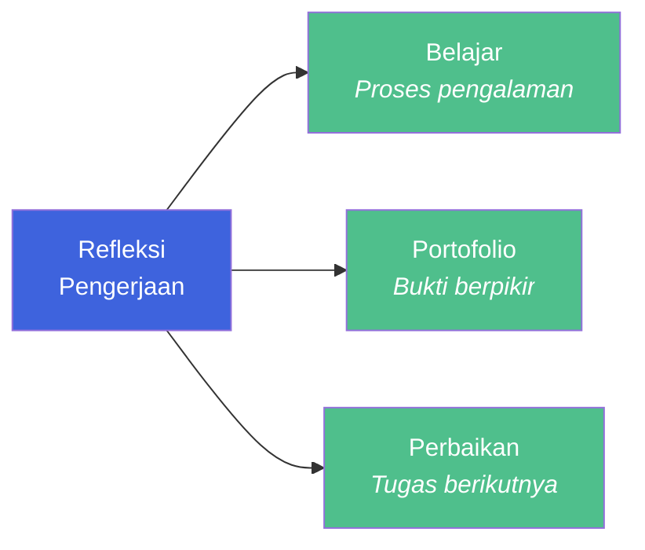

# Panduan Tugas Selesai

Halaman ini menjelaskan cara **menandai tugas yang sudah selesai** — mulai dari update status di index tugas, penambahan blok status di halaman detail, hingga pengarsipan dan penulisan refleksi.

::: info Kapan Pakai Panduan Ini?
Gunakan panduan ini ketika:

- Tugas sudah dikumpulkan dan dinilai.
- Tugas perlu diarsipkan untuk referensi semester berikutnya.
- Tugas perlu ditandai sebagai "selesai" di daftar tugas.
- Refleksi pengerjaan perlu dicatat untuk portofolio.
  :::

## Siklus Hidup Tugas

Setiap tugas melewati empat fase. Panduan ini fokus pada **Fase 3 (Pengumpulan)** dan **Fase 4 (Arsip & Refleksi)** — dua fase yang sering terlupakan.



|        Fase        | Aktivitas                                    | Halaman Terkait               |
| :----------------: | -------------------------------------------- | ----------------------------- |
|  **1. Diumumkan**  | Tugas muncul di e-learning, dicatat di index | [Halaman Tugas](/format/task) |
| **2. Dikerjakan**  | Status berubah menjadi "Sedang dikerjakan"   | —                             |
| **3. Dikumpulkan** | Status berubah menjadi "Sudah dikumpulkan"   | **Panduan ini**               |
| **4. Diarsipkan**  | Refleksi ditambahkan, tugas diarsipkan       | **Panduan ini**               |

## Empat Status Tugas

Gunakan salah satu dari empat status berikut secara konsisten. Jangan mengarang status baru seperti "hampir selesai" atau "revisi".

| Status                | Kapan Dipakai                    | Warna Anjuran |
| --------------------- | -------------------------------- | ------------- |
| **Belum dikerjakan**  | Belum ada progres sama sekali    | Merah         |
| **Sedang dikerjakan** | Sudah mulai, tapi belum selesai  | Kuning        |
| **Sudah dikumpulkan** | Sudah submit sebelum deadline    | Hijau         |
| **Terlewat**          | Deadline lewat tanpa pengumpulan | Abu-abu       |



## Update di Index Tugas

Setelah tugas selesai, ubah **status** di halaman `/v1/task/index.md`.

### Sebelum

```markdown
| Mata Kuliah                 | Tugas          | Deadline   | Status            |
| --------------------------- | -------------- | ---------- | ----------------- |
| RPL103 — Matematika Diskrit | Teori Himpunan | 2026-09-19 | Sedang dikerjakan |
```

### Sesudah

```markdown
| Mata Kuliah                 | Tugas          | Deadline   | Status            |
| --------------------------- | -------------- | ---------- | ----------------- |
| RPL103 — Matematika Diskrit | Teori Himpunan | 2026-09-19 | Sudah dikumpulkan |
```

### Update Distribusi Status

Jangan lupa memperbarui **pie chart distribusi status**. Diagram harus konsisten dengan tabel.



::: warning Konsistensi Diagram dan Tabel
Kalau tabel menunjukkan 1 tugas "Sudah dikumpulkan", pie chart harus menunjukkan angka yang sama. Diagram yang tidak sinkron dengan tabel membuat pembaca bingung — mana yang benar?
:::

## Update di Detail Tugas

Di halaman detail tugas, tambahkan blok **status** di bagian atas halaman — tepat setelah judul `#`.

### Template Blok Status

```markdown
::: info Status Tugas
**Status:** Sudah dikumpulkan
**Tanggal kumpul:** 18 September 2026
**Nilai:** [jika sudah dinilai]
**Catatan:** [umpan balik dari dosen, jika ada]
:::
```

### Contoh Penerapan

Untuk tugas Teori Himpunan yang selesai dikumpulkan pada 18 September 2026:

```markdown
# Tugas Matematika Diskrit: Teori Himpunan

::: info Status Tugas
**Status:** Sudah dikumpulkan
**Tanggal kumpul:** 18 September 2026
**Nilai:** 85 (A-)
**Catatan:** Pemahaman konsep baik, tapi perhatikan penulisan notasi himpunan.
:::

## Petunjuk Tugas

...
```

::: tip Letak Blok Status
Blok status sebaiknya di **atas halaman detail** — pembaca langsung tahu statusnya tanpa harus scroll ke bawah.
:::

## Arsip Tugas Selesai

Tugas yang sudah selesai tetap **diarsipkan** di tempat yang sama — **jangan dihapus**.

### Alasan Pengarsipan



| Alasan         | Manfaat                                          |
| -------------- | ------------------------------------------------ |
| **Referensi**  | Semester berikutnya bisa melihat pola dan contoh |
| **Portofolio** | Bukti pengerjaan dan proses belajar mahasiswa    |
| **Evaluasi**   | Bahan untuk memperbaiki tugas mendatang          |

### Struktur Arsip

Selama jumlah tugas masih sedikit (di bawah 10), simpan semua di folder `task/` tanpa pemisahan.

Ketika jumlah sudah banyak (di atas 15), pertimbangkan pemisahan:

```text
docs/v1/task/
├── index.md            ← hanya tugas aktif
├── arsip/
│   ├── index.md        ← daftar tugas selesai
│   ├── tugas-01-xxx.md
│   └── tugas-02-xxx.md
└── tugas-aktif.md
```

::: warning Jangan Hapus Tugas Lama
Jangan pernah hapus halaman tugas yang sudah selesai. Cukup ubah statusnya menjadi **"Sudah dikumpulkan"**. Link ke halaman tersebut mungkin sudah tersebar di grup chat, bookmark, atau referensi eksternal.
:::

## Refleksi Tugas

Setelah tugas selesai, **tambahkan refleksi** di bagian bawah halaman detail tugas.

### Template Refleksi

```markdown
## Refleksi

::: details Refleksi Pengerjaan

**Apa yang berhasil:**

- [Poin keberhasilan pertama]
- [Poin keberhasilan kedua]

**Apa yang perlu diperbaiki:**

- [Poin perbaikan pertama]
- [Poin perbaikan kedua]

**Pelajaran untuk tugas berikutnya:**

- [Pelajaran pertama]
- [Pelajaran kedua]

:::
```

### Contoh Konkret

```markdown
## Refleksi

::: details Refleksi Pengerjaan

**Apa yang berhasil:**

- Pemahaman konsep himpunan cukup kuat.
- Diskusi tim berjalan efektif dan setiap anggota berkontribusi.

**Apa yang perlu diperbaiki:**

- Manajemen waktu — mulai lebih awal, jangan menunggu H-1.
- Verifikasi jawaban sebelum submit — ada satu typo yang lolos.

**Pelajaran untuk tugas berikutnya:**

- Baca instruksi dua kali sebelum mulai.
- Gambar diagram Venn untuk mempermudah visualisasi.
- Simpan catatan saat mengerjakan, jangan andalkan ingatan.

:::
```

### Manfaat Refleksi



## Checklist Tugas Selesai

Jalankan checklist ini setiap kali menandai tugas sebagai selesai.

- [ ] Status di index tugas sudah diupdate ke **"Sudah dikumpulkan"**
- [ ] Distribusi status (pie chart) sudah diupdate
- [ ] Detail tugas punya blok `::: info Status Tugas` di atas
- [ ] Tanggal pengumpulan dicatat
- [ ] Nilai dicatat (jika sudah dinilai)
- [ ] Refleksi ditambahkan (opsional tapi bermanfaat)
- [ ] Link dari index ke detail masih valid
- [ ] Tidak ada tugas lama yang dihapus
- [ ] Sidebar tidak perlu diupdate (halaman sudah ada)

## Praktik Baik dan Pantangan

::: tip Praktik Baik

- **Update segera** setelah tugas dikumpulkan — jangan menunda sampai lupa.
- **Catat tanggal kumpul** — berguna untuk pelaporan dan audit.
- **Tambahkan refleksi** — proses ini memperkuat pembelajaran jangka panjang.
- **Verifikasi link** — pastikan link dari index masih mengarah ke halaman detail yang benar.
- **Screenshot bukti submit** — simpan sebagai backup jika ada kendala teknis.
- **Update pie chart** — visualisasi harus konsisten dengan tabel.
- **Beri nilai jika sudah tersedia** — memudahkan tracking performa.
  :::

::: warning Hindari

- **Jangan hapus tugas lama** — arsipkan, jangan buang.
- **Jangan skip update status** — status yang tidak akurat menyesatkan pembaca.
- **Jangan lupa pie chart** — diagram dan tabel harus sinkron.
- **Jangan biarkan link rusak** — cek setelah setiap update.
- **Jangan mengarang status baru** — gunakan empat status standar.
- **Jangan tunda refleksi** — tulis saat ingatan masih segar.
  :::

## Contoh Konkret — Lengkap

Berikut contoh lengkap ketika tugas **Teori Himpunan** baru selesai dikumpulkan pada **18 September 2026** dengan nilai **85**.

### Langkah 1: Update Index Tugas

Ubah baris di `/v1/task/index.md`:

```markdown
| Mata Kuliah                 | Tugas          | Deadline   | Status            |
| --------------------------- | -------------- | ---------- | ----------------- |
| RPL103 — Matematika Diskrit | Teori Himpunan | 2026-09-19 | Sudah dikumpulkan |
```

### Langkah 2: Update Pie Chart

Ubah diagram di `/v1/task/index.md`:


### Langkah 3: Tambahkan Blok Status di Detail Tugas

Buka `/v1/task/tugas-matematika-diskrit-materi-himpunan.md`, tambahkan tepat setelah `#`:

```markdown
::: info Status Tugas
**Status:** Sudah dikumpulkan
**Tanggal kumpul:** 18 September 2026
**Nilai:** 85 (A-)
**Catatan:** Pemahaman konsep baik, perhatikan penulisan notasi himpunan.
:::
```

### Langkah 4: Tambahkan Refleksi di Bawah

Di bagian paling bawah halaman detail, sebelum **Halaman Terkait**:

```markdown
## Refleksi

::: details Refleksi Pengerjaan

**Apa yang berhasil:**

- Memahami konsep himpunan dengan baik, khususnya operasi irisan dan gabungan.
- Diskusi tim berjalan lancar dan setiap anggota berkontribusi.

**Apa yang perlu diperbaiki:**

- Lebih teliti dalam verifikasi jawaban — ada satu soal yang tertukar notasi.
- Manajemen waktu — mulai lebih awal agar tidak terburu-buru.

**Pelajaran untuk tugas berikutnya:**

- Selalu baca instruksi dua kali.
- Gunakan diagram Venn untuk visualisasi.
- Simpan catatan pengerjaan untuk refleksi.

:::
```

### Langkah 5: Verifikasi

- Buka `/v1/task/` — pastikan status sudah berubah.
- Buka halaman detail — pastikan blok status muncul di atas.
- Cek pie chart — pastikan angka konsisten.

## Halaman Terkait

| Halaman                                                                      | Deskripsi                               |
| ---------------------------------------------------------------------------- | --------------------------------------- |
| [**Panduan Format**](/format/page)                                           | Panduan halaman konten standar          |
| [**Halaman Homepage**](/format/homepage)                                     | Panduan layout `home`                   |
| [**Halaman Tugas**](/format/task)                                            | Panduan membuat halaman tugas           |
| [**Daftar Tugas**](/v1/task/)                                                | Index tugas aktif                       |
| [**Contoh Detail Tugas**](/v1/task/tugas-matematika-diskrit-materi-himpunan) | Implementasi nyata halaman detail tugas |

::: tip Update Sekali, Berguna Selamanya
Status tugas yang akurat menghemat waktu — baik untukmu sekarang maupun untuk siapa pun yang membaca dokumentasi ini nanti. Luangkan **5 menit** untuk update setelah submit, dan kamu akan berterima kasih pada dirimu sendiri di akhir semester.
:::
