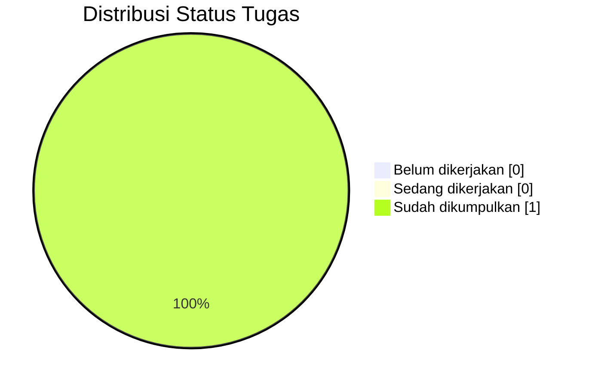

# Panduan Tugas Selesai

Cara **menandai tugas selesai** — update status, blok status di halaman detail, pengarsipan, dan refleksi.

::: info Kapan Pakai?
Saat tugas sudah dikumpulkan, perlu diarsipkan, atau perlu ditandai "selesai" di daftar tugas.
:::

## Siklus Hidup Tugas

|        Fase        | Aktivitas                                    |            Panduan            |
| :----------------: | -------------------------------------------- | :---------------------------: |
|  **1. Diumumkan**  | Tugas muncul di e-learning, dicatat di index | [Halaman Tugas](/format/task) |
| **2. Dikerjakan**  | Status "Sedang dikerjakan"                   |               —               |
| **3. Dikumpulkan** | Status "Sudah dikumpulkan"                   |        **Panduan ini**        |
| **4. Diarsipkan**  | Refleksi + arsip                             |        **Panduan ini**        |

## Empat Status

Gunakan salah satu dari empat status berikut secara konsisten:

| Status                | Kapan Dipakai               | Warna   |
| --------------------- | --------------------------- | ------- |
| **Belum dikerjakan**  | Belum ada progres           | Merah   |
| **Sedang dikerjakan** | Sudah mulai, belum selesai  | Kuning  |
| **Sudah dikumpulkan** | Submit sebelum deadline     | Hijau   |
| **Terlewat**          | Deadline lewat tanpa submit | Abu-abu |

::: warning Konsistensi
Jangan mengarang status baru seperti "hampir selesai" atau "revisi".
:::

## Update di Index Tugas

Ubah **status** di `/v1/task/index.md`.

**Sebelum:**

```markdown
| RPL103 — Matematika Diskrit | Teori Himpunan | 2026-09-19 | Sedang dikerjakan |
```

**Sesudah:**

```markdown
| RPL103 — Matematika Diskrit | Teori Himpunan | 2026-09-19 | Sudah dikumpulkan |
```

### Update Pie Chart

Jangan lupa update **pie chart distribusi status** — diagram harus konsisten dengan tabel.



::: warning Konsistensi
Kalau tabel menunjukkan 1 tugas "Sudah dikumpulkan", pie chart harus menunjukkan angka yang sama.
:::

## Update di Detail Tugas

Tambahkan blok **status** di halaman detail, tepat setelah `#`.

```markdown
::: info Status Tugas
**Status:** Sudah dikumpulkan
**Tanggal kumpul:** 18 September 2026
**Nilai:** 85 (A-)
**Catatan:** Pemahaman konsep baik, perhatikan penulisan notasi himpunan.
:::
```

Letakkan di **atas halaman** — pembaca langsung tahu statusnya tanpa scroll.

## Arsip Tugas

Tugas selesai **tetap diarsipkan** — jangan dihapus.

**Alasan:**

- **Referensi** — semester berikutnya bisa melihat pola dan contoh
- **Portofolio** — bukti pengerjaan dan proses belajar
- **Evaluasi** — bahan untuk memperbaiki tugas mendatang

### Struktur Arsip

Selama tugas masih sedikit (di bawah 10), simpan di folder `task/` tanpa pemisahan. Ketika sudah banyak (di atas 15), pertimbangkan pemisahan:

```text
docs/v1/task/
├── index.md            ← hanya tugas aktif
├── arsip/
│   ├── index.md        ← daftar tugas selesai
│   ├── tugas-01-xxx.md
│   └── tugas-02-xxx.md
```

::: warning Jangan Hapus
Link ke halaman tugas mungkin sudah tersebar di grup chat atau bookmark. Jangan pernah hapus — cukup ubah statusnya.
:::

## Refleksi Tugas

Tambahkan **refleksi** di bagian bawah halaman detail.

### Template

```markdown
## Refleksi

::: details Refleksi Pengerjaan

**Apa yang berhasil:**

- [Poin keberhasilan pertama]
- [Poin keberhasilan kedua]

**Apa yang perlu diperbaiki:**

- [Poin perbaikan pertama]
- [Poin perbaikan kedua]

**Pelajaran untuk tugas berikutnya:**

- [Pelajaran pertama]
- [Pelajaran kedua]

:::
```

### Contoh Konkret

```markdown
## Refleksi

::: details Refleksi Pengerjaan

**Apa yang berhasil:**

- Pemahaman konsep himpunan cukup kuat, khususnya operasi irisan dan gabungan.
- Diskusi tim berjalan efektif dan setiap anggota berkontribusi.

**Apa yang perlu diperbaiki:**

- Manajemen waktu — mulai lebih awal, jangan menunggu H-1.
- Verifikasi jawaban sebelum submit — ada satu typo yang lolos.

**Pelajaran untuk tugas berikutnya:**

- Baca instruksi dua kali sebelum mulai.
- Gambar diagram Venn untuk mempermudah visualisasi.
- Simpan catatan saat mengerjakan, jangan andalkan ingatan.

:::
```

## Checklist Tugas Selesai

- [ ] Status di index tugas sudah diupdate ke **"Sudah dikumpulkan"**
- [ ] Distribusi status (pie chart) sudah diupdate
- [ ] Detail tugas punya blok `::: info Status Tugas` di atas
- [ ] Tanggal pengumpulan dicatat
- [ ] Nilai dicatat (jika sudah dinilai)
- [ ] Refleksi ditambahkan (opsional)
- [ ] Link dari index ke detail masih valid
- [ ] Tidak ada tugas lama yang dihapus

## Praktik Baik dan Pantangan

::: tip Praktik Baik

- **Update segera** setelah tugas dikumpulkan.
- **Catat tanggal kumpul** — berguna untuk pelaporan dan audit.
- **Tambahkan refleksi** — memperkuat pembelajaran jangka panjang.
- **Verifikasi link** — pastikan masih mengarah ke halaman benar.
- **Screenshot bukti submit** sebagai backup.
- **Update pie chart** — visualisasi harus konsisten.
- **Beri nilai jika sudah tersedia** — memudahkan tracking performa.

:::

::: warning Hindari

- **Jangan hapus tugas lama** — arsipkan, jangan buang.
- **Jangan skip update status** — status tidak akurat menyesatkan.
- **Jangan lupa pie chart** — diagram dan tabel harus sinkron.
- **Jangan biarkan link rusak** — cek setelah setiap update.
- **Jangan mengarang status baru** — pakai empat status standar.
- **Jangan tunda refleksi** — tulis saat ingatan masih segar.

:::

## Contoh Lengkap

Tugas **Teori Himpunan** selesai dikumpulkan **18 September 2026** dengan nilai **85**.

### 1. Update Index Tugas

```markdown
| RPL103 — Matematika Diskrit | Teori Himpunan | 2026-09-19 | Sudah dikumpulkan |
```

### 2. Update Pie Chart


### 3. Blok Status di Detail Tugas

Tambahkan tepat setelah `#`:

```markdown
::: info Status Tugas
**Status:** Sudah dikumpulkan
**Tanggal kumpul:** 18 September 2026
**Nilai:** 85 (A-)
**Catatan:** Pemahaman konsep baik, perhatikan penulisan notasi himpunan.
:::
```

### 4. Refleksi di Bawah

Tambahkan sebelum **Halaman Terkait**:

```markdown
## Refleksi

::: details Refleksi Pengerjaan

**Apa yang berhasil:**

- Memahami konsep himpunan dengan baik.
- Diskusi tim berjalan lancar.

**Apa yang perlu diperbaiki:**

- Lebih teliti dalam verifikasi jawaban.
- Manajemen waktu — mulai lebih awal.

**Pelajaran untuk tugas berikutnya:**

- Baca instruksi dua kali.
- Gunakan diagram Venn untuk visualisasi.

:::
```

### 5. Verifikasi

- Buka `/v1/task/` — pastikan status berubah.
- Buka halaman detail — pastikan blok status muncul di atas.
- Cek pie chart — pastikan konsisten.

## Halaman Terkait

| Halaman                                                                  | Deskripsi                      |
| ------------------------------------------------------------------------ | ------------------------------ |
| [Panduan Format](/format/page)                                           | Panduan halaman konten standar |
| [Halaman Homepage](/format/homepage)                                     | Panduan layout `home`          |
| [Halaman Tugas](/format/task)                                            | Panduan membuat halaman tugas  |
| [Daftar Tugas](/v1/task/)                                                | Index tugas aktif              |
| [Contoh Detail Tugas](/v1/task/tugas-matematika-diskrit-materi-himpunan) | Implementasi nyata             |

::: tip Update Sekali, Berguna Selamanya
Luangkan **5 menit** untuk update setelah submit — kamu akan berterima kasih pada dirimu sendiri di akhir semester.
:::
