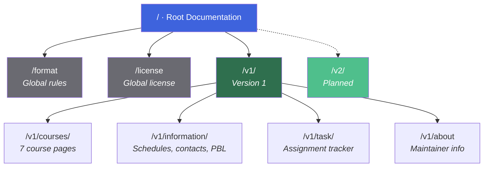
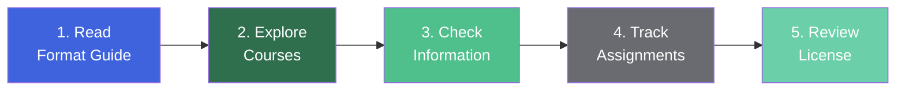
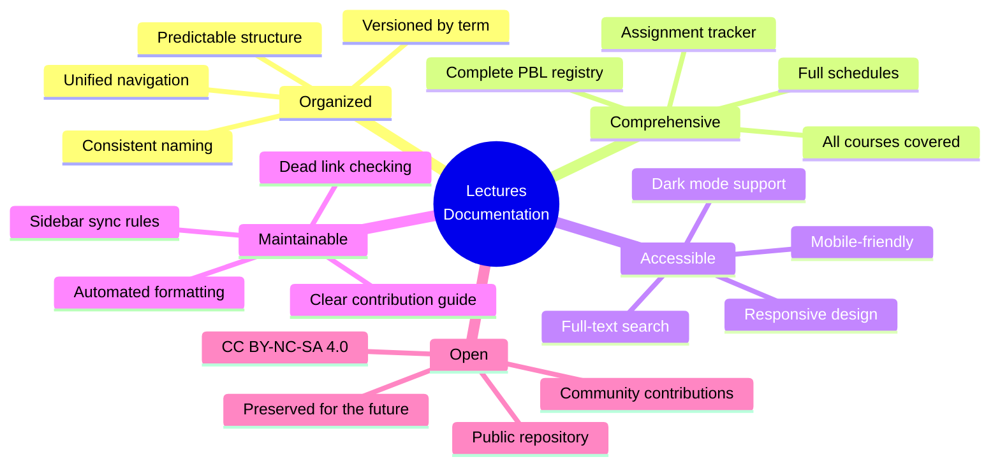

::: tip Official E-Learning Portal
All course materials, assignments, and academic activities are centralized in the Informatics Engineering e-learning platform.

[**Open IF Polibatam E-Learning →**](https://learningif.polibatam.ac.id)
:::

## At a Glance

| **Current Version** | **Courses** | **Semester**  | **License** |
| :-----------------: | :---------: | :-----------: | :---------: |
|         v1          |      7      | Odd 2026/2027 | CC BY-NC-SA |

The **Lectures** project is a personal documentation initiative that collects everything needed for a Software Engineering Technology student at Politeknik Negeri Batam — from course materials and lecture notes to class schedules, lecturer contacts, and PBL team registries.

## Documentation Map

The documentation is organized around a simple structure: **global pages** apply everywhere, while **versioned pages** are scoped to a specific academic term.

**Two types of pages:**

| Type          | Location              | Scope             | Examples                   |
| ------------- | --------------------- | ----------------- | -------------------------- |
| **Global**    | Root of `docs/`       | All versions      | `/`, `/format`, `/license` |
| **Versioned** | Inside version folder | One academic term | `/v1/*`, `/v2/*`           |

## Documentation Versions

Each academic term is preserved under its own version path — ensuring previous materials remain accessible and citable.

| Version | Status  |     Period     | Description                                                | Link                  |
| :-----: | :-----: | :------------: | ---------------------------------------------------------- | --------------------- |
| **v1**  | Current | Odd 2026/2027  | Initial release — course materials for the first semester. | [**Open v1 →**](/v1/) |
|   v2    | Planned | Even 2026/2027 | Scheduled for the upcoming academic term.                  | _Not yet available_   |

::: info Why Versions?
Versioning serves three purposes:

1. **Preservation** — past semester content remains accessible for citations.
2. **Clarity** — you always know which term a page belongs to.
3. **Evolution** — the documentation can improve between semesters without breaking old links.

Past versions are **frozen** once a new term starts — only critical corrections (factual errors, broken links, security issues) are made.
:::

## Getting Started

New to this documentation? Follow this recommended path.

| Step  | Page                                             | Why It Matters                                                                                           |
| :---: | ------------------------------------------------ | -------------------------------------------------------------------------------------------------------- |
| **1** | [**Format & Documentation Rules**](/format/page) | Understand the conventions, file structure, and contribution guidelines that keep everything consistent. |
| **2** | [**Courses**](/v1/courses/)                      | Browse the seven first-semester courses with materials, assignments, and references.                     |
| **3** | [**Information**](/v1/information/)              | Find schedules, lecturer contacts, and PBL team assignments.                                             |
| **4** | [**Assignments**](/v1/task/)                     | Track your coursework, deadlines, and submission links.                                                  |
| **5** | [**License**](/license)                          | Review the CC BY-NC-SA 4.0 terms that apply to all content.                                              |

::: tip First Time Here?
Start with the [**Version 1 landing page**](/v1/) — it provides a full overview of what's inside the first semester, including the semester map, learning journey, and FAQ.
:::

## What's Inside Each Section

A quick overview of what each main section contains.

### Courses — `/v1/courses/`

Seven course pages, each covering materials, schedule, assignments, and references.

| Code     | Course                                  | SKS | Focus                             |
| -------- | --------------------------------------- | :-: | --------------------------------- |
| RPL101   | Introduction to Software Engineering    |  3  | Software lifecycle, methodology   |
| RPL102   | Algorithms and Programming              |  3  | Python, algorithms, logic         |
| RPL103   | Discrete Mathematics                    |  3  | Sets, logic, graphs, cryptography |
| RPL104   | Requirements Analysis and Specification |  3  | Stakeholders, elicitation, SRS    |
| RPL105   | Web Programming                         |  4  | HTML, CSS, JS, PHP, MySQL         |
| RPL106   | Introduction to Database                |  3  | ER modeling, SQL, DDL/DML/DCL     |
| PK001RPL | Religious Education                     |  2  | Character and ethics              |

[**Browse all courses →**](/v1/courses/)

### Information — `/v1/information/`

Practical information about the semester.

| Page                                                       | Content                                   |
| ---------------------------------------------------------- | ----------------------------------------- |
| [Lecturer Contacts](/v1/information/kontak-dosen)          | Staff IDs, initials, names, phone numbers |
| [Class Schedule](/v1/information/jadwal-kuliah)            | Weekly schedule with rooms and lecturers  |
| [PBL Team Info](/v1/information/info-team-pbl)             | Project descriptions and managers         |
| [PBL Titles and Teams](/v1/information/judul-dan-team-pbl) | Team registries with member names         |

[**Browse all information →**](/v1/information/)

### Assignments — `/v1/task/`

A single tracker for all coursework.

| Section               | Purpose                                               |
| --------------------- | ----------------------------------------------------- |
| Daftar Tugas          | Complete list of assignments with details             |
| Ringkasan Status      | Status tracking — not started, in progress, submitted |
| Tugas per Mata Kuliah | Breakdown by course                                   |
| Tips & FAQ            | Best practices for submission                         |

[**View all assignments →**](/v1/task/)

## Key Features

What makes this documentation useful — beyond just being a collection of pages.

| Feature                 | Description                                                                               |
| ----------------------- | ----------------------------------------------------------------------------------------- |
| **Versioned Content**   | Each academic term gets its own folder — previous materials stay accessible and citable.  |
| **Full-Text Search**    | Search across all documentation with support for filtering by course, topic, and version. |
| **Responsive Design**   | Optimized for desktop, tablet, and mobile — readable on any screen.                       |
| **Open Source**         | Content published under CC BY-NC-SA 4.0 — free to share and adapt with attribution.       |
| **Maintainer-Friendly** | Automated formatting, dead-link checking, and clear contribution rules.                   |

## About

This documentation is maintained by **Muhammad Riduwan Khafidi** as part of academic activities in the **Software Engineering Technology (D4)** program at **Politeknik Negeri Batam**.

::: info About the Maintainer

- **Student ID:** 4342611034
- **Program:** D4 Teknologi Rekayasa Perangkat Lunak
- **Class:** Evening B, Batch 2026
- **Role:** Documentation maintainer, Semester 1

[**Read more →**](/v1/about)
:::

### How to Contribute

Contributions are welcome — from students, lecturers, and the wider community.

| Way to Contribute        | How                                                                                         |
| ------------------------ | ------------------------------------------------------------------------------------------- |
| **Report an issue**      | [Open a GitHub issue](https://github.com/mroczect/lectures/issues) with a clear description |
| **Submit a fix**         | Fork the repository and send a pull request                                                 |
| **Suggest improvements** | Start a discussion in the issue tracker                                                     |
| **Share feedback**       | Email the maintainer directly                                                               |

::: tip Before You Contribute
Read the [**Format & Documentation Rules**](/format/page) first — it explains naming conventions, frontmatter requirements, and the pre-commit checklist that keeps every contribution consistent.
:::

## FAQ

::: details What is this project?

**Lectures** is a personal documentation project that organizes course materials, schedules, assignments, and academic references for the Software Engineering Technology program at Politeknik Negeri Batam.

It is **not an official publication** of the university — but it draws from official sources like RPS documents and e-learning content.

:::

::: details Who can use this documentation?

**Everyone** — with the terms of the CC BY-NC-SA 4.0 license. This includes:

- **Students** — for study and reference.
- **Lecturers** — for supplementary teaching materials.
- **The wider community** — for learning and adaptation.

Commercial use is **not permitted** without explicit permission.

:::

::: details Why is the documentation versioned?

Versioning preserves past academic terms as historical records. When a new term starts, a new version is created — the old version stays frozen.

This ensures:

- Citations remain valid.
- Past materials remain accessible.
- The structure can evolve between terms.

:::

::: details Where do I find the courses I'm taking?

Go to the [**Courses**](/v1/courses/) section, which lists all seven first-semester courses. Each course page contains materials, schedules, assignments, and references specific to that course.

:::

::: details Where do I find my class schedule?

The [**Class Schedule**](/v1/information/jadwal-kuliah) page shows the weekly schedule for evening classes. If your class is different, check with your class coordinator or the official e-learning announcement.

:::

::: details Where do I find my PBL team?

Go to [**PBL Titles and Teams**](/v1/information/judul-dan-team-pbl) — it contains all 30 teams organized by class (Pagi A/B/C and Malam A/B/C). Find your class, then look for your assigned project code.

:::

::: details What if I find an error?

Two options:

1. **Open an issue** on the [GitHub repository](https://github.com/mroczect/lectures/issues) — describe the error clearly.
2. **Submit a pull request** — if you want to fix it yourself.

For minor fixes (typos, formatting), feel free to edit directly. For content corrections, an issue first is helpful.

:::

::: details How is the documentation kept up to date?

The documentation is maintained actively during the semester. Updates happen:

- **Weekly** — for new materials and assignments.
- **Ad hoc** — for corrections and improvements.
- **Between semesters** — for structural changes and versioning.

The author responds to corrections quickly — but as a full-time student, there may be delays during exam periods.

:::

## Related Pages

| Page                                                          | Description                                           |
| ------------------------------------------------------------- | ----------------------------------------------------- |
| [**Format & Rules**](/format/page)                            | Documentation conventions and contribution guidelines |
| [**License**](/license)                                       | CC BY-NC-SA 4.0 licensing terms                       |
| [**Version 1**](/v1/)                                         | First semester documentation                          |
| [**About**](/v1/about)                                        | About the maintainer and this project                 |
| [**GitHub Repository**](https://github.com/mroczect/lectures) | Source repository with full commit history            |

## Sumber Referensi Online

### Platform Utama

| Sumber                      | Tautan                                         |
| --------------------------- | ---------------------------------------------- |
| **E-Learning IF Polibatam** | [Buka →](https://learningif.polibatam.ac.id)   |
| **Politeknik Negeri Batam** | [Buka →](https://www.polibatam.ac.id)          |
| **GitHub Repository**       | [Buka →](https://github.com/mroczect/lectures) |

### Halaman PBL

| Sumber                                      | Tautan                                                                                                                          |
| ------------------------------------------- | ------------------------------------------------------------------------------------------------------------------------------- |
| **Panduan PBL Semester 1 Ganjil 2026/2027** | [Unduh PDF →](https://learning-if.polibatam.ac.id/pluginfile.php/36673/mod_label/intro/Panduan%20PBL%20Sem%201%202026-2027.pdf) |
| **Pembagian Judul dan Tim PBL**             | [Buka Halaman →](https://polibatam.id/tim-pbl-sem1-trpl-2026)                                                                   |

::: info About This Page
This is the **global homepage** of the Lectures documentation — it applies to all versions.

For version-specific content, start with the [**Version 1 landing page**](/v1/) or browse the [**Courses**](/v1/courses/) section directly.

Content is published under the [**CC BY-NC-SA 4.0**](/license) license. For questions, corrections, or contributions, please open an issue or pull request on [GitHub](https://github.com/mroczect/lectures).
:::

::: tip Recently Updated?
This documentation is a **living project** — it evolves with each academic term. If you're returning after a while, check the [**Version 1 landing page**](/v1/) for the latest changes and additions.
:::
