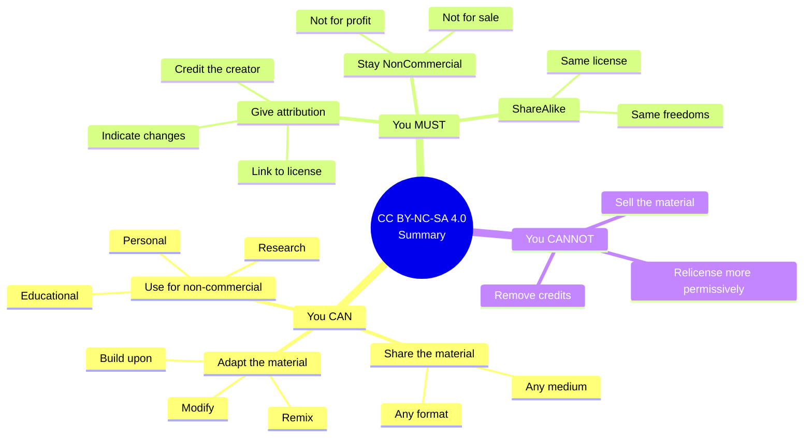
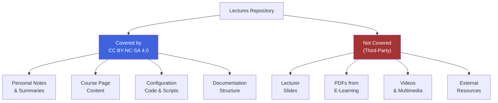
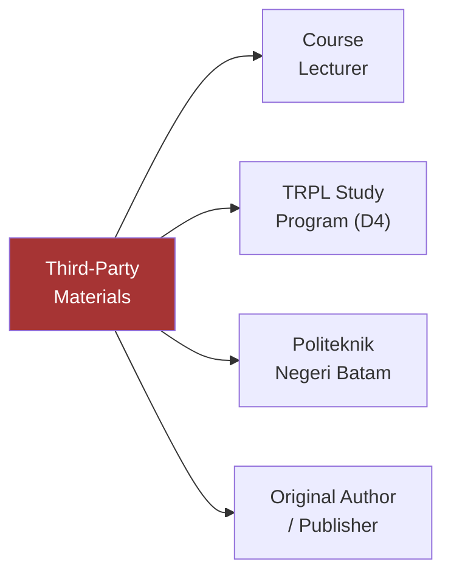
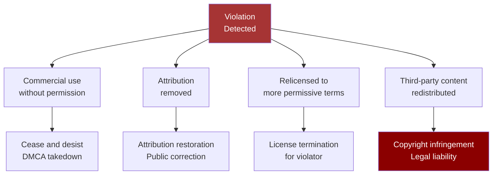

::: info About This License
The **Lectures** project is licensed under the
[Attribution-NonCommercial-ShareAlike 4.0 International](https://creativecommons.org/licenses/by-nc-sa/4.0/)
(CC BY-NC-SA 4.0) license.

The full legal text is available in the
[`LICENSE`](https://github.com/mroczect/lectures/blob/master/LICENSE) file on GitHub.
:::

## Quick Summary

The three-minute version: what you can do, what you must do, and what you cannot do.



### At a Glance

| Permission                        |   Status    |
| --------------------------------- | :---------: |
| Share in any format               |   Allowed   |
| Adapt and remix                   |   Allowed   |
| Use for personal learning         |   Allowed   |
| Use for teaching (non-commercial) |   Allowed   |
| Use for research                  |   Allowed   |
| Sell the material                 | Not allowed |
| Use in commercial products        | Not allowed |
| Remove creator credits            | Not allowed |
| Relicense to MIT/Apache/etc.      | Not allowed |

::: tip The Core Idea
This license protects the **freedom to learn and share** — while keeping the content **free from commercial exploitation** and **preserving the same freedoms** for downstream users.
:::

## Can I...?

Quick answers to the most common questions. Click any question to see the detailed answer.

::: details Can I use this material for my own study?

**Yes.** Personal, educational, and non-commercial use is fully allowed under this license.

You can:

- Read, study, and take notes from any page.
- Download and print materials for personal use.
- Adapt content for your own learning.

You must:

- Give attribution if you share your adapted version.
- Keep the same license if you redistribute.

:::

::: details Can I share this material with my classmates?

**Yes.** Sharing is one of the core freedoms this license grants.

You can:

- Send links to any page.
- Share PDFs or screenshots for study sessions.
- Repost content in class group chats.

You should:

- Credit the source — a link back to the original is enough.
- Not charge for access.

:::

::: details Can I use this material for teaching?

**Yes, as long as it's non-commercial.** Teaching in a public educational institution counts as non-commercial.

You can:

- Use the material in your lectures.
- Adapt it to fit your curriculum.
- Distribute it to your students.

You must:

- Credit the original creator.
- Not sell access to the adapted material.
- License your adaptation under the same CC BY-NC-SA 4.0 terms.

:::

::: details Can I sell this material?

**No.** This license explicitly prohibits commercial use.

This includes:

- Selling access to the content.
- Bundling it in a paid course.
- Using it in a commercial product.
- Charging for derivatives.

Even if you modify it significantly, the NonCommercial restriction still applies.

:::

::: details Can I relicense this under MIT or Apache?

**No.** This is the ShareAlike restriction — derivative works must be licensed under the **same terms** as the original.

You cannot:

- Relicense to MIT, Apache, GPL, or any more permissive license.
- Remove the CC BY-NC-SA 4.0 requirement from derivatives.
- Claim it as your own work without attribution.

You can:

- Create derivatives — just keep them under CC BY-NC-SA 4.0.
- Combine with other CC BY-NC-SA licensed content.

:::

::: details Can I use this in a commercial portfolio?

**This is a gray area — be cautious.** Showing your adapted version in a portfolio is generally acceptable if:

- The portfolio itself is not sold.
- You clearly credit the original.
- You don't claim the original content as your own.

However, if your portfolio is part of a commercial service (e.g., freelance work for a paid client), you should not include this content.

:::

::: details Can I translate this material?

**Yes.** Translation is a form of adaptation — and adaptation is allowed under this license.

You must:

- Credit the original creator.
- Note that your version is a translation.
- License your translation under CC BY-NC-SA 4.0.
- Not use it commercially.

:::

::: details Can I remove the license notice from my copy?

**No.** Removing license notices — or creator credits — violates the **Attribution** requirement.

Even if you significantly modify the content, you must:

- Preserve the original attribution.
- Link back to the license.
- Note that changes were made.

:::

## What the License Covers

Not everything in this repository is under the same license. Here's the breakdown.



### Scope Table

| Section                                   | Status      | License            |
| ----------------------------------------- | ----------- | ------------------ |
| Personal notes & summaries                | Covered     | CC BY-NC-SA 4.0    |
| Course page content                       | Covered     | CC BY-NC-SA 4.0    |
| Configuration code & scripts              | Covered     | CC BY-NC-SA 4.0    |
| Documentation structure                   | Covered     | CC BY-NC-SA 4.0    |
| Lecturer materials (slides, PDFs, videos) | Not covered | Original copyright |
| E-learning resources                      | Not covered | Original copyright |
| External links referenced                 | Not covered | Original copyright |

::: tip Scope Clarification
Only content **created by the author** is covered by this license.
All third-party materials retain their original copyright.
:::

## Third-Party Materials

Lecture materials provided by lecturers — including slides, PDFs, videos, and resources from e-learning platforms — are **not covered** by this license.

### Copyright Holders



Copyright for these materials remains with:

- The course lecturer
- The Software Engineering Technology (D4) Study Program
- Politeknik Negeri Batam
- The original author or publisher

These materials are used solely for **personal learning purposes**.

::: danger Copyright Notice
Do **not** redistribute third-party materials without explicit permission
from their respective copyright holders. Doing so may violate copyright law.
:::

## What Happens If You Violate

Understanding the consequences helps clarify why these rules matter.



::: warning Why This Matters
The license exists to protect:

1. **The author's rights** — attribution ensures credit is preserved.
2. **The community's freedom** — ShareAlike keeps derivatives open.
3. **Non-commercial integrity** — prevents exploitation of free educational work.
4. **Third-party rights** — respecting lecturers' and publishers' copyrights.

Violations erode the trust that makes open educational resources possible.
:::

## How to Give Attribution

If you use or redistribute material from this project, provide attribution as follows.

### Attribution Templates

Choose the format that fits your medium:

::: code-group

```txt [Plain Text]
Source: Lectures — Lecture Documentation
By: Muhammad Riduwan Khafidi
URL: https://mroczect.biz.id/lectures
License: CC BY-NC-SA 4.0
```

```markdown [Markdown]
> Source: [Lectures — Lecture Documentation](https://mroczect.biz.id/lectures)
> By: Muhammad Riduwan Khafidi
> License: [CC BY-NC-SA 4.0](https://creativecommons.org/licenses/by-nc-sa/4.0/)
```

```html [HTML]
<p>
  Source: <a href="https://mroczect.biz.id/lectures">Lectures — Lecture Documentation</a><br />
  By: Muhammad Riduwan Khafidi<br />
  License: <a href="https://creativecommons.org/licenses/by-nc-sa/4.0/">CC BY-NC-SA 4.0</a>
</p>
```

```latex [LaTeX]
\footnote{Source: \href{https://mroczect.biz.id/lectures}{Lectures — Lecture Documentation}
by Muhammad Riduwan Khafidi, licensed under
\href{https://creativecommons.org/licenses/by-nc-sa/4.0/}{CC BY-NC-SA 4.0}.}
```

:::

### Attribution Requirements

A complete attribution must include:

| Element          | Purpose                      | Example                            |
| ---------------- | ---------------------------- | ---------------------------------- |
| **Source**       | Identifies the original work | "Lectures — Lecture Documentation" |
| **Creator**      | Credits the author           | "Muhammad Riduwan Khafidi"         |
| **License**      | States the terms             | "CC BY-NC-SA 4.0"                  |
| **License Link** | Points to license text       | Link to Creative Commons           |
| **Changes Note** | If you modified the work     | "Adapted from..."                  |

::: tip If You Made Changes
If you modified, translated, or adapted the material, add a note like:

> "Adapted from [Lectures](/) by Muhammad Riduwan Khafidi. Original licensed under CC BY-NC-SA 4.0. Changes made: translated to Japanese, updated examples for 2026 curriculum."
> :::

### Where to Place Attribution

| Medium              | Placement                                                    |
| ------------------- | ------------------------------------------------------------ |
| **Website / blog**  | Footer, "Credits" page, or at the end of the adapted content |
| **Academic paper**  | Footnote or bibliography entry                               |
| **Presentation**    | Final slide with credits                                     |
| **Video**           | Description, credits roll, or on-screen overlay              |
| **PDF / book**      | Title page or colophon                                       |
| **Code repository** | `LICENSE` file or `README.md`                                |

## Official Links

The authoritative sources for this license — everything else is a summary.

| Resource                   | Link                                                                                                                                 | Purpose                                       |
| -------------------------- | ------------------------------------------------------------------------------------------------------------------------------------ | --------------------------------------------- |
| **Full Legal Text**        | [creativecommons.org/licenses/by-nc-sa/4.0/legalcode.txt](https://creativecommons.org/licenses/by-nc-sa/4.0/legalcode.txt)           | The complete, legally binding license         |
| **Human-Readable Summary** | [creativecommons.org/licenses/by-nc-sa/4.0/](https://creativecommons.org/licenses/by-nc-sa/4.0/)                                     | Plain-language explanation (not legal advice) |
| **Creative Commons FAQ**   | [creativecommons.org/faq/](https://creativecommons.org/faq/)                                                                         | Answers to common questions                   |
| **Choose a License Tool**  | [creativecommons.org/choose/](https://creativecommons.org/choose/)                                                                   | If you're licensing your own work             |
| **CC Wiki — Attribution**  | [wiki.creativecommons.org/wiki/Best_practices_for_attribution](https://wiki.creativecommons.org/wiki/Best_practices_for_attribution) | Best practices for giving credit              |

## Contact

Have questions about this license?

| Channel               | Details                                                                            |
| --------------------- | ---------------------------------------------------------------------------------- |
| **Email**             | [mriduwankhafidi@proton.me](mailto:mriduwankhafidi@proton.me)                      |
| **GitHub Issues**     | [github.com/mroczect/lectures/issues](https://github.com/mroczect/lectures/issues) |
| **GitHub Repository** | [github.com/mroczect/lectures](https://github.com/mroczect/lectures)               |

::: tip Before You Ask
Many common questions are answered in this page or in the [Creative Commons FAQ](https://creativecommons.org/faq/). If you don't find an answer there, feel free to reach out.
:::

## FAQ

::: details What is Creative Commons?

**Creative Commons** is a nonprofit organization that provides free, standardized legal tools for creators to grant permissions for their work.

Instead of the default "all rights reserved" copyright, CC licenses let creators say "some rights reserved" — with specific conditions.

There are six main CC licenses, combining four conditions:

| Condition              | Meaning                        |
| ---------------------- | ------------------------------ |
| **BY** (Attribution)   | Credit must be given           |
| **NC** (NonCommercial) | Not for commercial use         |
| **SA** (ShareAlike)    | Derivatives under same license |
| **ND** (NoDerivatives) | No modifications allowed       |

This project uses **BY-NC-SA** — three of the four conditions.

:::

::: details Why did you choose CC BY-NC-SA instead of MIT?

Different licenses serve different purposes.

**MIT** is a software license — permissive, allowing any use including commercial. It's ideal for open-source code that wants maximum adoption.

**CC BY-NC-SA** is a content license — it protects:

- **Attribution** — creator must be credited.
- **NonCommercial** — prevents commercial exploitation of free educational work.
- **ShareAlike** — ensures derivatives remain open.

For **educational content** like this documentation, CC BY-NC-SA strikes the right balance between openness and protection.

:::

::: details Can I use this material in my own open-source project?

**Yes, if your project is also non-commercial and licensed under the same terms.**

You can:

- Fork the repository for non-commercial use.
- Adapt content for your own educational project.
- Publish your derivative under CC BY-NC-SA 4.0.

You cannot:

- Use it in a commercial open-source product.
- Relicense to MIT/Apache/GPL.
- Remove the original attribution.

:::

::: details What counts as "commercial use"?

**Commercial use** means any use that is **primarily intended for commercial advantage or monetary compensation**.

Examples of commercial use:

- Selling access to the material.
- Bundling it in a paid course or book.
- Using it to advertise a commercial product.
- Publishing it on a site with paid ads.

Examples of non-commercial use:

- Personal study.
- Teaching in a public school or university.
- Non-profit educational platforms.
- Academic research.

::: warning Gray Areas

- **Freelance portfolio** — generally OK if the portfolio itself isn't sold.
- **YouTube with ads** — could be considered commercial (monetized).
- **Conference presentation** — usually OK if the conference is non-commercial.

When in doubt, ask for permission or use it only under clearly non-commercial circumstances.
:::

::: details How do I know if something is a "derivative work"?

A **derivative work** is any work that is **based on or adapted from** the original.

Examples of derivatives:

- Translation to another language.
- Restructured summary of the content.
- Adapted version for a different curriculum.
- Video or podcast based on the content.

Examples that are NOT derivatives:

- Quoting a short passage (fair use).
- Linking to the original.
- Listing the URL in a resource list.

If your work **incorporates** the original content in any substantial way, it's likely a derivative.

:::

::: details What if I want to use this content commercially?

**You need explicit permission from the author.**

Send an email to [mriduwankhafidi@proton.me](mailto:mriduwankhafidi@proton.me) with:

- Who you are.
- What you want to use.
- How you want to use it.
- The commercial context.

The author may grant a separate commercial license on a case-by-case basis. Note that this can only apply to content **owned by the author** — not third-party materials.

:::

::: details Are there penalties for violating the license?

**Yes.** Violating the license can result in:

1. **License termination** — your right to use the material ends immediately.
2. **DMCA takedown** — content can be removed from your site or platform.
3. **Legal liability** — for copyright infringement, especially if commercial.
4. **Public correction** — required attribution published publicly.

For non-commercial, good-faith violations (e.g., a missing attribution you didn't notice), the remedy is usually simple: add the attribution. Malicious or commercial violations can escalate significantly.

:::

::: details How can I check if a page is third-party content?

**Look for indicators:**

- Content on **course pages** about lecturer materials (slides, PDFs from e-learning) is third-party.
- Content with **embedded videos** from YouTube or external platforms.
- Content **linked from official e-learning** resources.
- Content **not authored by Muhammad Riduwan Khafidi**.

When in doubt, assume **third-party** — and don't redistribute without permission.

:::

::: details Can I use this for a student club or organization?

**Yes, if the organization is non-commercial.**

Student clubs, non-profit organizations, and educational associations can use and adapt this material as long as:

- The use is not for profit.
- Attribution is preserved.
- Derivatives are shared under CC BY-NC-SA 4.0.

If the club is a commercial entity (e.g., a paid professional association), treat it as commercial use.

:::

::: details What if the license changes in the future?

**Current contributions are permanently licensed under CC BY-NC-SA 4.0.** The author cannot retroactively revoke the license for content already published.

However, the author could:

- Choose a different license for **future content**.
- Continue with CC BY-NC-SA 4.0 for consistency.

If a change ever happens, it will be clearly documented on this page and in the repository.

:::

## Related Pages

| Page                                                          | Description                                           |
| ------------------------------------------------------------- | ----------------------------------------------------- |
| [**Root Home**](/)                                            | Project home — versions, getting started              |
| [**Format & Rules**](/format/page)                            | Documentation conventions and contribution guidelines |
| [**About**](/v1/about)                                        | About this project and its maintainer                 |
| [**Version 1**](/v1/)                                         | First semester documentation                          |
| [**GitHub Repository**](https://github.com/mroczect/lectures) | Source repository — includes full LICENSE file        |

::: info About This Page
This page describes the licensing terms for the **Lectures** project — a personal documentation project maintained by **Muhammad Riduwan Khafidi**.

The license **CC BY-NC-SA 4.0** was chosen to balance **open access** with **protection from commercial exploitation** and **preservation of downstream freedoms**.
:::

::: details File Information

| Field            | Value                                                                 |
| ---------------- | --------------------------------------------------------------------- |
| **Path**         | `docs/license.md`                                                     |
| **Last Updated** | 2026-09-12                                                            |
| **License**      | [CC BY-NC-SA 4.0](https://creativecommons.org/licenses/by-nc-sa/4.0/) |
| **Maintainer**   | Muhammad Riduwan Khafidi                                              |

:::

::: warning Legal Disclaimer
This page provides a **plain-language summary** of the CC BY-NC-SA 4.0 license. It is **not legal advice**.

For any legal questions, consult the [full license text](https://creativecommons.org/licenses/by-nc-sa/4.0/legalcode.txt) or a qualified legal professional.
:::
