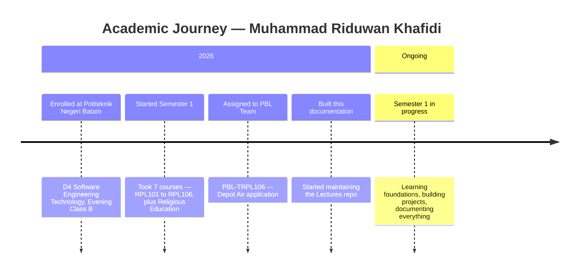
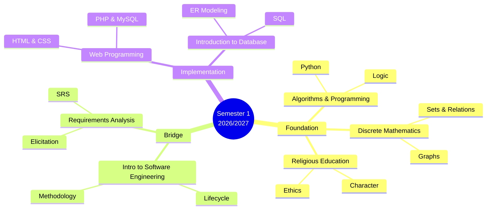
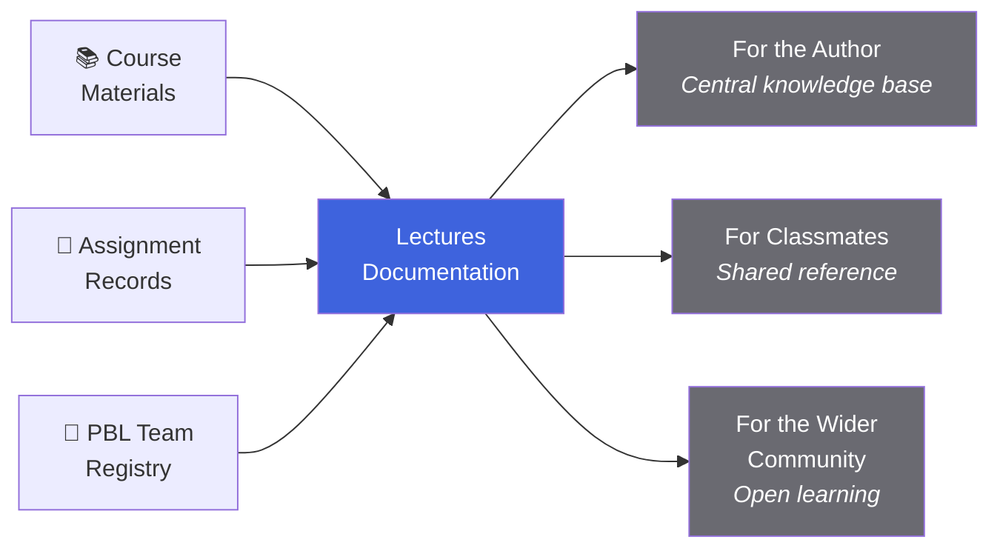

::: tip Purpose of This Page
This page introduces the person behind the **Lectures** documentation — his academic background, current focus, and how to reach him for questions, corrections, or collaboration.
:::

## At a Glance

| **Student ID** | **Program** | **Class** | **Batch** | **Semester** |
| :------------: | :---------: | :-------: | :-------: | :----------: |
|   4342611034   |   D4 TRPL   | Evening B |   2026    |      1       |

A snapshot of the author's current academic standing. This page is intentionally minimal, honest, and easy to keep up to date — no need for elaborate design when clarity matters more.

## Academic Journey

The author's academic path so far — from entering Politeknik Negeri Batam to becoming the maintainer of this documentation.

**What's next:**

- Complete Semester 1 with strong foundations in software engineering.
- Continue developing the PBL project into a working web application.
- Keep this documentation up to date as the curriculum evolves.

## Personal Data

| Field                | Value                                                                     |
| -------------------- | ------------------------------------------------------------------------- |
| **Full Name**        | Muhammad Riduwan Khafidi                                                  |
| **Student ID**       | 4342611034                                                                |
| **Study Program**    | D4 Software Engineering Technology (TRPL)                                 |
| **Class**            | Evening — B                                                               |
| **Batch**            | 2026                                                                      |
| **Semester**         | 1 (Odd 2026/2027)                                                         |
| **Academic Advisor** | Noper Ardi, M.Eng.                                                        |
| **Email**            | [mriduwankhafidi@proton.me](mailto:mriduwankhafidi@proton.me)             |
| **Phone**            | 0895-1381-8455                                                            |
| **Address**          | Perumahan Permata Laguna Block A8 No. 11, Tanjung Uncang, Batu Aji, Batam |
| **GitHub**           | [github.com/mroczect](https://github.com/mroczect)                        |

## Campus

The author is enrolled at **Politeknik Negeri Batam** — a vocational higher education institution in Batam, Indonesia.

| Field             | Value                                                            |
| ----------------- | ---------------------------------------------------------------- |
| **Institution**   | Politeknik Negeri Batam                                          |
| **Department**    | Department of Informatics Engineering (TI)                       |
| **Study Program** | D4 Software Engineering Technology (TRPL)                        |
| **Address**       | Jl. Ahmad Yani No. 1, Batam Center, Batam                        |
| **Website**       | [polibatam.ac.id](https://www.polibatam.ac.id)                   |
| **E-Learning**    | [learningif.polibatam.ac.id](https://learningif.polibatam.ac.id) |

::: info About the Program
**D4 Teknologi Rekayasa Perangkat Lunak (TRPL)** is a four-year applied bachelor program focused on practical software engineering. The curriculum emphasizes **Project-Based Learning (PBL)** — where students work in teams to build real applications that solve real problems.
:::

## Learning Focus

Current semester's focus — the seven courses currently being taken, organized by learning phase.

| Phase              | Courses                  | Focus                                          |
| ------------------ | ------------------------ | ---------------------------------------------- |
| **Foundation**     | RPL102, RPL103, PK001RPL | Computational thinking, mathematics, character |
| **Bridge**         | RPL101, RPL104           | Software engineering process, requirements     |
| **Implementation** | RPL105, RPL106           | Web development, database design               |

::: tip Why This Order Matters
The learning focus is intentionally structured as **Foundation → Bridge → Implementation**. Mathematical and algorithmic thinking first, then how to engineer and capture requirements, and finally how to build the actual product.
:::

## What This Documentation Is

The **Lectures** repository is a personal documentation project maintained by the author. It serves three purposes:

### Guiding Principles

| Principle          | Description                                                                                   |
| ------------------ | --------------------------------------------------------------------------------------------- |
| **Structure**      | Every page follows consistent format rules — file naming, frontmatter, layout.                |
| **Clarity**        | Content written for both new and returning readers — no assumption of prior knowledge.        |
| **Sustainability** | Easy to update without breaking other parts — sidebar, links, and search all stay consistent. |
| **Openness**       | Published under the MIT License — free to use, adapt, and share with attribution.             |

## Contact

The author is reachable through the following channels. For corrections, questions, or collaboration — reach out on either platform.

::: tip Primary Channels

| Channel        | Detail                                                               |
| -------------- | -------------------------------------------------------------------- |
| **Email**      | [mriduwankhafidi@proton.me](mailto:mriduwankhafidi@proton.me)        |
| **GitHub**     | [github.com/mroczect](https://github.com/mroczect)                   |
| **Repository** | [github.com/mroczect/lectures](https://github.com/mroczect/lectures) |

:::

::: warning Response Time
The author is a full-time student — responses may take **1–3 days**. For urgent documentation issues, opening a **GitHub issue** is often faster than email.
:::

### How to Contribute

If you spot an error, missing content, or have a suggestion:

1. **Open an issue** on GitHub — describe the problem clearly.
2. **Submit a pull request** — if you want to fix it yourself.
3. **Send an email** — for anything that doesn't fit GitHub issues.

All contributions — however small — are appreciated. This documentation improves through iteration.

## FAQ

::: details Is this an official university documentation?

**No.** This is a **personal documentation project** maintained by a student — not an official publication of Politeknik Negeri Batam or the TRPL program.

While content is sourced from official materials (RPS documents, e-learning pages, and lecturer announcements), it is curated and organized by the author. For official matters, always refer to the university's own channels.

:::

::: details Can I use this documentation for my own study?

**Yes.** All content is published under the **MIT License** — free to use, adapt, and share, as long as you provide attribution.

If you're a student from another cohort or institution, feel free to fork the repository and adapt it to your needs. Credit is appreciated but not required for personal use.

:::

::: details Is the documentation always up to date?

**Mostly, but not always.** Content is updated regularly by the author, but there may be delays — especially during exam periods.

If you find outdated information, please open an issue or send an email. The author responds to corrections quickly.

:::

::: details Can I contribute content?

**Yes, and it's welcome.** Contributions can take many forms:

- Fixing typos or broken links.
- Adding missing course materials.
- Improving existing pages for clarity.
- Reporting inaccuracies.

The best way to contribute is through **GitHub pull requests**. If you're not familiar with Git, opening an **issue** with a detailed description also helps.

:::

::: details Why is the documentation versioned by academic term?

Each academic term is stored in its own folder (e.g., `v1/`, `v2/`) — a deliberate design choice that:

- Preserves previous materials for citation and reference.
- Allows the curriculum to evolve without breaking old links.
- Keeps context clear about which term a page belongs to.

Past versions are **frozen** — only critical corrections (factual errors, broken links, security issues) are made.

:::

::: details Who maintains this and how often?

The documentation is maintained by **Muhammad Riduwan Khafidi** (the author of this page) as a personal project. Updates happen:

- **Weekly** during the semester — for new materials and assignments.
- **Ad hoc** — for corrections and improvements whenever discovered.
- **Between semesters** — for structural updates and versioning.

There is no formal schedule — updates are driven by need and available time.

:::

::: details How do I report a factual error?

**Any of these work:**

1. **GitHub Issue** — open one with the specific error and page link.
2. **Email** — send to [mriduwankhafidi@proton.me](mailto:mriduwankhafidi@proton.me) with the subject "Documentation Error".
3. **Pull Request** — submit a fix directly.

For urgent errors (e.g., wrong schedule information before an exam), email is fastest.

:::

## Related Pages

| Page                                | Description                                              |
| ----------------------------------- | -------------------------------------------------------- |
| [**Courses**](/v1/courses/)         | Course list with materials, assignments, and references. |
| [**Information**](/v1/information/) | Schedules, lecturer contacts, and PBL team registries.   |
| [**Tasks**](/v1/task/)              | Assignment briefs and submission details.                |
| [**Format & Rules**](/format/page)  | Documentation conventions and contribution guidelines.   |
| [**License**](/license)             | Terms of use for all content in this documentation.      |

::: info About This Page
This page is part of the **Lectures** documentation project — a personal academic reference maintained by Muhammad Riduwan Khafidi. For corrections or questions, use the contact channels above.
:::

::: tip Last Updated
This page was last updated alongside the initial release of the Semester 1 (Odd 2026/2027) documentation. It will be refreshed as the author's academic journey progresses.
:::
