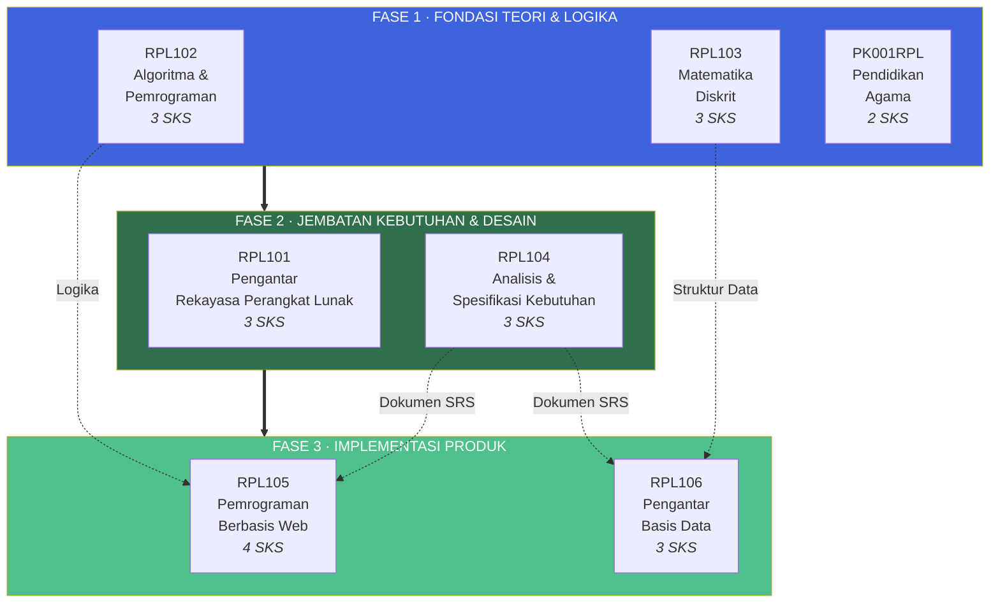
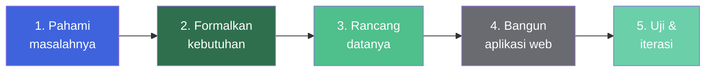

::: tip Portal E-Learning Resmi
Seluruh materi, tugas, dan aktivitas perkuliahan terpusat di platform e-learning Jurusan Teknik Informatika.

[**Buka E-Learning IF Polibatam →**](https://learningif.polibatam.ac.id)
:::

## Sekilas Semester Ini

| **Mata Kuliah** | **Total SKS** | **Terhubung PBL** |     **Semester**     |
| :-------------: | :-----------: | :---------------: | :------------------: |
|        7        |      21       |         5         | 1 (Ganjil 2026/2027) |

Semester pertama Program Studi Teknologi Rekayasa Perangkat Lunak dirancang sebagai **satu perjalanan belajar yang terpadu**, bukan tujuh mata kuliah yang terpisah-pisah. Fondasi teori dari matematika dan algoritma mengalir ke keterampilan praktik dalam analisis kebutuhan, pemrograman web, dan perancangan basis data — semuanya bermuara pada satu **proyek PBL** bersama.

::: info Cara Membaca Halaman Ini
Halaman ini disusun sebagai **peta perjalanan belajar**. Gunakan navigasi di kanan (outline) untuk melompat ke bagian tertentu, atau baca dari atas ke bawah untuk memahami keseluruhan kurikulum semester ini.
:::

## Keterkaitan Antar Mata Kuliah

Tujuh mata kuliah ini tidak berdiri sendiri. Mereka saling terhubung melalui **tiga fase pembelajaran** yang mencerminkan siklus hidup pengembangan perangkat lunak.

### Cara Membaca Diagram

|       Fase       | Peran                                                                                   | Mata Kuliah              |
| :--------------: | --------------------------------------------------------------------------------------- | ------------------------ |
|   **Fondasi**    | Membangun cara berpikir komputasional dan logika matematika, plus pengembangan karakter | RPL102, RPL103, PK001RPL |
|   **Jembatan**   | Merekayasa perangkat lunak dan menangkap kebutuhannya secara formal                     | RPL101, RPL104           |
| **Implementasi** | Mengubah kebutuhan menjadi aplikasi web dan basis data yang berjalan                    | RPL105, RPL106           |

**Kesimpulan:** Lima mata kuliah (RPL101, RPL102, RPL103, RPL104, RPL105, RPL106) terhubung langsung atau tidak langsung ke proyek PBL bersama. PK001RPL berjalan paralel sebagai pembangunan karakter dan etika.

## Daftar Mata Kuliah

Pilih mata kuliah di bawah ini untuk membuka materi, jadwal, tugas, dan referensinya secara lengkap.

### Mata Kuliah Fondasi

::: info RPL102 — Algoritma dan Pemrograman <Badge type="tip" text="3 SKS" />
**Fokus:** Berpikir komputasional, algoritma, dan implementasi dalam bahasa Python.
**Peran di PBL:** Mendukung — menerapkan dasar-dasar pemrograman (best practice) pada pengembangan aplikasi berbasis web.
[**Buka Mata Kuliah →**](/v1/courses/rpl102-algoritma-pemrograman/)
:::

::: info RPL103 — Matematika Diskrit <Badge type="tip" text="3 SKS" />
**Fokus:** Himpunan, matriks, relasi, logika, kombinatorik, aljabar Boolean, teori bilangan, teori graf.
**Peran di PBL:** Mendukung — memberikan fondasi matematis untuk logika pemrograman.
[**Buka Mata Kuliah →**](/v1/courses/rpl103-matematika-diskrit/)
:::

::: info PK001RPL — Pendidikan Agama <Badge type="tip" text="2 SKS" />
**Fokus:** Pembentukan karakter dan etika berdasarkan nilai-nilai keagamaan.
**Peran di PBL:** Independen — berjalan paralel dengan proyek PBL.
[**Buka Mata Kuliah →**](/v1/courses/pk001-pendidikan-agama/)
:::

### Mata Kuliah Jembatan

::: tip RPL101 — Pengantar Rekayasa Perangkat Lunak <Badge type="tip" text="3 SKS" />
**Fokus:** Siklus hidup perangkat lunak, metodologi pengembangan, model proses, dan peran profesional.
**Peran di PBL:** **Langsung** — memimpin fase analisis dan perancangan proyek PBL.
[**Buka Mata Kuliah →**](/v1/courses/rpl101-pengantar-rpl/)
:::

::: tip RPL104 — Analisis dan Spesifikasi Kebutuhan Perangkat Lunak <Badge type="tip" text="3 SKS" />
**Fokus:** Stakeholder, elicitation, vision & scope, dan dokumen Software Requirements Specification (SRS).
**Peran di PBL:** **Langsung** — menghasilkan dokumen SRS yang menjadi acuan seluruh proyek.
[**Buka Mata Kuliah →**](/v1/courses/rpl104-analisis-kebutuhan-pl/)
:::

### Mata Kuliah Implementasi

::: warning RPL105 — Pemrograman Berbasis Web <Badge type="tip" text="4 SKS" />
**Fokus:** HTML, CSS, JavaScript, Bootstrap, PHP, MySQL, session, dan autentikasi.
**Peran di PBL:** **Langsung** — mengimplementasikan aplikasi berdasarkan dokumen SRS.
[**Buka Mata Kuliah →**](/v1/courses/rpl105-pemrograman-web/)
:::

::: warning RPL106 — Pengantar Basis Data <Badge type="tip" text="3 SKS" />
**Fokus:** Model relasional, pemodelan ER/EER, SQL (DDL, DML, DCL), dan basis data multimedia.
**Peran di PBL:** **Langsung** — merancang basis data yang menjadi tulang punggung aplikasi.
[**Buka Mata Kuliah →**](/v1/courses/rpl106-pengantar-basis-data/)
:::

## Ringkasan Cepat

| Kode     | Mata Kuliah                                        | SKS | Fase         | Peran di PBL | Tautan                                              |
| -------- | -------------------------------------------------- | :-: | ------------ | :----------: | --------------------------------------------------- |
| RPL101   | Pengantar Rekayasa Perangkat Lunak                 |  3  | Jembatan     |   Langsung   | [Buka →](/v1/courses/rpl101-pengantar-rpl/)         |
| RPL102   | Algoritma dan Pemrograman                          |  3  | Fondasi      |  Mendukung   | [Buka →](/v1/courses/rpl102-algoritma-pemrograman/) |
| RPL103   | Matematika Diskrit                                 |  3  | Fondasi      |  Mendukung   | [Buka →](/v1/courses/rpl103-matematika-diskrit/)    |
| RPL104   | Analisis dan Spesifikasi Kebutuhan Perangkat Lunak |  3  | Jembatan     |   Langsung   | [Buka →](/v1/courses/rpl104-analisis-kebutuhan-pl/) |
| RPL105   | Pemrograman Berbasis Web                           |  4  | Implementasi |   Langsung   | [Buka →](/v1/courses/rpl105-pemrograman-web/)       |
| RPL106   | Pengantar Basis Data                               |  3  | Implementasi |   Langsung   | [Buka →](/v1/courses/rpl106-pengantar-basis-data/)  |
| PK001RPL | Pendidikan Agama                                   |  2  | Fondasi      |  Independen  | [Buka →](/v1/courses/pk001-pendidikan-agama/)       |

## Peta Semester

```mermaid
gantt
    title Gambaran Semester Pertama — 14 Minggu
    dateFormat X
    axisFormat %s

    section Fondasi
    RPL102 Algoritma & Pemrograman    :a1, 0, 14
    RPL103 Matematika Diskrit          :a2, 0, 14
    PK001RPL Pendidikan Agama          :a3, 0, 14

    section Jembatan
    RPL101 Pengantar RPL               :b1, 0, 14
    RPL104 Analisis Kebutuhan          :b2, 0, 14

    section Implementasi
    RPL105 Pemrograman Web             :crit, c1, 0, 14
    RPL106 Pengantar Basis Data        :crit, c2, 0, 14
```

Seluruh mata kuliah berjalan **paralel selama 14 minggu**, memuncak pada milestone PBL bersama. RPL105 memikul beban SKS terbesar (4 SKS) karena sifatnya yang praktik dan hands-on.

## Alur Belajar yang Disarankan

Meskipun semua mata kuliah berjalan paralel, berikut adalah **model mental yang disarankan** untuk menyikapi setiap minggunya.

| Tahap | Yang Kamu Lakukan                     | Mata Kuliah yang Terlibat |
| :---: | ------------------------------------- | ------------------------- |
| **1** | Memahami masalah dari brief PBL       | RPL101, RPL104            |
| **2** | Menuangkan ke SRS, model, dan diagram | RPL104, RPL101            |
| **3** | Merancang skema basis data            | RPL106, RPL103            |
| **4** | Membangun aplikasi web                | RPL105, RPL102            |
| **5** | Menguji dan menyempurnakan produk     | Semua mata kuliah         |

::: tip Strategi Belajar

- **Jangan belajar mata kuliah secara terpisah.** Proyek PBL adalah benang merah yang mengikat semuanya.
- **Dahulukan RPL104 dan RPL106.** Luaran keduanya (SRS dan skema) adalah prasyarat untuk implementasi di RPL105.
- **Gunakan RPL102 dan RPL103 sebagai perangkat.** Kamu akan meraihnya kembali sepanjang semester.
- **Jaga keseimbangan PK001RPL.** Karakter dan etika sama pentingnya dengan keterampilan teknis dalam rekayasa perangkat lunak profesional.
  :::

## Luaran Tiap Mata Kuliah

Setiap mata kuliah menghasilkan **artefak nyata** yang menjadi modal untuk mata kuliah berikutnya.

::: details RPL101 — Pengantar Rekayasa Perangkat Lunak

- [x] Dokumen analisis kebutuhan awal
- [x] Model arsitektur perangkat lunak
- [x] Rencana proyek dan timeline
- [x] Presentasi progres (ATS dan AAS)
      :::

::: details RPL102 — Algoritma dan Pemrograman

- [x] Kumpulan algoritma dalam pseudocode
- [x] Program Python untuk kasus-kasus harian
- [x] Proyek akhir aplikasi sederhana
- [x] Dokumentasi kode
      :::

::: details RPL103 — Matematika Diskrit

- [x] Pemodelan himpunan, relasi, dan fungsi
- [x] Diagram graf dan pohon
- [x] Latihan kombinatorik dan Boolean
- [x] Proyek penerapan matematika diskrit
      :::

::: details RPL104 — Analisis dan Spesifikasi Kebutuhan

- [x] Dokumen Vision & Scope
- [x] Hasil elicitation kebutuhan
- [x] Model dan prototipe
- [x] **Dokumen Software Requirements Specification (SRS)**
      :::

::: details RPL105 — Pemrograman Berbasis Web

- [x] Halaman web statis dan interaktif
- [x] Antarmuka responsif dengan Bootstrap
- [x] Aplikasi CRUD dengan PHP dan MySQL
- [x] Sistem autentikasi dan otorisasi
      :::

::: details RPL106 — Pengantar Basis Data

- [x] ER Diagram dan EER Diagram
- [x] Skema relasional hasil pemetaan
- [x] Script SQL (DDL, DML, DCL)
- [x] Mini project basis data untuk PBL
      :::

::: details PK001RPL — Pendidikan Agama

- [x] Refleksi nilai dan etika
- [x] Tugas pengembangan karakter
- [x] Diskusi kelompok
      :::

## Ceklis Kesiapan Belajar

Sebelum masuk semester, pastikan kamu sudah menyiapkan hal-hal berikut.

- [ ] **Laptop atau PC** dengan spesifikasi minimal untuk pemrograman
- [ ] **Visual Studio Code** atau editor kode favorit
- [ ] **Python 3.x** terinstal dan berjalan
- [ ] **XAMPP** (Apache + MySQL + PHP) terinstal
- [ ] **Git** terinstal untuk version control
- [ ] **Akun e-learning IF Polibatam** aktif
- [ ] **Koneksi internet** yang stabil untuk kuliah daring
- [ ] **Akun Zoom** untuk kuliah teori dan praktikum
- [ ] **Folder proyek** terstruktur untuk menyimpan semua tugas

## Pertanyaan yang Sering Diajukan

::: details Apakah semua mata kuliah harus diambil di semester pertama?

Ya. Ketujuh mata kuliah ini adalah paket semester pertama yang sudah ditetapkan dalam kurikulum. Kamu tidak bisa memilih untuk mengambil sebagian saja.

:::

::: details Mata kuliah mana yang paling berat?

Bobot setiap mata kuliah berbeda-beda, tapi **RPL105 Pemrograman Berbasis Web** biasanya terasa paling menantang karena:

- SKS-nya paling besar (4 SKS)
- Cakupannya luas (client-side dan server-side)
- Membutuhkan praktik langsung setiap minggu

Namun, **RPL104 Analisis dan Spesifikasi Kebutuhan** juga menuntut karena luaran utamanya adalah dokumen SRS yang komprehensif.

:::

::: details Apakah saya perlu bisa coding sebelum masuk?

**Tidak.** RPL102 Algoritma dan Pemrograman dirancang untuk pemula — mulai dari nol hingga bisa menulis program Python. Kalau kamu sudah punya dasar, itu nilai tambah.

:::

::: details Bagaimana hubungan antara RPL101, RPL104, dan RPL105?

Ketiganya terhubung erat melalui proyek PBL:

- **RPL101** memberi kerangka kerja (siklus hidup, metodologi).
- **RPL104** menghasilkan dokumen SRS.
- **RPL105** mengimplementasikan SRS menjadi aplikasi web yang berjalan.

Tanpa RPL104, RPL105 akan berjalan tanpa arah. Tanpa RPL101, RPL104 akan kehilangan konteks metodologisnya.

:::

::: details Apakah mata kuliah PK001RPL terhubung ke PBL?

**Tidak langsung.** PK001RPL berjalan paralel sebagai pembangunan karakter dan etika. Meskipun tidak terhubung ke proyek PBL teknis, nilai-nilai yang dibangun di sini — disiplin, tanggung jawab, kerja sama — sangat relevan untuk kerja tim dalam proyek PBL.

:::

::: details Bagaimana cara memilih topik proyek PBL?

Topik proyek PBL biasanya sudah ditentukan oleh dosen pengampu di awal semester. Pembagian judul dan tim dapat dilihat di halaman informasi PBL. Setelah topik dan tim terbentuk, langkah pertama adalah **mengidentifikasi kebutuhan stakeholder** (RPL104).

:::

## Halaman Terkait

| Halaman                                       | Deskripsi                                               |
| --------------------------------------------- | ------------------------------------------------------- |
| [**Informasi Perkuliahan**](/v1/information/) | Jadwal, kontak dosen, dan pembagian tim PBL.            |
| [**Tugas**](/v1/task/)                        | Daftar tugas dan detail pengumpulannya.                 |
| [**Tentang**](/v1/about)                      | Informasi akademik pribadi dari pemelihara dokumentasi. |
| [**Format & Aturan**](/format)                | Konvensi dokumentasi dan panduan kontribusi.            |

::: info Tentang Halaman Ini
Setiap halaman mata kuliah memuat minimal informasi kode mata kuliah, SKS, dosen pengampu, jadwal, materi, tugas, dan referensi sesuai aturan format dokumentasi.
:::

::: tip Butuh Update Cepat?
Kalau ada mata kuliah baru, tambahkan folder `<kode-mata-kuliah>-<nama>/index.md` di dalam `docs/v1/courses/`, lalu perbarui daftar di halaman ini dan sidebar di `docs/.vitepress/sidebar.json`.
:::

::: warning Catatan
Semua link di halaman ini mengarah ke folder mata kuliah di dalam `docs/v1/courses/`. Kalau link-nya merah (404), berarti file `index.md` di dalam folder tersebut belum dibuat.
:::
