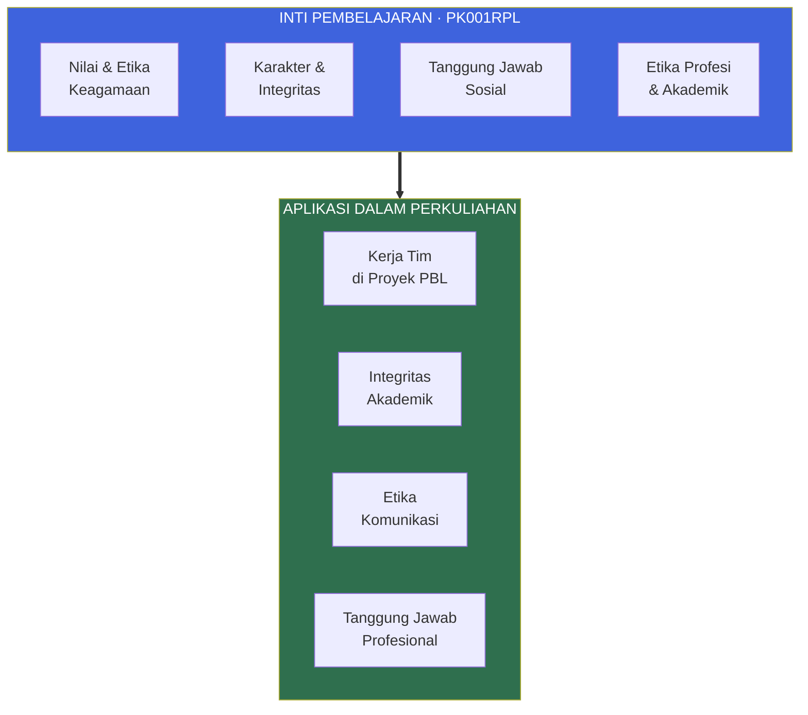
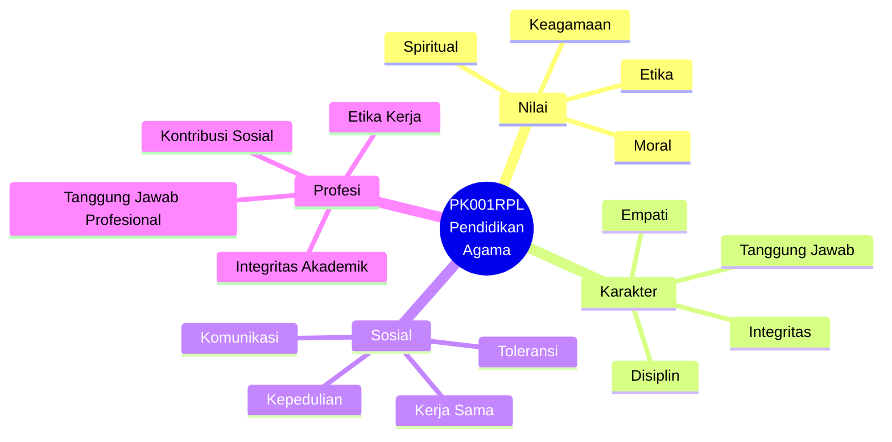
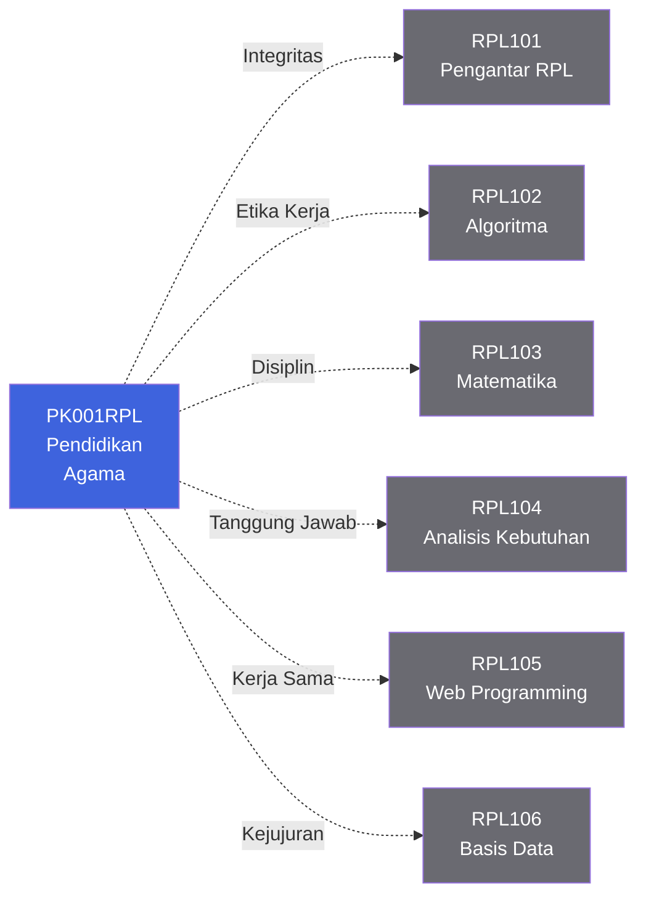
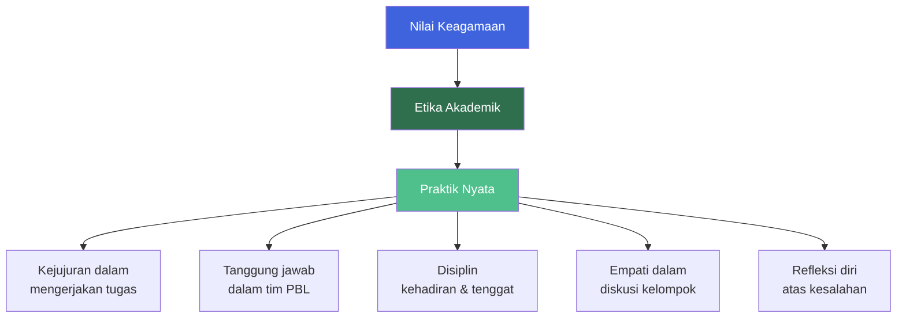

::: warning Informasi Belum Dipublikasikan
**Rencana Pembelajaran Semester (RPS)** dan **informasi dosen pengampu** untuk mata kuliah ini **belum dipublikasikan** oleh pihak program studi. Halaman ini akan diperbarui begitu dokumen resmi tersedia.

Sementara itu, silakan gunakan halaman ini sebagai gambaran umum mata kuliah dan pantau e-learning untuk pengumuman terbaru.
:::

::: tip Portal E-Learning Resmi
Seluruh materi, tugas, dan aktivitas perkuliahan terpusat di platform e-learning Jurusan Teknik Informatika.

[**Buka E-Learning IF Polibatam →**](https://learningif.polibatam.ac.id)
:::

## Peta Mata Kuliah

PK001RPL bukan mata kuliah teknis — tapi justru karena itu, ia menjadi **fondasi yang menyangga seluruh perjalanan belajar** kamu sebagai calon perekayasa perangkat lunak.

**Benang merah:** Nilai-nilai yang dibangun di PK001RPL bukan sekadar hafalan — mereka hadir di setiap interaksi tim, pengumpulan tugas, dan keputusan etis yang kamu ambil sepanjang semester. Integritas akademik yang kamu bawa ke tugas RPL104 dan RPL105 berasal dari sini.

## Informasi Umum

| **Kode** | **SKS** |   **Semester**   | **Status** |
| :------: | :-----: | :--------------: | :--------: |
| PK001RPL |    2    | Ganjil 2026/2027 |   Wajib    |

| Bidang                    | Keterangan                              |
| ------------------------- | --------------------------------------- |
| **Nama Mata Kuliah**      | Pendidikan Agama                        |
| **Mata Kuliah Prasyarat** | Tidak ada                               |
| **Program Studi**         | Teknologi Rekayasa Perangkat Lunak (D4) |
| **Dosen Pengampu**        | _Belum dipublikasikan_                  |
| **Email Dosen**           | _Belum dipublikasikan_                  |
| **RPS**                   | _Belum dipublikasikan_                  |

::: info Status Dokumentasi
Beberapa informasi resmi mata kuliah ini masih dalam proses publikasi oleh program studi:

- **RPS (Rencana Pembelajaran Semester)** — belum tersedia
- **Daftar dosen pengampu** — belum tersedia
- **Jadwal kuliah** — akan muncul di halaman [Informasi Perkuliahan](/v1/information/)
- **Materi lengkap** — akan tersedia di e-learning IF Polibatam

Halaman ini akan diperbarui begitu dokumen resmi tersedia.
:::

### Deskripsi Mata Kuliah

Pendidikan Agama adalah mata kuliah pembentukan karakter yang membantu mahasiswa memahami dan menginternalisasi **nilai-nilai keagamaan** sebagai landasan berperilaku — baik dalam kehidupan pribadi, akademik, maupun profesional. Mata kuliah ini menekankan pada:

- **Pemahaman nilai** keagamaan yang relevan dengan kehidupan modern
- **Penerapan etika** dalam interaksi sosial dan profesional
- **Pengembangan karakter** yang mendukung integritas akademik
- **Tanggung jawab sosial** sebagai bagian dari masyarakat dan industri

::: info Cara Membaca Halaman Ini
Halaman ini disusun sebagai gambaran umum mata kuliah. Karena RPS belum dipublikasikan, beberapa section bersifat **sementara** dan akan diperbarui. Gunakan outline di kanan untuk navigasi cepat.
:::

## Tujuan Pembelajaran

Berdasarkan karakteristik mata kuliah Pendidikan Agama, tujuan pembelajaran berikut disusun dari **capaian pembelajaran umum** mata kuliah serupa di jenjang pendidikan tinggi vokasi.

::: warning Catatan
Tujuan pembelajaran di bawah ini bersifat **sementara** dan akan digantikan dengan rumusan resmi begitu RPS diterbitkan oleh program studi.
:::

| No. | Tujuan Pembelajaran <Badge type="warning" text="Sementara" />                                                                 |
| :-: | ----------------------------------------------------------------------------------------------------------------------------- |
|  1  | **Memahami nilai-nilai keagamaan** yang menjadi landasan etika dan moral dalam kehidupan pribadi, akademik, dan profesional.  |
|  2  | **Menerapkan prinsip etika** dalam interaksi sosial dan profesional — khususnya dalam kerja tim dan kolaborasi.               |
|  3  | **Mengembangkan karakter** yang mendukung integritas akademik, termasuk kejujuran, tanggung jawab, dan disiplin.              |
|  4  | **Membangun kesadaran sosial** sebagai bagian dari masyarakat dan industri, dengan kepedulian terhadap sesama dan lingkungan. |
|  5  | **Merefleksikan nilai** keagamaan dalam konteks teknologi dan profesi perekayasa perangkat lunak.                             |

### Kompetensi Inti yang Dibangun

## Keterkaitan dengan Mata Kuliah Lain

Meskipun PK001RPL **tidak terhubung langsung ke proyek PBL** secara teknis, nilai-nilai yang dibangun di sini memperkuat seluruh perjalanan akademikmu — terutama dalam kerja tim di lima mata kuliah yang terhubung PBL.

**Cara membacanya:** PK001RPL adalah **lapisan dasar** yang memperkuat semua mata kuliah lain melalui nilai-nilai, bukan materi teknis.

### Nilai yang Langsung Relevan

| Nilai                   | Diterapkan di                                                    |
| ----------------------- | ---------------------------------------------------------------- |
| **Integritas Akademik** | Semua pengumpulan tugas — tidak menyalin, tidak memplagiasi      |
| **Etika Kerja Tim**     | Proyek PBL — berkontribusi jujur, berkomunikasi terbuka          |
| **Tanggung Jawab**      | Menyelesaikan bagian sendiri tepat waktu, tidak membebani teman  |
| **Disiplin**            | Kehadiran, ketepatan waktu pengumpulan, mengikuti kontrak kuliah |
| **Empati & Komunikasi** | Diskusi kelompok, presentasi, menerima masukan                   |
| **Kepedulian Sosial**   | Membangun solusi yang bermanfaat, bukan hanya memenuhi syarat    |

## Struktur Umum Perkuliahan

Karena RPS belum dipublikasikan, berikut **struktur umum** yang biasanya berlaku pada mata kuliah Pendidikan Agama di jenjang vokasi. Struktur ini bersifat **indikatif** dan dapat berubah sesuai RPS resmi.

| Aspek              | Keterangan Umum                                                      |
| ------------------ | -------------------------------------------------------------------- |
| **Bentuk**         | Kuliah teori (daring dan/atau luring)                                |
| **Metode**         | Diskusi, studi kasus, refleksi, presentasi kelompok                  |
| **Penilaian**      | Kehadiran, tugas, partisipasi aktif, ujian tengah dan akhir semester |
| **Sumber Belajar** | Modul, teks keagamaan, video, dan materi dari e-learning             |

### Kemungkinan Materi yang Dibahas

::: details Gambaran Umum Topik

- **Pertemuan awal** — Kontrak kuliah, orientasi mata kuliah, dan pengantar nilai keagamaan dalam konteks pendidikan tinggi.
- **Nilai dan Etika** — Pemahaman nilai keagamaan sebagai landasan etika pribadi dan sosial.
- **Karakter dan Integritas** — Membangun integritas akademik, kejujuran, dan disiplin.
- **Etika Profesi** — Etika kerja profesional, tanggung jawab sosial, dan kontribusi pada masyarakat.
- **Refleksi dan Aplikasi** — Menerapkan nilai keagamaan dalam konteks teknologi dan profesi.

::: warning Catatan
Daftar di atas hanya **gambaran umum**, bukan daftar resmi. Silakan tunggu RPS resmi untuk topik yang akurat.
:::
:::

## Nilai-Nilai dalam Praktik Perkuliahan

Mata kuliah ini tidak hanya membahas nilai secara teoritis — nilai-nilai tersebut **langsung dipraktikkan** dalam aktivitas perkuliahan.

## Panduan Sementara bagi Mahasiswa

Selama RPS dan informasi dosen belum dipublikasikan, berikut beberapa langkah praktis yang bisa kamu lakukan:

::: tip Hal yang Bisa Kamu Lakukan Sekarang

1. **Pantau e-learning** di [https://learningif.polibatam.ac.id](https://learningif.polibatam.ac.id) untuk pengumuman resmi.
2. **Cek halaman [Informasi Perkuliahan](/v1/information/)** untuk jadwal kuliah — biasanya muncul lebih dulu sebelum RPS.
3. **Siapkan diri** dengan merefleksikan nilai-nilai pribadi yang ingin kamu kembangkan semester ini.
4. **Hubungi koordinator program studi** jika ada pertanyaan mendesak mengenai jadwal atau dosen pengampu.
   :::

::: warning Hindari Hal Berikut

- **Jangan mengandalkan halaman ini** sebagai sumber tunggal informasi resmi. Selalu cek e-learning dan pengumuman program studi.
- **Jangan membuat asumsi** tentang dosen, jadwal, atau penilaian sebelum RPS resmi diterbitkan.
- **Jangan menunda** untuk menghubungi pihak program studi jika ada ketidakjelasan yang menghambat persiapanmu.
  :::

## Halaman Terkait

| Halaman                                       | Deskripsi                                    |
| --------------------------------------------- | -------------------------------------------- |
| [**Informasi Perkuliahan**](/v1/information/) | Jadwal, kontak dosen, dan pembagian tim PBL. |
| [**Mata Kuliah**](/v1/courses/)               | Daftar lengkap mata kuliah semester ini.     |
| [**Tugas**](/v1/task/)                        | Daftar tugas dan detail pengumpulannya.      |
| [**Format & Aturan**](/format/page)           | Konvensi dokumentasi dan panduan kontribusi. |

## Pertanyaan yang Sering Diajukan

::: details Mengapa RPS dan dosen belum dipublikasikan?

Program studi biasanya mempublikasikan RPS dan daftar dosen pengampu setelah **kontrak perkuliahan disepakati** di awal semester. Untuk semester Ganjil 2026/2027, dokumen ini mungkin masih dalam tahap finalisasi.

Pantau terus e-learning dan halaman [Informasi Perkuliahan](/v1/information/) untuk pengumuman terbaru.
:::

::: details Apakah saya tetap harus menyiapkan diri untuk mata kuliah ini?

**Ya.** Meskipun RPS belum tersedia, karakteristik mata kuliah Pendidikan Agama di jenjang vokasi secara umum sudah diketahui: fokus pada nilai, etika, dan karakter. Kamu bisa mempersiapkan diri dengan:

- Merenungkan nilai pribadi yang ingin dikembangkan
- Membiasakan disiplin dan integritas dalam tugas-tugas lain
- Melatih kemampuan refleksi dan komunikasi dalam tim
  :::

::: details Apakah PK001RPL terhubung ke proyek PBL?

**Tidak langsung.** PK001RPL tidak terhubung ke proyek PBL secara teknis. Namun, nilai-nilai yang dibangun di sini — integritas, tanggung jawab, kerja sama, dan etika — **sangat relevan** untuk kerja tim dalam proyek PBL di lima mata kuliah lain.

Anggap PK001RPL sebagai **fondasi non-teknis** yang memperkuat cara kamu berkolaborasi dan mengambil keputusan etis.
:::

::: details Berapa bobot SKS dan bagaimana penilaiannya?

PK001RPL memiliki **2 SKS** — beban yang relatif ringan dibanding mata kuliah lain di semester ini. Komponen penilaian biasanya mencakup kehadiran, tugas, partisipasi aktif, dan ujian tengah/akhir semester. Detail resmi akan muncul di RPS.
:::

::: details Bagaimana jika saya tidak setuju dengan nilai-nilai yang diajarkan?

Mata kuliah Pendidikan Agama di pendidikan tinggi Indonesia dirancang untuk **menghargai keberagaman** dan mendorong **refleksi kritis**, bukan indoktrinasi. Kamu diajak untuk memahami nilai-nilai keagamaan sebagai landasan etika universal — kejujuran, tanggung jawab, empati — yang berlaku dalam konteks akademik dan profesional, terlepas dari latar belakang pribadimu.

Jika ada hal yang terasa tidak sesuai, diskusikan dengan dosen pengampu secara terbuka dan hormat.
:::

## Sumber Referensi Online

### Platform Utama

| Sumber                  | Tautan                                       |
| ----------------------- | -------------------------------------------- |
| E-Learning IF Polibatam | [Buka →](https://learningif.polibatam.ac.id) |
| Politeknik Negeri Batam | [Buka →](https://www.polibatam.ac.id)        |

### Sumber Belajar Umum

| Sumber                                           | Deskripsi                                               |
| ------------------------------------------------ | ------------------------------------------------------- |
| **Modul Pendidikan Agama** (dari dosen pengampu) | Akan tersedia di e-learning setelah RPS dipublikasikan. |
| **Kontak Program Studi TRPL**                    | Untuk pertanyaan tentang dosen pengampu dan jadwal.     |

::: info Tentang Halaman Ini
Halaman ini disusun sebagai **gambaran umum sementara** untuk mata kuliah PK001RPL Pendidikan Agama. Karena RPS dan informasi dosen belum dipublikasikan, beberapa bagian bersifat indikatif dan akan diperbarui begitu dokumen resmi tersedia.

**Status dokumentasi:** Informasi Umum (sebagian), Tujuan Pembelajaran (sementara), Materi (indikatif), Dosen (belum tersedia), RPS (belum tersedia).
:::

::: tip Butuh Update Cepat?
Jika RPS atau informasi dosen sudah dipublikasikan, edit file `docs/v1/courses/pk001-pendidikan-agama/index.md` untuk melengkapi informasi resmi. Jangan biarkan halaman ini menjadi usang.
:::

::: warning Catatan
Semua link di halaman ini mengarah ke halaman internal dokumentasi atau platform eksternal resmi. Kalau link-nya merah (404), berarti halaman terkait belum dibuat atau belum dipublikasikan.
:::
