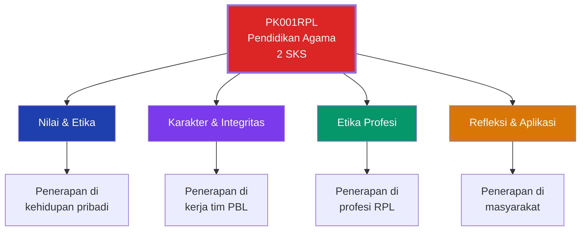
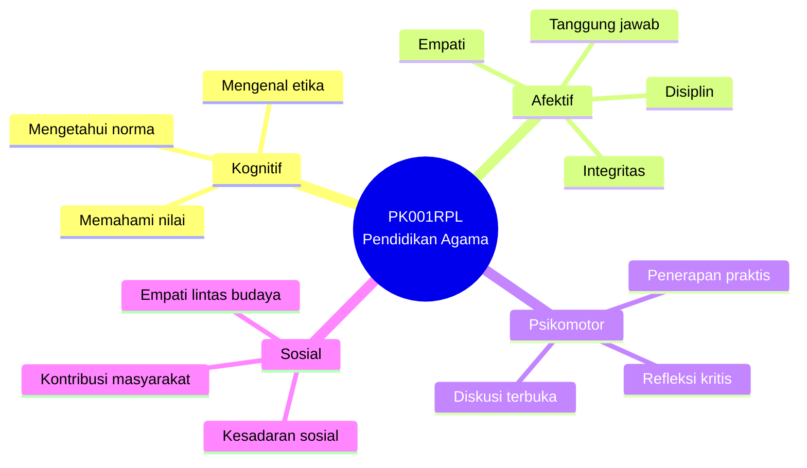
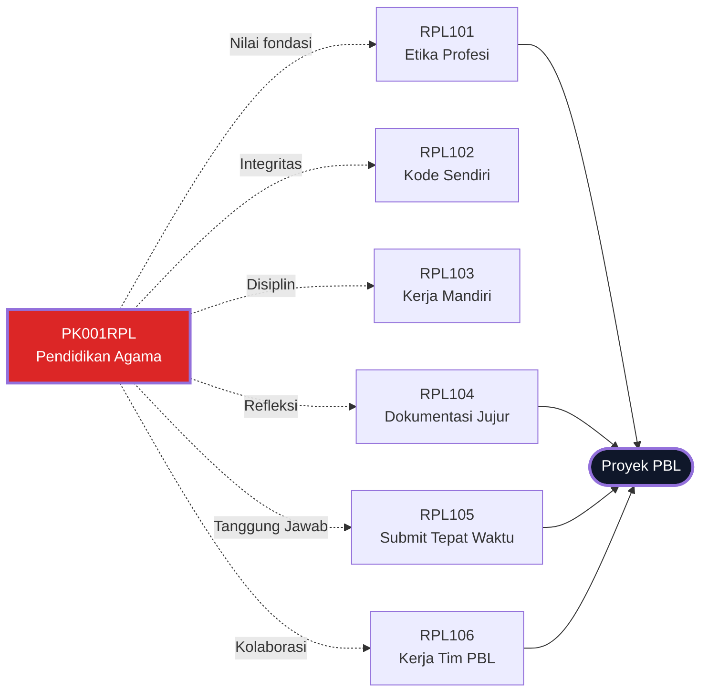
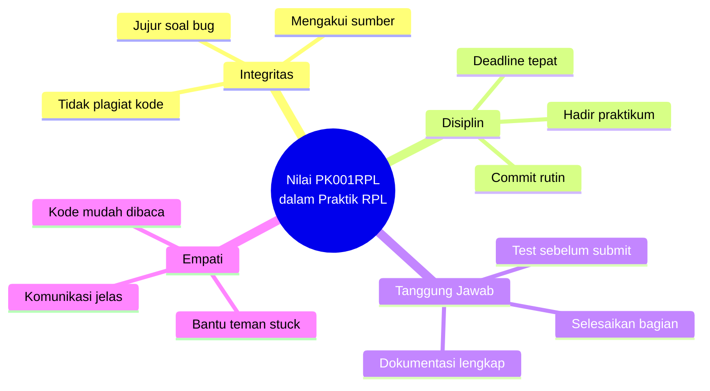
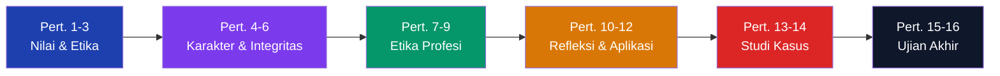
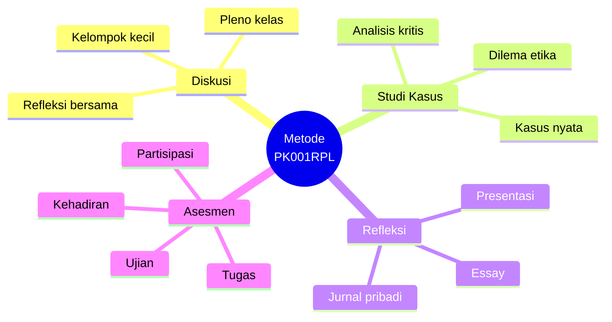
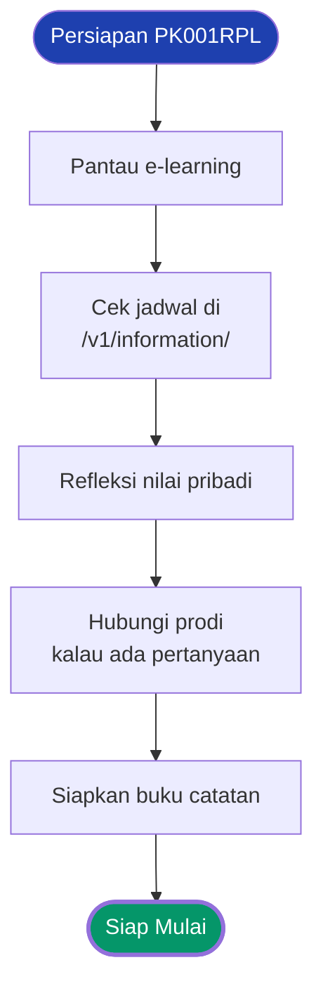
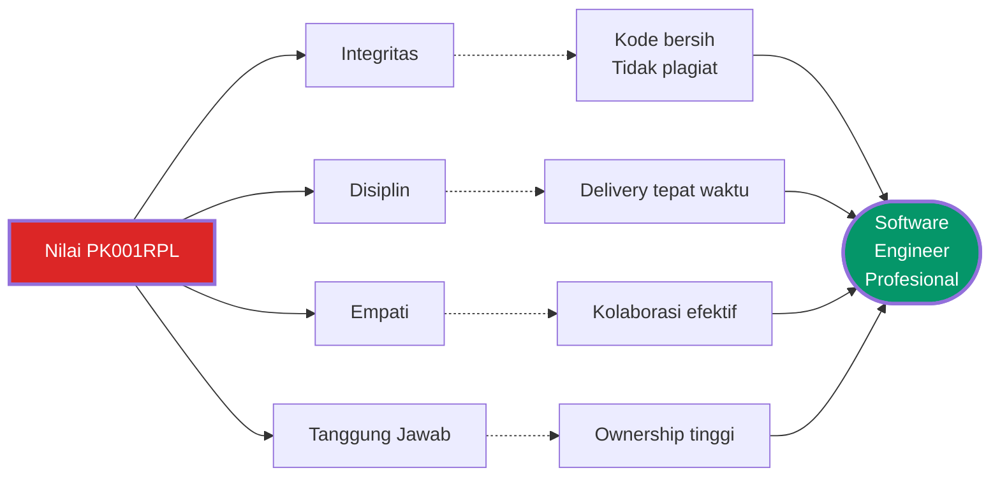

# PK001RPL — Pendidikan Agama

**Kode:** PK001RPL · **SKS:** 2 · **Semester:** Ganjil 2026/2027 · **Status:** Wajib
**Program Studi:** D4 Teknologi Rekayasa Perangkat Lunak
**Dosen:** _Belum dipublikasikan_
**RPS:** _Belum dipublikasikan_

> **Tagline:** Membangun karakter, etika, dan integritas sebagai fondasi perekayasa perangkat lunak profesional.

:::warning[Informasi Belum Dipublikasikan]
**RPS** dan **dosen pengampu** untuk mata kuliah ini belum dipublikasikan program studi. Halaman akan diperbarui begitu dokumen resmi tersedia.
:::

:::tip[Portal E-Learning]
[**Buka E-Learning IF Polibatam →**](https://learningif.polibatam.ac.id)
:::

## Navigasi Cepat

-   [Informasi Umum](#informasi-umum)
-   [Tujuan Pembelajaran](#tujuan-pembelajaran)
-   [Keterkaitan dengan Mata Kuliah Lain](#keterkaitan-dengan-mata-kuliah-lain)
-   [Struktur Umum Perkuliahan](#struktur-umum-perkuliahan)
-   [Panduan Sementara](#panduan-sementara)
-   [FAQ](#faq)

---

## Informasi Umum

|   Kode   | SKS |     Semester     | Status |
| :------: | :-: | :--------------: | :----: |
| PK001RPL |  2  | Ganjil 2026/2027 | Wajib  |

| Bidang            | Keterangan                            |
| ----------------- | ------------------------------------- |
| **Nama**          | Pendidikan Agama                      |
| **Prasyarat**     | Tidak ada                             |
| **Program Studi** | D4 Teknologi Rekayasa Perangkat Lunak |
| **Dosen**         | _Belum dipublikasikan_                |
| **RPS**           | _Belum dipublikasikan_                |

### Deskripsi

Mata kuliah pembentukan karakter yang membantu mahasiswa memahami dan menginternalisasi **nilai-nilai keagamaan** sebagai landasan berperilaku — dalam kehidupan pribadi, akademik, dan profesional. Menekankan pemahaman nilai, penerapan etika, pengembangan karakter, dan tanggung jawab sosial.

### Posisi PK001RPL dalam Kurikulum

:::info[Mata kuliah non-teknis, tapi krusial]
PK001RPL mungkin terasa "di luar" dari kurikulum teknis RPL. Tapi justru di sini fondasi **karakter profesional** dibangun — integritas, disiplin, dan tanggung jawab yang akan melekat sepanjang karier sebagai software engineer.
:::

---

## Tujuan Pembelajaran

> Bersifat sementara — akan digantikan rumusan resmi begitu RPS terbit.

Setelah menyelesaikan mata kuliah ini, mahasiswa diharapkan mampu:

1. **Memahami nilai keagamaan** sebagai landasan etika dan moral.
2. **Menerapkan prinsip etika** dalam interaksi sosial dan profesional.
3. **Mengembangkan karakter** yang mendukung integritas akademik.
4. **Membangun kesadaran sosial** sebagai bagian masyarakat dan industri.
5. **Merefleksikan nilai keagamaan** dalam konteks teknologi dan profesi RPL.

### Peta Kompetensi

---

## Keterkaitan dengan Mata Kuliah Lain

PK001RPL **tidak terhubung langsung ke PBL** — tapi nilai-nilainya memperkuat seluruh perjalanan akademik.

### Diagram Keterkaitan

| Nilai               | Diterapkan di                |
| ------------------- | ---------------------------- |
| Integritas Akademik | Semua pengumpulan tugas      |
| Etika Kerja Tim     | Proyek PBL                   |
| Tanggung Jawab      | Menyelesaikan bagian sendiri |
| Disiplin            | Kehadiran, ketepatan waktu   |
| Empati & Komunikasi | Diskusi, presentasi          |
| Kepedulian Sosial   | Membangun solusi bermanfaat  |

### Penerapan dalam Konteks RPL

---

## Struktur Umum Perkuliahan

> Indikatif — dapat berubah sesuai RPS resmi.

| Aspek         | Keterangan                                 |
| ------------- | ------------------------------------------ |
| **Bentuk**    | Kuliah teori (daring/luring)               |
| **Metode**    | Diskusi, studi kasus, refleksi, presentasi |
| **Penilaian** | Kehadiran, tugas, partisipasi, ujian       |

**Kemungkinan topik:** nilai & etika, karakter & integritas, etika profesi, refleksi & aplikasi.

### Kemungkinan Alur 16 Pertemuan

:::info[Indikatif]
Alur di atas **belum final** — hanya estimasi berdasarkan pola umum mata kuliah serupa. Akan diperbarui setelah RPS resmi terbit.
:::

### Metode Pembelajaran

---

## Panduan Sementara

:::tip[Yang Bisa Dilakukan Sekarang]

1. **Pantau e-learning** untuk pengumuman resmi.
2. **Cek [Informasi Perkuliahan](/docs/v1/information/)** untuk jadwal.
3. **Refleksikan nilai pribadi** yang ingin dikembangkan semester ini.
4. **Hubungi koordinator prodi** jika ada pertanyaan mendesak.

:::

:::warning[Hindari]

-   Mengandalkan halaman ini sebagai sumber tunggal.
-   Membuat asumsi tentang dosen/jadwal sebelum RPS terbit.
-   Menunda menghubungi prodi jika ada ketidakjelasan.

:::

### Checklist Persiapan

---

## FAQ

Mengapa RPS belum dipublikasikan?

Program studi biasanya mempublikasikan setelah kontrak perkuliahan disepakati. Pantau e-learning untuk pengumuman terbaru.

Apakah tetap perlu menyiapkan diri?

**Ya.** Fokus umumnya nilai, etika, dan karakter. Bisa dimulai dengan refleksi pribadi dan melatih disiplin.

Terhubung ke PBL?

**Tidak langsung.** Nilai-nilainya relevan untuk kerja tim PBL.

Berapa bobot SKS?

**2 SKS** — relatif ringan. Penilaian biasanya: kehadiran, tugas, partisipasi, ujian.

Kalau tidak setuju dengan nilai yang diajarkan?

Mata kuliah ini menghargai keberagaman dan refleksi kritis, bukan indoktrinasi. Diskusikan dengan dosen secara terbuka.

---

## Tips Praktis

:::tip[Strategi Belajar PK001RPL]

-   **Buka pikiran** — ini mata kuliah refleksi, bukan hafalan.
-   **Catat contoh nyata** — kaitkan nilai dengan kejadian sehari-hari.
-   **Diskusi aktif** — kelas biasanya menekankan partisipasi.
-   **Jurnal pribadi** — refleksi tulisan membantu pemahaman.
-   **Kaitkan dengan RPL** — bagaimana nilai agama diterapkan di profesi IT?
-   **Tepat waktu** — kehadiran biasanya berbobot besar di mata kuliah non-teknis.
-   **Siapkan diri untuk ujian** — biasanya essay, bukan pilihan ganda.

:::

:::warning[Jebakan Umum]

-   **Anggap "mata kuliah ringan"** — nilai tetap dihitung di IPK.
-   **Skip kelas** — kehadiran biasanya berbobot besar.
-   **Tidak siapkan essay** — ujian non-teknis biasanya essay.
-   **Menunda tugas refleksi** — sifatnya pribadi, butuh waktu.
-   **Belajar H-1** — pemahaman nilai butuh waktu internalisasi.

:::

### Nilai → Karier RPL

---

## Halaman Terkait

| Halaman                                        | Deskripsi                        |
| ---------------------------------------------- | -------------------------------- |
| [Informasi Perkuliahan](/docs/v1/information/) | Jadwal, kontak dosen, tim PBL.   |
| [Mata Kuliah](/docs/v1/courses/)               | Daftar mata kuliah semester ini. |
| [Tugas](/docs/v1/task/)                        | Daftar tugas.                    |
| [Format Halaman Konten](/docs/format/page)     | Panduan penulisan.               |
