# RPL101 — Pengantar Rekayasa Perangkat Lunak

**Kode:** RPL101 · **SKS:** 3 · **Semester:** Ganjil 2026/2027 · **Status:** Wajib
**Pengajar:** Metta Santiputri (koord.), Iqbal Afif, Kevin Riady, Banu Failasuf
**Email:** metta@polibatam.ac.id, iqbal@polibatam.ac.id, banu@polibatam.ac.id
**RPS:** [Buka →](https://learning-if.polibatam.ac.id/mod/resource/view.php?id=1691)

> **Tagline:** Fondasi berpikir sebagai perekayasa perangkat lunak — dari etika profesi, analisis, perancangan, hingga proyek PBL nyata bersama tim.

:::tip[E-Learning Resmi]
[**Buka Halaman RPL101 →**](https://learning-if.polibatam.ac.id/course/view.php?id=119)
:::

## Navigasi Cepat

-   [Peta Materi](#peta-materi)
-   [Informasi Umum](#informasi-umum)
-   [Tujuan Pembelajaran](#tujuan-pembelajaran)
-   [Jadwal Kuliah](#jadwal-kuliah)
-   [Proyek PBL](#proyek-pbl)
-   [Target Mingguan](#target-mingguan)
-   [Materi Perkuliahan](#materi-perkuliahan)
-   [Metode Evaluasi](#metode-evaluasi)
-   [Kesepakatan](#kesepakatan)
-   [Pustaka](#pustaka)

---

## Peta Materi

Perjalanan RPL101 mengikuti **siklus hidup pengembangan perangkat lunak**.

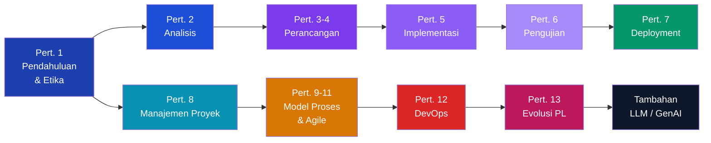

| Pertemuan | Topik                                           |
| :-------: | ----------------------------------------------- |
|     1     | Pendahuluan & Etika — Peran Perekayasa, SWEBOK  |
|     2     | Analisis — Kebutuhan Fungsional & Nonfungsional |
|    3–4    | Perancangan — Arsitektur, Komponen, Antarmuka   |
|     5     | Implementasi — Design Pattern, Reuse            |
|     6     | Pengujian — Komponen, Sistem, Use Case          |
|     7     | Deployment — Instalasi & Aktivasi               |
|     8     | Manajemen Proyek — Risiko, Tim, Perencanaan     |
|   9–10    | Model Proses — Waterfall, Iteratif, Agile       |
|    11     | Agile — Scrum                                   |
|    12     | DevOps — CI/CD, Automation                      |
|    13     | Evolusi — Maintenance, Reuse                    |
| Tambahan  | LLM / GenAI untuk Software Engineering          |

### RPL101 dalam Kurikulum

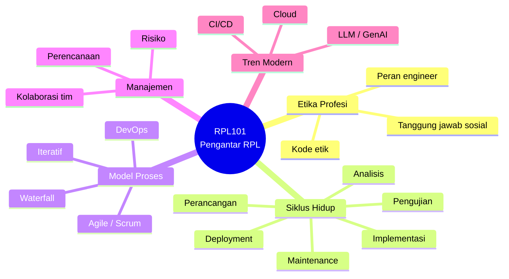

---

## Informasi Umum

|  Kode  | SKS |     Semester     | Status |
| :----: | :-: | :--------------: | :----: |
| RPL101 |  3  | Ganjil 2026/2027 | Wajib  |

| Bidang        | Keterangan                                                                  |
| ------------- | --------------------------------------------------------------------------- |
| **Nama**      | Pengantar Rekayasa Perangkat Lunak                                          |
| **Prasyarat** | Tidak ada                                                                   |
| **Pengajar**  | Metta Santiputri (koord.), Iqbal Afif, Kevin Riady, Banu Failasuf           |
| **Email**     | metta@polibatam.ac.id, iqbal@polibatam.ac.id, banu@polibatam.ac.id          |
| **RPS**       | [Buka →](https://learning-if.polibatam.ac.id/mod/resource/view.php?id=1691) |

### Deskripsi

Pengenalan tentang pengertian perangkat lunak, rekayasa perangkat lunak, aktivitas pengembangan, manajemen pengembangan, dokumentasi dan standar, model proses & paradigma pengembangan, serta peran dalam pengembangan perangkat lunak.

:::info[Apa itu Rekayasa Perangkat Lunak?]
**Software Engineering** adalah disiplin yang menggabungkan **prinsip engineering** dengan **ilmu komputer** untuk membangun perangkat lunak yang andal, efisien, dan dapat di-maintain.

Bukan hanya "menulis kode", tapi mencakup seluruh siklus hidup: dari memahami masalah, merancang solusi, hingga memelihara produk setelah dirilis.
:::

---

## Tujuan Pembelajaran

Setelah menyelesaikan mata kuliah ini, mahasiswa mampu:

| No. | Tujuan                                                                         |
| :-: | ------------------------------------------------------------------------------ |
|  1  | Menjelaskan peran perekayasa perangkat lunak dalam masyarakat (≥80% ketepatan) |
|  2  | Memformulasikan & menjustifikasi pemecahan masalah tim (≥80% argumen relevan)  |
|  3  | Mendesain aplikasi sederhana (≥85% kriteria fungsional)                        |
|  4  | Menuliskan dokumentasi teknis (≥80% kelengkapan)                               |
|  5  | Bekerja sama efektif dalam tim (≥80% kontribusi)                               |
|  6  | Mempresentasikan hasil kerja dalam Bahasa Inggris (≥75% kejelasan)             |

### Peta Tujuan → Kompetensi

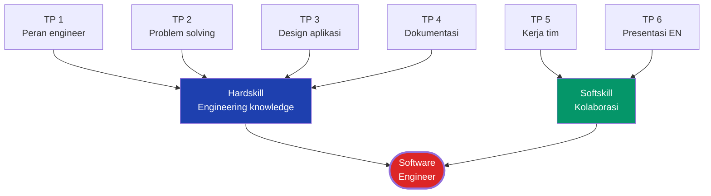

---

## Jadwal Kuliah

### Teori (Daring) — Metta Santiputri (MS)

| Kelas      | Hari   | Waktu         |
| ---------- | ------ | ------------- |
| Pagi A, B  | Rabu   | 13.40 – 15.20 |
| Pagi C     | Kamis  | 11.10 – 12.50 |
| Malam A, B | Senin  | 18.50 – 19.40 |
| Malam C    | Selasa | 18.00 – 18.50 |

:::info[Link Zoom]
**Zoom:** [Buka →](https://zoom.us/j/95981903274) · **Meeting ID:** 959 8190 3274 · **Passcode:** 542212

**Format nama:** `Kelas_NIM_Nama`
:::

### Praktikum (Luring)

| Kelas   | Hari   | Waktu         | Pengajar |
| ------- | ------ | ------------- | -------- |
| Pagi A  | Selasa | 09.30 – 10.20 | MS       |
| Pagi B  | Selasa | 07.50 – 11.10 | KV       |
| Pagi C  | Senin  | 12.50 – 16.10 | MS       |
| Malam A | Senin  | 20.30 – 21.20 | IQ       |
| Malam B | Kamis  | 20.30 – 23.00 | IQ       |
| Malam C | Rabu   | 20.30 – 23.00 | IQ       |

### Peta Jadwal Mingguan

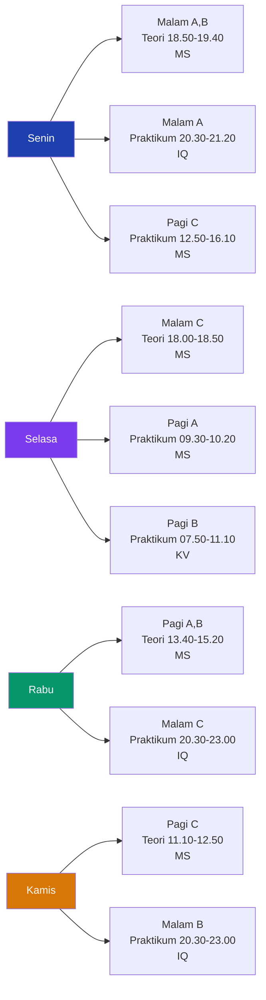

---

## Proyek PBL

_Project-Based Learning_ — model pembelajaran yang berpusat pada peserta didik melalui investigasi mendalam terhadap topik nyata dan relevan.

### Alur PBL

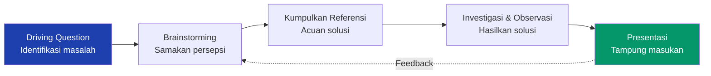

**Alur PBL:**

1. **Driving Question** — identifikasi masalah
2. **Brainstorming** — samakan persepsi
3. **Kumpulkan referensi** — acuan solusi
4. **Investigasi & observasi** — hasilkan solusi
5. **Presentasi** — tampung masukan

### Panduan & Tim

| Dokumen                 | Tautan                                                                                                                    |
| ----------------------- | ------------------------------------------------------------------------------------------------------------------------- |
| Panduan PBL Semester 1  | [PDF →](https://learning-if.polibatam.ac.id/pluginfile.php/36673/mod_label/intro/Panduan%20PBL%20Sem%201%202026-2027.pdf) |
| Pembagian Judul dan Tim | [Buka →](https://polibotam.id/tim-pbl-sem1-trpl-2026)                                                                     |

### Target Luaran

:::info[ATS — Asesmen Tengah Semester]
Presentasi progres: identifikasi kebutuhan, prototype frontend, dan skema data.
:::

:::info[AAS — Asesmen Akhir Semester]
Presentasi progres: produk jadi, kasus uji, dan dokumentasi lengkap.
:::

:::warning[Perhatian]
Praktikum dipakai untuk **monitoring mingguan**. Tiap kelompok presentasi progres. Proyek ini **berpengaruh besar** ke semua mata kuliah yang terlibat PBL.
:::

### Siklus PBL & ATS/AAS

```mermaid
gantt
    title Timeline PBL Semester 1
    dateFormat X
    axisFormat %s

    section Identifikasi
    Penjelasan project    :p1, 0, 1
    Identifikasi masalah  :p2, 1, 1

    section Desain
    Model kebutuhan PL    :p3, 2, 1
    Model data & UI       :p4, 3, 1

    section Prototipe
    Implementasi UI       :p5, 4, 1
    Melengkapi laporan    :p6, 5, 1

    section ATS
    Berkas ATS            :crit, ats, 6, 1

    section Implementasi
    Implementasi PL       :p7, 7, 4

    section Testing
    Menguji PL            :p8, 11, 2

    section AAS
    Verifikasi & AAS      :crit, aas, 13, 1
```

### Format Dokumen

| Dokumen        | Tautan                                                                      |
| -------------- | --------------------------------------------------------------------------- |
| Format Laporan | [Buka →](https://learning-if.polibatam.ac.id/mod/resource/view.php?id=1707) |
| Format RPP     | [Buka →](https://learning-if.polibatam.ac.id/mod/resource/view.php?id=1708) |

### Keterkaitan dengan Mata Kuliah Lain

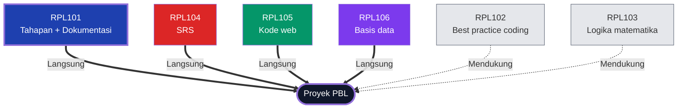

| Kode   | Minimum Requirement                             | Peran     |
| ------ | ----------------------------------------------- | --------- |
| RPL101 | Tahapan pengembangan + dokumentasi + presentasi | Langsung  |
| RPL102 | Best practice pemrograman web                   | Mendukung |
| RPL103 | Logika matematika pada program                  | Mendukung |
| RPL104 | Validasi requirement (SRS)                      | Langsung  |
| RPL105 | Kode aplikasi berbasis web                      | Langsung  |
| RPL106 | Basis data dengan ERD/EERD                      | Langsung  |

---

## Target Mingguan

Setiap minggu, tim mengerjakan **Lembar Aktivitas Tugas** yang bisa diunduh dari e-learning.

| Minggu | Aktivitas                   |
| :----: | --------------------------- |
|   1    | Penjelasan project          |
|   2    | Identifikasi masalah        |
|   3    | Model kebutuhan PL          |
|   4    | Model data & antarmuka      |
|   5    | Implementasi antarmuka      |
|   6    | Melengkapi laporan          |
| **7**  | **Berkas ATS**              |
|  8–11  | Implementasi PL (4 minggu)  |
| 12–13  | Menguji PL                  |
| **14** | **Verifikasi & berkas AAS** |

### Pengumpulan

| Aktivitas              | Peran         | Tenggat                 | Tautan                                                                         |
| ---------------------- | ------------- | ----------------------- | ------------------------------------------------------------------------------ |
| Aktivitas Tugas #1     | Ketua tim     | Jum, 18 Sep 2026, 23.59 | [Kumpulkan →](https://learning-if.polibatam.ac.id/mod/assign/view.php?id=1712) |
| Refleksi Diri Minggu 2 | Per mahasiswa | Sen, 21 Sep 2026, 00.00 | [Isi →](https://learning-if.polibatam.ac.id/mod/quiz/view.php?id=1713)         |

### Peran Tim dalam PBL

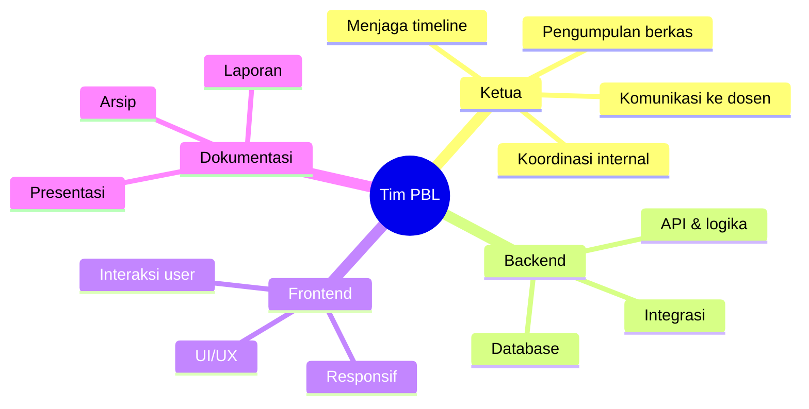

---

## Materi Perkuliahan

[**Buka Folder Materi RPL101 →**](https://learning-if.polibatam.ac.id/course/view.php?id=119)

### Pertemuan 1: Pendahuluan

**Pokok bahasan:** silabus, pengenalan RPL, SWEBOK, etika.

[**Materi 1-Pendahuluan →**](https://learning-if.polibatam.ac.id/mod/resource/view.php?id=1740)

Studi Kasus Kegagalan PL

-   [Ariane 5 →](https://youtu.be/5tJPXYA0Nec)
-   [Therac-25 →](https://youtu.be/Ap0orGCiou8)

**Kenapa ini penting?** Kegagalan software bisa mengakibatkan kerugian miliaran dolar bahkan korban jiwa. Contoh-contoh ini mengingatkan bahwa software engineering bukan sekadar menulis kode.

### Pertemuan 2: Analisis

**Pokok bahasan:** kebutuhan fungsional/nonfungsional, spesifikasi, use case, proses analisis.

[**Materi 2-Analisis →**](https://learning-if.polibatam.ac.id/mod/resource/view.php?id=1744)

Contoh SRS/SKPL

-   [SRS SAFARR](https://learning-if.polibatam.ac.id/pluginfile.php/36713/mod_label/intro/software-requirements-specifications-safarr-version-7-0.pdf)
-   [SRS Brain Tumor](https://learning-if.polibatam.ac.id/pluginfile.php/36713/mod_label/intro/srs-software-requirements-specification-document.pdf)
-   [SRS AI Cataloguing](https://learning-if.polibatam.ac.id/pluginfile.php/36713/mod_label/intro/software-requirements-specification.pdf)
-   [SRS POS](https://learning-if.polibatam.ac.id/pluginfile.php/36713/mod_label/intro/pos-srs-document.pdf)
-   [SKPL SISAC ITS](https://learning-if.polibatam.ac.id/pluginfile.php/36713/mod_label/intro/SKPL_SISAC.pdf)
-   [SKPL SISKAL ITS](https://learning-if.polibatam.ac.id/pluginfile.php/36713/mod_label/intro/SKPL_SISKAL%20%282%29.pdf)
-   [SKPL PDPT Dikti](https://learning-if.polibatam.ac.id/pluginfile.php/36713/mod_label/intro/SKPL_PDPT_Dikti%20%281%29.pdf)

### Pertemuan 3–4: Perancangan

**Pokok bahasan:** arsitektur, konsep perancangan, komponen, antarmuka.

> Topik lanjutan dipelajari di IMK, Basis Data, Pemrograman, dan Perancangan PL.

### Pertemuan 5: Implementasi

**Pokok bahasan:** desain & implementasi, design pattern, reuse.

### Pertemuan 6: Pengujian

**Pokok bahasan:** testing komponen, antarmuka, sistem, use-case, TDD, testing rilis, testing pengguna.

### Pertemuan 7: Deployment

**Pokok bahasan:** proses inti deployment, instalasi & aktivasi.

### Pertemuan 8: Manajemen Proyek

**Pokok bahasan:** perencanaan, manajemen risiko, pengelolaan tim.

### Pertemuan 9–11: Model Proses & Agile

**Pokok bahasan:** aktivitas pengembangan, model proses, paradigma agile — Scrum.

### Pertemuan 12: DevOps

**Pokok bahasan:** pengenalan, prinsip, otomatisasi, deployment pipeline, toolchain.

### Pertemuan 13: Evolusi PL

**Pokok bahasan:** perubahan, pemeliharaan, reuse perangkat lunak.

### Pertemuan Tambahan: LLM/GenAI

**Pokok bahasan:** rekayasa perangkat lunak dengan LLM.

### Peta Materi Detail

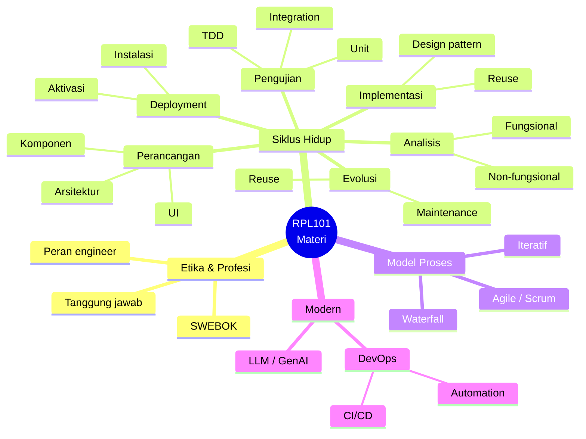

---

## Metode Evaluasi

**Bentuk:** Case-method + PBL, presentasi progres (2×), ujian teori daring (ATS & AAS).

### Komponen Penilaian

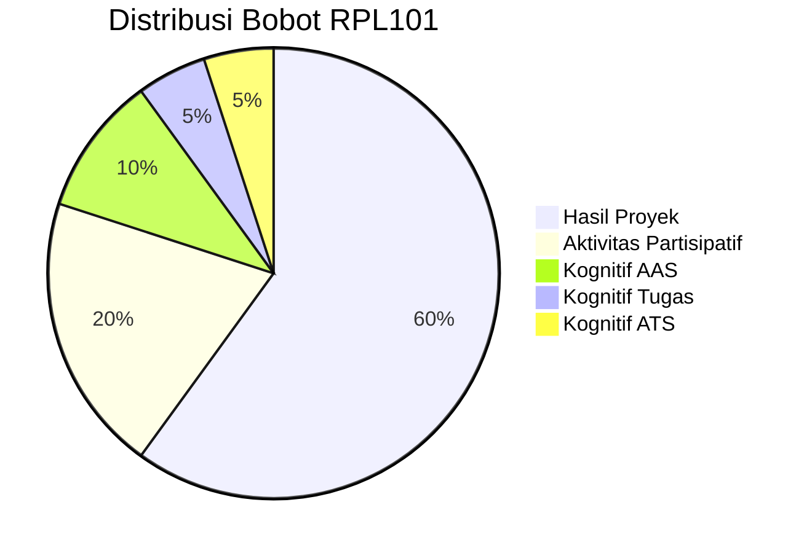

| Komponen               | Bobot |
| ---------------------- | :---: |
| Hasil Proyek           |  60%  |
| Aktivitas Partisipatif |  20%  |
| Kognitif AAS           |  10%  |
| Kognitif Tugas         |  5%   |
| Kognitif ATS           |  5%   |

:::info[Distribusi]
**Hasil Proyek = 60%** — PBL adalah inti mata kuliah ini.

Bandingkan dengan RPL104 yang fokus pada SRS, atau RPL105 yang fokus implementasi — di RPL101 semuanya bertemu dalam satu proyek tim.
:::

### Kriteria Nilai

| Angka | Huruf | Angka | Huruf |
| :---: | :---: | :---: | :---: |
|  ≥85  |   A   | 60–64 |  C+   |
| 80–84 |  A-   | 55–59 |   C   |
| 75–79 |  B+   | 50–54 |  C-   |
| 70–74 |   B   | 45–49 |  D+   |
| 65–69 |  B-   | 40–44 |   D   |
|       |       | `<40` |   E   |

---

## Kesepakatan

1. Wajib ikut semua kegiatan sesuai jadwal.
2. Tugas dikumpulkan via e-learning.
3. Tugas wajib dikumpulkan sesuai batas akhir.
4. Partisipasi aktif dan sungguh-sungguh.
5. Jaga etika moral dan akademik.

:::warning[Konsekuensi]
Pelanggaran kesepakatan → sanksi akademik sesuai peraturan Politeknik Negeri Batam. Keterlambatan pengumpulan biasanya dikenai pengurangan nilai.
:::

---

## Pustaka

1. Jalote, P. _A Concise Introduction to Software Engineering_, 2nd ed. Springer, 2025.
2. Pressman, R. S. & Maxim, B. R. _Software Engineering: A Practitioner's Approach_, 9th ed. McGraw-Hill, 2020.
3. Sommerville, I. _Software Engineering_, 10th ed. Pearson, 2020.

### Peta Pustaka

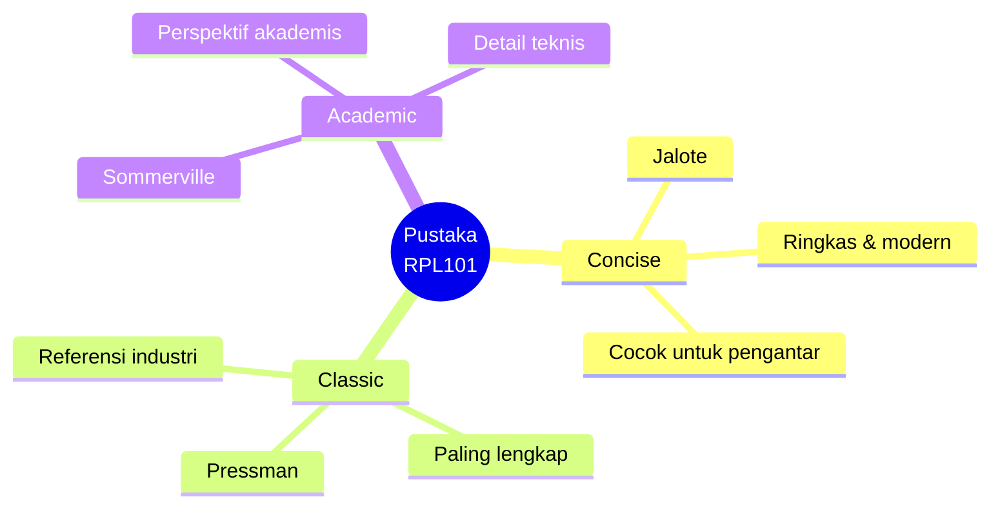

---

## Info Tambahan

Mata kuliah ini menggunakan framework **CDIO** — menekankan _softskill_ dan _hardskill_. Proyek semester ini adalah _cornerstone project_ untuk membangun kemampuan merancang aplikasi terkoneksi basis data, kerja tim, kolaborasi, komunikasi, dan refleksi.

**Kontribusi:** tahap **analisis** dan **perancangan** PL (fase _conceive_ & _design_ CDIO).

**Sarana praktikum:** 30 PC/laptop, MS Office, Visio, internet.

### RPL101 dalam CDIO

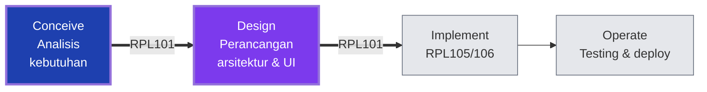

| Fase CDIO     | Kontribusi RPL101                         |
| ------------- | ----------------------------------------- |
| **Conceive**  | Memahami masalah, identifikasi kebutuhan  |
| **Design**    | Merancang arsitektur, komponen, UI        |
| **Implement** | (Tidak langsung — RPL105/106 yang koding) |
| **Operate**   | (Tidak langsung — testing & deploy)       |

RPL101 adalah **fondasi metode** untuk seluruh proyek PBL.

---

## Tips Praktis

:::tip[Strategi Belajar RPL101]

-   **Hadir setiap pertemuan** — konsepnya kumulatif, mudah tertinggal.
-   **Baca studi kasus kegagalan PL** — Ariane 5, Therac-25 — pelajaran mahal.
-   **Aktif di PBL** — 60% nilai dari proyek, bukan ujian.
-   **Komunikasi rutin tim** — grup WhatsApp/Telegram minimal.
-   **Dokumentasikan semuanya** — laporan, screenshot, keputusan.
-   **Presentasi latihan** — bahasa Inggris, jelas, ringkas.
-   **Gunakan template** — SRS, laporan, RPP dari e-learning.

:::

:::warning[Jebakan Umum]

-   **Menunda PBL** — proyeknya panjang, mulai dari minggu 1.
-   **Tidak hadir praktikum** — monitoring mingguan, absen berpengaruh.
-   **Anggap enteng dokumentasi** — 60% nilai dari hasil proyek + laporan.
-   **Tidak latihan presentasi** — ATS/AAS presentasi progres, bukan ujian tulis.
-   **Kerja sendiri** — ini proyek tim, distribusi beban penting.

:::

---

## Halaman Terkait

| Halaman                                             | Deskripsi             |
| --------------------------------------------------- | --------------------- |
| [Mata Kuliah](/docs/v1/courses/)                    | Daftar mata kuliah.   |
| [Info Tim PBL](/docs/v1/information/info-team-pbl)  | Deskripsi proyek PBL. |
| [Jadwal Kuliah](/docs/v1/information/jadwal-kuliah) | Jadwal mingguan.      |
| [Tugas](/docs/v1/task/)                             | Daftar tugas.         |
| [Format Halaman Konten](/docs/format/page)          | Panduan penulisan.    |
