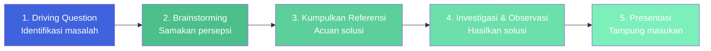
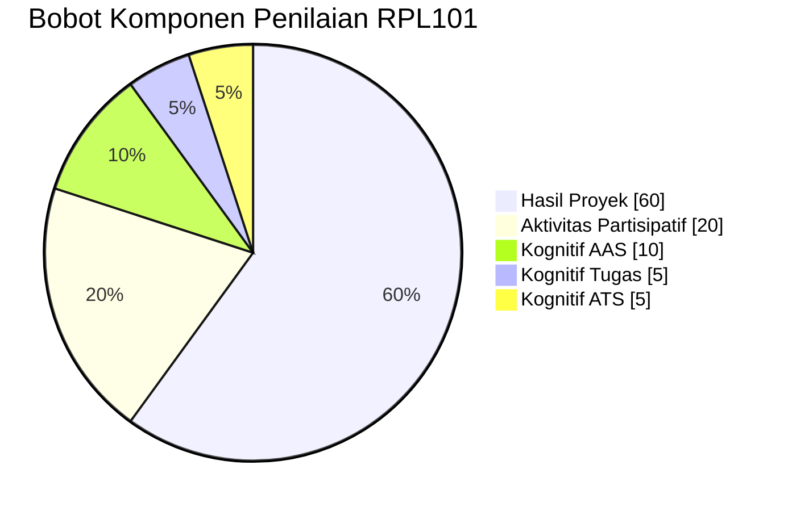

::: tip Halaman Resmi E-Learning
Seluruh materi, penugasan, dan aktivitas mata kuliah ini terpusat di e-learning Jurusan Teknik Informatika Politeknik Negeri Batam.

[**Buka Halaman Mata Kuliah RPL101 di E-Learning →**](https://learning-if.polibatam.ac.id/course/view.php?id=119)
:::

## Peta Mata Kuliah

Perjalanan belajar RPL101 mengikuti alur **siklus hidup pengembangan perangkat lunak** — dari memahami profesi, menganalisis kebutuhan, merancang, mengimplementasi, menguji, hingga mengevolusi perangkat lunak.

```mermaid
flowchart TB
    P1["PERTEMUAN 1<br/>Pendahuluan & Etika<br/>Peran Perekayasa · SWEBOK"]
    P2["PERTEMUAN 2<br/>Analisis<br/>Kebutuhan Fungsional & Nonfungsional"]
    P34["PERTEMUAN 3–4<br/>Perancangan<br/>Arsitektur · Komponen · Antarmuka"]
    P5["PERTEMUAN 5<br/>Implementasi<br/>Design Pattern · Reuse"]
    P6["PERTEMUAN 6<br/>Pengujian<br/>Komponen · Sistem · Use Case"]
    P7["PERTEMUAN 7<br/>Deployment<br/>Instalasi & Aktivasi"]
    P8["PERTEMUAN 8<br/>Manajemen Proyek<br/>Risiko · Tim · Perencanaan"]
    P910["PERTEMUAN 9–10<br/>Model Proses<br/>Waterfall · Iteratif · Agile"]
    P11["PERTEMUAN 11<br/>Agile — Scrum<br/>Sprint · Backlog · Retrospective"]
    P12["PERTEMUAN 12<br/>DevOps<br/>CI/CD · Automation"]
    P13["PERTEMUAN 13<br/>Evolusi<br/>Maintenance · Reuse"]
    PX["PERTEMUAN TAMBAHAN<br/>LLM / GenAI<br/>Software Engineering with LLM"]

    P1 --> P2 --> P34 --> P5 --> P6 --> P7 --> P8
    P8 --> P910 --> P11 --> P12 --> P13 --> PX

    style P1 fill:#3e63dd,color:#fff
    style P2 fill:#2f6f4e,color:#fff
    style P34 fill:#47bd8a,color:#fff
    style P5 fill:#4cc292,color:#fff
    style P6 fill:#51c79a,color:#fff
    style P7 fill:#56cca2,color:#fff
    style P8 fill:#5bd1aa,color:#fff
    style P910 fill:#60d6b2,color:#fff
    style P11 fill:#65dbba,color:#fff
    style P12 fill:#6ae0c2,color:#fff
    style P13 fill:#6fe5ca,color:#fff
    style PX fill:#74ead2,color:#fff
```

**Benang merah:** Setiap pertemuan memperkuat satu tahap dalam siklus hidup perangkat lunak, dan seluruh tahap tersebut **langsung diterapkan** dalam proyek PBL yang berjalan paralel sepanjang semester.

## Informasi Umum

| **Kode** | **SKS** |   **Semester**   | **Status** |
| :------: | :-----: | :--------------: | :--------: |
|  RPL101  |    3    | Ganjil 2026/2027 |   Wajib    |

| Bidang               | Keterangan                                                             |
| -------------------- | ---------------------------------------------------------------------- |
| **Nama Mata Kuliah** | Pengantar Rekayasa Perangkat Lunak                                     |
| **Prasyarat**        | Tidak ada                                                              |
| **Program Studi**    | Teknologi Rekayasa Perangkat Lunak (D4)                                |
| **Pengajar**         | Metta Santiputri (koordinator), Iqbal Afif, Kevin Riady, Banu Failasuf |
| **Email**            | metta@polibatam.ac.id, iqbal@polibatam.ac.id, banu@polibatam.ac.id     |

### Deskripsi Mata Kuliah

Pengenalan yang berisi tentang pengertian perangkat lunak, rekayasa perangkat lunak, aktivitas pengembangan perangkat lunak, manajemen pengembangan perangkat lunak, serta dokumentasi dan standar. Selain itu diperkenalkan pula beberapa model proses dan paradigma pengembangan perangkat lunak serta peran dalam pengembangan perangkat lunak.

### Berkas Pendukung

| Dokumen                             | Tautan                                                                                    |
| ----------------------------------- | ----------------------------------------------------------------------------------------- |
| Rencana Pembelajaran Semester (RPS) | [Buka di E-Learning →](https://learning-if.polibatam.ac.id/mod/resource/view.php?id=1691) |

::: info Cara Membaca Halaman Ini
Halaman ini disusun sebagai **satu perjalanan belajar**. Setiap pertemuan punya tujuan, pokok bahasan, dan kaitan dengan proyek PBL. Gunakan navigasi di kanan (outline) untuk melompat ke bagian tertentu, atau baca dari atas ke bawah sebagai satu cerita.
:::

## Tujuan Pembelajaran

Setelah menyelesaikan mata kuliah ini, mahasiswa mampu:

| No. | Tujuan Pembelajaran <Badge type="tip" text="6 TP" />                                                                                                                                                                     |
| :-: | ------------------------------------------------------------------------------------------------------------------------------------------------------------------------------------------------------------------------ |
|  1  | **Menjelaskan peran** seorang perekayasa perangkat lunak dalam masyarakat, mengklasifikasikan cabang-cabang RPL, fungsi seorang perekayasa, serta industri tempat bekerja, dengan ketepatan klasifikasi minimal **80%**. |
|  2  | **Memformulasikan dan menjustifikasi** pemecahan masalah dalam tim, dengan minimal **80%** argumen relevan.                                                                                                              |
|  3  | **Mendesain aplikasi sederhana** berdasarkan solusi yang telah diformulasi, dengan prototipe memenuhi **≥85%** kriteria fungsional.                                                                                      |
|  4  | **Menuliskan dokumentasi teknis** proyek perangkat lunak, dengan kelengkapan dan kerapihan minimal **80%**.                                                                                                              |
|  5  | **Bekerja sama secara efektif** dalam tim, ditunjukkan dengan kontribusi **≥80%** pada indikator kerjasama tim.                                                                                                          |
|  6  | **Mempresentasikan hasil kerja** proyek dalam Bahasa Inggris, dengan kejelasan isi dan bahasa minimal **75%**.                                                                                                           |

### Indikator Capaian per Tujuan

|  #  | Indikator                                                                     | Target | Progres               |
| :-: | ----------------------------------------------------------------------------- | :----: | --------------------- |
|  1  | Ketepatan klasifikasi cabang, fungsi, dan industri perekayasa perangkat lunak |  80%   | `████████████████░░░` |
|  2  | Argumen pemecahan masalah tim yang relevan                                    |  80%   | `████████████████░░░` |
|  3  | Prototipe memenuhi kriteria fungsional                                        |  85%   | `█████████████████░░` |
|  4  | Kelengkapan dan kerapihan dokumentasi teknis                                  |  80%   | `████████████████░░░` |
|  5  | Kontribusi pada indikator kerjasama tim (kehadiran, komunikasi, tugas)        |  80%   | `████████████████░░░` |
|  6  | Kejelasan isi dan bahasa saat presentasi                                      |  75%   | `███████████████░░░░` |

## Jadwal Kuliah

### Kuliah Teori (Daring) — Metta Santiputri (MS)

| Kelas            | Hari   | Waktu             |
| ---------------- | ------ | ----------------- |
| Pagi A, Pagi B   | Rabu   | 13.40 – 15.20 WIB |
| Pagi C           | Kamis  | 11.10 – 12.50 WIB |
| Malam A, Malam B | Senin  | 18.50 – 19.40 WIB |
| Malam C          | Selasa | 18.00 – 18.50 WIB |

::: info Link Kuliah Teori Daring

- **Zoom:** [https://zoom.us/j/95981903274](https://zoom.us/j/95981903274?pwd=5ubGdbfbPKHyW8KlexEwiwpiQXxaGj.1)
- **Meeting ID:** 959 8190 3274
- **Passcode:** 542212
- **Format penamaan Zoom:** `Kelas_NIM_Nama` — contoh: `A_43425010xx_Budi Berbudi`
  :::

### Kuliah Praktikum (Luring)

| Kelas   | Hari   | Waktu             | Pengajar              |
| ------- | ------ | ----------------- | --------------------- |
| Pagi A  | Selasa | 09.30 – 10.20 WIB | Metta Santiputri (MS) |
| Pagi B  | Selasa | 07.50 – 11.10 WIB | Kevin Riady (KV)      |
| Pagi C  | Senin  | 12.50 – 16.10 WIB | Metta Santiputri (MS) |
| Malam A | Senin  | 20.30 – 21.20 WIB | Iqbal Afif (IQ)       |
| Malam B | Kamis  | 20.30 – 23.00 WIB | Iqbal Afif (IQ)       |
| Malam C | Rabu   | 20.30 – 23.00 WIB | Iqbal Afif (IQ)       |

::: info Catatan
Nomor kontak setiap dosen pengajar dapat dilihat pada halaman [Jadwal Kuliah](/v1/information/jadwal-kuliah).
:::

## Proyek Pengembangan Perangkat Lunak (PBL)

_Project-based learning_ (PBL) atau pembelajaran berbasis proyek merupakan model pembelajaran yang berpusat pada peserta didik, yang mana partisipasi untuk melakukan suatu investigasi yang mendalam terhadap suatu topik bergantung peran dari peserta didik itu sendiri. Siswa secara konstruktif melakukan pendalaman pembelajaran dengan pendekatan berbasis riset terhadap permasalahan dan pertanyaan yang berbobot, nyata, dan relevan (_Panduan Pelaksanaan PBL Jurusan Teknik Informatika, 2021_).

### Alur PBL

### Panduan dan Pembagian Tim

| Dokumen                                                    | Tautan                                                                                                                                             |
| ---------------------------------------------------------- | -------------------------------------------------------------------------------------------------------------------------------------------------- |
| Panduan Project-Based Learning Semester 1 Ganjil 2026/2027 | [Unduh PDF →](https://learning-if.polibatam.ac.id/pluginfile.php/36673/mod_label/intro/Panduan%20PBL%20Sem%201%202026-2027.pdf?time=1788786165970) |
| Pembagian Judul dan Tim PBL                                | [Buka Halaman →](https://polibatam.id/tim-pbl-sem1-trpl-2026)                                                                                      |

### Target Luaran Proyek

::: info ATS — Asesmen Tengah Semester
**Bentuk:** Presentasi progres PBL

**Materi:** identifikasi kebutuhan, prototype (frontend UI), dan skema data
:::

::: info AAS — Asesmen Akhir Semester
**Bentuk:** Presentasi progres PBL

**Materi:** produk jadi, kasus uji dan hasil uji, dan dokumentasi lengkap
:::

::: warning Perhatian
Sesi praktikum mata kuliah Pengantar RPL digunakan oleh dosen pengajar untuk melakukan **monitoring pengerjaan proyek** dengan target mingguan yang harus dicapai. Tiap kelompok harus melakukan presentasi progres pengerjaan proyek pada sesi praktikum tersebut.

Pastikan proyek pengembangan perangkat lunak ini dikerjakan sebaik-baiknya, karena **berpengaruh besar terhadap penilaian di semua mata kuliah yang terlibat PBL** di semester ini.
:::

### Format Dokumen Proyek

| Dokumen                                     | Keterangan                                                                               | Tautan                                                                                    |
| ------------------------------------------- | ---------------------------------------------------------------------------------------- | ----------------------------------------------------------------------------------------- |
| **Format Laporan**                          | Template dokumen pembangunan perangkat lunak yang dikumpulkan lengkap di akhir semester. | [Buka di E-Learning →](https://learning-if.polibatam.ac.id/mod/resource/view.php?id=1707) |
| **Format Rencana Pelaksanaan Proyek (RPP)** | Template RPP yang disusun oleh tim proyek bersama dengan dosen pengajar (format DOCX).   | [Buka di E-Learning →](https://learning-if.polibatam.ac.id/mod/resource/view.php?id=1708) |

### Keterkaitan Proyek dengan Mata Kuliah Lain

| Kode   | Mata Kuliah                                        | Minimum Requirement                                                                                         | Keterkaitan PBL |
| ------ | -------------------------------------------------- | ----------------------------------------------------------------------------------------------------------- | --------------- |
| RPL101 | Pengantar Rekayasa Perangkat Lunak                 | Melaksanakan tahapan-tahapan pengembangan perangkat lunak, serta mendokumentasikan dan mempresentasikannya. | Langsung        |
| RPL102 | Algoritma dan Pemrograman                          | Menerapkan dasar-dasar pemrograman (best practice) pada pengembangan aplikasi berbasis web.                 | Mendukung       |
| RPL103 | Matematika Diskrit                                 | Menerapkan ilmu logika matematika pada implementasi programnya.                                             | Mendukung       |
| RPL104 | Analisis dan Spesifikasi Kebutuhan Perangkat Lunak | Memvalidasi requirement yang sudah ada dalam bentuk SRS atau dokumen.                                       | Langsung        |
| RPL105 | Pemrograman Berbasis Web                           | Pengkodean aplikasi berdasarkan requirement dengan menggunakan bahasa pemrograman berbasis web.             | Langsung        |
| RPL106 | Pengantar Basis Data                               | Men-create basis data berdasarkan requirement yang didukung dengan ERD atau EERD.                           | Langsung        |

## Target Mingguan Proyek

Setiap minggu, tim mengerjakan **Lembar Aktivitas Tugas** yang dapat diunduh langsung dari e-learning. Berikut ringkasan perjalanan proyek dari minggu ke minggu.

```mermaid
gantt
    title Timeline Proyek PBL — 14 Minggu
    dateFormat X
    axisFormat %s
    section Identifikasi
    Penjelasan project                       :a1, 0, 1
    Identifikasi masalah                     :a2, 1, 1
    section Desain
    Model kebutuhan perangkat lunak          :b1, 2, 1
    Model data & antarmuka                   :b2, 3, 1
    section Prototipe
    Implementasi antarmuka                   :c1, 4, 1
    Melengkapi laporan                       :c2, 5, 1
    Berkas ATS                               :crit, c3, 6, 1
    section Implementasi
    Implementasi perangkat lunak (4 minggu)  :d1, 7, 4
    section Pengujian
    Menguji perangkat lunak                  :e1, 11, 2
    section Finalisasi
    Verifikasi akhir & berkas AAS            :crit, f1, 13, 1
```

### Detail Lembar Aktivitas per Minggu

| Minggu | Deskripsi                                                              | Aktivitas Tugas (tugas tim)                                                                                                                                    | Refleksi Diri                                                                      |
| ------ | ---------------------------------------------------------------------- | -------------------------------------------------------------------------------------------------------------------------------------------------------------- | ---------------------------------------------------------------------------------- |
| 1      | Penjelasan mengenai project                                            | —                                                                                                                                                              | —                                                                                  |
| 2      | Mengidentifikasi permasalahan project                                  | [Lembar Aktivitas Tugas #1](https://learning-if.polibatam.ac.id/pluginfile.php/36678/mod_label/intro/Lembar%20Aktivitas%20Tugas%201.docx)                      | [Isi Refleksi Diri](https://learning-if.polibatam.ac.id/mod/quiz/view.php?id=1713) |
| 3      | Memodelkan Kebutuhan Perangkat Lunak                                   | [Lembar Aktivitas Tugas #2](https://learning-if.polibatam.ac.id/pluginfile.php/36678/mod_label/intro/Lembar%20Aktivitas%20Tugas%202.docx?time=1757490313408)   | —                                                                                  |
| 4      | Memodelkan Data dan Antarmuka Perangkat Lunak                          | [Lembar Aktivitas Tugas #3](https://learning-if.polibatam.ac.id/pluginfile.php/36678/mod_label/intro/Lembar%20Aktivitas%20Tugas%203.docx)                      | —                                                                                  |
| 5      | Mengimplementasikan Antarmuka Perangkat Lunak                          | [Lembar Aktivitas Tugas #4](https://learning-if.polibatam.ac.id/pluginfile.php/36678/mod_label/intro/Lembar%20Aktivitas%20Tugas%204.docx)                      | —                                                                                  |
| 6      | Melengkapi Laporan                                                     | [Lembar Aktivitas Tugas #5](https://learning-if.polibatam.ac.id/pluginfile.php/36678/mod_label/intro/Lembar%20Aktivitas%20Tugas%205.docx)                      | —                                                                                  |
| 7      | Melengkapi Berkas ATS                                                  | [Lembar Aktivitas Tugas #6](https://learning-if.polibatam.ac.id/pluginfile.php/36678/mod_label/intro/Lembar%20Aktivitas%20Tugas%206.docx)                      | —                                                                                  |
| 8      | Mengimplementasikan Perangkat Lunak                                    | [Lembar Aktivitas Tugas #7](https://learning-if.polibatam.ac.id/pluginfile.php/36678/mod_label/intro/Lembar%20Aktivitas%20Tugas%207.docx)                      | —                                                                                  |
| 9      | Mengimplementasikan Perangkat Lunak                                    | [Lembar Aktivitas Tugas #8](https://learning-if.polibatam.ac.id/pluginfile.php/36678/mod_label/intro/Lembar%20Aktivitas%20Tugas%208.docx)                      | —                                                                                  |
| 10     | Mengimplementasikan Perangkat Lunak                                    | [Lembar Aktivitas Tugas #9](https://learning-if.polibatam.ac.id/pluginfile.php/36678/mod_label/intro/Lembar%20Aktivitas%20Tugas%209.docx)                      | —                                                                                  |
| 11     | Mengimplementasikan Perangkat Lunak                                    | [Lembar Aktivitas Tugas #10](https://learning-if.polibatam.ac.id/pluginfile.php/36678/mod_label/intro/Lembar%20Aktivitas%20Tugas%2010.docx)                    | —                                                                                  |
| 12     | Menguji Perangkat Lunak                                                | [Lembar Aktivitas Tugas #11](https://learning-if.polibatam.ac.id/pluginfile.php/36678/mod_label/intro/Lembar%20Aktivitas%20Tugas%2011.docx)                    | —                                                                                  |
| 13     | Menguji Perangkat Lunak                                                | [Lembar Aktivitas Tugas #12](https://learning-if.polibatam.ac.id/pluginfile.php/36678/mod_label/intro/Lembar%20Aktivitas%20Tugas%2012.docx)                    | —                                                                                  |
| 14     | Memeriksa kesesuaian seluruh perangkat lunak dan melengkapi Berkas AAS | [Lembar Aktivitas Tugas #13](https://learning-if.polibatam.ac.id/pluginfile.php/36678/mod_label/intro/Lembar%20Aktivitas%20Tugas%2013.docx?time=1788767339494) | —                                                                                  |

### Pengumpulan Tugas

| Aktivitas                      | Peran          | Tenggat                             | Tautan                                                                                       |
| ------------------------------ | -------------- | ----------------------------------- | -------------------------------------------------------------------------------------------- |
| Pengumpulan Aktivitas Tugas #1 | Ketua tim saja | Jumat, 18 September 2026, 23.59 WIB | [Kumpulkan di E-Learning →](https://learning-if.polibatam.ac.id/mod/assign/view.php?id=1712) |
| Refleksi Diri Minggu 2         | Per mahasiswa  | Senin, 21 September 2026, 00.00 WIB | [Isi di E-Learning →](https://learning-if.polibatam.ac.id/mod/quiz/view.php?id=1713)         |

## Materi Perkuliahan

Semua materi perkuliahan dapat diakses melalui e-learning RPL101:

[**Buka Folder Materi RPL101 di E-Learning →**](https://learning-if.polibatam.ac.id/course/view.php?id=119)

::: tip Kaitan dengan PBL
Setiap pertemuan memperkuat satu tahap dalam siklus hidup perangkat lunak. Materi yang kamu pelajari di kelas **langsung dipraktikkan** di proyek PBL. Jangan lewatkan satu pun.
:::

### Pertemuan 1: Pendahuluan

| Materi                                                                                 |
| -------------------------------------------------------------------------------------- |
| [**1-Pendahuluan**](https://learning-if.polibatam.ac.id/mod/resource/view.php?id=1740) |

**Pokok bahasan:**

- Penjelasan silabus dan kontrak perkuliahan
- Penjelasan materi perkuliahan selama 1 semester
- Pengenalan rekayasa perangkat lunak
- SWEBOK
- Etika

::: details Studi Kasus — Kegagalan Perangkat Lunak

Berikut adalah dua contoh kegagalan perangkat lunak yang disebabkan kesalahan dalam proses pembangunan perangkat lunak sehingga menyebabkan kerugian waktu, biaya, bahkan nyawa manusia.

| Kasus         | Video                                               |
| ------------- | --------------------------------------------------- |
| **Ariane 5**  | [Tonton di YouTube →](https://youtu.be/5tJPXYA0Nec) |
| **Therac-25** | [Tonton di YouTube →](https://youtu.be/Ap0orGCiou8) |

Selain kedua contoh tersebut, masih banyak contoh-contoh kegagalan perangkat lunak lain. Silakan Anda cari lebih banyak contoh yang lain.
:::

### Pertemuan 2: Analisis / Analysis

| Materi                                                                              |
| ----------------------------------------------------------------------------------- |
| [**2-Analisis**](https://learning-if.polibatam.ac.id/mod/resource/view.php?id=1744) |

**Pokok bahasan:**

- Kebutuhan fungsional dan nonfungsional
- Spesifikasi kebutuhan
- Pemodelan use case
- Proses analisis kebutuhan

::: details Contoh SRS/SKPL

| Dokumen                                                                                                                                                                                      |
| -------------------------------------------------------------------------------------------------------------------------------------------------------------------------------------------- |
| [SRS for SAFARR application](https://learning-if.polibatam.ac.id/pluginfile.php/36713/mod_label/intro/software-requirements-specifications-safarr-version-7-0.pdf)                           |
| [SRS for Brain Tumor Classification using Vision Transformer](https://learning-if.polibatam.ac.id/pluginfile.php/36713/mod_label/intro/srs-software-requirements-specification-document.pdf) |
| [SRS for AI-Powered Cataloguing System](https://learning-if.polibatam.ac.id/pluginfile.php/36713/mod_label/intro/software-requirements-specification.pdf)                                    |
| [SRS for Point of Sale (POS) system for XYZ Company](https://learning-if.polibatam.ac.id/pluginfile.php/36713/mod_label/intro/pos-srs-document.pdf) (menggunakan user stories)               |
| [SKPL untuk Sistem Informasi Student Advisory Center (ITS)](https://learning-if.polibatam.ac.id/pluginfile.php/36713/mod_label/intro/SKPL_SISAC.pdf?time=1757590416788)                      |
| [SKPL untuk Sistem Informasi Kalibrasi Alat (ITS)](https://learning-if.polibatam.ac.id/pluginfile.php/36713/mod_label/intro/SKPL_SISKAL%20%282%29.pdf)                                       |
| [SKPL untuk Pengembangan Pangkalan Data Pendidikan Tinggi (Dikti)](https://learning-if.polibatam.ac.id/pluginfile.php/36713/mod_label/intro/SKPL_PDPT_Dikti%20%281%29.pdf)                   |

:::

::: details Video Referensi Tambahan

| Video                                                             |
| ----------------------------------------------------------------- |
| [Requirements Analysis — Video 1 →](https://youtu.be/lX1RuDnEKEI) |
| [Requirements Analysis — Video 2 →](https://youtu.be/3fgfUHKITts) |

:::

::: tip Catatan
Lebih dalam mengenai tahapan analisis ini dipelajari dalam mata kuliah **Analisis dan Spesifikasi Kebutuhan**.
:::

### Pertemuan 3–4: Perancangan / Design

**Pokok bahasan:**

- Model arsitektur perangkat lunak
- Konsep perancangan
- Perancangan tingkat komponen
- Perancangan antarmuka

::: tip Catatan
Lebih dalam mengenai desain antarmuka dipelajari dalam mata kuliah **Interaksi Manusia-Komputer (IMK)**; desain data dalam mata kuliah **Basis Data**; desain algoritma dalam mata kuliah **Pemrograman**; dan pemodelan UML dalam mata kuliah **Perancangan Perangkat Lunak**.
:::

### Pertemuan 5: Implementasi / Implementation

**Pokok bahasan:**

- Desain dan implementasi
- Pola rancangan (_design pattern_)
- Penggunaan kembali (_reuse_)

::: tip Catatan
Lebih dalam mengenai berbagai teknis implementasi ini dipelajari dalam berbagai mata kuliah **Pemrograman**.
:::

### Pertemuan 6: Pengujian / Testing

**Pokok bahasan:**

- Testing komponen
- Testing antarmuka
- Testing sistem
- Testing use-case
- Pengembangan test-driven
- Testing rilis
- Testing pengguna

::: tip Catatan
Lebih dalam mengenai tahapan pengujian ini dipelajari dalam mata kuliah **Pengujian Perangkat Lunak**.
:::

### Pertemuan 7: Deployment

**Pokok bahasan:**

- Proses inti deployment
- Instalasi dan aktivasi

### Pertemuan 8: Pengelolaan Proyek (Project Management)

**Pokok bahasan:**

- Perencanaan proyek
- Manajemen risiko
- Pengelolaan tim

::: tip Catatan
Lebih dalam mengenai pengelolaan proyek pengembangan perangkat lunak dipelajari dalam mata kuliah **Manajemen Proyek Pengembangan Perangkat Lunak**.
:::

### Pertemuan 9–10: Model Proses

**Pokok bahasan:**

- Aktivitas pengembangan perangkat lunak
- Model proses pengembangan perangkat lunak
- Paradigma pengembangan agile — Scrum

### Pertemuan 11: Model Proses Agile — Scrum

**Pokok bahasan:**

- Model proses pengembangan perangkat lunak secara agile
- Scrum

### Pertemuan 12: DevOps

**Pokok bahasan:**

- Pengenalan DevOps
- Prinsip DevOps
- Otomatisasi (_automation_) proses
- Deployment pipeline
- DevOps Toolchain

### Pertemuan 13: Evolusi Perangkat Lunak

**Pokok bahasan:**

- Perubahan perangkat lunak
- Pemeliharaan perangkat lunak
- Penggunaan kembali perangkat lunak

### Pertemuan Tambahan: Large Language Model (LLM) / GenAI

**Pokok bahasan:**

- Rekayasa perangkat lunak dengan LLM

## Metode Evaluasi

Deskripsi metode evaluasi:

- **Tugas case-method** menggunakan metode _Project Based Learning_.
- **Presentasi progress/proyek** sebanyak 2 kali dalam satu semester, yaitu presentasi tengah semester dan presentasi akhir semester.
- **Ujian teori** berupa asesmen online sebanyak 2 kali pada tengah semester (ATS) dan akhir semester (AAS).

### Komponen Penilaian

| Komponen               | Bobot | Visual               |
| ---------------------- | ----- | -------------------- |
| Hasil Proyek           | 60%   | `████████████░░░░░░` |
| Aktivitas Partisipatif | 20%   | `████░░░░░░░░░░░░░░` |
| Kognitif AAS           | 10%   | `██░░░░░░░░░░░░░░░░` |
| Kognitif Tugas         | 5%    | `█░░░░░░░░░░░░░░░░░` |
| Kognitif ATS           | 5%    | `█░░░░░░░░░░░░░░░░░` |

::: info Catatan
**Hasil Proyek mendominasi 60%** dari total nilai. Ini menegaskan bahwa **proyek PBL adalah inti dari mata kuliah ini** — semua teori bermuara pada kemampuan membangun perangkat lunak secara nyata.
:::

### Kriteria Penilaian

| Nilai Angka | Nilai Huruf |
| ----------- | ----------- |
| ≥ 85        | A           |
| 80 – 84     | A-          |
| 75 – 79     | B+          |
| 70 – 74     | B           |
| 65 – 69     | B-          |
| 60 – 64     | C+          |
| 55 – 59     | C           |
| 50 – 54     | C-          |
| 45 – 49     | D+          |
| 40 – 44     | D           |
| < 40        | E           |

## Kesepakatan Pelaksanaan Perkuliahan

Pelaksanaan perkuliahan RPL101 mengacu pada kesepakatan berikut:

1. Mahasiswa wajib mengikuti seluruh kegiatan perkuliahan yang sudah ditentukan sesuai jadwal.
2. Semua penugasan mata kuliah dikumpulkan melalui e-learning Jurusan Teknik Informatika Politeknik Negeri Batam di [https://learning-if.polibatam.ac.id](https://learning-if.polibatam.ac.id), kecuali diinstruksikan berbeda.
3. Semua penugasan mata kuliah wajib dikumpulkan sesuai batas akhir yang ditetapkan dosen pengampu.
4. Mahasiswa berpartisipasi aktif dalam perkuliahan dan berkomitmen untuk bersungguh-sungguh mengikuti program perkuliahan.
5. Mahasiswa Politeknik Negeri Batam sebagai civitas akademika wajib menjaga etika moral dan etika akademik baik di dalam maupun di luar perkuliahan.

## Pustaka

| No. | Referensi                                                                                                                                                           |
| --- | ------------------------------------------------------------------------------------------------------------------------------------------------------------------- |
| 1   | Jalote, Pankaj. _A Concise Introduction to Software Engineering_. 2nd edition. Springer, 2025.                                                                      |
| 2   | Roger, S. Pressman, and R. Maxin Bruce. _Software Engineering: A Practitioner's Approach_. 9th edition, international student edition. McGraw-Hill Education, 2020. |
| 3   | Sommerville, Ian. _Software Engineering_. 10th edition. Pearson, 2020.                                                                                              |

## Informasi Tambahan

Pelaksanaan mata kuliah ini menggunakan metode pembelajaran berbasis proyek dengan implementasi framework **CDIO** — kurikulum berbasis proses pengembangan produk yang menekankan pada pengembangan _softskill_ dan _hardskill_.

Proyek yang dikerjakan mahasiswa pada semester ini merupakan salah satu _cornerstone project_ untuk membangun kemampuan merancang aplikasi yang terkoneksi dengan basis data, serta kerjasama tim, kolaborasi, komunikasi, dan refleksi. Definisi teknis dari proyek terdapat pada mata kuliah **RPL101 Pengantar Rekayasa Perangkat Lunak**. Kontribusi mata kuliah ini utamanya dalam tahapan **analisis** dan **perancangan** perangkat lunak dengan menggunakan metodologi berorientasi objek atau tahapan **conceive** dan **design** dalam framework CDIO.

### Sarana dan Prasarana Praktikum

| No. | Nama Sarana/Prasarana/Perangkat Penunjang    | Jumlah (Unit) |
| --- | -------------------------------------------- | ------------- |
| 1   | Komputer/PC/laptop                           | 30            |
| 2   | MS Office                                    | 1             |
| 3   | Visio/software lain sejenis (offline/online) | 1             |
| 4   | Internet                                     | 1             |

## Sumber Referensi Online

### E-Learning RPL101

| Sumber                                  | Tautan                                                                      |
| --------------------------------------- | --------------------------------------------------------------------------- |
| Halaman Utama Mata Kuliah RPL101        | [Buka →](https://learning-if.polibatam.ac.id/course/view.php?id=119)        |
| Rencana Pembelajaran Semester (RPS)     | [Buka →](https://learning-if.polibatam.ac.id/mod/resource/view.php?id=1691) |
| Format Laporan PBL                      | [Buka →](https://learning-if.polibatam.ac.id/mod/resource/view.php?id=1707) |
| Format Rencana Pelaksanaan Proyek (RPP) | [Buka →](https://learning-if.polibatam.ac.id/mod/resource/view.php?id=1708) |

### Aktivitas PBL

| Aktivitas                      | Tautan                                                                    |
| ------------------------------ | ------------------------------------------------------------------------- |
| Pengumpulan Aktivitas Tugas #1 | [Buka →](https://learning-if.polibatam.ac.id/mod/assign/view.php?id=1712) |
| Refleksi Diri Minggu 2         | [Buka →](https://learning-if.polibatam.ac.id/mod/quiz/view.php?id=1713)   |

### Materi Kuliah

| Materi        | Tautan                                                                      |
| ------------- | --------------------------------------------------------------------------- |
| 1-Pendahuluan | [Buka →](https://learning-if.polibatam.ac.id/mod/resource/view.php?id=1740) |
| 2-Analisis    | [Buka →](https://learning-if.polibatam.ac.id/mod/resource/view.php?id=1744) |

### Panduan & Pembagian Tim

| Dokumen                                 | Tautan                                                                                                                                             |
| --------------------------------------- | -------------------------------------------------------------------------------------------------------------------------------------------------- |
| Panduan PBL Semester 1 Ganjil 2026/2027 | [Unduh PDF →](https://learning-if.polibatam.ac.id/pluginfile.php/36673/mod_label/intro/Panduan%20PBL%20Sem%201%202026-2027.pdf?time=1788786165970) |
| Pembagian Judul dan Tim PBL             | [Buka Halaman →](https://polibatam.id/tim-pbl-sem1-trpl-2026)                                                                                      |

### Platform Umum

| Platform                              | Tautan                                        |
| ------------------------------------- | --------------------------------------------- |
| E-Learning Jurusan Teknik Informatika | [Buka →](https://learning-if.polibatam.ac.id) |
| Politeknik Negeri Batam               | [Buka →](https://www.polibatam.ac.id)         |

::: info Tentang Halaman Ini
Halaman ini disusun berdasarkan Rencana Pembelajaran Semester (RPS) RPL101 dan konten e-learning Jurusan Teknik Informatika Politeknik Negeri Batam untuk Semester Ganjil 2026/2027. Informasi dapat berubah sewaktu-waktu mengikuti perkembangan perkuliahan.
:::

::: tip Butuh Update Cepat?
Jika ada perubahan jadwal, materi, atau informasi proyek, edit file `docs/v1/courses/rpl101-pengantar-rpl/index.md` dan commit. Jangan biarkan informasi basi menumpuk.
:::
