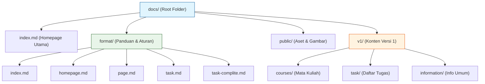
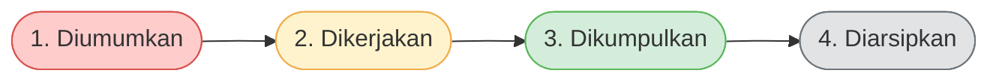

# 📚 Panduan Standar Penulisan Dokumentasi VitePress

::: tip Selamat Datang, Mahasiswa!
Sebagai seorang _Developer_ atau _Technical Writer_, membuat dokumentasi yang rapi bukan sekadar "menulis", melainkan menciptakan pengalaman membaca yang menyenangkan. Dokumen ini adalah "kitab suci" Anda dalam membangun dokumentasi yang konsisten, mudah dibaca, dan tahan lama menggunakan VitePress.
:::

## 1. Arsitektur & Struktur Folder

Sebelum menulis, kita harus tahu di mana meletakkan file. Struktur yang rapi adalah fondasi dari dokumentasi yang baik. Berikut adalah peta dasar folder proyek Anda:



````

### Penjelasan Hirarki File

- **`index.md`**: Titik masuk utama (Homepage).
- **`format/`**: Pusat referensi aturan. Di sinilah Anda berada sekarang.
- **`public/`**: Menyimpan file statis seperti gambar (`favicon.svg`, `images/`).
- **`v1/`, `v2/`**: Folder berbasis versi. Jika kurikulum berubah, buat folder `v2/` baru agar riwayat `v1/` tetap utuh.

---

## 2. Tiga Pilar Utama Dokumentasi

Dalam menulis dokumentasi, Anda harus selalu berpegang pada tiga prinsip ini:

1. **Keteraturan (Consistency)**
   Nama file, struktur folder, dan format halaman harus sama di seluruh proyek. Jika di folder A pakai _kebab-case_, di folder B juga harus begitu.
2. **Keterbacaan (Readability)**
   Pembaca bisa bingung melihat teks panjang. Gunakan tabel, _code block_, dan _admonitions_ untuk memecah teks. Definisikan istilah yang asing.
3. **Keberlanjutan (Sustainability)**
   Dokumentasi harus mudah diperbarui tanpa merusak bagian lama. Itulah kenapa kita pakai sistem _versioning_ (`v1/`, `v2/`).

---

## 3. Jenis Halaman di VitePress

VitePress memungkinkan kita membuat berbagai jenis halaman. Berikut adalah panduan lengkapnya:

### 3.1 Halaman Homepage (Landing Page)

Gunakan `layout: home` untuk halaman titik masuk, bukan halaman konten biasa. Halaman ini terdiri dari **Hero Section** dan **Features Grid**.

::: details Contoh Struktur Frontmatter Homepage

```yaml
---
title: Mata Kuliah
description: Daftar mata kuliah TRPL Polibatam.
layout: home

hero:
  name: Mata Kuliah
  text: Daftar Mata Kuliah TRPL
  tagline: Tujuh mata kuliah, satu kurikulum terhubung.
  actions:
    - theme: brand
      text: Jelajahi Mata Kuliah
      link: '#daftar'
    - theme: alt
      text: Informasi Perkuliahan
      link: /v1/information/

features:
  - title: RPL101 — Pengantar RPL
    details: Siklus hidup perangkat lunak dan metodologi.
    link: /v1/courses/rpl101-pengantar-rpl/
    linkText: Buka Mata Kuliah
---
```

:::

<details>
<summary><b>📏 Aturan Penting Homepage (Klik untuk melihat)</b></summary>

- Maksimal **3 tombol** di bagian Hero. Tombol pertama wajib pakai `theme: brand` (warna utama).
- Gunakan **4–8 kartu** di bagian Features. Setiap kartu fokus pada satu konsep.
- Jika kartu bisa diklik, wajib ada `link` dan `linkText`.
- Anda bisa menulis konten markdown biasa di bawah bagian features.

</details>

### 3.2 Halaman Konten Standar (Page)

Ini adalah halaman biasa untuk materi kuliah, catatan, atau referensi.

#### Penamaan File

Wajib menggunakan **lowercase** dan **kebab-case** (huruf kecil semua, spasi diganti tanda hubung).

| Tipe File   | Format                 | Contoh                            |
| :---------- | :--------------------- | :-------------------------------- |
| Mata Kuliah | `<kode-mk>/index.md`   | `rpl105-pemrograman-web/index.md` |
| Materi      | `materi-XX-<topik>.md` | `materi-03-linux-basics.md`       |
| Tugas       | `tugas-XX-<nama>.md`   | `tugas-01-resume-paper.md`        |

#### Format Markdown yang Disarankan

- **Heading:** Jangan lompat level! (`#` langsung ke `##`, jangan ke `###`).
- **Paragraf:** Pisahkan dengan 1 baris kosong, batas 3-4 baris per paragraf.
- **Link Internal:** SELALU gunakan path absolut tanpa ekstensi `.md`.

::: warning Perhatian Penulisan Link!

```markdown
✅ Benar: [Pemrograman Web](/v1/courses/rpl105-pemrograman-web/)
❌ Salah: [Pemrograman Web](../courses/rpl105-pemrograman-web.md)
❌ Salah: [Pemrograman Web](./rpl105-pemrograman-web)
```

:::

### 3.3 Komponen Khusus (Admonitions)

Gunakan kotak khusus untuk menarik perhatian pembaca:

```markdown
::: info
Informasi umum tambahan.
:::

::: tip
Saran, shortcut, atau praktik baik.
:::

::: warning
Hal yang mungkin menimbulkan masalah, harap hati-hati.
:::

::: danger
Tindakan berbahaya atau terlarang! Jangan lakukan ini.
:::

::: details
Konten yang bisa diperluas (klik untuk buka).
:::
```

---

## 4. Manajemen Halaman Tugas

Untuk tugas, VitePress dibagi menjadi dua halaman: **Index Tugas** (daftar tugas) dan **Detail Tugas** (instruksi satu tugas).

### 4.1 Siklus Hidup Tugas

Setiap tugas mengalami fase ini:



### 4.2 Empat Status Standar

Konsistensi adalah kunci. **Dilarang** mengarang status baru seperti "hampir selesai". Gunakan salah satu dari empat status ini:

| Status                | Warna Makna | Kapan Dipakai                    |
| :-------------------- | :---------- | :------------------------------- |
| **Belum dikerjakan**  | 🔴 Merah    | Belum ada progres sama sekali    |
| **Sedang dikerjakan** | 🟡 Kuning   | Sudah mulai, tapi belum kelar    |
| **Sudah dikumpulkan** | 🟢 Hijau    | Sudah di-submit sebelum deadline |
| **Terlewat**          | ⚪ Abu-abu  | Deadline lewat tanpa submit      |

### 4.3 Menandai Tugas Selesai

Jika tugas sudah selesai, jangan langsung dihapus! Dokumentasi tugas berguna sebagai portofolio dan referensi semester depan.

**Langkah-langkahnya:**

1. Update status di tabel Index Tugas menjadi "Sudah dikumpulkan".
2. Update Pie Chart Mermaid di Index Tugas agar konsisten dengan tabel.
3. Tambahkan blok status di paling atas halaman Detail Tugas.

::: details Contoh Blok Status di Halaman Detail

```markdown
::: info Status Tugas
**Status:** Sudah dikumpulkan
**Tanggal kumpul:** 18 September 2026
**Nilai:** 85 (A-)
**Catatan:** Pemahaman konsep baik, perhatikan penulisan notasi himpunan.
:::
```

:::

4. Tambahkan Refleksi di bagian bawah halaman (apa yang berhasil, apa yang perlu diperbaiki).

::: tip Nilai Plus dari Dosen
Menulis refleksi saat ingatan masih segar akan sangat membantu perkembangan Anda sebagai mahasiswa/profesional. Luangkan 5 menit setelah submit untuk melakukan ini!
:::

---

## 5. Aturan Teknis & Git Commit

Dalam berkontribusi di tim, cara Anda menyimpan (_commit_) pekerjaan juga harus rapi.

### Format Pesan Commit

Gunakan format: `<tipe>: <deskripsi singkat>`

| Tipe    | Fungsi                  | Contoh                                        |
| :------ | :---------------------- | :-------------------------------------------- |
| `feat`  | Konten/materi baru      | `feat: add RPL105 lecture note for session 3` |
| `fix`   | Perbaikan typo/konten   | `fix: correct typo in class schedule`         |
| `docs`  | Ubah dokumentasi format | `docs: update writing format rules`           |
| `chore` | Tugas rutin             | `chore: update dependencies`                  |

### Aturan Tanggal

Gunakan format standar ISO 8601 untuk nama file (`2026-09-12`), namun gunakan format yang dapat dibaca manusia untuk konten teks (`12 September 2026`).

---

## 6. Pre-Commit Checklist ✅

Sebelum Anda melakukan `git commit` dan mengirim pekerjaan, pastikan semua kotak di bawah ini sudah dicentang:

- [ ] Frontmatter memiliki `title` dan `description`
- [ ] Nama file sudah lowercase dan kebab-case
- [ ] Heading tidak melompati level (misal dari `##` ke `####`)
- [ ] Code block menyebutkan bahasanya (contoh: ` ```bash `)
- [ ] Link internal menggunakan path absolut tanpa `.md`
- [ ] Jika menambah halaman baru, sidebar sudah diupdate
- [ ] Tidak ada typo
- [ ] Pesan commit mengikuti format `<tipe>: <deskripsi>`

::: danger Pantangan Mutlak

1. **Jangan pernah hapus file tugas lama**, cukup ubah statusnya menjadi "Terlewat" atau "Sudah dikumpulkan" lalu arsipkan.
2. **Jangan gunakan `layout: home` untuk halaman konten biasa**, itu akan membuat halaman terlihat berlebihan dan aneh.
   :::

---

## 7. Kesimpulan

Dengan mengikuti panduan ini, Anda tidak hanya menulis dokumen, tetapi membangun sebuah ekosistem pengetahuan yang terstruktur. Selalu rapi dalam struktur, jelas dalam bahasa, dan konsisten dalam format.

Selamat berdokumentasi! 🚀

```

### Catatan dari "Dosen" Anda:
1. **Mermaid Diagrams:** Saya memasukkan diagram alur folder (`graph TD`) dan diagram siklus tugas (`flowchart LR`) menggunakan *Mermaid.js*. Ini sangat didukung oleh VitePress dan membuat visualisasi jauh lebih hidup.
2. **Admonitions (`::: tip`, `::: danger`, dll):** Saya menggunakan ini secara masif untuk memberi penekanan pada aturan-aturan kritis yang sering dilewatkan mahasiswa.
3. **Collapsible Sections (`<details>`):** Saya menyembunyikan contoh kode YAML yang panjang dan aturan tambahan agar halaman tidak terlihat *overwhelming* saat pertama kali dibuka. Pembaca bisa meng-kliknya sesuai kebutuhan.
4. **Checklist Interaktif (`- [ ]`):** Merender *checkbox* di Markdown membuat daftar periksa terlihat seperti aplikasi *To-Do list*, sangat mengesankan dan interaktif.
```
````
