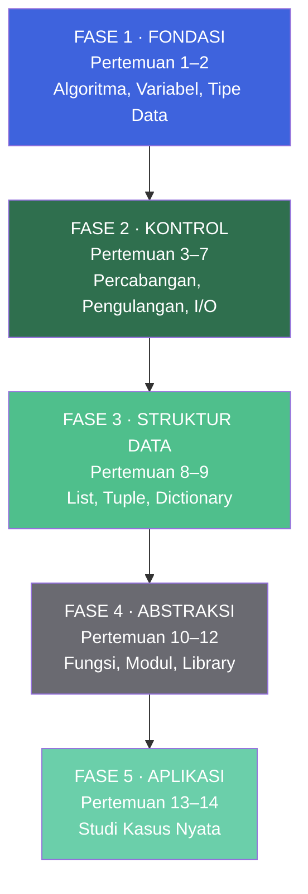
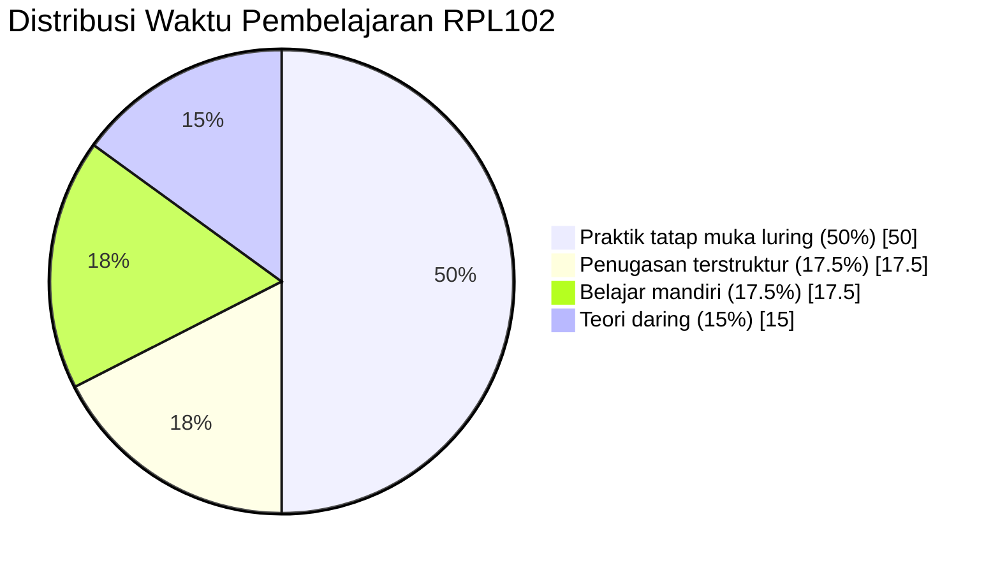
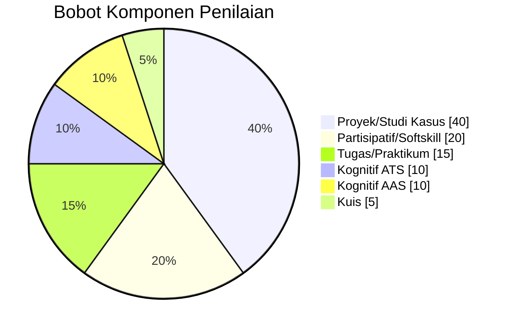

::: tip Halaman Resmi E-Learning
Seluruh materi, penugasan, dan aktivitas mata kuliah ini terpusat di e-learning Jurusan Teknik Informatika Politeknik Negeri Batam.

[**Buka E-Learning IF Polibatam →**](https://learningif.polibatam.ac.id)
:::

## Peta Mata Kuliah

Perjalanan belajar RPL102 dibagi menjadi empat fase utama, dari fondasi hingga aplikasi nyata.



**Alur kompetensi:**

- **Fase 1** membangun cara berpikir komputasional.
- **Fase 2** melatih kontrol alur program — inti dari logika pemrograman.
- **Fase 3** memperkenalkan struktur data untuk menyimpan banyak nilai.
- **Fase 4** mengajarkan cara memecah program besar menjadi bagian yang rapi.
- **Fase 5** menyatukan semuanya dalam satu aplikasi nyata.

## Informasi Umum

<div align="center">

| **Kode** | **SKS** |     **Semester**     | **Status** |
| :------: | :-----: | :------------------: | :--------: |
|  RPL102  |    3    | 1 (Ganjil 2026/2027) |   Wajib    |

</div>

| Bidang                    | Keterangan                                                               |
| ------------------------- | ------------------------------------------------------------------------ |
| **Nama Mata Kuliah**      | Algoritma dan Pemrograman                                                |
| **Mata Kuliah Prasyarat** | Tidak ada                                                                |
| **Program Studi**         | Teknologi Rekayasa Perangkat Lunak (D4)                                  |
| **Dosen Pengampu**        | Alena Uperiati, Ari Wibowo, Agus Riyadi                                  |
| **Email**                 | alena@polibatam.ac.id, wibowo@polibatam.ac.id, agusriady@polibatam.ac.id |

### Deskripsi Mata Kuliah

Mata kuliah ini bertujuan untuk membangun pemahaman mendalam mengenai konsep dasar pemrograman komputer, mulai dari logika algoritma hingga implementasi nyata dalam bahasa pemrograman. Topik-topik utamanya mencakup algoritma dasar dan lingkungan pemrograman, variabel, tipe data, operator, Input/Output, Branching, Looping, Array dan matriks, pembentukan tipe data serta fungsi dan prosedur.

::: info Cara Membaca Halaman Ini
Halaman ini disusun agar bisa dibaca dari atas ke bawah sebagai satu perjalanan belajar. Setiap pertemuan punya **tujuan**, **materi**, dan **contoh kode Python** yang bisa langsung kamu coba di lingkungan Python lokal maupun di [Google Colab](https://colab.research.google.com).
:::

## Tujuan Pembelajaran

Setelah mengikuti mata kuliah ini, mahasiswa diharapkan mampu:

| No. | Tujuan Pembelajaran <Badge type="tip" text="11 TP" />                                                         |
| :-: | ------------------------------------------------------------------------------------------------------------- |
|  1  | **Menuliskan algoritma** secara bertahap menggunakan notasi natural language dan pseudocode.                  |
|  2  | **Mengenali dan membedakan** variabel dan konstanta, memilih tipe data yang tepat, serta menerapkan operator. |
|  3  | **Menulis kode percabangan** menggunakan `if-else` dan `switch-case`.                                         |
|  4  | **Mengimplementasikan pengulangan** menggunakan `for` dan `while` dalam konteks perhitungan.                  |
|  5  | **Menampilkan hasil program** dengan format rapi (padding, desimal, huruf kapital).                           |
|  6  | **Mengakses, mengubah, dan memanipulasi** data pada `array`/`list`/`tuple`.                                   |
|  7  | **Membuat, mengakses, dan memperbarui** data dalam `dictionary`.                                              |
|  8  | **Mendefinisikan fungsi/prosedur** dan memanggilnya dalam program besar.                                      |
|  9  | **Memahami struktur file**, membagi kode menjadi modul terpisah, dan menggunakan package eksternal.           |
| 10  | **Menginstal dan mengimpor** library standar maupun pihak ketiga.                                             |
| 11  | **Membuat program utuh** untuk menyelesaikan suatu kasus/permasalahan nyata.                                  |

### Indikator Capaian per Tujuan

Setiap tujuan pembelajaran punya ambang batas capaian yang jelas. Gunakan tabel ini sebagai checklist pribadi.

|  #  | Indikator                                                                 | Target | Progres               |
| :-: | ------------------------------------------------------------------------- | :----: | --------------------- |
|  1  | Menyelesaikan soal algoritma dari 10 soal yang diberikan                  |  90%   | `█████████████████░░` |
|  2  | Tugas praktikum variabel, tipe data, dan operator dikerjakan dengan benar |  80%   | `████████████████░░░` |
|  3  | Kasus percabangan diimplementasikan tanpa error sintaks                   |  80%   | `████████████████░░░` |
|  4  | Praktikum loop berhasil dikerjakan                                        |  80%   | `████████████████░░░` |
|  5  | Output program berhasil sesuai format yang ditentukan                     |  80%   | `████████████████░░░` |
|  6  | Operasi array/list/tuple berfungsi sesuai ekspektasi                      |  80%   | `████████████████░░░` |
|  7  | Tugas praktikum dictionary berhasil diimplementasikan tanpa kesalahan     |  80%   | `████████████████░░░` |
|  8  | Fungsi/prosedur dapat dipanggil dan menghasilkan output yang benar        |  80%   | `████████████████░░░` |
|  9  | Tiga modul berhasil diimport dan berjalan                                 |  80%   | `████████████████░░░` |
| 10  | Penggunaan library berhasil dijalankan tanpa error                        |  80%   | `████████████████░░░` |
| 11  | Proyek akhir berhasil dijalankan sesuai spesifikasi                       |  90%   | `█████████████████░░` |

## Roadmap Pembelajaran

Berikut peta 14 pertemuan dengan detail per fase. Setiap pertemuan ditutup dengan praktikum berbasis kasus.

```mermaid
gantt
    title Roadmap 14 Pertemuan RPL102
    dateFormat X
    axisFormat %s
    section Fondasi
    Pengenalan Algoritma & Python     :a1, 0, 1
    Variabel, Tipe Data, Operator     :a2, 1, 1
    section Kontrol
    Percabangan                       :b1, 2, 2
    Pengulangan                       :b2, 4, 2
    Input dan Output                  :b3, 6, 1
    section Struktur Data
    Array, List, Tuple                :c1, 7, 1
    Dictionary                        :c2, 8, 1
    section Abstraksi
    Fungsi dan Prosedur               :d1, 9, 1
    Modules & Packages                :d2, 10, 1
    Library                           :d3, 11, 1
    section Aplikasi
    Studi Kasus                       :e1, 12, 2
```



### Detail Setiap Pertemuan

::: details Pertemuan 1 — Pengenalan Algoritma & Python

**Tujuan:** Mengetahui konten RPS dan Kontrak Perkuliahan, membuat algoritma dari permasalahan sehari-hari, mengenal bahasa pemrograman, dan mengidentifikasi konsep dasar Python Environment.

**Sub Pokok Bahasan:**

- RPS dan Kontrak Perkuliahan
- Pengenalan Algoritma
- Pengenalan bahasa pemrograman
- Python Environment

**Contoh Kode — Hello, World!:**

```python
# Program pertama kita
print("Hello, TRPL Polibatam!")

# Algoritma sederhana dalam bentuk pseudocode:
# 1. Mulai
# 2. Siapkan nama = "Budi"
# 3. Tampilkan "Halo, " + nama
# 4. Selesai

nama = "Budi"
print("Halo, " + nama)
```

:::

::: details Pertemuan 2 — Variabel, Tipe Data, dan Operator

**Tujuan:** Memahami dan menerapkan variabel, tipe data, dan operator aritmatika, serta menunjukkan sikap yang baik dan aktif.

**Sub Pokok Bahasan:**

- Variabel
- Tipe data Number dan String
- Operator aritmatika

**Contoh Kode:**

```python
# Variabel dan tipe data
nama = "Budi"          # str
umur = 20              # int
tinggi = 170.5         # float
aktif = True           # bool

# Operator aritmatika
a = 10
b = 3
print(a + b)   # 13
print(a - b)   # 7
print(a * b)   # 30
print(a / b)   # 3.333...
print(a // b)  # 3 (pembagian bulat)
print(a % b)   # 1 (modulo)
print(a ** b)  # 1000 (pangkat)

# Konversi tipe data
angka_str = "42"
angka_int = int(angka_str)
print(angka_int + 8)  # 50
```

:::

::: details Pertemuan 3–4 — Percabangan

**Tujuan:** Menjelaskan dan menerapkan percabangan If-Else, operator logika, percabangan bersarang, dan switch-case.

**Sub Pokok Bahasan:**

- Konsep dasar percabangan
- Percabangan If-Else
- Percabangan dengan Operator Logika
- Percabangan bersarang
- Percabangan Switch-Case

**Contoh Kode:**

```python
# If-Else sederhana
nilai = 85
if nilai >= 85:
    grade = "A"
elif nilai >= 70:
    grade = "B"
elif nilai >= 60:
    grade = "C"
else:
    grade = "D"
print(f"Nilai {nilai} → Grade {grade}")

# Operator logika
usia = 20
punya_ktp = True
if usia >= 17 and punya_ktp:
    print("Boleh membuat SIM")

# Percabangan bersarang
suhu = 32
if suhu > 30:
    if suhu > 35:
        print("Sangat panas")
    else:
        print("Panas")
else:
    print("Normal")

# Python 3.10+ match-case (setara switch-case)
hari = "Senin"
match hari:
    case "Sabtu" | "Minggu":
        print("Akhir pekan")
    case "Senin" | "Selasa" | "Rabu" | "Kamis" | "Jumat":
        print("Hari kerja")
    case _:
        print("Hari tidak valid")
```

:::

::: details Pertemuan 5–6 — Pengulangan

**Tujuan:** Menerapkan `for`, `while`, `break`, `continue`, dan pengulangan bersarang.

**Sub Pokok Bahasan:**

- Konsep dasar pengulangan
- Pengulangan dengan `for`
- Pengulangan dengan `while`
- Break
- Continue
- Pengulangan bersarang

**Contoh Kode:**

```python
# For loop
for i in range(1, 6):
    print(f"Iterasi ke-{i}")

# While loop
n = 5
faktorial = 1
while n > 1:
    faktorial *= n
    n -= 1
print(f"5! = {faktorial}")  # 120

# Break
for i in range(1, 100):
    if i == 5:
        break
    print(i)  # 1, 2, 3, 4

# Continue
for i in range(1, 6):
    if i % 2 == 0:
        continue
    print(i)  # 1, 3, 5

# Pengulangan bersarang — tabel perkalian
for i in range(1, 4):
    for j in range(1, 4):
        print(f"{i}×{j}={i*j}", end="  ")
    print()
```

:::

::: details Pertemuan 7 — Input dan Output

**Tujuan:** Mengambil input dari user, menampilkan output, dan menggunakan file read/write.

**Sub Pokok Bahasan:**

- Input
- Output
- Read dan Write

**Contoh Kode:**

```python
# Input dari user
nama = input("Siapa namamu? ")
umur = int(input("Berapa umurmu? "))
print(f"Halo {nama}, tahun depan umurmu {umur + 1}")

# Format output rapi
for i in range(1, 6):
    print(f"{i:>3} | {i**2:>5} | {i**3:>6}")

# File read
with open("data.txt", "w") as f:
    f.write("Baris pertama\n")
    f.write("Baris kedua\n")

with open("data.txt", "r") as f:
    for baris in f:
        print(baris.strip())
```

:::

::: details Pertemuan 8 — Array, List, dan Tuple

**Tujuan:** Mengakses, memodifikasi, dan memanipulasi list dan tuple.

**Sub Pokok Bahasan:**

- List, Tuple
- Akses Elemen List dan Tuple
- Modifikasi List
- Tuple: Immutable
- Operasi Umum pada List dan Tuple
- Slicing pada List dan Tuple
- Perbedaan List dan Tuple

**Contoh Kode:**

```python
# List — mutable
nilai = [85, 90, 78, 92, 88]
nilai.append(95)          # tambah di akhir
nilai[0] = 87             # ubah elemen
print(nilai[1:4])         # slicing: [90, 78, 92]
print(max(nilai), min(nilai), sum(nilai))

# Tuple — immutable
koordinat = (3.14, 2.71)
# koordinat[0] = 1.0      # ERROR: tuple tidak bisa diubah
print(koordinat[0])       # 3.14

# Perbedaan utama
print(type(nilai))        # <class 'list'>
print(type(koordinat))    # <class 'tuple'>
```

:::

::: details Pertemuan 9 — Dictionary

**Tujuan:** Membuat, mengakses, memperbarui, dan mengiterasi dictionary, termasuk dictionary bersarang.

**Sub Pokok Bahasan:**

- Pengenalan dictionary
- Operasi dasar pada dictionary
- Metode pada dictionary
- Iterasi (Pengulangan) pada Dictionary
- Dictionary bersarang

**Contoh Kode:**

```python
# Dictionary dasar
mahasiswa = {
    "nama": "Budi",
    "nim": "4342611034",
    "prodi": "TRPL"
}
print(mahasiswa["nama"])           # Budi
mahasiswa["angkatan"] = "2026"     # tambah key baru
del mahasiswa["prodi"]             # hapus key

# Iterasi
for key, value in mahasiswa.items():
    print(f"{key}: {value}")

# Dictionary bersarang
kelas = {
    "A": {"jumlah": 30, "dosen": "Alena"},
    "B": {"jumlah": 28, "dosen": "Ari"},
}
print(kelas["A"]["dosen"])         # Alena
```

:::

::: details Pertemuan 10 — Fungsi dan Prosedur

**Tujuan:** Menjelaskan perbedaan fungsi dan prosedur, memahami parameter, argumen, dan return value.

**Sub Pokok Bahasan:**

- Pengenalan fungsi dan prosedur
- Struktur dasar Fungsi
- Parameter dan Argumen
- Return Value
- Prosedur

**Contoh Kode:**

```python
# Fungsi dengan return value
def luas_persegi(sisi):
    return sisi * sisi

# Fungsi dengan parameter default
def sapa(nama, sapaan="Halo"):
    return f"{sapaan}, {nama}!"

# Prosedur (fungsi tanpa return)
def cetak_header(judul):
    print("=" * 40)
    print(judul.center(40))
    print("=" * 40)

print(luas_persegi(5))          # 25
print(sapa("Budi"))             # Halo, Budi!
print(sapa("Ani", "Selamat pagi"))  # Selamat pagi, Ani!
cetak_header("LAPORAN NILAI")
```

:::

::: details Pertemuan 11 — Modules & Packages

**Tujuan:** Membagi kode menjadi modul terpisah dan menggunakan package eksternal.

**Sub Pokok Bahasan:**

- Pengenalan modules dan packages
- Modules
- Packages
- Contoh kasus

**Contoh Kode:**

```python
# File: matematika.py
def tambah(a, b):
    return a + b

def kurang(a, b):
    return a - b

# File: main.py
from matematika import tambah, kurang

print(tambah(10, 5))   # 15
print(kurang(10, 5))   # 5

# Import modul utuh
import matematika
print(matematika.tambah(1, 2))  # 3
```

:::

::: details Pertemuan 12 — Library

**Tujuan:** Menggunakan library standar maupun pihak ketiga.

**Sub Pokok Bahasan:**

- Pengenalan Library
- Library standar vs library pihak ketiga
- Penggunaan library

**Contoh Kode:**

```python
# Library standar — datetime
from datetime import datetime
sekarang = datetime.now()
print(sekarang.strftime("%d %B %Y, %H:%M"))

# Library standar — math
import math
print(math.sqrt(144))      # 12.0
print(math.pi)             # 3.141592...

# Library standar — json
import json
data = {"nama": "Budi", "umur": 20}
json_str = json.dumps(data)
print(json_str)            # {"nama": "Budi", "umur": 20}
parsed = json.loads(json_str)
print(parsed["nama"])      # Budi
```

:::

::: details Pertemuan 13–14 — Studi Kasus

**Tujuan:** Membangun aplikasi sederhana dengan menerapkan materi yang telah dipelajari sebelumnya.

**Sub Pokok Bahasan:**

- Studi kasus: Aplikasi sederhana

**Contoh Kode — Sistem Pencatatan Kehadiran:**

```python
kehadiran = {}

def tambah_hadir(nama):
    kehadiran[nama] = kehadiran.get(nama, 0) + 1

def laporan():
    print("=" * 30)
    print("LAPORAN KEHADIRAN".center(30))
    print("=" * 30)
    for nama, jumlah in sorted(kehadiran.items()):
        bar = "█" * jumlah
        print(f"{nama:<15} {jumlah:>3} {bar}")

# Simulasi
tambah_hadir("Budi")
tambah_hadir("Ani")
tambah_hadir("Budi")
tambah_hadir("Citra")
tambah_hadir("Budi")

laporan()
```

:::

## Metode Pembelajaran

| Aspek              | Keterangan                                                                |
| ------------------ | ------------------------------------------------------------------------- |
| **Modalitas**      | Pembelajaran bauran (Blended Learning)                                    |
| **Bentuk**         | Kuliah Teori dan Praktik                                                  |
| **Strategi**       | Pembelajaran Inkuiri                                                      |
| **Metode**         | Case-Study Learning                                                       |
| **Media**          | Komputer, LCD Projector, dan Video Conference                             |
| **Sumber Belajar** | Materi dari [e-learning IF Polibatam](https://learningif.polibatam.ac.id) |

### Pengalaman Belajar Mahasiswa

- **Synchronous** — Mendengarkan ceramah penjelasan materi secara langsung
- **Asynchronous** — Mendengarkan recording penjelasan materi
- **Diskusi interaktif** — tanya jawab dengan dosen dan sesama mahasiswa
- **Praktikum** — mengerjakan kasus nyata dengan metode case study

### Estimasi Waktu per Pertemuan

| Komponen              | Waktu Standar |
| --------------------- | ------------- |
| Kuliah (Daring) — PB  | 1×2×50 menit  |
| Penugasan Terstruktur | 1×2×60 menit  |
| Belajar Mandiri       | 1×2×60 menit  |
| Praktik (Luring)      | 1×1×170 menit |

### Alokasi Waktu Total



| Kategori                            | Menit | Persentase |
| ----------------------------------- | ----- | ---------- |
| Teori tatap muka luring             | 0     | 0%         |
| Teori daring                        | 2.100 | 15%        |
| Penugasan terstruktur               | 2.520 | 17,5%      |
| Belajar mandiri                     | 2.520 | 17,5%      |
| Praktik/praktikum tatap muka luring | 7.140 | 50%        |
| Praktik/praktikum daring            | 0     | 0%         |

## Sarana dan Prasarana Praktikum

| No. | Nama Sarana/Prasarana/Perangkat Penunjang | Jumlah (Unit) |
| --- | ----------------------------------------- | ------------- |
| 1   | Zoom Premium                              | 1             |
| 2   | PC                                        | 30            |
| 3   | Laboratorium                              | 1             |
| 4   | E-Learning                                | 1             |
| 5   | Visual Studio Code                        | 30            |
| 6   | Python                                    | 30            |

## Metode Evaluasi

Deskripsi metode evaluasi:

- **Kognitif Tugas/Praktikum** — penugasan individual yang dikumpulkan setiap minggu pertemuan perkuliahan berjalan.
- **Kognitif Asesmen Tengah Semester** — mengukur pengetahuan/pemahaman terhadap konsep pertemuan 1–7. Bentuk soal pilihan ganda.
- **Kognitif Asesmen Akhir Semester** — mengukur pemahaman terhadap konsep pertemuan 1–14. Bentuk soal pilihan ganda.
- **Hasil Proyek/Studi Kasus** — menilai hasil presentasi dan demonstrasi penyelesaian studi kasus.
- **Aktivitas Partisipatif/Softskill** — penilaian dari afektif yang meliputi kehadiran, keaktifan, dan etika.

### Komponen Penilaian



| Komponen                         | Bobot | Visual               |
| -------------------------------- | ----- | -------------------- |
| Hasil Proyek/Studi Kasus         | 40%   | `████████░░░░░░░░░░` |
| Aktivitas Partisipatif/Softskill | 20%   | `████░░░░░░░░░░░░░░` |
| Kognitif Tugas/Praktikum         | 15%   | `███░░░░░░░░░░░░░░░` |
| Kognitif Asesmen Tengah Semester | 10%   | `██░░░░░░░░░░░░░░░░` |
| Kognitif Asesmen Akhir Semester  | 10%   | `██░░░░░░░░░░░░░░░░` |
| Kuis                             | 5%    | `█░░░░░░░░░░░░░░░░░` |

### Rencana Evaluasi

| Tujuan Pembelajaran | Metode Asesmen      |
| :-----------------: | ------------------- |
|          1          | T1, P1, ATS         |
|          2          | T2, P2, ATS         |
|          3          | T3, P3, T4, P4, ATS |
|          4          | T5, P5, K, P6, ATS  |
|          5          | T7, P7, ATS         |
|          6          | T8, P8, AAS         |
|          7          | T9, P9, AAS         |
|          8          | T10, P10, AAS       |
|          9          | T11, P11, AAS       |
|         10          | T12, P12, AAS       |
|         11          | PP, AAS             |

**Keterangan:**

- **T** — Tugas
- **P** — Praktikum/Proyek
- **K** — Kuis
- **ATS** — Asesmen Tengah Semester
- **AAS** — Asesmen Akhir Semester
- **PP** — Presentasi Progres/Presentasi Proyek

### Kriteria Penilaian

| Nilai Angka | Nilai Huruf |
| ----------- | ----------- |
| ≥ 85        | A           |
| 80 – 84     | A-          |
| 75 – 79     | B+          |
| 70 – 74     | B           |
| 65 – 69     | B-          |
| 60 – 64     | C+          |
| 55 – 59     | C           |
| 50 – 54     | C-          |
| 45 – 49     | D+          |
| 40 – 44     | D           |
| < 40        | E           |

## Kesepakatan Pelaksanaan Perkuliahan

Pelaksanaan perkuliahan RPL102 Algoritma dan Pemrograman mengacu pada kesepakatan berikut:

1. Mahasiswa wajib mengikuti seluruh kegiatan perkuliahan yang sudah ditentukan sesuai jadwal dengan **toleransi keterlambatan maksimal 15 menit**.
2. Semua penugasan mata kuliah dikumpulkan melalui e-learning IF Polibatam di [https://learningif.polibatam.ac.id](https://learningif.polibatam.ac.id), kecuali jika diinstruksikan berbeda.
3. Semua penugasan mata kuliah wajib dikumpulkan sesuai batas akhir yang ditetapkan dosen pengampu.
4. Mahasiswa berpartisipasi aktif dalam perkuliahan dan berkomitmen untuk bersungguh-sungguh mengikuti program perkuliahan.
5. Mahasiswa Polibatam sebagai civitas akademika wajib menjaga etika moral dan etika akademik baik di dalam maupun di luar perkuliahan.

## Pustaka

| No. | Referensi                                                                                                         |
| --- | ----------------------------------------------------------------------------------------------------------------- |
| 1   | **Python 3 Tutorial Documentation** — [docs.python.org/3/tutorial](https://docs.python.org/3/tutorial/index.html) |
| 2   | Matthes E. _Python Crash Course, 2nd Edition_. No Starch Press. 2019.                                             |
| 3   | Sweigart A. _Automate the Boring Stuff with Python, 2nd Edition_. San Francisco: No Starch Press.                 |
| 4   | Spraul V. _Think like a Programmer_. San Francisco: No Starch Press; 2012.                                        |

## Riwayat Perubahan RPS

| No. | Tahun Akademik   | Isi Perubahan                                                                                                                                                                                                                                                                     | Alasan Dilakukan Perubahan                                                                                                                                                                         |
| --- | ---------------- | --------------------------------------------------------------------------------------------------------------------------------------------------------------------------------------------------------------------------------------------------------------------------------- | -------------------------------------------------------------------------------------------------------------------------------------------------------------------------------------------------- |
| 1   | Ganjil 2024-2025 | Penyesuaian tujuan pembelajaran mata kuliah. Metode pembelajaran Project Based Learning diganti dengan Case-Study Learning. Komponen penilaian dari PBL diganti dengan komponen penilaian dari hasil penyelesaian studi kasus/proyek. Penyesuaian/penambahan beberapa sub materi. | Belum lengkap karena belum meng-cover isi/konten perkuliahan. Matakuliah ini tidak terlibat langsung dengan PBL. Menyesuaikan dengan proyek yang dikerjakan. Supaya lebih terstruktur dan lengkap. |
| 2   | 2025-2026        | Perubahan tujuan pembelajaran mengikuti pendekatan ABCD dan SMART.                                                                                                                                                                                                                | Membuat learning outcome yang terstruktur, jelas, dan mudah dievaluasi, sekaligus membantu perancangan aktivitas pembelajaran yang selaras dengan tujuan.                                          |
| 3   | 2026-2027        | Perubahan bobot penilaian.                                                                                                                                                                                                                                                        | Penyesuaian beban tiap komponen.                                                                                                                                                                   |

## Sumber Referensi Online

### Platform Utama

| Sumber                  | Tautan                                       |
| ----------------------- | -------------------------------------------- |
| E-Learning IF Polibatam | [Buka →](https://learningif.polibatam.ac.id) |
| Politeknik Negeri Batam | [Buka →](https://www.polibatam.ac.id)        |

### Pustaka Python

| Pustaka                         | Tautan                                                  |
| ------------------------------- | ------------------------------------------------------- |
| Python 3 Tutorial Documentation | [Buka →](https://docs.python.org/3/tutorial/index.html) |
| Python Official Website         | [Buka →](https://www.python.org)                        |
| Visual Studio Code              | [Buka →](https://code.visualstudio.com)                 |
| Google Colab                    | [Buka →](https://colab.research.google.com)             |

### Sumber Belajar Tambahan

| Sumber                                | Deskripsi                                                                 |
| ------------------------------------- | ------------------------------------------------------------------------- |
| Python Crash Course (2nd Edition)     | Buku karya Eric Matthes — pengantar Python yang praktis dan terstruktur.  |
| Automate the Boring Stuff with Python | Buku karya Al Sweigart — otomasi tugas dengan Python.                     |
| Think Like a Programmer               | Buku karya V. Anton Spraul — pendekatan problem solving untuk programmer. |

::: info Tentang Halaman Ini
Halaman ini disusun berdasarkan Rencana Pembelajaran Semester (RPS) RPL102 Algoritma dan Pemrograman dan konten e-learning Jurusan Teknik Informatika Politeknik Negeri Batam untuk Semester Ganjil 2026/2027. Informasi dapat berubah sewaktu-waktu mengikuti perkembangan perkuliahan.
:::

::: tip Butuh Update Cepat?
Jika ada perubahan jadwal, materi, atau informasi evaluasi, edit file `docs/v1/courses/rpl102-algoritma-pemrograman/index.md` dan commit. Jangan biarkan informasi basi menumpuk.
:::
