# RPL102 — Algoritma dan Pemrograman

**Kode:** RPL102 · **SKS:** 3 · **Semester:** Ganjil 2026/2027 · **Status:** Wajib
**Dosen:** Alena Uperiati, Ari Wibowo, Agus Riyadi
**Email:** alena@polibatam.ac.id, wibowo@polibatam.ac.id, agusriady@polibatam.ac.id

> **Tagline:** Dari logika algoritma hingga aplikasi Python yang berjalan — 14 pertemuan, 11 tujuan pembelajaran, satu proyek akhir nyata.

:::tip E-Learning
[**Buka E-Learning →**](https://learningif.polibatam.ac.id)
:::

## Navigasi Cepat

- [Peta Mata Kuliah](#peta-mata-kuliah)
- [Informasi Umum](#informasi-umum)
- [Tujuan Pembelajaran](#tujuan-pembelajaran)
- [Roadmap 14 Pertemuan](#roadmap-14-pertemuan)
- [Metode Pembelajaran](#metode-pembelajaran)
- [Sarana Praktikum](#sarana-praktikum)
- [Metode Evaluasi](#metode-evaluasi)
- [Kesepakatan](#kesepakatan)
- [Pustaka](#pustaka)
- [Riwayat RPS](#riwayat-rps)

---

## Peta Mata Kuliah

Lima fase perjalanan belajar dari nol sampai bisa membuat aplikasi:

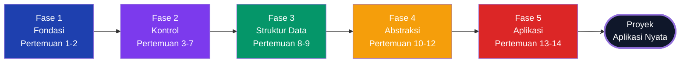

| Fase                  | Pertemuan | Fokus                          |
| --------------------- | :-------: | ------------------------------ |
| **1 · Fondasi**       |    1–2    | Algoritma, variabel, tipe data |
| **2 · Kontrol**       |    3–7    | Percabangan, pengulangan, I/O  |
| **3 · Struktur Data** |    8–9    | List, tuple, dictionary        |
| **4 · Abstraksi**     |   10–12   | Fungsi, modul, library         |
| **5 · Aplikasi**      |   13–14   | Studi kasus nyata              |

**Benang merah:** Fase 1 membangun cara berpikir komputasional. Fase 2 melatih kontrol alur. Fase 3 memperkenalkan struktur data. Fase 4 mengajarkan pemecahan program. Fase 5 menyatukan semuanya dalam aplikasi nyata.

### Kenapa Python?

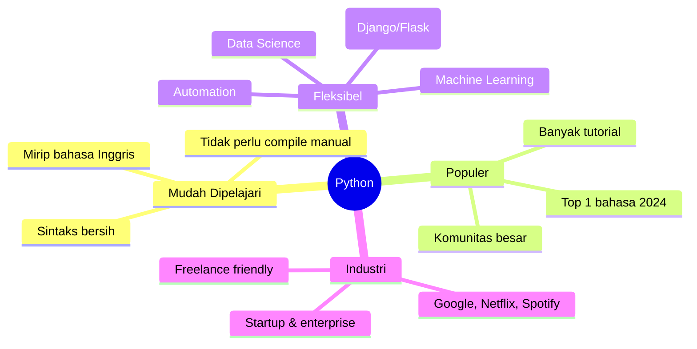

---

## Informasi Umum

|  Kode  | SKS |     Semester     | Status |
| :----: | :-: | :--------------: | :----: |
| RPL102 |  3  | Ganjil 2026/2027 | Wajib  |

| Bidang        | Keterangan                                                               |
| ------------- | ------------------------------------------------------------------------ |
| **Nama**      | Algoritma dan Pemrograman                                                |
| **Prasyarat** | Tidak ada                                                                |
| **Dosen**     | Alena Uperiati, Ari Wibowo, Agus Riyadi                                  |
| **Email**     | alena@polibatam.ac.id, wibowo@polibatam.ac.id, agusriady@polibatam.ac.id |

### Deskripsi

Membangun pemahaman konsep dasar pemrograman — dari logika algoritma hingga implementasi bahasa pemrograman. Topik: algoritma & lingkungan pemrograman, variabel, tipe data, operator, I/O, branching, looping, array & matriks, tipe data, fungsi & prosedur.

:::info Dirancang untuk pemula
**Tidak butuh pengalaman coding.** RPL102 dimulai dari nol — dari "apa itu algoritma" sampai bisa membuat aplikasi. Yang penting adalah **kemauan untuk latihan** dan **berpikir logis**.
:::

---

## Tujuan Pembelajaran

| No. | Tujuan                                                                |
| :-: | --------------------------------------------------------------------- |
|  1  | Menuliskan algoritma dengan natural language & pseudocode             |
|  2  | Membedakan variabel/konstanta, memilih tipe data, menerapkan operator |
|  3  | Menulis percabangan `if-else` dan `switch-case`                       |
|  4  | Mengimplementasikan pengulangan `for` dan `while`                     |
|  5  | Menampilkan hasil program dengan format rapi                          |
|  6  | Memanipulasi data pada `array`/`list`/`tuple`                         |
|  7  | Membuat, mengakses, memperbarui `dictionary`                          |
|  8  | Mendefinisikan & memanggil fungsi/prosedur                            |
|  9  | Memahami struktur file & modul                                        |
| 10  | Menginstal & mengimpor library                                        |
| 11  | Membuat program utuh untuk kasus nyata                                |

### Peta Tujuan Pembelajaran

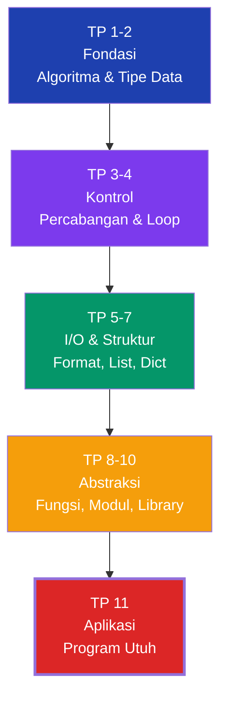

---

## Roadmap 14 Pertemuan

```mermaid
gantt
    title Timeline RPL102 — 14 Pertemuan
    dateFormat X
    axisFormat %s

    section Fase 1
    Algoritma & Python      :f1a, 0, 1
    Variabel & Operator     :f1b, 1, 1

    section Fase 2
    Percabangan             :f2a, 2, 2
    Pengulangan             :f2b, 4, 2
    Input & Output          :f2c, 6, 1

    section Fase 3
    List, Array, Tuple      :f3a, 7, 1
    Dictionary              :f3b, 8, 1

    section Fase 4
    Fungsi & Prosedur       :f4a, 9, 1
    Modules & Packages      :f4b, 10, 1
    Library                 :f4c, 11, 1

    section Fase 5
    Studi Kasus             :f5a, 12, 2
```

| Pertemuan | Materi                        | Contoh Kode                         |
| :-------: | ----------------------------- | ----------------------------------- |
|     1     | Pengenalan Algoritma & Python | `print("Hello")`                    |
|     2     | Variabel, Tipe Data, Operator | `int`, `str`, `float`, aritmatika   |
|    3–4    | Percabangan                   | `if-elif-else`, `match-case`        |
|    5–6    | Pengulangan                   | `for`, `while`, `break`, `continue` |
|     7     | Input dan Output              | `input()`, file read/write          |
|     8     | Array, List, Tuple            | indexing, slicing, `append`         |
|     9     | Dictionary                    | `dict`, iterasi, nested             |
|    10     | Fungsi & Prosedur             | `def`, parameter, return            |
|    11     | Modules & Packages            | `import`, `from ... import`         |
|    12     | Library                       | `datetime`, `math`, `json`          |
|   13–14   | Studi Kasus                   | Proyek aplikasi sederhana           |

### Contoh Kode

<details>
<summary>Percabangan — If-elif-else untuk klasifikasi nilai</summary>

```python
nilai = 85
if nilai >= 85:
    grade = "A"
elif nilai >= 70:
    grade = "B"
else:
    grade = "C"
print(f"Nilai {nilai} → Grade {grade}")
```

**Penjelasan:**

- `if` — cek kondisi pertama.
- `elif` — cek kondisi alternatif kalau `if` gagal.
- `else` — fallback kalau semua kondisi gagal.
- `f"..."` — f-string untuk interpolasi variabel.
- Indentasi (4 spasi) adalah **wajib** di Python.

</details>

<details>
<summary>Pengulangan — For dan while loop</summary>

```python
# For loop
for i in range(1, 6):
    print(f"Iterasi ke-{i}")

# While loop — faktorial
n = 5
faktorial = 1
while n > 1:
    faktorial *= n
    n -= 1
print(f"5! = {faktorial}")
```

**Kapan pakai apa:**

| Loop        | Kapan Dipakai                                       |
| ----------- | --------------------------------------------------- |
| **`for`**   | Jumlah iterasi diketahui (mis. 1–10).               |
| **`while`** | Jumlah iterasi bergantung kondisi (mis. faktorial). |

`range(1, 6)` — mulai dari 1, sampai sebelum 6 (jadi 1,2,3,4,5).

</details>

<details>
<summary>List & Dictionary — Struktur data dasar Python</summary>

```python
# List — mutable (bisa diubah)
nilai = [85, 90, 78, 92, 88]
nilai.append(95)
print(nilai[1:4])       # slicing
print(max(nilai), sum(nilai))

# Dictionary — key-value
mahasiswa = {"nama": "Budi", "nim": "4342611034"}
mahasiswa["angkatan"] = "2026"

for key, value in mahasiswa.items():
    print(f"{key}: {value}")
```

**Perbedaan List vs Dictionary:**

| Aspek           | List                | Dictionary             |
| --------------- | ------------------- | ---------------------- |
| **Akses**       | Index numerik `[0]` | Key `["nama"]`         |
| **Urutan**      | Terurut             | Insertion order (3.7+) |
| **Cocok untuk** | Data berurutan      | Data dengan label      |
| **Contoh**      | Daftar nilai ujian  | Profil mahasiswa       |

</details>

<details>
<summary>Fungsi & Studi Kasus — Program modular</summary>

```python
def luas_persegi(sisi):
    return sisi * sisi

def sapa(nama, sapaan="Halo"):
    return f"{sapaan}, {nama}!"

print(luas_persegi(5))    # 25
print(sapa("Budi"))       # Halo, Budi!

# Prosedur (tanpa return)
def cetak_header(judul):
    print("=" * 40)
    print(judul.center(40))
    print("=" * 40)

cetak_header("LAPORAN NILAI")
```

**Fungsi vs Prosedur:**

| Aspek      | Fungsi              | Prosedur            |
| ---------- | ------------------- | ------------------- |
| **Return** | Mengembalikan nilai | Tidak (atau `None`) |
| **Tujuan** | Menghitung          | Melakukan efek      |
| **Contoh** | `luas_persegi(5)`   | `cetak_header(...)` |

</details>

### Peta Materi → Konsep Kunci

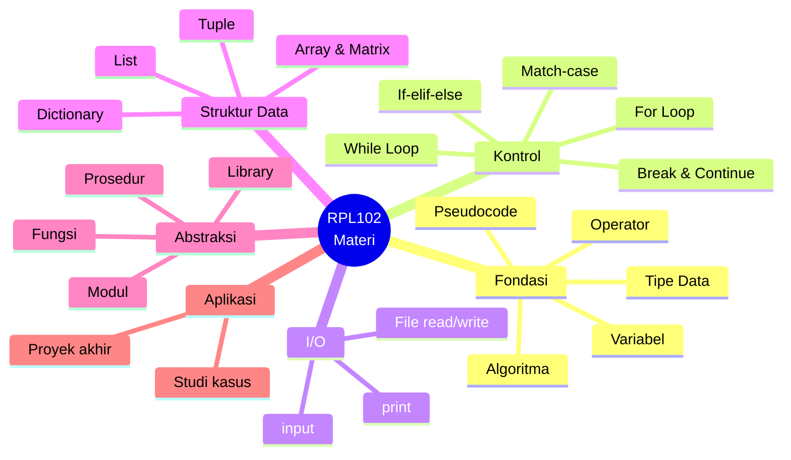

---

## Metode Pembelajaran

| Aspek         | Keterangan                      |
| ------------- | ------------------------------- |
| **Modalitas** | Blended Learning                |
| **Bentuk**    | Kuliah Teori & Praktik          |
| **Strategi**  | Pembelajaran Inkuiri            |
| **Metode**    | Case-Study Learning             |
| **Media**     | Komputer, LCD, Video Conference |

**Pengalaman belajar:** ceramah sinkron, recording asinkron, diskusi interaktif, praktikum kasus.

### Siklus Belajar

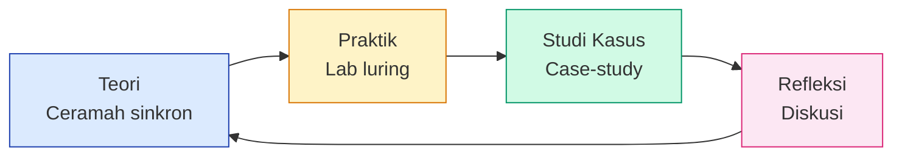

### Alokasi Waktu

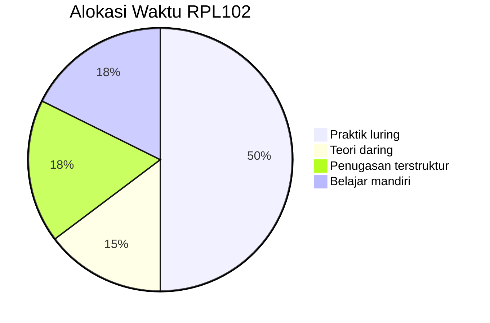

| Kategori              |   Menit   | Persentase |
| --------------------- | :-------: | :--------: |
| Teori daring          |   2.100   |    15%     |
| Penugasan terstruktur |   2.520   |   17,5%    |
| Belajar mandiri       |   2.520   |   17,5%    |
| **Praktik luring**    | **7.140** |  **50%**   |
| **Total**             |  14.280   |    100%    |

:::info Praktik adalah Raja
**Separuh waktu perkuliahan** dialokasikan untuk praktik luring — mata kuliah ini menekankan _doing_, bukan sekadar membaca teori.
:::

---

## Sarana Praktikum

| No. | Sarana             | Jumlah |
| :-: | ------------------ | :----: |
|  1  | Zoom Premium       |   1    |
|  2  | PC                 |   30   |
|  3  | Laboratorium       |   1    |
|  4  | E-Learning         |   1    |
|  5  | Visual Studio Code |   30   |
|  6  | Python             |   30   |

### Setup Environment

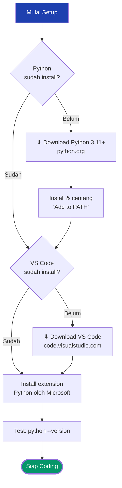

---

## Metode Evaluasi

**Bentuk:** Tugas/praktikum mingguan, ATS & AAS pilihan ganda, proyek/studi kasus, partisipatif.

### Komponen Penilaian

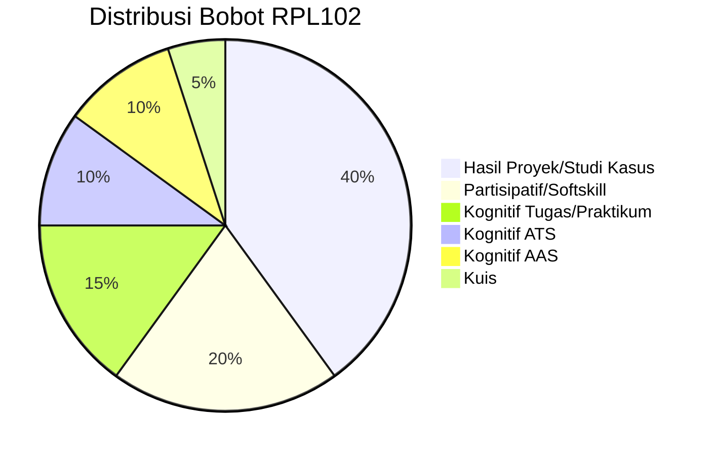

| Komponen                         | Bobot |
| -------------------------------- | :---: |
| Hasil Proyek/Studi Kasus         |  40%  |
| Aktivitas Partisipatif/Softskill |  20%  |
| Kognitif Tugas/Praktikum         |  15%  |
| Kognitif ATS                     |  10%  |
| Kognitif AAS                     |  10%  |
| Kuis                             |  5%   |

:::info Distribusi

- **Proyek 40%** — penerapan lebih penting daripada hafal.
- **Partisipatif 20%** — softskill dan kehadiran dihargai.
- **ATS + AAS = 20%** — pilihan ganda, mengukur konsep.
- **Tugas + Kuis = 20%.**

:::

### Pemetaan Asesmen

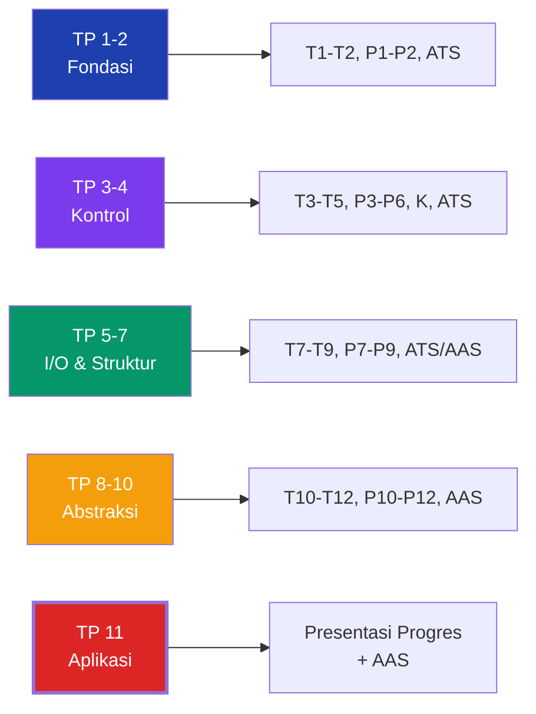

| Tujuan | Metode Asesmen      |
| :----: | ------------------- |
|   1    | T1, P1, ATS         |
|   2    | T2, P2, ATS         |
|   3    | T3, P3, T4, P4, ATS |
|   4    | T5, P5, K, P6, ATS  |
|   5    | T7, P7, ATS         |
|   6    | T8, P8, AAS         |
|   7    | T9, P9, AAS         |
|   8    | T10, P10, AAS       |
|   9    | T11, P11, AAS       |
|   10   | T12, P12, AAS       |
|   11   | PP, AAS             |

**Keterangan:** T = Tugas · P = Praktikum · K = Kuis · PP = Presentasi Progres · ATS/AAS = Asesmen Tengah/Akhir Semester.

### Kriteria Nilai

| Angka | Huruf | Angka | Huruf |
| :---: | :---: | :---: | :---: |
|  ≥85  |   A   | 60–64 |  C+   |
| 80–84 |  A-   | 55–59 |   C   |
| 75–79 |  B+   | 50–54 |  C-   |
| 70–74 |   B   | 45–49 |  D+   |
| 65–69 |  B-   | 40–44 |   D   |
|       |       | `<40` |   E   |

---

## Kesepakatan

1. Wajib ikut semua kegiatan (toleransi keterlambatan maks **15 menit**).
2. Tugas dikumpulkan via e-learning.
3. Tugas dikumpulkan sesuai batas akhir.
4. Partisipasi aktif dan sungguh-sungguh.
5. Jaga etika moral dan akademik.

:::warning Plagiarisme
Kode yang dikumpulkan **harus karya sendiri**. Menyalin kode teman (bahkan dengan modifikasi kecil) adalah pelanggaran akademik. Kalau stuck, tanya dosen atau cari referensi — jangan copy paste.
:::

---

## Pustaka

1. **Python 3 Tutorial** — [docs.python.org/3/tutorial](https://docs.python.org/3/tutorial/index.html)
2. Matthes E. _Python Crash Course_, 2nd ed. No Starch Press, 2019.
3. Sweigart A. _Automate the Boring Stuff with Python_, 2nd ed. No Starch Press.
4. Spraul V. _Think like a Programmer_. No Starch Press, 2012.

### Peta Pustaka

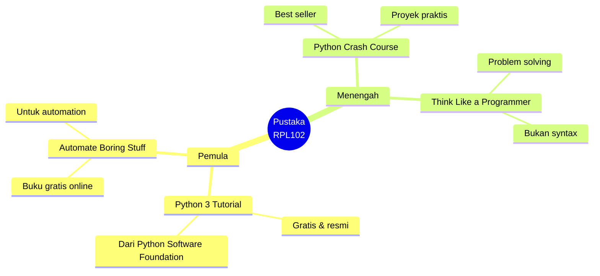

---

## Riwayat RPS

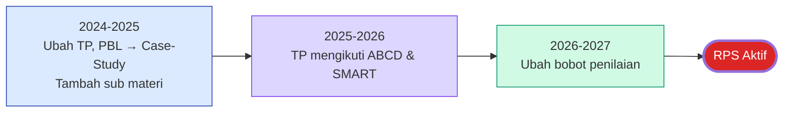

| Tahun     | Perubahan                                    | Alasan                                  |
| --------- | -------------------------------------------- | --------------------------------------- |
| 2024-2025 | Ubah TP, PBL → Case-Study, tambah sub materi | Menyesuaikan proyek & melengkapi konten |
| 2025-2026 | TP mengikuti ABCD & SMART                    | Terstruktur & mudah dievaluasi          |
| 2026-2027 | Ubah bobot penilaian                         | Penyesuaian beban                       |

---

## Sumber Online

| Sumber          | Tautan                                       |
| --------------- | -------------------------------------------- |
| E-Learning      | [Buka →](https://learningif.polibatam.ac.id) |
| Python Official | [Buka →](https://www.python.org)             |
| VS Code         | [Buka →](https://code.visualstudio.com)      |
| Google Colab    | [Buka →](https://colab.research.google.com)  |

---

## Tips Praktis

:::tip Strategi Belajar RPL102

- **Ketik ulang kode** — jangan copy paste; muscle memory penting.
- **Error adalah teman** — bug mengajarkan lebih banyak dari kode yang jalan.
- **Latihan tiap hari 30 menit** — lebih baik dari 4 jam sekali seminggu.
- **Pakai `print()` untuk debug** — cara paling primitif tapi paling ampuh.
- **Google error message** — 90% error sudah pernah dialami orang lain.
- **Baca dokumentasi resmi** — `docs.python.org` lebih akurat dari blog.
- **Simpan kode di Git** — bahkan untuk latihan pribadi.

:::

:::warning Jebakan Pemula

- **Lupa indentasi** — Python error kalau indentasi salah.
- **`=` vs `==`** — assignment vs comparison, kesalahan paling umum.
- **Lupa konversi tipe** — `input()` selalu return string.
- **Off-by-one error** — `range(1, 6)` = 1-5, bukan 1-6.
- **Lupa `:` setelah `if`/`for`/`def`** — syntax error klasik.
- **Variable name typo** — `nama` vs `nma`, Python tidak akan tahu.
- **Menyimpan kode hanya di 1 tempat** — pakai Git, cloud, atau folder backup.

:::

### Common Beginner Mistakes

| Error         | Penyebab                         | Solusi                         |
| ------------- | -------------------------------- | ------------------------------ |
| `SyntaxError` | Lupa `:` atau indentasi salah    | Cek ulang struktur blok        |
| `TypeError`   | Operasi antar tipe beda          | Konversi dulu: `int(input())`  |
| `NameError`   | Pakai variabel yang belum dibuat | Cek ejaan & urutan definisi    |
| `IndexError`  | Akses index di luar rentang      | Cek `len(list)` dulu           |
| `KeyError`    | Akses key dict yang tidak ada    | Pakai `dict.get(key, default)` |

---

## Halaman Terkait

| Halaman                                             | Deskripsi                        |
| --------------------------------------------------- | -------------------------------- |
| [Mata Kuliah](/docs/v1/courses/)                    | Daftar mata kuliah semester ini. |
| [Tugas](/docs/v1/task/)                             | Daftar tugas dan pengumpulan.    |
| [Jadwal Kuliah](/docs/v1/information/jadwal-kuliah) | Jadwal mingguan.                 |
| [Info Tim PBL](/docs/v1/information/info-team-pbl)  | Deskripsi proyek PBL.            |
| [Format Halaman Konten](/docs/format/page)          | Panduan penulisan halaman.       |
