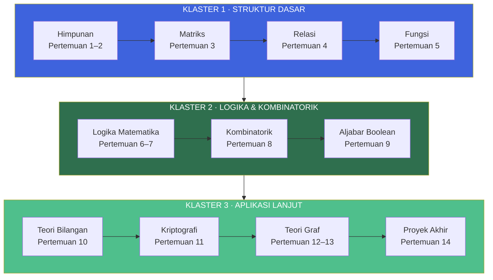
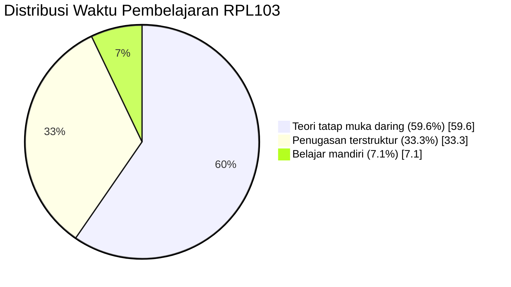
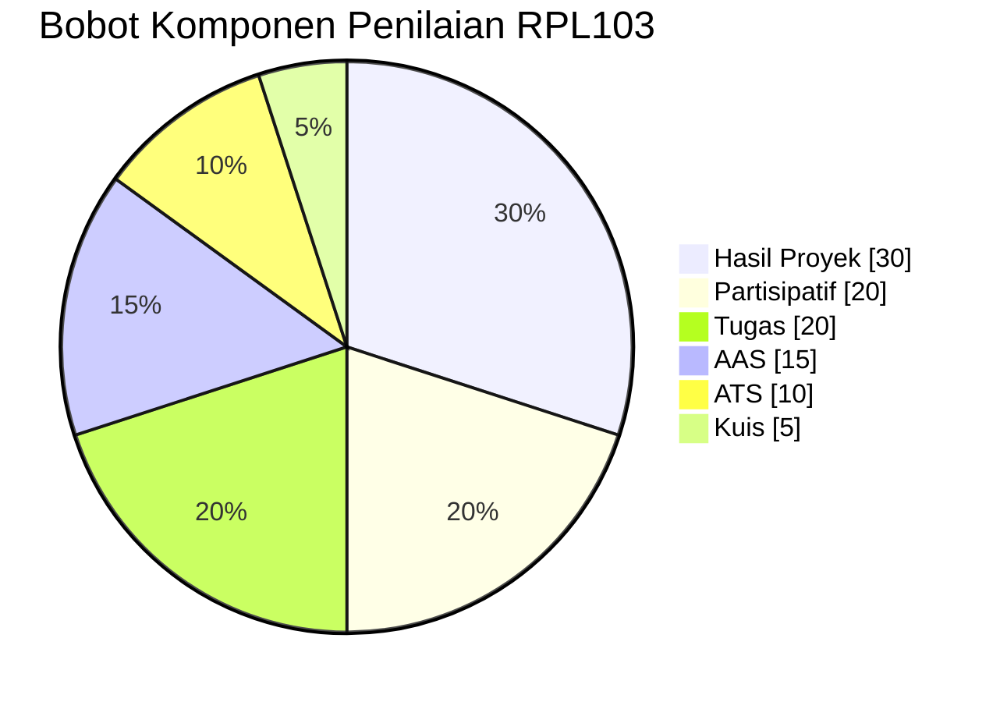

::: tip Halaman Resmi E-Learning
Seluruh materi, penugasan, dan aktivitas mata kuliah ini terpusat di e-learning Jurusan Teknik Informatika Politeknik Negeri Batam.

[**Buka E-Learning IF Polibatam →**](https://learning-if.polibatam.ac.id)
:::

## Peta Mata Kuliah

Matematika Diskrit RPL103 dibagi menjadi **tiga klaster besar** yang saling membangun. Setiap klaster berkontribusi pada kompetensi berbeda dalam rekayasa perangkat lunak.

**Benang merah:** Klaster 1 membangun bahasa dasar (himpunan, matriks, relasi, fungsi). Klaster 2 melatih penalaran simbolik (logika, kombinatorik, Boolean). Klaster 3 menerapkan semuanya pada kasus nyata — kriptografi dan jaringan.

## Informasi Umum

| **Kode** | **SKS** |   **Semester**   | **Status** |
| :------: | :-----: | :--------------: | :--------: |
|  RPL103  |    3    | Ganjil 2026/2027 |   Wajib    |

| Bidang               | Keterangan                              |
| -------------------- | --------------------------------------- |
| **Nama Mata Kuliah** | Matematika Diskrit                      |
| **Prasyarat**        | Tidak ada                               |
| **Program Studi**    | Teknologi Rekayasa Perangkat Lunak (D4) |
| **Dosen Pengampu**   | Supardianto                             |
| **Email**            | supardianto@polibatam.ac.id             |
| **Bahasa**           | Indonesia                               |
| **Tanggal Berlaku**  | 7 September 2026                        |

### Deskripsi Mata Kuliah

Mata kuliah ini membahas konsep dasar matematika diskrit sebagai fondasi rekayasa perangkat lunak, meliputi himpunan, matriks, relasi, fungsi, logika matematika, kombinatorik, aljabar Boolean, teori bilangan, dan teori graf. Pembelajaran menekankan pemodelan masalah dan penerapan pada struktur data, basis data, kriptografi sederhana, serta optimasi jaringan.

::: info Cara Membaca Halaman Ini
Halaman ini disusun sebagai **satu perjalanan belajar 16 pertemuan**. Setiap klaster materi punya capaian pembelajaran (CPMK) yang jelas, sub-capaian (Sub CPMK) yang terukur, dan metode asesmen yang terpetakan. Gunakan outline di kanan untuk melompat ke bagian tertentu.
:::

## Capaian Pembelajaran

### CPMK-103-1 — Struktur Dasar

**Mampu menerapkan konsep himpunan, matriks, relasi, dan fungsi untuk memodelkan struktur data dan merancang algoritma dalam konteks rekayasa perangkat lunak.**

| Aspek                     | Keterangan                                                                                 |
| ------------------------- | ------------------------------------------------------------------------------------------ |
| **CPL**                   | Mampu menerapkan konsep matematika diskrit sebagai landasan penyelesaian masalah komputasi |
| **Profil Lulusan**        | PL-2 Data Analyst · PL-1 Programmer                                                        |
| **Performance Indicator** | Mampu menerapkan himpunan, matriks, relasi, dan fungsi dalam pemodelan data dan algoritma  |

|  Kode  | Sub CPMK                                                      |       Target       |
| :----: | ------------------------------------------------------------- | :----------------: |
| TP-1-1 | Menerapkan teori Himpunan untuk memodelkan data RPL           |        ≥80%        |
| TP-1-2 | Menerapkan teori Matriks untuk transformasi/representasi data |        ≥85%        |
| TP-1-3 | Menerapkan teori Relasi dalam perancangan basis data          | ≥4 dari 5 skenario |
| TP-1-4 | Menerapkan teori Fungsi dalam algoritma perangkat lunak       |     ≥90% benar     |

### CPMK-103-2 — Logika & Kombinatorik

**Mampu menerapkan logika matematika, kombinatorik, dan aljabar Boolean dalam perancangan algoritma keputusan dan ekspresi logika program.**

| Aspek                     | Keterangan                                                                                      |
| ------------------------- | ----------------------------------------------------------------------------------------------- |
| **CPL**                   | Mampu menerapkan konsep matematika diskrit sebagai landasan penyelesaian masalah komputasi      |
| **Profil Lulusan**        | PL-2 Data Analyst · PL-1 Programmer                                                             |
| **Performance Indicator** | Mampu menerapkan logika matematika, kombinatorik, dan aljabar Boolean dalam algoritma keputusan |

|  Kode  | Sub CPMK                                                    |        Target        |
| :----: | ----------------------------------------------------------- | :------------------: |
| TP-2-1 | Menerapkan Logika Matematika dalam algoritma keputusan      | ≥85% bebas kesalahan |
| TP-2-2 | Menerapkan Kombinatorik untuk menghitung solusi masalah RPL |     ≥80% akurasi     |
| TP-2-3 | Menerapkan Aljabar Boolean dalam ekspresi/gerbang logika    |    ≥85% ketepatan    |

### CPMK-103-3 — Aplikasi Lanjut

**Mampu menerapkan teori bilangan dan teori graf untuk menyelesaikan masalah kriptografi dasar dan optimasi jalur/jaringan dalam sistem perangkat lunak.**

| Aspek                     | Keterangan                                                                                   |
| ------------------------- | -------------------------------------------------------------------------------------------- |
| **CPL**                   | Mampu menerapkan konsep matematika diskrit sebagai landasan penyelesaian masalah komputasi   |
| **Profil Lulusan**        | PL-2 Data Analyst · PL-1 Programmer                                                          |
| **Performance Indicator** | Mampu menerapkan teori bilangan dan teori graf dalam kriptografi dasar dan optimasi jaringan |

|  Kode  | Sub CPMK                                                       |      Target       |
| :----: | -------------------------------------------------------------- | :---------------: |
| TP-3-1 | Menerapkan Teori Bilangan pada algoritma kriptografi sederhana | ≥80% keberhasilan |
| TP-3-2 | Menerapkan Teori Graf pada optimasi jalur/jaringan             | ≥80% keberhasilan |

### Peta Kompetensi

| No  | Kompetensi                                                    |    CPMK    | Sub CPMK |   Asesmen   |
| :-: | ------------------------------------------------------------- | :--------: | :------: | :---------: |
|  1  | Menerapkan teori Himpunan untuk memodelkan data RPL           | CPMK-103-1 |  TP-1-1  |   T1, K1    |
|  2  | Menerapkan teori Matriks untuk transformasi/representasi data | CPMK-103-1 |  TP-1-2  |   T2, ATS   |
|  3  | Menerapkan teori Relasi dalam perancangan basis data          | CPMK-103-1 |  TP-1-3  |   T2, ATS   |
|  4  | Menerapkan teori Fungsi dalam algoritma perangkat lunak       | CPMK-103-1 |  TP-1-4  |   T2, ATS   |
|  5  | Menerapkan Logika Matematika dalam algoritma keputusan        | CPMK-103-2 |  TP-2-1  |   T3, ATS   |
|  6  | Menerapkan Kombinatorik untuk menghitung solusi masalah RPL   | CPMK-103-2 |  TP-2-2  |   T4, AAS   |
|  7  | Menerapkan Aljabar Boolean dalam ekspresi/gerbang logika      | CPMK-103-2 |  TP-2-3  |   T5, AAS   |
|  8  | Menerapkan Teori Bilangan pada kriptografi sederhana          | CPMK-103-3 |  TP-3-1  | T6, P2, AAS |
|  9  | Menerapkan Teori Graf pada optimasi jalur/jaringan            | CPMK-103-3 |  TP-3-2  | T7, P2, AAS |

::: tip Entry Behavior
**Tidak ada prasyarat.** Mata kuliah ini dirancang untuk mahasiswa yang baru pertama kali mempelajari matematika diskrit.
:::

## Rencana Pembelajaran

### Timeline 16 Pertemuan

```mermaid
gantt
    title Timeline RPL103 — 16 Pertemuan
    dateFormat X
    axisFormat %s

    section Klaster 1 · Struktur Dasar
    Himpunan (1-2)                  :a1, 0, 2
    Matriks                         :a2, 2, 1
    Relasi                          :a3, 3, 1
    Fungsi                          :a4, 4, 1

    section Klaster 2 · Logika
    Logika Matematika (6-7)         :b1, 5, 2
    Kombinatorik                    :b2, 7, 1
    Aljabar Boolean                 :b3, 8, 1

    section Klaster 3 · Aplikasi
    Teori Bilangan                  :c1, 9, 1
    Kriptografi Sederhana           :c2, 10, 1
    Teori Graf (12-13)              :c3, 11, 2
    Proyek Akhir                    :crit, c4, 13, 1

    section Asesmen
    ATS                             :crit, ats, 14, 1
    AAS                             :crit, aas, 15, 1
```

### Detail Per Pertemuan

| Ke  |        Sub CPMK        | Bahan Kajian                 | Sub Bahan Kajian                                                                                                             | Estimasi Waktu               |
| :-: | :--------------------: | ---------------------------- | ---------------------------------------------------------------------------------------------------------------------------- | ---------------------------- |
|  1  |         TP-1-1         | Pengantar & Teori Himpunan   | RPS & kontrak; definisi himpunan; penyajian; kardinalitas; subset; himpunan kuasa; operasi; inklusi-eksklusi; himpunan fuzzy | Teori 2×50; PT 1×50          |
|  2  |         TP-1-1         | Teori Himpunan               | Diskusi studi kasus; tugas pemodelan data RPL dengan himpunan                                                                | Teori 1×50; PT 1×50; BM 1×50 |
|  3  |         TP-1-2         | Matriks                      | Pengertian; persamaan; jenis; operasi; determinan & adjoint; invers                                                          | Teori 2×50; PT 1×50          |
|  4  |         TP-1-3         | Relasi                       | Cartesian product; definisi; representasi; sifat; invers; komposisi                                                          | Teori 2×50; PT 1×50          |
|  5  |         TP-1-4         | Fungsi                       | Definisi; sifat; invers & komposisi; fungsi khusus; rekursif                                                                 | Teori 2×50; PT 1×50          |
|  6  |         TP-2-1         | Logika Matematika            | Proposisi; tabel kebenaran; tautologi, kontradiksi, kontingensi; ekivalensi logis                                            | Teori 2×50; PT 1×50          |
|  7  |         TP-2-1         | Penerapan Logika Matematika  | Studi kasus; latihan logika proposisi                                                                                        | Teori 2×50; PT 1×50          |
|  8  |         TP-2-2         | Kombinatorik                 | Kaidah menghitung; inklusi-eksklusi; permutasi & kombinasi; koefisien binomial; sarang merpati                               | Teori 2×50; PT 1×50          |
|  9  |         TP-2-3         | Aljabar Boolean              | Definisi; Boolean dua nilai; ekspresi; hukum; fungsi; aplikasi                                                               | Teori 2×50; PT 1×50          |
| 10  |         TP-3-1         | Teori Bilangan               | Bilangan bulat; pembagian; FPB; algoritma Euclidean; kombinasi lanjar; modulo; prima                                         | Teori 3×50                   |
| 11  |         TP-3-1         | Kriptografi Sederhana        | Enkripsi, dekripsi, kunci; penerapan teori bilangan                                                                          | Teori 1×50; PT 1×50; BM 1×50 |
| 12  |         TP-3-2         | Teori Graf                   | Sejarah; definisi; jenis; terminologi; Euler; Hamilton; lintasan terpendek                                                   | Teori 2×50; PT 1×50          |
| 13  |         TP-3-2         | Studi Kasus Teori Graf       | Diskusi tugas; studi kasus penerapan teori graf                                                                              | Teori 1×50; PT 2×50          |
| 14  |     TP-3-1, TP-3-2     | Penerapan Matematika Diskrit | Presentasi proyek; penjelasan penerapan matematika diskrit                                                                   | Teori 1×50; PT 1×50; BM 1×50 |
| 15  | CPMK-103-1, CPMK-103-2 | **Asesmen Tengah Semester**  | Ujian online (pilihan ganda & studi kasus)                                                                                   | Teori 2×50                   |
| 16  | CPMK-103-2, CPMK-103-3 | **Asesmen Akhir Semester**   | Ujian online (pilihan ganda & studi kasus)                                                                                   | Teori 2×50                   |

### Estimasi Waktu Total

| Kategori                |     Menit | Persentase |
| ----------------------- | --------: | ---------: |
| Teori tatap muka daring |     1.250 |      59,6% |
| Penugasan terstruktur   |       700 |      33,3% |
| Belajar mandiri         |       150 |       7,1% |
| Praktik luring          |         0 |         0% |
| **Total**               | **2.100** |   **100%** |

::: info Catatan
Mata kuliah ini **sepenuhnya daring** — tidak ada sesi praktikum luring. Semua pembelajaran berlangsung melalui Zoom dan e-learning.
:::

## Metode Evaluasi

### Instrumen Asesmen

- **Softskill** — keaktifan, disiplin, tanggung jawab, logis, kritis, sistematis
- **Tugas tertulis** — soal/studi kasus daring, dikumpulkan di e-learning
- **Hasil proyek** — penerapan matematika dalam proyek nyata
- **Kuis** — pretest dan posttest pemahaman konsep
- **ATS** — konsep pertemuan 1–7, pilihan ganda, online 2 sesi
- **AAS** — konsep pertemuan 8–14, pilihan ganda, online 2 sesi

### Pemetaan Asesmen per Minggu

| Minggu |          CPMK          |      Sub CPMK      | Asesmen |
| :----: | :--------------------: | :----------------: | :-----: |
|  1–2   |       CPMK-103-1       |       TP-1-1       | K1, T1  |
|   3    |       CPMK-103-1       |       TP-1-2       |   T2    |
|   4    |       CPMK-103-1       |       TP-1-3       |   T2    |
|   5    |       CPMK-103-1       |       TP-1-4       |   T2    |
|  6–7   |       CPMK-103-2       |       TP-2-1       |   T3    |
|   8    |       CPMK-103-2       |       TP-2-2       |   T4    |
|   9    |       CPMK-103-2       |       TP-2-3       |   T5    |
| 10–11  |       CPMK-103-3       |       TP-3-1       | T6, P2  |
| 12–13  |       CPMK-103-3       |       TP-3-2       | T7, P2  |
|   14   |       CPMK-103-3       |       Semua        |   P2    |
|   15   | CPMK-103-1, CPMK-103-2 | TP-1-1 s.d. TP-2-3 | **ATS** |
|   16   | CPMK-103-2, CPMK-103-3 | TP-2-1 s.d. TP-3-2 | **AAS** |

**Keterangan:**

- **T** — Tugas
- **K** — Kuis
- **P** — Proyek
- **ATS** — Asesmen Tengah Semester
- **AAS** — Asesmen Akhir Semester

### Komponen Penilaian

| Komponen         | Sub-Komponen                         | Persentase | Visual               |
| ---------------- | ------------------------------------ | :--------: | -------------------- |
| **Partisipatif** | Keaktifan                            |     5%     | `█░░░░░░░░░░░░░░░░░` |
|                  | Disiplin                             |     5%     | `█░░░░░░░░░░░░░░░░░` |
|                  | Tanggung Jawab                       |     5%     | `█░░░░░░░░░░░░░░░░░` |
|                  | Keterampilan umum                    |     5%     | `█░░░░░░░░░░░░░░░░░` |
| **Hasil Proyek** | Pemodelan matematis                  |    15%     | `███░░░░░░░░░░░░░░░` |
|                  | Kebenaran perhitungan & interpretasi |    15%     | `███░░░░░░░░░░░░░░░` |
| **Tugas**        | Tugas 1: Teori Himpunan              |     2%     | `█░░░░░░░░░░░░░░░░░` |
|                  | Tugas 2: Matriks, Relasi, Fungsi     |     3%     | `█░░░░░░░░░░░░░░░░░` |
|                  | Tugas 3: Logika Matematika           |     3%     | `█░░░░░░░░░░░░░░░░░` |
|                  | Tugas 4: Kombinatorial               |     3%     | `█░░░░░░░░░░░░░░░░░` |
|                  | Tugas 5: Aljabar Boolean             |     3%     | `█░░░░░░░░░░░░░░░░░` |
|                  | Tugas 6: Teori Bilangan              |     3%     | `█░░░░░░░░░░░░░░░░░` |
|                  | Tugas 7: Teori Graf                  |     3%     | `█░░░░░░░░░░░░░░░░░` |
| **Kuis**         | Kuis 1: Pemahaman awal               |    2,5%    | `█░░░░░░░░░░░░░░░░░` |
|                  | Kuis 2: Pemahaman akhir              |    2,5%    | `█░░░░░░░░░░░░░░░░░` |
| **ATS**          | Ujian Tengah Semester                |    10%     | `██░░░░░░░░░░░░░░░░` |
| **AAS**          | Ujian Akhir Semester                 |    15%     | `███░░░░░░░░░░░░░░░` |

::: info Distribusi Nilai

- **Proyek + Tugas bersama-sama = 50%** dari total nilai — menegaskan bahwa **penerapan** lebih penting daripada sekadar hafal teori.
- **ATS + AAS = 25%** — mengukur pemahaman konseptual di dua titik tengah dan akhir.
- **Partisipatif = 20%** — softskill dan kehadiran dihargai signifikan.
- **Kuis = 5%** — pre/post test kecil untuk mengukur pemahaman awal dan akhir.
  :::

### Kriteria Penilaian

| Nilai Angka | Nilai Huruf |
| ----------- | :---------: |
| ≥ 85        |      A      |
| 80 – 84     |     A-      |
| 75 – 79     |     B+      |
| 70 – 74     |      B      |
| 65 – 69     |     B-      |
| 60 – 64     |     C+      |
| 55 – 59     |      C      |
| 50 – 54     |     C-      |
| 45 – 49     |     D+      |
| 40 – 44     |      D      |
| < 40        |      E      |

## Proyek Akhir

### Tujuan

Menerapkan konsep matematika diskrit pada masalah rekayasa perangkat lunak.

### Luaran

- **Laporan proyek** (PDF)
- **Kode program** (opsional)
- **Presentasi** di pertemuan 14

### Timeline Proyek

```mermaid
gantt
    title Timeline Proyek Akhir RPL103
    dateFormat X
    axisFormat %s
    section Proyek
    Penentuan topik        :milestone, m1, 9, 1
    Progress report        :active, p1, 9, 3
    Presentasi & pengumpulan :crit, milestone, m2, 13, 1
```

| Minggu | Aktivitas                          |
| :----: | ---------------------------------- |
|   10   | Penentuan topik                    |
|   12   | Progress report                    |
|   14   | Presentasi dan pengumpulan laporan |

### Rubrik Penilaian Proyek

| Aspek                     | Bobot | Kriteria                                         | Skor |
| ------------------------- | :---: | ------------------------------------------------ | :--: |
| **Pemodelan matematis**   |  15%  | Ketepatan model dan relevansi dengan masalah RPL | 1–4  |
| **Kebenaran perhitungan** |  10%  | Akurasi perhitungan dan prosedur                 | 1–4  |
| **Interpretasi hasil**    |  5%   | Kualitas interpretasi dan rekomendasi            | 1–4  |

## Rubrik Softskill

| Aspek                 | Sangat Baik (4)         | Baik (3)         | Cukup (2)        | Kurang (1)       |
| --------------------- | ----------------------- | ---------------- | ---------------- | ---------------- |
| **Keaktifan**         | Selalu aktif            | Sering aktif     | Kadang aktif     | Tidak aktif      |
| **Disiplin**          | Tepat waktu 100%        | ≥80%             | ≥60%             | <60%             |
| **Tanggung Jawab**    | Semua tugas tepat waktu | ≥80% tepat waktu | ≥60% tepat waktu | <60% tepat waktu |
| **Keterampilan Umum** | Sangat baik             | Baik             | Cukup            | Kurang           |

## Sarana dan Prasarana

| No  | Sarana/Prasarana                      | Jumlah |
| :-: | ------------------------------------- | :----: |
|  1  | Learning Management System (LMS)      |   1    |
|  2  | Zoom                                  |   1    |
|  3  | Laptop                                |   1    |
|  4  | Koneksi Internet                      |   1    |
|  5  | Software matematika (Python/GeoGebra) |   1    |

## Kesepakatan Pelaksanaan Perkuliahan

Pelaksanaan perkuliahan RPL103 Matematika Diskrit mengacu pada kesepakatan berikut:

1. Mahasiswa wajib mengikuti seluruh kegiatan perkuliahan sesuai jadwal dengan **toleransi keterlambatan maksimal 15 menit**.
2. Selama perkuliahan daring, mahasiswa diharuskan **mengaktifkan kamera**.
3. Semua penugasan dikumpulkan melalui e-learning IF Polibatam di [https://learning-if.polibatam.ac.id](https://learning-if.polibatam.ac.id), kecuali diinstruksikan berbeda.
4. Semua penugasan wajib dikumpulkan sesuai batas akhir yang ditetapkan dosen.
5. Mahasiswa berpartisipasi aktif dan berkomitmen mengikuti perkuliahan.
6. Mahasiswa wajib menjaga etika moral dan etika akademik.
7. **Penggunaan AI generatif diperbolehkan** sebagai alat bantu belajar, namun mahasiswa **wajib memahami dan dapat menjelaskan** karya yang dikumpulkan.
8. **Plagiarisme tidak ditoleransi** dan ditindaklanjuti sesuai peraturan akademik.

## Pustaka

### Pustaka Utama

| No. | Referensi                                                                                 |
| :-: | ----------------------------------------------------------------------------------------- |
|  1  | Munir, R., _Matematika Diskrit_, Bandung, Informatika, 2012.                              |
|  2  | Susanna S. Epp, _Discrete Mathematics with Applications_, 4th Edition, Brooks Cole, 2010. |

### Pustaka Pendukung

| No. | Referensi                                                                                              |
| :-: | ------------------------------------------------------------------------------------------------------ |
|  1  | Seymour Lipschutz, Marc Lipson, _Discrete Mathematics_, McGraw-Hill, 2007.                             |
|  2  | Haym Kruglak, dkk., _Basic Mathematics With Application To Science And Technology_, McGraw-Hill, 2009. |
|  3  | Erwin Kreyszig, _Advanced Engineering Mathematics_, John Wiley & Sons, 1999.                           |
|  4  | Rosen, K. H., _Discrete Mathematics and Its Applications_, McGraw-Hill.                                |

## Daftar Istilah

| Istilah      | Kepanjangan / Arti                   |
| ------------ | ------------------------------------ |
| **AAS**      | Asesmen Akhir Semester               |
| **ATS**      | Asesmen Tengah Semester              |
| **BM**       | Belajar Mandiri                      |
| **CPL**      | Capaian Pembelajaran Lulusan         |
| **CPMK**     | Capaian Pembelajaran Mata Kuliah     |
| **PBL**      | Problem Based Learning               |
| **PI**       | Performance Indicator                |
| **PL**       | Profil Lulusan                       |
| **PT**       | Penugasan Terstruktur                |
| **SKS**      | Satuan Kredit Semester               |
| **Sub CPMK** | Sub Capaian Pembelajaran Mata Kuliah |
| **TP**       | Tujuan Pembelajaran                  |

## Sumber Referensi Online

### Platform Utama

| Sumber                  | Tautan                                        |
| ----------------------- | --------------------------------------------- |
| E-Learning IF Polibatam | [Buka →](https://learning-if.polibatam.ac.id) |
| Politeknik Negeri Batam | [Buka →](https://www.polibatam.ac.id)         |

### Software Pendukung

| Software         | Tautan                                      | Kegunaan                                                     |
| ---------------- | ------------------------------------------- | ------------------------------------------------------------ |
| **Python**       | [Buka →](https://www.python.org)            | Komputasi matematis, visualisasi graf, kriptografi sederhana |
| **GeoGebra**     | [Buka →](https://www.geogebra.org)          | Visualisasi geometris, graf, dan fungsi                      |
| **Google Colab** | [Buka →](https://colab.research.google.com) | Menjalankan Python tanpa instalasi lokal                     |
| **Desmos**       | [Buka →](https://www.desmos.com)            | Plotting fungsi dan grafik interaktif                        |

### Sumber Belajar Tambahan

| Sumber                                                    | Deskripsi                                                 |
| --------------------------------------------------------- | --------------------------------------------------------- |
| **Matematika Diskrit — Rinaldi Munir**                    | Buku klasik berbahasa Indonesia, mudah diikuti mahasiswa. |
| **Discrete Mathematics with Applications — Epp**          | Pendekatan aplikatif dengan banyak contoh nyata.          |
| **Khan Academy — Discrete Math**                          | Video pembelajaran gratis, cocok untuk review cepat.      |
| **MIT OpenCourseWare — Mathematics for Computer Science** | Kuliah lengkap dari MIT, tersedia gratis.                 |

::: info Tentang Halaman Ini
Halaman ini disusun berdasarkan Rencana Pembelajaran Semester (RPS) RPL103 Matematika Diskrit dan konten e-learning Jurusan Teknik Informatika Politeknik Negeri Batam untuk Semester Ganjil 2026/2027. Informasi dapat berubah sewaktu-waktu mengikuti perkembangan perkuliahan.
:::

::: tip Butuh Update Cepat?
Jika ada perubahan jadwal, materi, atau informasi evaluasi, edit file `docs/v1/courses/rpl103-matematika-diskrit/index.md` dan commit. Jangan biarkan informasi basi menumpuk.
:::
