# RPL103 — Matematika Diskrit

**Kode:** RPL103 · **SKS:** 3 · **Semester:** Ganjil 2026/2027 · **Status:** Wajib
**Dosen:** Supardianto
**Email:** supardianto@polibatam.ac.id
**Berlaku:** 7 September 2026

> **Tagline:** Fondasi matematis untuk RPL — dari himpunan, logika, dan kombinatorik hingga teori graf dan kriptografi sederhana.

:::tip[E-Learning]
[**Buka E-Learning →**](https://learning-if.polibatam.ac.id)
:::

## Navigasi Cepat

-   [Peta Mata Kuliah](#peta-mata-kuliah)
-   [Informasi Umum](#informasi-umum)
-   [Capaian Pembelajaran](#capaian-pembelajaran)
-   [Rencana Pembelajaran](#rencana-pembelajaran)
-   [Metode Evaluasi](#metode-evaluasi)
-   [Proyek Akhir](#proyek-akhir)
-   [Rubrik Softskill](#rubrik-softskill)
-   [Sarana & Prasarana](#sarana--prasarana)
-   [Kesepakatan](#kesepakatan)
-   [Pustaka](#pustaka)
-   [Daftar Istilah](#daftar-istilah)

---

## Peta Mata Kuliah

Tiga klaster yang saling membangun:

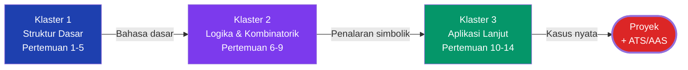

| Klaster                       | Pertemuan | Fokus                                     |
| ----------------------------- | :-------: | ----------------------------------------- |
| **1 · Struktur Dasar**        |    1–5    | Himpunan, matriks, relasi, fungsi         |
| **2 · Logika & Kombinatorik** |    6–9    | Logika, kombinatorik, aljabar Boolean     |
| **3 · Aplikasi Lanjut**       |   10–14   | Bilangan, kriptografi, graf, proyek akhir |

**Benang merah:** Klaster 1 membangun bahasa dasar. Klaster 2 melatih penalaran simbolik. Klaster 3 menerapkan semuanya pada kasus nyata — kriptografi dan jaringan.

### Mengapa Matematika Diskrit Penting untuk RPL?

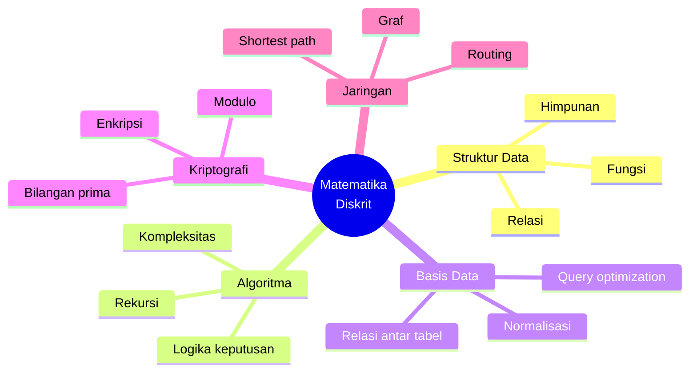

---

## Informasi Umum

|  Kode  | SKS |     Semester     | Status |
| :----: | :-: | :--------------: | :----: |
| RPL103 |  3  | Ganjil 2026/2027 | Wajib  |

| Bidang        | Keterangan                  |
| ------------- | --------------------------- |
| **Nama**      | Matematika Diskrit          |
| **Prasyarat** | Tidak ada                   |
| **Dosen**     | Supardianto                 |
| **Email**     | supardianto@polibatam.ac.id |
| **Berlaku**   | 7 September 2026            |

### Deskripsi

Konsep dasar matematika diskrit sebagai fondasi RPL — himpunan, matriks, relasi, fungsi, logika matematika, kombinatorik, aljabar Boolean, teori bilangan, teori graf. Menekankan pemodelan masalah dan penerapan pada struktur data, basis data, kriptografi sederhana, serta optimasi jaringan.

:::info[Mata kuliah sepenuhnya daring]
RPL103 **tidak ada sesi praktikum luring** — semua perkuliahan via Zoom/LMS. **Kamera wajib aktif** saat kuliah daring.
:::

---

## Capaian Pembelajaran

### CPMK-103-1 — Struktur Dasar

Menerapkan himpunan, matriks, relasi, dan fungsi untuk memodelkan struktur data & merancang algoritma.

|  Kode  | Sub CPMK                                  |    Target     |
| :----: | ----------------------------------------- | :-----------: |
| TP-1-1 | Teori himpunan untuk memodelkan data RPL  |     ≥80%      |
| TP-1-2 | Teori matriks untuk transformasi data     |     ≥85%      |
| TP-1-3 | Teori relasi dalam perancangan basis data | ≥4/5 skenario |
| TP-1-4 | Teori fungsi dalam algoritma PL           |  ≥90% benar   |

### CPMK-103-2 — Logika & Kombinatorik

Menerapkan logika, kombinatorik, dan aljabar Boolean dalam algoritma keputusan & ekspresi logika program.

|  Kode  | Sub CPMK                                   |      Target      |
| :----: | ------------------------------------------ | :--------------: |
| TP-2-1 | Logika matematika di algoritma keputusan   | ≥85% bebas error |
| TP-2-2 | Kombinatorik untuk menghitung solusi       |   ≥80% akurasi   |
| TP-2-3 | Aljabar Boolean di ekspresi/gerbang logika |  ≥85% ketepatan  |

### CPMK-103-3 — Aplikasi Lanjut

Menerapkan teori bilangan & graf untuk kriptografi dasar dan optimasi jaringan.

|  Kode  | Sub CPMK                                  |      Target       |
| :----: | ----------------------------------------- | :---------------: |
| TP-3-1 | Teori bilangan pada kriptografi sederhana | ≥80% keberhasilan |
| TP-3-2 | Teori graf pada optimasi jalur/jaringan   | ≥80% keberhasilan |

### Peta Kompetensi

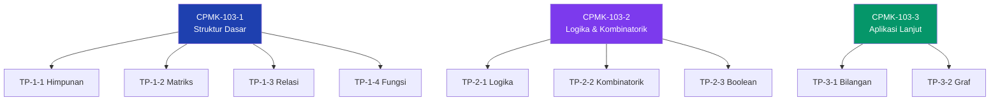

| No  | Kompetensi                           |    CPMK    |   Asesmen   |
| :-: | ------------------------------------ | :--------: | :---------: |
|  1  | Himpunan untuk memodelkan data       | CPMK-103-1 |   T1, K1    |
|  2  | Matriks untuk transformasi data      | CPMK-103-1 |   T2, ATS   |
|  3  | Relasi dalam perancangan basis data  | CPMK-103-1 |   T2, ATS   |
|  4  | Fungsi dalam algoritma PL            | CPMK-103-1 |   T2, ATS   |
|  5  | Logika di algoritma keputusan        | CPMK-103-2 |   T3, ATS   |
|  6  | Kombinatorik untuk menghitung solusi | CPMK-103-2 |   T4, AAS   |
|  7  | Boolean di ekspresi logika           | CPMK-103-2 |   T5, AAS   |
|  8  | Teori bilangan di kriptografi        | CPMK-103-3 | T6, P2, AAS |
|  9  | Teori graf di optimasi jaringan      | CPMK-103-3 | T7, P2, AAS |

:::tip[Entry Behavior]
**Tidak ada prasyarat.** Dirancang untuk mahasiswa yang baru pertama kali mempelajari matematika diskrit.
:::

---

## Rencana Pembelajaran

### Timeline 16 Pertemuan

```mermaid
gantt
    title Timeline RPL103 — 16 Pertemuan
    dateFormat X
    axisFormat %s

    section Klaster 1
    Pengantar & Himpunan    :k1a, 0, 2
    Matriks                 :k1b, 2, 1
    Relasi                  :k1c, 3, 1
    Fungsi                  :k1d, 4, 1

    section Klaster 2
    Logika Matematika       :k2a, 5, 2
    Kombinatorik            :k2b, 7, 1
    Aljabar Boolean         :k2c, 8, 1

    section Klaster 3
    Teori Bilangan          :k3a, 9, 1
    Kriptografi             :k3b, 10, 1
    Teori Graf              :k3c, 11, 2
    Presentasi Proyek       :k3d, 13, 1

    section Asesmen
    ATS                     :crit, ats, 14, 1
    AAS                     :crit, aas, 15, 1
```

|            Klaster            | Pertemuan | Materi                           |
| :---------------------------: | :-------: | -------------------------------- |
|    **1 · Struktur Dasar**     |    1–2    | Pengantar & Teori Himpunan       |
|                               |     3     | Matriks                          |
|                               |     4     | Relasi                           |
|                               |     5     | Fungsi                           |
| **2 · Logika & Kombinatorik** |    6–7    | Logika Matematika & Penerapannya |
|                               |     8     | Kombinatorik                     |
|                               |     9     | Aljabar Boolean                  |
|    **3 · Aplikasi Lanjut**    |    10     | Teori Bilangan                   |
|                               |    11     | Kriptografi Sederhana            |
|                               |   12–13   | Teori Graf & Studi Kasus         |
|                               |    14     | Penerapan & Presentasi Proyek    |
|          **Asesmen**          |    15     | **ATS**                          |
|                               |    16     | **AAS**                          |

### Detail Per Pertemuan

| Ke  |    Sub CPMK    | Bahan Kajian          | Sub Materi                                                                       |
| :-: | :------------: | --------------------- | -------------------------------------------------------------------------------- |
|  1  |     TP-1-1     | Pengantar & Himpunan  | RPS, definisi, penyajian, kardinalitas, subset, operasi, inklusi-eksklusi, fuzzy |
|  2  |     TP-1-1     | Teori Himpunan        | Studi kasus & tugas pemodelan data                                               |
|  3  |     TP-1-2     | Matriks               | Jenis, operasi, determinan, adjoint, invers                                      |
|  4  |     TP-1-3     | Relasi                | Cartesian product, representasi, sifat, komposisi                                |
|  5  |     TP-1-4     | Fungsi                | Definisi, sifat, invers, komposisi, rekursif                                     |
|  6  |     TP-2-1     | Logika Matematika     | Proposisi, tabel kebenaran, tautologi, ekivalensi                                |
|  7  |     TP-2-1     | Penerapan Logika      | Studi kasus & latihan proposisi                                                  |
|  8  |     TP-2-2     | Kombinatorik          | Kaidah menghitung, permutasi, kombinasi, sarang merpati                          |
|  9  |     TP-2-3     | Aljabar Boolean       | Definisi, ekspresi, hukum, fungsi, aplikasi                                      |
| 10  |     TP-3-1     | Teori Bilangan        | FPB, Euclidean, modulo, prima                                                    |
| 11  |     TP-3-1     | Kriptografi Sederhana | Enkripsi, dekripsi, kunci                                                        |
| 12  |     TP-3-2     | Teori Graf            | Jenis, terminologi, Euler, Hamilton, lintasan                                    |
| 13  |     TP-3-2     | Studi Kasus Graf      | Diskusi & latihan                                                                |
| 14  | TP-3-1, TP-3-2 | Penerapan             | Presentasi proyek                                                                |
| 15  | CPMK-1, CPMK-2 | **ATS**               | Ujian online (1–7)                                                               |
| 16  | CPMK-2, CPMK-3 | **AAS**               | Ujian online (8–14)                                                              |

### Alokasi Waktu

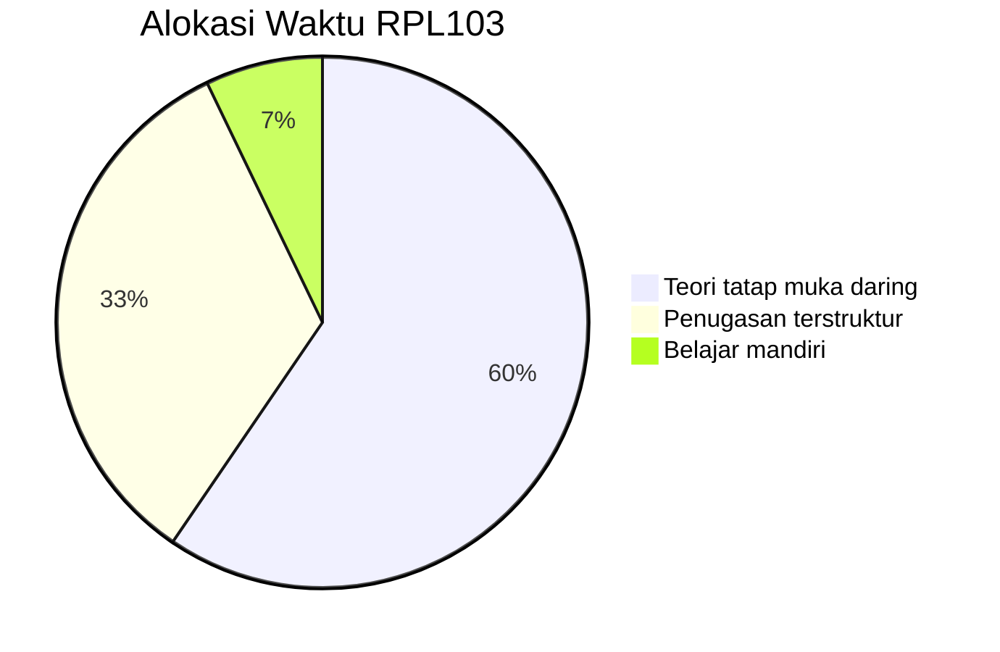

| Kategori                | Menit | Persentase |
| ----------------------- | :---: | :--------: |
| Teori tatap muka daring | 1.250 |   59,6%    |
| Penugasan terstruktur   |  700  |   33,3%    |
| Belajar mandiri         |  150  |    7,1%    |
| **Total**               | 2.100 |    100%    |

:::info[Mata kuliah ini **sepenuhnya daring** — tidak ada sesi praktikum luring.]
:::

---

## Metode Evaluasi

### Instrumen Asesmen

-   **Softskill** — keaktifan, disiplin, tanggung jawab, logis, kritis, sistematis
-   **Tugas tertulis** — soal/studi kasus daring, dikumpulkan di e-learning
-   **Hasil proyek** — penerapan matematika dalam proyek nyata
-   **Kuis** — pretest & posttest pemahaman konsep
-   **ATS** — konsep pertemuan 1–7, pilihan ganda, online
-   **AAS** — konsep pertemuan 8–14, pilihan ganda, online

### Pemetaan Asesmen per Minggu

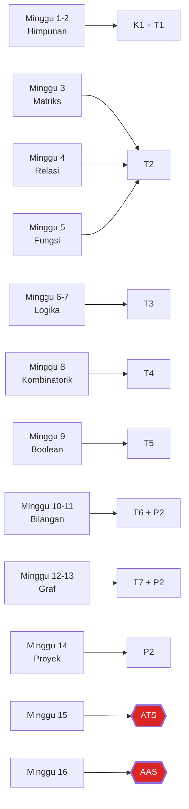

| Minggu |      CPMK      |      Sub CPMK      | Asesmen |
| :----: | :------------: | :----------------: | :-----: |
|  1–2   |   CPMK-103-1   |       TP-1-1       | K1, T1  |
|   3    |   CPMK-103-1   |       TP-1-2       |   T2    |
|   4    |   CPMK-103-1   |       TP-1-3       |   T2    |
|   5    |   CPMK-103-1   |       TP-1-4       |   T2    |
|  6–7   |   CPMK-103-2   |       TP-2-1       |   T3    |
|   8    |   CPMK-103-2   |       TP-2-2       |   T4    |
|   9    |   CPMK-103-2   |       TP-2-3       |   T5    |
| 10–11  |   CPMK-103-3   |       TP-3-1       | T6, P2  |
| 12–13  |   CPMK-103-3   |       TP-3-2       | T7, P2  |
|   14   |   CPMK-103-3   |       Semua        |   P2    |
|   15   | CPMK-1, CPMK-2 | TP-1-1 s.d. TP-2-3 | **ATS** |
|   16   | CPMK-2, CPMK-3 | TP-2-1 s.d. TP-3-2 | **AAS** |

**Keterangan:** T = Tugas · K = Kuis · P = Proyek · ATS/AAS = Asesmen Tengah/Akhir Semester.

### Komponen Penilaian

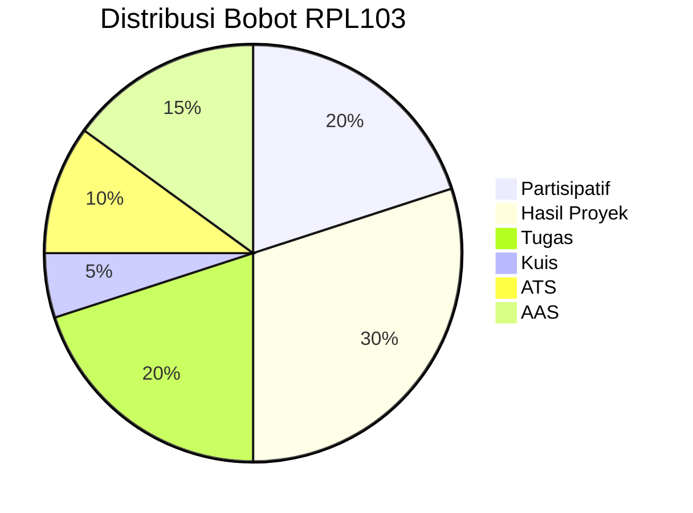

| Komponen         | Sub                                  | Bobot |
| ---------------- | ------------------------------------ | :---: |
| **Partisipatif** | Keaktifan                            |  5%   |
|                  | Disiplin                             |  5%   |
|                  | Tanggung Jawab                       |  5%   |
|                  | Keterampilan umum                    |  5%   |
| **Hasil Proyek** | Pemodelan matematis                  |  15%  |
|                  | Kebenaran perhitungan & interpretasi |  15%  |
| **Tugas**        | T1: Himpunan                         |  2%   |
|                  | T2: Matriks, Relasi, Fungsi          |  3%   |
|                  | T3: Logika Matematika                |  3%   |
|                  | T4: Kombinatorial                    |  3%   |
|                  | T5: Aljabar Boolean                  |  3%   |
|                  | T6: Teori Bilangan                   |  3%   |
|                  | T7: Teori Graf                       |  3%   |
| **Kuis**         | Kuis 1 & Kuis 2                      |  5%   |
| **ATS**          | Ujian Tengah Semester                |  10%  |
| **AAS**          | Ujian Akhir Semester                 |  15%  |

:::info[Distribusi]

-   **Proyek + Tugas = 50%** — penerapan lebih penting daripada hafal teori.
-   **ATS + AAS = 25%** — pemahaman konseptual.
-   **Partisipatif = 20%** — softskill dihargai signifikan.
-   **Kuis = 5%** — pre/post test pemahaman.

:::

### Kriteria Nilai

| Angka | Huruf | Angka | Huruf |
| :---: | :---: | :---: | :---: |
|  ≥85  |   A   | 60–64 |  C+   |
| 80–84 |  A-   | 55–59 |   C   |
| 75–79 |  B+   | 50–54 |  C-   |
| 70–74 |   B   | 45–49 |  D+   |
| 65–69 |  B-   | 40–44 |   D   |
|       |       | `<40` |   E   |

---

## Proyek Akhir

**Tujuan:** Menerapkan matematika diskrit pada masalah RPL.

**Luaran:** Laporan PDF, kode program (opsional), presentasi di pertemuan 14.

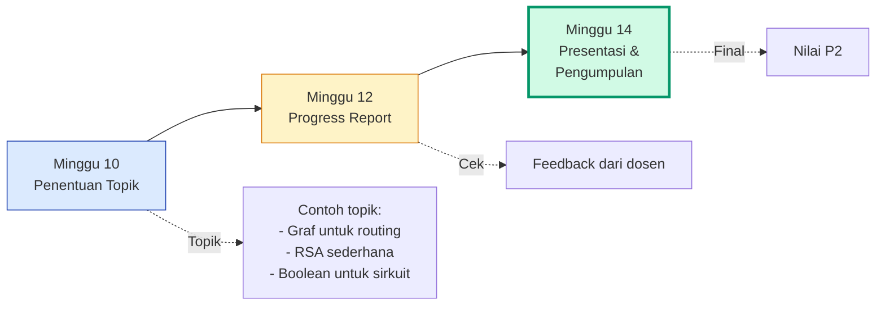

| Minggu | Aktivitas                |
| :----: | ------------------------ |
|   10   | Penentuan topik          |
|   12   | Progress report          |
|   14   | Presentasi & pengumpulan |

### Contoh Topik Proyek

| Topik                          | Konsep yang Dipakai           |
| ------------------------------ | ----------------------------- |
| **Shortest path untuk GoFood** | Graf, Dijkstra                |
| **RSA untuk chat sederhana**   | Teori bilangan, modulo, prima |
| **Karnaugh Map minimizer**     | Aljabar Boolean               |
| **Sistem rekomendasi film**    | Himpunan, relasi, fungsi      |
| **Jadwal optimal dengan graf** | Graf, Hamiltonian, pewarnaan  |

### Rubrik Penilaian

| Aspek                 | Bobot | Skor |
| --------------------- | :---: | :--: |
| Pemodelan matematis   |  15%  | 1–4  |
| Kebenaran perhitungan |  10%  | 1–4  |
| Interpretasi hasil    |  5%   | 1–4  |

---

## Rubrik Softskill

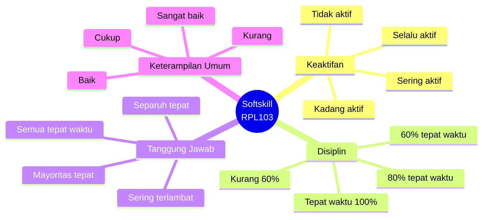

| Aspek                 | Sangat Baik (4)   | Baik (3)         | Cukup (2)        | Kurang (1)         |
| --------------------- | ----------------- | ---------------- | ---------------- | ------------------ |
| **Keaktifan**         | Selalu aktif      | Sering aktif     | Kadang aktif     | Tidak aktif        |
| **Disiplin**          | Tepat waktu 100%  | ≥80%             | ≥60%             | `<60%`             |
| **Tanggung Jawab**    | Semua tepat waktu | ≥80% tepat waktu | ≥60% tepat waktu | `<60%` tepat waktu |
| **Keterampilan Umum** | Sangat baik       | Baik             | Cukup            | Kurang             |

---

## Sarana & Prasarana

| No  | Sarana                                | Jumlah |
| :-: | ------------------------------------- | :----: |
|  1  | Learning Management System (LMS)      |   1    |
|  2  | Zoom                                  |   1    |
|  3  | Laptop                                |   1    |
|  4  | Koneksi Internet                      |   1    |
|  5  | Software matematika (Python/GeoGebra) |   1    |

### Software Pendukung

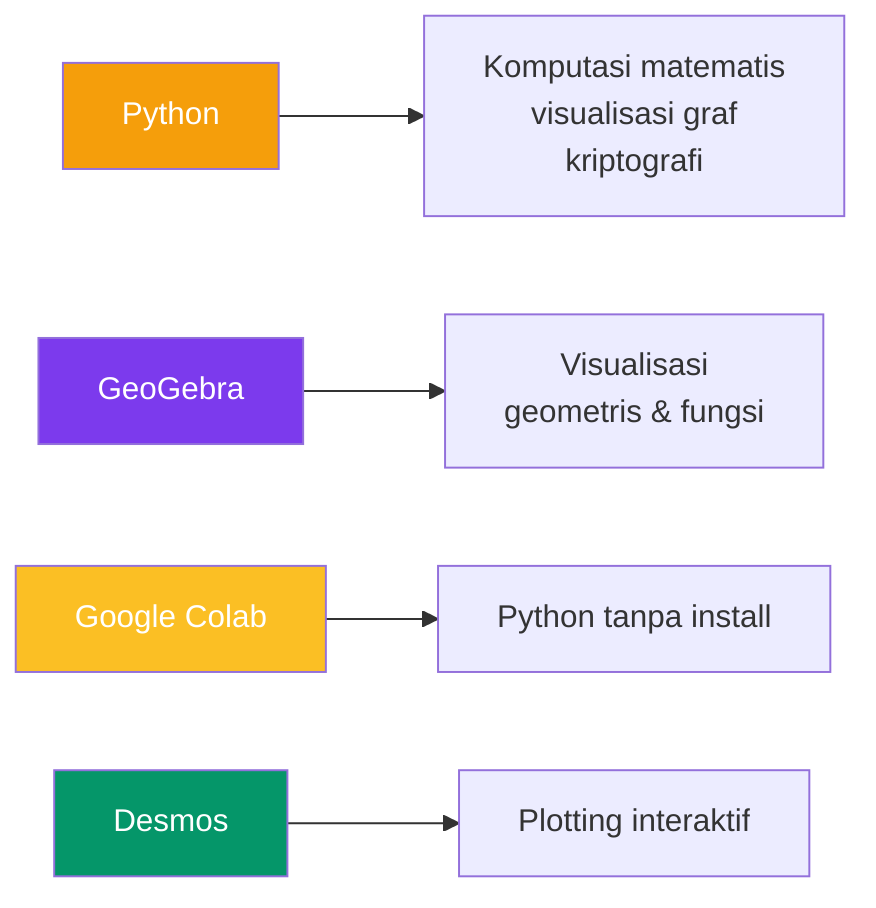

| Software                                          | Kegunaan                                                     |
| ------------------------------------------------- | ------------------------------------------------------------ |
| [Python](https://www.python.org)                  | Komputasi matematis, visualisasi graf, kriptografi sederhana |
| [GeoGebra](https://www.geogebra.org)              | Visualisasi geometris, graf, dan fungsi                      |
| [Google Colab](https://colab.research.google.com) | Menjalankan Python tanpa instalasi lokal                     |
| [Desmos](https://www.desmos.com)                  | Plotting fungsi dan grafik interaktif                        |

---

## Kesepakatan

1. Wajib ikut semua kegiatan (toleransi keterlambatan maks **15 menit**).
2. **Kamera wajib aktif** saat kuliah daring.
3. Tugas dikumpulkan via e-learning.
4. Tugas dikumpulkan sesuai batas akhir.
5. Partisipasi aktif dan berkomitmen.
6. Jaga etika moral & akademik.
7. **Penggunaan AI generatif diperbolehkan** sebagai alat bantu — wajib memahami karya yang dikumpulkan.
8. **Plagiarisme tidak ditoleransi.**

:::warning[Konsekuensi]
Pelanggaran kesepakatan → sanksi akademik sesuai peraturan Politeknik Negeri Batam. Plagiarisme → nilai E otomatis untuk komponen terkait.
:::

---

## Pustaka

### Utama

1. Munir, R. _Matematika Diskrit_. Informatika, 2012.
2. Epp, S. _Discrete Mathematics with Applications_, 4th ed. Brooks Cole, 2010.

### Pendukung

1. Lipschutz, S. & Lipson, M. _Discrete Mathematics_. McGraw-Hill, 2007.
2. Kruglak, H. dkk. _Basic Mathematics With Application to Science and Technology_. McGraw-Hill, 2009.
3. Kreyszig, E. _Advanced Engineering Mathematics_. Wiley, 1999.
4. Rosen, K. H. _Discrete Mathematics and Its Applications_. McGraw-Hill.

### Peta Pustaka

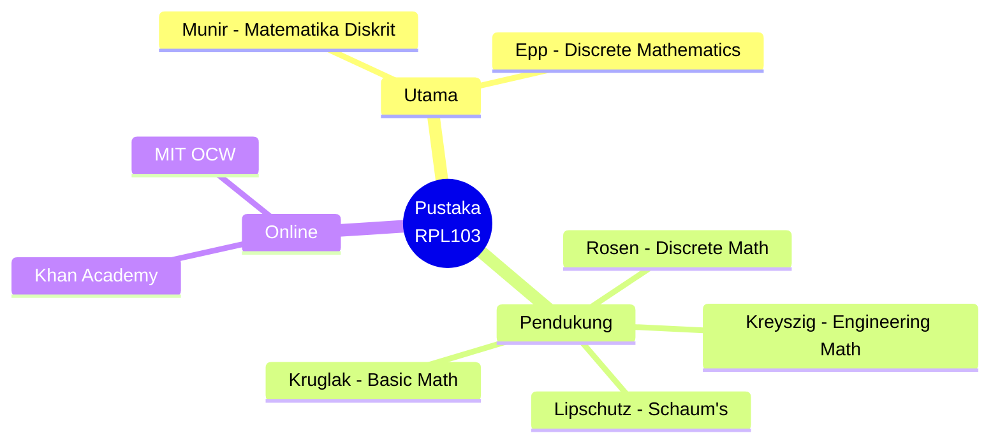

---

## Daftar Istilah

| Istilah  | Arti                                 |
| -------- | ------------------------------------ |
| AAS      | Asesmen Akhir Semester               |
| ATS      | Asesmen Tengah Semester              |
| BM       | Belajar Mandiri                      |
| CPL      | Capaian Pembelajaran Lulusan         |
| CPMK     | Capaian Pembelajaran Mata Kuliah     |
| PBL      | Problem Based Learning               |
| PI       | Performance Indicator                |
| PL       | Profil Lulusan                       |
| PT       | Penugasan Terstruktur                |
| SKS      | Satuan Kredit Semester               |
| Sub CPMK | Sub Capaian Pembelajaran Mata Kuliah |
| TP       | Tujuan Pembelajaran                  |

---

## Sumber Online

### Platform

| Sumber                  | Tautan                                        |
| ----------------------- | --------------------------------------------- |
| E-Learning IF Polibatam | [Buka →](https://learning-if.polibatam.ac.id) |
| Politeknik Negeri Batam | [Buka →](https://www.polibatam.ac.id)         |

### Bacaan Tambahan

-   **Matematika Diskrit — Rinaldi Munir** — buku klasik berbahasa Indonesia.
-   **Discrete Mathematics with Applications — Epp** — pendekatan aplikatif.
-   **Khan Academy — Discrete Math** — video gratis untuk review cepat.
-   **MIT OpenCourseWare — Mathematics for Computer Science** — kuliah lengkap gratis.

---

## Tips Praktis

:::tip[Strategi Belajar Matematika Diskrit]

-   **Latihan soal setiap minggu** — Matematika Diskrit bukan mata kuliah hafalan.
-   **Pahami konsep, bukan rumus** — rumus bisa dicari, konsep harus dipahami.
-   **Gunakan Python/GeoGebra** untuk verifikasi visual.
-   **Kerjakan soal dari buku Munir** — buku paling relevan dengan kurikulum Indonesia.
-   **Diskusi kelompok** — jelaskan konsep ke teman, itu cara terbaik belajar.
-   **Catat contoh soal & solusi** — untuk review ATS/AAS.
-   **Jangan skip pertemuan** — konsep baru sering build on top yang sebelumnya.

:::

:::warning[Jebakan Umum]

-   **Menghafal rumus tanpa paham** — akan keteteran saat soal variasi.
-   **Skip latihan** — Matematika Diskrit butuh repetition.
-   **Belajar hanya H-1 ATS** — konsepnya kumulatif.
-   **Malu bertanya** — kelas daring, banyak yang juga bingung.
-   **Tidak menyimpan catatan** — semua materi berurutan, jangan buang catatan lama.

:::

### Rekomendasi Urutan Belajar per Klaster

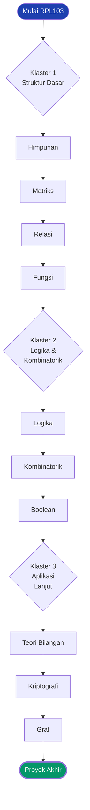

---

## Halaman Terkait

| Halaman                                             | Deskripsi                        |
| --------------------------------------------------- | -------------------------------- |
| [Mata Kuliah](/docs/v1/courses/)                    | Daftar mata kuliah semester ini. |
| [Jadwal Kuliah](/docs/v1/information/jadwal-kuliah) | Jadwal mingguan.                 |
| [Info Tim PBL](/docs/v1/information/info-team-pbl)  | Deskripsi proyek PBL.            |
| [Format Halaman Konten](/docs/format/page)          | Panduan penulisan halaman.       |
