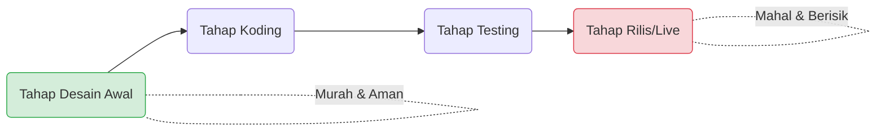

# 🚀 Minggu 1: Introduction to Requirement Engineering

::: info Mata Kuliah & Dosen

- **Mata Kuliah:** RPL104 - Analisis dan Spesifikasi Kebutuhan Perangkat Lunak
- **Pengajar:** Supardianto, M.Eng.
  :::

## Deskripsi Mata Kuliah

Matakuliah ini mengenalkan konsep dasar dalam melakukan analisis dan menentukan spesifikasi kebutuhan pada sebuah perangkat lunak. Mulai dari tahapan analisis hingga menyusunnya menjadi sebuah dokumen kebutuhan perangkat lunak (_Software Requirements Specification_).

## Capaian Pembelajaran

Setelah mengikuti pertemuan ini, mahasiswa diharapkan mampu:

- Menjelaskan dasar analisis dan rekayasa kebutuhan.
- Menjelaskan mengenai **Stakeholder** dan **Business roles**.
- Menjelaskan tipe-tipe rekayasa kebutuhan serta **Vision & Scope**.
- Menjelaskan **Elicitation** dan **Elicitation Indirect**.
- Menyajikan hasil analisis dan rekayasa kebutuhan dalam bentuk dokumentasi.

---

## 1. Apa itu Requirement Engineering?

**Requirement** adalah spesifikasi tentang apa yang harus diimplementasikan. Ini mendeskripsikan bagaimana sistem seharusnya berperilaku, properti atau atribut sistem, hingga batasan (_constraint_) pada proses pengembangan sistem.

::: tip Insight Penting
Perangkat lunak **harus** dibuat dengan mempertimbangkan tujuan dan kebutuhan pengguna (_user's goals and needs_). Kita tidak boleh membuat software hanya berdasarkan asumsi semata.
:::

### Mengapa Requirement Sangat Penting?

Semakin awal sebuah masalah dapat ditemukan dalam siklus pengembangan sistem, semakin murah biaya untuk memperbaikinya. Jika masalah ditemukan di tahap akhir (saat proyek sudah _live_), biaya perbaikan akan sangat mahal dan berisiko.

---

## 2. Masalah Umum dalam Proyek Software

Banyak proyek perangkat lunak gagal karena masalah pada tahap _requirement_. Berikut adalah masalah yang sering terjadi:

### 1. Insufficient User Involvement (Kurangnya Keterlibatan User)

Kurangnya keterlibatan pengguna akan menyebabkan mis komunikasi dalam pengembangan proyek, yang pada akhirnya menunda _timeline_ proyek.

### 2. Creeping User Requirements (Menyusupnya Kebutuhan Baru)

Klien sering kali menambah dan mengubah kebutuhan (_requirement_) bahkan setelah proses pengembangan dimulai, tanpa memahami kompleksitas dan dampak dari perubahan tersebut.

### 3. Ambiguous Requirement (Kebutuhan yang Ambigu)

Kebutuhan yang ambigu membuat setiap pihak memiliki interpretasi, pemahaman, dan ekspektasi yang berbeda. Hal ini membuat pengembang menerapkan solusi untuk masalah yang salah.

### 4. Gold Plating (Menambah Fitir Tanpa Kebutuhan)

Pengembang terkadang menambahkan fitur ekstra yang bahkan tidak diminta dalam _requirement_, dengan asumsi pengguna akan memakainya. Ini membuang-buang usaha jika fitur tersebut ternyata tidak berguna.

### 5. Minimal Specification & Inaccurate Planning

Spesifikasi yang terlalu minimum akan menyebabkan banyak perubahan kebutuhan selama proses pengembangan. Perencanaan yang tidak akurat juga menyebabkan estimasi _budget_ dan _timeline_ meleset.

### 6. Overlooked User Classes (Mengabaikan Kelompok Pengguna)

Satu produk biasanya digunakan oleh berbagai jenis pengguna. Sering kali, beberapa kelas pengguna terlupakan, sehingga kebutuhan mereka tidak terpenuhi.

---

## 3. Project vs Product Requirement

Banyak yang menyamakan kedua istilah ini, namun dalam _Requirement Engineering_, keduanya berbeda:

| Aspek                   | Penjelasan                                                                                                                                     |
| :---------------------- | :--------------------------------------------------------------------------------------------------------------------------------------------- |
| **Product Requirement** | Kebutuhan dari sistem, produk, atau software itu sendiri (fokus pada apa yang dibangun).                                                       |
| **Project Requirement** | Kebutuhan di luar produk, terkait proyeknya. Contoh: infrastruktur/server untuk development, pelatihan staf, legal, dan prosedur rilis produk. |

---

## 4. Typical Requirements Process

Ada dua pendekatan utama dalam proses rekayasa kebutuhan:

### A. Well Established Requirements Process (Contoh: Volere)

Proses requirement yang mapan dan terstruktur. Volere menggunakan teknik bahasa untuk penemuan, komunikasi, dan manajemen kebutuhan.

::: details Tantangan Proses Yang Mapan

- Waktu pengiriman/eksekusi akan terasa terlalu lama.
- Sulit untuk membuat prototipe awal.
- Kolaborasi dan bekerja bersama antar tim menjadi tantangan tersendiri.
  :::

### B. Agile Requirements Process

Proses yang lebih fleksibel dan iteratif.

::: details Tantangan Proses Agile

- Pekerjaan yang berulang (Repetitive Works).
- Pelanggan bisa saja tidak aktif/kooperatif.
- Dokumentasi yang terlalu informal (kurang detail).
  :::

---

## Ringkasan Materi

1. Perangkat lunak harus dibuat dengan mempertimbangkan tujuan dan kebutuhan pengguna. Jangan bertumpu pada asumsi.
2. _Requirement_ adalah spesifikasi yang menggambarkan bagaimana sebuah sistem seharusnya berperilaku.
3. Semakin awal masalah ditemukan, semakin murah biaya perbaikannya.
4. Terdapat dua tipe proses penemuan kebutuhan: _Well Established_ dan _Agile_.

---

## 📝 Tugas & Praktikum Minggu 1

Berikut adalah instruksi tugas praktikum berdasarkan platform E-Learning. **Penting:** Perhatikan batas waktu pengumpulan sesuai dosen pengajar masing-masing!

::: warning Format Nama File Umum
`NIM_Kelp1/2/3/4/5_Judul_InitialPengajar`
**Contoh:** `3312645325_Kelp1_Aplikasi Pengelolaan Warung_DW`
:::

### Jadwal Pengumpulan Praktikum

| Pengajar             | Tipe         | Tanggal Buka       | Tenggat (Deadline) | Catatan                                                                                    |
| :------------------- | :----------- | :----------------- | :----------------- | :----------------------------------------------------------------------------------------- |
| **DW**               | Praktikum M1 | 8 Sep 2026, 16:00  | 13 Sep 2026, 23:00 | Semua anggota wajib upload.                                                                |
| **SP**               | Praktikum M1 | 10 Sep 2026, 00:00 | 17 Sep 2026, 00:00 | -                                                                                          |
| **GL (Kls 1B Pagi)** | Praktikum M1 | 11 Sep 2026, 00:00 | 19 Sep 2026, 00:00 | Semua anggota wajib mengumpulkan. Format: `P1_Kode_PBL.pdf` (Contoh: `P1_PBL-TRPL106.pdf`) |
| **SE**               | Praktikum M1 | 7 Sep 2026, 00:00  | 13 Sep 2026, 23:00 | Format PDF. Hanya perwakilan/ketua tim yang mengumpulkan.                                  |
| **NP**               | Praktikum M1 | 10 Sep 2026, 00:00 | 17 Sep 2026, 00:00 | -                                                                                          |

::: danger Instruksi Tugas Utama (Merujuk pada Praktikum Pengajar DW)
Diskusikan judul proyek yang telah diterima. Buatlah laporan hasil diskusi dan di akhir dokumen **lampirkan foto dokumentasi diskusi bersama anggota tim**.
Waktu pengumpulan adalah 1 minggu setelah jadwal praktikum.
:::

---

## 📚 Referensi

1. Slide "Minggu 1 Introduction Requirement Engineering" (RPL104).
2. E-Learning Jurusan Teknik Informatika.
3. _Software Requirements_ (Karl Wiegers).
