# Minggu 1: Introduction to Requirement Engineering

:::info[Mata Kuliah & Dosen]

-   **Mata Kuliah:** RPL104 - Analisis dan Spesifikasi Kebutuhan Perangkat Lunak
-   **Pengajar:** Supardianto, M.Eng.

:::

## Navigasi Cepat

-   [Deskripsi Mata Kuliah](#deskripsi-mata-kuliah)
-   [Capaian Pembelajaran](#capaian-pembelajaran)
-   [1. Apa itu Requirement Engineering?](#1-apa-itu-requirement-engineering)
-   [2. Masalah Umum dalam Proyek Software](#2-masalah-umum-dalam-proyek-software)
-   [3. Project vs Product Requirement](#3-project-vs-product-requirement)
-   [4. Typical Requirements Process](#4-typical-requirements-process)
-   [Ringkasan Materi](#ringkasan-materi)
-   [Tugas & Praktikum Minggu 1](#-tugas--praktikum-minggu-1)
-   [Referensi](#-referensi)

---

## Deskripsi Mata Kuliah

Matakuliah ini mengenalkan konsep dasar dalam melakukan analisis dan menentukan spesifikasi kebutuhan pada sebuah perangkat lunak. Mulai dari tahapan analisis hingga menyusunnya menjadi sebuah dokumen kebutuhan perangkat lunak (_Software Requirements Specification_).

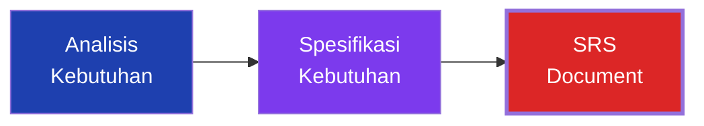

---

## Capaian Pembelajaran

Setelah mengikuti pertemuan ini, mahasiswa diharapkan mampu:

-   Menjelaskan dasar analisis dan rekayasa kebutuhan.
-   Menjelaskan mengenai **Stakeholder** dan **Business roles**.
-   Menjelaskan tipe-tipe rekayasa kebutuhan serta **Vision & Scope**.
-   Menjelaskan **Elicitation** dan **Elicitation Indirect**.
-   Menyajikan hasil analisis dan rekayasa kebutuhan dalam bentuk dokumentasi.

### Peta Kompetensi

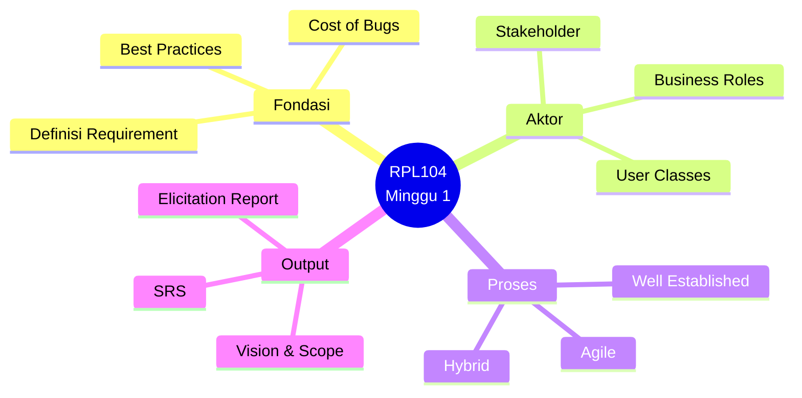

---

## 1. Apa itu Requirement Engineering?

**Requirement** adalah spesifikasi tentang apa yang harus diimplementasikan. Ini mendeskripsikan bagaimana sistem seharusnya berperilaku, properti atau atribut sistem, hingga batasan (_constraint_) pada proses pengembangan sistem.

### Definisi Formal

| Aspek           | Penjelasan                                                          |
| --------------- | ------------------------------------------------------------------- |
| **Behavior**    | Bagaimana sistem seharusnya berperilaku (fungsi, respon, workflow). |
| **Properties**  | Atribut sistem seperti performa, keamanan, usability.               |
| **Constraints** | Batasan proses pengembangan (waktu, budget, teknologi, regulasi).   |

:::tip[Insight Penting]
Perangkat lunak **harus** dibuat dengan mempertimbangkan tujuan dan kebutuhan pengguna (_user's goals and needs_). Kita tidak boleh membuat software hanya berdasarkan asumsi semata.
:::

### Mengapa Requirement Sangat Penting?

Semakin awal sebuah masalah dapat ditemukan dalam siklus pengembangan sistem, semakin murah biaya untuk memperbaikinya. Jika masalah ditemukan di tahap akhir (saat proyek sudah _live_), biaya perbaikan akan sangat mahal dan berisiko.

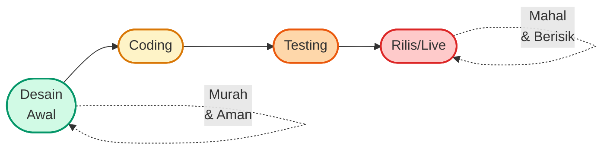

### Kurva Biaya Perbaikan Bug (Boehm)

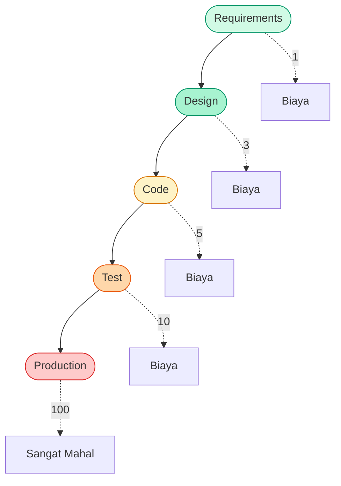

**Data empiris:** Bug yang ditemukan di tahap production **100×** lebih mahal untuk diperbaiki dibanding bug yang ditemukan di tahap requirements.

### Contoh Nyata Kegagalan Requirement

| Proyek              | Tahun | Masalah                                       | Kerugian        |
| ------------------- | ----- | --------------------------------------------- | --------------- |
| **Taurus Software** | 1993  | Requirement tidak diverifikasi dengan baik    | £3.5 juta       |
| **Ariane 5 Rocket** | 1996  | Reuse requirement tanpa analisis konteks baru | $370 juta       |
| **Denver Airport**  | 1994  | Requirement baggage system salah              | $560 juta delay |
| **Healthcare.gov**  | 2013  | Requirement scaling tidak diprediksi          | Ratusan juta    |

---

## 2. Masalah Umum dalam Proyek Software

Banyak proyek perangkat lunak gagal karena masalah pada tahap _requirement_. Berikut adalah masalah yang sering terjadi:

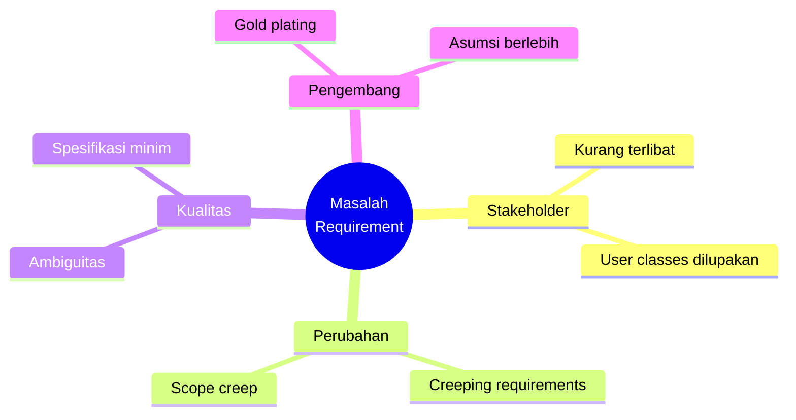

### 1. Insufficient User Involvement (Kurangnya Keterlibatan User)

Kurangnya keterlibatan pengguna akan menyebabkan mis komunikasi dalam pengembangan proyek, yang pada akhirnya menunda _timeline_ proyek.

**Gejala:**

-   Stakeholder hanya dihubungi di awal & akhir proyek.
-   Tidak ada demo/sprint review rutin.
-   Feedback user tidak terstruktur.

**Dampak:** Fitur yang dibangun tidak sesuai kebutuhan → rework besar → timeline mundur.

### 2. Creeping User Requirements (Menyusupnya Kebutuhan Baru)

Klien sering kali menambah dan mengubah kebutuhan (_requirement_) bahkan setelah proses pengembangan dimulai, tanpa memahami kompleksitas dan dampak dari perubahan tersebut.

**Gejala:**

-   "Sekalian tambah ini dong, gampang kan?"
-   Scope project terus membengkak tanpa penyesuaian waktu/biaya.
-   Tidak ada change control process.

**Dampak:** Rework terus-menerus, deadline meleset, tim burnout.

### 3. Ambiguous Requirement (Kebutuhan yang Ambigu)

Kebutuhan yang ambigu membuat setiap pihak memiliki interpretasi, pemahaman, dan ekspektasi yang berbeda. Hal ini membuat pengembang menerapkan solusi untuk masalah yang salah.

**Contoh:**

| Kalimat              | Interpretasi Developer | Interpretasi User               |
| -------------------- | ---------------------- | ------------------------------- |
| "Sistem harus cepat" | Response < 100ms       | Bisa dibuka sebelum ngopi habis |
| "UI harus modern"    | Dark mode + gradient   | Bersih, minimalis, ada search   |
| "Data harus aman"    | HTTPS + bcrypt         | Backup harian + audit log       |

**Solusi:** Requirement harus **measurable** dan **testable**.

### 4. Gold Plating (Menambah Fitur Tanpa Kebutuhan)

Pengembang terkadang menambahkan fitur ekstra yang bahkan tidak diminta dalam _requirement_, dengan asumsi pengguna akan memakainya. Ini membuang-buang usaha jika fitur tersebut ternyata tidak berguna.

**Gejala:**

-   "Kayaknya keren kalau ada fitur X..."
-   Fitur kompleks tanpa request dari user.
-   Scope membengkak karena inisiatif developer sendiri.

**Dampak:** Waktu & biaya terbuang, sistem jadi kompleks tanpa alasan, sulit di-maintain.

### 5. Minimal Specification & Inaccurate Planning

Spesifikasi yang terlalu minimum akan menyebabkan banyak perubahan kebutuhan selama proses pengembangan. Perencanaan yang tidak akurat juga menyebabkan estimasi _budget_ dan _timeline_ meleset.

**Gejala:**

-   Dokumen requirement cuma 1 halaman.
-   Tidak ada non-functional requirements.
-   Estimasi "kira-kira" tanpa breakdown.

### 6. Overlooked User Classes (Mengabaikan Kelompok Pengguna)

Satu produk biasanya digunakan oleh berbagai jenis pengguna. Sering kali, beberapa kelas pengguna terlupakan, sehingga kebutuhan mereka tidak terpenuhi.

**Contoh User Classes:**

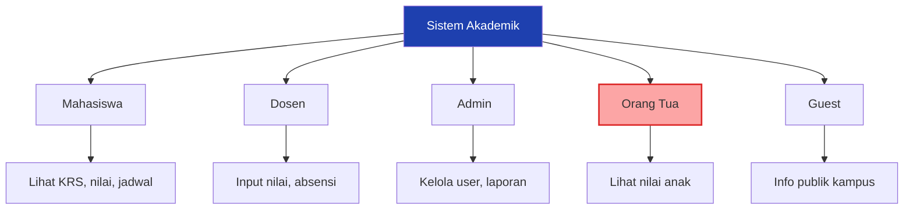

Kalau **orang tua** tidak dimasukkan sebagai user class → fitur view nilai anak tidak ada → stakeholder kecewa.

---

## 3. Project vs Product Requirement

Banyak yang menyamakan kedua istilah ini, namun dalam _Requirement Engineering_, keduanya berbeda:

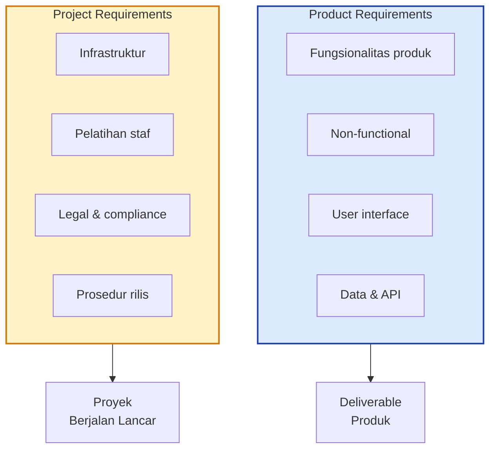

| Aspek                   | Penjelasan                                                                                                                                     |
| :---------------------- | :--------------------------------------------------------------------------------------------------------------------------------------------- |
| **Product Requirement** | Kebutuhan dari sistem, produk, atau software itu sendiri (fokus pada apa yang dibangun).                                                       |
| **Project Requirement** | Kebutuhan di luar produk, terkait proyeknya. Contoh: infrastruktur/server untuk development, pelatihan staf, legal, dan prosedur rilis produk. |

### Contoh Konkret

| Product Requirement              | Project Requirement                         |
| -------------------------------- | ------------------------------------------- |
| "User bisa login dengan Google." | "Server production harus di AWS region SG." |
| "Report bisa di-export PDF."     | "Tim wajib lulus training security Q1."     |
| "Aplikasi support mobile."       | "Legal review untuk GDPR compliance."       |

---

## 4. Typical Requirements Process

Ada dua pendekatan utama dalam proses rekayasa kebutuhan:

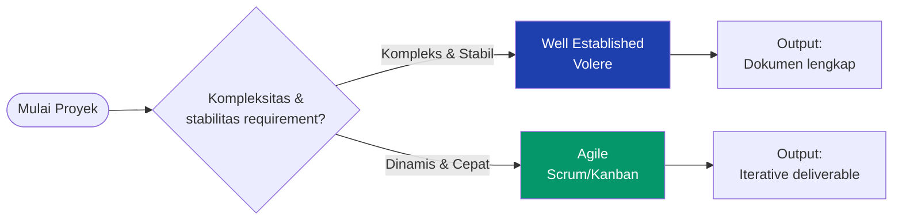

### A. Well Established Requirements Process (Contoh: Volere)

Proses requirement yang mapan dan terstruktur. Volere menggunakan teknik bahasa untuk penemuan, komunikasi, dan manajemen kebutuhan.

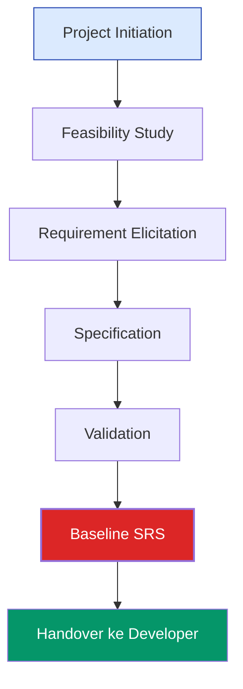

Tantangan Proses Yang Mapan

-   Waktu pengiriman/eksekusi akan terasa terlalu lama.
-   Sulit untuk membuat prototipe awal.
-   Kolaborasi dan bekerja bersama antar tim menjadi tantangan tersendiri.
-   Requirement sering berubah di tengah jalan, tapi prosesnya kaku.

### B. Agile Requirements Process

Proses yang lebih fleksibel dan iteratif.

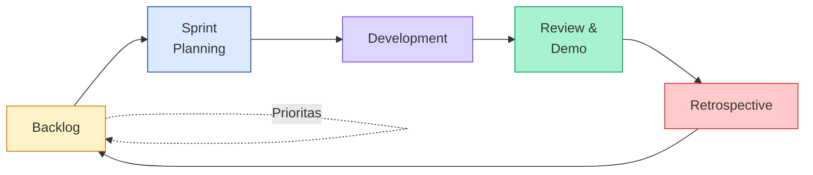

Tantangan Proses Agile

-   Pekerjaan yang berulang (_Repetitive Works_).
-   Pelanggan bisa saja tidak aktif/kooperatif.
-   Dokumentasi yang terlalu informal (kurang detail).
-   Sulit untuk audit & compliance di industri regulated.

### Perbandingan

| Aspek                 | Well Established (Volere)   | Agile                          |
| --------------------- | --------------------------- | ------------------------------ |
| **Fokus**             | Dokumentasi lengkap di awal | Deliverable inkremental        |
| **Perubahan**         | Sulit & mahal               | Mudah & natural                |
| **Keterlibatan user** | Tinggi di awal              | Kontinu setiap sprint          |
| **Timeline**          | Panjang & terprediksi       | Iteratif & adaptif             |
| **Cocok untuk**       | Regulated, safety-critical  | Startup, web, mobile           |
| **Risiko utama**      | Requirement usang           | Scope creep, dokumentasi minim |

---

## Ringkasan Materi

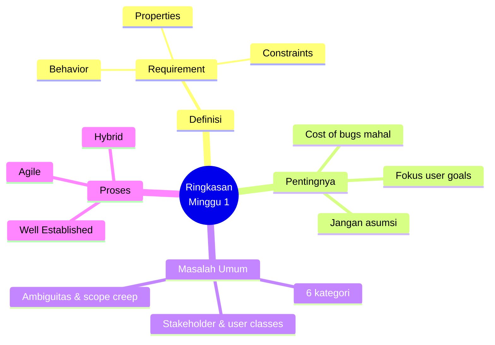

1. Perangkat lunak harus dibuat dengan mempertimbangkan tujuan dan kebutuhan pengguna. Jangan bertumpu pada asumsi.
2. _Requirement_ adalah spesifikasi yang menggambarkan bagaimana sebuah sistem seharusnya berperilaku.
3. Semakin awal masalah ditemukan, semakin murah biaya perbaikannya.
4. Terdapat dua tipe proses penemuan kebutuhan: _Well Established_ dan _Agile_.

---

## Tugas & Praktikum Minggu 1

Berikut adalah instruksi tugas praktikum berdasarkan platform E-Learning. **Penting:** Perhatikan batas waktu pengumpulan sesuai dosen pengajar masing-masing!

:::warning[Format Nama File Umum]
`NIM_Kelp1/2/3/4/5_Judul_InitialPengajar`

**Contoh:** `3312645325_Kelp1_Aplikasi Pengelolaan Warung_DW`
:::

### Jadwal Pengumpulan Praktikum

| Pengajar             | Tipe         | Tanggal Buka       | Tenggat (Deadline) | Catatan                                                                                    |
| :------------------- | :----------- | :----------------- | :----------------- | :----------------------------------------------------------------------------------------- |
| **DW**               | Praktikum M1 | 8 Sep 2026, 16:00  | 13 Sep 2026, 23:00 | Semua anggota wajib upload.                                                                |
| **SP**               | Praktikum M1 | 10 Sep 2026, 00:00 | 17 Sep 2026, 00:00 | -                                                                                          |
| **GL (Kls 1B Pagi)** | Praktikum M1 | 11 Sep 2026, 00:00 | 19 Sep 2026, 00:00 | Semua anggota wajib mengumpulkan. Format: `P1_Kode_PBL.pdf` (Contoh: `P1_PBL-TRPL106.pdf`) |
| **SE**               | Praktikum M1 | 7 Sep 2026, 00:00  | 13 Sep 2026, 23:00 | Format PDF. Hanya perwakilan/ketua tim yang mengumpulkan.                                  |
| **NP**               | Praktikum M1 | 10 Sep 2026, 00:00 | 17 Sep 2026, 00:00 | -                                                                                          |

### Timeline Pengumpulan

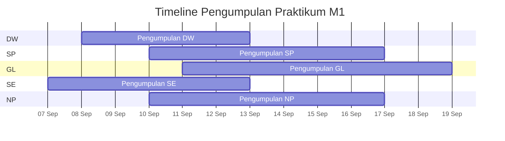

:::danger[Instruksi Tugas Utama (Merujuk pada Praktikum Pengajar DW)]
Diskusikan judul proyek yang telah diterima. Buatlah laporan hasil diskusi dan di akhir dokumen **lampirkan foto dokumentasi diskusi bersama anggota tim**.

Waktu pengumpulan adalah 1 minggu setelah jadwal praktikum.
:::

### Checklist Sebelum Submit

-   [ ] Judul proyek sudah disepakati tim
-   [ ] Semua anggota tim hadir dalam diskusi
-   [ ] Foto dokumentasi diskusi sudah diambil
-   [ ] Laporan ditulis dengan format yang diminta
-   [ ] Nama file mengikuti format `NIM_KelpX_Judul_InitialPengajar`
-   [ ] File di-upload sesuai deadline pengajar

### Tips Mengerjakan

:::tip[Strategi Praktikum Minggu 1]

-   **Tentukan ketua tim** di diskusi pertama.
-   **Tentukan peran** (backend, frontend, database, dokumentasi).
-   **Diskusikan scope** project secara jelas — jangan langsung ke teknis.
-   **Dokumentasikan** setiap keputusan (kapan, siapa, apa).
-   **Upload cepat** — jangan tunggu deadline mepet.

:::

---

## Referensi

1. Slide "Minggu 1 Introduction Requirement Engineering" (RPL104).
2. E-Learning Jurusan Teknik Informatika.
3. _Software Requirements_ (Karl Wiegers).

### Bacaan Tambahan

| Sumber                                       | Fokus                               |
| -------------------------------------------- | ----------------------------------- |
| **Wiegers & Beatty — Software Requirements** | Buku utama mata kuliah ini          |
| **IIBA BABOK Guide**                         | Business Analysis Body of Knowledge |
| **Sommerville — Software Engineering**       | Bab Requirements Engineering        |
| **ISO/IEC/IEEE 29148**                       | Standar SRS modern                  |
| **Volere Requirements Template**             | Template & process reference        |

---

## Halaman Terkait

| Halaman                                                                     | Deskripsi                           |
| --------------------------------------------------------------------------- | ----------------------------------- |
| [Overview RPL104](/docs/v1/courses/rpl104-analisis-kebutuhan-pl/)           | Halaman utama mata kuliah.          |
| [Pertemuan 2 — Stakeholder](/docs/v1/courses/rpl104-analisis-kebutuhan-pl/) | Materi berikutnya — _segera hadir_. |
| [Format Halaman Konten](/docs/format/page)                                  | Panduan penulisan halaman.          |
