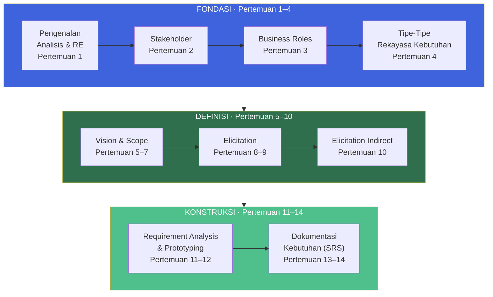
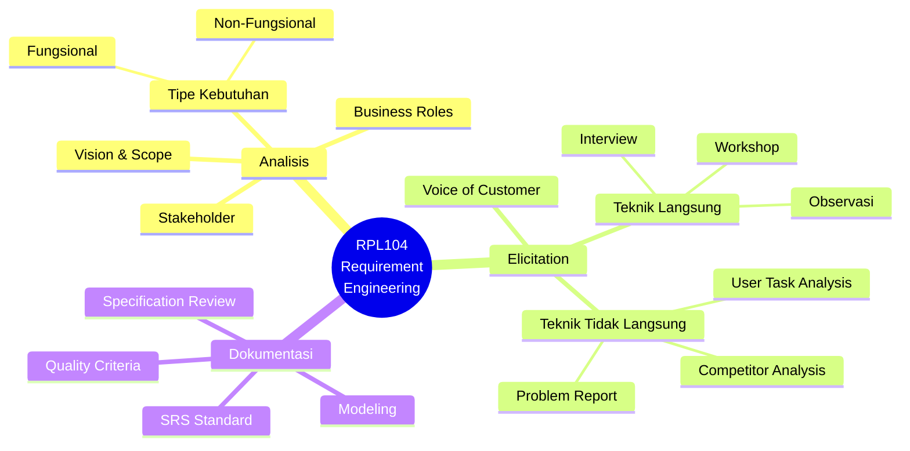
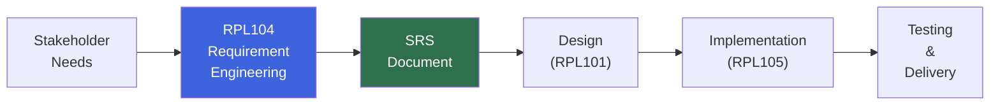
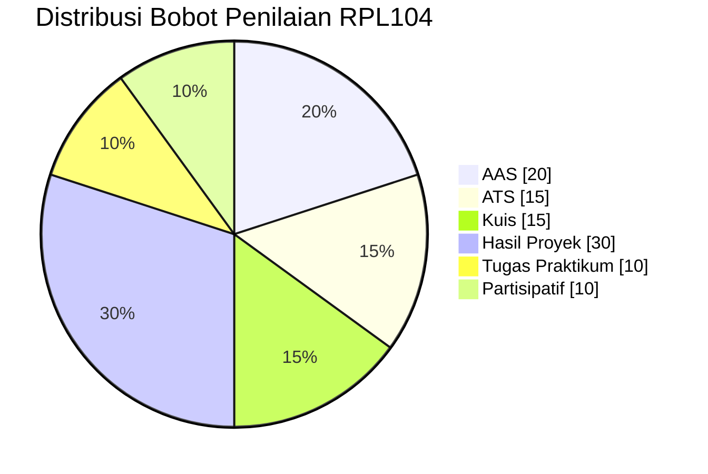
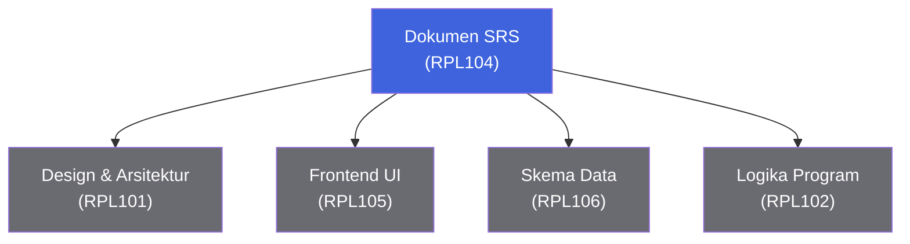

::: tip Halaman Resmi E-Learning
Seluruh materi, penugasan, dan aktivitas mata kuliah ini terpusat di e-learning Jurusan Teknik Informatika Politeknik Negeri Batam.

[**Buka E-Learning IF Polibatam →**](https://learning-if.polibatam.ac.id)
:::

## Peta Mata Kuliah

RPL104 membawa kamu melalui **perjalanan lengkap rekayasa kebutuhan** — dari memahami peran analyst, menemukan stakeholder, menggali kebutuhan, hingga menuangkannya ke dalam dokumen SRS yang siap dieksekusi.

**Benang merah:** Tiga fase ini memetakan langsung ke siklus **Requirements Engineering** — dari **mengumpulkan** (Fondasi & Definisi) hingga **menuangkan** (Konstruksi). Setiap fase menghasilkan artefak nyata yang berkontribusi ke dokumen SRS akhir.

## Informasi Umum

| **Kode** | **SKS** |   **Semester**   | **Status** |
| :------: | :-----: | :--------------: | :--------: |
|  RPL104  |    3    | Ganjil 2026/2027 |   Wajib    |

| Bidang                    | Keterangan                                         |
| ------------------------- | -------------------------------------------------- |
| **Nama Mata Kuliah**      | Analisis dan Spesifikasi Kebutuhan Perangkat Lunak |
| **Mata Kuliah Prasyarat** | Tidak ada                                          |
| **Program Studi**         | Teknologi Rekayasa Perangkat Lunak (D4)            |
| **Dosen Pengampu**        | Supardianto                                        |
| **Email**                 | supardianto@polibatam.ac.id                        |

### Deskripsi Mata Kuliah

Mata kuliah ini memperkenalkan konsep dasar dalam melakukan **analisis** dan menentukan **spesifikasi kebutuhan** pada sebuah perangkat lunak. Mahasiswa akan mempelajari tahapan analisis dan menyusunnya menjadi sebuah **dokumen kebutuhan perangkat lunak** yang lengkap dan terstruktur. Pelaksanaan pembelajaran menggunakan metode _Project-Based Learning_ (PBL) dengan framework CDIO, di mana proyek ini merupakan salah satu _cornerstone project_ untuk membangun kemampuan merancang aplikasi.

::: info Cara Membaca Halaman Ini
Halaman ini disusun sebagai **satu perjalanan 14 pertemuan**. Setiap pertemuan berkontribusi langsung ke dokumen SRS yang akan kamu serahkan di akhir semester. Gunakan outline di kanan untuk melompat ke bagian tertentu, atau baca dari atas ke bawah.
:::

## Tujuan Pembelajaran

Setelah mengikuti mata kuliah ini, mahasiswa diharapkan mampu:

| No. | Tujuan Pembelajaran <Badge type="tip" text="8 TP" />                           |
| :-: | ------------------------------------------------------------------------------ |
|  1  | **Menjelaskan dasar** analisis dan rekayasa kebutuhan.                         |
|  2  | **Menjelaskan** mengenai _Stakeholder_.                                        |
|  3  | **Menjelaskan** mengenai _Business Roles_.                                     |
|  4  | **Menjelaskan tipe-tipe** rekayasa kebutuhan.                                  |
|  5  | **Menjelaskan** mengenai _Vision & Scope_.                                     |
|  6  | **Menjelaskan** mengenai _Elicitation_ dan _Elicitation Indirect_.             |
|  7  | **Menyajikan hasil analisis** dari rekayasa kebutuhan.                         |
|  8  | **Menyajikan hasil analisis dan rekayasa kebutuhan** dalam bentuk dokumentasi. |

### Kompetensi Inti yang Dibangun

## Rencana Pembelajaran

### Timeline 14 Pertemuan

```mermaid
gantt
    title Timeline RPL104 — 14 Pertemuan
    dateFormat X
    axisFormat %s

    section Fondasi
    Pengenalan Analisis & RE         :a1, 0, 1
    Stakeholder                      :a2, 1, 1
    Business Roles                   :a3, 2, 1
    Tipe-Tipe Rekayasa Kebutuhan     :a4, 3, 1

    section Definisi
    Vision & Scope                   :b1, 4, 3
    Elicitation                      :b2, 7, 2
    Elicitation Indirect             :b3, 9, 1

    section Konstruksi
    Requirement Analysis & Prototyping :c1, 10, 2
    Dokumentasi Kebutuhan (SRS)      :crit, c2, 12, 2
```

### Materi Pembelajaran

| Pertemuan | Topik Utama                              | Sub Topik                                                                                                                                                                        |
| :-------: | ---------------------------------------- | -------------------------------------------------------------------------------------------------------------------------------------------------------------------------------- |
|     1     | Pengenalan Analisis & Rekayasa Kebutuhan | RPS, skenario PBL semester, pendahuluan, _What is Requirement Engineering?_, _Common Problem in a Project_, _Product vs Project_, terminology, karakteristik kebutuhan yang baik |
|     2     | Stakeholder                              | Pengenalan client, _Understanding Stakeholder_, _Common Problem in Client-Developer Relationship_, aktivitas rekayasa kebutuhan                                                  |
|     3     | Business Roles                           | Requirement Analyst Role, tanggung jawab analyst, _Essential Analyst Skills_, _Good Requirement Analyst_, _Who can be the Analyst?_                                              |
|     4     | Tipe-Tipe Rekayasa Kebutuhan             | User classes, _Sources of Requirements_, _Finding User Representative_, _The Product Champion_, _Functional & Non-Functional Requirements_                                       |
|    5–7    | Vision & Scope                           | _Introduction_, _Defining Product Vision & Scope_, _Conflicting Business Requirements_, _Vision & Scope Document Template_, _Keeping Scope in Focus_                             |
|    8–9    | Elicitation                              | _Introduction Elicitation_, _Elicitation Technique_, _Elicitation Workshop_, _Classifying the Voice of Customer_                                                                 |
|    10     | Elicitation Indirect                     | _User Task Analysis_, _Problem Report & Enhancement Request_, _Current Product & Competitor_                                                                                     |
|   11–12   | Requirement Analysis & Prototyping       | _Problem Recognition_, _Evaluation and Synthesis_, _Focus is on What Not How_, _Modeling_, _Specification Review_                                                                |
|   13–14   | Dokumentasi Kebutuhan                    | _Problem Recognition_, _Documentation Standard_, _Quality Criteria_, _Modeling_, _Specification Review_                                                                          |

### Detail Per Pertemuan

::: details Pertemuan 1 — Pengenalan Analisis & Rekayasa Kebutuhan

**Tujuan:** Mahasiswa memahami dasar-dasar analisis dan rekayasa kebutuhan, serta konteks proyek PBL semester ini.

**Sub Pokok Bahasan:**

- RPS dan kontrak perkuliahan
- Skenario PBL semester
- Pendahuluan
- _What is Requirement Engineering?_
- _Common Problem in a Project_
- _Product vs Project_
- Terminologi dasar
- Karakteristik kebutuhan yang baik
  :::

::: details Pertemuan 2 — Stakeholder

**Tujuan:** Mahasiswa mampu mengidentifikasi dan memahami peran stakeholder dalam proyek perangkat lunak.

**Sub Pokok Bahasan:**

- Pengenalan client
- _Understanding Stakeholder_
- _Common Problem in Client-Developer Relationship_
- Aktivitas rekayasa kebutuhan
  :::

::: details Pertemuan 3 — Business Roles

**Tujuan:** Mahasiswa memahami peran dan tanggung jawab seorang Requirements Analyst.

**Sub Pokok Bahasan:**

- Requirement Analyst Role
- Tanggung jawab analyst
- _Essential Analyst Skills_
- _Good Requirement Analyst_
- _Who can be the Analyst?_
  :::

::: details Pertemuan 4 — Tipe-Tipe Rekayasa Kebutuhan

**Tujuan:** Mahasiswa mampu membedakan jenis-jenis kebutuhan dan sumber-sumbernya.

**Sub Pokok Bahasan:**

- User classes
- _Sources of Requirements_
- _Finding User Representative_
- _The Product Champion_
- _Functional & Non-Functional Requirements_
  :::

::: details Pertemuan 5–7 — Vision & Scope

**Tujuan:** Mahasiswa mampu menyusun dokumen Vision & Scope sebagai fondasi proyek.

**Sub Pokok Bahasan:**

- _Introduction_
- _Defining Product Vision & Scope_
- _Conflicting Business Requirements_
- _Vision & Scope Document Template_
- _Keeping Scope in Focus_
  :::

::: details Pertemuan 8–9 — Elicitation

**Tujuan:** Mahasiswa mampu menggunakan teknik-teknik elicitation untuk menggali kebutuhan dari stakeholder.

**Sub Pokok Bahasan:**

- _Introduction Elicitation_
- _Elicitation Technique_
- _Elicitation Workshop_
- _Classifying the Voice of Customer_
  :::

::: details Pertemuan 10 — Elicitation Indirect

**Tujuan:** Mahasiswa mampu menggali kebutuhan melalui sumber tidak langsung.

**Sub Pokok Bahasan:**

- _User Task Analysis_
- _Problem Report & Enhancement Request_
- _Current Product & Competitor_
  :::

::: details Pertemuan 11–12 — Requirement Analysis & Prototyping

**Tujuan:** Mahasiswa mampu menganalisis kebutuhan dan menerjemahkannya menjadi model/prototipe.

**Sub Pokok Bahasan:**

- _Problem Recognition_
- _Evaluation and Synthesis_
- _Focus is on What Not How_
- _Modeling_
- _Specification Review_
  :::

::: details Pertemuan 13–14 — Dokumentasi Kebutuhan

**Tujuan:** Mahasiswa mampu menyusun dokumen SRS (Software Requirements Specification) yang lengkap dan terstruktur.

**Sub Pokok Bahasan:**

- _Problem Recognition_
- _Documentation Standard_
- _Quality Criteria_
- _Modeling_
- _Specification Review_
  :::

## Proyek Pengembangan Perangkat Lunak (PBL)

Mata kuliah ini dijalankan dengan metode **Project-Based Learning** menggunakan framework **CDIO**. Proyek yang dikerjakan mahasiswa pada semester 1 (Ganjil) merupakan salah satu _cornerstone project_ untuk membangun kemampuan merancang aplikasi yang terkoneksi dengan basis data, serta kerjasama tim, kolaborasi, komunikasi, dan refleksi.

### Kontribusi RPL104 terhadap PBL

**Posisi RPL104 dalam siklus proyek:** Mata kuliah ini adalah **jembatan pertama** antara kebutuhan stakeholder (yang bersifat kualitatif dan ambigu) dengan dokumen teknis (yang bersifat terukur dan terstruktur). Tanpa SRS yang baik, tahap design dan implementation akan berjalan tanpa arah.

### Luaran Proyek

| Luaran                     | Deskripsi                                                             |
| -------------------------- | --------------------------------------------------------------------- |
| **Dokumen Vision & Scope** | Fondasi proyek — visi produk, ruang lingkup, dan batasan.             |
| **Dokumen Elicitation**    | Hasil penggalian kebutuhan dari stakeholder.                          |
| **Analisis Kebutuhan**     | Hasil evaluasi dan sintesis kebutuhan menjadi model yang terstruktur. |
| **Dokumen SRS**            | Software Requirements Specification lengkap dan siap pakai.           |
| **Presentasi Progres**     | Dipresentasikan di ATS dan AAS, dengan tanya jawab lisan.             |

::: warning Perhatian
Presentasi progres dinilai berdasarkan **kejelasan analisis**, **kedalaman elicitation**, dan **kelengkapan dokumentasi**. Pastikan setiap tahap terdokumentasi dengan rapi sejak awal — jangan menunda sampai akhir semester.
:::

## Metode Evaluasi

### Komponen Penilaian Utama

| Komponen                                                          | Bobot |
| ----------------------------------------------------------------- | :---: |
| Softskills (Learning Skills, Life Skills, Literacy Skills)        |  30%  |
| Praktikum & Pengerjaan Proyek (14× pertemuan)                     |  20%  |
| Presentasi (tengah semester & akhir semester)                     |  10%  |
| Laporan Akhir PBL                                                 |  20%  |
| ATS & AAS (ujian lisan presentasi progres + tanya jawab + daring) |  20%  |

### Rincian Bobot Penilaian

| Komponen            | Sub-Komponen                          | Persentase | Visual               |
| ------------------- | ------------------------------------- | :--------: | -------------------- |
| **Partisipatif**    | Teamwork/kolaborasi                   |     5%     | `█░░░░░░░░░░░░░░░░░` |
| **Partisipatif**    | Kontribusi/keaktifan                  |     5%     | `█░░░░░░░░░░░░░░░░░` |
| **Hasil Proyek**    | Penulisan Laporan                     |    10%     | `██░░░░░░░░░░░░░░░░` |
| **Hasil Proyek**    | Kelengkapan isi dokumen SRS           |    10%     | `██░░░░░░░░░░░░░░░░` |
| **Hasil Proyek**    | Ketepatan analisis kebutuhan & produk |    10%     | `██░░░░░░░░░░░░░░░░` |
| **Tugas Praktikum** | Tugas Praktikum                       |    10%     | `██░░░░░░░░░░░░░░░░` |
| **Kuis**            | Kuis 1, 2, 3                          |    15%     | `███░░░░░░░░░░░░░░░` |
| **ATS**             | Asesmen Tengah Semester               |    15%     | `███░░░░░░░░░░░░░░░` |
| **AAS**             | Asesmen Akhir Semester                |    20%     | `████░░░░░░░░░░░░░░` |

::: info Distribusi Nilai

- **AAS menyumbang 20%** — tertinggi di antara asesmen individual, mencerminkan pentingnya penguasaan materi akhir (dokumentasi SRS).
- **Hasil Proyek = 30%** — menunjukkan bahwa proyek PBL adalah inti dari mata kuliah ini.
- **ATS + AAS = 35%** — penilaian berbasis presentasi progres dan tanya jawab lisan, bukan sekadar ujian tulis.
- **Softskills + Partisipatif = 40%** — kolaborasi tim sangat dihargai.
  :::

### Karakteristik Asesmen

::: details ATS — Asesmen Tengah Semester
**Bentuk:** Ujian lisan presentasi progres + tanya jawab + daring

**Fokus materi:** Konsep pertemuan 1–7, yaitu fondasi analisis dan rekayasa kebutuhan (pengenalan, stakeholder, business roles, tipe kebutuhan, dan vision & scope).

**Kriteria utama:**

- Kejelasan presentasi progres proyek
- Kemampuan menjawab pertanyaan penguji
- Kualitas dokumen Vision & Scope yang dihasilkan
  :::

::: details AAS — Asesmen Akhir Semester
**Bentuk:** Ujian lisan presentasi progres + tanya jawab + daring

**Fokus materi:** Konsep pertemuan 8–14, termasuk elicitation, requirement analysis, dan dokumentasi kebutuhan.

**Kriteria utama:**

- Kelengkapan dokumen SRS
- Ketepatan analisis kebutuhan
- Kualitas presentasi akhir proyek
  :::

### Kriteria Penilaian

| Nilai Angka | Nilai Huruf |
| :---------: | :---------: |
|    ≥ 85     |      A      |
|   80 – 84   |     A-      |
|   75 – 79   |     B+      |
|   70 – 74   |      B      |
|   65 – 69   |     B-      |
|   60 – 64   |     C+      |
|   55 – 59   |      C      |
|   50 – 54   |     C-      |
|   45 – 49   |     D+      |
|   40 – 44   |      D      |
|    < 40     |      E      |

## Sarana & Prasarana Praktikum

| No. | Nama Sarana/Prasarana/Perangkat | Jumlah (Unit) |
| :-: | ------------------------------- | :-----------: |
|  1  | PC Instruktur                   |       1       |
|  2  | Meja dan Kursi                  |      30       |

## Kesepakatan Pelaksanaan Perkuliahan

Pelaksanaan perkuliahan RPL104 mengacu pada kesepakatan berikut:

1. Mahasiswa wajib mengikuti seluruh kegiatan perkuliahan sesuai jadwal dengan **toleransi keterlambatan maksimal 15 menit**.
2. Seluruh penugasan dikumpulkan melalui e-learning IF Polibatam di [https://learning-if.polibatam.ac.id](https://learning-if.polibatam.ac.id).
3. Mahasiswa wajib mematuhi kesepakatan pelaksanaan perkuliahan yang telah ditetapkan.
4. Mahasiswa wajib menjaga etika moral dan etika akademik baik di dalam maupun di luar perkuliahan.

::: tip Penggunaan AI Generatif
Penggunaan AI generatif sebagai alat bantu belajar **diperbolehkan** untuk mata kuliah ini — misalnya untuk brainstorming kebutuhan, menyusun kerangka SRS, atau mencari referensi. Namun, mahasiswa **wajib memahami dan dapat menjelaskan** setiap bagian dokumen yang dikumpulkan.

Dokumen SRS yang baik mencerminkan **pemahaman mendalam** tentang masalah dan solusi, bukan sekadar hasil generate.
:::

## Pustaka

| No. | Referensi                                                                      |
| :-: | ------------------------------------------------------------------------------ |
|  1  | Wiegers, K. E., & Beatty, J. (2013). _Software Requirements_. Microsoft Press. |

### Bacaan Pendukung

| Sumber                                                     | Deskripsi                                                                    |
| ---------------------------------------------------------- | ---------------------------------------------------------------------------- |
| **IIBA BABOK Guide**                                       | Panduan standar Business Analysis — relevan untuk memperdalam peran analyst. |
| **IEEE 830 / ISO/IEC/IEEE 29148**                          | Standar internasional untuk Software Requirements Specification (SRS).       |
| **Requirements Engineering — Sommerville & Sawyer**        | Buku klasik yang membahas RE secara komprehensif.                            |
| **Karl Wiegers — Software Requirements (Microsoft Press)** | Sumber utama mata kuliah ini.                                                |

## Informasi Tambahan

Pelaksanaan mata kuliah ini menggunakan metode **Project-Based Learning** dengan implementasi framework **CDIO** — kurikulum berbasis proses pengembangan produk yang menekankan pengembangan softskill dan hardskill. Proyek yang dikerjakan mahasiswa pada semester 1 (Ganjil) merupakan salah satu _cornerstone project_ untuk membangun kemampuan merancang aplikasi yang terkoneksi dengan basis data, serta kerjasama tim, kolaborasi, komunikasi, dan refleksi.

Kontribusi mata kuliah ini utamanya adalah dalam **perancangan, implementasi, dan dokumentasi lingkungan pengembangan aplikasi** untuk proyek perangkat lunak.

### Kontribusi RPL104 terhadap Proyek Lintas Mata Kuliah

**Tanpa SRS yang baik, seluruh mata kuliah lain dalam proyek PBL kehilangan arah.** Dokumen ini adalah acuan tunggal yang dipakai oleh tim frontend, backend, dan basis data untuk membangun produk akhir.

## Sumber Referensi Online

### Platform Utama

| Sumber                  | Tautan                                        |
| ----------------------- | --------------------------------------------- |
| E-Learning IF Polibatam | [Buka →](https://learning-if.polibatam.ac.id) |
| Politeknik Negeri Batam | [Buka →](https://www.polibatam.ac.id)         |

### Standar & Panduan SRS

| Sumber                        | Tautan                                                                         |
| ----------------------------- | ------------------------------------------------------------------------------ |
| **IEEE 830** (SRS Guidelines) | Referensi standar klasik untuk penyusunan Software Requirements Specification. |
| **ISO/IEC/IEEE 29148**        | Standar modern pengganti IEEE 830, mencakup RE dan SRS.                        |
| **IIBA BABOK Guide**          | Panduan Business Analysis Body of Knowledge.                                   |

### Sumber Belajar Tambahan

| Sumber                                                           | Deskripsi                                                              |
| ---------------------------------------------------------------- | ---------------------------------------------------------------------- |
| **Karl Wiegers — Software Requirements (Microsoft Press, 2013)** | Buku utama mata kuliah ini.                                            |
| **Sommerville & Sawyer — Requirements Engineering**              | Buku klasik untuk memperdalam RE.                                      |
| **Coursera — Software Requirements Prioritization**              | Kursus daring untuk memperdalam teknik elicitation dan prioritization. |

::: info Tentang Halaman Ini
Halaman ini disusun berdasarkan Rencana Pembelajaran Semester (RPS) RPL104 Analisis dan Spesifikasi Kebutuhan Perangkat Lunak dan konten e-learning Jurusan Teknik Informatika Politeknik Negeri Batam untuk Semester Ganjil 2026/2027. Informasi dapat berubah sewaktu-waktu mengikuti perkembangan perkuliahan.
:::

::: tip Butuh Update Cepat?
Jika ada perubahan jadwal, materi, atau informasi evaluasi, edit file `docs/v1/courses/rpl104-analisis-kebutuhan-pl/index.md` dan commit. Jangan biarkan informasi basi menumpuk.
:::
