# RPL104 — Analisis & Spesifikasi Kebutuhan PL

**Kode:** RPL104 · **SKS:** 3 · **Semester:** Ganjil 2026/2027 · **Status:** Wajib
**Dosen:** Supardianto
**Email:** supardianto@polibatam.ac.id

> **Tagline:** Menjembatani keinginan stakeholder dengan dokumen kebutuhan terstruktur — dari elicitation hingga SRS siap pakai.

:::tip[E-Learning]
[**Buka E-Learning →**](https://learning-if.polibatam.ac.id)
:::

## Navigasi Cepat

-   [Peta Mata Kuliah](#peta-mata-kuliah)
-   [Informasi Umum](#informasi-umum)
-   [Tujuan Pembelajaran](#tujuan-pembelajaran)
-   [Rencana Pembelajaran](#rencana-pembelajaran)
-   [Proyek PBL](#proyek-pbl)
-   [Metode Evaluasi](#metode-evaluasi)
-   [Sarana Praktikum](#sarana-praktikum)
-   [Kesepakatan](#kesepakatan)
-   [Pustaka](#pustaka)
-   [Sumber Online](#sumber-online)

---

## Peta Mata Kuliah

RPL104 membawa kamu melalui **perjalanan lengkap rekayasa kebutuhan** — dari memahami peran analyst, menggali kebutuhan, hingga menuangkannya ke dokumen SRS.

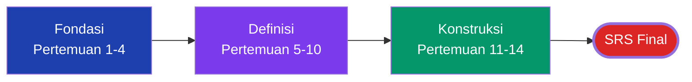

| Fase           | Pertemuan | Fokus                                                   |
| -------------- | :-------: | ------------------------------------------------------- |
| **Fondasi**    |    1–4    | Analisis & RE, stakeholder, business roles, tipe RE     |
| **Definisi**   |   5–10    | Vision & scope, elicitation (langsung & tidak langsung) |
| **Konstruksi** |   11–14   | Requirement analysis, prototyping, dokumentasi SRS      |

**Benang merah:** Mengumpulkan (Fondasi & Definisi) → Menuangkan (Konstruksi). Setiap fase menghasilkan artefak untuk SRS akhir.

### Kenapa RPL104 Krusial?

RPL104 adalah **pintu masuk** proyek PBL. Semua mata kuliah lain bergantung pada output di sini.

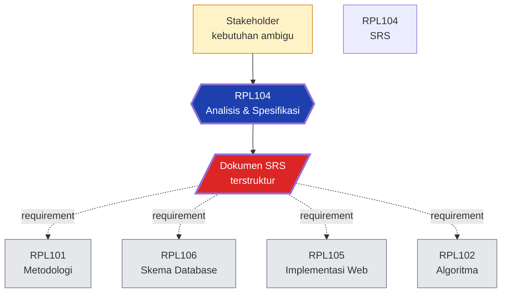

**Tanpa SRS, tidak ada yang bisa dimulai.** Dokumen ini adalah acuan tunggal untuk semua tim.

---

## Informasi Umum

|  Kode  | SKS |     Semester     | Status |
| :----: | :-: | :--------------: | :----: |
| RPL104 |  3  | Ganjil 2026/2027 | Wajib  |

| Bidang        | Keterangan                                         |
| ------------- | -------------------------------------------------- |
| **Nama**      | Analisis dan Spesifikasi Kebutuhan Perangkat Lunak |
| **Prasyarat** | Tidak ada                                          |
| **Dosen**     | Supardianto                                        |
| **Email**     | supardianto@polibatam.ac.id                        |

### Deskripsi

Memperkenalkan konsep analisis dan spesifikasi kebutuhan perangkat lunak. Mahasiswa mempelajari tahapan analisis dan menyusunnya menjadi **dokumen kebutuhan** lengkap dan terstruktur. Menggunakan **PBL** dengan framework CDIO sebagai _cornerstone project_.

---

## Tujuan Pembelajaran

| No. | Tujuan                                             |
| :-: | -------------------------------------------------- |
|  1  | Menjelaskan dasar analisis & rekayasa kebutuhan    |
|  2  | Menjelaskan _stakeholder_                          |
|  3  | Menjelaskan _business roles_                       |
|  4  | Menjelaskan tipe-tipe rekayasa kebutuhan           |
|  5  | Menjelaskan _vision & scope_                       |
|  6  | Menjelaskan _elicitation_ & _elicitation indirect_ |
|  7  | Menyajikan hasil analisis rekayasa kebutuhan       |
|  8  | Menyajikan hasil analisis dalam bentuk dokumentasi |

### Kompetensi yang Dibangun

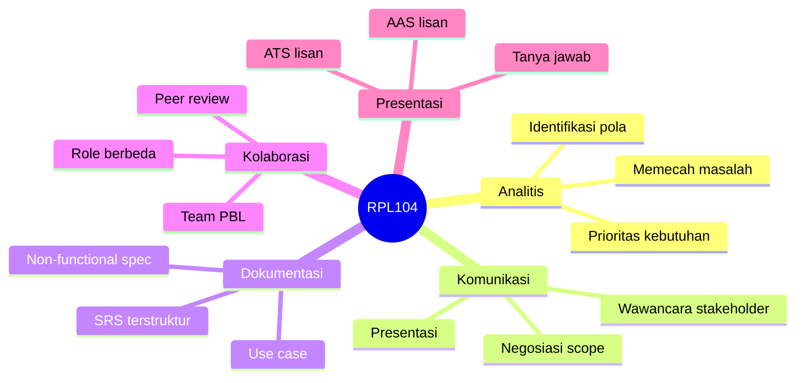

| Kompetensi      | Deskripsi                                                 |
| --------------- | --------------------------------------------------------- |
| **Analitis**    | Memecah masalah kompleks jadi kebutuhan terukur.          |
| **Komunikasi**  | Berinteraksi dengan stakeholder dari berbagai latar.      |
| **Dokumentasi** | Menulis SRS yang jelas, konsisten, dan bisa diverifikasi. |
| **Kolaborasi**  | Bekerja dalam tim PBL dengan peran berbeda.               |
| **Presentasi**  | Mempertahankan keputusan analisis di depan dosen & peer.  |

---

## Rencana Pembelajaran

### Timeline 14 Pertemuan

```mermaid
gantt
    title Timeline RPL104 — 14 Pertemuan
    dateFormat X
    axisFormat %s

    section Fondasi
    Pengenalan RE         :f1, 0, 1
    Stakeholder           :f2, 1, 1
    Business Roles        :f3, 2, 1
    Tipe RE               :f4, 3, 1

    section Definisi
    Vision & Scope        :d1, 4, 3
    Elicitation           :d2, 7, 2
    Elicitation Indirect  :d3, 9, 1

    section Konstruksi
    Req Analysis          :k1, 10, 2
    SRS Documentation     :k2, 12, 2
```

|      Fase      | Pertemuan | Materi                                   |
| :------------: | :-------: | ---------------------------------------- |
|  **Fondasi**   |     1     | Pengenalan Analisis & Rekayasa Kebutuhan |
|                |     2     | Stakeholder                              |
|                |     3     | Business Roles                           |
|                |     4     | Tipe-Tipe Rekayasa Kebutuhan             |
|  **Definisi**  |    5–7    | Vision & Scope                           |
|                |    8–9    | Elicitation                              |
|                |    10     | Elicitation Indirect                     |
| **Konstruksi** |   11–12   | Requirement Analysis & Prototyping       |
|                |   13–14   | Dokumentasi Kebutuhan (SRS)              |

### Detail Per Pertemuan

| Pertemuan | Topik                              | Sub Topik                                                                 |
| :-------: | ---------------------------------- | ------------------------------------------------------------------------- |
|     1     | Pengenalan Analisis & RE           | RPS, skenario PBL, definisi RE, terminology, karakteristik kebutuhan baik |
|     2     | Stakeholder                        | Client, understanding stakeholder, common problem, aktivitas RE           |
|     3     | Business Roles                     | Peran analyst, tanggung jawab, essential skills, good analyst             |
|     4     | Tipe-Tipe RE                       | User classes, sources, product champion, functional & non-functional      |
|    5–7    | Vision & Scope                     | Definisi, conflicting business, template, keeping scope in focus          |
|    8–9    | Elicitation                        | Technique, workshop, classifying voice of customer                        |
|    10     | Elicitation Indirect               | User task analysis, problem report, current product & competitor          |
|   11–12   | Requirement Analysis & Prototyping | Problem recognition, evaluation, synthesis, modeling, review              |
|   13–14   | Dokumentasi Kebutuhan              | Documentation standard, quality criteria, modeling, review                |

### Alur Elicitation → SRS

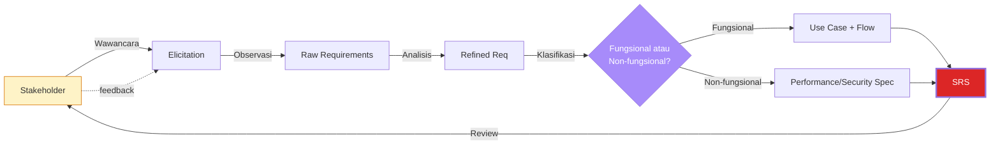

### Ringkasan Per Fase

| Fase           | Pertemuan | Fokus Utama                       | Artefak Hasil                     |
| -------------- | :-------: | --------------------------------- | --------------------------------- |
| **Fondasi**    |    1–4    | Pahami peran, stakeholder, RE     | Catatan analisis awal             |
| **Definisi**   |   5–10    | Gali kebutuhan, tetapkan scope    | Vision & Scope, hasil elicitation |
| **Konstruksi** |   11–14   | Analisis final, susun dokumentasi | **SRS lengkap**                   |

---

## Proyek PBL

**Metode:** Project-Based Learning dengan framework CDIO. Proyek semester 1 = _cornerstone project_.

**Kontribusi:** **Jembatan pertama** antara kebutuhan stakeholder (kualitatif & ambigu) dengan dokumen teknis (terukur & terstruktur).

### Posisi RPL104 dalam Rantai PBL

RPL104 adalah **input** untuk hampir semua mata kuliah lain dalam proyek:

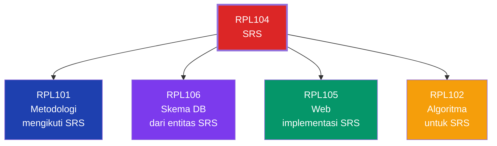

| Mata Kuliah | Ketergantungan ke RPL104                      |
| ----------- | --------------------------------------------- |
| **RPL101**  | Metodologi pengembangan mengikuti SRS.        |
| **RPL106**  | Skema database dibangun dari entitas di SRS.  |
| **RPL105**  | Semua fitur web diimplementasikan sesuai SRS. |
| **RPL102**  | Algoritma dirancang untuk kebutuhan SRS.      |

### Luaran Proyek

| Luaran                 | Deskripsi                                     |
| ---------------------- | --------------------------------------------- |
| Dokumen Vision & Scope | Fondasi proyek — visi, ruang lingkup, batasan |
| Dokumen Elicitation    | Hasil penggalian kebutuhan                    |
| Analisis Kebutuhan     | Evaluasi & sintesis menjadi model terstruktur |
| **Dokumen SRS**        | Software Requirements Specification lengkap   |
| Presentasi Progres     | ATS & AAS dengan tanya jawab lisan            |

:::warning[Perhatian]
Presentasi dinilai berdasarkan **kejelasan analisis**, **kedalaman elicitation**, dan **kelengkapan dokumentasi**. Dokumentasikan sejak awal — jangan menunda sampai akhir semester.
:::

### Struktur SRS yang Diharapkan

SRS yang baik biasanya mengikuti struktur **IEEE 830**:

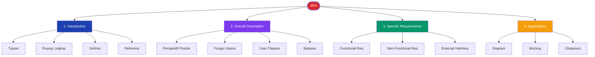

| Bagian SRS                   | Isi                                              |
| ---------------------------- | ------------------------------------------------ |
| **1. Introduction**          | Tujuan, ruang lingkup, definisi, referensi       |
| **2. Overall Description**   | Perspektif produk, fungsi, user classes, batasan |
| **3. Specific Requirements** | Functional, non-functional, external interface   |
| **4. Appendices**            | Diagram, mockup, glosarium                       |

### Checklist Luaran Minimum

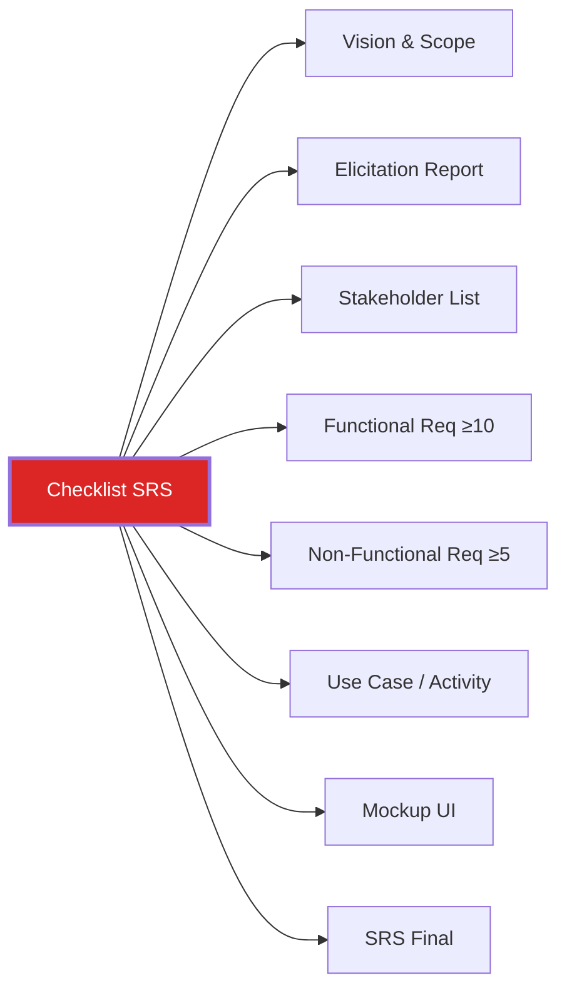

-   [ ] Dokumen Vision & Scope final
-   [ ] Laporan hasil elicitation (wawancara/observasi/workshop)
-   [ ] Daftar stakeholder beserta peran
-   [ ] Daftar functional requirements (minimal 10)
-   [ ] Daftar non-functional requirements (minimal 5)
-   [ ] Diagram use case atau activity
-   [ ] Mockup UI dasar
-   [ ] SRS final (mengikuti template yang ditetapkan dosen)

---

## Metode Evaluasi

### Komponen Penilaian

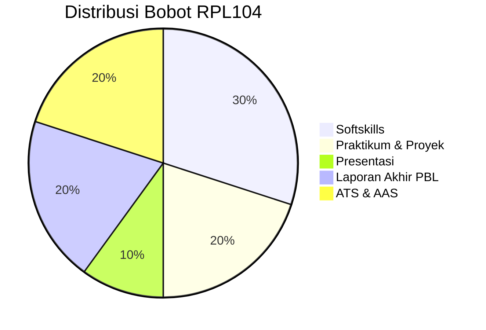

| Komponen                                     | Bobot |
| -------------------------------------------- | :---: |
| Softskills (Learning, Life, Literacy Skills) |  30%  |
| Praktikum & Pengerjaan Proyek (14×)          |  20%  |
| Presentasi (tengah & akhir semester)         |  10%  |
| Laporan Akhir PBL                            |  20%  |
| ATS & AAS (lisan + tanya jawab + daring)     |  20%  |

### Rincian Bobot

| Komponen        | Sub                                   | Bobot |
| --------------- | ------------------------------------- | :---: |
| Partisipatif    | Teamwork/kolaborasi                   |  5%   |
| Partisipatif    | Kontribusi/keaktifan                  |  5%   |
| Hasil Proyek    | Penulisan laporan                     |  10%  |
| Hasil Proyek    | Kelengkapan isi dokumen SRS           |  10%  |
| Hasil Proyek    | Ketepatan analisis kebutuhan & produk |  10%  |
| Tugas Praktikum | Tugas praktikum                       |  10%  |
| Kuis            | Kuis 1, 2, 3                          |  15%  |
| ATS             | Asesmen Tengah Semester               |  15%  |
| AAS             | Asesmen Akhir Semester                |  20%  |

:::info[Distribusi]

-   **AAS 20%** — asesmen individual tertinggi, mencerminkan pentingnya dokumentasi SRS.
-   **Hasil Proyek 30%** — PBL adalah inti mata kuliah.
-   **ATS + AAS = 35%** — berbasis presentasi & tanya jawab, bukan ujian tulis.
-   **Softskills + Partisipatif = 40%** — kolaborasi tim sangat dihargai.

:::

### Bentuk Asesmen

ATS — Asesmen Tengah Semester

**Bentuk:** Ujian lisan presentasi progres + tanya jawab + daring.

**Fokus:** Konsep pertemuan 1–7 (fondasi analisis & RE: pengenalan, stakeholder, business roles, tipe kebutuhan, vision & scope).

**Kriteria:**

-   Kejelasan presentasi
-   Kemampuan menjawab pertanyaan
-   Kualitas dokumen Vision & Scope

AAS — Asesmen Akhir Semester

**Bentuk:** Ujian lisan presentasi progres + tanya jawab + daring.

**Fokus:** Konsep pertemuan 8–14 (elicitation, requirement analysis, dokumentasi kebutuhan).

**Kriteria:**

-   Kelengkapan SRS
-   Ketepatan analisis kebutuhan
-   Kualitas presentasi akhir

### Kriteria Nilai

| Angka | Huruf | Angka | Huruf |
| :---: | :---: | :---: | :---: |
|  ≥85  |   A   | 60–64 |  C+   |
| 80–84 |  A-   | 55–59 |   C   |
| 75–79 |  B+   | 50–54 |  C-   |
| 70–74 |   B   | 45–49 |  D+   |
| 65–69 |  B-   | 40–44 |   D   |
|       |       | `<40` |   E   |

:::danger[Kebijakan Umum]
Beberapa mata kuliah di TRPL menerapkan kebijakan: **nilai 0 pada komponen apapun = nilai akhir E**. Cek kebijakan dosen pengampu di pertemuan pertama.
:::

---

## Sarana Praktikum

| No. | Sarana         | Jumlah |
| :-: | -------------- | :----: |
|  1  | PC Instruktur  |   1    |
|  2  | Meja dan Kursi |   30   |

### Tools yang Direkomendasikan

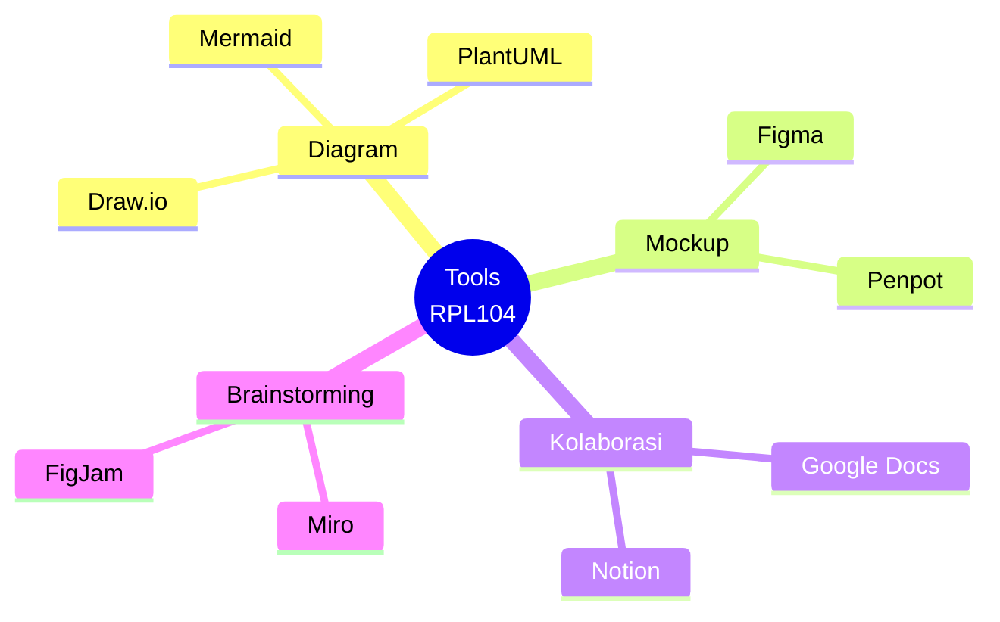

| Tool                  | Fungsi                            |
| --------------------- | --------------------------------- |
| **Draw.io**           | Diagram (use case, activity, dll) |
| **Figma / Penpot**    | Mockup UI                         |
| **Google Docs**       | Kolaborasi penulisan SRS          |
| **Miro / FigJam**     | Brainstorming & mind mapping      |
| **Notion / Obsidian** | Catatan pribadi & knowledge base  |

---

## Kesepakatan

1. Wajib ikut semua kegiatan (toleransi keterlambatan maks **15 menit**).
2. Tugas dikumpulkan via e-learning.
3. Patuhi kesepakatan pelaksanaan.
4. Jaga etika moral & akademik.

:::tip[Penggunaan AI Generatif]
**Diperbolehkan** sebagai alat bantu — brainstorming kebutuhan, kerangka SRS, referensi. Namun **wajib memahami dan dapat menjelaskan** setiap bagian dokumen yang dikumpulkan. SRS yang baik mencerminkan pemahaman mendalam, bukan sekadar hasil generate.
:::

:::warning[Plagiarisme]
Menyalin SRS tim lain (baik dari kelas yang sama maupun angkatan sebelumnya) adalah **pelanggaran akademik**. SRS adalah karya analisis tim kamu sendiri — konteks proyek berbeda meskipun mata kuliah sama.
:::

---

## Pustaka

| No. | Referensi                                                                   |
| :-: | --------------------------------------------------------------------------- |
|  1  | Wiegers, K. E. & Beatty, J. _Software Requirements_. Microsoft Press, 2013. |

### Bacaan Pendukung

-   **IIBA BABOK Guide** — standar Business Analysis.
-   **IEEE 830 / ISO/IEC/IEEE 29148** — standar internasional SRS.
-   **Sommerville & Sawyer — Requirements Engineering** — buku klasik RE.

### Standar Internasional

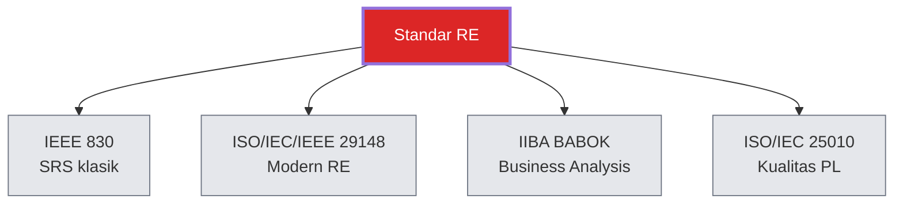

| Standar                | Fokus                                         |
| ---------------------- | --------------------------------------------- |
| **IEEE 830**           | Guidelines penulisan SRS (klasik, deprecated) |
| **ISO/IEC/IEEE 29148** | Standar modern RE & SRS (pengganti IEEE 830)  |
| **IIBA BABOK**         | Business Analysis Body of Knowledge           |
| **ISO/IEC 25010**      | Kualitas produk perangkat lunak               |

---

## Info Tambahan

Menggunakan **PBL** dengan framework **CDIO**. Proyek semester 1 = _cornerstone project_. Kontribusi utama: perancangan, implementasi, dan dokumentasi lingkungan pengembangan aplikasi.

### Peran RPL104 dalam CDIO

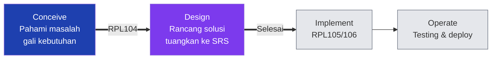

**CDIO** = **C**onceive, **D**esign, **I**mplement, **O**perate.

| Fase CDIO     | Kontribusi RPL104                         |
| ------------- | ----------------------------------------- |
| **Conceive**  | Memahami masalah, menggali kebutuhan      |
| **Design**    | Merancang solusi, menuangkan ke SRS       |
| **Implement** | (Tidak langsung — RPL104 selesai di sini) |
| **Operate**   | (Tidak langsung — dijalankan RPL105/106)  |

RPL104 adalah **fase Conceive & Design** dari proyek PBL. Semua eksekusi dimulai dari sini.

---

## Sumber Online

| Sumber                  | Tautan                                        |
| ----------------------- | --------------------------------------------- |
| E-Learning IF Polibatam | [Buka →](https://learning-if.polibatam.ac.id) |
| Politeknik Negeri Batam | [Buka →](https://www.polibatam.ac.id)         |

### Standar & Panduan

-   **IEEE 830** — SRS Guidelines (klasik)
-   **ISO/IEC/IEEE 29148** — standar modern RE & SRS
-   **IIBA BABOK Guide** — Business Analysis Body of Knowledge

### Bacaan Tambahan

-   **Karl Wiegers — Software Requirements** — buku utama mata kuliah ini.
-   **Sommerville & Sawyer — Requirements Engineering** — untuk memperdalam RE.
-   **Coursera — Software Requirements Prioritization** — kursus daring elicitation & prioritization.

---

## Tips Praktis

:::tip[Strategi Belajar RPL104]

-   **Dokumentasikan sejak pertemuan 1** — jangan menumpuk di akhir.
-   **Elicitation lebih penting dari penulisan** — SRS bagus dimulai dari data bagus.
-   **Validasi ke stakeholder** — jangan asumsi; tanya dan konfirmasi.
-   **Gunakan template** — IEEE 830 atau template dosen; konsistensi kunci.
-   **Iterasi** — SRS akan berkali-kali direvisi; itu normal.
-   **Simpan versi** — Google Docs history atau Git untuk lacak perubahan.
-   **Baca ulang sebagai developer** — apakah requirement-nya bisa diimplementasikan?

:::

:::warning[Jebakan Umum]

-   **Requirement ambigu** — "sistem harus cepat" bukan requirement yang baik.
-   **Mencampur functional & non-functional** — pisahkan dengan jelas.
-   **Terlalu teknis** — SRS bukan desain, jangan masuk ke detail implementasi.
-   **Melewatkan stakeholder kunci** — akan muncul di testing, terlambat.
-   **Copy SRS template dari internet** — konteks proyek berbeda, isi akan salah.
-   **Menyimpan hanya di laptop satu orang** — selalu pakai cloud/Git.

:::

### Contoh Requirement yang Baik vs Buruk

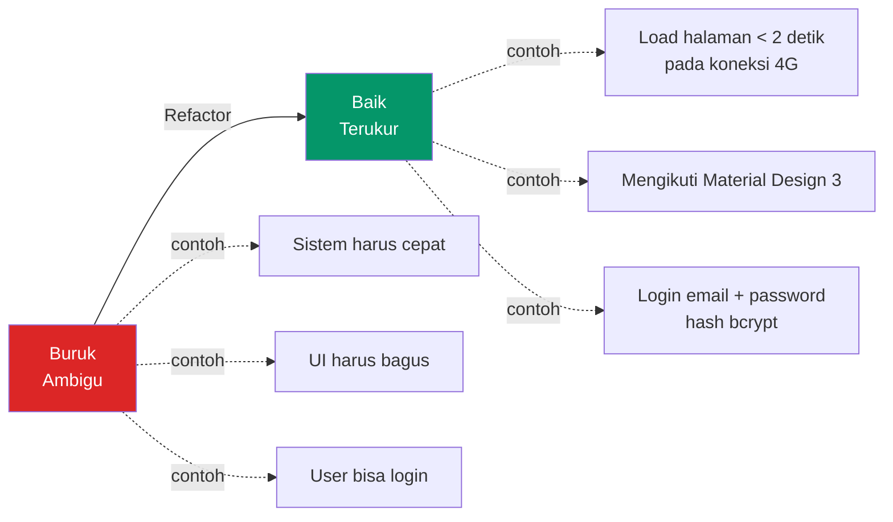

| Buruk                 | Baik                                                                 |
| --------------------- | -------------------------------------------------------------------- |
| "Sistem harus cepat." | "Halaman produk harus dimuat dalam `< 2 detik` pada koneksi 4G."     |
| "UI harus bagus."     | "UI harus mengikuti panduan desain Material Design 3."               |
| "User bisa login."    | "User dapat login dengan email + password; password di-hash bcrypt." |
| "Data harus aman."    | "Data pribadi dienkripsi AES-256 saat transit dan at-rest."          |

Requirement yang baik: **spesifik, terukur, dapat diverifikasi, tidak ambigu**.

### Kualitas Requirement — Checklist

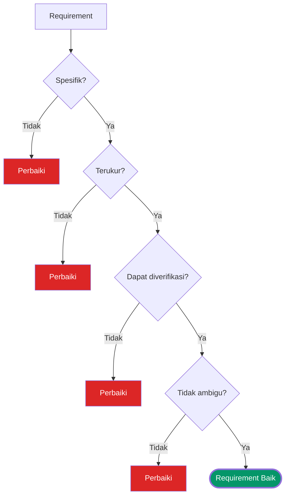

---

## Halaman Terkait

| Halaman                                             | Deskripsi                        |
| --------------------------------------------------- | -------------------------------- |
| [Mata Kuliah](/docs/v1/courses/)                    | Daftar mata kuliah semester ini. |
| [Info Tim PBL](/docs/v1/information/info-team-pbl)  | Deskripsi proyek PBL.            |
| [Tugas](/docs/v1/task/)                             | Daftar tugas.                    |
| [Jadwal Kuliah](/docs/v1/information/jadwal-kuliah) | Jadwal mingguan.                 |
| [Format Halaman Konten](/docs/format/page)          | Panduan penulisan halaman.       |
