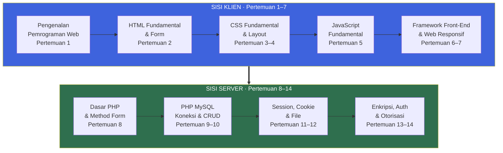
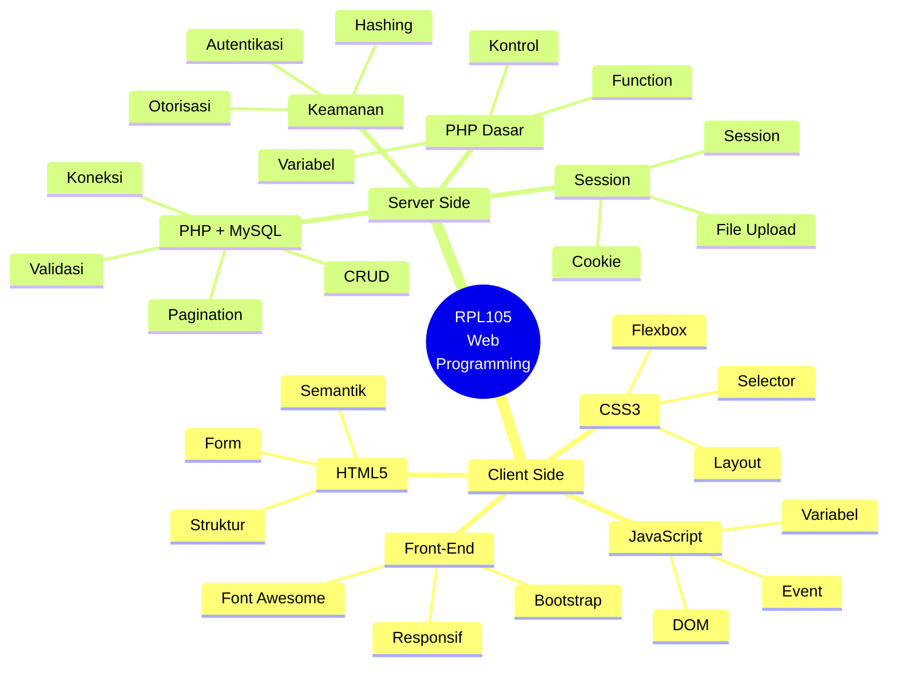
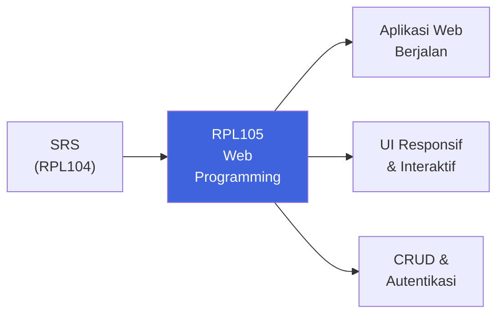
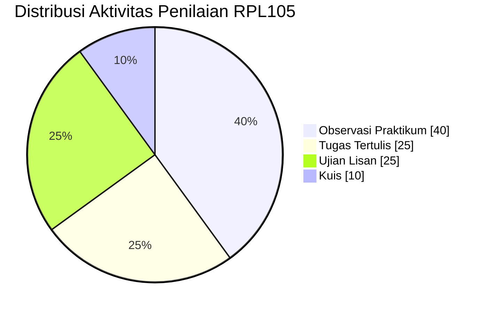

::: tip Halaman Resmi E-Learning
Seluruh materi, penugasan, dan aktivitas mata kuliah ini terpusat di e-learning Jurusan Teknik Informatika Politeknik Negeri Batam.

[**Buka E-Learning IF Polibatam →**](https://learningif.polibatam.ac.id)
:::

## Peta Mata Kuliah

RPL105 membawa kamu melalui **dua dunia pemrograman web** — sisi klien (yang berjalan di browser) dan sisi server (yang berjalan di server). Di antara keduanya, kamu akan belajar framework front-end dan integrasi basis data.



**Benang merah:** Sisi klien membangun **antarmuka** yang dilihat pengguna. Sisi server menambahkan **logika, data, dan keamanan** di belakangnya. Di akhir semester, keduanya bertemu dalam satu aplikasi web utuh dengan CRUD, autentikasi, dan otorisasi.

## Informasi Umum

<div align="center">

| **Kode** | **SKS** |   **Semester**   | **Status** |
| :------: | :-----: | :--------------: | :--------: |
|  RPL105  |    4    | Ganjil 2026/2027 |   Wajib    |

</div>

| Bidang                    | Keterangan                                      |
| ------------------------- | ----------------------------------------------- |
| **Nama Mata Kuliah**      | Pemrograman Berbasis Web                        |
| **Mata Kuliah Prasyarat** | Tidak ada                                       |
| **Program Studi**         | Teknologi Rekayasa Perangkat Lunak (D4)         |
| **Dosen Pengampu**        | Noper Ardi (Koordinator), Gilang Bagus Ramadhan |
| **Email**                 | noperardi@polibatam.ac.id                       |

### Deskripsi Mata Kuliah

Mata kuliah ini membahas konsep dasar web dengan **client side programming** dan **server side programming**. Client side programming meliputi HTML, CSS, JavaScript, dan Responsif Web. Server side programming meliputi PHP dan MySQL.

::: info Course Description (English)
This course covers fundamental web concepts, including client-side and server-side programming. Client-side programming encompasses HTML, CSS, JavaScript, and responsive web design, while server-side programming covers PHP and MySQL.
:::

::: info Cara Membaca Halaman Ini
Halaman ini disusun sebagai **satu perjalanan 14 pertemuan**. Setiap pertemuan berkontribusi ke satu aplikasi web utuh yang akan kamu bangun dari nol. Gunakan outline di kanan untuk melompat ke bagian tertentu, atau baca dari atas ke bawah.
:::

## Tujuan Pembelajaran

Setelah mengikuti mata kuliah ini, mahasiswa diharapkan mampu:

| No. | Tujuan Pembelajaran <Badge type="tip" text="7 TP" />                                                                                                          |
| :-: | ------------------------------------------------------------------------------------------------------------------------------------------------------------- |
|  1  | **Menjelaskan teknologi web** dan membedakan jenis pemrograman web _client side_ dan _server side_.                                                           |
|  2  | **Mengimplementasikan konsep dan komponen dasar** HTML, CSS, dan JavaScript dalam membangun antarmuka halaman web interaktif.                                 |
|  3  | **Menerapkan aturan standar coding** dalam membuat program (deskripsi file, penamaan variabel, fungsi, kondisi, perulangan) yang memastikan keterbacaan kode. |
|  4  | **Menggunakan framework front-end** untuk membuat halaman web responsif.                                                                                      |
|  5  | **Menggunakan bahasa pemrograman** dalam mengolah, memvalidasi, dan memproses data.                                                                           |
|  6  | **Mengimplementasikan operasi CRUD** (_Create, Read, Update, Delete_) menggunakan bahasa pemrograman web dan basis data relasional.                           |
|  7  | **Mengimplementasikan konsep pengolahan file, autentikasi, dan otorisasi** dalam mengelola akses halaman web menggunakan _session_ atau _cookie_.             |

### Kompetensi Inti yang Dibangun



## Rencana Pembelajaran

### Timeline 14 Pertemuan

```mermaid
gantt
    title Timeline RPL105 — 14 Pertemuan
    dateFormat X
    axisFormat %s

    section Sisi Klien
    Pengenalan Pemrograman Web       :a1, 0, 1
    HTML Fundamental & Form          :a2, 1, 1
    CSS Fundamental & Layout         :a3, 2, 2
    JavaScript Fundamental           :a4, 4, 1
    Framework Front-End & Responsif  :a5, 5, 2

    section Sisi Server
    Dasar PHP & Method Form          :b1, 7, 1
    PHP MySQL Koneksi & CRUD         :b2, 8, 2
    Session, Cookie & File           :b3, 10, 2
    Enkripsi, Auth & Otorisasi       :crit, b4, 12, 2
```



### Materi Pembelajaran

| Pertemuan | Topik Utama                            | Sub Topik                                                                                                           |
| :-------: | -------------------------------------- | ------------------------------------------------------------------------------------------------------------------- |
|     1     | Pengenalan Pemrograman Web             | RPS & kontrak kuliah, dasar aplikasi web, konsep pemrograman web & tools, _server side_ & _client side programming_ |
|     2     | HTML Fundamental & HTML Form           | Struktur dasar dokumen HTML, sintaks & atribut, elemen umum (heading, paragraph, link, image), HTML5                |
|    3–4    | CSS Fundamental & Layout               | Struktur dasar CSS, CSS inline/internal/external, selector/class/ID, design & layout                                |
|     5     | JavaScript Fundamental                 | Struktur JavaScript, tipe data, variabel, ekspresi, operator, konstanta                                             |
|    6–7    | Framework Front End & Web Responsif    | Bootstrap, Web UI, Font Awesome, Grid, Media Query                                                                  |
|     8     | Dasar-Dasar PHP & Method Form          | Pengenalan PHP, variabel, tipe data, operator, percabangan, perulangan, array, function & scope, method GET & POST  |
|   9–10    | PHP MySQL: Koneksi & CRUD              | Dasar SQL, pengenalan DBMS MySQL, koneksi PHP-MySQL, CRUD, validasi, pagination, pencarian                          |
|   11–12   | PHP: Session, Cookie & Pengolahan File | Konsep session & cookie, perbedaannya, upload & download file                                                       |
|   13–14   | Enkripsi, Autentikasi & Otorisasi      | Konsep autentikasi & otorisasi, implementasi pada PHP dengan session, fungsi hash untuk password                    |

### Detail Per Pertemuan

::: details Pertemuan 1 — Pengenalan Pemrograman Web

**Tujuan:** Mahasiswa memahami dasar aplikasi web, konsep client-side vs server-side, dan tools yang akan dipakai.

**Sub Pokok Bahasan:**

- RPS & kontrak kuliah
- Dasar aplikasi web
- Konsep pemrograman web & tools
- _Server side_ & _client side programming_

**Contoh Kode — Struktur HTML Dasar:**

```html
<!DOCTYPE html>
<html lang="id">
  <head>
    <meta charset="UTF-8" />
    <title>Halo, Web!</title>
  </head>
  <body>
    <h1>Selamat datang di RPL105</h1>
    <p>Halaman web pertama saya.</p>
  </body>
</html>
```

:::

::: details Pertemuan 2 — HTML Fundamental & HTML Form

**Tujuan:** Mahasiswa mampu membangun struktur dokumen HTML5 dengan elemen umum dan form input.

**Sub Pokok Bahasan:**

- Struktur dasar dokumen HTML
- Sintaks & atribut
- Elemen umum (heading, paragraph, link, image)
- HTML5

**Contoh Kode — Form HTML5:**

```html
<form action="proses.php" method="POST">
  <label for="nama">Nama:</label>
  <input type="text" id="nama" name="nama" required />

  <label for="email">Email:</label>
  <input type="email" id="email" name="email" required />

  <label for="prodi">Program Studi:</label>
  <select id="prodi" name="prodi">
    <option value="TRPL">TRPL</option>
    <option value="TIF">TIF</option>
  </select>

  <button type="submit">Kirim</button>
</form>
```

:::

::: details Pertemuan 3–4 — CSS Fundamental & Layout

**Tujuan:** Mahasiswa mampu menata tampilan halaman web dengan CSS modern.

**Sub Pokok Bahasan:**

- Struktur dasar CSS
- CSS inline/internal/external
- Selector, class, ID
- Design & layout

**Contoh Kode — CSS Layout:**

```css
/* File: style.css */
:root {
  --primary: #3e63dd;
  --spacing: 1rem;
}

body {
  font-family: 'Inter', sans-serif;
  margin: 0;
  padding: var(--spacing);
}

.card {
  border: 1px solid #ddd;
  border-radius: 8px;
  padding: var(--spacing);
  display: flex;
  gap: var(--spacing);
}

.card:hover {
  border-color: var(--primary);
}
```

:::

::: details Pertemuan 5 — JavaScript Fundamental

**Tujuan:** Mahasiswa mampu menggunakan JavaScript untuk interaksi di sisi klien.

**Sub Pokok Bahasan:**

- Struktur JavaScript
- Tipe data
- Variabel
- Ekspresi
- Operator
- Konstanta

**Contoh Kode — JavaScript Interaktif:**

```javascript
// Variabel dan tipe data
const nama = 'Budi';
let umur = 20;
const aktif = true;

// Fungsi
function sapa(nama) {
  return `Halo, ${nama}!`;
}

// Event listener
document.getElementById('btn').addEventListener('click', () => {
  alert(sapa(nama));
});
```

:::

::: details Pertemuan 6–7 — Framework Front-End & Web Responsif

**Tujuan:** Mahasiswa mampu membangun halaman web responsif dengan Bootstrap.

**Sub Pokok Bahasan:**

- Bootstrap
- Web UI
- Font Awesome
- Grid
- Media Query

**Contoh Kode — Bootstrap Grid:**

```html
<link
  href="https://cdn.jsdelivr.net/npm/bootstrap@5.3.0/dist/css/bootstrap.min.css"
  rel="stylesheet"
/>

<div class="container">
  <div class="row">
    <div class="col-md-6 col-lg-4">Kolom 1</div>
    <div class="col-md-6 col-lg-4">Kolom 2</div>
    <div class="col-md-12 col-lg-4">Kolom 3</div>
  </div>
</div>
```

:::

::: details Pertemuan 8 — Dasar-Dasar PHP & Method Form

**Tujuan:** Mahasiswa mampu menulis program PHP dasar dan memproses form dengan GET/POST.

**Sub Pokok Bahasan:**

- Pengenalan PHP
- Variabel, tipe data, operator
- Percabangan, perulangan
- Array
- Function & scope
- Method GET & POST

**Contoh Kode — PHP Form Handler:**

```php
<?php
// proses.php
if ($_SERVER['REQUEST_METHOD'] === 'POST') {
    $nama = htmlspecialchars($_POST['nama'] ?? '');
    $email = htmlspecialchars($_POST['email'] ?? '');

    if (empty($nama) || empty($email)) {
        echo "Semua field wajib diisi.";
    } else {
        echo "Terima kasih, $nama ($email)";
    }
}
?>
```

:::

::: details Pertemuan 9–10 — PHP MySQL: Koneksi & CRUD

**Tujuan:** Mahasiswa mampu menghubungkan PHP dengan MySQL dan mengimplementasikan CRUD.

**Sub Pokok Bahasan:**

- Dasar SQL
- Pengenalan DBMS MySQL
- Koneksi PHP-MySQL
- CRUD
- Validasi
- Pagination
- Pencarian

**Contoh Kode — CRUD Sederhana:**

```php
<?php
// koneksi.php
$host = 'localhost';
$db   = 'rpl105';
$user = 'root';
$pass = '';

$conn = new mysqli($host, $user, $pass, $db);
if ($conn->connect_error) {
    die("Koneksi gagal: " . $conn->connect_error);
}

// CREATE
$stmt = $conn->prepare("INSERT INTO mahasiswa (nama, email) VALUES (?, ?)");
$stmt->bind_param("ss", $nama, $email);
$stmt->execute();

// READ
$result = $conn->query("SELECT * FROM mahasiswa ORDER BY id DESC");

// UPDATE
$stmt = $conn->prepare("UPDATE mahasiswa SET nama = ? WHERE id = ?");
$stmt->bind_param("si", $nama, $id);
$stmt->execute();

// DELETE
$stmt = $conn->prepare("DELETE FROM mahasiswa WHERE id = ?");
$stmt->bind_param("i", $id);
$stmt->execute();
?>
```

:::

::: details Pertemuan 11–12 — PHP: Session, Cookie & Pengolahan File

**Tujuan:** Mahasiswa mampu mengelola session, cookie, dan pengolahan file upload/download.

**Sub Pokok Bahasan:**

- Konsep session & cookie
- Perbedaan session dan cookie
- Upload & download file

**Contoh Kode — Session & Upload File:**

```php
<?php
session_start();

// Set session setelah login sukses
$_SESSION['user_id'] = 42;
$_SESSION['username'] = 'budi';

// Upload file
if ($_SERVER['REQUEST_METHOD'] === 'POST' && isset($_FILES['berkas'])) {
    $target = 'uploads/' . basename($_FILES['berkas']['name']);
    $mime   = mime_content_type($_FILES['berkas']['tmp_name']);
    $allowed = ['image/jpeg', 'image/png', 'application/pdf'];

    if (in_array($mime, $allowed)) {
        move_uploaded_file($_FILES['berkas']['tmp_name'], $target);
        echo "File berhasil diunggah.";
    } else {
        echo "Tipe file tidak diizinkan.";
    }
}
?>
```

:::

::: details Pertemuan 13–14 — Enkripsi, Autentikasi & Otorisasi

**Tujuan:** Mahasiswa mampu mengimplementasikan sistem autentikasi dan otorisasi yang aman.

**Sub Pokok Bahasan:**

- Konsep autentikasi & otorisasi
- Implementasi pada PHP dengan session
- Fungsi hash untuk password

**Contoh Kode — Login dengan Hashing:**

```php
<?php
// register.php
$password = $_POST['password'];
$hash = password_hash($password, PASSWORD_BCRYPT);

$stmt = $conn->prepare("INSERT INTO users (username, password_hash) VALUES (?, ?)");
$stmt->bind_param("ss", $_POST['username'], $hash);
$stmt->execute();

// login.php
$stmt = $conn->prepare("SELECT id, username, password_hash FROM users WHERE username = ?");
$stmt->bind_param("s", $_POST['username']);
$stmt->execute();
$result = $stmt->get_result()->fetch_assoc();

if ($result && password_verify($_POST['password'], $result['password_hash'])) {
    session_start();
    $_SESSION['user_id'] = $result['id'];
    $_SESSION['username'] = $result['username'];
    header('Location: dashboard.php');
    exit;
} else {
    echo "Username atau password salah.";
}
?>
```

:::

## Proyek Pengembangan Perangkat Lunak (PBL)

Mata kuliah ini dijalankan dengan metode **Project-Based Learning (PBL)** dengan implementasi framework **CDIO** — kurikulum berbasis proses pengembangan produk yang menekankan pengembangan _softskill_ dan _hardskill_. Proyek yang dikerjakan mahasiswa pada semester 1 (Ganjil) merupakan salah satu _cornerstone project_ untuk membangun kemampuan merancang aplikasi sederhana untuk sebuah studi kasus, serta kerjasama tim, kolaborasi, komunikasi, dan refleksi.

### Kontribusi RPL105 terhadap PBL



**Posisi RPL105 dalam siklus proyek:** Mata kuliah ini adalah **motor implementasi** — tempat di mana dokumen SRS dari RPL104 diubah menjadi **kode yang berjalan**. Semua yang kamu pelajari di sini langsung dipakai di proyek PBL.

### Luaran Proyek

| Luaran                     | Deskripsi                                                          |
| -------------------------- | ------------------------------------------------------------------ |
| **Halaman Web Statis**     | Antarmuka berbasis HTML & CSS yang responsif.                      |
| **Halaman Web Interaktif** | Ditambah JavaScript untuk interaksi pengguna.                      |
| **Framework Front-End**    | Bootstrap untuk tampilan modern dan responsif.                     |
| **Aplikasi CRUD**          | CRUD dengan PHP dan MySQL — form, validasi, pagination, pencarian. |
| **Sistem Autentikasi**     | Login/logout dengan session, cookie, dan password hashing.         |
| **Pengolahan File**        | Upload dan download file dengan validasi MIME type.                |

::: warning Perhatian
**Praktikum disertai aset (gambar/file) wajib dikompres ke dalam ZIP** dengan format nama: `NIM_NamaLengkap.zip`. Semua pengumpulan melalui e-learning.
:::

## Metode Evaluasi

### Komponen Penilaian

| Komponen                       | Keterangan                       |
| ------------------------------ | -------------------------------- |
| **Tugas Tertulis**             | Minimal 2 tugas per semester     |
| **Ujian Lisan (Presentasi)**   | 2 sesi (tengah & akhir semester) |
| **Observasi Praktikum/Proyek** | 4 sesi di laboratorium           |
| **Kuis**                       | Kuis 1 & 2                       |



::: info Fokus Penilaian
RPL105 menekankan **praktik langsung di laboratorium** — 4 sesi observasi praktikum adalah momen di mana kamu dinilai mengaplikasikan teori secara langsung. Jangan lewatkan sesi ini.
:::

### Kriteria Penilaian

| Nilai Angka | Nilai Huruf |
| :---------: | :---------: |
|    ≥ 85     |      A      |
|   80 – 84   |     A-      |
|   75 – 79   |     B+      |
|   70 – 74   |      B      |
|   65 – 69   |     B-      |
|   60 – 64   |     C+      |
|   55 – 59   |      C      |
|   50 – 54   |     C-      |
|   45 – 49   |     D+      |
|   40 – 44   |      D      |
|    < 40     |      E      |

## Sarana & Prasarana

| No. | Sarana/Prasarana                   | Jumlah (Unit) |
| :-: | ---------------------------------- | :-----------: |
|  1  | Komputer/PC                        |      30       |
|  2  | Laboratorium                       |       1       |
|  3  | Visual Studio Code / editor web    |      30       |
|  4  | XAMPP / Laragon / web server lokal |      30       |
|  5  | MySQL                              |      30       |
|  6  | Koneksi Internet                   |       1       |

## Kesepakatan Pelaksanaan Perkuliahan

Pelaksanaan perkuliahan RPL105 mengacu pada kesepakatan berikut:

1. Mahasiswa wajib mengikuti seluruh kegiatan perkuliahan sesuai jadwal dengan **toleransi keterlambatan maksimal 15 menit**.
2. Seluruh penugasan dikumpulkan melalui e-learning IF Polibatam di [https://learningif.polibatam.ac.id](https://learningif.polibatam.ac.id).
3. **Tugas praktikum disertai aset (gambar/file) wajib dikompres ke dalam ZIP** dengan format nama `NIM_NamaLengkap.zip`.
4. Mahasiswa wajib menjaga etika moral dan etika akademik baik di dalam maupun di luar perkuliahan.

## Pustaka

### Referensi Utama

| No. | Referensi                                                                                                           |
| :-: | ------------------------------------------------------------------------------------------------------------------- |
|  1  | Supono & Vidiandry Putratama. _Pemrograman Web dengan Menggunakan PHP dan Framework Codeigniter_. Deepublish, 2016. |
|  2  | _Responsive Web Design dengan PHP dan Bootstrap_. 2013.                                                             |
|  3  | Sianipar, S.T. _HTML 5 & CSS 3: Belajar dari Kasus_. Informatika, 2015.                                             |
|  4  | Sunyoto, Andi. _AJAX: Membangun Web dengan Teknologi Asynchronous JavaScript and XML_. ANDI, 2007.                  |
|  5  | Sibero, Alexander F.K. _Kitab Suci Web Programming_. Mediakom, 2011.                                                |
|  6  | Silver, April Hodge. _WordPress 3 Complete_. Packt Publishing, 2011.                                                |
|  7  | Jubilee Enterprise. _Buku Pintar HTML5 dan CSS3_. Elex Media Komputindo, 2012.                                      |
|  8  | Pavlopoulos, Dionisis. _Practical Progressive Web Apps_. Packt Publishing, 2018.                                    |

### Bacaan Pendukung

| Sumber                      | Deskripsi                                                 |
| --------------------------- | --------------------------------------------------------- |
| **MDN Web Docs**            | Referensi paling lengkap untuk HTML, CSS, dan JavaScript. |
| **PHP Manual**              | Dokumentasi resmi PHP — wajib dijadikan rujukan harian.   |
| **MySQL Documentation**     | Dokumentasi resmi MySQL.                                  |
| **Bootstrap Documentation** | Dokumentasi resmi Bootstrap untuk framework front-end.    |

## Informasi Tambahan

Pelaksanaan mata kuliah ini menggunakan metode **Project-Based Learning (PBL)** dengan implementasi framework **CDIO** — kurikulum berbasis proses pengembangan produk yang menekankan pengembangan _softskill_ dan _hardskill_. Proyek yang dikerjakan mahasiswa pada semester 1 (Ganjil) merupakan salah satu _cornerstone project_ untuk membangun kemampuan merancang aplikasi sederhana untuk sebuah studi kasus, serta kerjasama tim, kolaborasi, komunikasi, dan refleksi.

Kontribusi mata kuliah ini utamanya adalah memberikan **kemampuan dasar pemrograman berbasis web** untuk proyek perangkat lunak.

## Sumber Referensi Online

### Platform Utama

| Sumber                  | Tautan                                       |
| ----------------------- | -------------------------------------------- |
| E-Learning IF Polibatam | [Buka →](https://learningif.polibatam.ac.id) |
| Politeknik Negeri Batam | [Buka →](https://www.polibatam.ac.id)        |

### Dokumentasi Resmi

| Sumber           | Tautan                                  | Kegunaan                  |
| ---------------- | --------------------------------------- | ------------------------- |
| **MDN Web Docs** | [Buka →](https://developer.mozilla.org) | HTML, CSS, JavaScript     |
| **PHP Manual**   | [Buka →](https://www.php.net/manual)    | Referensi PHP             |
| **MySQL Docs**   | [Buka →](https://dev.mysql.com/doc)     | Referensi MySQL           |
| **Bootstrap**    | [Buka →](https://getbootstrap.com)      | Framework front-end       |
| **W3Schools**    | [Buka →](https://www.w3schools.com)     | Tutorial web untuk pemula |

### Tools Pengembangan

| Tools                  | Tautan                                  | Kegunaan                       |
| ---------------------- | --------------------------------------- | ------------------------------ |
| **Visual Studio Code** | [Buka →](https://code.visualstudio.com) | Editor kode utama              |
| **XAMPP**              | [Buka →](https://www.apachefriends.org) | Web server + MySQL lokal       |
| **Laragon**            | [Buka →](https://laragon.org)           | Alternatif XAMPP untuk Windows |
| **Composer**           | [Buka →](https://getcomposer.org)       | Dependency manager PHP         |
| **Google Fonts**       | [Buka →](https://fonts.google.com)      | Font gratis untuk web          |

### Sumber Belajar Tambahan

| Sumber                                   | Deskripsi                                              |
| ---------------------------------------- | ------------------------------------------------------ |
| **FreeCodeCamp — Responsive Web Design** | Kursus gratis HTML/CSS terstruktur.                    |
| **The Odin Project**                     | Kurikulum full-stack open source.                      |
| **Laracasts**                            | Video pembelajaran web development berkualitas tinggi. |
| **W3Schools — PHP & MySQL Tutorial**     | Tutorial PHP dan MySQL langkah demi langkah.           |
| **PHP The Right Way**                    | Panduan praktik terbaik PHP modern.                    |

::: info Tentang Halaman Ini
Halaman ini disusun berdasarkan Rencana Pembelajaran Semester (RPS) RPL105 Pemrograman Berbasis Web dan konten e-learning Jurusan Teknik Informatika Politeknik Negeri Batam untuk Semester Ganjil 2026/2027. Informasi dapat berubah sewaktu-waktu mengikuti perkembangan perkuliahan.
:::

::: tip Butuh Update Cepat?
Jika ada perubahan jadwal, materi, atau informasi evaluasi, edit file `docs/v1/courses/rpl105-pemrograman-web/index.md` dan commit. Jangan biarkan informasi basi menumpuk.
:::
