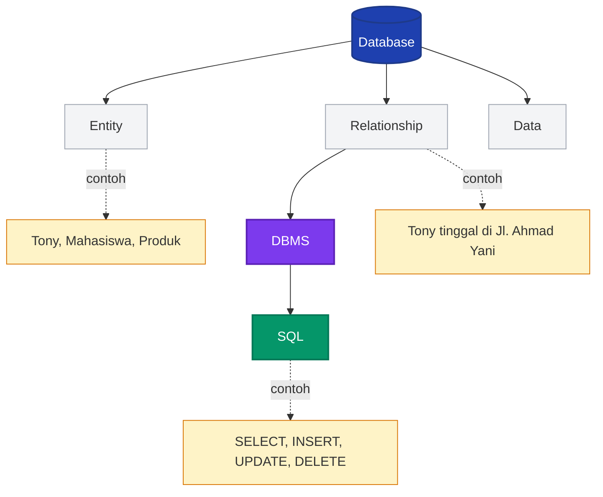

# Pertemuan 1 — Introduction to Database Concepts

**Mata Kuliah:** RPL106 — Introduction to Databases
**Dosen:** Ahmadi Irmansyah Lubis
**Pertemuan:** 1
**Topik:** Introduction to Database Concepts

:::info[Ringkasan Singkat]
Setiap aplikasi yang kamu gunakan hari ini — media sosial, e-commerce, maps, hingga sistem akademik kampus — **pasti menggunakan database**. Pertemuan ini membahas konsep dasar: apa itu data, apa itu database, mengapa database penting, bagaimana ia dirancang, dan bagaimana ia bekerja melalui **Relational Database** dan **DBMS**.
:::

## Navigasi Cepat

-   [Tujuan Pembelajaran](#tujuan-pembelajaran)
-   [1. Database is Everywhere](#1-database-is-everywhere)
-   [2. Apa Itu Data?](#2-apa-itu-data)
-   [3. Apa Itu Database?](#3-apa-itu-database)
-   [4. Tujuan Database](#4-tujuan-database)
-   [5. Tahapan Desain Database](#5-tahapan-desain-database)
-   [6. Studi Kasus: Data Mahasiswa Politeknik](#6-studi-kasus-data-mahasiswa-politeknik)
-   [7. Relational Database (RDB)](#7-relational-database-rdb)
-   [8. Database Management System (DBMS)](#8-database-management-system-dbms)
-   [9. Mengapa Kita Mempelajari Basis Data?](#9-mengapa-kita-mempelajari-basis-data)
-   [10. Penerapan Database di Dunia Nyata](#10-penerapan-database-di-dunia-nyata)
-   [11. Istilah Penting](#11-istilah-penting)
-   [12. Ringkasan](#12-ringkasan)

---

## Tujuan Pembelajaran

Setelah mempelajari materi ini, mahasiswa diharapkan mampu:

-   Menjelaskan definisi **data**, **datum**, dan **database**.
-   Membedakan **datum** dan **data** beserta contohnya.
-   Menyebutkan **tujuan database** dan alasan mengapa database dibutuhkan.
-   Menjelaskan **tahapan desain database** dari analisis kebutuhan hingga DBMS.
-   Memahami konsep **Relational Database** dan perbedaannya dengan penyimpanan sederhana seperti Excel.
-   Menyebutkan contoh **DBMS** populer dan fungsinya.
-   Menjelaskan mengapa bidang basis data penting bagi karier di ilmu komputer.

---

## 1. Database is Everywhere

Database ada di mana-mana — istilah kerennya **ubiquitous**. Coba bayangkan:

-   Berapa besar **data center Facebook**?
-   Berapa banyak data yang disimpan **Google** setiap detik?
-   Berapa banyak foto yang diunggah ke **Instagram** per menit?

Semua layanan modern tersebut tidak mungkin berjalan tanpa database.

### Contoh Nyata Penggunaan Database

| Aplikasi / Sistem                       | Fungsi Database                                                     |
| --------------------------------------- | ------------------------------------------------------------------- |
| **Shopee**                              | Menyimpan katalog produk, harga, stok, penjual, pembeli, transaksi. |
| **Google Maps**                         | Menyimpan data lokasi, jalan, tempat, rute, dan koordinat.          |
| **Sistem Informasi Akademik Polibatam** | Menyimpan data mahasiswa, dosen, mata kuliah, jadwal, dan nilai.    |
| **Media Sosial**                        | Menyimpan profil, postingan, komentar, like, dan pertemanan.        |
| **Layanan Streaming**                   | Menyimpan katalog film, riwayat tontonan, dan preferensi pengguna.  |

:::tip[Insight]
Perusahaan-perusahaan besar di dunia sedang **berinvestasi besar-besaran pada data**. Data adalah aset baru — bahkan ada ungkapan terkenal:

> _"Data is the new oil. We need to find it, extract it, refine it, distribute it, and monetize it."_
> — **David Buckingham**

:::

### Google Data Centers

Google memiliki banyak **data center** di seluruh dunia. Lokasinya bisa dilihat di:
https://www.google.com/about/datacenters/locations/

Bahkan klub sepak bola **Liverpool** menggunakan _data science_ secara intensif saat pertandingan berlangsung untuk membantu pelatih mengambil keputusan strategis secara _real-time_.

---

## 2. Apa Itu Data?

Secara etimologis:

-   **Data** berasal dari bahasa Latin, bentuk jamak dari kata **"datum"**.
-   **Datum** = satu fakta tunggal, satu entitas tunggal, satu titik informasi.
-   **Data** = kumpulan fakta yang direkam dalam berbagai format (angka, teks, gambar, dll).
-   **Data tidak bermakna sampai ditafsirkan.**

### Datum vs Data

Perhatikan tabel berikut:

| Nama Sekolah | Jumlah Siswa | Kondisi Sekolah |
| :----------- | -----------: | :-------------- |
| A            |          100 | Baik            |
| B            |          125 | Sedang          |
| C            |          250 | Baik            |
| D            |          300 | Baik            |
| E            |          175 | Baik            |

-   Satu sel, misalnya **"100"**, adalah sebuah **datum**.
-   Keseluruhan tabel berisi kumpulan datum yang membentuk sebuah **data**.

:::info[Intinya]

-   **Datum** → fakta tunggal.
-   **Data** → kumpulan fakta.
-   **Informasi** → data yang sudah ditafsirkan dan bermakna.

:::

### Piramida Data → Informasi → Pengetahuan

Untuk memahami hubungan antara datum, data, dan informasi, bayangkan tiga tingkat berikut:

| Tingkat         | Definisi                               | Contoh                                              |
| --------------- | -------------------------------------- | --------------------------------------------------- |
| **Datum**       | Fakta tunggal, mentah, belum bermakna. | `100`                                               |
| **Data**        | Kumpulan datum terorganisir.           | Tabel jumlah siswa 5 sekolah                        |
| **Informasi**   | Data yang sudah diolah & bermakna.     | "Sekolah D punya siswa terbanyak (300 orang)."      |
| **Pengetahuan** | Pola/kesimpulan yang bisa diambil.     | "Sekolah besar cenderung punya kondisi lebih baik." |

Semakin tinggi tingkatnya, semakin besar nilai yang bisa diambil dari data mentah.

---

## 3. Apa Itu Database?

Database adalah:

> **Kumpulan data besar yang terintegrasi, terstruktur, dan memodelkan objek dunia nyata sehingga pengguna dapat mengambil informasi dengan cepat.**

Database memodelkan dua hal utama dari dunia nyata:

1. **Entity** — objek seperti orang, barang, atau identitas. Contoh: _Tony_, _Mahasiswa_, _Produk_.
2. **Relationship** — hubungan antar entitas. Contoh: _Tony tinggal di Jl. Ahmad Yani_.

### Etimologi: Data + Base = Database

| Kata         | Arti                                                                                                     |
| ------------ | -------------------------------------------------------------------------------------------------------- |
| **Data**     | Fakta atau informasi yang digunakan untuk menghitung, menganalisis, atau merencanakan sesuatu.           |
| **Base**     | Sesuatu yang menjadi tempat atau penopang — seperti sekelompok orang atau benda yang menopang suatu hal. |
| **Database** | Kumpulan besar data yang terorganisir untuk pencarian dan pengambilan cepat oleh komputer.               |

### Karakteristik Database yang Baik

Database yang baik memiliki beberapa karakteristik berikut:

-   **Terintegrasi** — data dari berbagai bagian saling terhubung, tidak terisolasi.
-   **Terstruktur** — ada skema/tatanan yang jelas, bukan tumpukan file acak.
-   **Memodelkan dunia nyata** — merepresentasikan entitas dan relasi yang sesungguhnya.
-   **Dapat di-query** — pengguna bisa mengambil informasi secara cepat dan terarah.

---

## 4. Tujuan Database

Mengapa kita membutuhkan database? Karena database dirancang untuk mencapai tujuan-tujuan berikut:

| Tujuan               | Penjelasan                                                                            |
| -------------------- | ------------------------------------------------------------------------------------- |
| **Speed**            | Menyimpan, memanipulasi, dan mengambil data dengan cepat.                             |
| **Space Efficiency** | Mengurangi redundansi data dengan menggunakan relasi antar tabel.                     |
| **Accuracy**         | Menggunakan _data constraint_ agar data tetap unik dan konsisten.                     |
| **Availability**     | Data selalu tersedia untuk diakses kapan pun dibutuhkan.                              |
| **Completeness**     | Jika struktur database kurang lengkap, kita bisa menambahkan data atau struktur baru. |
| **Security**         | Adanya _user management_ — siapa boleh mengakses apa.                                 |
| **Sharability**      | Banyak pengguna dapat berbagi database yang sama.                                     |

:::tip[Rangkuman]
Tujuan database bisa disingkat menjadi: **cepat, hemat ruang, akurat, tersedia, lengkap, aman, dan bisa dibagi**.
:::

---

## 5. Tahapan Desain Database

Merancang database bukan sekadar membuat tabel. Ada **alur yang sistematis**:

```text
Need Analysis → Data Model (ER) → Relational Schema → DBMS + Query
```

| Tahap                    | Penjelasan                                                      |
| ------------------------ | --------------------------------------------------------------- |
| **1. Need Analysis**     | Menganalisis kebutuhan sistem dan data apa yang harus disimpan. |
| **2. Data Model (ER)**   | Membuat model konseptual, biasanya menggunakan **ER Diagram**.  |
| **3. Relational Schema** | Menerjemahkan ER Diagram menjadi skema tabel relasional.        |
| **4. DBMS + Query**      | Mengimplementasikan skema ke DBMS dan menulis query (SQL).      |

### Kenapa Urutannya Penting?

Setiap tahap membangun fondasi untuk tahap berikutnya:

-   Salah di **Need Analysis** → model data salah → skema salah → implementasi salah.
-   Melewati **ER Model** → langsung ke skema → tabel berantakan, sulit dikembangkan.
-   Tidak paham **Relational Schema** → query SQL akan ngawur dan rawan bug.

Karena itu, **jangan langsung menulis SQL**. Rancang dulu di tingkat konseptual.

---

## 6. Studi Kasus: Data Mahasiswa Politeknik

Bayangkan Politeknik memiliki:

-   **Ribuan data mahasiswa**
-   **Data mata kuliah**
-   **Data dosen, kelas, dan nilai**

Bagaimana cara mengelolanya?

### Solusi 1: File Excel

**Kelebihan Excel:**

-   Sederhana dan mudah dipakai.
-   Mudah dibagikan.
-   Mudah untuk insert, edit, dan delete data.
-   Ada fitur **Find** untuk mencari data.
-   Mudah di-backup (print, copy, dsb).

**Kelemahan Excel:**

-   **File size** → semakin besar file, semakin lambat pemrosesan.
-   **Data redundancy** → data yang sama bisa tersimpan berulang.
-   **Relasi data sulit** → misal: _"Mahasiswa mana saja yang mengambil mata kuliah Basis Data?"_ → sulit dijawab.
-   **Penambahan informasi** (kolom baru) menyulitkan struktur.
-   **Analisis data** sulit → misal: _"Berapa mahasiswa yang tinggal di Batam Center?"_
-   **Data version** → jika satu orang mengubah data, orang lain belum tentu ter-update.
-   **Data security** → nilai mahasiswa hanya boleh diedit oleh dosen tertentu, sulit diatur di Excel.

:::warning[Kesimpulan]
Excel bagus untuk data kecil dan sederhana, tetapi **tidak cocok untuk data berskala besar** yang membutuhkan relasi, keamanan, dan konsistensi. Di sinilah **database** berperan.
:::

### Solusi 2: Relational Database

Database relasional mengatasi semua kelemahan Excel di atas:

| Masalah Excel    | Solusi RDB                                |
| ---------------- | ----------------------------------------- |
| File size besar  | Data terdistribusi di banyak tabel        |
| Data redundancy  | Relasi antar tabel, tidak ada duplikasi   |
| Relasi sulit     | Foreign key + JOIN query                  |
| Struktur kaku    | `ALTER TABLE` untuk tambah kolom          |
| Analisis susah   | `SELECT` + agregasi (`SUM`, `COUNT`, dll) |
| Tidak multi-user | User management + transaction             |
| Keamanan lemah   | `GRANT` / `REVOKE` per user               |

---

## 7. Relational Database (RDB)

### Konsep Dasar

**Relational Database** adalah:

> Kumpulan data yang diorganisir dalam bentuk **tabel, record, dan kolom**, dengan **hubungan yang terdefinisi baik** antar tabel.

Karakteristik utama:

-   Tabel saling **berkomunikasi dan berbagi informasi**.
-   Memudahkan **pencarian, pengorganisasian, dan pelaporan** data.
-   Menggunakan **Structured Query Language (SQL)**.
-   Berasal dari konsep **fungsi matematis** tentang pemetaan himpunan data.

### Komponen Relational Database

| Komponen                 | Deskripsi                                 |
| ------------------------ | ----------------------------------------- |
| **Tabel (Relation)**     | Kumpulan data tentang satu jenis entitas. |
| **Baris (Tuple/Record)** | Satu instance data dalam tabel.           |
| **Kolom (Attribute)**    | Properti dari entitas.                    |
| **Primary Key**          | Kolom yang mengidentifikasi baris unik.   |
| **Foreign Key**          | Kolom yang merujuk ke PK tabel lain.      |
| **Relasi**               | Hubungan logis antar tabel via key.       |

### Contoh Relational Database

Misalkan kita punya tiga tabel:

**Tabel 1: MHSN (Mahasiswa)**

| NPM      | Nama         | Alamat  |
| -------- | ------------ | ------- |
| 10296832 | Nurhayati    | Jakarta |
| 10296126 | Astuti       | Jakarta |
| 1296500  | Budi         | Depok   |
| 1296525  | Prananingrum | Bogor   |
| 96487    | Pipit        | Bekasi  |
| 96353    | Quraish      | Bogor   |

**Tabel 2: MKUL (Mata Kuliah)**

| KDMK  | MTKULIAH      | SKS | KK    |
| ----- | ------------- | --: | ----- |
| KK021 | P. Basis Data |   2 | KD132 |
| SIM   | 3             |     |       |
| KU122 | Pancasila     |   2 |       |

**Tabel 3: NILAI**

| NPM      | KDMK  | MID | FINAL |
| -------- | ----- | --: | ----: |
| 10296832 | KK021 |  60 |    75 |
| 10296126 | KD132 |  70 |    90 |
| 1296500  | KK021 |  55 |    40 |
| 1296525  | KU122 |  90 |    80 |
| 1196353  | KU122 |  75 |    75 |
| 96487    | KD132 |  80 |     0 |
| 10296832 | KD132 |  40 |    30 |

Perhatikan bagaimana **NPM** dan **KDMK** menjadi penghubung antar tabel — inilah yang disebut **relasi**.

### Contoh Query Sederhana

Dari tiga tabel di atas, kita bisa menjawab pertanyaan seperti:

```sql
-- "Siapa saja mahasiswa yang tinggal di Bogor?"
SELECT Nama, Alamat FROM MHSN WHERE Alamat = 'Bogor';

-- "Berapa nilai akhir Nurhayati di mata kuliah P. Basis Data?"
SELECT m.Nama, mk.MTKULIAH, n.FINAL
FROM MHSN m
JOIN NILAI n ON m.NPM = n.NPM
JOIN MKUL m k ON n.KDMK = mk.KDMK
WHERE m.Nama = 'Nurhayati' AND mk.MTKULIAH = 'P. Basis Data';
```

Ini yang tidak bisa dilakukan Excel dengan mudah.

---

## 8. Database Management System (DBMS)

**DBMS** adalah:

> Perangkat lunak yang menggunakan metode standar untuk **katalogisasi, pengambilan, dan menjalankan query** pada data.

Fungsi DBMS:

-   Mengelola data yang masuk.
-   Mengorganisir data.
-   Menyediakan cara agar data dapat **dimodifikasi** atau **diekstraksi** oleh pengguna atau program lain.

### Contoh DBMS Populer

| DBMS                 | Karakteristik                                              |
| -------------------- | ---------------------------------------------------------- |
| **MySQL**            | Open source, populer untuk web.                            |
| **PostgreSQL**       | Open source, fitur lengkap, mendukung kompleksitas tinggi. |
| **Microsoft Access** | Cocok untuk desktop dan data kecil.                        |
| **SQL Server**       | Produk Microsoft, umum di enterprise.                      |
| **Oracle**           | Enterprise-grade, sangat skalabel.                         |

:::tip[Komponen Sistem Database]
Sebuah sistem database umumnya terdiri dari:

1. **Database** — kumpulan datanya.
2. **DBMS** — perangkat lunaknya.
3. **Hardware** — server/komputer.
4. **SO (Sistem Operasi)**.
5. **User** — pengguna.
6. **Aplikasi Pendukung**.

:::

### Tugas Utama DBMS

| Tugas                 | Penjelasan                                          |
| --------------------- | --------------------------------------------------- |
| **Data Definition**   | Mendefinisikan struktur (DDL: CREATE, ALTER, DROP). |
| **Data Manipulation** | Mengelola isi data (DML: INSERT, UPDATE, DELETE).   |
| **Data Query**        | Mengambil data (DQL: SELECT).                       |
| **Access Control**    | Mengatur hak akses (DCL: GRANT, REVOKE).            |
| **Transaction**       | Menjaga konsistensi (COMMIT, ROLLBACK).             |
| **Backup & Recovery** | Menyalin & memulihkan data jika terjadi kegagalan.  |

---

## 9. Mengapa Kita Mempelajari Basis Data?

Bidang database memberi banyak kontribusi pada ilmu komputer:

-   Konsep database dapat diterapkan di **berbagai bidang masalah**.
-   **DBMS adalah teknologi perangkat lunak yang sangat sukses** (Oracle, DB2, MS SQL, dll).
-   Bidang pengembangan sangat luas: **Data Mining, Big Data, Business Intelligence**, dll.
-   Karier bergengsi: **Data Scientist**, **Database Administrator**, **Backend Engineer**.

:::info[Analogi]

> _"Data is the new oil."_

Seperti minyak, data harus **dicari, diekstraksi, dimurnikan, didistribusikan, dan dimonetisasi**. Database adalah kilang minyaknya.
:::

### Jalur Karier Terkait Database

| Peran                      | Fokus Utama                                             |
| -------------------------- | ------------------------------------------------------- |
| **Backend Engineer**       | Membangun API & logika bisnis yang mengakses DB.        |
| **Database Administrator** | Mengelola, tuning, backup, dan keamanan DB.             |
| **Data Engineer**          | Membangun pipeline data dari berbagai sumber.           |
| **Data Analyst**           | Menggali insight dari data untuk pengambilan keputusan. |
| **Data Scientist**         | Membangun model prediktif dari data.                    |
| **Business Intelligence**  | Menyajikan dashboard & laporan untuk stakeholder.       |

---

## 10. Penerapan Database di Dunia Nyata

| Bidang               | Contoh Penggunaan                        |
| -------------------- | ---------------------------------------- |
| **Kepagawaian (HR)** | Data pegawai, absensi, gaji.             |
| **Penjualan**        | Transaksi, stok, pelanggan.              |
| **Rumah Sakit**      | Data pasien, rekam medis, jadwal dokter. |
| **Perbankan**        | Rekening, transaksi, nasabah.            |
| **Pendidikan**       | Data mahasiswa, nilai, jadwal kuliah.    |
| **E-commerce**       | Katalog produk, pesanan, pembayaran.     |

### Tingkatan Aplikasi Database

1. **Stand Alone** — aplikasi berjalan di satu komputer.
2. **Multi User** — digunakan banyak pengguna secara bersamaan.
3. **Client Server** — aplikasi terbagi antara client dan server.

### Skala Penggunaan Database

| Skala          | Contoh                                   |
| -------------- | ---------------------------------------- |
| **Personal**   | Aplikasi catatan pribadi, to-do list.    |
| **Tim kecil**  | Sistem internal startup, tools internal. |
| **Enterprise** | ERP, CRM, sistem akademik kampus.        |
| **Global**     | Google, Facebook, Shopee, Tokopedia.     |

---

## 11. Istilah Penting

| Istilah          | Arti                                        |
| ---------------- | ------------------------------------------- |
| **Datum**        | Fakta tunggal.                              |
| **Data**         | Kumpulan fakta.                             |
| **Database**     | Kumpulan data terorganisir.                 |
| **DBMS**         | Perangkat lunak pengelola database.         |
| **RDB**          | Relational Database.                        |
| **SQL**          | Bahasa query standar untuk RDB.             |
| **Entity**       | Objek dunia nyata yang dimodelkan.          |
| **Relationship** | Hubungan antar entitas.                     |
| **Schema**       | Struktur/definisi tabel dalam database.     |
| **Query**        | Perintah untuk mengambil/memanipulasi data. |
| **Primary Key**  | Kolom yang mengidentifikasi baris unik.     |
| **Foreign Key**  | Kolom yang merujuk ke PK tabel lain.        |
| **Tuple**        | Baris dalam tabel relasional.               |
| **Attribute**    | Kolom dalam tabel relasional.               |

---

## 12. Ringkasan

-   **Database ada di mana-mana** dan menjadi fondasi aplikasi modern.
-   **Datum** adalah fakta tunggal; **data** adalah kumpulan fakta; **informasi** adalah data yang bermakna.
-   **Database** memodelkan **entity** dan **relationship** dari dunia nyata.
-   Tujuan database: **cepat, hemat ruang, akurat, tersedia, lengkap, aman, dan bisa dibagi**.
-   Desain database melalui tahapan: **Need Analysis → ER → Relational Schema → DBMS + Query**.
-   **Excel** tidak cocok untuk data besar; **Relational Database** hadir sebagai solusinya.
-   **DBMS** seperti MySQL, PostgreSQL, dan Oracle adalah perangkat lunak yang mengelola database.
-   Bidang database membuka karier luas: **Data Scientist, DBA, Backend Engineer**.

### Peta Konsep



---

## Referensi

1. Silberschatz, Korth, Sudarshan — _Database System Concept_.
   Slides: http://codex.cs.yale.edu/avi/db-book/db6/slide-dir/index.html
2. Hilda Widyastuti — _Slide Relational Database_.
3. Metta Santiputri — _Slide Basis Data_.

---

## Halaman Terkait

| Halaman                                                                             | Deskripsi                           |
| ----------------------------------------------------------------------------------- | ----------------------------------- |
| [Pertemuan 2 — ER Diagram](/docs/v1/courses/rpl106-pengantar-basis-data/er-diagram) | Materi berikutnya — pemodelan data. |
| [Halaman Mata Kuliah RPL106](/docs/v1/courses/rpl106-pengantar-basis-data/)         | Overview mata kuliah.               |
| [Format Halaman Konten](/docs/format/page)                                          | Panduan penulisan halaman ini.      |
