# Pertemuan 2 — Data Modelling: Entity Relationship Diagram (ER-Diagram)

**Mata Kuliah:** RPL106 — Pengantar Basis Data
**Dosen:** Ahmadi Irmansyah Lubis
**Pertemuan:** 2
**Topik:** Pemodelan Data Konseptual & Perancangan Entity Relationship Diagram

:::info Ringkasan Singkat
Setelah memahami konsep dasar basis data di Pertemuan 1, sekarang kita masuk ke tahap **pemodelan data**. Di sini kita belajar bagaimana menerjemahkan kebutuhan dunia nyata menjadi **Entity Relationship Diagram (ERD)** — blueprint konseptual sebelum basis data benar-benar dibangun. ERD adalah **fondasi** dari seluruh proses perancangan basis data. Salah di sini, salah semuanya.
:::

## Navigasi Cepat

- [Tujuan Pembelajaran](#tujuan-pembelajaran)
- [1. Mengapa ER Diagram?](#1-mengapa-er-diagram)
- [2. Review: Database Design](#2-review-database-design)
- [3. Conceptual Design](#3-conceptual-design)
- [4. Entity Relationship Diagram (ERD)](#4-entity-relationship-diagram-erd)
- [5. Komponen Utama ERD](#5-komponen-utama-erd)
- [6. Instance dari ER Diagram](#6-instance-dari-er-diagram)
- [7. Keys](#7-keys)
- [8. Peran dalam Relationship](#8-peran-dalam-relationship)
- [9. Derajat Relasi](#9-derajat-relasi)
- [10. Arti dari Tanda Panah](#10-arti-dari-tanda-panah)
- [11. Participation Constraint](#11-participation-constraint)
- [12. Referential Integrity](#12-referential-integrity)
- [13. Weak Entity Set](#13-weak-entity-set)
- [14. Notasi ERD Lengkap](#14-notasi-erd-lengkap)
- [15. Transformasi ERD ke Skema Relasional](#15-transformasi-erd-ke-skema-relasional)
- [16. Studi Kasus: Perpustakaan](#16-studi-kasus-perpustakaan)
- [17. Panduan Draw.io](#17-panduan-drawio)
- [18. Istilah Penting](#18-istilah-penting)
- [19. Ringkasan](#19-ringkasan)

---

## Tujuan Pembelajaran

Setelah mempelajari materi ini, mahasiswa diharapkan mampu:

- Memahami konsep dasar dan peran penting **Pemodelan Data** dalam siklus pengembangan sistem basis data.
- Mengidentifikasi komponen utama **ERD**: **Entitas**, **Atribut**, dan **Tipe Relasi**.
- Menganalisis **Derajat Relasi** (_Cardinality Ratio_): One-to-One, One-to-Many, Many-to-Many.
- Memahami **Participation Constraint**, **atribut turunan**, dan **atribut komposit**.
- Mengenali **Weak Entity**, **Role in Relationship**, dan **Referential Integrity**.
- Mampu **mentransformasikan** ERD ke **skema relasional**.

---

## 1. Mengapa ER Diagram?

Pada skala tertentu, perancang database **dapat langsung memutuskan** rancangan basis data — relasi, atribut, dan constraint-nya.

**Namun**, dalam prakteknya:

- Rancangan basis data **seringkali kompleks** — sulit langsung menentukan atribut, relasi, dan lainnya.
- Seringkali **tak seorang pun** memahami secara menyeluruh kebutuhan data.
- Perancang **harus berinteraksi dengan customer** untuk memahami kebutuhan.
- Dibutuhkan **model data** yang menerjemahkan kebutuhan menjadi **skema konseptual**.

:::tip Insight
ERD menjawab pertanyaan: **"Data apa yang perlu kita simpan, dan bagaimana hubungan antar data tersebut?"** — sebelum menyentuh DBMS.
:::

---

## 2. Review: Database Design

Alur desain basis data dari Pertemuan 1:

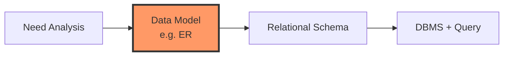

Di pertemuan ini, kita **berfokus pada tahap kedua** — **Data Model (ER)**.

---

## 3. Conceptual Design

**ER Model** adalah teknik pemodelan data yang mengilustrasikan secara **visual** entitas dan relasi antar entitas tersebut.

### Pertanyaan yang Dijawab ER Model

| Pertanyaan                                       | Contoh                               |
| ------------------------------------------------ | ------------------------------------ |
| **Apa saja entitas & relationship?**             | Mahasiswa, Mata Kuliah, KRS          |
| **Informasi apa yang harus disimpan?**           | Nama mahasiswa, SKS, nilai           |
| **Integrity constraint / business rules?**       | Satu mahasiswa maksimal ambil 24 SKS |
| **Bagaimana skema database digambarkan?**        | ER Diagram                           |
| **Bagaimana ERD dipetakan ke skema relasional?** | Konversi ke tabel SQL                |

### Tingkatan Model Data

| Tingkat | Nama           | Fokus                           | Contoh                  |
| :-----: | -------------- | ------------------------------- | ----------------------- |
|  **1**  | **Conceptual** | Apa yang dibutuhkan bisnis?     | **ERD, CDM**            |
|  **2**  | **Logical**    | Bagaimana struktur relasional?  | Skema Relasional, PDM   |
|  **3**  | **Physical**   | Bagaimana implementasi di DBMS? | SQL DDL, Index, Partisi |

---

## 4. Entity Relationship Diagram (ERD)

**ERD** adalah **model konseptual** yang menggambarkan:

- **Entitas** (objek/kejadian) yang ingin disimpan datanya.
- **Atribut** (properti) dari setiap entitas.
- **Hubungan** (relationship) antar entitas.

### Karakteristik ERD

| Karakteristik           | Penjelasan                               |
| ----------------------- | ---------------------------------------- |
| **Bebas detail teknis** | Tidak peduli DBMS apa yang akan dipakai. |
| **Fokus struktur data** | Bukan proses bisnis.                     |
| **Bersifat grafis**     | Mudah dibaca dan dikomunikasikan.        |
| **Menjadi dasar**       | Acuan pembuatan skema relasional.        |

:::info Kenapa ERD?
Bayangkan membangun rumah tanpa denah. ERD adalah **denah** dari basis data — tanpa itu, tabel akan berantakan, sulit dikembangkan, dan penuh redundansi.
:::

---

## 5. Komponen Utama ERD

ERD terdiri dari **3 komponen inti**:

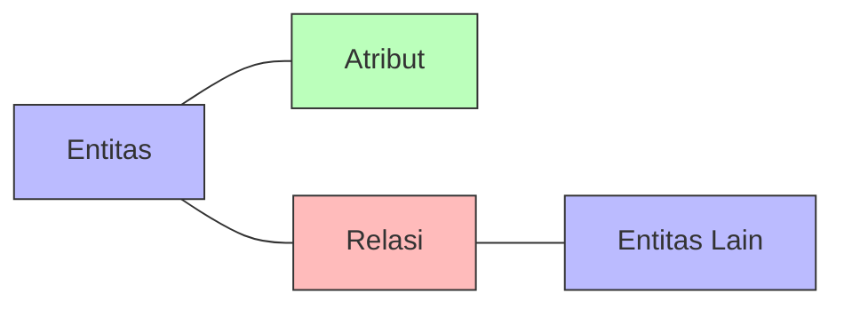

### 5.1 Entitas (Entity)

**Entitas** adalah objek dalam dunia nyata yang **dapat dibedakan** dari objek lain.

- Contoh: seseorang, sebuah perusahaan, sebuah event.
- Dideskripsikan menggunakan **kumpulan atribut**.

**Himpunan Entitas (Entity Set):** himpunan entitas-entitas serupa yang punya properti sama.

**Aturan Penting:**

- Semua entitas dalam satu entity set punya **atribut yang sama**.
- Setiap entity set **memiliki key**.

**Jenis Entitas:**

| Jenis             | Ciri                    | Contoh              |
| ----------------- | ----------------------- | ------------------- |
| **Strong Entity** | Punya key sendiri       | Mahasiswa (NIM)     |
| **Weak Entity**   | Tidak punya key sendiri | Pembayaran (no_byr) |

### 5.2 Atribut (Attribute)

**Atribut** adalah properti dari entitas-entitas dalam himpunan itu.

**Domain:** himpunan nilai yang boleh dimiliki atribut.

- Contoh: `18 < umur < 65` untuk atribut umur pegawai.

**Tipe Atribut:**

| Jenis             | Notasi              | Contoh                         |
| ----------------- | ------------------- | ------------------------------ |
| **Simple**        | Oval                | `nopeg`, `namadpn`, `namablkg` |
| **Composite**     | Oval bercabang      | `nama` → `namadpn`, `namablkg` |
| **Single-valued** | Oval                | `nopeg` (satu nilai)           |
| **Multivalued**   | Oval ganda          | `notelp` (banyak nilai)        |
| **Derived**       | Oval putus-putus    | `umur` (dari `tgllahir`)       |
| **Key / Primary** | Oval bergaris bawah | `nopeg`                        |

**Contoh Atribut Pegawai:**

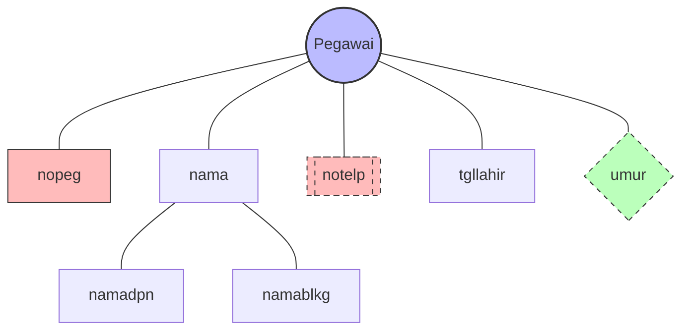

**Keterangan:**

- `nopeg` — **primary key** (garis bawah)
- `notelp` — **multivalued attribute** (oval dobel)
- `umur` — **derived attribute** (oval putus-putus)
- `nama` → `namadpn`, `namablkg` — **composite attribute**

### 5.3 Relasi (Relationship)

**Relasi** adalah hubungan bermakna antar entitas.

- Contoh: **pegawai Budi bekerja di departemen Farmasi**.
- Untuk sebuah relationship, harus ditentukan **pegawai mana** dan **departemen mana** yang berhubungan.
- Diperlukan nilai **key** dari masing-masing entitas, disimpan bersama-sama.

**Contoh Relasi:**

| Relasi         | Entitas Terlibat        |
| -------------- | ----------------------- |
| **Bekerja_di** | Pegawai ↔ Departemen    |
| **Mengambil**  | Mahasiswa ↔ Mata Kuliah |
| **Mengajar**   | Dosen ↔ Mata Kuliah     |
| **Mengelola**  | Pegawai ↔ Departemen    |

### 5.4 Hubungan Antar Komponen

| Simbol                | Arti                                        |
| --------------------- | ------------------------------------------- |
| **Persegi panjang**   | Himpunan **entitas**                        |
| **Belah ketupat**     | Himpunan **relationship**                   |
| **Garis**             | Penghubung atribut ↔ entitas ↔ relationship |
| **Elips**             | **Atribut**                                 |
| **Elips dobel**       | **Multivalued attribute**                   |
| **Elips putus-putus** | **Derived attribute**                       |
| **Garis bawah**       | **Primary key**                             |

---

## 6. Instance dari ER Diagram

**ER Diagram** mendeskripsikan **skema** database.
**Database instance** berisi **data** yang mengikuti struktur tersebut.

Kita **tidak memiliki data** dalam conceptual design, tapi **membayangkan data ada** membantu berpikir mengenai desain.

### Contoh: Skema Departemen

| Nodep | Namadep    |      Budget |
| ----- | ---------- | ----------: |
| D100  | Farmasi    | 120.000.000 |
| D101  | Kardiologi | 540.000.000 |
| D102  | HR         |  20.000.000 |

### Contoh: Skema Bekerja_di

| Namadep | Nopeg        | Mulai |
| ------- | ------------ | ----: |
| D100    | 123-45-6789  |  1964 |
| D101    | 222-33-4444  |  2005 |
| D102    | 999-777-5555 |  1999 |

:::tip Insight
ERD = **cetak biru** bangunan.
Data di atas = **perabot** yang nanti diletakkan di dalamnya.
Desain dulu cetak birunya, baru isi perabotnya.
:::

---

## 7. Keys

Dari perspektif basis data, setiap entitas **berbeda**.

**Key:** sekelompok atribut yang dapat **membedakan** suatu entitas dengan entitas lain.

### Langkah Identifikasi Primary Key

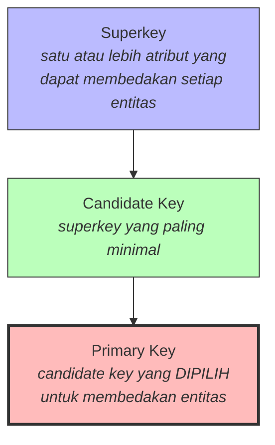

### Perbedaan

| Istilah           | Definisi                                         | Contoh (Mahasiswa)                      |
| ----------------- | ------------------------------------------------ | --------------------------------------- |
| **Superkey**      | Satu atau lebih atribut yang membedakan entitas. | `{NIM, Nama}`, `{NIM}`, `{NIM, Alamat}` |
| **Candidate Key** | Superkey paling minimal.                         | `{NIM}`, `{Email}`                      |
| **Primary Key**   | Candidate key yang dipilih.                      | `{NIM}`                                 |

:::warning Kesalahan Umum
`{NIM, Nama}` adalah **superkey**, tapi **bukan** candidate key — karena `{NIM}` saja sudah cukup. Candidate key harus **minimal**.
:::

---

## 8. Peran dalam Relationship

**Entitas yang sama** dapat berpartisipasi dalam **beberapa himpunan relationship** yang berbeda — **atau** memiliki **"peran"** yang berbeda dalam himpunan yang sama.

### 8.1 Entitas dengan Beberapa Relasi

Contoh: **Book** memiliki relasi dengan **Student** (melalui `borrow`) dan dengan **Book_type** (melalui `has`).

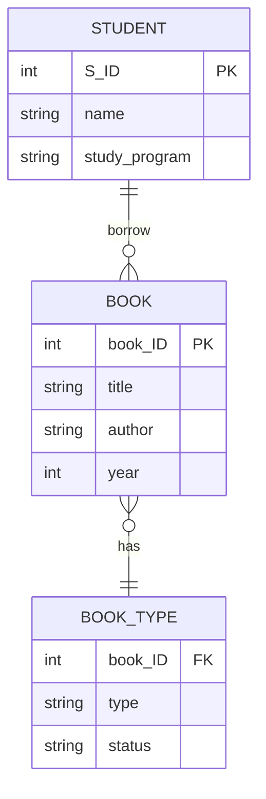

### 8.2 Peran Berbeda (Self-Referencing Relationship)

Contoh: **Pegawai** dapat menjadi **supervisor** dan **bawahan** dalam relasi yang sama.

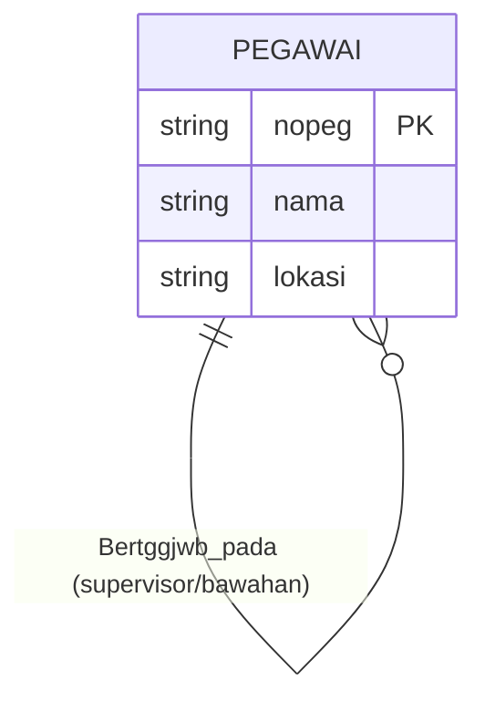

**Skema Relasional:**

```text
bertggjwb_pada(supervisor_ssn, bawahan_ssn)
```

:::info Insight
Relasi **rekursif** (unary) sering muncul di dunia nyata: **karyawan–atasan**, **mahasiswa–mentor**, **kategori–subkategori**.
:::

---

## 9. Derajat Relasi

**Cardinality** menyatakan **jumlah entitas** yang dapat **diasosiasikan** dengan entitas lain.

### 9.1 One-to-One (1:1)

Setiap **Departemen** memiliki **paling banyak satu** manajer, dan seorang manajer dapat mengelola **paling banyak satu** departemen.

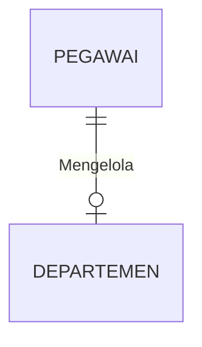

**Implementasi:** Foreign key di salah satu tabel + constraint `UNIQUE`.

### 9.2 One-to-Many (1:N)

Setiap **Departemen** memiliki **paling banyak satu** manajer, tapi seorang manajer dapat **mengelola beberapa** departemen.

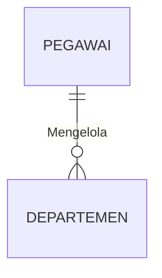

**Sudut Pandang:**

- **Pegawai → Departemen** = One-to-Many
- **Departemen → Pegawai** = Many-to-One

**Implementasi:** Foreign key di sisi **Many**.

### 9.3 Many-to-Many (M:N)

Seorang **Pegawai** dapat bekerja di **beberapa Departemen**, dan sebuah **Departemen** dapat memiliki **banyak Pegawai**.

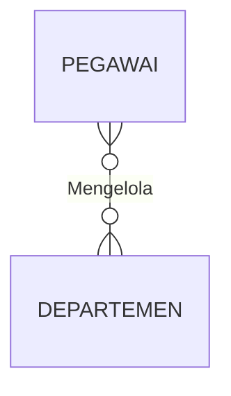

**Implementasi:** Dibutuhkan **tabel jembatan** (junction table).

:::warning Catatan Penting
Relasi **Many-to-Many** **tidak bisa** diimplementasikan langsung menjadi dua tabel saja. Harus ada **tabel ketiga** sebagai penghubung. Ini kesalahan paling umum pemula.
:::

### 9.4 Ringkasan Cardinality

| Kardinalitas     | Notasi Mermaid | Contoh                 | Tabel Jembatan? |
| ---------------- | :------------: | ---------------------- | :-------------: |
| **One-to-One**   |  `\|\|--o\|`   | Pegawai ↔ Departemen   |      Tidak      |
| **One-to-Many**  |   `\|\|--o{`   | Departemen ↔ Pegawai   |      Tidak      |
| **Many-to-One**  |   `}o--\|\|`   | Kebalikan dari 1:N     |      Tidak      |
| **Many-to-Many** |    `}o--o{`    | Pegawai ↔ Departemen   |     **Ya**      |
| **Ternary**      |  _tabel baru_  | Mahasiswa ↔ MK ↔ Dosen |     **Ya**      |

---

## 10. Arti dari Tanda Panah

**Tanda panah berarti "paling banyak satu"** (_at most one_).

**Penting:** Tanda panah **tidak dapat menjamin keberadaan** entitas yang ditunjuk.

**Contoh:** Pada suatu saat, ada departemen yang **tidak memiliki manager** — ini **boleh saja** selama kardinalitasnya "paling banyak satu".

### Perbedaan Ketiga ERD (Nasabah & Pinjaman)

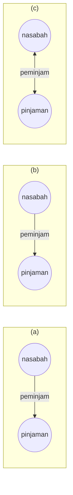

| Diagram | Arti                                                                                                                                    |
| ------- | --------------------------------------------------------------------------------------------------------------------------------------- |
| **(a)** | Panah ke arah **nasabah** → setiap pinjaman dimiliki **paling banyak satu** nasabah.                                                    |
| **(b)** | Panah ke arah **pinjaman** → setiap nasabah memiliki **paling banyak satu** pinjaman.                                                   |
| **(c)** | Panah **dua arah** → setiap nasabah punya **paling banyak satu** pinjaman, dan setiap pinjaman dimiliki **paling banyak satu** nasabah. |

:::tip Cara Membaca
Panah selalu menunjuk ke sisi **"paling banyak satu"**.
Kalau tidak ada panah, berarti **"banyak"** (many).
:::

---

## 11. Participation Constraint

**Participation Constraint** menentukan **apakah semua instance entitas wajib terlibat** dalam sebuah relasi.

### 11.1 Total Participation (Wajib)

**Total Participation** — digambarkan dengan **dua garis** — artinya **setiap entitas** dalam himpunan entitas berpartisipasi dalam **minimal satu** relationship.

**Contoh:** Partisipasi **Pinjaman** dalam `Peminjaman` adalah **total** — setiap pinjaman **pasti** memiliki customer.

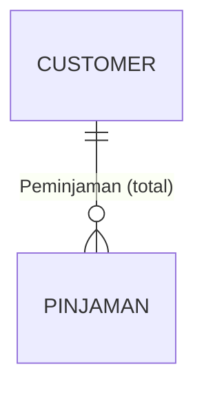

### 11.2 Partial Participation (Opsional)

**Partial Participation** artinya **beberapa entitas mungkin tidak berpartisipasi** dalam relationship.

**Contoh:** Partisipasi **Customer** dalam `Peminjaman` adalah **parsial** — beberapa customer mungkin hanya punya tabungan.

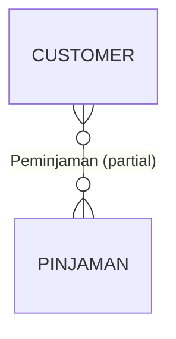

### 11.3 Ringkasan

| Jenis       |      Notasi       | Arti                   |
| ----------- | :---------------: | ---------------------- |
| **Total**   | Garis ganda `══`  | **Wajib** terlibat.    |
| **Partial** | Garis tunggal `─` | **Opsional** terlibat. |

:::tip Cara Mengingat

- **Total** → **wajib** → garis **double** (═).
- **Partial** → **opsional** → garis **single** (─).
  :::

---

## 12. Referential Integrity

**Referential Integrity** menjamin bahwa **hubungan antar tabel tetap konsisten**.

### Contoh Kasus

Pada relasi **many-to-one** `Mengelola`:

- Sebuah departemen memiliki **paling banyak satu** manager.
- Jadi departemen **mungkin tidak memiliki** manager.

**Jika dikombinasikan dengan partisipasi total**, maka **dipastikan hanya satu nilai yang ada** — departemen **wajib** punya manager, dan manager-nya **tepat satu**.

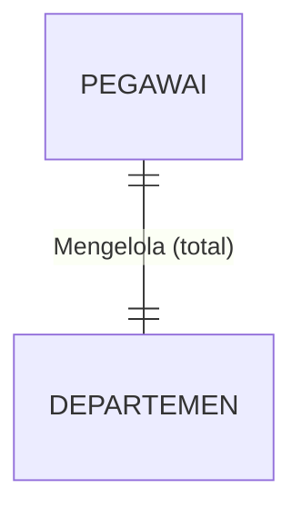

:::danger Konsekuensi Referential Integrity
**Proses penghapusan seorang pegawai yang mengelola sebuah departemen DILARANG!**

Karena kalau pegawai tersebut dihapus, departemen akan kehilangan manager-nya — melanggar participation constraint (total participation).
:::

---

## 13. Weak Entity Set

**Weak Entity Set** (Himpunan Entitas Lemah) adalah himpunan entitas yang **tidak memiliki primary key**.

### Karakteristik

- Keberadaan weak entity **tergantung** pada entitas lain (**identifying entity set**).
- Weak entity **harus** berhubungan dengan entitas lain melalui **total, one-to-many relationship**.
- **Discriminator** (partial key) — atribut yang membedakan antar entitas dalam weak entity set.
- **Primary key weak entity** = primary key entitas kuat **+ discriminator**.

### Notasi

| Simbol                      | Arti                        |
| --------------------------- | --------------------------- |
| **Persegi panjang dobel**   | Weak Entity                 |
| **Garis bawah putus-putus** | Discriminator (partial key) |
| **Belah ketupat dobel**     | Identifying Relationship    |

### Contoh: Pinjaman & Pembayaran

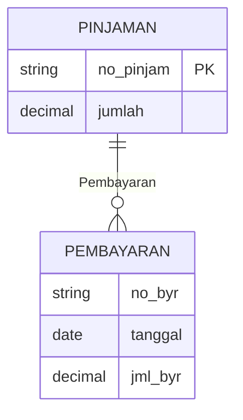

- `Pembayaran` adalah **weak entity** — tidak punya key sendiri.
- `no_byr` adalah **discriminator**.
- **Primary key untuk Pembayaran:** `(no_pinjam, no_byr)`.

### Strong vs Weak Entity

| Aspek           | Strong Entity           | Weak Entity                   |
| --------------- | ----------------------- | ----------------------------- |
| **Primary key** | Punya sendiri           | Impor dari strong entity      |
| **Keberadaan**  | Independen              | Tergantung identifying entity |
| **Notasi**      | Persegi panjang tunggal | Persegi panjang dobel         |
| **Contoh**      | Mahasiswa, Dosen        | Pembayaran, Tanggungan        |

:::info Insight
Setiap entity set **memerlukan key**. Kalau weak entity tidak punya cukup atribut untuk membentuk key, maka **harus mengimpor atribut dari strong entity**.
:::

---

## 14. Notasi ERD Lengkap

### 14.1 Notasi Chen

| No. | Simbol                | Arti                     |
| :-: | --------------------- | ------------------------ |
|  1  | Persegi panjang       | Entity                   |
|  2  | Persegi panjang dobel | Weak Entity              |
|  3  | Belah ketupat         | Relationship             |
|  4  | Belah ketupat dobel   | Identifying Relationship |
|  5  | Elips                 | Atribut                  |
|  6  | Elips garis bawah     | Atribut Primary Key      |
|  7  | Elips dobel           | Atribut Multivalue       |
|  8  | Elips bercabang       | Atribut Composite        |
|  9  | Elips putus-putus     | Atribut Derivatif        |

### 14.2 Notasi Crow's Foot

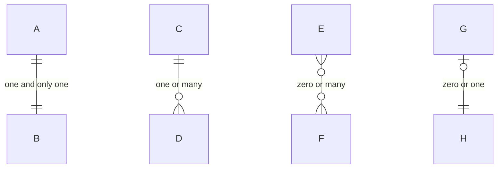

| Simbol | Arti             |
| ------ | ---------------- |
| `\|\|` | One (tepat satu) |
| `o\|`  | Zero or one      |
| `}o`   | Zero or many     |
| `}\|`  | One or many      |

**Kombinasi:**

| Notasi       | Arti             |
| ------------ | ---------------- |
| `\|\|--\|\|` | One and only one |
| `\|\|--o{`   | One or many      |
| `}o--o{`     | Zero or many     |
| `\|o--\|\|`  | Zero or one      |

---

## 15. Transformasi ERD ke Skema Relasional

### 15.1 Aturan Transformasi

|  No.  | Aturan                                                                       |
| :---: | ---------------------------------------------------------------------------- |
| **1** | Setiap **strong entity** → 1 tabel.                                          |
| **2** | Setiap **weak entity** → 1 tabel dengan FK ke strong entity.                 |
| **3** | Relasi **1:1** → FK di salah satu tabel (biasanya sisi total participation). |
| **4** | Relasi **1:N** → FK di sisi **Many**.                                        |
| **5** | Relasi **M:N** → buat **tabel baru** dengan FK dari kedua entitas.           |
| **6** | **Multivalued attribute** → buat tabel baru.                                 |
| **7** | **Composite attribute** → dipecah menjadi kolom-kolom.                       |
| **8** | **Derived attribute** → **tidak** disimpan (dihitung saat query).            |

### 15.2 Alur Transformasi

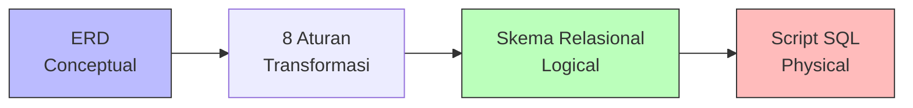

### 15.3 Contoh Transformasi

**ERD:**

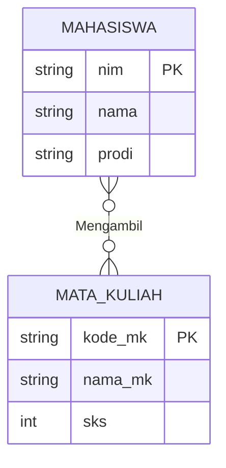

**Skema Relasional:**

```sql
CREATE TABLE mahasiswa (
    nim     VARCHAR(10) PRIMARY KEY,
    nama    VARCHAR(100) NOT NULL,
    prodi   VARCHAR(50)
);

CREATE TABLE mata_kuliah (
    kode_mk VARCHAR(10) PRIMARY KEY,
    nama_mk VARCHAR(100) NOT NULL,
    sks     INT CHECK (sks BETWEEN 1 AND 6)
);

-- Tabel jembatan untuk relasi M:N
CREATE TABLE krs (
    nim     VARCHAR(10),
    kode_mk VARCHAR(10),
    nilai   CHAR(2),
    PRIMARY KEY (nim, kode_mk),
    FOREIGN KEY (nim) REFERENCES mahasiswa(nim),
    FOREIGN KEY (kode_mk) REFERENCES mata_kuliah(kode_mk)
);
```

:::tip Kunci Transformasi

- **Entitas** → **Tabel**.
- **Atribut** → **Kolom**.
- **Primary Key** → **PRIMARY KEY**.
- **Relasi M:N** → **Tabel baru**.
- **Foreign Key** → **FOREIGN KEY**.
  :::

---

## 16. Studi Kasus: Perpustakaan

### 16.1 Identifikasi Entitas

| Entitas        | Atribut                                                        |
| -------------- | -------------------------------------------------------------- |
| **Anggota**    | `id_anggota` (PK), `nama`, `alamat`, `no_telp`                 |
| **Buku**       | `isbn` (PK), `judul`, `penulis`, `penerbit`, `tahun`           |
| **Peminjaman** | `id_pinjam` (PK), `tanggal_pinjam`, `tanggal_kembali`, `denda` |

### 16.2 ERD Lengkap

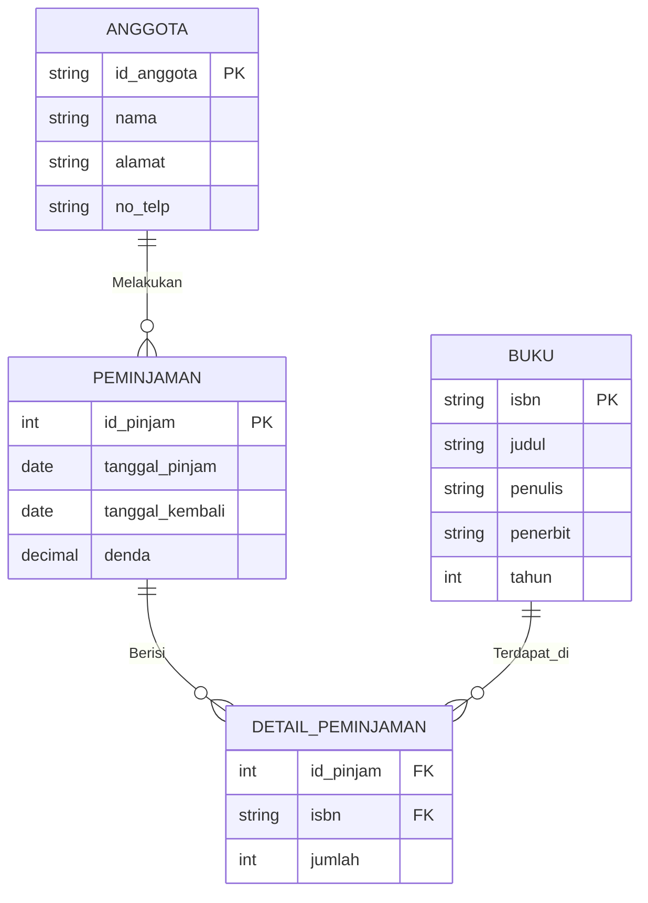

### 16.3 Skema Relasional

```sql
CREATE TABLE anggota (
    id_anggota  VARCHAR(10) PRIMARY KEY,
    nama        VARCHAR(100) NOT NULL,
    alamat      TEXT,
    no_telp     VARCHAR(15)
);

CREATE TABLE buku (
    isbn        VARCHAR(20) PRIMARY KEY,
    judul       VARCHAR(200) NOT NULL,
    penulis     VARCHAR(100),
    penerbit    VARCHAR(100),
    tahun       INT
);

CREATE TABLE peminjaman (
    id_pinjam       INT PRIMARY KEY AUTO_INCREMENT,
    id_anggota      VARCHAR(10),
    tanggal_pinjam  DATE NOT NULL,
    tanggal_kembali DATE,
    denda           DECIMAL(10,2) DEFAULT 0,
    FOREIGN KEY (id_anggota) REFERENCES anggota(id_anggota)
);

CREATE TABLE detail_peminjaman (
    id_pinjam   INT,
    isbn        VARCHAR(20),
    jumlah      INT DEFAULT 1,
    PRIMARY KEY (id_pinjam, isbn),
    FOREIGN KEY (id_pinjam) REFERENCES peminjaman(id_pinjam),
    FOREIGN KEY (isbn) REFERENCES buku(isbn)
);
```

---

## 17. Panduan Draw.io

**Draw.io** (sekarang **diagrams.net**) adalah tools **gratis** dan **open source** untuk membuat ERD.

### 17.1 Langkah-Langkah Dasar

1. Buka [app.diagrams.net](https://app.diagrams.net/).
2. Pilih **Create New Diagram** → **Blank Diagram**.
3. Di panel kiri, klik **More Shapes** → centang **Entity Relation**.
4. Seret shape **Entity**, **Attribute**, **Relationship** ke canvas.
5. Hubungkan dengan garis, atur **cardinality** di properties.
6. Simpan sebagai `.drawio` atau ekspor ke `.png`/`.pdf`.

### 17.2 Tips Praktis

| Tips                | Keterangan                                                |
| ------------------- | --------------------------------------------------------- |
| **Gunakan grid**    | Aktifkan _View → Grid_ untuk perataan.                    |
| **Konsisten warna** | Bedakan entitas, atribut, dan relasi dengan warna.        |
| **Kelompokkan**     | Gunakan _container_ untuk modul-modul besar.              |
| **Label jelas**     | Nama entitas **huruf kapital**, atribut **huruf kecil**.  |
| **Simpan versi**    | Simpan `.drawio` untuk edit, ekspor `.png` untuk laporan. |

### 17.3 Video Referensi

| Video                                                     | Fokus                                                    |
| --------------------------------------------------------- | -------------------------------------------------------- |
| **Membuat ERD dengan Draw.io (Studi Kasus Perpustakaan)** | Perancangan entitas, atribut kunci, relasi perpustakaan. |
| **How to Draw ER Diagram using Draw.io (From Scratch)**   | Shape menu, atribut kunci, pengelompokan objek.          |
| **ERD Toko Buku Online, CDM, & PDM (Draw.io)**            | ERD → CDM → PDM untuk toko buku online.                  |

:::tip Petunjuk Belajar
Simak video referensi di atas untuk memahami **teknik dasar penggunaan elemen ERD** dan cara pengoperasian **Draw.io** dari tingkat dasar hingga implementasi studi kasus kompleks.
:::

---

## 18. Istilah Penting

| Istilah                   | Arti                                        |
| ------------------------- | ------------------------------------------- |
| **Entity**                | Objek/kejadian yang disimpan datanya.       |
| **Entity Set**            | Himpunan entitas serupa.                    |
| **Attribute**             | Properti dari entitas.                      |
| **Domain**                | Himpunan nilai yang boleh dimiliki atribut. |
| **Relationship**          | Hubungan antar entitas.                     |
| **Cardinality**           | Derajat relasi (1:1, 1:N, M:N).             |
| **Participation**         | Wajib (total) atau opsional (partial).      |
| **Superkey**              | Atribut yang membedakan entitas.            |
| **Candidate Key**         | Superkey paling minimal.                    |
| **Primary Key**           | Candidate key yang dipilih.                 |
| **Foreign Key**           | Atribut yang merujuk ke PK tabel lain.      |
| **Weak Entity**           | Entitas yang bergantung pada entitas lain.  |
| **Strong Entity**         | Entitas yang punya identitas sendiri.       |
| **Identifying Entity**    | Entitas kuat penopang weak entity.          |
| **Discriminator**         | Partial key dari weak entity.               |
| **Composite Attribute**   | Atribut yang bisa dipecah.                  |
| **Multivalued Attribute** | Atribut yang bernilai banyak.               |
| **Derived Attribute**     | Atribut hasil perhitungan.                  |
| **Referential Integrity** | Jaminan konsistensi relasi antar tabel.     |
| **CDM**                   | Conceptual Data Model.                      |
| **PDM**                   | Physical Data Model.                        |
| **ERD**                   | Entity Relationship Diagram.                |

---

## 19. Ringkasan

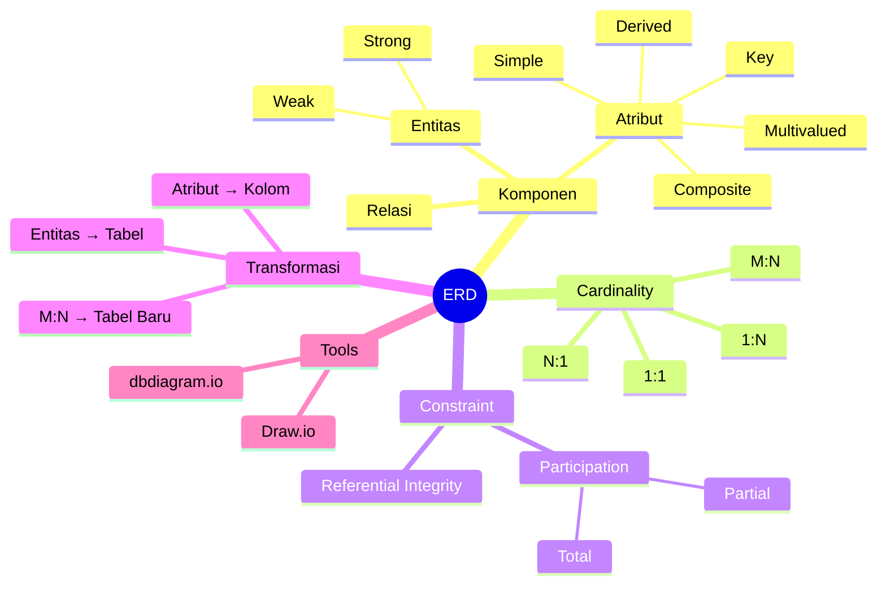

**Poin-poin kunci:**

- **Mengapa ERD?** — karena rancangan kompleks butuh model yang menjembatani bisnis & skema database.
- **4 tahap desain**: Need Analysis → **Data Model (ER)** → Relational Schema → DBMS + Query.
- **ERD** = Entitas + Atribut + Relasi.
- **Keys** bertingkat: Superkey → Candidate Key → Primary Key.
- **Entitas bisa punya peran berbeda** (contoh: supervisor ↔ bawahan).
- **Cardinality**: 1:1, 1:N, N:1, M:N.
- **Tanda panah** = "paling banyak satu".
- **Participation**: total (wajib) vs partial (opsional).
- **Referential Integrity** melindungi konsistensi relasi.
- **Weak Entity** tidak punya key sendiri — impor dari strong entity.
- **Transformasi**: entitas → tabel, atribut → kolom, M:N → tabel baru.
- **Draw.io** adalah tools gratis untuk ERD.

:::tip Pesan Kunci
Jangan langsung menulis SQL. **Rancang dulu ERD-nya.** Waktu yang dihabiskan di tahap pemodelan akan menghemat berjam-jam debugging di tahap implementasi.
:::

---

## Referensi

1. Silberschatz, Korth, Sudarshan — _Database System Concept_, Bab 6 (_Entity-Relationship Model_).
   Slides: http://codex.cs.yale.edu/avi/db-book/db6/slide-dir/index.html
2. Hilda Widyastuti — _Slide Relational Database_.
3. Metta Santiputri — _Slide Basis Data_.
4. Modul Praktikum Pertemuan 2 — _Entity Relationship Diagram (ER-Diagram)_.
5. Video Tutorial Draw.io — Studi Kasus Perpustakaan, Toko Buku Online, ERD from Scratch.

---

## Halaman Terkait

| Halaman                                                                                                                        | Deskripsi                                    |
| ------------------------------------------------------------------------------------------------------------------------------ | -------------------------------------------- |
| [Pertemuan 1 — Introduction to Database Concepts](/docs/v1/courses/rpl106-pengantar-basis-data/introduction-database-concepts) | Materi sebelumnya — konsep dasar basis data. |
| [Halaman Mata Kuliah RPL106](/docs/v1/courses/rpl106-pengantar-basis-data/)                                                    | Overview mata kuliah.                        |
| [Format Halaman Konten](/docs/format/page)                                                                                     | Panduan penulisan halaman ini.               |
