# Pertemuan 2 — Entity Relationship Diagram (ER-Diagram)

**Mata Kuliah:** RPL106 — Pengantar Basis Data
**Dosen:** Ahmadi Irmansyah Lubis

## Tujuan Pembelajaran

Setelah pertemuan ini, mahasiswa mampu:

1. Memahami peran pemodelan data dalam siklus pengembangan basis data.
2. Mengidentifikasi komponen ERD: entitas, atribut, tipe relasi.
3. Menganalisis derajat relasi (cardinality): 1:1, 1:N, M:N.
4. Memahami participation constraint, atribut turunan, dan atribut komposit.
5. Mengenali weak entity, role in relationship, dan referential integrity.
6. Mentransformasikan ERD ke skema relasional.

## 1. Mengapa ER Diagram?

Pada skala tertentu, perancang database dapat langsung memutuskan rancangan basis data — relasi, atribut, constraint. Namun dalam prakteknya:

-   Rancangan seringkali kompleks, sulit langsung menentukan atribut dan relasi.
-   Seringkali tak seorang pun memahami secara menyeluruh kebutuhan data.
-   Perancang harus berinteraksi dengan customer.
-   Dibutuhkan model yang menerjemahkan kebutuhan menjadi skema konseptual.

ERD menjawab: **"Data apa yang perlu disimpan, dan bagaimana hubungan antar data tersebut?"** — sebelum menyentuh DBMS.

## 2. Review: Tahapan Desain Database

```

Need Analysis → Data Model (ER) → Relational Schema → DBMS + Query

```

Pertemuan ini fokus pada tahap kedua — **Data Model (ER)**.

## 3. Conceptual Design

ER Model adalah teknik pemodelan data yang mengilustrasikan secara visual entitas dan relasi antar entitas.

Pertanyaan yang dijawab ER Model:

| Pertanyaan                                   | Contoh                               |
| -------------------------------------------- | ------------------------------------ |
| Apa saja entitas & relationship?             | Mahasiswa, Mata Kuliah, KRS          |
| Informasi apa yang harus disimpan?           | Nama mahasiswa, SKS, nilai           |
| Integrity constraint / business rules?       | Satu mahasiswa maksimal ambil 24 SKS |
| Bagaimana skema database digambarkan?        | ER Diagram                           |
| Bagaimana ERD dipetakan ke skema relasional? | Konversi ke tabel SQL                |

### Tingkatan Model Data

| Tingkat | Nama       | Fokus                           | Contoh                  |
| :-----: | ---------- | ------------------------------- | ----------------------- |
|    1    | Conceptual | Apa yang dibutuhkan bisnis?     | ERD, CDM                |
|    2    | Logical    | Bagaimana struktur relasional?  | Skema relasional, PDM   |
|    3    | Physical   | Bagaimana implementasi di DBMS? | SQL DDL, Index, Partisi |

## 4. Entity Relationship Diagram (ERD)

ERD adalah model konseptual yang menggambarkan:

-   **Entitas** (objek/kejadian) yang ingin disimpan datanya.
-   **Atribut** (properti) dari setiap entitas.
-   **Hubungan** (relationship) antar entitas.

Karakteristik:

| Karakteristik       | Penjelasan                              |
| ------------------- | --------------------------------------- |
| Bebas detail teknis | Tidak peduli DBMS apa yang akan dipakai |
| Fokus struktur data | Bukan proses bisnis                     |
| Bersifat grafis     | Mudah dibaca dan dikomunikasikan        |
| Menjadi dasar       | Acuan pembuatan skema relasional        |

## 5. Komponen Utama ERD

ERD terdiri dari tiga komponen inti: entitas, atribut, relasi.

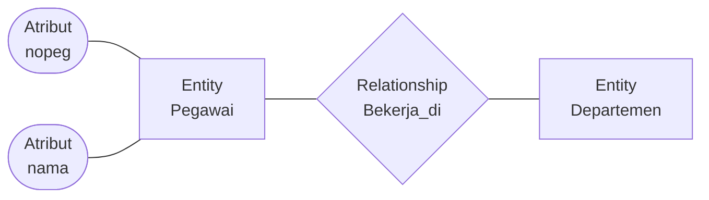

Diagram di atas: **persegi** = entity, **belah ketupat** = relationship, **elips** = atribut, **garis** = penghubung.

### 5.1 Entitas (Entity)

Objek dunia nyata yang dapat dibedakan dari objek lain. Dideskripsikan menggunakan kumpulan atribut.

-   **Entity set** — himpunan entitas serupa yang punya properti sama.
-   Semua entitas dalam satu entity set punya atribut yang sama.
-   Setiap entity set memiliki key.

Jenis entitas:

| Jenis         | Ciri                    | Contoh              |
| ------------- | ----------------------- | ------------------- |
| Strong Entity | Punya key sendiri       | Mahasiswa (NIM)     |
| Weak Entity   | Tidak punya key sendiri | Pembayaran (no_byr) |

### 5.2 Atribut (Attribute)

Properti dari entitas. **Domain** adalah himpunan nilai yang boleh dimiliki atribut (contoh: `18 < umur < 65` untuk atribut umur pegawai).

Tipe atribut:

| Jenis         | Notasi              | Contoh                         |
| ------------- | ------------------- | ------------------------------ |
| Simple        | Oval                | `nopeg`, `namadpn`             |
| Composite     | Oval bercabang      | `nama` → `namadpn`, `namablkg` |
| Single-valued | Oval                | `nopeg` (satu nilai)           |
| Multivalued   | Oval dobel          | `notelp` (banyak nilai)        |
| Derived       | Oval putus-putus    | `umur` (dari `tgllahir`)       |
| Key / Primary | Oval bergaris bawah | `nopeg`                        |

Contoh atribut pegawai:

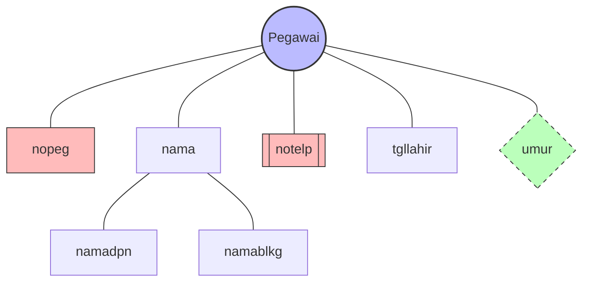

-   `nopeg` — primary key (garis bawah)
-   `notelp` — multivalued (oval dobel)
-   `umur` — derived (oval putus-putus)
-   `nama` → `namadpn`, `namablkg` — composite

### 5.3 Relasi (Relationship)

Hubungan bermakna antar entitas. Contoh: "pegawai Budi bekerja di departemen Farmasi."

-   Harus ditentukan pegawai mana dan departemen mana yang berhubungan.
-   Diperlukan nilai key dari masing-masing entitas, disimpan bersama-sama.

Contoh relasi:

| Relasi     | Entitas terlibat        |
| ---------- | ----------------------- |
| Bekerja_di | Pegawai ↔ Departemen    |
| Mengambil  | Mahasiswa ↔ Mata Kuliah |
| Mengajar   | Dosen ↔ Mata Kuliah     |
| Mengelola  | Pegawai ↔ Departemen    |

### 5.4 Simbol ERD

| Simbol            | Arti                                        |
| ----------------- | ------------------------------------------- |
| Persegi panjang   | Himpunan entitas                            |
| Belah ketupat     | Himpunan relationship                       |
| Garis             | Penghubung atribut ↔ entitas ↔ relationship |
| Elips             | Atribut                                     |
| Elips dobel       | Multivalued attribute                       |
| Elips putus-putus | Derived attribute                           |
| Garis bawah       | Primary key                                 |

## 6. Instance dari ER Diagram

ER Diagram mendeskripsikan **skema** database. Database instance berisi **data** yang mengikuti struktur tersebut.

**Skema Departemen:**

| Nodep | Namadep    |      Budget |
| ----- | ---------- | ----------: |
| D100  | Farmasi    | 120.000.000 |
| D101  | Kardiologi | 540.000.000 |
| D102  | HR         |  20.000.000 |

**Skema Bekerja_di:**

| Namadep | Nopeg        | Mulai |
| ------- | ------------ | ----: |
| D100    | 123-45-6789  |  1964 |
| D101    | 222-33-4444  |  2005 |
| D102    | 999-777-5555 |  1999 |

ERD = cetak biru bangunan. Data = perabot yang nanti diletakkan di dalamnya.

## 7. Keys

Setiap entitas berbeda. **Key** adalah sekelompok atribut yang dapat membedakan suatu entitas dengan entitas lain.

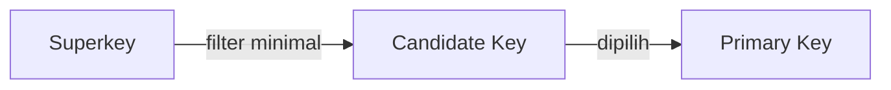

| Istilah       | Definisi                                        | Contoh (Mahasiswa)                      |
| ------------- | ----------------------------------------------- | --------------------------------------- |
| Superkey      | Satu atau lebih atribut yang membedakan entitas | `{NIM, Nama}`, `{NIM}`, `{NIM, Alamat}` |
| Candidate Key | Superkey paling minimal                         | `{NIM}`, `{Email}`                      |
| Primary Key   | Candidate key yang dipilih                      | `{NIM}`                                 |

`{NIM, Nama}` adalah superkey, tapi bukan candidate key — karena `{NIM}` saja sudah cukup. Candidate key harus minimal.

## 8. Peran dalam Relationship

Entitas yang sama dapat berpartisipasi dalam beberapa himpunan relationship yang berbeda, atau memiliki peran berbeda dalam himpunan yang sama.

### 8.1 Entitas dengan Beberapa Relasi

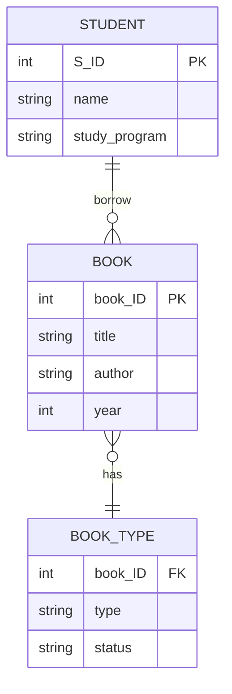

### 8.2 Self-Referencing Relationship

Contoh: **Pegawai** dapat menjadi supervisor dan bawahan dalam relasi yang sama.

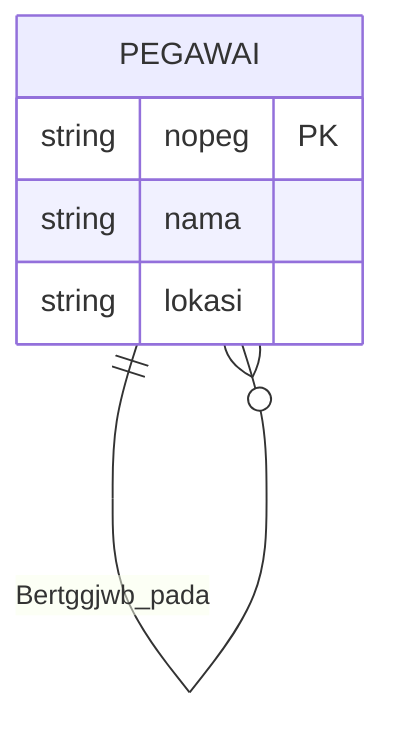

Skema relasional:

```
bertggjwb_pada(supervisor_ssn, bawahan_ssn)
```

Relasi rekursif sering muncul di dunia nyata: karyawan–atasan, mahasiswa–mentor, kategori–subkategori.

## 9. Derajat Relasi (Cardinality)

Cardinality menyatakan jumlah entitas yang dapat diasosiasikan dengan entitas lain.

### 9.1 One-to-One (1:1)

Setiap Departemen punya paling banyak satu manajer; seorang manajer mengelola paling banyak satu departemen.

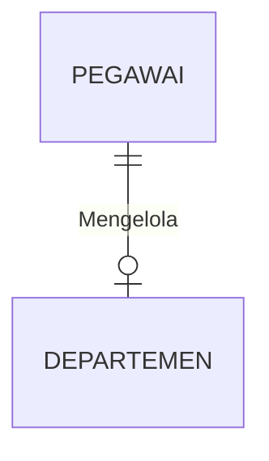

Implementasi: foreign key di salah satu tabel + constraint `UNIQUE`.

### 9.2 One-to-Many (1:N)

Setiap Departemen punya paling banyak satu manajer; seorang manajer dapat mengelola beberapa departemen.

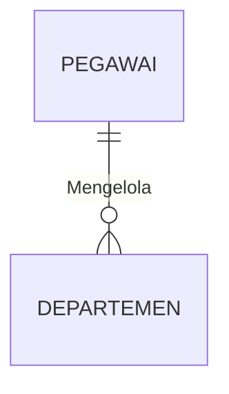

Sudut pandang:

-   Pegawai → Departemen = One-to-Many.
-   Departemen → Pegawai = Many-to-One.

Implementasi: foreign key di sisi **Many**.

### 9.3 Many-to-Many (M:N)

Seorang Pegawai dapat bekerja di beberapa Departemen; sebuah Departemen dapat punya banyak Pegawai.

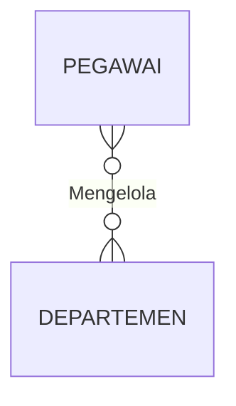

Implementasi: butuh **tabel jembatan** (junction table). Relasi M:N tidak bisa diimplementasikan langsung menjadi dua tabel saja.

### 9.4 Ringkasan Cardinality

| Kardinalitas | Contoh                 | Tabel Jembatan? |
| ------------ | ---------------------- | :-------------: |
| One-to-One   | Pegawai ↔ Departemen   |      Tidak      |
| One-to-Many  | Departemen ↔ Pegawai   |      Tidak      |
| Many-to-One  | Kebalikan dari 1:N     |      Tidak      |
| Many-to-Many | Pegawai ↔ Departemen   |     **Ya**      |
| Ternary      | Mahasiswa ↔ MK ↔ Dosen |     **Ya**      |

## 10. Arti Tanda Panah

Tanda panah berarti "paling banyak satu" (at most one). Tanda panah **tidak menjamin keberadaan** entitas yang ditunjuk — misalnya, ada departemen yang tidak memiliki manajer, ini boleh saja selama kardinalitasnya "paling banyak satu".

Perbedaan tiga ERD (Nasabah & Pinjaman):

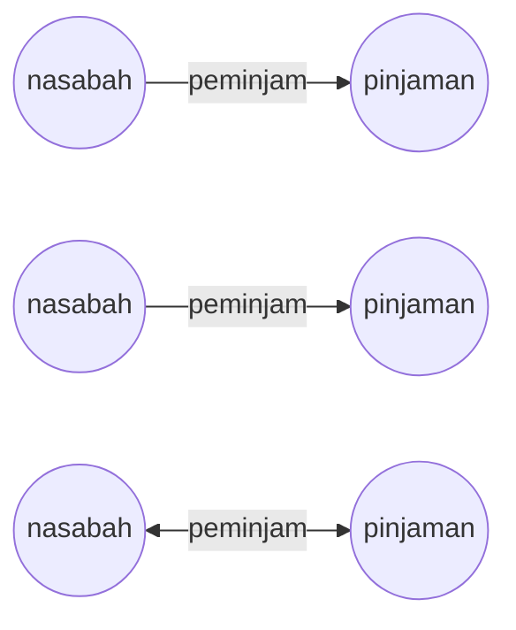

| Diagram           | Arti                                                                                                      |
| ----------------- | --------------------------------------------------------------------------------------------------------- |
| Panah ke nasabah  | Setiap pinjaman dimiliki paling banyak satu nasabah                                                       |
| Panah ke pinjaman | Setiap nasabah memiliki paling banyak satu pinjaman                                                       |
| Panah dua arah    | Setiap nasabah punya paling banyak satu pinjaman, dan setiap pinjaman dimiliki paling banyak satu nasabah |

Panah selalu menunjuk ke sisi "paling banyak satu". Kalau tidak ada panah, berarti "banyak" (many).

## 11. Participation Constraint

Menentukan apakah semua instance entitas wajib terlibat dalam sebuah relasi.

### 11.1 Total Participation (Wajib)

Digambarkan dengan dua garis. Setiap entitas dalam himpunan berpartisipasi dalam minimal satu relationship.

Contoh: partisipasi Pinjaman dalam `Peminjaman` bersifat total — setiap pinjaman pasti memiliki customer.

### 11.2 Partial Participation (Opsional)

Beberapa entitas mungkin tidak berpartisipasi dalam relationship.

Contoh: partisipasi Customer dalam `Peminjaman` bersifat parsial — beberapa customer mungkin hanya punya tabungan.

### 11.3 Ringkasan

| Jenis   |      Notasi       | Arti              |
| ------- | :---------------: | ----------------- |
| Total   |  Garis ganda (═)  | Wajib terlibat    |
| Partial | Garis tunggal (─) | Opsional terlibat |

## 12. Referential Integrity

Menjamin hubungan antar tabel tetap konsisten.

Pada relasi many-to-one `Mengelola`: sebuah departemen punya paling banyak satu manajer, jadi departemen mungkin tidak memiliki manajer.

Jika dikombinasikan dengan partisipasi total, maka dipastikan hanya satu nilai yang ada — departemen wajib punya manajer, dan manajernya tepat satu.

**Konsekuensi:** menghapus pegawai yang mengelola departemen **dilarang** — karena akan melanggar participation constraint (total).

## 13. Weak Entity Set

Himpunan entitas yang tidak memiliki primary key.

Karakteristik:

-   Keberadaannya tergantung pada entitas lain (**identifying entity set**).
-   Harus berhubungan dengan entitas lain melalui total, one-to-many relationship.
-   **Discriminator** (partial key) — atribut yang membedakan antar entitas dalam weak entity set.
-   Primary key weak entity = primary key entitas kuat + discriminator.

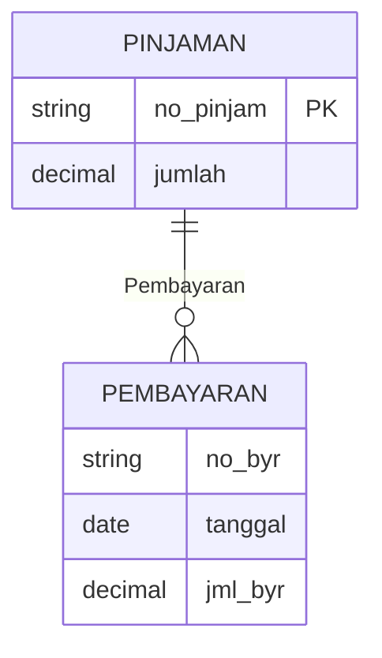

`Pembayaran` adalah weak entity — tidak punya key sendiri. `no_byr` adalah discriminator. Primary key untuk Pembayaran: `(no_pinjam, no_byr)`.

Notasi:

| Simbol                  | Arti                        |
| ----------------------- | --------------------------- |
| Persegi panjang dobel   | Weak Entity                 |
| Garis bawah putus-putus | Discriminator (partial key) |
| Belah ketupat dobel     | Identifying Relationship    |

| Aspek       | Strong Entity           | Weak Entity                   |
| ----------- | ----------------------- | ----------------------------- |
| Primary key | Sendiri                 | Impor dari strong entity      |
| Keberadaan  | Independen              | Tergantung identifying entity |
| Notasi      | Persegi panjang tunggal | Persegi panjang dobel         |
| Contoh      | Mahasiswa, Dosen        | Pembayaran, Tanggungan        |

## 14. Notasi ERD Lengkap

### 14.1 Notasi Chen

| No. | Simbol                | Arti                     |
| :-: | --------------------- | ------------------------ |
|  1  | Persegi panjang       | Entity                   |
|  2  | Persegi panjang dobel | Weak Entity              |
|  3  | Belah ketupat         | Relationship             |
|  4  | Belah ketupat dobel   | Identifying Relationship |
|  5  | Elips                 | Atribut                  |
|  6  | Elips garis bawah     | Atribut Primary Key      |
|  7  | Elips dobel           | Atribut Multivalue       |
|  8  | Elips bercabang       | Atribut Composite        |
|  9  | Elips putus-putus     | Atribut Derivatif        |

### 14.2 Notasi Crow's Foot

| Simbol | Arti             |
| ------ | ---------------- |
| `\|\|` | One (tepat satu) |
| `o\|`  | Zero or one      |
| `}o`   | Zero or many     |
| `}\|`  | One or many      |

Kombinasi:

| Notasi       | Arti             |
| ------------ | ---------------- |
| `\|\|--\|\|` | One and only one |
| `\|\|--o{`   | One or many      |
| `}o--o{`     | Zero or many     |
| `\|o--\|\|`  | Zero or one      |

## 15. Transformasi ERD ke Skema Relasional

### 15.1 Aturan Transformasi

| No. | Aturan                                                                  |
| :-: | ----------------------------------------------------------------------- |
|  1  | Setiap strong entity → 1 tabel                                          |
|  2  | Setiap weak entity → 1 tabel dengan FK ke strong entity                 |
|  3  | Relasi 1:1 → FK di salah satu tabel (biasanya sisi total participation) |
|  4  | Relasi 1:N → FK di sisi **Many**                                        |
|  5  | Relasi M:N → buat tabel baru dengan FK dari kedua entitas               |
|  6  | Multivalued attribute → buat tabel baru                                 |
|  7  | Composite attribute → dipecah menjadi kolom-kolom                       |
|  8  | Derived attribute → tidak disimpan (dihitung saat query)                |

### 15.2 Contoh Transformasi M:N

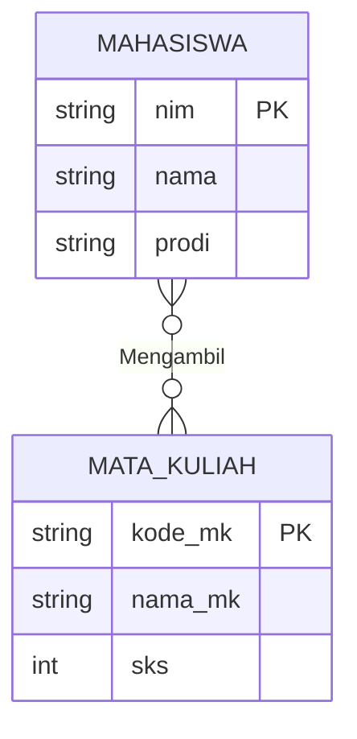

Hasil skema relasional:

```sql
CREATE TABLE mahasiswa (
    nim     VARCHAR(10) PRIMARY KEY,
    nama    VARCHAR(100) NOT NULL,
    prodi   VARCHAR(50)
);

CREATE TABLE mata_kuliah (
    kode_mk VARCHAR(10) PRIMARY KEY,
    nama_mk VARCHAR(100) NOT NULL,
    sks     INT CHECK (sks BETWEEN 1 AND 6)
);

-- Tabel jembatan untuk relasi M:N
CREATE TABLE krs (
    nim     VARCHAR(10),
    kode_mk VARCHAR(10),
    nilai   CHAR(2),
    PRIMARY KEY (nim, kode_mk),
    FOREIGN KEY (nim) REFERENCES mahasiswa(nim),
    FOREIGN KEY (kode_mk) REFERENCES mata_kuliah(kode_mk)
);
```

Kunci transformasi:

-   Entitas → tabel.
-   Atribut → kolom.
-   Primary key → `PRIMARY KEY`.
-   Relasi M:N → tabel baru.
-   Foreign key → `FOREIGN KEY`.

## 16. Studi Kasus: Perpustakaan

### 16.1 Identifikasi Entitas

| Entitas    | Atribut                                                        |
| ---------- | -------------------------------------------------------------- |
| Anggota    | `id_anggota` (PK), `nama`, `alamat`, `no_telp`                 |
| Buku       | `isbn` (PK), `judul`, `penulis`, `penerbit`, `tahun`           |
| Peminjaman | `id_pinjam` (PK), `tanggal_pinjam`, `tanggal_kembali`, `denda` |

### 16.2 ERD

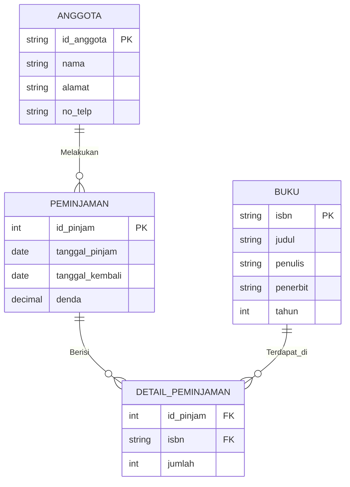

### 16.3 Skema Relasional

```sql
CREATE TABLE anggota (
    id_anggota  VARCHAR(10) PRIMARY KEY,
    nama        VARCHAR(100) NOT NULL,
    alamat      TEXT,
    no_telp     VARCHAR(15)
);

CREATE TABLE buku (
    isbn        VARCHAR(20) PRIMARY KEY,
    judul       VARCHAR(200) NOT NULL,
    penulis     VARCHAR(100),
    penerbit    VARCHAR(100),
    tahun       INT
);

CREATE TABLE peminjaman (
    id_pinjam       INT PRIMARY KEY AUTO_INCREMENT,
    id_anggota      VARCHAR(10),
    tanggal_pinjam  DATE NOT NULL,
    tanggal_kembali DATE,
    denda           DECIMAL(10,2) DEFAULT 0,
    FOREIGN KEY (id_anggota) REFERENCES anggota(id_anggota)
);

CREATE TABLE detail_peminjaman (
    id_pinjam   INT,
    isbn        VARCHAR(20),
    jumlah      INT DEFAULT 1,
    PRIMARY KEY (id_pinjam, isbn),
    FOREIGN KEY (id_pinjam) REFERENCES peminjaman(id_pinjam),
    FOREIGN KEY (isbn) REFERENCES buku(isbn)
);
```

## 17. Panduan Draw.io

Draw.io (sekarang [diagrams.net](https://app.diagrams.net/)) adalah tools gratis dan open source untuk membuat ERD.

### Langkah Dasar

1. Buka [app.diagrams.net](https://app.diagrams.net/).
2. Pilih **Create New Diagram** → **Blank Diagram**.
3. Panel kiri: **More Shapes** → centang **Entity Relation**.
4. Seret shape **Entity**, **Attribute**, **Relationship** ke canvas.
5. Hubungkan dengan garis, atur cardinality di properties.
6. Simpan sebagai `.drawio` atau ekspor ke `.png`/`.pdf`.

### Tips

| Tips            | Keterangan                                      |
| --------------- | ----------------------------------------------- |
| Gunakan grid    | Aktifkan View → Grid untuk perataan             |
| Konsisten warna | Bedakan entitas, atribut, relasi dengan warna   |
| Kelompokkan     | Gunakan container untuk modul besar             |
| Label jelas     | Nama entitas huruf kapital, atribut huruf kecil |
| Simpan versi    | `.drawio` untuk edit, `.png` untuk laporan      |

### Video Referensi

| Video                                                 | Fokus                                      |
| ----------------------------------------------------- | ------------------------------------------ |
| Membuat ERD dengan Draw.io (Studi Kasus Perpustakaan) | Perancangan entitas, atribut kunci, relasi |
| How to Draw ER Diagram using Draw.io (From Scratch)   | Shape menu, atribut kunci, pengelompokan   |
| ERD Toko Buku Online, CDM, & PDM (Draw.io)            | ERD → CDM → PDM                            |

## 18. Istilah Penting

| Istilah               | Arti                                       |
| --------------------- | ------------------------------------------ |
| Entity                | Objek/kejadian yang disimpan datanya       |
| Entity Set            | Himpunan entitas serupa                    |
| Attribute             | Properti dari entitas                      |
| Domain                | Himpunan nilai yang boleh dimiliki atribut |
| Relationship          | Hubungan antar entitas                     |
| Cardinality           | Derajat relasi (1:1, 1:N, M:N)             |
| Participation         | Wajib (total) atau opsional (partial)      |
| Superkey              | Atribut yang membedakan entitas            |
| Candidate Key         | Superkey paling minimal                    |
| Primary Key           | Candidate key yang dipilih                 |
| Foreign Key           | Atribut yang merujuk ke PK tabel lain      |
| Weak Entity           | Entitas yang bergantung pada entitas lain  |
| Strong Entity         | Entitas yang punya identitas sendiri       |
| Identifying Entity    | Entitas kuat penopang weak entity          |
| Discriminator         | Partial key dari weak entity               |
| Composite Attribute   | Atribut yang bisa dipecah                  |
| Multivalued Attribute | Atribut yang bernilai banyak               |
| Derived Attribute     | Atribut hasil perhitungan                  |
| Referential Integrity | Jaminan konsistensi relasi antar tabel     |
| CDM                   | Conceptual Data Model                      |
| PDM                   | Physical Data Model                        |
| ERD                   | Entity Relationship Diagram                |

## Referensi

1. Silberschatz, Korth, Sudarshan — _Database System Concept_, Bab 6 (Entity-Relationship Model). [Slide](http://codex.yale.edu/avi/db-book/db6/slide-dir/index.html)
2. Hilda Widyastuti — _Slide Relational Database_.
3. Metta Santiputri — _Slide Basis Data_.
4. Modul Praktikum Pertemuan 2 — _Entity Relationship Diagram (ER-Diagram)_.
5. Video Tutorial Draw.io — Studi Kasus Perpustakaan, Toko Buku Online, ERD from Scratch.
