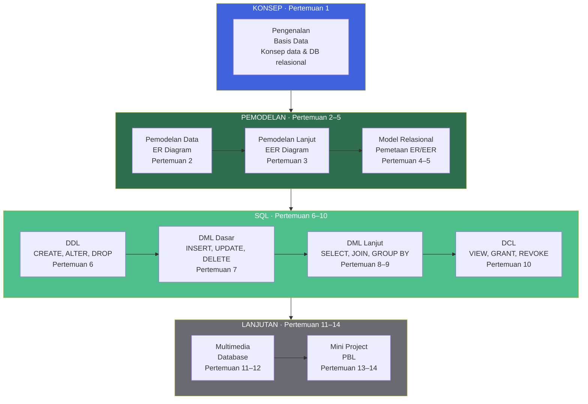
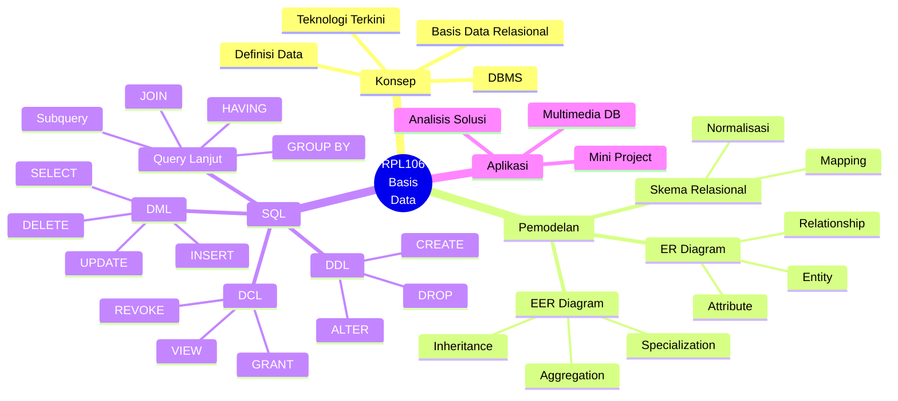
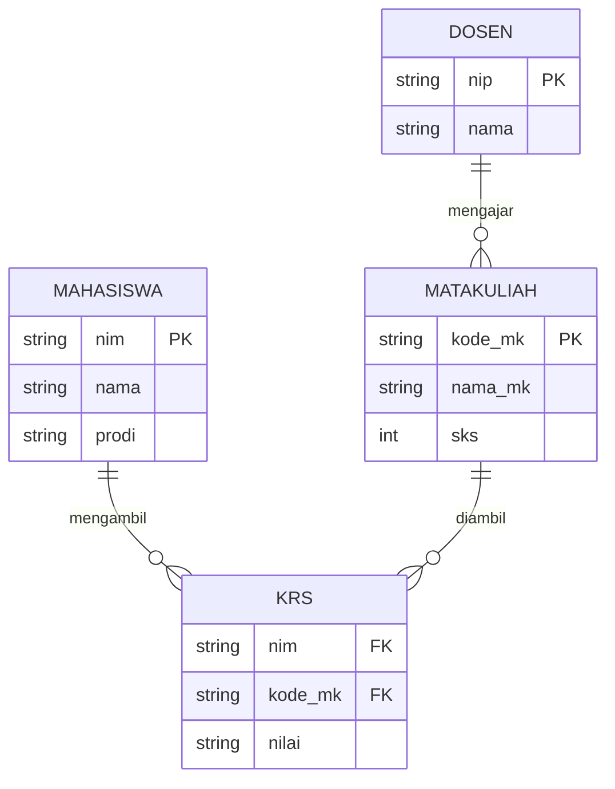
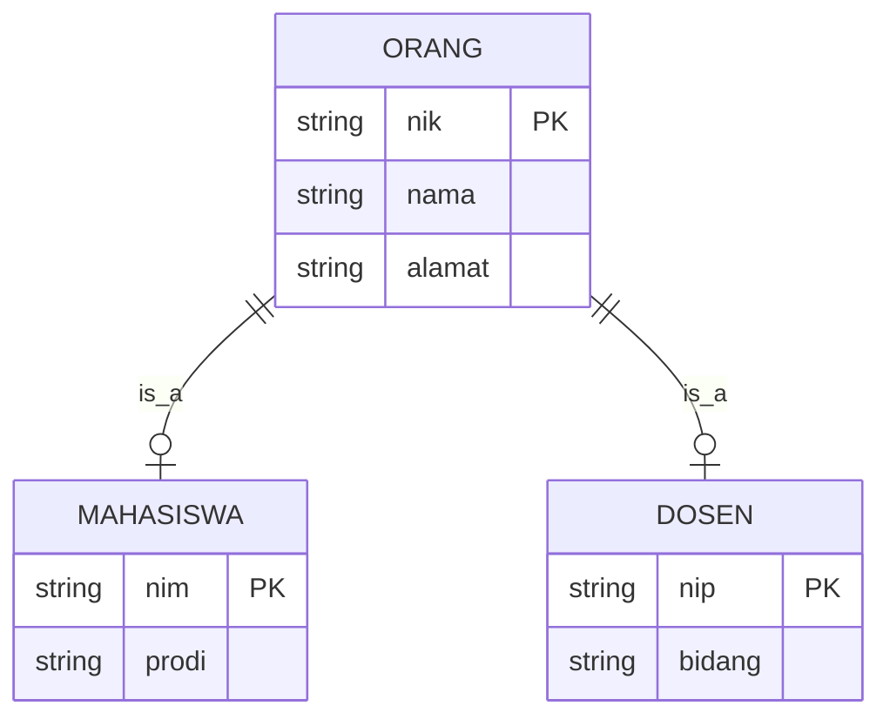
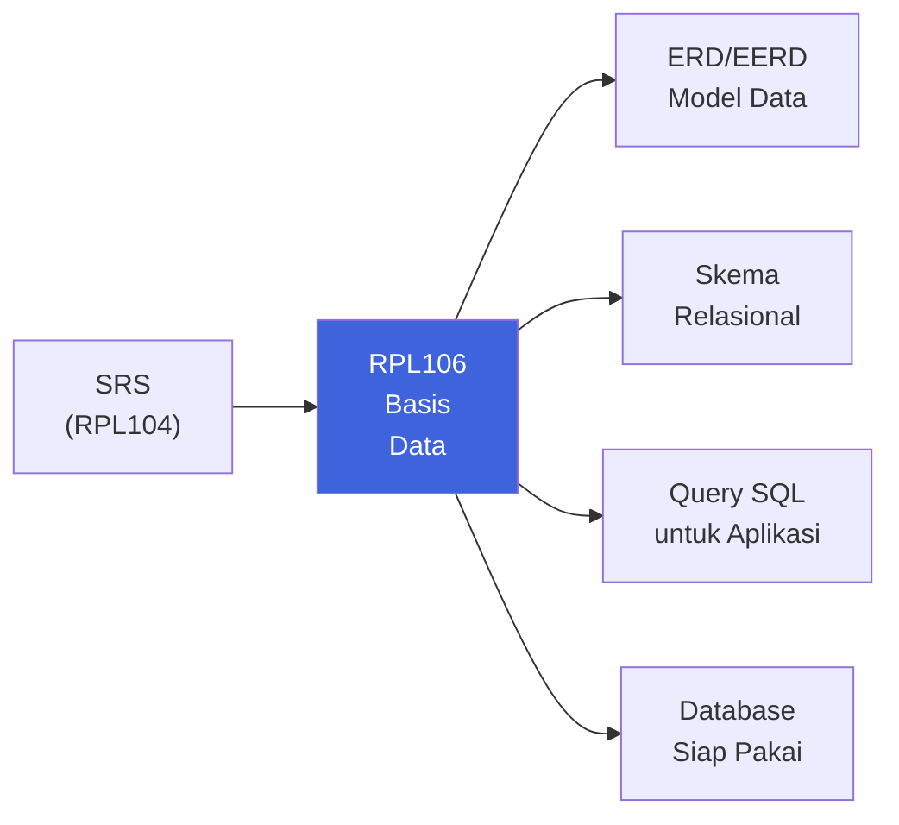
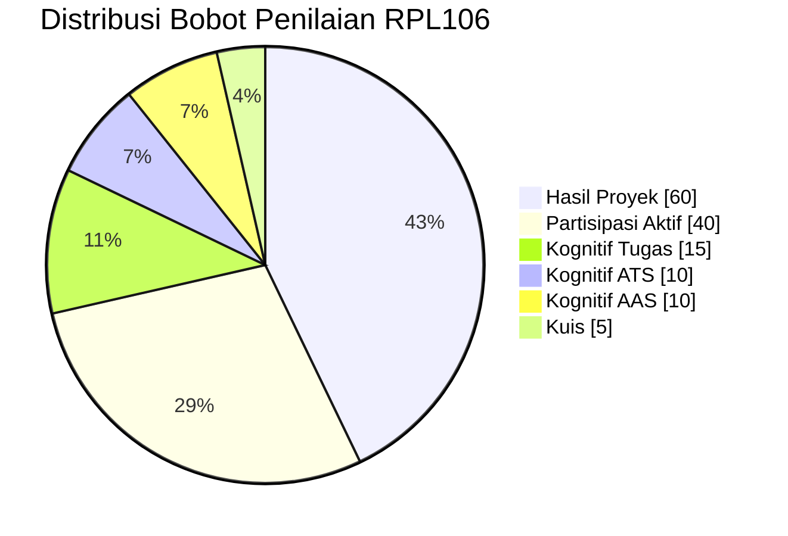

::: tip Halaman Resmi E-Learning
Seluruh materi, penugasan, dan aktivitas mata kuliah ini terpusat di e-learning Jurusan Teknik Informatika Politeknik Negeri Batam.

[**Buka E-Learning IF Polibatam →**](https://learningif.polibatam.ac.id)
:::

## Peta Mata Kuliah

RPL106 membawa kamu melalui **perjalanan lengkap basis data** — dari memahami konsep data, merancang model, memetakan ke skema relasional, hingga menulis query SQL yang kompleks untuk mengelola data.



**Benang merah:** Empat fase ini memetakan langsung ke **siklus hidup basis data** — dari **memahami** (Konsep), **merancang** (Pemodelan), **membangun & mengelola** (SQL), hingga **menerapkan** (Lanjutan + Mini Project).

## Informasi Umum

<div align="center">

| **Kode** | **SKS** |     **Semester**     | **Status** |
| :------: | :-----: | :------------------: | :--------: |
|  RPL106  |    3    | 1 (Ganjil 2026/2027) |   Wajib    |

</div>

| Bidang                    | Keterangan                                                 |
| ------------------------- | ---------------------------------------------------------- |
| **Nama Mata Kuliah**      | Pengantar Basis Data                                       |
| **Mata Kuliah Prasyarat** | Tidak ada                                                  |
| **Program Studi**         | Teknologi Rekayasa Perangkat Lunak (D4)                    |
| **Dosen Pengampu**        | Ahmadi Irmansyah Lubis (Koordinator), Muhamad Sahrul Nizan |
| **Email / HP**            | ahmadi@polibatam.ac.id / 082273083850                      |

### Deskripsi Mata Kuliah

Mata kuliah **Pengantar Basis Data** mengajarkan kepada mahasiswa agar memiliki pemahaman yang kuat mengenai konsep dasar dalam basis data dan memiliki kemampuan membangun basis data sebagai sebuah solusi dalam permasalahan sehari-hari. Pembahasan meliputi pengenalan database dalam kehidupan sehari-hari, konsep relational table, pemodelan data (ERD, EERD), pemetaan model data ke skema relasional, serta penggunaan SQL untuk membangun, mengelola, dan memanipulasi database relasional menggunakan DBMS.

::: info Cara Membaca Halaman Ini
Halaman ini disusun sebagai **satu perjalanan 14 pertemuan**. Setiap pertemuan menyertakan **contoh SQL** yang bisa langsung kamu jalankan di MySQL/XAMPP. Gunakan outline di kanan untuk melompat ke bagian tertentu.
:::

## Tujuan Pembelajaran

Setelah mengikuti mata kuliah ini, mahasiswa diharapkan mampu:

| No. | Tujuan Pembelajaran <Badge type="tip" text="7 TP" />                                     |
| :-: | ---------------------------------------------------------------------------------------- |
|  1  | **Menjelaskan konsep** data, basis data, dan perkembangan teknologi basis data terkini.  |
|  2  | **Menjelaskan konsep pemodelan data** dalam basis data relasional.                       |
|  3  | **Memodelkan permasalahan** ke dalam model data relasional.                              |
|  4  | **Merancang dan mengimplementasikan** basis data relasional.                             |
|  5  | **Menjelaskan, mengoperasikan, dan menerapkan** konsep query pada basis data relasional. |
|  6  | **Mengimplementasikan query** untuk membangun dan mengelola basis data relasional.       |
|  7  | **Melakukan analisis permasalahan** untuk memilih solusi basis data yang paling tepat.   |

### Kompetensi Inti yang Dibangun



## Rencana Pembelajaran

### Timeline 14 Pertemuan

```mermaid
gantt
    title Timeline RPL106 — 14 Pertemuan
    dateFormat X
    axisFormat %s

    section Konsep
    Pengenalan Basis Data              :a1, 0, 1

    section Pemodelan
    Pemodelan Data (ER)                :b1, 1, 1
    Pemodelan Data Lanjut (EER)        :b2, 2, 1
    Pemodelan Data Relasional          :b3, 3, 2

    section SQL
    DDL                                :c1, 5, 1
    DML Dasar                          :c2, 6, 1
    DML Lanjut                         :c3, 7, 2
    DCL                                :c4, 9, 1

    section Lanjutan
    Multimedia Database                :d1, 10, 2
    Mini Project PBL                   :crit, d2, 12, 2
```



### Materi Pembelajaran

| Pertemuan | Topik Utama                                   | Sub Topik                                                                                               |
| :-------: | --------------------------------------------- | ------------------------------------------------------------------------------------------------------- |
|     1     | Pengenalan Basis Data                         | Kontrak perkuliahan, gambaran umum materi, konsep dasar basis data, konsep basis data relasional        |
|     2     | Pemodelan Data                                | Kategorisasi model data, model Entity-Relationship (ER), komponen diagram ER, studi kasus ER            |
|     3     | Pemodelan Data Lanjut                         | Model Enhanced Entity-Relationship (EER), studi kasus EER                                               |
|    4–5    | Pemodelan Data Relasional                     | Model relasional, pemetaan ER/EER ke model relasional, studi kasus pemetaan                             |
|     6     | SQL — Data Definition Language (DDL)          | CREATE, ALTER, DROP                                                                                     |
|     7     | SQL — Data Manipulation Language (DML) Dasar  | INSERT, UPDATE, DELETE                                                                                  |
|    8–9    | SQL — Data Manipulation Language (DML) Lanjut | SELECT, JOIN (INNER, LEFT, RIGHT), ORDER BY, GROUP BY, HAVING, SET OPERATOR, CONDITION (CASE, IF, NULL) |
|    10     | SQL — Data Control Language (DCL)             | VIEW, GRANT PRIVILEGE, REVOKE PRIVILEGE                                                                 |
|   11–12   | SQL — Multimedia Database                     | Manage Type Data File                                                                                   |
|   13–14   | Review Mini Project PBL                       | Finalisasi project PBL                                                                                  |

### Detail Per Pertemuan

::: details Pertemuan 1 — Pengenalan Basis Data

**Tujuan:** Mahasiswa memahami konsep dasar data, basis data, dan basis data relasional.

**Sub Pokok Bahasan:**

- Kontrak perkuliahan
- Gambaran umum materi
- Konsep dasar basis data
- Konsep basis data relasional

**Ilustrasi Konsep:**

```text
Data → Informasi → Pengetahuan → Kebijaksanaan

Contoh:
"Budi, 20, TRPL"        → data mentah
"Budi mahasiswa TRPL"   → informasi
"Mahasiswa TRPL rata-rata berumur 20" → pengetahuan
```

:::

::: details Pertemuan 2 — Pemodelan Data (ER)

**Tujuan:** Mahasiswa mampu merancang diagram Entity-Relationship untuk memodelkan permasalahan nyata.

**Sub Pokok Bahasan:**

- Kategorisasi model data
- Model Entity-Relationship (ER)
- Komponen diagram ER
- Studi kasus ER

**Contoh ER Diagram (Mermaid):**



:::

::: details Pertemuan 3 — Pemodelan Data Lanjut (EER)

**Tujuan:** Mahasiswa mampu menggunakan Enhanced Entity-Relationship untuk model yang lebih kompleks.

**Sub Pokok Bahasan:**

- Model Enhanced Entity-Relationship (EER)
- Studi kasus EER

**Konsep EER:**

- **Inheritance** — entitas anak mewarisi atribut entitas induk
- **Specialization** — membagi entitas menjadi sub-entitas yang lebih spesifik
- **Aggregation** — entitas yang dibentuk dari relasi antar entitas

**Contoh EER:**



:::

::: details Pertemuan 4–5 — Pemodelan Data Relasional

**Tujuan:** Mahasiswa mampu memetakan ER/EER ke skema relasional.

**Sub Pokok Bahasan:**

- Model relasional
- Pemetaan ER/EER ke model relasional
- Studi kasus pemetaan

**Aturan Pemetaan:**

1. **Entitas kuat** → tabel dengan primary key
2. **Entitas lemah** → tabel dengan foreign key
3. **Relasi 1:1** → foreign key di salah satu tabel
4. **Relasi 1:N** → foreign key di sisi N
5. **Relasi N:M** → tabel penghubung baru

**Contoh Pemetaan:**

```sql
-- Dari ER Diagram pertemuan 2 → skema relasional

CREATE TABLE mahasiswa (
    nim     VARCHAR(10) PRIMARY KEY,
    nama    VARCHAR(100) NOT NULL,
    prodi   VARCHAR(50)
);

CREATE TABLE mata_kuliah (
    kode_mk VARCHAR(10) PRIMARY KEY,
    nama_mk VARCHAR(100) NOT NULL,
    sks     INT CHECK (sks BETWEEN 1 AND 6)
);

CREATE TABLE krs (
    nim       VARCHAR(10),
    kode_mk   VARCHAR(10),
    nilai     CHAR(2),
    PRIMARY KEY (nim, kode_mk),
    FOREIGN KEY (nim) REFERENCES mahasiswa(nim),
    FOREIGN KEY (kode_mk) REFERENCES mata_kuliah(kode_mk)
);
```

:::

::: details Pertemuan 6 — SQL: Data Definition Language (DDL)

**Tujuan:** Mahasiswa mampu membuat, mengubah, dan menghapus struktur tabel dengan SQL.

**Sub Pokok Bahasan:**

- CREATE
- ALTER
- DROP

**Contoh Kode:**

```sql
-- CREATE database
CREATE DATABASE akademik;

-- Gunakan database
USE akademik;

-- CREATE table
CREATE TABLE mahasiswa (
    nim     VARCHAR(10) PRIMARY KEY,
    nama    VARCHAR(100) NOT NULL,
    prodi   VARCHAR(50),
    angkatan YEAR
);

-- ALTER: tambah kolom
ALTER TABLE mahasiswa
ADD email VARCHAR(100);

-- ALTER: ubah tipe kolom
ALTER TABLE mahasiswa
MODIFY prodi VARCHAR(100);

-- ALTER: hapus kolom
ALTER TABLE mahasiswa
DROP COLUMN email;

-- DROP: hapus tabel
DROP TABLE IF EXISTS mahasiswa;
```

:::

::: details Pertemuan 7 — SQL: DML Dasar

**Tujuan:** Mahasiswa mampu memanipulasi data dengan INSERT, UPDATE, DELETE.

**Sub Pokok Bahasan:**

- INSERT
- UPDATE
- DELETE

**Contoh Kode:**

```sql
-- INSERT satu baris
INSERT INTO mahasiswa (nim, nama, prodi, angkatan)
VALUES ('4342611034', 'Muhammad Riduwan Khafidi', 'TRPL', 2026);

-- INSERT banyak baris
INSERT INTO mahasiswa (nim, nama, prodi, angkatan) VALUES
    ('4342611035', 'Ani Suryani', 'TRPL', 2026),
    ('4342611036', 'Budi Santoso', 'TRPL', 2026),
    ('4342611037', 'Citra Dewi', 'TRPL', 2026);

-- UPDATE satu baris
UPDATE mahasiswa
SET prodi = 'Teknologi Rekayasa Perangkat Lunak'
WHERE nim = '4342611034';

-- UPDATE banyak baris dengan kondisi
UPDATE mahasiswa
SET angkatan = 2027
WHERE angkatan = 2026 AND prodi = 'TRPL';

-- DELETE dengan kondisi
DELETE FROM mahasiswa
WHERE nim = '4342611037';

-- HATI-HATI: DELETE tanpa WHERE menghapus SEMUA baris
-- DELETE FROM mahasiswa;  -- jangan dijalankan kalau tidak yakin
```

:::

::: details Pertemuan 8–9 — SQL: DML Lanjut

**Tujuan:** Mahasiswa mampu menulis query SELECT kompleks dengan JOIN, GROUP BY, dan subquery.

**Sub Pokok Bahasan:**

- SELECT
- JOIN (INNER, LEFT, RIGHT)
- ORDER BY, GROUP BY, HAVING
- SET OPERATOR
- CONDITION (CASE, IF, NULL)

**Contoh Kode:**

```sql
-- SELECT dasar
SELECT nim, nama FROM mahasiswa WHERE prodi = 'TRPL';

-- ORDER BY
SELECT * FROM mahasiswa ORDER BY nama ASC;

-- INNER JOIN
SELECT m.nim, m.nama, k.nama_mk, krs.nilai
FROM mahasiswa m
INNER JOIN krs ON m.nim = krs.nim
INNER JOIN mata_kuliah k ON krs.kode_mk = k.kode_mk;

-- LEFT JOIN (mahasiswa tanpa KRS tetap tampil)
SELECT m.nim, m.nama, COUNT(krs.kode_mk) AS jumlah_mk
FROM mahasiswa m
LEFT JOIN krs ON m.nim = krs.nim
GROUP BY m.nim, m.nama;

-- GROUP BY + HAVING
SELECT prodi, COUNT(*) AS jumlah_mahasiswa
FROM mahasiswa
GROUP BY prodi
HAVING COUNT(*) > 5;

-- Subquery
SELECT nama FROM mahasiswa
WHERE nim IN (
    SELECT nim FROM krs WHERE nilai = 'A'
);

-- CASE
SELECT nama,
       nilai,
       CASE
           WHEN nilai = 'A' THEN 'Sangat Baik'
           WHEN nilai = 'B' THEN 'Baik'
           WHEN nilai = 'C' THEN 'Cukup'
           ELSE 'Perlu Perbaikan'
       END AS kategori
FROM krs;

-- Handle NULL
SELECT nama, COALESCE(nilai, 'Belum Dinilai') AS nilai_akhir
FROM mahasiswa m
LEFT JOIN krs ON m.nim = krs.nim;
```

:::

::: details Pertemuan 10 — SQL: Data Control Language (DCL)

**Tujuan:** Mahasiswa mampu mengelola hak akses dan membuat view.

**Sub Pokok Bahasan:**

- VIEW
- GRANT PRIVILEGE
- REVOKE PRIVILEGE

**Contoh Kode:**

```sql
-- CREATE VIEW
CREATE VIEW v_mahasiswa_trpl AS
SELECT nim, nama, angkatan
FROM mahasiswa
WHERE prodi = 'TRPL';

-- Gunakan view
SELECT * FROM v_mahasiswa_trpl;

-- GRANT: beri hak akses
CREATE USER 'asisten'@'localhost' IDENTIFIED BY 'password_kuat';

GRANT SELECT, INSERT ON akademik.mahasiswa TO 'asisten'@'localhost';

-- REVOKE: cabut hak akses
REVOKE INSERT ON akademik.mahasiswa FROM 'asisten'@'localhost';

-- Lihat hak akses
SHOW GRANTS FOR 'asisten'@'localhost';

-- DROP VIEW
DROP VIEW IF EXISTS v_mahasiswa_trpl;
```

:::

::: details Pertemuan 11–12 — SQL: Multimedia Database

**Tujuan:** Mahasiswa mampu mengelola tipe data file (multimedia) di dalam basis data relasional.

**Sub Pokok Bahasan:**

- Manage Type Data File

**Contoh Kode:**

```sql
-- Menyimpan file multimedia sebagai BLOB
CREATE TABLE galeri (
    id          INT AUTO_INCREMENT PRIMARY KEY,
    judul       VARCHAR(200) NOT NULL,
    deskripsi   TEXT,
    nama_file   VARCHAR(255),
    mime_type   VARCHAR(100),
    ukuran      INT,
    konten      LONGBLOB,
    dibuat      TIMESTAMP DEFAULT CURRENT_TIMESTAMP
);

-- Insert file (dari aplikasi backend, bukan SQL murni)
-- Contoh di PHP:
-- $stmt = $conn->prepare("INSERT INTO galeri (judul, nama_file, mime_type, ukuran, konten) VALUES (?, ?, ?, ?, ?)");
-- $stmt->bind_param("sssib", $judul, $nama_file, $mime_type, $ukuran, $konten);
-- $konten = file_get_contents($path_file);

-- Query untuk retrieve metadata
SELECT id, judul, nama_file, mime_type, ROUND(ukuran/1024, 2) AS ukuran_kb
FROM galeri
ORDER BY dibuat DESC;

-- Alternatif best practice: simpan path, bukan file
-- CREATE TABLE galeri (
--     id          INT AUTO_INCREMENT PRIMARY KEY,
--     judul       VARCHAR(200),
--     file_path   VARCHAR(500),  -- /uploads/galeri/foto.jpg
--     mime_type   VARCHAR(100),
--     ukuran      INT
-- );
```

:::

::: details Pertemuan 13–14 — Review Mini Project PBL

**Tujuan:** Mahasiswa memfinalisasi proyek PBL yang mengintegrasikan seluruh materi.

**Sub Pokok Bahasan:**

- Review Mini Project PBL
- Finalisasi project PBL

**Checklist Proyek:**

- [ ] ERD lengkap dengan semua entitas, atribut, dan relasi
- [ ] EERD (jika ada inheritance atau aggregation)
- [ ] Skema relasional hasil pemetaan
- [ ] Script SQL DDL lengkap (CREATE TABLE, CONSTRAINT, INDEX)
- [ ] Script SQL DML untuk sample data
- [ ] Query SQL untuk kebutuhan aplikasi (minimal 10 query berbeda)
- [ ] View untuk menyederhanakan query kompleks
- [ ] Dokumentasi proyek dalam format standar
- [ ] Presentasi demo
      :::

## Proyek Pengembangan Perangkat Lunak (PBL)

Mata kuliah ini dijalankan dengan metode **Project-Based Learning (PBL)** dengan implementasi framework **CDIO** (Conceive, Design, Implement, Operate). Pada semester 1 fokus pada tahap **Implement** dan **Operate**. Mahasiswa akan mengerjakan proyek _cornerstone_ yang telah dispesifikasikan oleh dosen, untuk membangun kemampuan merancang aplikasi yang terkoneksi dengan basis data, kerjasama tim, kolaborasi, komunikasi, dan refleksi.

### Kontribusi RPL106 terhadap PBL



**Posisi RPL106 dalam siklus proyek:** Mata kuliah ini adalah **tulang punggung data** dari aplikasi. Semua entitas yang muncul di SRS dari RPL104 dimodelkan di sini, lalu diimplementasikan sebagai database nyata yang siap digunakan oleh RPL105 (Pemrograman Berbasis Web).

### Luaran Proyek

| Luaran                 | Deskripsi                                                          |
| ---------------------- | ------------------------------------------------------------------ |
| **ERD**                | Entity-Relationship Diagram lengkap dari sistem yang dikembangkan. |
| **EERD**               | Enhanced ER Diagram jika ada konsep inheritance/aggregation.       |
| **Skema Relasional**   | Pemetaan lengkap dari ER/EER ke tabel-tabel relasional.            |
| **Script DDL**         | SQL script untuk membuat struktur database.                        |
| **Script DML**         | SQL script untuk mengisi sample data dan query aplikasi.           |
| **View**               | View untuk menyederhanakan query kompleks dan pembatasan akses.    |
| **Dokumentasi Proyek** | Laporan lengkap dari desain hingga implementasi database.          |
| **Presentasi Demo**    | Demonstrasi penggunaan database dalam konteks aplikasi nyata.      |

::: warning Perhatian
Mini Project PBL **wajib menyertakan script SQL yang dapat dijalankan ulang** dari nol. Ini memastikan bahwa database kamu tidak hanya "jalan di laptop sendiri", tapi benar-benar dapat direproduksi oleh orang lain.
:::

## Metode Evaluasi

### Komponen Penilaian

| Metode Evaluasi                                                 | Bobot | Penilai        |
| --------------------------------------------------------------- | :---: | -------------- |
| Partisipasi aktif (teamwork, kontribusi, etika)                 |  40%  | Manajer Proyek |
| Hasil proyek (laporan, learning skills, presentasi, produk)     |  60%  | Dosen Pengajar |
| Kognitif Tugas (tugas teori, praktikum, quiz, progress project) |  15%  | Dosen Pengajar |
| Kognitif ATS (Teori & Praktik)                                  |  10%  | Dosen Pengajar |
| Kognitif AAS (Teori & Praktik)                                  |  10%  | Dosen Pengajar |
| Kuis                                                            |  5%   | Dosen Pengajar |



::: danger Kebijakan Khusus — Wajib Dibaca
**Jika ada salah satu komponen penilaian bernilai nol (0), maka nilai akhir otomatis menjadi E.**

**Apabila lebih dari satu komponen nol, mahasiswa harus mengulang mata kuliah di tahun ajaran baru.**

Ini berarti: **jangan mengosongkan komponen apa pun** — termasuk partisipasi, tugas, kuis, ATS, dan AAS. Setiap komponen harus diisi, meskipun hasilnya minimal.
:::

### Detail Metode Asesmen

::: details Kognitif ATS (Teori & Praktik)
**Fokus materi:** Konsep pertemuan 1–7 — dari pengenalan basis data, pemodelan ER/EER, pemetaan relasional, hingga DDL dan DML dasar.

**Bentuk:**

- **Teori** — soal pilihan ganda dan/atau esai tentang konsep
- **Praktik** — membuat ERD, memetakan ke skema relasional, menulis query SQL

**Kriteria utama:**

- Ketepatan desain ER/EER
- Konsistensi pemetaan ke skema relasional
- Kebenaran sintaks SQL
  :::

::: details Kognitif AAS (Teori & Praktik)
**Fokus materi:** Konsep pertemuan 8–14 — DML lanjut, DCL, multimedia database, dan mini project.

**Bentuk:**

- **Teori** — soal pilihan ganda dan/atau esai tentang konsep lanjutan
- **Praktik** — menyelesaikan kasus query kompleks dan/atau demo mini project

**Kriteria utama:**

- Kemampuan menulis query JOIN, GROUP BY, dan subquery
- Pemahaman DCL dan pengelolaan hak akses
- Kualitas mini project PBL
  :::

### Kriteria Penilaian

| Nilai Angka | Nilai Huruf |
| :---------: | :---------: |
|    ≥ 85     |      A      |
|   80 – 84   |     A-      |
|   75 – 79   |     B+      |
|   70 – 74   |      B      |
|   65 – 69   |     B-      |
|   60 – 64   |     C+      |
|   55 – 59   |      C      |
|   50 – 54   |     C-      |
|   45 – 49   |     D+      |
|   40 – 44   |      D      |
|    < 40     |      E      |

## Sarana & Prasarana

| No. | Sarana/Prasarana             | Jumlah (Unit) |
| :-: | ---------------------------- | :-----------: |
|  1  | Komputer/PC                  |      30       |
|  2  | Laboratorium                 |       1       |
|  3  | XAMPP (Apache + MySQL + PHP) |      30       |
|  4  | Visual Studio Code           |      30       |
|  5  | draw.io (untuk ERD/EERD)     |  1 (online)   |
|  6  | Koneksi Internet             |       1       |

## Tools yang Digunakan

| Tool                              | Fungsi                             | Link                                                |
| --------------------------------- | ---------------------------------- | --------------------------------------------------- |
| **XAMPP**                         | Database & Web Server              | [Buka →](https://www.apachefriends.org/)            |
| **Visual Studio Code**            | Text Editor                        | [Buka →](https://code.visualstudio.com/)            |
| **draw.io**                       | Diagramming & ERD Software         | [Buka →](https://app.diagrams.net/)                 |
| **Microsoft Office / PDF Reader** | Penyusunan laporan & membaca modul | —                                                   |
| **MySQL Workbench** (opsional)    | GUI untuk desain & kelola MySQL    | [Buka →](https://www.mysql.com/products/workbench/) |
| **DBeaver** (opsional)            | Universal DB client                | [Buka →](https://dbeaver.io/)                       |

## Kesepakatan Pelaksanaan Perkuliahan

Pelaksanaan perkuliahan RPL106 mengacu pada kesepakatan berikut:

1. Mahasiswa wajib mengikuti seluruh kegiatan perkuliahan sesuai jadwal dengan **toleransi keterlambatan maksimal 15 menit**.
2. Seluruh penugasan dikumpulkan melalui e-learning IF Polibatam di [https://learningif.polibatam.ac.id](https://learningif.polibatam.ac.id).
3. **Setiap komponen penilaian wajib diisi** — nilai nol pada komponen manapun menyebabkan nilai akhir otomatis E.
4. Mahasiswa wajib menjaga etika moral dan etika akademik baik di dalam maupun di luar perkuliahan.

::: tip Tips Belajar Efektif

- **Praktik setiap minggu** — jangan hanya baca SQL, jalankan di XAMPP.
- **Mulai proyek dari ERD** — kesalahan di sini akan merambat ke seluruh implementasi.
- **Biasakan menulis SQL dengan format rapi** — indentasi dan komentar adalah tanda engineer yang baik.
- **Simpan semua script** — DDL, DML, dan query aplikasi — dalam satu folder terstruktur.
  :::

## Pustaka

### Referensi Utama

| No. | Referensi                                                                                                                            |
| :-: | ------------------------------------------------------------------------------------------------------------------------------------ |
|  1  | Silberschatz, A., Korth, H. F., & Sudarshan, S. (1997). _Database System Concepts_. McGraw-Hill.                                     |
|  2  | Yanto, R. (2016). _Manajemen Basis Data Menggunakan MySQL_. Deepublish.                                                              |
|  3  | Jayanti, N. K. D. A., & Sumiari, N. K. (2018). _Teori Basis Data_. Penerbit Andi.                                                    |
|  4  | Connolly, T., & Begg, C. (2015). _Database Systems: A Practical Approach to Design, Implementation and Management_, 6th ed. Pearson. |
|  5  | Lubis, A. I., et al. (2025). _Kitab Basis Data_. Polibatam Press.                                                                    |

### Referensi Pendukung

| No. | Referensi                                                                                         |
| :-: | ------------------------------------------------------------------------------------------------- |
|  1  | Tiwari, S. _Professional NoSQL_. John Wiley & Sons, 2011.                                         |
|  2  | Widodo, A. W., & Kurnianingtyas, D. (2017). _Sistem Basis Data_. Universitas Brawijaya Press.     |
|  3  | Atzeni, P., et al. (2020). "Data modeling in the NoSQL world." _Computer Standards & Interfaces_. |
|  4  | Taylor, A. G. (2018). _SQL for Dummies_. John Wiley & Sons.                                       |
|  5  | Sianipar, R. H. (2016). _Pemrograman Database Menggunakan MySQL_. Penerbit ANDI.                  |
|  6  | [MongoDB Documentation](https://docs.mongodb.com/)                                                |

## Sumber Referensi Online

### Platform Utama

| Sumber                  | Tautan                                       |
| ----------------------- | -------------------------------------------- |
| E-Learning IF Polibatam | [Buka →](https://learningif.polibatam.ac.id) |
| Politeknik Negeri Batam | [Buka →](https://www.polibatam.ac.id)        |

### Dokumentasi Resmi

| Sumber                    | Tautan                                             | Kegunaan                     |
| ------------------------- | -------------------------------------------------- | ---------------------------- |
| **MySQL Documentation**   | [Buka →](https://dev.mysql.com/doc/)               | Referensi resmi MySQL        |
| **MariaDB Documentation** | [Buka →](https://mariadb.com/kb/en/documentation/) | Alternatif open-source MySQL |
| **PostgreSQL Docs**       | [Buka →](https://www.postgresql.org/docs/)         | Referensi PostgreSQL         |
| **MongoDB Documentation** | [Buka →](https://docs.mongodb.com/)                | Referensi NoSQL              |
| **W3Schools SQL**         | [Buka →](https://www.w3schools.com/sql/)           | Tutorial SQL untuk pemula    |

### Tools & Playground

| Tools               | Tautan                                              | Kegunaan                         |
| ------------------- | --------------------------------------------------- | -------------------------------- |
| **XAMPP**           | [Buka →](https://www.apachefriends.org/)            | Database + Web Server lokal      |
| **Laragon**         | [Buka →](https://laragon.org/)                      | Alternatif XAMPP untuk Windows   |
| **MySQL Workbench** | [Buka →](https://www.mysql.com/products/workbench/) | GUI resmi MySQL                  |
| **DBeaver**         | [Buka →](https://dbeaver.io/)                       | Universal DB client              |
| **draw.io**         | [Buka →](https://app.diagrams.net/)                 | Membuat ERD online               |
| **dbdiagram.io**    | [Buka →](https://dbdiagram.io/)                     | ERD berbasis teks — cepat & rapi |
| **SQL Fiddle**      | [Buka →](http://sqlfiddle.com/)                     | Playground SQL online            |

### Sumber Belajar Tambahan

| Sumber                            | Deskripsi                                        |
| --------------------------------- | ------------------------------------------------ |
| **SQLBolt**                       | Tutorial SQL interaktif, cocok untuk pemula.     |
| **Mode Analytics — SQL Tutorial** | Tutorial SQL untuk analisis data.                |
| **Use The Index, Luke!**          | Panduan mendalam tentang index dan performa SQL. |
| **Vertabelo Academy**             | Kursus desain database dan SQL.                  |

::: info Tentang Halaman Ini
Halaman ini disusun berdasarkan Rencana Pembelajaran Semester (RPS) RPL106 Pengantar Basis Data dan konten e-learning Jurusan Teknik Informatika Politeknik Negeri Batam untuk Semester Ganjil 2026/2027. Informasi dapat berubah sewaktu-waktu mengikuti perkembangan perkuliahan.
:::

::: tip Butuh Update Cepat?
Jika ada perubahan jadwal, materi, atau informasi evaluasi, edit file `docs/v1/courses/rpl106-pengantar-basis-data/index.md` dan commit. Jangan biarkan informasi basi menumpuk.
:::
