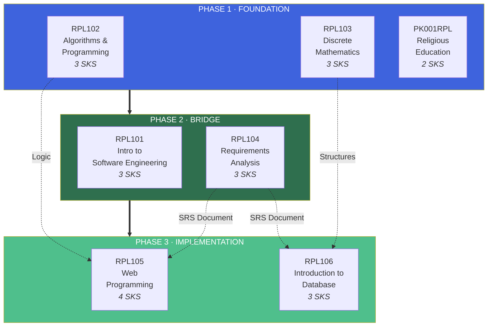
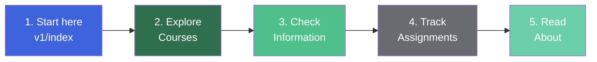
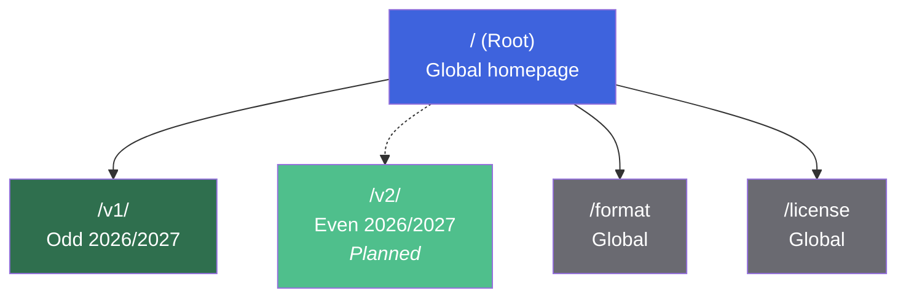

::: info You Are Viewing Version 1
This is the **current and only released version** of the Lectures documentation. It covers the **Odd Semester 2026/2027** of the Software Engineering Technology program.

[**View all versions →**](/) · [**Read the changelog →**](/v1/about)
:::

## Semester at a Glance

| **Courses** | **Total Credits** | **Weeks** | **PBL Projects** |
| :---------: | :---------------: | :-------: | :--------------: |
|      7      |        21         |    14     |        30        |

The first semester of the Software Engineering Technology program is designed as **one integrated learning journey** — not seven isolated courses. Theoretical foundations from mathematics and algorithms feed into practical skills in requirements engineering, web development, and database design, all converging into a **shared Project-Based Learning (PBL)** cornerstone project.

## Learning Journey

The semester follows a deliberate progression from foundation to application — each phase builds on the previous one.

|       Phase        | Focus                                          | Courses                  |
| :----------------: | ---------------------------------------------- | ------------------------ |
|   **Foundation**   | Computational thinking, mathematics, character | RPL102, RPL103, PK001RPL |
|     **Bridge**     | Software engineering process, requirements     | RPL101, RPL104           |
| **Implementation** | Web development, database design               | RPL105, RPL106           |

::: tip Why This Order Matters
The curriculum is designed so that **RPL104 (Requirements Analysis)** produces the SRS document that drives implementation in **RPL105 (Web Programming)** and **RPL106 (Database)**. Mathematical foundations from RPL103 and algorithmic thinking from RPL102 support the entire chain.
:::

## What's Inside Version 1

Version 1 bundles three main sections — each accessible through its own landing page.

### Courses — `/v1/courses/`

Seven course pages, each with materials, schedule, assignments, and references.

| Code     | Course                                  | SKS | Phase          |
| -------- | --------------------------------------- | :-: | -------------- |
| RPL101   | Introduction to Software Engineering    |  3  | Bridge         |
| RPL102   | Algorithms and Programming              |  3  | Foundation     |
| RPL103   | Discrete Mathematics                    |  3  | Foundation     |
| RPL104   | Requirements Analysis and Specification |  3  | Bridge         |
| RPL105   | Web Programming                         |  4  | Implementation |
| RPL106   | Introduction to Database                |  3  | Implementation |
| PK001RPL | Religious Education                     |  2  | Foundation     |

[**Browse all courses →**](/v1/courses/)

### Information — `/v1/information/`

Practical information about the semester — schedules, contacts, and team registries.

| Page                                                       | Description                                   |
| ---------------------------------------------------------- | --------------------------------------------- |
| [Lecturer Contacts](/v1/information/kontak-dosen)          | Staff IDs, initials, names, and phone numbers |
| [Class Schedule](/v1/information/jadwal-kuliah)            | Weekly schedule with rooms and lecturers      |
| [PBL Team Info](/v1/information/info-team-pbl)             | Project descriptions and project managers     |
| [PBL Titles and Teams](/v1/information/judul-dan-team-pbl) | Team registries with member names             |

[**Browse all information →**](/v1/information/)

### Assignments — `/v1/task/`

A single tracking page for all coursework — with deadlines, statuses, and submission links.

| Course                        | Assignments | Status                                   |
| ----------------------------- | :---------: | ---------------------------------------- |
| RPL103 — Discrete Mathematics | Set Theory  | Not started                              |
| Others                        |   Pending   | Will be added as the semester progresses |

[**View all assignments →**](/v1/task/)

## Navigating This Version

Recommended reading order for someone new to this documentation.

| Step  | Page                            | Why                                                   |
| :---: | ------------------------------- | ----------------------------------------------------- |
| **1** | [Version 1 home](/v1/)          | You are here — understand the overall structure       |
| **2** | [Courses](/v1/courses/)         | Learn what each course covers                         |
| **3** | [Information](/v1/information/) | Know your lecturers, schedule, and PBL team           |
| **4** | [Assignments](/v1/task/)        | Track your coursework and deadlines                   |
| **5** | [About](/v1/about)              | Understand the documentation's context and maintainer |

## Quick Links

The most frequently accessed pages, ordered by priority.

| Page                                                | Description                                             |
| --------------------------------------------------- | ------------------------------------------------------- |
| [**Courses**](/v1/courses/)                         | All seven courses with materials and assignments.       |
| [**Information**](/v1/information/)                 | Schedules, lecturer contacts, and PBL team assignments. |
| [**Assignments**](/v1/task/)                        | Assignment briefs and submission details.               |
| [**Class Schedule**](/v1/information/jadwal-kuliah) | Weekly schedule of evening classes.                     |
| [**PBL Teams**](/v1/information/judul-dan-team-pbl) | Find your PBL team and project.                         |
| [**About**](/v1/about)                              | About this documentation and its maintainer.            |
| [**Format & Rules**](/format)                       | Documentation conventions and contribution guidelines.  |
| [**License**](/license)                             | Terms of use for all content in this documentation.     |

## Version Notes

Version 1 is the **first and currently only released version** of this documentation.

### Version History

| Version | Status  | Period         | Description                                             |
| :-----: | :-----: | -------------- | ------------------------------------------------------- |
| **v1**  | Current | Odd 2026/2027  | First semester — initial release                        |
|   v2    | Planned | Even 2026/2027 | Second semester — will be released when the term starts |

### How Versioning Works

- **Root pages** (`/`, `/format`, `/license`) — global, apply to all versions.
- **Version pages** (`/v1/*`, `/v2/*`) — scoped to a specific academic term.
- **Past versions are frozen** — only critical corrections are made.

::: info About "Frozen" Versions
Once a version is superseded (e.g., v1 becomes past when v2 is released), it is **frozen** — no content changes except for:

- Critical factual errors that mislead readers
- Broken links that no longer resolve
- Security or privacy corrections

This preserves citations and references made during the original term.
:::

## Frequently Asked Questions

::: details What is "Version 1"?

**Version 1** is the documentation for the **first semester (Odd 2026/2027)** of the Software Engineering Technology program. It contains everything you need to navigate that semester — courses, schedules, assignments, lecturer contacts, and PBL team information.

It is part of a versioned documentation system where each academic term gets its own folder and its own content.

:::

::: details Why is the documentation versioned?

Versioning serves three purposes:

1. **Preservation** — past semester content remains accessible for citations and references.
2. **Clarity** — when you open a page, you know exactly which semester it belongs to.
3. **Evolution** — the documentation can improve between semesters without breaking old links.

It's a common pattern in technical documentation — think of it like how software frameworks maintain multiple versions of their docs.

:::

::: details How do I navigate between versions?

Every version has its own sidebar configuration. When you're in `/v1/*`, the sidebar shows **Version 1 content**. When in `/v2/*`, it shows **Version 2 content**.

To switch versions:

- Use the **Version** dropdown in the top navigation bar.
- Or return to the [root page](/) and check the versions table.

:::

::: details Where do I find my PBL team?

Go to [PBL Titles and Teams](/v1/information/judul-dan-team-pbl) — it contains all 30 teams organized by class (Pagi A/B/C and Malam A/B/C). Find your class, then look for your assigned project code.

If you can't find yourself, contact your PBL project manager or check the official announcement on e-learning.

:::

::: details Where do I find my class schedule?

The [Class Schedule](/v1/information/jadwal-kuliah) page shows the weekly schedule for evening classes. If your class is different, check with your class coordinator or the official e-learning announcement.

:::

::: details What if I find an error?

Two options:

1. **Open an issue** on the [GitHub repository](https://github.com/mroczect/lectures) — describe the error clearly.
2. **Submit a pull request** if you want to fix it yourself.

For minor fixes (typos, formatting), feel free to edit directly. For content corrections, an issue first is helpful.

:::

::: details Is this documentation official?

**No.** This is a **personal documentation project** maintained by a student, not an official publication of Politeknik Negeri Batam.

Content is sourced from official materials (RPS documents, e-learning pages, lecturer announcements), but the curation and organization are done by the maintainer. For official matters, always refer to the university's own channels.

:::

## Related Pages

| Page                          | Description                                                     |
| ----------------------------- | --------------------------------------------------------------- |
| [**Root Home**](/)            | Project home — all versions, format rules, and getting started. |
| [**Format & Rules**](/format) | Documentation conventions and contribution guidelines.          |
| [**License**](/license)       | Licensing terms for all content.                                |
| [**About**](/v1/about)        | About this documentation and its maintainer.                    |

::: tip Starting Fresh?
If you're new to this project, start from the [**root documentation**](/) — it lists all versions, explains the documentation system, and provides a broader introduction.

Then return here to dive into the first semester's content.
:::

::: warning Note on Content Freshness
Version 1 is actively maintained during the **Odd 2026/2027 semester**. After the semester ends, it will be **frozen** — only critical corrections will be made.

If you notice outdated information before the freeze, please report it via GitHub or email.
:::
