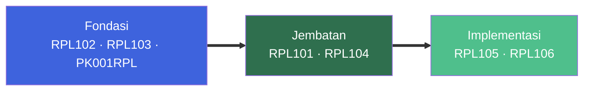

::: info Semester Ganjil 2026/2027
Versi ini mencakup semester pertama Prodi Teknologi Rekayasa Perangkat Lunak.

[Lihat semua versi →](/) · [Changelog →](/v1/about)
:::

## Sekilas

| Mata Kuliah | SKS | Minggu | Proyek PBL |
| :---------: | :-: | :----: | :--------: |
|      7      | 21  |   14   |     30     |

Semester 1 dirancang sebagai satu perjalanan terpadu — fondasi matematika dan algoritma mengalir ke rekayasa kebutuhan, pemrograman web, dan basis data, semuanya bermuara di proyek PBL.

## Fase Belajar

| Fase         | Fokus                        | Mata Kuliah              |
| ------------ | ---------------------------- | ------------------------ |
| Fondasi      | Logika, matematika, karakter | RPL102, RPL103, PK001RPL |
| Jembatan     | Proses RPL, kebutuhan        | RPL101, RPL104           |
| Implementasi | Web, basis data              | RPL105, RPL106           |

::: tip Benang merah
RPL104 menghasilkan dokumen SRS yang jadi dasar implementasi di RPL105 dan RPL106.
:::

## Mata Kuliah

| Kode     | Mata Kuliah                        | SKS |
| -------- | ---------------------------------- | :-: |
| RPL101   | Pengantar Rekayasa Perangkat Lunak |  3  |
| RPL102   | Algoritma dan Pemrograman          |  3  |
| RPL103   | Matematika Diskrit                 |  3  |
| RPL104   | Analisis dan Spesifikasi Kebutuhan |  3  |
| RPL105   | Pemrograman Web                    |  4  |
| RPL106   | Pengantar Basis Data               |  3  |
| PK001RPL | Pendidikan Agama                   |  2  |

[Lihat semua →](/v1/courses/)

## Informasi

| Halaman                                               | Isi                |
| ----------------------------------------------------- | ------------------ |
| [Kontak Dosen](/v1/information/kontak-dosen)          | NIP, nama, telepon |
| [Jadwal Kuliah](/v1/information/jadwal-kuliah)        | Jadwal mingguan    |
| [Info Tim PBL](/v1/information/info-team-pbl)         | Deskripsi proyek   |
| [Judul & Tim PBL](/v1/information/judul-dan-team-pbl) | Data anggota tim   |

[Lihat semua →](/v1/information/)

## Tugas

| Mata Kuliah |     Tugas      | Status |
| ----------- | :------------: | ------ |
| RPL103      | Teori Himpunan | Belum  |
| Lainnya     |    Menunggu    | —      |

[Lihat semua →](/v1/task/)

## Catatan Versi

| Versi  |    Status    | Periode          |
| :----: | :----------: | ---------------- |
| **v1** |    Aktif     | Ganjil 2026/2027 |
|   v2   | Direncanakan | Genap 2026/2027  |

- **Root** (`/`, `/format`, `/license`) — berlaku semua versi.
- **Versi** (`/v1/*`) — khusus satu semester.
- Versi lama **dibekukan** — hanya koreksi kritis.

## FAQ

::: details Apa itu Versi 1?
Dokumentasi semester pertama (Ganjil 2026/2027) TRPL Polibatam. Bukan publikasi resmi kampus.
:::

::: details Kenapa pakai versi?
Agar materi semester lalu tetap bisa diakses dan dikutip, tanpa merusak tautan lama.
:::

::: details Di mana tim PBL saya?
[Lihat di sini →](/v1/information/judul-dan-team-pbl) — 30 tim per kelas (Pagi A/B/C, Malam A/B/C).
:::

::: details Di mana jadwal kuliah?
[Lihat di sini →](/v1/information/jadwal-kuliah).
:::

::: details Ada kesalahan?
Buka [issue di GitHub](https://github.com/mroczect/lectures/issues) atau kirim pull request.
:::
