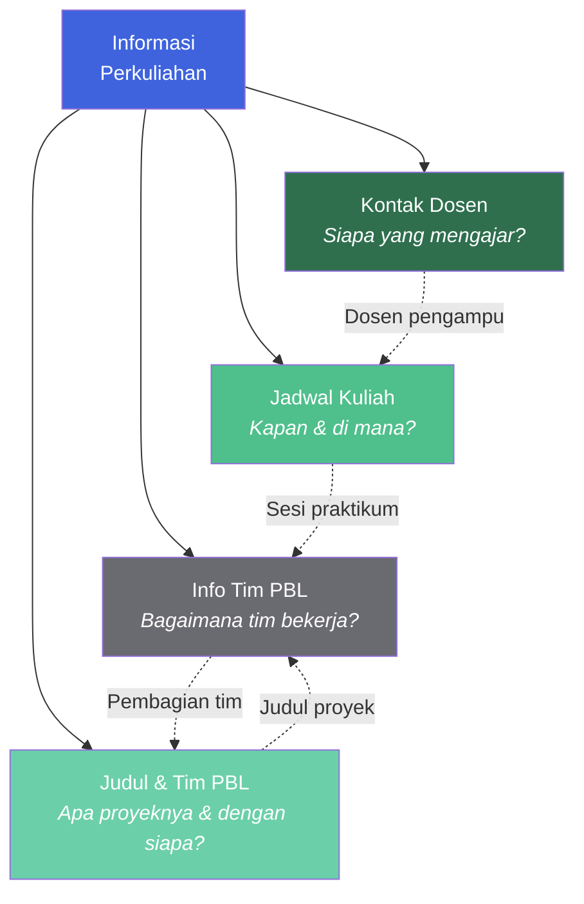
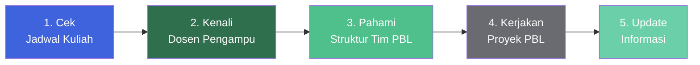

::: tip Portal E-Learning Resmi
Seluruh informasi resmi, materi, dan pengumuman perkuliahan juga terpusat di e-learning Jurusan Teknik Informatika.

[**Buka E-Learning IF Polibatam →**](https://learningif.polibatam.ac.id)
:::

## Sekilas Informasi

| **Halaman Informasi** | **Mata Kuliah** | **Tim PBL** |   **Semester**   |
| :-------------------: | :-------------: | :---------: | :--------------: |
|           4           |        7        |    Aktif    | Ganjil 2026/2027 |

Halaman ini adalah **pusat navigasi** untuk semua informasi praktis seputar perkuliahan. Kalau kamu baru pertama kali masuk ke dokumentasi ini, mulai dari sini — dari kontak dosen hingga pembagian tim PBL.

::: info Living Document
Semua informasi di halaman ini bersifat **living document** — artinya bisa berubah kapan saja mengikuti perkembangan perkuliahan. Cek halaman ini secara berkala, terutama saat ada perubahan jadwal atau pembaruan tim.
:::

## Peta Informasi

Empat halaman informasi ini saling melengkapi. Berikut bagaimana mereka terhubung satu sama lain:

**Cara membacanya:**

- **Kontak Dosen** — siapa saja yang mengajar dan bagaimana menghubungi mereka.
- **Jadwal Kuliah** — kapan dan di mana setiap mata kuliah berlangsung.
- **Info Tim PBL** — bagaimana struktur tim dan mekanisme kerja proyek.
- **Judul & Tim PBL** — proyek apa yang dikerjakan dan siapa saja anggotanya.

## Daftar Informasi

Pilih topik di bawah ini untuk melihat detailnya.

### Kontak Dosen

Daftar lengkap dosen pengampu beserta NIK, inisial, nama, email, dan nomor HP.

::: info Cakupan Informasi

- NIK (Nomor Induk Karyawan)
- Inisial dosen untuk referensi cepat di jadwal kuliah
- Nama lengkap dan gelar
- Alamat email resmi
- Nomor HP yang dapat dihubungi
  :::

[**Lihat Kontak Dosen →**](/v1/information/kontak-dosen)

### Jadwal Kuliah

Jadwal mingguan kelas malam TRPL — mata kuliah, dosen pengajar, ruangan, dan jam pelaksanaan.

::: info Cakupan Informasi

- Jadwal per hari (Senin hingga Jumat)
- Mata kuliah dengan kode dan nama lengkap
- Dosen pengajar (dalam bentuk inisial)
- Ruangan — online atau ruang kelas fisik
- Slot waktu dari pukul 18.00 hingga 23.00 WIB
  :::

[**Lihat Jadwal Kuliah →**](/v1/information/jadwal-kuliah)

### Info Tim PBL

Informasi tentang pembagian tim, peran anggota, dan mekanisme kerja Project-Based Learning.

::: info Cakupan Informasi

- Struktur dan mekanisme tim PBL
- Peran setiap anggota (ketua, anggota, dll.)
- Alur kerja dan target mingguan
- Panduan kolaborasi dan komunikasi tim
  :::

[**Lihat Info Tim PBL →**](/v1/information/info-team-pbl)

### Judul dan Tim PBL

Daftar judul proyek PBL yang sedang dikerjakan beserta anggota timnya.

::: info Cakupan Informasi

- Daftar judul proyek PBL yang aktif
- Anggota tim per proyek
- Deskripsi singkat setiap proyek
- Keterkaitan proyek dengan mata kuliah
  :::

[**Lihat Judul dan Tim PBL →**](/v1/information/judul-dan-team-pbl)

## Ringkasan Cepat

| Kategori            | Deskripsi                       | Tautan                                       |
| ------------------- | ------------------------------- | -------------------------------------------- |
| **Kontak Dosen**    | NIK, inisial, nama, email, HP   | [Buka →](/v1/information/kontak-dosen)       |
| **Jadwal Kuliah**   | Hari, jam, mata kuliah, ruangan | [Buka →](/v1/information/jadwal-kuliah)      |
| **Info Tim PBL**    | Struktur tim & peran anggota    | [Buka →](/v1/information/info-team-pbl)      |
| **Judul & Tim PBL** | Proyek & anggota tim            | [Buka →](/v1/information/judul-dan-team-pbl) |

## Alur Penggunaan Informasi

Berikut alur praktis cara memanfaatkan informasi ini sepanjang semester:

| Tahap | Yang Dilakukan                                        | Halaman yang Digunakan |
| :---: | ----------------------------------------------------- | ---------------------- |
| **1** | Cek jadwal untuk tahu kapan dan di mana kuliah        | Jadwal Kuliah          |
| **2** | Kenali dosen pengampu dan cara menghubungi mereka     | Kontak Dosen           |
| **3** | Pahami struktur tim dan mekanisme kerja PBL           | Info Tim PBL           |
| **4** | Kerjakan proyek sesuai judul dan pembagian tim        | Judul & Tim PBL        |
| **5** | Perbarui informasi jika ada perubahan jadwal atau tim | Semua halaman          |

## Tips Praktis

::: tip Tips untuk Mahasiswa Baru

- **Simpan nomor dosen** yang relevan di kontak ponselmu sejak awal semester.
- **Screenshot jadwal kuliah** atau simpan di catatan untuk referensi cepat saat tidak ada akses internet.
- **Kenali ketua tim PBL** kamu — biasanya dia yang mengoordinasi pengumpulan tugas dan komunikasi dengan dosen.
- **Catat tanggal-tanggal penting** dari jadwal: ATS, AAS, dan tenggat tugas besar.
- **Cek halaman ini setiap minggu** untuk memastikan tidak ada perubahan jadwal atau informasi tim.
  :::

::: warning Hal yang Perlu Diwaspadai

- **Jangan mengandalkan informasi usang.** Kalau jadwal atau tim berubah, cepat-cepat update catatanmu sendiri.
- **Jangan hanya mengandalkan halaman ini.** Selalu cek juga pengumuman resmi di e-learning dan grup kelas.
- **Jangan menunda komunikasi.** Kalau ada kendala dengan jadwal atau tim, segera hubungi dosen atau ketua tim.
  :::

## Halaman Terkait

| Halaman                             | Deskripsi                                                      |
| ----------------------------------- | -------------------------------------------------------------- |
| [**Mata Kuliah**](/v1/courses/)     | Daftar lengkap mata kuliah semester ini dengan materi & tugas. |
| [**Tugas**](/v1/task/)              | Daftar tugas dan detail pengumpulannya.                        |
| [**Tentang**](/v1/about)            | Informasi akademik pribadi dari pemelihara dokumentasi.        |
| [**Format & Aturan**](/format/page) | Konvensi dokumentasi dan panduan kontribusi.                   |

## Pertanyaan yang Sering Diajukan

::: details Bagaimana cara menghubungi dosen jika ada pertanyaan?

Setiap dosen memiliki kontak yang tercantum di halaman [Kontak Dosen](/v1/information/kontak-dosen) — biasanya email dan nomor HP. Untuk pertanyaan yang bersifat akademik, prioritaskan **email resmi** agar komunikasi terdokumentasi dengan baik. Untuk pertanyaan mendesak, bisa menggunakan nomor HP yang tercantum.

:::

::: details Apa yang harus dilakukan jika jadwal kuliah berubah?

Jadwal kuliah dapat berubah sewaktu-waktu mengikuti perkembangan perkuliahan. Jika ada perubahan:

1. Cek pengumuman resmi di e-learning atau grup kelas.
2. Perbarui catatan pribadimu.
3. Kalau perubahan signifikan, hubungi dosen atau ketua tim untuk konfirmasi.

Halaman [Jadwal Kuliah](/v1/information/jadwal-kuliah) akan diperbarui oleh pemelihara dokumentasi jika ada perubahan resmi.

:::

::: details Bagaimana jika saya belum masuk tim PBL?

Pembagian tim PBL biasanya dilakukan di awal semester oleh dosen pengampu. Jika kamu belum masuk tim atau belum tahu tim kamu:

1. Cek halaman [Info Tim PBL](/v1/information/info-team-pbl) dan [Judul dan Tim PBL](/v1/information/judul-dan-team-pbl).
2. Kalau masih belum jelas, hubungi dosen pengampu RPL101 (koordinator PBL).
3. Bisa juga tanyakan ke ketua kelas atau teman sekelas.

:::

::: details Apakah ada grup komunikasi resmi untuk kelas saya?

Informasi grup komunikasi (WhatsApp, Telegram, atau platform lain) biasanya disampaikan di awal semester melalui e-learning atau dosen pengampu. Cek pengumuman di e-learning untuk tautan grup resmi kelasmu.

:::

::: details Siapa yang mengelola halaman informasi ini?

Halaman ini dikelola oleh mahasiswa yang bertanggung jawab atas dokumentasi perkuliahan — bukan oleh program studi secara resmi. Karena itu, **selalu utamakan pengumuman resmi dari e-learning dan dosen pengampu** jika ada perbedaan informasi.

:::

## Sumber Referensi Online

### Platform Utama

| Sumber                      | Tautan                                       |
| --------------------------- | -------------------------------------------- |
| **E-Learning IF Polibatam** | [Buka →](https://learningif.polibatam.ac.id) |
| **Politeknik Negeri Batam** | [Buka →](https://www.polibatam.ac.id)        |

### Halaman PBL

| Sumber                                      | Tautan                                                                                                                          |
| ------------------------------------------- | ------------------------------------------------------------------------------------------------------------------------------- |
| **Panduan PBL Semester 1 Ganjil 2026/2027** | [Unduh PDF →](https://learning-if.polibatam.ac.id/pluginfile.php/36673/mod_label/intro/Panduan%20PBL%20Sem%201%202026-2027.pdf) |
| **Pembagian Judul dan Tim PBL**             | [Buka Halaman →](https://polibatam.id/tim-pbl-sem1-trpl-2026)                                                                   |

::: info Tentang Halaman Ini
Semua informasi di halaman ini bersifat **living document** — dapat berubah kapan saja mengikuti perkembangan perkuliahan. Informasi resmi tetap mengacu pada pengumuman dari e-learning IF Polibatam dan dosen pengampu.

**Terakhir diperbarui:** sesuaikan dengan tanggal update terakhir.
:::

::: tip Butuh Update Cepat?
Kalau ada informasi yang berubah (jadwal diundur, dosen ganti jam konsultasi, tim PBL berubah, dll.), langsung edit file yang bersangkutan dan commit. Jangan biarkan informasi basi menumpuk — informasi yang usang lebih berbahaya daripada tidak ada informasi.
:::

::: warning Catatan
Semua link di halaman ini mengarah ke file Markdown di folder `docs/v1/information/`. Kalau link-nya merah (404), berarti file belum dibuat.
:::
