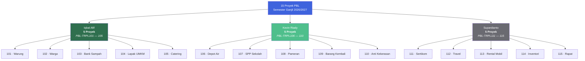
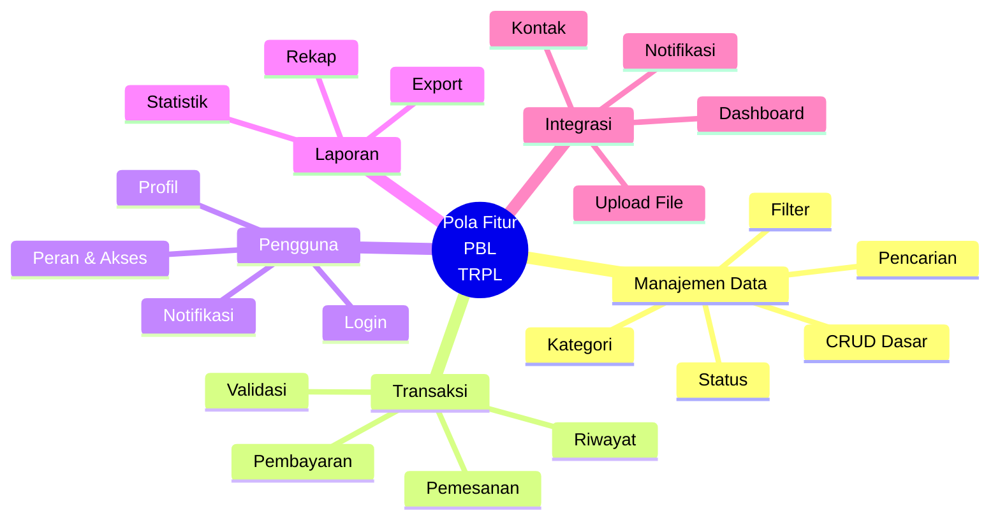

::: tip Portal E-Learning & Panduan Resmi
Semua materi, penugasan, dan panduan proyek PBL terpusat di e-learning IF Polibatam.

[**Buka E-Learning →**](https://learningif.polibatam.ac.id) · [**Buka Panduan PBL →**](https://polibatam.id/tim-pbl-sem1-trpl-2026)
:::

## Sekilas PBL

| **Total Proyek** | **Manajer Proyek** | **Kelompok Manpro** |     **Semester**     |
| :--------------: | :----------------: | :-----------------: | :------------------: |
|        15        |         4          |          4          | 1 (Ganjil 2026/2027) |

::: info Tentang Halaman Ini
Halaman ini memuat **daftar lengkap judul proyek PBL** beserta deskripsi ruang lingkup, fitur utama, dan dosen manajer proyek (Manpro) untuk **Semester Ganjil 2026/2027**.

Setiap tim wajib memahami deskripsi ruang lingkup aplikasi serta fitur utama yang harus ada. Penilaian progres akan mengacu pada ketentuan dalam **Panduan PBL Prodi TRPL**.
:::

## Distribusi Manpro

Empat dosen Manpro membimbing 15 proyek. Berikut pembagiannya:

**Kesimpulan:** Setiap Manpro membimbing **tepat 5 proyek** — pembagian yang seimbang dan memudahkan koordinasi antar-tim di bawah satu dosen.

## Daftar Proyek

Pilih proyek di bawah ini untuk melihat deskripsi lengkap dan fitur utamanya.

### Ringkasan Semua Proyek

| No. | Kode        | Judul Proyek                                 | Manpro      | Tim |
| :-: | ----------- | -------------------------------------------- | ----------- | :-: |
|  1  | PBL-TRPL101 | Aplikasi Pengelolaan Warung                  | Iqbal Afif  |  —  |
|  2  | PBL-TRPL102 | Aplikasi Informasi Warga                     | Iqbal Afif  |  —  |
|  3  | PBL-TRPL103 | Aplikasi Pengelolaan Bank Sampah             | Iqbal Afif  |  —  |
|  4  | PBL-TRPL104 | Aplikasi Lapak UMKM                          | Iqbal Afif  |  —  |
|  5  | PBL-TRPL105 | Aplikasi Pengelolaan Catering Harian         | Iqbal Afif  |  —  |
|  6  | PBL-TRPL106 | Aplikasi Pengelolaan Depot Air               | Kevin Riady |  —  |
|  7  | PBL-TRPL107 | Aplikasi Informasi Iuran SPP Sekolah         | Kevin Riady |  —  |
|  8  | PBL-TRPL108 | Aplikasi Ruang Pameran Sederhana             | Kevin Riady |  —  |
|  9  | PBL-TRPL109 | Aplikasi Penggunaan Barang Kembali           | Kevin Riady |  —  |
| 10  | PBL-TRPL110 | Aplikasi Pencegahan dan Penanganan Kekerasan | Kevin Riady |  —  |
| 11  | PBL-TRPL111 | Aplikasi Manajemen Sertikom                  | Supardianto |  —  |
| 12  | PBL-TRPL112 | Aplikasi Manajemen Travel Sederhana          | Supardianto |  —  |
| 13  | PBL-TRPL113 | Aplikasi Usaha Rental Mobil Sederhana        | Supardianto |  —  |
| 14  | PBL-TRPL114 | Aplikasi Pengelolaan Inventori Sederhana     | Supardianto |  —  |
| 15  | PBL-TRPL115 | Aplikasi Pengelolaan Rapat Sederhana         | Supardianto |  —  |

### Kelompok Iqbal Afif

#### PBL-TRPL101 — Aplikasi Pengelolaan Warung

::: details Deskripsi & Fitur Utama

**Deskripsi**

Platform berbasis web yang bertujuan untuk membantu pemilik warung/toko kelontong dalam mencatat transaksi dan mengelola stok barang secara lebih rapi. Selama ini banyak pemilik warung kecil masih mencatat transaksi secara manual, sehingga rawan kesalahan hitung dan sulit memantau stok maupun keuntungan. Aplikasi ini hadir sebagai solusi sederhana untuk mengatasi masalah tersebut.

**Fitur Utama**

- **Pencatatan Transaksi** — Mencatat setiap transaksi jual-beli harian secara otomatis, lengkap dengan rincian barang dan harga.
- **Manajemen Stok** — Memantau jumlah stok barang secara _real-time_ setiap kali terjadi transaksi.
- **Laporan Untung-Rugi** — Menyajikan ringkasan keuntungan dan kerugian harian/mingguan.
- **Notifikasi Stok Menipis** — Mengingatkan pemilik warung saat stok barang tertentu hampir habis.

**Manajer Proyek:** Iqbal Afif

:::

#### PBL-TRPL102 — Aplikasi Informasi Warga

::: details Deskripsi & Fitur Utama

**Deskripsi**

Platform berbasis web yang bertujuan untuk mempermudah komunikasi antara pengurus RT/RW dan warga. Selama ini penyampaian informasi, pengumpulan iuran, dan pengurusan surat sering dilakukan secara manual dan kurang terdokumentasi dengan baik. Aplikasi ini hadir untuk membuat komunikasi dan administrasi warga menjadi lebih tertib dan transparan.

**Fitur Utama**

- **Papan Pengumuman Digital** — Menyampaikan informasi RT/RW secara cepat kepada seluruh warga.
- **Pencatatan Iuran Warga** — Mencatat status pembayaran iuran kas, sampah, atau keamanan tiap warga.
- **Data Kependudukan Sederhana** — Menyimpan data dasar warga untuk keperluan administrasi.
- **Pengajuan Surat Online** — Memungkinkan warga mengajukan surat pengantar tanpa harus datang langsung.

**Manajer Proyek:** Iqbal Afif

:::

#### PBL-TRPL103 — Aplikasi Pengelolaan Bank Sampah

::: details Deskripsi & Fitur Utama

**Deskripsi**

Platform berbasis web yang bertujuan untuk membantu pengelolaan bank sampah di lingkungan warga. Pencatatan setoran sampah secara manual sering menyulitkan pengurus dalam menghitung saldo dan riwayat transaksi nasabah. Aplikasi ini hadir untuk membuat pengelolaan bank sampah lebih tertib sekaligus mendorong warga peduli lingkungan.

**Fitur Utama**

- **Pencatatan Setoran** — Mencatat jenis dan berat sampah yang disetorkan warga.
- **Konversi Otomatis ke Saldo** — Menghitung nilai saldo tabungan berdasarkan berat dan jenis sampah.
- **Riwayat Transaksi** — Menampilkan riwayat setor dan tarik saldo nasabah.
- **Info Harga Sampah** — Menyediakan informasi harga terkini tiap jenis sampah.

**Manajer Proyek:** Iqbal Afif

:::

#### PBL-TRPL104 — Aplikasi Lapak UMKM

::: details Deskripsi & Fitur Utama

**Deskripsi**

Platform berbasis web yang bertujuan untuk membantu pelaku UMKM di sekitar kampus/perumahan mempromosikan produk mereka secara digital. Banyak UMKM kecil belum memiliki media promosi online sehingga jangkauan pembelinya terbatas. Aplikasi ini hadir sebagai etalase sederhana untuk memperluas jangkauan pemasaran mereka.

**Fitur Utama**

- **Etalase Produk** — Menampilkan produk UMKM lokal lengkap dengan foto dan harga.
- **Pencarian Produk** — Mencari produk berdasarkan kategori usaha.
- **Kontak Penjual** — Menghubungkan calon pembeli langsung ke penjual.
- **Testimoni dan Rating** — Menampilkan ulasan pembeli sebagai bahan pertimbangan.

**Manajer Proyek:** Iqbal Afif

:::

#### PBL-TRPL105 — Aplikasi Pengelolaan Catering Harian

::: details Deskripsi & Fitur Utama

**Deskripsi**

Platform berbasis web yang bertujuan untuk mempermudah pemesanan makanan katering rumahan bagi mahasiswa atau pekerja yang membutuhkan makan harian. Mencari dan memesan katering secara manual sering kurang praktis dan minim informasi menu. Aplikasi ini hadir sebagai solusi pemesanan yang lebih mudah dan terjadwal.

**Fitur Utama**

- **Katalog Menu** — Menampilkan pilihan menu harian atau mingguan.
- **Pemesanan Paket Langganan** — Memungkinkan pelanggan berlangganan paket makan secara berkala.
- **Jadwal Pengantaran** — Menentukan waktu antar makanan sesuai kesepakatan.
- **Riwayat dan Ulasan** — Mencatat riwayat pesanan serta ulasan terhadap menu.

**Manajer Proyek:** Iqbal Afif

:::

### Kelompok Kevin Riady

#### PBL-TRPL106 — Aplikasi Pengelolaan Depot Air

::: details Deskripsi & Fitur Utama

**Deskripsi**

Platform berbasis web yang bertujuan untuk mempermudah rumah tangga memesan dan mengingat jadwal isi ulang air galon atau gas. Kebutuhan ini sering terlupakan sehingga stok habis di waktu yang tidak tepat. Aplikasi ini hadir sebagai solusi pengingat dan pemesanan yang lebih praktis.

**Fitur Utama**

- **Pemesanan Online** — Memesan galon air atau gas secara langsung melalui aplikasi.
- **Pengingat Otomatis** — Mengingatkan pengguna untuk memesan ulang berdasarkan pola konsumsi.
- **Riwayat Pemesanan** — Menyimpan catatan pemesanan bulanan pengguna.
- **Kontak Agen** — Menghubungkan pengguna dengan agen pengantar terdekat.

**Manajer Proyek:** Kevin Riady

:::

#### PBL-TRPL107 — Aplikasi Informasi Iuran SPP Sekolah

::: details Deskripsi & Fitur Utama

**Deskripsi**

Platform berbasis web yang bertujuan untuk mempermudah orang tua murid dalam melaporkan bukti pembayaran SPP (Sumbangan Pembinaan Pendidikan) kepada pihak sekolah secara online. Selama ini pelaporan pembayaran SPP sering dilakukan dengan mengantarkan bukti transfer secara manual ke sekolah atau melalui pesan pribadi ke bendahara, sehingga rawan hilang, sulit direkap, dan menyulitkan pihak sekolah dalam memverifikasi serta memantau status pembayaran seluruh siswa. Aplikasi ini hadir sebagai solusi untuk membuat proses pelaporan, verifikasi, dan pencatatan pembayaran SPP menjadi lebih praktis, transparan, dan terdokumentasi dengan baik.

**Fitur Utama**

- **Pelaporan Pembayaran Online** — Orang tua dapat melaporkan pembayaran SPP dengan mengisi data siswa, bulan/periode pembayaran, dan nominal yang dibayarkan.
- **Unggah Bukti Transfer** — Orang tua dapat melampirkan foto atau file bukti transfer/pembayaran sebagai lampiran laporan.
- **Verifikasi Pembayaran** — Bendahara/admin sekolah dapat memeriksa, menyetujui, atau menolak laporan pembayaran beserta memberikan catatan jika ada kekurangan.
- **Notifikasi Status** — Orang tua menerima notifikasi otomatis mengenai status laporan pembayaran mereka (diproses, terverifikasi, atau ditolak).
- **Riwayat dan Rekap Pembayaran** — Menyajikan riwayat pembayaran SPP per siswa serta rekap status lunas/tunggakan per bulan.

**Manajer Proyek:** Kevin Riady

:::

#### PBL-TRPL108 — Aplikasi Ruang Pameran Sederhana

::: details Deskripsi & Fitur Utama

**Deskripsi**

Platform berbasis web yang bertujuan untuk memudahkan mahasiswa memamerkan hasil karya desain mereka (seperti poster, ilustrasi, UI/UX, logo, atau karya visual lainnya) kepada dosen, sesama mahasiswa, maupun masyarakat umum. Selama ini karya-karya tugas mahasiswa sering hanya dikumpulkan lewat email atau grup chat, lalu tidak terlihat lagi setelah dinilai, padahal banyak karya berkualitas yang layak ditampilkan sebagai portofolio. Aplikasi ini hadir sebagai galeri digital untuk mendokumentasikan, memamerkan, dan mendapatkan apresiasi atas karya desain mahasiswa secara berkelanjutan.

**Fitur Utama**

- **Unggah Karya** — Mahasiswa dapat mengunggah karya desain beserta judul, deskripsi, kategori, dan tools yang digunakan.
- **Portofolio Profil** — Setiap mahasiswa memiliki halaman profil yang menampilkan seluruh koleksi karya mereka secara rapi.
- **Apresiasi dan Komentar** — Pengunjung dapat memberikan _like_ dan komentar/masukan terhadap karya yang dipamerkan.
- **Pencarian dan Filter Kategori** — Memudahkan pengunjung menjelajahi karya berdasarkan kategori (poster, ilustrasi, UI/UX, dll) atau mata kuliah terkait.
- **Karya Terpopuler** — Menampilkan daftar karya dengan apresiasi terbanyak sebagai bentuk pengakuan dan motivasi bagi mahasiswa.

**Manajer Proyek:** Kevin Riady

:::

#### PBL-TRPL109 — Aplikasi Penggunaan Barang Kembali

::: details Deskripsi & Fitur Utama

**Deskripsi**

Platform berbasis web yang bertujuan untuk mendukung budaya berbagi dan penggunaan kembali barang layak pakai di lingkungan Polibatam. Banyak civitas akademika memiliki barang yang masih layak digunakan namun sudah tidak lagi dibutuhkan — seperti buku, alat tulis, perlengkapan kantor, atau furniture — dan berakhir tersimpan tanpa manfaat. Sementara itu, ada pihak lain yang justru membutuhkan barang tersebut. Aplikasi ini hadir sebagai etalase digital (_e-catalogue_) yang mempertemukan pemilik barang dengan pihak yang membutuhkan, khususnya untuk barang berukuran besar yang tidak bisa langsung diletakkan di suatu tempat station fisik, sekaligus mendukung terwujudnya lingkungan kampus yang lebih berkelanjutan.

**Fitur Utama**

- **Unggah Barang** — Pemilik dapat mengunggah barang yang ingin dibagikan lengkap dengan foto, deskripsi, kategori, dan kondisi barang.
- **Katalog dan Pencarian** — Menampilkan seluruh barang yang tersedia dengan fitur pencarian dan filter berdasarkan kategori (buku, elektronik, furniture, dll).
- **Kontak Pemilik** — Memudahkan pihak yang membutuhkan menghubungi pemilik barang secara langsung untuk mengatur proses pengambilan.
- **Status Ketersediaan** — Menampilkan status barang (tersedia/sudah diambil) agar tidak terjadi duplikasi permintaan atas barang yang sama.
- **Edukasi dan Ketentuan** — Menyediakan informasi panduan berpartisipasi serta pengingat bahwa barang tersebut hanya untuk digunakan kembali, bukan untuk diperjualbelikan.

**Manajer Proyek:** Kevin Riady

:::

#### PBL-TRPL110 — Aplikasi Pencegahan dan Penanganan Kekerasan

::: details Deskripsi & Fitur Utama

**Deskripsi**

Platform berbasis web yang bertujuan untuk memudahkan mahasiswa menyampaikan pengaduan terkait kekerasan (termasuk kekerasan seksual, perundungan, atau bentuk kekerasan lain) di lingkungan perguruan tinggi kepada Satuan Tugas Pencegahan dan Penanganan Kekerasan (Satgas PPKS), sesuai amanat Permendikbudristek No. 30 Tahun 2021. Selama ini proses pengaduan sering dilakukan secara lisan atau manual, yang berisiko membuat korban enggan melapor karena kekhawatiran identitas terbuka, proses berbelit, atau tidak jelas tindak lanjutnya. Aplikasi ini hadir sebagai kanal pelaporan yang aman, rahasia, dan terdokumentasi, sekaligus membantu Satgas dalam mengelola, menindaklanjuti, dan merekap kasus secara lebih tertib dan akuntabel.

**Fitur Utama**

- **Pengaduan Rahasia** — Mahasiswa dapat menyampaikan laporan secara anonim maupun dengan identitas yang dijaga kerahasiaannya, hanya dapat diakses oleh anggota Satgas berwenang.
- **Unggah Bukti Pendukung** — Pelapor dapat melampirkan dokumen, foto, atau keterangan pendukung untuk memperkuat laporan.
- **Kategori Jenis Kekerasan** — Mengelompokkan laporan berdasarkan jenis kasus untuk mempermudah penanganan sesuai prosedur yang berlaku.
- **Pelacakan Status Penanganan** — Pelapor dapat memantau perkembangan status laporan mereka (diterima, diverifikasi, dalam proses, selesai) tanpa membuka detail sensitif ke pihak lain.
- **Manajemen Kasus untuk Satgas** — Menyediakan _dashboard_ khusus bagi anggota Satgas untuk mengelola, mendisposisikan, dan merekap seluruh kasus secara terorganisir dan akuntabel.
- **Edukasi dan Kontak Darurat** — Menyediakan informasi prosedur pelaporan, hak-hak pelapor, serta kontak layanan pendampingan/psikologis.

**Manajer Proyek:** Kevin Riady

:::

### Kelompok Supardianto

#### PBL-TRPL111 — Aplikasi Manajemen Sertikom

::: details Deskripsi & Fitur Utama

**Deskripsi**

Platform berbasis web yang bertujuan untuk memudahkan mahasiswa memilih jenis Sertifikat Kompetensi (Sertikom) yang ditawarkan oleh jurusan, sekaligus membantu pihak jurusan dalam merekap data peminatan dan peserta secara lebih cepat dan akurat. Selama ini proses pemilihan sertikom sering dilakukan melalui formulir manual atau Google Form yang datanya tersebar dan sulit direkap ulang, terutama saat jumlah mahasiswa banyak dan pilihan sertikom beragam. Aplikasi ini hadir sebagai solusi terpusat agar proses pendaftaran, seleksi, dan pelaporan sertikom menjadi lebih praktis, terorganisir, dan minim kesalahan data.

**Fitur Utama**

- **Daftar Sertikom** — Menampilkan seluruh jenis sertikom yang ditawarkan jurusan lengkap dengan deskripsi, jadwal, syarat, dan kuota peserta.
- **Pendaftaran Online** — Mahasiswa dapat memilih dan mendaftar sertikom sesuai minat langsung melalui aplikasi tanpa formulir manual.
- **Validasi Kuota Otomatis** — Sistem otomatis menutup pendaftaran atau memberi peringatan saat kuota suatu sertikom telah terpenuhi.
- **Rekap Data Peserta** — Jurusan dapat melihat dan mengekspor rekap jumlah dan daftar peserta per jenis sertikom secara instan.
- **Riwayat dan Status Sertikom** — Menyimpan riwayat sertikom yang pernah diikuti mahasiswa beserta status penyelesaiannya (terdaftar, mengikuti, lulus/selesai).

**Manajer Proyek:** Supardianto

:::

#### PBL-TRPL112 — Aplikasi Manajemen Travel Sederhana

::: details Deskripsi & Fitur Utama

**Deskripsi**

Platform berbasis web yang bertujuan untuk membantu agen travel mengelola paket wisata secara lebih terorganisir, sekaligus memudahkan turis dalam mencari dan memesan paket wisata sesuai kebutuhan mereka. Selama ini banyak agen travel kecil masih mengelola informasi paket, jadwal keberangkatan, dan pemesanan secara manual melalui catatan atau pesan pribadi, sehingga rawan bentrok jadwal, sulit memantau kuota peserta, dan kurang praktis bagi calon turis yang ingin membandingkan pilihan paket. Aplikasi ini hadir sebagai solusi untuk mempermudah proses pengelolaan paket wisata sekaligus pemesanan oleh turis secara online.

**Fitur Utama**

- **Katalog Paket Wisata** — Menampilkan seluruh paket wisata yang ditawarkan lengkap dengan destinasi, harga, fasilitas, dan jadwal keberangkatan.
- **Pemesanan Online** — Turis dapat memilih dan memesan paket wisata langsung melalui aplikasi tanpa harus datang ke kantor travel.
- **Manajemen Paket oleh Travel** — Pihak travel dapat menambah, mengedit, atau menonaktifkan paket wisata beserta pengaturan kuota dan jadwalnya.
- **Validasi Kuota dan Jadwal** — Sistem otomatis menampilkan status ketersediaan kursi serta mencegah pemesanan melebihi kuota yang ditentukan.
- **Riwayat dan Status Pemesanan** — Turis dapat memantau status pemesanan mereka (menunggu konfirmasi, terkonfirmasi, selesai), sementara pihak travel dapat merekap seluruh data pemesanan untuk keperluan laporan.

**Manajer Proyek:** Supardianto

:::

#### PBL-TRPL113 — Aplikasi Usaha Rental Mobil Sederhana

::: details Deskripsi & Fitur Utama

**Deskripsi**

Platform berbasis web yang bertujuan untuk membantu usaha rental mobil mengelola data kendaraan dan transaksi penyewaan secara lebih terorganisir, sekaligus memudahkan pengguna dalam mencari dan memesan mobil sesuai kebutuhan mereka. Selama ini banyak usaha rental mobil skala kecil-menengah masih mencatat ketersediaan mobil dan pemesanan secara manual melalui buku catatan atau pesan pribadi, sehingga rawan terjadi bentrok jadwal sewa, sulit memantau status mobil (tersedia/disewa), dan kurang praktis bagi calon penyewa yang ingin membandingkan pilihan mobil. Aplikasi ini hadir sebagai solusi untuk mempermudah proses pengelolaan armada sekaligus pemesanan mobil secara online.

**Fitur Utama**

- **Katalog Mobil** — Menampilkan daftar mobil yang tersedia lengkap dengan foto, spesifikasi, harga sewa per hari, dan status ketersediaan.
- **Pemesanan Online** — Pengguna dapat memilih mobil, menentukan tanggal sewa, dan melakukan pemesanan langsung melalui aplikasi.
- **Manajemen Armada** — Pihak rental dapat menambah, mengedit, atau menonaktifkan data mobil beserta status perawatan/servis kendaraan.
- **Validasi Ketersediaan Otomatis** — Sistem otomatis mengecek dan mencegah pemesanan mobil yang sudah disewa pada tanggal yang sama.
- **Riwayat dan Status Sewa** — Pengguna dapat memantau status pemesanan mereka (menunggu konfirmasi, disetujui, selesai), sementara pihak rental dapat merekap seluruh riwayat transaksi sewa untuk keperluan laporan.

**Manajer Proyek:** Supardianto

:::

#### PBL-TRPL114 — Aplikasi Pengelolaan Inventori Sederhana

::: details Deskripsi & Fitur Utama

**Deskripsi**

Platform berbasis web yang bertujuan untuk membantu pelaku usaha (toko, UMKM, atau bisnis skala kecil-menengah) mengelola data inventori barang secara lebih rapi dan akurat. Selama ini banyak usaha kecil masih mencatat stok barang secara manual di buku atau spreadsheet terpisah, sehingga rawan terjadi selisih data, sulit memantau barang yang hampir habis, dan menyulitkan pemilik usaha dalam mengambil keputusan pembelian ulang (_restock_). Aplikasi ini hadir sebagai solusi untuk membuat pencatatan dan pemantauan inventori menjadi lebih praktis, _real-time_, dan terdokumentasi dengan baik.

**Fitur Utama**

- **Manajemen Data Barang** — Menambah, mengedit, dan menghapus data barang lengkap dengan kategori, satuan, dan harga.
- **Pencatatan Stok Masuk/Keluar** — Mencatat setiap transaksi penambahan atau pengurangan stok secara otomatis dan _real-time_.
- **Notifikasi Stok Menipis** — Memberikan peringatan otomatis saat stok barang mencapai batas minimum yang ditentukan.
- **Laporan Inventori** — Menyajikan laporan ringkasan stok, nilai barang, serta riwayat pergerakan stok dalam periode tertentu.
- **Data Supplier** — Menyimpan informasi pemasok untuk memudahkan proses pemesanan ulang barang yang stoknya menipis.

**Manajer Proyek:** Supardianto

:::

#### PBL-TRPL115 — Aplikasi Pengelolaan Rapat Sederhana

::: details Deskripsi & Fitur Utama

**Deskripsi**

Platform berbasis web yang bertujuan untuk membantu suatu instansi atau organisasi dalam mengelola jadwal rapat serta mencatat kehadiran peserta secara lebih praktis dan terdokumentasi. Selama ini penjadwalan rapat sering dilakukan melalui pesan grup yang mudah tenggelam, sementara presensi masih menggunakan kertas manual yang rawan hilang dan sulit direkap untuk keperluan laporan. Aplikasi ini hadir sebagai solusi untuk membuat proses pengelolaan rapat — mulai dari penjadwalan, undangan, hingga pencatatan kehadiran — menjadi lebih rapi, efisien, dan mudah diakses kapan saja.

**Fitur Utama**

- **Penjadwalan Rapat** — Membuat jadwal rapat lengkap dengan tanggal, waktu, lokasi/tautan online, dan agenda pembahasan.
- **Presensi Online** — Peserta dapat mengisi kehadiran secara digital pada waktu rapat berlangsung, termasuk opsi izin/tidak hadir dengan keterangan.
- **Notulensi dan Agenda** — Menyimpan catatan hasil rapat (notulen) serta poin-poin tindak lanjut agar mudah diakses kembali.
- **Rekap Kehadiran** — Menyajikan laporan rekap kehadiran peserta per rapat maupun akumulasi dalam periode tertentu untuk keperluan evaluasi.

**Manajer Proyek:** Supardianto

:::

## Pola Fitur Umum

Meskipun setiap proyek punya konteks unik, ada **pola fitur yang berulang** di hampir semua proyek. Memahami pola ini akan mempercepat pemahamanmu.

**Pola yang paling sering muncul:**

| Pola                           | Deskripsi                                              | Contoh Proyek      |
| ------------------------------ | ------------------------------------------------------ | ------------------ |
| **CRUD + Status**              | Tambah, baca, ubah, hapus data dengan indikator status | 101, 106, 111, 113 |
| **Pemesanan & Validasi Kuota** | Pesan sesuatu, cek ketersediaan, cegah duplikasi       | 105, 112, 113      |
| **Unggah File/Bukti**          | Lampirkan foto, dokumen, atau bukti transfer           | 107, 108, 109, 110 |
| **Notifikasi & Pengingat**     | Sistem memberi tahu pengguna saat kondisi tertentu     | 101, 106, 107, 114 |
| **Dashboard & Rekap**          | Halaman admin dengan ringkasan data                    | 107, 110, 111, 115 |

## Timeline Proyek PBL

Setiap tim mengikuti timeline yang sama — 14 minggu dengan dua milestone besar.

```mermaid
gantt
    title Timeline PBL 14 Minggu
    dateFormat X
    axisFormat %s

    section Identifikasi
    Penjelasan & Pembagian Tim            :a1, 0, 1
    Identifikasi Masalah Proyek           :crit, a2, 1, 1

    section Desain
    Pemodelan Kebutuhan Perangkat Lunak   :b1, 2, 1
    Pemodelan Data & Antarmuka            :b2, 3, 1

    section Prototipe
    Implementasi Antarmuka                :c1, 4, 1
    Melengkapi Laporan                    :c2, 5, 1
    Berkas ATS                            :crit, c3, 6, 1

    section Implementasi
    Implementasi Perangkat Lunak          :d1, 7, 4

    section Pengujian
    Menguji Perangkat Lunak               :e1, 11, 2

    section Finalisasi
    Verifikasi & Berkas AAS               :crit, f1, 13, 1
```

**Milestone penting:**

- **Minggu 7 — ATS:** identifikasi kebutuhan, prototype (frontend UI), dan skema data.
- **Minggu 14 — AAS:** produk jadi, kasus uji dan hasil uji, dan dokumentasi lengkap.

## Catatan Penting

::: warning Perhatian

- Setiap tim **wajib memahami** deskripsi ruang lingkup aplikasi serta fitur utama yang harus ada dalam perangkat lunak.
- Penilaian pencapaian progres pengerjaan perangkat lunak akan dinilai berdasarkan ketentuan dalam **Panduan PBL Prodi TRPL**.
- Sesi praktikum mata kuliah **Pengantar RPL** digunakan untuk monitoring pengerjaan proyek dengan target mingguan yang harus dicapai.
- Pastikan proyek dikerjakan **sebaik-baiknya**, karena berpengaruh besar terhadap penilaian di **semua mata kuliah yang terlibat PBL** di semester ini.
  :::

::: tip Panduan Lengkap
Panduan lengkap dan pembagian tim resmi dapat dilihat pada:

- [**Panduan Project-Based Learning Semester 1 Ganjil 2026-2027**](https://polibatam.id/tim-pbl-sem1-trpl-2026)
- [**Panduan PBL Prodi TRPL (PDF)**](https://learning-if.polibatam.ac.id/pluginfile.php/36673/mod_label/intro/Panduan%20PBL%20Sem%201%202026-2027.pdf)
  :::

## Halaman Terkait

| Halaman                                            | Deskripsi                                             |
| -------------------------------------------------- | ----------------------------------------------------- |
| [**Info Tim PBL**](/v1/information/info-team-pbl)  | Struktur tim, peran anggota, dan mekanisme kerja PBL. |
| [**Jadwal Kuliah**](/v1/information/jadwal-kuliah) | Jadwal mingguan kelas malam TRPL.                     |
| [**Kontak Dosen**](/v1/information/kontak-dosen)   | Kontak Manpro dan dosen pengampu lainnya.             |
| [**Mata Kuliah**](/v1/courses/)                    | Daftar mata kuliah yang terlibat PBL.                 |

## Pertanyaan yang Sering Diafakan

::: details Bagaimana cara mengetahui tim saya untuk proyek tertentu?

Pembagian tim dilakukan secara **resmi** oleh dosen pengampu dan tercantum dalam panduan PBL. Jika kamu belum tahu tim kamu:

1. Cek pengumuman di e-learning IF Polibatam.
2. Hubungi dosen pengampu RPL101 (koordinator PBL).
3. Tanyakan ke ketua kelas atau teman sekelas.

Halaman ini hanya menampilkan **daftar judul dan Manpro** — belum termasuk pembagian anggota tim.

:::

::: details Apakah saya boleh memilih proyek sendiri?

**Tidak.** Pembagian proyek biasanya ditetapkan oleh dosen Manpro dan tidak bisa dipilih sendiri. Namun, kalau kamu punya preferensi kuat atau alasan khusus, bisa didiskusikan dengan dosen pengampu di awal semester.

:::

::: details Berapa jumlah anggota tiap tim?

Jumlah anggota tiap tim biasanya ditentukan dalam panduan PBL — umumnya **3 hingga 5 orang** per tim. Detail pastinya dapat dilihat di pengumuman resmi.

:::

::: details Apakah boleh menukar proyek dengan tim lain?

Perpindahan antar-tim biasanya **tidak diperbolehkan** kecuali ada alasan kuat (misalnya konflik jadwal atau masalah kolaborasi). Jika kamu merasa perlu pindah, ajukan secara resmi ke dosen Manpro dengan alasan yang jelas.

:::

::: details Bagaimana jika proyek saya terlalu mirip dengan proyek lain?

Beberapa proyek memang punya kemiripan alami — misalnya PBL-TRPL113 (Rental Mobil) dan PBL-TRPL112 (Travel) sama-sama bergerak di bidang pemesanan. Yang membedakan adalah **konteks dan ruang lingkup**. Pastikan kamu membaca **deskripsi lengkap** proyekmu dan mengikuti arahan Manpro.

:::

::: details Apakah proyek bisa berubah di tengah semester?

**Umumnya tidak.** Ruang lingkup proyek sudah ditetapkan di awal dan menjadi acuan penilaian. Perubahan signifikan hanya bisa dilakukan dengan persetujuan dosen Manpro.

:::

::: details Apa hubungan antara Judul Proyek PBL dan mata kuliah?

Setiap proyek PBL melibatkan minimal **empat mata kuliah** (RPL101, RPL104, RPL105, RPL106) dan didukung oleh RPL102 dan RPL103. Setiap mata kuliah menyumbang bagian berbeda:

- **RPL101** — analisis dan perancangan
- **RPL104** — dokumen SRS
- **RPL105** — implementasi web
- **RPL106** — skema database

:::

::: details Bagaimana jika tim saya tidak solid?

Komunikasi adalah kunci. Jika ada masalah dalam tim:

1. Diskusikan secara internal terlebih dahulu.
2. Jika belum selesai, minta bantuan **ketua tim** untuk mediasi.
3. Jika masih berlanjut, **hubungi dosen Manpro** — jangan dipendam sendiri.

Ingat: kolaborasi tim adalah salah satu komponen penilaian di proyek PBL.

:::

## Sumber Referensi Online

### Panduan PBL

| Sumber                                            | Tautan                                                                                                                      |
| ------------------------------------------------- | --------------------------------------------------------------------------------------------------------------------------- |
| **Panduan PBL Semester 1 Ganjil 2026-2027 (PDF)** | [Unduh →](https://learning-if.polibatam.ac.id/pluginfile.php/36673/mod_label/intro/Panduan%20PBL%20Sem%201%202026-2027.pdf) |
| **Halaman Pembagian Tim PBL**                     | [Buka →](https://polibatam.id/tim-pbl-sem1-trpl-2026)                                                                       |

### Platform Utama

| Sumber                      | Tautan                                       |
| --------------------------- | -------------------------------------------- |
| **E-Learning IF Polibatam** | [Buka →](https://learningif.polibatam.ac.id) |
| **Politeknik Negeri Batam** | [Buka →](https://www.polibatam.ac.id)        |

::: info Tentang Halaman Ini
Halaman ini disusun berdasarkan **Daftar Judul dan Tim PBL Semester Ganjil 2026/2027** dari Prodi Teknologi Rekayasa Perangkat Lunak, Politeknik Negeri Batam. Seluruh deskripsi proyek dan fitur utama diambil langsung dari dokumen resmi.

**Pembagian anggota tim** belum termasuk dalam halaman ini — akan ditambahkan ketika informasi resmi tersedia.
:::

::: tip Butuh Update Cepat?
Jika ada perubahan judul proyek, deskripsi, atau pembagian Manpro, edit file `docs/v1/information/judul-dan-team-pbl.md` dan commit. Jangan biarkan informasi basi menumpuk.
:::
