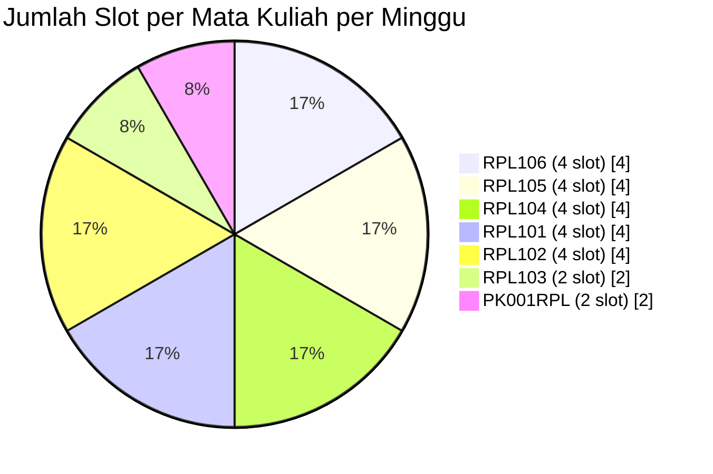
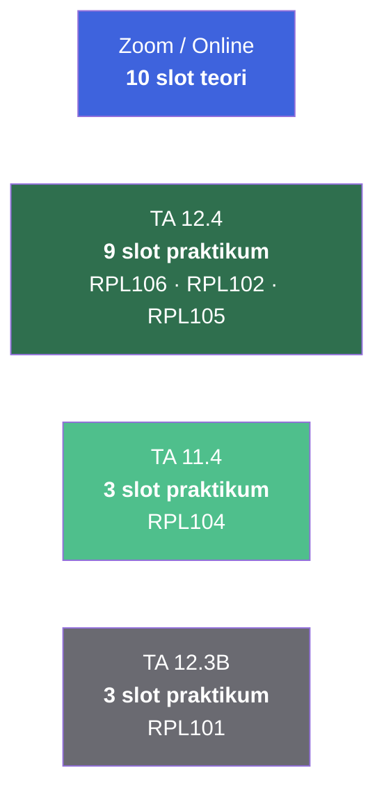

::: tip Sinkronisasi Jadwal
Jadwal ini bisa berubah sewaktu-waktu. Selalu cek pengumuman resmi dari dosen atau grup kelas sebelum berangkat ke kampus.

[**Cek E-Learning →**](https://learningif.polibatam.ac.id) · [**Lihat Kontak Dosen →**](/v1/information/kontak-dosen)
:::

## Sekilas Minggu Ini

<div align="center">

| **Hari Kuliah** | **Mata Kuliah** | **Total Slot** |     **Periode**      |
| :-------------: | :-------------: | :------------: | :------------------: |
|        5        |        7        |       23       | 07–11 September 2026 |

</div>

**Peta mingguan singkat:**

- **Senin** — Dua teori + satu blok praktikum RPL106
- **Selasa** — Satu teori + satu blok praktikum RPL102
- **Rabu** — Satu teori + satu blok praktikum RPL105
- **Kamis** — Dua blok praktikum (RPL104 & RPL101)
- **Jumat** — Satu blok teori + satu blok praktikum teori (RPL105 & RPL103)

::: info Cara Membaca Halaman Ini
Halaman ini disusun per hari, dari **Senin hingga Jumat**. Setiap hari punya tabel slot waktu, dengan kolom **Jam**, **Mata Kuliah**, **Dosen**, dan **Ruang**.

Slot waktu yang tidak tercantum dalam tabel berarti **istirahat** atau **tidak ada perkuliahan**. Tabel sengaja hanya menampilkan jam-jam yang ada aktivitasnya agar lebih ringkas dan mudah dibaca.
:::

## Timeline Mingguan

Berikut visualisasi blok waktu setiap hari dalam satu minggu. Semakin gelap warnanya, semakin malam slot waktunya.

```mermaid
gantt
    title Jadwal Kuliah TRPL Malam B — 07–11 September 2026
    dateFormat HH:mm
    axisFormat %H:%M
    todayMarker off

    section Senin
    RPL106 Teori (18:00)         :s1a, 18:00, 50m
    RPL101 Teori (18:50)         :s1b, 18:50, 50m
    RPL106 Praktikum (20:30)     :crit, s1c, 20:30, 150m

    section Selasa
    RPL104 Teori (18:00)         :s2a, 18:00, 50m
    RPL102 Praktikum (20:30)     :crit, s2b, 20:30, 150m

    section Rabu
    RPL102 Teori (18:00)         :s3a, 18:00, 50m
    RPL105 Praktikum (20:30)     :crit, s3b, 20:30, 150m

    section Kamis
    RPL104 Praktikum (18:00)     :crit, s4a, 18:00, 150m
    RPL101 Praktikum (20:30)     :crit, s4b, 20:30, 150m

    section Jumat
    PK001RPL Teori (18:00)       :s5a, 18:00, 100m
    RPL105 Teori (20:30)         :s5b, 20:30, 50m
    RPL103 Teori (21:20)         :s5c, 21:20, 100m
```

::: tip Cara Membaca Timeline

- Blok **merah (`crit`)** = sesi praktikum luring di laboratorium.
- Blok **hijau** = sesi teori daring via Zoom.
- Timeline hanya menampilkan slot yang benar-benar ada perkuliahan.
  :::

## Detail Per Hari

### Senin — Teori & Praktikum RPL106

**Total 3 aktivitas:** 2 teori + 1 blok praktikum (3 slot berturut-turut).

| Jam               | Mata Kuliah                                   | Dosen  | Ruang       |
| ----------------- | --------------------------------------------- | :----: | ----------- |
| 18:00 – 18:50     | RPL106 — Pengantar Basis Data                 |   AM   | Online      |
| 18:50 – 19:40     | RPL101 — Pengantar Rekayasa Perangkat Lunak   |   MS   | Online      |
| **20:30 – 23:00** | **RPL106 — Pengantar Basis Data (Praktikum)** | **AM** | **TA 12.4** |

::: details Blok Praktikum RPL106 — Detail
**Rentang:** 20:30 – 23:00 WIB (3 slot × 50 menit)

| Slot | Jam           | Aktivitas            |
| :--: | ------------- | -------------------- |
|  1   | 20:30 – 21:20 | Praktikum Basis Data |
|  2   | 21:20 – 22:10 | Praktikum Basis Data |
|  3   | 22:10 – 23:00 | Praktikum Basis Data |

**Dosen:** AM · **Ruang:** TA 12.4
:::

### Selasa — Teori RPL104 & Praktikum RPL102

**Total 2 aktivitas:** 1 teori + 1 blok praktikum (3 slot berturut-turut).

| Jam               | Mata Kuliah                                                 | Dosen  | Ruang       |
| ----------------- | ----------------------------------------------------------- | :----: | ----------- |
| 18:00 – 18:50     | RPL104 — Analisis dan Spesifikasi Kebutuhan Perangkat Lunak |   HK   | Online      |
| **20:30 – 23:00** | **RPL102 — Algoritma dan Pemrograman (Praktikum)**          | **AY** | **TA 12.4** |

::: details Blok Praktikum RPL102 — Detail
**Rentang:** 20:30 – 23:00 WIB (3 slot × 50 menit)

| Slot | Jam           | Aktivitas                         |
| :--: | ------------- | --------------------------------- |
|  1   | 20:30 – 21:20 | Praktikum Algoritma & Pemrograman |
|  2   | 21:20 – 22:10 | Praktikum Algoritma & Pemrograman |
|  3   | 22:10 – 23:00 | Praktikum Algoritma & Pemrograman |

**Dosen:** AY · **Ruang:** TA 12.4
:::

### Rabu — Teori RPL102 & Praktikum RPL105

**Total 2 aktivitas:** 1 teori + 1 blok praktikum (3 slot berturut-turut).

| Jam               | Mata Kuliah                                       | Dosen  | Ruang       |
| ----------------- | ------------------------------------------------- | :----: | ----------- |
| 18:00 – 18:50     | RPL102 — Algoritma dan Pemrograman                |   AY   | Online      |
| **20:30 – 23:00** | **RPL105 — Pemrograman Berbasis Web (Praktikum)** | **NR** | **TA 12.4** |

::: details Blok Praktikum RPL105 — Detail
**Rentang:** 20:30 – 23:00 WIB (3 slot × 50 menit)

| Slot | Jam           | Aktivitas                          |
| :--: | ------------- | ---------------------------------- |
|  1   | 20:30 – 21:20 | Praktikum Pemrograman Berbasis Web |
|  2   | 21:20 – 22:10 | Praktikum Pemrograman Berbasis Web |
|  3   | 22:10 – 23:00 | Praktikum Pemrograman Berbasis Web |

**Dosen:** NR · **Ruang:** TA 12.4
:::

### Kamis — Dua Blok Praktikum

**Total 2 blok praktikum** (RPL104 di TA 11.4 dan RPL101 di TA 12.3B) — hari terpadat dari sisi praktikum.

| Jam               | Mata Kuliah                                                                 | Dosen  | Ruang        |
| ----------------- | --------------------------------------------------------------------------- | :----: | ------------ |
| **18:00 – 20:30** | **RPL104 — Analisis dan Spesifikasi Kebutuhan Perangkat Lunak (Praktikum)** | **HK** | **TA 11.4**  |
| **20:30 – 23:00** | **RPL101 — Pengantar Rekayasa Perangkat Lunak (Praktikum)**                 | **IQ** | **TA 12.3B** |

::: details Blok Praktikum RPL104 — Detail
**Rentang:** 18:00 – 20:30 WIB (3 slot × 50 menit)

| Slot | Jam           | Aktivitas                                  |
| :--: | ------------- | ------------------------------------------ |
|  1   | 18:00 – 18:50 | Praktikum Analisis & Spesifikasi Kebutuhan |
|  2   | 18:50 – 19:40 | Praktikum Analisis & Spesifikasi Kebutuhan |
|  3   | 19:40 – 20:30 | Praktikum Analisis & Spesifikasi Kebutuhan |

**Dosen:** HK · **Ruang:** TA 11.4
:::

::: details Blok Praktikum RPL101 — Detail
**Rentang:** 20:30 – 23:00 WIB (3 slot × 50 menit)

| Slot | Jam           | Aktivitas               |
| :--: | ------------- | ----------------------- |
|  1   | 20:30 – 21:20 | Praktikum Pengantar RPL |
|  2   | 21:20 – 22:10 | Praktikum Pengantar RPL |
|  3   | 22:10 – 23:00 | Praktikum Pengantar RPL |

**Dosen:** IQ · **Ruang:** TA 12.3B
:::

### Jumat — Teori & Blok Teori Lanjutan

**Total 3 aktivitas:** 1 blok teori 2-slot + 1 teori + 1 blok teori 2-slot.

| Jam               | Mata Kuliah                       | Dosen                     | Ruang      |
| ----------------- | --------------------------------- | ------------------------- | ---------- |
| 18:00 – 19:40     | PK001RPL — Pendidikan Agama       | Izza / Ester / Laurensius | Online     |
| 20:30 – 21:20     | RPL105 — Pemrograman Berbasis Web | NR                        | Online     |
| **21:20 – 23:00** | **RPL103 — Matematika Diskrit**   | **RK**                    | **Online** |

::: info Struktur Hari Jumat
Hari Jumat tidak ada praktikum luring — semua sesi berlangsung **daring via Zoom**. Perhatikan jeda panjang antara 19:40 dan 20:30 (istirahat 50 menit) serta antara 21:20 dan 23:00 (dua slot Matematika Diskrit berturut-turut).
:::

## Ringkasan Mata Kuliah

| Kode     | Mata Kuliah                                        | SKS | Hari          | Sesi                                |
| -------- | -------------------------------------------------- | :-: | ------------- | ----------------------------------- |
| PK001RPL | Pendidikan Agama                                   |  2  | Jumat         | 1 blok teori (2 slot)               |
| RPL101   | Pengantar Rekayasa Perangkat Lunak                 |  3  | Senin, Kamis  | 1 teori + 1 blok praktikum (3 slot) |
| RPL102   | Algoritma dan Pemrograman                          |  3  | Selasa, Rabu  | 1 teori + 1 blok praktikum (3 slot) |
| RPL103   | Matematika Diskrit                                 |  3  | Jumat         | 1 blok teori (2 slot)               |
| RPL104   | Analisis dan Spesifikasi Kebutuhan Perangkat Lunak |  3  | Selasa, Kamis | 1 teori + 1 blok praktikum (3 slot) |
| RPL105   | Pemrograman Berbasis Web                           |  4  | Rabu, Jumat   | 1 teori + 1 blok praktikum (3 slot) |
| RPL106   | Pengantar Basis Data                               |  3  | Senin         | 1 teori + 1 blok praktikum (3 slot) |

### Distribusi Sesi per Mata Kuliah



## Distribusi Ruang

Sebagian besar perkuliahan berlangsung **daring via Zoom**. Praktikum diadakan di tiga ruang fisik yang berbeda.



| Ruang        | Jenis  | Mata Kuliah Praktikum  | Total Slot |
| ------------ | ------ | ---------------------- | :--------: |
| **Zoom**     | Daring | Semua teori            |     10     |
| **TA 12.4**  | Luring | RPL106, RPL102, RPL105 |     9      |
| **TA 11.4**  | Luring | RPL104                 |     3      |
| **TA 12.3B** | Luring | RPL101                 |     3      |

::: info Interpretasi Kode Ruang

- **TA** = Teknik Anima / Teknik Arsitektur (kode gedung atau sayap).
- **12.4 / 11.4 / 12.3B** = format umum `lantai.ruang` atau `gedung.lantai.ruang` — konfirmasi ke pihak jurusan untuk detail pasti.
  :::

## Peta Dosen Pengajar

Enam dosen dengan inisial berbeda mengampu tujuh mata kuliah. Berikut pemetaannya:

|            Inisial            | Mata Kuliah yang Diampu                                     |
| :---------------------------: | ----------------------------------------------------------- |
|            **AM**             | RPL106 — Pengantar Basis Data                               |
|            **MS**             | RPL101 — Pengantar Rekayasa Perangkat Lunak (teori)         |
|            **HK**             | RPL104 — Analisis dan Spesifikasi Kebutuhan Perangkat Lunak |
|            **AY**             | RPL102 — Algoritma dan Pemrograman                          |
|            **NR**             | RPL105 — Pemrograman Berbasis Web                           |
|            **IQ**             | RPL101 — Pengantar Rekayasa Perangkat Lunak (praktikum)     |
|            **RK**             | RPL103 — Matematika Diskrit                                 |
| **Izza / Ester / Laurensius** | PK001RPL — Pendidikan Agama                                 |

::: tip Referensi Lengkap
Untuk NIK, nama lengkap, email, dan nomor HP setiap dosen, kunjungi halaman [Kontak Dosen](/v1/information/kontak-dosen).
:::

## Beban Harian

Ringkasan intensitas setiap hari — total slot waktu yang harus dihadiri.

| Hari       | Total Slot | Aktivitas               | Intensitas   |
| ---------- | :--------: | ----------------------- | ------------ |
| **Senin**  |     5      | 2 teori + 3 praktikum   | `█████░░░░░` |
| **Selasa** |     4      | 1 teori + 3 praktikum   | `████░░░░░░` |
| **Rabu**   |     4      | 1 teori + 3 praktikum   | `████░░░░░░` |
| **Kamis**  |     6      | 6 praktikum             | `██████░░░░` |
| **Jumat**  |     5      | 5 teori (semua daring)  | `█████░░░░░` |
| **TOTAL**  |   **24**   | 10 teori + 14 praktikum | —            |

::: warning Hari Terpadat
**Kamis** adalah hari terpadat dengan **6 slot praktikum berturut-turut** dari 18.00 hingga 23.00 WIB di dua ruang berbeda (TA 11.4 lalu TA 12.3B). Pastikan kamu siap secara fisik dan mental — bawa air minum dan camilan.

**Senin** dan **Jumat** menyusul dengan 5 slot masing-masing.
:::

## Tips Praktis

::: tip Tips Menjalani Jadwal Malam

- **Jaga stamina.** Kuliah malam dari 18.00–23.00 WIB selama 5 hari butuh energi ekstra. Usahakan tidur cukup di siang hari dan makan teratur.
- **Manfaatkan jeda istirahat.** Ada jeda panjang seperti 19.40–20.30 WIB (Kamis) dan 19.40–20.30 WIB (Jumat). Gunakan untuk istirahat atau makan malam.
- **Catat kode ruang.** TA 12.4, TA 11.4, TA 12.3B — beda tipis, sering tertukar. Screenshot jadwal ini atau simpan di catatan ponsel.
- **Siapkan laptop setiap hari.** Hampir semua praktikum memerlukan laptop dan koneksi internet stabil.
- **Cek Zoom sebelum teori.** Meeting ID dan passcode RPL101 ada di halaman [Mata Kuliah RPL101](/v1/courses/rpl101-pengantar-rpl/).
- **Sinkronkan dengan tim PBL.** Jadwal ini bisa dipakai untuk menjadwalkan pertemuan tim di luar jam kuliah.
  :::

::: warning Hal yang Perlu Diwaspadai

- **Jangan mengandalkan ingatan.** Jadwal padat seperti ini mudah tertukar antar hari — selalu cek catatan.
- **Jangan lupa cek pengumuman.** Jadwal bisa berubah sewaktu-waktu mengikuti perkembangan perkuliahan.
- **Jangan skip istirahat.** Memaksakan diri tanpa jeda bisa menurunkan fokus di sesi terakhir malam.
- **Jangan salah ruang.** Beda kode ruang berarti beda gedung atau sayap — pastikan kamu tahu lokasinya.
  :::

## Pertanyaan yang Sering Diajukan

::: details Mengapa kuliah dimulai pukul 18.00 WIB?

Kelas TRPL Malam B adalah **kelas karyawan atau kelas malam** yang dirancang untuk mahasiswa yang bekerja di siang hari. Kuliah dimulai pukul 18.00 WIB setelah jam kerja pada umumnya berakhir.

:::

::: details Apakah semua perkuliahan teori berlangsung daring?

**Ya.** Berdasarkan jadwal ini, seluruh sesi teori berlangsung **daring via Zoom**. Sesi praktikum berlangsung **luring di laboratorium** (TA 12.4, TA 11.4, TA 12.3B).

:::

::: details Bagaimana jika saya terlambat masuk kelas daring?

Toleransi keterlambatan yang berlaku mengikuti kesepakatan mata kuliah yang bersangkutan — umumnya **15 menit** untuk praktikum luring. Untuk sesi teori daring, tetap usahakan masuk tepat waktu karena absensi biasanya dicatat di awal sesi.

:::

::: details Apakah slot yang kosong berarti saya bebas?

**Ya.** Slot waktu yang tidak tercantum dalam tabel berarti **tidak ada perkuliahan** untuk slot tersebut. Ini adalah waktu istirahat atau waktu pribadi. Kamu bisa memanfaatkannya untuk mengerjakan tugas, istirahat, atau berdiskusi dengan tim PBL.

:::

::: details Apakah jadwal ini berlaku sepanjang semester?

**Tidak.** Jadwal ini khusus untuk **periode 07–11 September 2026** (minggu pertama). Jadwal minggu-minggu berikutnya bisa berbeda — terutama setelah masa ATS dan AAS. Pantau pengumuman resmi untuk update.

:::

::: details Bagaimana cara menghubungi dosen jika ada pertanyaan?

Setiap dosen memiliki kontak yang tercantum di halaman [Kontak Dosen](/v1/information/kontak-dosen). Untuk pertanyaan yang bersifat akademik, prioritaskan **email resmi** agar komunikasi terdokumentasi.

:::

::: details Ruang TA 12.4, TA 11.4, dan TA 12.3B di gedung mana?

Kode `TA` biasanya mengacu pada **Teknik Anima** atau **sayap gedung Teknik** di Politeknik Negeri Batam. Untuk lokasi pasti, tanyakan ke pihak jurusan atau cek peta kampus. Kalau kamu baru pertama kali, coba cari tahu lokasinya sehari sebelum kuliah praktikum pertama.

:::

::: details Bisakah saya minta pindah kelas?

Perpindahan kelas biasanya **tidak diperbolehkan** kecuali ada alasan kuat (misalnya bentrok jadwal kerja). Ajukan secara resmi ke pihak jurusan dengan alasan yang jelas.

:::

## Halaman Terkait

| Halaman                                                     | Deskripsi                                                 |
| ----------------------------------------------------------- | --------------------------------------------------------- |
| [**Kontak Dosen**](/v1/information/kontak-dosen)            | NIK, inisial, nama, email, dan nomor HP setiap dosen.     |
| [**Info Tim PBL**](/v1/information/info-team-pbl)           | Struktur tim, peran anggota, dan mekanisme kerja PBL.     |
| [**Judul dan Tim PBL**](/v1/information/judul-dan-team-pbl) | Daftar judul proyek PBL dan manajer proyeknya.            |
| [**Mata Kuliah**](/v1/courses/)                             | Detail lengkap setiap mata kuliah yang ada di jadwal ini. |

## Sumber Referensi Online

### Platform Utama

| Sumber                      | Tautan                                       |
| --------------------------- | -------------------------------------------- |
| **E-Learning IF Polibatam** | [Buka →](https://learningif.polibatam.ac.id) |
| **Politeknik Negeri Batam** | [Buka →](https://www.polibatam.ac.id)        |
| **Zoom Meeting RPL101**     | [Buka →](https://zoom.us/j/95981903274)      |

::: info Tentang Halaman Ini
Jadwal ini berlaku untuk **kelas TRPL Malam B** pada **periode 07–11 September 2026** di Program Studi Teknologi Rekayasa Perangkat Lunak, Politeknik Negeri Batam.

Slot waktu yang tidak tercantum berarti **istirahat** atau **tidak ada perkuliahan**. Tabel sengaja hanya menampilkan jam-jam yang ada aktivitasnya.
:::

::: tip Butuh Update Cepat?
Jika ada perubahan jadwal (kelas diundur, ruang pindah, dosen ganti), edit file `docs/v1/information/jadwal-kuliah.md` dan commit. Jangan biarkan informasi basi menumpuk — jadwal usang bisa membuat temanmu datang ke ruang yang salah.
:::
