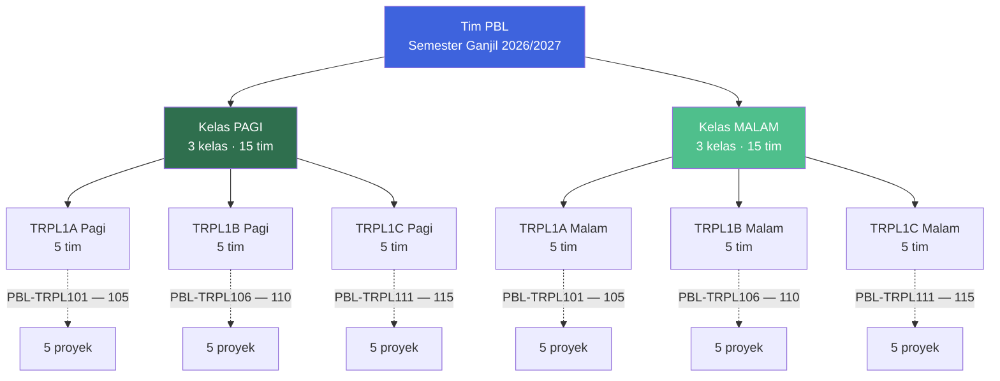
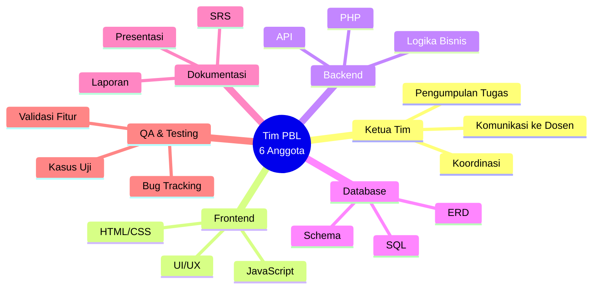

::: tip Halaman Terkait

- [**Info Tim PBL**](/v1/information/info-team-pbl) — deskripsi lengkap setiap proyek PBL.
- [**Kontak Dosen**](/v1/information/kontak-dosen) — kontak Manpro untuk koordinasi.
- [**Jadwal Kuliah**](/v1/information/jadwal-kuliah) — untuk sinkronisasi pertemuan tim.
  :::

## Sekilas Tim PBL

| **Total Tim** | **Total Mahasiswa** | **Kelas** | **Tim per Kelas** |
| :-----------: | :-----------------: | :-------: | :---------------: |
|      30       |         180         |     6     |         5         |

Halaman ini adalah **rujukan resmi** untuk mengetahui susunan tim PBL semester ini. Setiap tim terdiri atas **6 mahasiswa** dengan satu **ketua tim** yang bertanggung jawab mengoordinasikan pengerjaan proyek.

::: info Catatan
Nama yang tertera adalah anggota resmi tim. Perubahan anggota hanya dapat dilakukan dengan persetujuan dosen pengampu (Manajer Proyek).
:::

## Struktur Organisasi

**Cara membacanya:**

- **Pagi dan Malam** masing-masing punya 3 kelas.
- Setiap kelas mengerjakan **5 judul proyek** — sama-sama PBL-TRPL101 hingga 105 (Pagi A / Malam A), 106–110 (Pagi B / Malam B), dan 111–115 (Pagi C / Malam C).
- Total: **30 tim, 180 mahasiswa**.

## Navigasi Kelas

Klik salah satu kelas di bawah untuk langsung menuju daftar anggotanya.

| Kelas            | Jumlah Tim |     Kode PBL      | Tautan Cepat            |
| ---------------- | :--------: | :---------------: | ----------------------- |
| **TRPL1A Pagi**  |     5      | PBL-TRPL101 – 105 | [Buka →](#trpl1a-pagi)  |
| **TRPL1B Pagi**  |     5      | PBL-TRPL106 – 110 | [Buka →](#trpl1b-pagi)  |
| **TRPL1C Pagi**  |     5      | PBL-TRPL111 – 115 | [Buka →](#trpl1c-pagi)  |
| **TRPL1A Malam** |     5      | PBL-TRPL101 – 105 | [Buka →](#trpl1a-malam) |
| **TRPL1B Malam** |     5      | PBL-TRPL106 – 110 | [Buka →](#trpl1b-malam) |
| **TRPL1C Malam** |     5      | PBL-TRPL111 – 115 | [Buka →](#trpl1c-malam) |

::: tip Cara Cepat Menemukan Tim

1. Buka kelas kamu (Pagi atau Malam, A/B/C) menggunakan tabel di atas.
2. Cari **kode PBL** (PBL-TRPL101 hingga PBL-TRPL115) sesuai yang diberikan dosen.
3. Lihat daftar **NIM — Nama** untuk memverifikasi anggota tim.
   :::

## Kelas Pagi

### TRPL1A Pagi

::: details Lihat 5 Tim — PBL-TRPL101 hingga PBL-TRPL105

#### PBL-TRPL101 — Aplikasi Pengelolaan Warung

| No. | NIM        | Nama                  |
| :-: | ---------- | --------------------- |
|  1  | 4342601001 | Taufiq Agustian       |
|  2  | 4342601003 | Muhammad Hanif Irsyad |
|  3  | 4342601004 | Fairuz Aqila Islami   |
|  4  | 4342601005 | Rizky                 |
|  5  | 4342601002 | Heti Meli Sinaga      |
|  6  | 4342601007 | Asyfa Rainy           |

#### PBL-TRPL102 — Aplikasi Informasi Warga

| No. | NIM        | Nama                           |
| :-: | ---------- | ------------------------------ |
|  1  | 4342601006 | Affan M Faqih                  |
|  2  | 4342601009 | Anders Pether Johnston Bantara |
|  3  | 4342601010 | Jacksan Chandra Wijaya         |
|  4  | 4342601012 | Teuku Azman Muharsyah          |
|  5  | 4342601008 | Aira Hutagalung                |
|  6  | 4342601011 | Jesisca Stefany Parapat        |

#### PBL-TRPL103 — Aplikasi Pengelolaan Bank Sampah

| No. | NIM        | Nama                |
| :-: | ---------- | ------------------- |
|  1  | 4342601013 | Ndaru Pramudyo      |
|  2  | 4342601014 | Awan Restky         |
|  3  | 4342601015 | M Al Muhaimin Razaq |
|  4  | 4342601016 | Abid Aryasatya      |
|  5  | 4342601022 | Ririn Helfriani     |
|  6  | 4342601017 | Arya Pramudia       |

#### PBL-TRPL104 — Aplikasi Lapak UMKM

| No. | NIM        | Nama               |
| :-: | ---------- | ------------------ |
|  1  | 4342601025 | Karin Azrika Putri |
|  2  | 4342601018 | M Rifqi Rizani     |
|  3  | 4342601019 | Muhammad Rifaa     |
|  4  | 4342601020 | Davincy Serunting  |
|  5  | 4342601027 | Nadira Ramadhani   |
|  6  | 4342601028 | Geovany Silitonga  |

#### PBL-TRPL105 — Aplikasi Pengelolaan Catering Harian

| No. | NIM        | Nama                         |
| :-: | ---------- | ---------------------------- |
|  1  | 4342601021 | Charles Jason                |
|  2  | 4342601023 | Tambah Riski Martinus Bondar |
|  3  | 4342601024 | Gery Andrean Giovani         |
|  4  | 4342601026 | Haikal Fibraayir Prasta      |
|  5  | 4342601029 | R. Muhammad Hisyam Adityawan |
|  6  | 4342601030 | Jess Mathew Siburian         |

:::

### TRPL1B Pagi

::: details Lihat 5 Tim — PBL-TRPL106 hingga PBL-TRPL110

#### PBL-TRPL106 — Aplikasi Pengelolaan Depot Air

| No. | NIM        | Nama                            |
| :-: | ---------- | ------------------------------- |
|  1  | 4342601032 | Muhammad Yuri Ferdinand Adinata |
|  2  | 4342601034 | Zhafif Farhan Putra             |
|  3  | 4342601035 | Muhammad Ar Rayan Moren         |
|  4  | 4342601036 | Mohammad Ferdian Nurrizki       |
|  5  | 4342601031 | Dara Charisya Iryani            |
|  6  | 4342601033 | Ananda Nafisati                 |

#### PBL-TRPL107 — Aplikasi Informasi Iuran SPP Sekolah

| No. | NIM        | Nama                         |
| :-: | ---------- | ---------------------------- |
|  1  | 4342601037 | Revin Sitorus                |
|  2  | 4342601038 | Vicky Faranthyno Simamora    |
|  3  | 4342601040 | Moch. Kezhio Athallah Taufic |
|  4  | 4342601041 | Imanuel Raju Adventa Ginting |
|  5  | 4342601039 | Nailatur Rahmah Masaling     |
|  6  | 4342601048 | Felina Lim                   |

#### PBL-TRPL108 — Aplikasi Ruang Pameran Sederhana

| No. | NIM        | Nama                       |
| :-: | ---------- | -------------------------- |
|  1  | 4342601042 | Farras Radithya            |
|  2  | 4342601043 | Zakky Mubarraq             |
|  3  | 4342601044 | Candra Winata              |
|  4  | 4342601045 | Diva Maulana               |
|  5  | 4342601049 | Ayunda Tiara Radisti       |
|  6  | 4342601053 | E. Zahra Nursyta Ramadhani |

#### PBL-TRPL109 — Aplikasi Penggunaan Barang Kembali

| No. | NIM        | Nama                  |
| :-: | ---------- | --------------------- |
|  1  | 4342601050 | Asyifa Fahrelea       |
|  2  | 4342601046 | Dheny Irwanseh        |
|  3  | 4342601047 | Elves                 |
|  4  | 4342601051 | Pandu Arya Wijaya     |
|  5  | 4342601052 | Ageng Hadi Wicaksono  |
|  6  | 4342601055 | Khansa Haura Syaifuri |

#### PBL-TRPL110 — Aplikasi Pencegahan dan Penanganan Kekerasan

| No. | NIM        | Nama                      |
| :-: | ---------- | ------------------------- |
|  1  | 4342601054 | Taqy Ziyad Arsi           |
|  2  | 4342601056 | Ahmad Rifqii Naadhim      |
|  3  | 4342601057 | T. Raihan Nawawi Wahid    |
|  4  | 4342601059 | Faran Raditya Juniardi    |
|  5  | 4342601058 | Nurul Khairani Harmi      |
|  6  | 4342601060 | Nikita Aulia Nisak Lukman |

:::

### TRPL1C Pagi

::: details Lihat 5 Tim — PBL-TRPL111 hingga PBL-TRPL115

#### PBL-TRPL111 — Aplikasi Manajemen Sertikom

| No. | NIM        | Nama                    |
| :-: | ---------- | ----------------------- |
|  1  | 4342601061 | M. Galih Adiyatma Arif  |
|  2  | 4342601065 | Radja Rafa Alfathir     |
|  3  | 4342601068 | Muhammad Fahrel Al Faiz |
|  4  | 4342601070 | Maulana Akram Alif      |
|  5  | 4342601062 | Mutia Nur Afifah        |
|  6  | 4342601063 | Marsya Ayunda Dinata    |

#### PBL-TRPL112 — Aplikasi Manajemen Travel Sederhana

| No. | NIM        | Nama                                   |
| :-: | ---------- | -------------------------------------- |
|  1  | 4342601087 | Kristian Alfando                       |
|  2  | 4342601088 | Muhammad Rofi Pratama                  |
|  3  | 4342601078 | Keysha Agustina Tambunan               |
|  4  | 4342601084 | Nur Aura Widi Sasmita                  |
|  5  | 4342601089 | Zazkia Fajriani                        |
|  6  | 4342601076 | Muhammad Abdul Hafidz Ridho Al-ghazali |

#### PBL-TRPL113 — Aplikasi Usaha Rental Mobil Sederhana

| No. | NIM        | Nama                    |
| :-: | ---------- | ----------------------- |
|  1  | 4342601086 | Irfan Zaky              |
|  2  | 4342601079 | Rendy Cristian Manurung |
|  3  | 4342601080 | Muhammad Najib Al Faqih |
|  4  | 4342601081 | Fadhil Hilmy Mubarok    |
|  5  | 4342601067 | Octavia Dezwan          |
|  6  | 4342601069 | Naswa Herwinda Putri    |

#### PBL-TRPL114 — Aplikasi Pengelolaan Inventori Sederhana

| No. | NIM        | Nama                         |
| :-: | ---------- | ---------------------------- |
|  1  | 4342601082 | Rayhan Fareza                |
|  2  | 4342601083 | Alfino Hasan                 |
|  3  | 4342601085 | Zacky Julyanda Pratama       |
|  4  | 4342601071 | Vania Ariani                 |
|  5  | 4342601077 | Nuremmiya Primsa Br Sebayang |
|  6  | 4342601064 | Titania Fara Sumarto         |

#### PBL-TRPL115 — Aplikasi Pengelolaan Rapat Sederhana

| No. | NIM        | Nama                    |
| :-: | ---------- | ----------------------- |
|  1  | 4342601075 | Noura Putri Aprinistika |
|  2  | 4342601072 | Radhy Fawwas Risqullah  |
|  3  | 4342601073 | Bima Aretha Zaky        |
|  4  | 4342601074 | Juan David Tanesa       |
|  5  | 4342601066 | Aldavi Merry Berlianty  |

:::

## Kelas Malam

### TRPL1A Malam

::: details Lihat 5 Tim — PBL-TRPL101 hingga PBL-TRPL105

#### PBL-TRPL101 — Aplikasi Pengelolaan Warung

| No. | NIM        | Nama                           |
| :-: | ---------- | ------------------------------ |
|  1  | 4342611001 | Zhafran An-nawawi              |
|  2  | 4342611002 | Faizh Al Ghifari               |
|  3  | 4342611005 | Tauhid Abdul Awang             |
|  4  | 4342611006 | Iqbal Dezwan                   |
|  5  | 4342611004 | Zuleony Suci Pratiwi           |
|  6  | 4342611007 | Gladys Amelia Theresa Hutajulu |

#### PBL-TRPL102 — Aplikasi Informasi Warga

| No. | NIM        | Nama                          |
| :-: | ---------- | ----------------------------- |
|  1  | 4342611003 | Hanum Khairunnisa             |
|  2  | 4342611008 | Noxy Rendy Pratama            |
|  3  | 4342611009 | Muhammad Chairul Anshar       |
|  4  | 4342611011 | Felix Tanu Wijaya             |
|  5  | 4342611012 | Josua Rico Syahputra Manurung |
|  6  | 4342611014 | Nurafa Putria                 |

#### PBL-TRPL103 — Aplikasi Pengelolaan Bank Sampah

| No. | NIM        | Nama                   |
| :-: | ---------- | ---------------------- |
|  1  | 4342611010 | Salwa Nada Soleha      |
|  2  | 4342611013 | Samuel Sirait          |
|  3  | 4342611017 | Ferrys Wijaya          |
|  4  | 4342611018 | Rama Adithia Pirmadoni |
|  5  | 4342611016 | Keyla Syafitra         |
|  6  | 4342611027 | Farrel Ageng Raditya   |

#### PBL-TRPL104 — Aplikasi Lapak UMKM

| No. | NIM        | Nama                           |
| :-: | ---------- | ------------------------------ |
|  1  | 4342611019 | Fauzan Syafta Pratama          |
|  2  | 4342611020 | Muhammad Vabian Handaka        |
|  3  | 4342611021 | Aldafin                        |
|  4  | 4342611025 | Rifky Ramdana                  |
|  5  | 4342611022 | Andjani Dwifidaroyani Agustina |
|  6  | 4342611023 | Shyfa Ellyana Putri            |

#### PBL-TRPL105 — Aplikasi Pengelolaan Catering Harian

| No. | NIM        | Nama                     |
| :-: | ---------- | ------------------------ |
|  1  | 4342611015 | Jasson                   |
|  2  | 4342611026 | Ammar Atha Irfansyah     |
|  3  | 4342611030 | Muhammad Raihan Husseini |
|  4  | 4342611024 | Ayla Azura               |
|  5  | 4342611028 | Shinaya Karnain          |
|  6  | 4342611029 | Cantika Wulandari        |

:::

### TRPL1B Malam

::: details Lihat 5 Tim — PBL-TRPL106 hingga PBL-TRPL110

#### PBL-TRPL106 — Aplikasi Pengelolaan Depot Air

| No. | NIM        | Nama                     |
| :-: | ---------- | ------------------------ |
|  1  | 4342611031 | Abiel Oktarefandi        |
|  2  | 4342611032 | Syaikha Aprial Pratama   |
|  3  | 4342611034 | Muhammad Riduwan Khafidi |
|  4  | 4342611037 | Esananta Ryan Saputri    |
|  5  | 4342611039 | Ayla Azzura              |
|  6  | 4342611036 | Randy Apriandri          |

#### PBL-TRPL107 — Aplikasi Informasi Iuran SPP Sekolah

| No. | NIM        | Nama                      |
| :-: | ---------- | ------------------------- |
|  1  | 4342611035 | Ampoen Agam Waladi        |
|  2  | 4342611038 | Sahid Qusyaery            |
|  3  | 4342601040 | Muhammad Bintang Fauzan   |
|  4  | 4342611045 | Gabriella Klarysa Tumelap |
|  5  | 4342611041 | Ahmad Raffi Asyach        |
|  6  | 4342611043 | Maia Rianty Hasibuan      |

#### PBL-TRPL108 — Aplikasi Ruang Pameran Sederhana

| No. | NIM        | Nama                     |
| :-: | ---------- | ------------------------ |
|  1  | 4342611033 | Rizky Ananda             |
|  2  | 4342611042 | Rizki Kurnia Cahyadi     |
|  3  | 4342611044 | Arya Bimo                |
|  4  | 4342611047 | Andre Elisaputra Siagian |
|  5  | 4342611050 | Nada Salsabila Zahra     |
|  6  | 4342611051 | Reysha Keprilia Rahmat   |

#### PBL-TRPL109 — Aplikasi Penggunaan Barang Kembali

| No. | NIM        | Nama                             |
| :-: | ---------- | -------------------------------- |
|  1  | 4342611046 | Devina Sari Nugroho              |
|  2  | 4342611049 | Santo Jhon Baltazer Sinurat      |
|  3  | 4342611052 | Senna Daniswara                  |
|  4  | 4342611059 | Dzakiyyah Gunawan                |
|  5  | 4342611054 | Devrisca Zikri Dinanta           |
|  6  | 4342611056 | Raymond Advently Purba Sidadolog |

#### PBL-TRPL110 — Aplikasi Pencegahan dan Penanganan Kekerasan

| No. | NIM        | Nama                        |
| :-: | ---------- | --------------------------- |
|  1  | 4342611053 | Haga Samuel Christiano Gulo |
|  2  | 4342611048 | Aditya Putra Mahardhika     |
|  3  | 4342611055 | Rhevan Hilall Firdaus       |
|  4  | 4342611057 | Rasya Ramadhan              |
|  5  | 4342611058 | M. Daffa Rizki Asffar       |
|  6  | 4342611060 | Muhammad Al-fathan          |

:::

### TRPL1C Malam

::: details Lihat 5 Tim — PBL-TRPL111 hingga PBL-TRPL115

#### PBL-TRPL111 — Aplikasi Manajemen Sertikom

| No. | NIM        | Nama                              |
| :-: | ---------- | --------------------------------- |
|  1  | 4342611062 | Ahmad Iswandi                     |
|  2  | 4342611063 | Zakaria Khausar Rahman            |
|  3  | 4342611064 | Sulfadli                          |
|  4  | 4342611065 | Cristian Mozes Marcelinus Limbong |
|  5  | 4342611061 | Melan Panjaitan                   |
|  6  | 4342611066 | Tassya                            |

#### PBL-TRPL112 — Aplikasi Manajemen Travel Sederhana

| No. | NIM        | Nama                        |
| :-: | ---------- | --------------------------- |
|  1  | 4342611067 | Imam Rohmatul Hudha         |
|  2  | 4342611069 | Friendly Nainggolan         |
|  3  | 4342611070 | David Alves                 |
|  4  | 4342611071 | Asyer Naek Andhika Sitohang |
|  5  | 4342611068 | Arnita Rizqie Zamharis      |
|  6  | 4342611074 | Cindy Stefani Manalu        |

#### PBL-TRPL113 — Aplikasi Usaha Rental Mobil Sederhana

| No. | NIM        | Nama                             |
| :-: | ---------- | -------------------------------- |
|  1  | 4342611072 | Reyhan Steven Aritonang          |
|  2  | 4342611073 | Hercules Pander Luys Simorangkir |
|  3  | 4342611075 | Azilki Marfin Mulyana            |
|  4  | 4342611076 | Hanin Zaskia Putri Siambaton     |
|  5  | 4342611077 | Indah Revhalina Nainggolan       |
|  6  | 4342611080 | Dinda Purna Hamdany              |

#### PBL-TRPL114 — Aplikasi Pengelolaan Inventori Sederhana

| No. | NIM        | Nama                       |
| :-: | ---------- | -------------------------- |
|  1  | 4342611078 | Naufal Basil               |
|  2  | 4342611081 | Brilliant Abidzhar Zakaria |
|  3  | 4342611086 | Kevin Christian Purba      |
|  4  | 4342611079 | Salsabila                  |
|  5  | 4342611082 | Delly D.e Togodly          |
|  6  | 4342611087 | Wendrian                   |

#### PBL-TRPL115 — Aplikasi Pengelolaan Rapat Sederhana

| No. | NIM        | Nama                          |
| :-: | ---------- | ----------------------------- |
|  1  | 4342611083 | Muhammad Borneo Yusuf Pramana |
|  2  | 4342611088 | Ridho Mardiansyah             |
|  3  | 4342611089 | Jasson Lee                    |
|  4  | 4342611084 | Kuni Nadhifah Salsabila       |
|  5  | 4342611085 | Nanda Nabila                  |

:::

## Aturan Tim

::: warning Peraturan Resmi

- Setiap tim terdiri atas **6 mahasiswa** dengan satu **ketua tim** yang bertanggung jawab mengoordinasikan pengerjaan proyek.
- **Pengumpulan berkas aktivitas tugas** hanya dilakukan oleh **ketua tim** — bukan setiap anggota.
- **Refleksi diri** dikerjakan oleh **setiap mahasiswa** secara **individual**.
- Segala **perubahan anggota tim** wajib dilaporkan dan **disetujui oleh dosen pengampu** (Manajer Proyek).
- Setiap anggota tim wajib memahami **deskripsi ruang lingkup proyek** dan **fitur utama** yang harus ada.

:::

### Peran dalam Tim

Setiap tim biasanya memiliki pembagian peran informal untuk memperlancar kolaborasi. Berikut peran umum yang sering muncul:

::: tip Pembagian Peran
Pembagian peran formal biasanya **tidak ditetapkan** oleh dosen — setiap tim bebas mengaturnya sendiri. Namun, memastikan setiap anggota punya **peran yang jelas** (meskipun rotatif) akan sangat membantu kolaborasi dan mempermudah penilaian kontribusi individu.
:::

## Panduan Praktis untuk Tim

::: tip Langkah Awal Setelah Tim Terbentuk

1. **Tentukan ketua tim.** Pilih satu orang yang bisa mengoordinasi dan berkomunikasi dengan dosen.
2. **Tentukan peran informal.** Siapa fokus ke frontend, backend, database, dokumentasi, testing.
3. **Buat grup komunikasi.** WhatsApp atau Telegram grup khusus untuk koordinasi cepat.
4. **Sinkronkan jadwal.** Gunakan [Jadwal Kuliah](/v1/information/jadwal-kuliah) untuk menjadwalkan pertemuan tim.
5. **Baca deskripsi proyek.** Pahami ruang lingkup di halaman [Info Tim PBL](/v1/information/info-team-pbl).
6. **Buat target mingguan.** Cocokkan dengan target PBL minggu 2 hingga 14.
7. **Mulai dari analisis.** Fase awal: identifikasi kebutuhan dan problem statement.
   :::

::: warning Hal yang Perlu Dihindari

- **Jangan menunda komunikasi.** Jika ada kendala, langsung bicarakan ke ketua tim atau dosen.
- **Jangan biarkan anggota pasif.** Setiap anggota wajib berkontribusi — ini bagian dari penilaian partisipatif.
- **Jangan mengerjakan sendirian.** Kolaborasi adalah inti dari PBL.
- **Jangan menyimpan masalah.** Konflik tim yang dipendam akan merusak kualitas proyek.
- **Jangan lewatkan refleksi diri.** Ini tugas individual yang dihitung dalam penilaian.
  :::

## Pertanyaan yang Sering Diafakan

::: details Berapa jumlah anggota setiap tim?

Setiap tim terdiri dari **6 mahasiswa** — ini sudah ditetapkan oleh program studi dan berlaku seragam untuk semua kelas PBL semester ini.

:::

::: details Bagaimana cara menemukan tim saya?

1. Buka kelas kamu (Pagi atau Malam, A/B/C) di halaman ini.
2. Cari kode PBL yang diberikan dosen (mis. PBL-TRPL106).
3. Verifikasi daftar NIM dan nama anggota.
4. Kalau masih ragu, hubungi dosen pengampu RPL101 (koordinator PBL).
   :::

::: details Apakah boleh menukar anggota tim?

**Umumnya tidak.** Perubahan anggota tim hanya dapat dilakukan dengan **persetujuan dosen pengampu** (Manajer Proyek) dan biasanya hanya untuk alasan kuat seperti konflik jadwal kerja atau masalah kolaborasi serius.

:::

::: details Siapa yang menjadi ketua tim?

Ketua tim biasanya ditentukan melalui **kesepakatan internal tim** atau **penunjukan dosen**. Jika belum ditentukan, diskusikan bersama untuk memilih satu orang yang paling tepat mengoordinasi.

:::

::: details Apa tugas ketua tim?

- **Koordinasi internal** — memastikan setiap anggota tahu tugasnya.
- **Komunikasi ke dosen** — melaporkan progres, menanyakan kendala.
- **Pengumpulan berkas** — mengumpulkan aktivitas tugas tim (bukan refleksi diri individual).
- **Menjaga timeline** — memastikan target mingguan tercapai.

:::

::: details Apakah anggota tim boleh berubah di tengah semester?

**Sangat jarang.** Perubahan hanya bisa dilakukan dengan persetujuan dosen pengampu. Kalau ada masalah dalam tim, coba selesaikan secara internal terlebih dahulu sebelum mengajukan perubahan formal.

:::

::: details Bagaimana kalau saya tidak mengenal anggota tim saya?

Ini kesempatan baik untuk **memulai komunikasi awal**. Setelah tim resmi terbentuk, atur pertemuan pertama (online atau offline) untuk saling mengenal dan mendiskusikan pembagian peran. Jangan tunggu sampai proyek mulai berjalan.

:::

::: details Bagaimana penilaian kontribusi individu dalam tim?

Kontribusi individu biasanya dinilai melalui:

- **Refleksi diri** — tugas individual per mahasiswa.
- **Penilaian antar-anggota** — kadang diminta oleh dosen.
- **Laporan progres** — mencatat siapa mengerjakan apa.
- **Soft skills** — kehadiran, komunikasi, tanggung jawab.

Pastikan kontribusimu **terdokumentasi** dan **terlihat** oleh tim dan dosen.

:::

## Halaman Terkait

| Halaman                                            | Deskripsi                                     |
| -------------------------------------------------- | --------------------------------------------- |
| [**Info Tim PBL**](/v1/information/info-team-pbl)  | Deskripsi lengkap setiap proyek PBL + Manpro. |
| [**Jadwal Kuliah**](/v1/information/jadwal-kuliah) | Jadwal mingguan kelas Malam TRPL.             |
| [**Kontak Dosen**](/v1/information/kontak-dosen)   | Kontak Manpro dan dosen pengampu.             |
| [**Mata Kuliah**](/v1/courses/)                    | Detail mata kuliah yang terlibat PBL.         |

## Sumber Referensi Online

### Panduan PBL

| Sumber                                            | Tautan                                                                                                                      |
| ------------------------------------------------- | --------------------------------------------------------------------------------------------------------------------------- |
| **Panduan PBL Semester 1 Ganjil 2026-2027 (PDF)** | [Unduh →](https://learning-if.polibatam.ac.id/pluginfile.php/36673/mod_label/intro/Panduan%20PBL%20Sem%201%202026-2027.pdf) |
| **Halaman Pembagian Tim PBL**                     | [Buka →](https://polibatam.id/tim-pbl-sem1-trpl-2026)                                                                       |

### Platform Utama

| Sumber                      | Tautan                                       |
| --------------------------- | -------------------------------------------- |
| **E-Learning IF Polibatam** | [Buka →](https://learningif.polibatam.ac.id) |
| **Politeknik Negeri Batam** | [Buka →](https://www.polibatam.ac.id)        |

::: info Tentang Halaman Ini
Halaman ini memuat **daftar resmi anggota tim PBL** untuk **Semester Ganjil 2026/2027** di Program Studi Teknologi Rekayasa Perangkat Lunak, Politeknik Negeri Batam.

Total: **30 tim** (6 kelas × 5 tim), masing-masing **6 anggota**, dengan **180 mahasiswa** terdistribusi.
:::

::: tip Butuh Update Cepat?
Jika ada perubahan anggota tim, edit file `docs/v1/information/judul-dan-team-pbl.md` dan commit segera. Perubahan nama harus berdasarkan **persetujuan resmi dosen pengampu**.
:::
