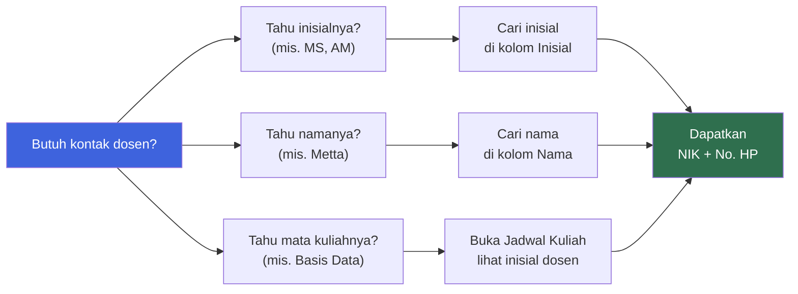

::: info Catatan Data

- Tabel diurutkan berdasarkan **inisial nama** — dari `AA` (Amirul Mu'minin) hingga `RC` (Recy Harviani Zurwanty).
- Nomor HP ditampilkan sesuai **data terakhir yang tersedia**.
- Untuk keperluan **resmi** (surat menyurat, kerja sama, dll), hubungi **sekretariat Jurusan Teknik Informatika** melalui kanal resmi Politeknik Negeri Batam.
  :::

## Sekilas Direktori

| **Total Dosen** | **Rentang Inisial** | **Jurusan** | **Institusi** |
| :-------------: | :-----------------: | :---------: | :-----------: |
|       54        |       AA — RC       |     TI      |   Polibatam   |

Direktori ini memuat **54 dosen** Jurusan Teknik Informatika Politeknik Negeri Batam. Setiap dosen punya **NIK** (Nomor Induk Karyawan), **inisial** untuk referensi cepat, **nama lengkap dengan gelar**, dan **nomor HP**.

::: tip Peran Inisial dalam Dokumentasi
Inisial dosen (misalnya `MS`, `AM`, `NR`) digunakan secara luas dalam dokumen akademik:

- **Jadwal Kuliah** — inisial dosen pengampu muncul di kolom "Dosen".
- **RPS** — inisial koordinator mata kuliah.
- **Pengumuman** — referensi cepat ke dosen tertentu.

Gunakan halaman ini sebagai **kamus inisial** ketika kamu menemukan inisial di dokumen lain.
:::

## Cara Mencari Dosen

Ada beberapa cara cepat untuk menemukan kontak dosen tertentu:

### Ringkasan Cara Mencari

| Jika Kamu Tahu... | Langkah Cepat                                                                    |
| ----------------- | -------------------------------------------------------------------------------- |
| **Inisial dosen** | Cari di kolom **Inisial** pada tabel di bawah.                                   |
| **Nama lengkap**  | Cari di kolom **Nama** — sudah diurutkan alfabetis.                              |
| **NIK**           | Cari di kolom **NIK** — hanya dosen dengan NIK terdaftar.                        |
| **Mata kuliah**   | Buka [Jadwal Kuliah](/v1/information/jadwal-kuliah) untuk melihat inisial dosen. |
| **Proyek PBL**    | Buka [Info Tim PBL](/v1/information/info-team-pbl) untuk melihat Manpro.         |

## Statistik Inisial

Inisial dosen dikelompokkan berdasarkan huruf pertama. Berikut distribusinya:

| Huruf Awal | Jumlah | Contoh Inisial                             |
| :--------: | :----: | ------------------------------------------ |
|   **A**    |   8    | AA, AD, AI, AM, AN, AO, AR, AT, AU, AW, AZ |
|   **B**    |   2    | BR, BY                                     |
|   **C**    |   4    | CA, CI, CM, CR, CY                         |
|   **D**    |   4    | DE, DP, DW                                 |
|   **E**    |   1    | EV                                         |
|   **F**    |   5    | FB, FD, FR, FS, FW                         |
|   **G**    |   2    | GD, GS                                     |
|   **H**    |   4    | HA, HO, HT, HW                             |
|   **I**    |   1    | ID                                         |
|   **K**    |   1    | KW                                         |
|   **L**    |   3    | LK, LM, LR                                 |
|   **M**    |   4    | MA, MC, MD, MF, MI, MS                     |
|   **N**    |   6    | NA, NC, ND, NH, NI, NR, NZ                 |
|   **O**    |   1    | OG                                         |
|   **R**    |   3    | RA, RC                                     |

::: tip Variasi Inisial
Perhatikan bahwa **tidak semua dosen punya inisial yang unik** — beberapa inisial berbeda bisa merujuk ke dosen berbeda, dan sebagian dosen mungkin punya inisial yang sama dengan inisial nama depan. Selalu verifikasi dengan **NIK** atau **nama lengkap** untuk memastikan.
:::

## Daftar Dosen

Berikut daftar lengkap 54 dosen, diurutkan berdasarkan **inisial nama**.

| NIK    | Inisial | Nama                                         | No. HP             |
| ------ | :-----: | -------------------------------------------- | ------------------ |
| 122280 | **AA**  | Amirul Mu'minin, S.Ds., M.Ds.                | 82290154545        |
| 119221 | **AD**  | Agung Riyadi, S.Si., M.Kom                   | 81808505919        |
| 125341 | **AI**  | Arif Rahman, M.T                             | 85729050112        |
| 122275 | **AM**  | Ahmadi Irmansyah Lubis, S.Kom., M.Kom.       | 82273083850        |
| 122259 | **AN**  | Anis Rahmi, S.Tr.Kom., M.Sn                  | 81268405407        |
| 122276 | **AO**  | Antoni Haikal, S.ST., M.T                    | 85265067803        |
| 122284 | **AR**  | Ardiman Firmanda, S.S.T., M.Tr.Kom.          | 818113100          |
| 105038 | **AT**  | Andy Triwinarko, ST., MT., Ph.D              | 81217141529        |
| 107051 | **AU**  | Agus Fatulloh, S.T., M.T                     | 83183501532        |
| 100012 | **AW**  | Ari Wibowo, ST., MT                          | 8127737778         |
| 107048 | **AZ**  | Afdhol Dzikri, S.ST., M.T                    | 81270182977        |
| 124313 | **BR**  | Berliansyah Ramadhan                         | 89675732453        |
| 118201 | **BY**  | Satriya Bayu Aji, S.S., M.Hum.               | 82287826272        |
| 107054 | **CA**  | Condra Antoni, SS., M.A                      | 81374303928        |
| 125331 | **CI**  | Cyntia Lasmi                                 | +62 822-8386-1533  |
| 122282 | **CM**  | Cahya Miranto, S.S.T., M.Tr.Kom.             | 85664563773        |
| 123298 | **CR**  | Chairoel Adam, S.Ds., M.Sn.                  | 82163043080        |
| 118207 | **CY**  | Siti Noor Chayati, S.T., M.Sc                | 85162616120        |
| 112094 | **DE**  | Dwi Ely Kurniawan, S.Pd., M.Kom              | 81322460696        |
| 119222 | **DP**  | Dodi Prima Resda, S.Pd., M.Kom               | 85376445446        |
| 121248 | **DW**  | Dwi Amalia Purnamasari, S.T., M.Cs           | 81231963442        |
| 106042 | **EV**  | Evaliata Br. Sembiring, S.Kom., M.Cs         | 81364055215        |
| 122270 | **FB**  | Feby, M.Pd                                   | 85263361736        |
| 109057 | **FD**  | Mir'atul Khusna Mufida, S.ST, M.Sc           | 33658580065        |
| —      | **FR**  | Fendra Dwi R                                 | +62 881-0809-62220 |
| 119223 | **FS**  | Fadli Suandi, S.T., M.Kom                    | 85271291482        |
| 122288 | **FW**  | Festy Winda Sari, S.Tr.Kom                   | 81540016969        |
| 112086 | **GD**  | Gendhy Dwi Harlyan, S.Sn., M.Sn              | 816550310          |
| 122258 | **GS**  | Aragani Timur Kanistren, S.Sn., M.Sn         | 82295665553        |
| 117175 | **HA**  | Hamdani Arif, S.Pd., M.Sc                    | 85767687475        |
| 125346 | **HO**  | Holong Marisi Simalango, M.Kom.              | +62 895-0182-7969  |
| 115143 | **HT**  | Ahmad Hamim Thohari, S.S.T., M.T.            | 82283830800        |
| 102020 | **HW**  | Hilda Widyastuti, S.T., M.T.                 | 8163674205         |
| 122283 | **ID**  | Muhammad Idris, S.Tr                         | 81218982998        |
| 125350 | **KW**  | Kawan Pandiangan, S.Sn., M.Sn                | +62 813-9659-0361  |
| 124316 | **LK**  | Luki Aswar, M.Pd.                            | 82176849477        |
| 113118 | **LM**  | Liony Lumombo, S.ST., M.IDes                 | 85272721010        |
| 117196 | **LR**  | Luthfiya Ratna Sari, S.Si., M.T.             | 85640441275        |
| 113103 | **MA**  | Maria, S.ST., M.Sn                           | 8566523171         |
| 109064 | **MC**  | Mira Chandra Kirana, S.T., M.T               | 85761446116        |
| 117192 | **MD**  | Maidel Fani, S.Pd., M.Kom.                   | 087878420952       |
| 117173 | **MF**  | Muchamad Fajri Amirul Nasrullah, S.ST., M.Sc | 85648010155        |
| 115148 | **MI**  | Nelmiawati, B.CS., M.Comp.Sc                 | 87894189520        |
| 100017 | **MS**  | Metta Santiputri, S.T., M.Sc, Ph.D           | 0895365618212      |
| 122279 | **NA**  | Alena Uperiati, S.T, M.Cs                    | 82284070171        |
| 106044 | **NC**  | Nur Cahyono Kushardianto, S.Si., M.T., M.Sc  | 8122186711         |
| 125351 | **ND**  | Nadya Satya Handayani, M.Kom                 | +62 823-9045-3258  |
| 124302 | **NH**  | Nursaimah Harhap                             | 85256350108        |
| 125352 | **NI**  | Nur Israyani, S.T, M.T                       | +62 821-9996-9455  |
| 122277 | **NR**  | Noper Ardi, S.Pd., M.Eng                     | 85376166392        |
| 112087 | **NZ**  | Nur Zahrati Janah, S.Kom., M.Sc              | 0878-1884-1069     |
| 115138 | **OG**  | Oktavianto Gustin, S.T., M.T                 | 85732307391        |
| 122256 | **RA**  | Rini Amadia, S.Sn., M.Sn                     | 85274147447        |
| 125355 | **RC**  | Recy Harviani Zurwanty, S.Pd., M.Pd          | +62 812-6198-8149  |

## Dosen di Mata Kuliah Semester Ini

Beberapa dosen mengampu mata kuliah di Semester Ganjil 2026/2027. Berikut pemetaannya berdasarkan data dari halaman mata kuliah:

| Mata Kuliah                                    | Inisial | Nama Lengkap                               |
| ---------------------------------------------- | :-----: | ------------------------------------------ |
| RPL101 — Pengantar Rekayasa Perangkat Lunak    | **MS**  | Metta Santiputri, S.T., M.Sc, Ph.D         |
| RPL101 — Pengantar Rekayasa Perangkat Lunak    | **IQ**  | Iqbal Afif _(lihat catatan)_               |
| RPL102 — Algoritma dan Pemrograman             | **NA**  | Alena Uperiati, S.T, M.Cs                  |
| RPL102 — Algoritma dan Pemrograman             | **AW**  | Ari Wibowo, ST., MT                        |
| RPL102 — Algoritma dan Pemrograman             | **AU**  | Agus Fatulloh, S.T., M.T _(lihat catatan)_ |
| RPL103 — Matematika Diskrit                    |    —    | Supardianto _(lihat catatan)_              |
| RPL104 — Analisis dan Spesifikasi Kebutuhan PL |    —    | _(lihat catatan)_                          |
| RPL105 — Pemrograman Berbasis Web              | **NR**  | Noper Ardi, S.Pd., M.Eng                   |
| RPL106 — Pengantar Basis Data                  | **AM**  | Ahmadi Irmansyah Lubis, S.Kom., M.Kom.     |

::: warning Catatan Penting
Beberapa dosen yang muncul di jadwal atau mata kuliah **tidak ada di daftar tabel di atas** — misalnya **Iqbal Afif (IQ)**, **Supardianto**, **Kevin Riady (KV)**, **Banu Failasuf**, dan beberapa lainnya. Ini bisa disebabkan oleh:

- Mereka dosen dari jurusan/prodi lain.
- Data di tabel adalah snapshot yang belum mencakup seluruh dosen aktif.
- Ada perbedaan antara database akademik dan direktori ini.

Kalau kamu butuh kontak dosen yang tidak ada di daftar, hubungi **sekretariat Jurusan Teknik Informatika**.
:::

## Etika Menghubungi Dosen

::: tip Panduan Komunikasi Profesional

- **Gunakan email resmi untuk hal akademik.** Email memberi jejak komunikasi yang jelas dan terdokumentasi.
- **Sebutkan identitas lengkap** di awal pesan: nama, NIM, kelas, dan mata kuliah yang relevan.
- **Gunakan bahasa yang sopan** dan formal — hindari singkatan tidak baku.
- **Hormati jam kerja.** Hindari menghubungi di luar jam wajar (mis. setelah pukul 21.00) kecuali darurat.
- **Beri waktu respons.** Dosen punya banyak tanggung jawab — tunggu 1–2 hari kerja sebelum menindaklanjuti.
- **Jangan gunakan kanal pribadi untuk hal sensitif.** Untuk keluhan atau masalah pribadi, gunakan kanal resmi jurusan.
  :::

::: warning Hal yang Perlu Dihindari

- **Jangan spam pesan.** Kirim satu pesan yang jelas daripada banyak pesan pendek.
- **Jangan hubungi via HP di luar jam wajar** kecuali benar-benar darurat.
- **Jangan mengirim pesan ke dosen yang bukan pengampu mata kuliahmu** untuk hal akademik — hubungi dosen yang tepat.
- **Jangan menganggap nomor HP sebagai kanal utama.** Email resmi dan e-learning tetap jadi kanal utama.
  :::

## Halaman Terkait

| Halaman                                                     | Deskripsi                                              |
| ----------------------------------------------------------- | ------------------------------------------------------ |
| [**Jadwal Kuliah**](/v1/information/jadwal-kuliah)          | Jadwal mingguan kelas malam TRPL dengan inisial dosen. |
| [**Info Tim PBL**](/v1/information/info-team-pbl)           | Deskripsi proyek dan Manajer Proyek (Manpro).          |
| [**Judul dan Tim PBL**](/v1/information/judul-dan-team-pbl) | Daftar tim PBL dan anggotanya.                         |
| [**Mata Kuliah**](/v1/courses/)                             | Daftar mata kuliah semester ini dengan dosen pengampu. |

## Pertanyaan yang Sering Diafakan

::: details Mengapa sebagian dosen tidak ada di daftar?

Beberapa dosen yang muncul di jadwal kuliah atau mata kuliah mungkin berasal dari **jurusan lain** atau **belum terdaftar** di snapshot data ini. Kalau kamu butuh kontak mereka:

1. Cek halaman mata kuliah terkait — biasanya ada kontak pengampu.
2. Hubungi **sekretariat Jurusan Teknik Informatika** untuk informasi resmi.
3. Tanyakan ke ketua kelas atau dosen pengampu lain.

:::

::: details Apakah nomor HP bisa dipakai untuk konsultasi?

Nomor HP ditampilkan sebagai **kontak darurat atau alternatif**. Untuk hal akademik, prioritaskan:

- **Email resmi** dosen — alamat email biasanya berpola `nama@polibatam.ac.id`.
- **E-learning** — untuk pertanyaan terkait tugas dan materi.
- **Forum kelas** — untuk pertanyaan yang bisa dijawab bersama.

Gunakan nomor HP hanya kalau memang diperlukan dan tetap sopan.

:::

::: details Apa arti NIK dan bagaimana cara menggunakannya?

**NIK** adalah **Nomor Induk Karyawan** — identitas unik dosen di Politeknik Negeri Batam. Kamu mungkin perlu NIK untuk:

- Surat menyurat resmi.
- Formulir administrasi akademik.
- Verifikasi identitas di sistem internal kampus.

Kalau kamu hanya butuh kontak, **inisial atau nama** biasanya sudah cukup.

:::

::: details Mengapa inisial dosen berbeda-beda panjangnya?

Inisial dosen umumnya diambil dari **dua huruf pertama nama**, tapi tidak selalu konsisten. Beberapa inisial diambil dari:

- Nama depan + nama belakang (mis. **MS** = Metta Santiputri).
- Nama tengah (mis. **NA** = Alena Uperiati — kemungkinan diambil dari panggilan atau nama lain).
- Kode internal jurusan.

Yang penting: **inisial ini yang dipakai di dokumen resmi** seperti jadwal dan RPS. Kalau ragu, cek NIK atau nama lengkapnya.

:::

::: details Apakah ada dosen yang bisa dihubungi untuk bimbingan PBL?

**Ya.** Setiap proyek PBL punya **Manajer Proyek (Manpro)** yang membimbing langsung. Untuk semester ini:

- **Iqbal Afif** — membimbing PBL-TRPL101 hingga 105.
- **Kevin Riady** — membimbing PBL-TRPL106 hingga 110.
- **Supardianto** — membimbing PBL-TRPL111 hingga 115.

Lihat halaman [Info Tim PBL](/v1/information/info-team-pbl) untuk pemetaan lengkap proyek ke Manpro.

:::

::: details Bagaimana jika data di halaman ini tidak akurat?

Data di halaman ini bersifat **living document** — bisa berubah sewaktu-waktu. Jika kamu menemukan ketidakakuratan:

1. Verifikasi melalui **situs resmi jurusan** atau **e-learning**.
2. Hubungi **sekretariat jurusan** untuk konfirmasi.
3. Kalau kamu maintainer dokumentasi ini, langsung edit file dan commit.

:::

## Sumber Referensi Online

### Platform Resmi

| Sumber                      | Tautan                                       |
| --------------------------- | -------------------------------------------- |
| **Politeknik Negeri Batam** | [Buka →](https://www.polibatam.ac.id)        |
| **E-Learning IF Polibatam** | [Buka →](https://learningif.polibatam.ac.id) |
| **Sekretariat Jurusan TI**  | Hubungi melalui kanal resmi Polibatam        |

### Halaman Terkait di Dokumentasi Ini

| Halaman                                                     | Deskripsi                                     |
| ----------------------------------------------------------- | --------------------------------------------- |
| [**Jadwal Kuliah**](/v1/information/jadwal-kuliah)          | Jadwal kelas Malam TRPL dengan inisial dosen. |
| [**Info Tim PBL**](/v1/information/info-team-pbl)           | Deskripsi proyek dan Manajer Proyek.          |
| [**Judul dan Tim PBL**](/v1/information/judul-dan-team-pbl) | Tim PBL dan anggotanya.                       |

::: info Tentang Halaman Ini
Halaman ini memuat daftar kontak **54 dosen Jurusan Teknik Informatika Politeknik Negeri Batam**. Data dapat berubah sewaktu-waktu — mohon verifikasi melalui situs resmi jurusan atau kanal resmi kampus.

**Catatan:** Beberapa dosen yang muncul di jadwal kuliah atau mata kuliah mungkin belum tercantum di daftar ini. Untuk informasi kontak mereka, silakan hubungi sekretariat jurusan.
:::

::: tip Butuh Update Cepat?
Jika ada perubahan kontak, tambahan dosen, atau koreksi data, edit file `docs/v1/information/kontak-dosen.md` dan commit. Pastikan perubahan berdasarkan sumber resmi.
:::
