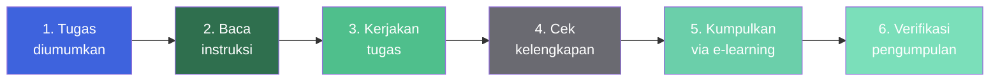
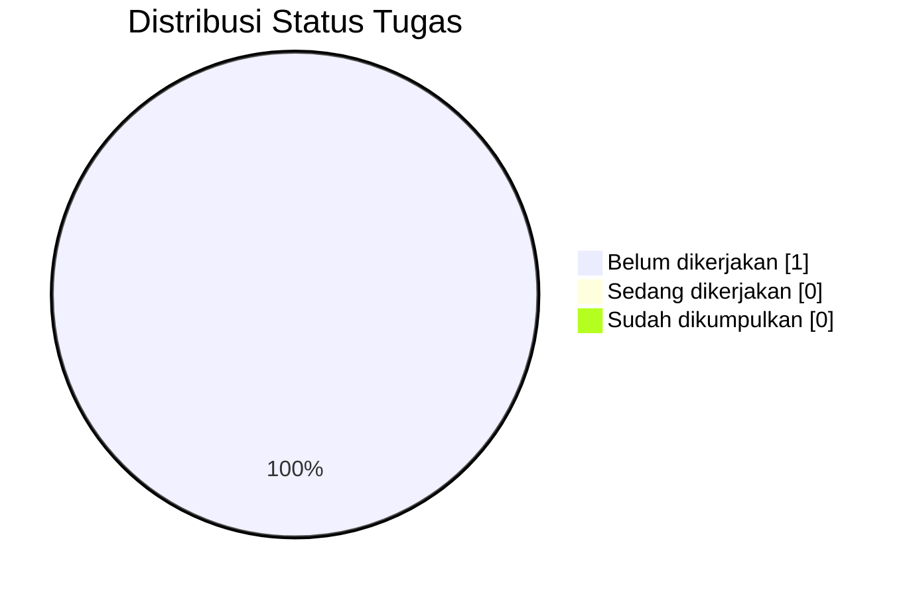
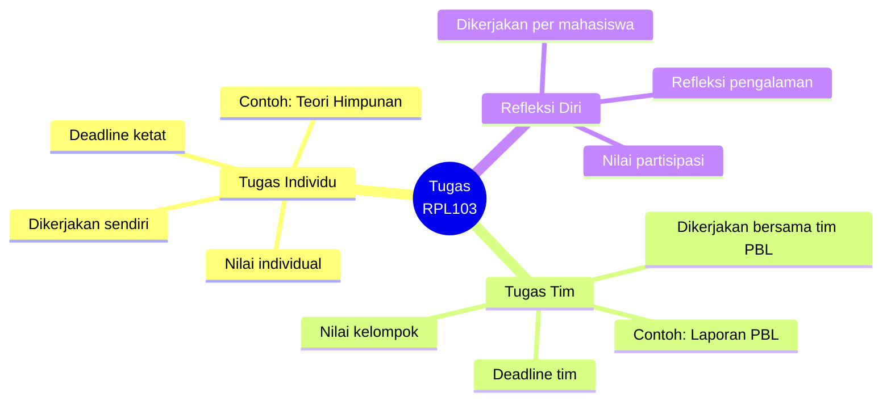
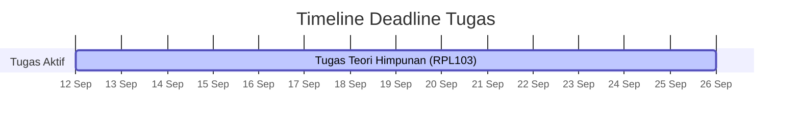

::: tip Portal E-Learning Resmi
Pastikan setiap tugas dikumpulkan sebelum tenggat melalui e-learning IF Polibatam.

[**Buka E-Learning IF Polibatam →**](https://learningif.polibatam.ac.id)
:::

## Sekilas Tugas

| **Total Tugas** | **Mata Kuliah** | **Tipe** |   **Semester**   |
| :-------------: | :-------------: | :------: | :--------------: |
|        1        |        1        | Individu | Ganjil 2026/2027 |

Halaman ini adalah **pusat pelacakan tugas** untuk semua mata kuliah semester ini. Setiap tugas dicatat dengan **mata kuliah**, **nama tugas**, **deadline**, dan **status pengerjaan** — supaya kamu tidak perlu mengingat-ingat atau mencatat di tempat terpisah.

::: info Cara Membaca Status Tugas
Setiap tugas punya **status** yang dapat berubah seiring waktu:

| Status                | Keterangan                              |
| --------------------- | --------------------------------------- |
| **Belum dikerjakan**  | Belum ada progres sama sekali.          |
| **Sedang dikerjakan** | Sudah mulai, tapi belum selesai.        |
| **Sudah dikumpulkan** | Sudah submit sebelum deadline.          |
| **Terlewat**          | Deadline sudah lewat tanpa pengumpulan. |
| :::                   |

## Alur Pengerjaan Tugas

Secara umum, alur pengerjaan dan pengumpulan tugas di semua mata kuliah mengikuti pola yang sama:

**Enam langkah krusial:**

| Tahap | Aktivitas                                                                 |
| :---: | ------------------------------------------------------------------------- |
| **1** | Tugas diumumkan melalui e-learning atau grup kelas.                       |
| **2** | Baca instruksi dengan teliti — catat format, deadline, dan lampiran.      |
| **3** | Kerjakan sesuai instruksi — sendiri atau bersama tim (untuk tugas PBL).   |
| **4** | Cek kelengkapan berkas sebelum submit — pastikan tidak ada yang terlewat. |
| **5** | Kumpulkan melalui **e-learning IF Polibatam** — bukan via email/chat.     |
| **6** | Verifikasi bahwa pengumpulan berhasil — cek riwayat di e-learning.        |

## Daftar Tugas

Pilih tugas di bawah ini untuk melihat detail, instruksi, dan tautan pengumpulannya.

### Matematika Diskrit — RPL103

::: info Tugas Teori Himpunan <Badge type="warning" text="Individu" />
**Mata Kuliah:** RPL103 — Matematika Diskrit
**Topik:** Teori Himpunan
**Tipe:** Tugas individu
**Status:** Belum dikerjakan

**Deskripsi:** Tugas ini menguji pemahaman tentang konsep dasar teori himpunan — termasuk definisi himpunan, penyajian, kardinalitas, subset, himpunan kuasa, dan operasi himpunan.

[**Lihat Detail Tugas →**](/v1/task/tugas-matematika-diskrit-materi-himpunan)
:::

::: tip Belum Ada Tugas Lain?
Saat ini hanya tugas **Teori Himpunan** yang tercatat. Begitu ada tugas baru dari mata kuliah lain, halaman ini akan diperbarui. Pantau e-learning dan grup kelas untuk pengumuman tugas terbaru.
:::

## Ringkasan Status

Ringkasan cepat semua tugas dalam satu tabel. Diperbarui setiap kali ada perubahan status.

| Mata Kuliah                 | Tugas          | Tipe     | Deadline | Status           |
| --------------------------- | -------------- | -------- | -------- | ---------------- |
| RPL103 — Matematika Diskrit | Teori Himpunan | Individu | —        | Belum dikerjakan |

### Distribusi Status

::: info Cara Memperbarui Tabel
Tabel di atas bersifat **living document** — perbarui setiap kali:

- Ada **tugas baru** yang diumumkan.
- Ada **perubahan deadline** dari dosen.
- Status pengerjaan **berubah** (misal dari "Belum dikerjakan" ke "Sedang dikerjakan" atau "Sudah dikumpulkan").

Jangan biarkan tabel ini menampilkan status yang sudah tidak akurat.
:::

## Tugas per Mata Kuliah

Ringkasan tugas yang terkelompok per mata kuliah — memudahkan melihat beban tugas di setiap mata kuliah.

| Kode     | Mata Kuliah                                        | SKS | Jumlah Tugas | Status Umum |
| -------- | -------------------------------------------------- | :-: | :----------: | ----------- |
| RPL101   | Pengantar Rekayasa Perangkat Lunak                 |  3  |      0       | —           |
| RPL102   | Algoritma dan Pemrograman                          |  3  |      0       | —           |
| RPL103   | Matematika Diskrit                                 |  3  |      1       | Aktif       |
| RPL104   | Analisis dan Spesifikasi Kebutuhan Perangkat Lunak |  3  |      0       | —           |
| RPL105   | Pemrograman Berbasis Web                           |  4  |      0       | —           |
| RPL106   | Pengantar Basis Data                               |  3  |      0       | —           |
| PK001RPL | Pendidikan Agama                                   |  2  |      0       | —           |

::: info Tugas Akan Ditambahkan
Tabel ini akan terus bertambah seiring berjalannya semester. Setiap mata kuliah umumnya memberikan minimal **2–4 tugas** sepanjang 14 pertemuan.
:::

## Tugas Individu vs Tim

Beberapa tugas dikerjakan **sendiri**, tapi sebagian lagi dikerjakan **bersama tim PBL**. Penting untuk tahu perbedaannya.

| Jenis Tugas       | Dikerjakan Oleh          | Pengumpulan                    |
| ----------------- | ------------------------ | ------------------------------ |
| **Individu**      | Setiap mahasiswa sendiri | Setiap mahasiswa submit        |
| **Tim / PBL**     | Tim PBL (6 mahasiswa)    | **Ketua tim** saja yang submit |
| **Refleksi Diri** | Setiap mahasiswa sendiri | Setiap mahasiswa submit        |

::: warning Perhatian untuk Tugas Tim
Untuk tugas tim PBL, **hanya ketua tim** yang diperbolehkan mengumpulkan berkas. Anggota tim lain cukup berkontribusi dan memverifikasi bahwa nama mereka tercantum dalam dokumen.
:::

## Tips Mengerjakan Tugas

::: tip Praktik Baik

- **Catat deadline di kalender** pribadi — jangan andalkan ingatan saja.
- **Baca instruksi dua kali** sebelum mulai mengerjakan — pastikan tidak ada poin yang terlewat.
- **Mulai lebih awal** — jangan menunggu sampai hari H. Sisakan waktu untuk revisi.
- **Backup pekerjaan** — simpan salinan di cloud atau repository Git.
- **Cek kelengkapan** sebelum submit — file, format, nama, dan lampiran.
- **Screenshot bukti submit** sebagai jaring pengaman jika ada kendala teknis.
- **Untuk tugas tim, dokumentasikan kontribusi** masing-masing anggota.
  :::

::: warning Hal yang Perlu Dihindari

- **Jangan mengumpulkan di menit terakhir** — server bisa lambat atau down.
- **Jangan mengumpulkan via email atau chat pribadi** kecuali diminta secara eksplisit.
- **Jangan copy-paste tanpa paham** — plagiarisme akademik ditindak serius.
- **Jangan mengandalkan teman** untuk tugas individu — ini akan merugikanmu sendiri.
- **Jangan abaikan verifikasi** — setelah submit, cek bahwa berkas benar-benar terkirim.
  :::

## Timeline Deadline

Setiap tugas punya deadline yang berbeda. Berikut visualisasi deadline tugas yang tercatat sejauh ini.

::: info Interpretasi Timeline
Timeline di atas akan diperbarui setiap kali ada tugas baru dengan deadline spesifik. Jika deadline belum ditetapkan, tugas tetap dicatat di tabel **Ringkasan Status** dengan tanda `—`.
:::

## Halaman Terkait

| Halaman                                                     | Deskripsi                                                |
| ----------------------------------------------------------- | -------------------------------------------------------- |
| [**Mata Kuliah**](/v1/courses/)                             | Daftar mata kuliah dengan materi, jadwal, dan referensi. |
| [**Informasi Perkuliahan**](/v1/information/)               | Jadwal, kontak dosen, dan info tim PBL.                  |
| [**Judul dan Tim PBL**](/v1/information/judul-dan-team-pbl) | Daftar tim PBL dan proyek yang dikerjakan.               |
| [**Format & Aturan**](/format/page)                         | Konvensi dokumentasi dan panduan kontribusi.             |

## Pertanyaan yang Sering Diajukan

::: details Bagaimana cara mengumpulkan tugas?

Semua tugas dikumpulkan melalui **e-learning IF Polibatam** di [learningif.polibatam.ac.id](https://learningif.polibatam.ac.id), kecuali dosen menginstruksikan lain.

Untuk tugas **individu**: setiap mahasiswa submit sendiri.
Untuk tugas **tim**: hanya **ketua tim** yang submit.

:::

::: details Apa yang terjadi jika saya melewatkan deadline?

Kebijakan telat pengumpulan **berbeda per dosen** — ada yang langsung memberi nilai 0, ada yang masih menerima dengan pengurangan nilai.

Cek kontrak kuliah atau tanyakan langsung ke dosen pengampu **sebelum** deadline terlewat. Jangan menunggu sampai terlewat untuk bertanya.

:::

::: details Apakah semua tugas harus dikumpulkan melalui e-learning?

**Ya, untuk sebagian besar tugas.** Kanal pengumpulan resmi adalah e-learning IF Polibatam. Jika dosen mengizinkan kanal lain (mis. GitHub untuk tugas pemrograman), itu akan diinstruksikan secara eksplisit.

Jangan pernah mengumpulkan tugas via email atau chat pribadi kecuali diminta.

:::

::: details Bagaimana cara memverifikasi bahwa tugas saya sudah terkirim?

Setelah submit di e-learning:

1. Cek **status pengumpulan** di halaman tugas tersebut — biasanya muncul "Submitted for grading" atau serupa.
2. Cek **riwayat aktivitas** di dashboard e-learning.
3. **Screenshot** tampilan konfirmasi sebagai cadangan.

Kalau status masih ragu, hubungi dosen atau asisten pengampu.

:::

::: details Bagaimana jika saya menemukan error di tabel tugas?

Tabel ini bersifat **living document** — kalau kamu menemukan ketidakakuratan (mis. deadline salah, status tidak update), langsung:

1. **Edit file** `docs/v1/task/index.md` di repository dan commit.
2. Atau **hubungi maintainer** melalui GitHub issue.

Segera lakukan — jangan biarkan informasi basi menumpuk.

:::

::: details Apakah tugas dari mata kuliah lain akan ditambahkan?

**Ya.** Halaman ini akan terus diperbarui seiring berjalannya semester. Setiap mata kuliah umumnya memberikan **2–4 tugas** sepanjang 14 pertemuan.

Kalau kamu melihat tugas di e-learning yang belum tercatat di sini, silakan tambahkan — atau beri tahu maintainer.

:::

::: details Apakah refleksi diri termasuk "tugas"?

**Ya, tapi tipe khusus.** Refleksi diri adalah tugas **individual** yang biasanya berbentuk kuis atau form di e-learning. Setiap mahasiswa wajib mengisi sendiri — tidak bisa diwakilkan.

Untuk proyek PBL, refleksi diri biasanya diadakan per minggu atau per milestone.

:::

## Sumber Referensi Online

### Platform Resmi

| Sumber                      | Tautan                                       |
| --------------------------- | -------------------------------------------- |
| **E-Learning IF Polibatam** | [Buka →](https://learningif.polibatam.ac.id) |
| **Politeknik Negeri Batam** | [Buka →](https://www.polibatam.ac.id)        |

### Panduan PBL

| Sumber                                            | Tautan                                                                                                                      |
| ------------------------------------------------- | --------------------------------------------------------------------------------------------------------------------------- |
| **Panduan PBL Semester 1 Ganjil 2026-2027 (PDF)** | [Unduh →](https://learning-if.polibatam.ac.id/pluginfile.php/36673/mod_label/intro/Panduan%20PBL%20Sem%201%202026-2027.pdf) |
| **Halaman Pembagian Tim PBL**                     | [Buka →](https://polibatam.id/tim-pbl-sem1-trpl-2026)                                                                       |

::: info Tentang Halaman Ini
Halaman ini adalah **pusat pelacakan tugas** untuk semua mata kuliah di Semester Ganjil 2026/2027. Data akan terus diperbarui seiring berjalannya semester.

**Update terakhir:** sesuaikan dengan tanggal update terakhir.
:::

::: tip Butuh Update Cepat?
Jika ada tugas baru, perubahan deadline, atau update status, edit file `docs/v1/task/index.md` dan commit segera. Jangan biarkan informasi basi menumpuk — tugas yang terlewat sering kali karena catatan yang tidak diperbarui.
:::
