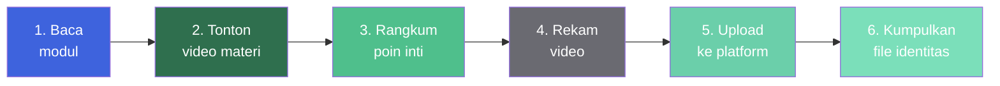
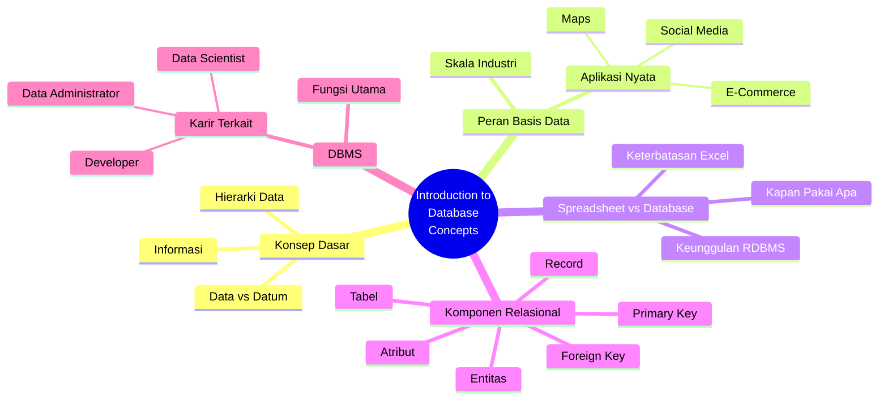
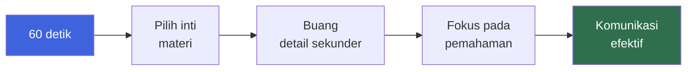
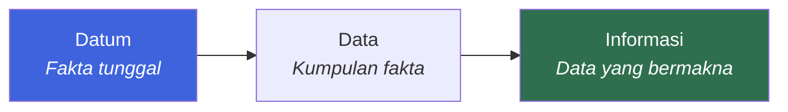

::: tip Sebelum Mengerjakan
Pastikan kamu sudah:

1. **Mengunduh modul Pertemuan 1** — "Introduction of Database Concepts" dari e-learning.
2. **Menonton video materi perkuliahan** yang disediakan di e-learning.
3. **Membaca slide presentasi** Pertemuan 1.

Tugas ini bukan sekadar merekam video — tapi membuktikan bahwa kamu **memahami materi**, bukan sekadar membaca.
:::

## Petunjuk Tugas

Ikuti alur berikut dari membaca materi hingga mengumpulkan tugas:



### Langkah Detail

1. **Baca modul dan slide** Pertemuan 1 tentang Introduction to Database Concepts.
2. **Tonton video materi** yang tersedia di e-learning — catat poin-poin penting.
3. **Rangkum 3–5 poin inti** yang paling kamu pahami — ini akan jadi naskah video.
4. **Rekam video pendek** (maksimal 60 detik) dengan gaya santai, nyaman, dan sopan.
5. **Upload video** ke platform pilihan (YouTube Shorts, TikTok, atau Reels IG/FB).
6. **Kumpulkan file .txt atau .pdf** yang memuat identitas dan link video.

## Materi yang Harus Dikuasai

Video resume kamu harus mencakup setidaknya **beberapa** dari topik berikut. Pilih yang paling kamu kuasai:



### Tujuan Pembelajaran Pertemuan 1

Setelah menyelesaikan tugas ini, kamu diharapkan mampu:

| No. | Tujuan Pembelajaran                                                                                          |
| :-: | ------------------------------------------------------------------------------------------------------------ |
|  1  | **Memahami perbedaan** antara Data, Datum, dan Informasi dalam konteks sistem komputer.                      |
|  2  | **Mengidentifikasi peran strategis** basis data dalam aplikasi dunia nyata (Social Media, E-Commerce, Maps). |
|  3  | **Menganalisis keterbatasan** penggunaan Spreadsheet (Excel) dibandingkan Relational Database.               |
|  4  | **Memahami konsep dasar** komponen relasional: Entitas, Atribut, Tabel, Record, Primary Key, Foreign Key.    |
|  5  | **Mengenal fungsi utama** DBMS dan gambaran karir terkait (Data Administrator, Data Scientist, Developer).   |

## Ketentuan Video

::: warning Ketentuan Wajib Video

| Aspek        | Ketentuan                                                   |
| ------------ | ----------------------------------------------------------- |
| **Jenis**    | Selfie Video — kamu tampil di depan kamera                  |
| **Gaya**     | Santai, nyaman, dan sopan                                   |
| **Editing**  | Boleh dengan editing, boleh video murni                     |
| **Durasi**   | Maksimal **60 detik**                                       |
| **Platform** | YouTube Shorts · TikTok · Reels IG/FB (pilih **satu** saja) |
| **Komentar** | **Jangan matikan** kolom komentar                           |
| **Bahasa**   | Indonesia (boleh campur istilah teknis Inggris)             |

:::

### Kenapa 60 Detik?

Durasi pendek bukan untuk mempersulit — justru memaksa kamu untuk:



- **Fokus.** Tidak ada waktu untuk bertele-tele.
- **Komunikasi.** Melatih penyampaian ide secara ringkas.
- **Pemahaman.** Kalau bisa dijelaskan dalam 60 detik, kamu benar-benar paham.

### Platform Pilihan

Pilih **salah satu** dari platform berikut. Jangan upload ke semua — cukup satu.

::: code-group

```text [YouTube Shorts]
✅ Kelebihan:
- Kualitas video lebih baik
- Komentar lebih terstruktur
- Link lebih stabil jangka panjang

⚠️ Perhatian:
- Pastikan video di-set "Public" atau "Unlisted"
- Jangan matikan komentar
```

```text [TikTok]
✅ Kelebihan:
- Upload cepat dari HP
- Kompresi otomatis
- Jangkauan luas

⚠️ Perhatian:
- Pastikan akun tidak private
- Jangan matikan komentar
- Perhatikan privasi — jangan bagikan info sensitif
```

```text [Reels IG/FB]
✅ Kelebihan:
- Terintegrasi dengan sosial media
- Upload mudah dari aplikasi mobile

⚠️ Perhatian:
- Pastikan akun tidak private
- Jangan matikan komentar
- Durasi maksimal 60 detik sudah cocok
```

:::

## Format Pengumpulan

::: warning Format Wajib Pengumpulan

Kumpulkan file dalam format **.txt** atau **.pdf** yang memuat informasi berikut:

```
Nama       : [Nama Lengkap]
NIM        : [Nomor Induk Mahasiswa]
Kelas      : [Contoh: TRPL 1A Malam]
Kode Dosen : [Contoh: AM atau NN]
Link Video : [URL Video Aktif]
```

Pastikan **link video dapat diakses publik** dan **kolom komentar terbuka**.

:::

### Contoh Isi File Pengumpulan

```text
Nama       : Muhammad Riduwan Khafidi
NIM        : 4342611034
Kelas      : TRPL 1B Malam
Kode Dosen : AM
Link Video : https://youtube.com/shorts/xxxxxxxxxxx
```

::: tip Sebelum Submit

- [ ] Link video sudah dites di browser **incognito** — memastikan bisa diakses publik.
- [ ] Kolom komentar **tidak dimatikan**.
- [ ] File berformat .txt atau .pdf — **bukan** .docx atau .md.
- [ ] Semua field terisi — tidak ada yang kosong.
- [ ] Sudah di-upload sebelum **deadline** yang tertera di e-learning.
      :::

## Deadline dan Validasi Presensi

::: info Deadline

- **Tenggat:** Tertera pada sistem pengumpulan di masing-masing kelas di e-learning.
- **Presensi:** Presensi teori pertemuan 1 **hanya divalidasi** bagi mahasiswa yang sudah mengumpulkan tugas ini.
- **Konsekuensi:** Jika tidak mengumpulkan, kamu dianggap **tidak hadir** di pertemuan 1 — meskipun secara fisik hadir.
  :::

## Konsep Kunci untuk Video

Beberapa konsep yang **wajib kamu pahami** sebelum merekam video. Pilih 3–5 konsep paling relevan untuk dibahas.

### 1. Data, Datum, dan Informasi



- **Datum** — satu fakta mentah (misal: "25").
- **Data** — kumpulan fakta (misal: "25, 30, 28, 32").
- **Informasi** — data yang sudah diberi konteks dan makna (misal: "Suhu rata-rata minggu ini adalah 28°C").

### 2. Spreadsheet vs Relational Database

| Aspek               | Spreadsheet (Excel)             | Relational Database     |
| ------------------- | ------------------------------- | ----------------------- |
| **Skala**           | Kecil–menengah                  | Menengah–besar          |
| **Multi-user**      | Terbatas                        | Ya, dirancang untuk itu |
| **Integritas Data** | Manual                          | Otomatis (constraint)   |
| **Query**           | Formula                         | SQL                     |
| **Concurrency**     | Rawan konflik                   | Terkelola               |
| **Cocok untuk**     | Catatan pribadi, analisis kecil | Aplikasi produksi       |

### 3. Komponen Relasional

| Komponen        | Penjelasan                                                                  |
| --------------- | --------------------------------------------------------------------------- |
| **Entitas**     | Objek yang direpresentasikan dalam database (misal: Mahasiswa, Mata Kuliah) |
| **Atribut**     | Karakteristik entitas (misal: nama, NIM, alamat)                            |
| **Tabel**       | Representasi fisik entitas — baris dan kolom                                |
| **Record**      | Satu baris dalam tabel — satu instance entitas                              |
| **Primary Key** | Kolom unik yang mengidentifikasi setiap record                              |
| **Foreign Key** | Kolom yang merujuk ke Primary Key tabel lain — membangun relasi             |

### 4. DBMS (Database Management System)

**Fungsi utama DBMS:**

- Menyimpan dan mengelola data secara terstruktur.
- Menjaga integritas dan konsistensi data.
- Menyediakan mekanisme query (SQL).
- Mengelola akses dan keamanan.
- Menangani backup dan recovery.

**Karir terkait:**

- **Data Administrator** — mengelola infrastruktur database.
- **Data Scientist** — menganalisis data untuk insight.
- **Developer** — membangun aplikasi di atas database.

## Tips Membuat Video yang Baik

::: tip Tips Produksi Video

- **Siapkan naskah singkat.** Tulis 3–5 poin utama, bukan naskah lengkap. Membaca naskah akan terlihat kaku.
- **Rekam di tempat tenang.** Hindari kebisingan latar belakang.
- **Pastikan pencahayaan cukup.** Wajah harus terlihat jelas — cahaya dari depan, bukan belakang.
- **Posisi kamera stabil.** Gunakan tripod atau letakkan HP di tempat yang kokoh.
- **Bicara dengan tempo sedang.** Tidak terlalu cepat, tidak terlalu lambat.
- **Tatap kamera, bukan layar.** Kontak mata membangun koneksi dengan penonton.
- **Gunakan intonasi.** Variasikan nada bicara agar tidak monoton.
- **Cek audio sebelum upload.** Pastikan suara terdengar jelas — bukan hanya gambar.
- **Durasi 45–55 detik.** Sisakan buffer — jangan terlalu mepet ke 60 detik.
- **Jangan lupa buka komentar.** Ini ketentuan wajib.
  :::

::: warning Hindari

- **Membaca naskah dari kertas.** Terlihat tidak natural.
- **Video lebih dari 60 detik.** Platform akan memotong otomatis — pesan bisa terpotong.
- **Suara tidak jelas.** Audio buruk = penilaian buruk.
- **Setting private.** Video harus bisa diakses publik.
- **Komentar dimatikan.** Ini pelanggaran ketentuan.
- **Lupa identitas di file pengumpulan.** File tanpa identitas tidak bisa dinilai.
- **Mengumpulkan setelah deadline.** Presensi tidak akan tervalidasi.
  :::

## Contoh Naskah Video (60 Detik)

Berikut kerangka naskah yang bisa kamu adaptasi:

::: details Kerangka Naskah — 5 Poin dalam 55 Detik

**0–5 detik — Pembuka**

"Halo, saya [Nama] dari kelas [Kelas]. Hari ini saya akan merangkum materi Pertemuan 1 tentang Introduction to Database Concepts."

**5–15 detik — Poin 1: Data vs Informasi**

"Materi pertama membahas perbedaan data dan informasi. Data adalah kumpulan fakta mentah, sedangkan informasi adalah data yang sudah diberi konteks dan makna."

**15–25 detik — Poin 2: Peran Basis Data**

"Basis data memiliki peran strategis di aplikasi modern — dari social media, e-commerce, hingga maps. Semuanya mengandalkan database untuk menyimpan dan mengelola data dalam skala besar."

**25–35 detik — Poin 3: Spreadsheet vs Database**

"Berbeda dengan Excel yang cocok untuk skala kecil, relational database dirancang untuk data besar, multi-user, dan integritas tinggi."

**35–45 detik — Poin 4: Komponen Relasional**

"Komponen dasar database relasional meliputi entitas, atribut, tabel, record, primary key, dan foreign key."

**45–55 detik — Penutup**

"Fungsi utama DBMS adalah menyimpan, mengelola, dan mengamankan data. Itu rangkuman saya, terima kasih!"

:::

::: tip Sesuaikan dengan Gayamu
Kerangka di atas hanya panduan. Sesuaikan dengan gaya bicaramu — santai, formal, atau campuran. Yang penting: **jelas, padat, dan menunjukkan pemahaman**.
:::

## Checklist Sebelum Submit

- [ ] Modul Pertemuan 1 sudah dibaca
- [ ] Video materi sudah ditonton
- [ ] Naskah 3–5 poin sudah disiapkan
- [ ] Video sudah direkam (maksimal 60 detik)
- [ ] Audio dan gambar jelas
- [ ] Video sudah di-upload ke salah satu platform
- [ ] Video **tidak private** — bisa diakses publik
- [ ] Kolom komentar **tidak dimatikan**
- [ ] File .txt atau .pdf sudah dibuat
- [ ] Semua field identitas terisi lengkap
- [ ] Link video sudah dites di incognito
- [ ] File di-upload sebelum deadline
- [ ] Presensi pertemuan 1 tervalidasi

## Pertanyaan yang Sering Diajukan

::: details Apakah video harus dalam Bahasa Indonesia?

**Ya, disarankan Bahasa Indonesia.** Boleh mencampur dengan istilah teknis Inggris (misal "primary key", "database", "relational"). Yang penting adalah penyampaian yang jelas dan mudah dipahami.

:::

::: details Bolehkah menggunakan template atau efek TikTok?

**Boleh.** Ketentuan membolehkan editing maupun video murni. Gunakan efek yang mendukung penyampaian materi — bukan yang mengganggu.

:::

::: details Bagaimana kalau saya tidak nyaman tampil di kamera?

Tugas ini adalah **selfie video** — kamu memang harus tampil di depan kamera. Ini bagian dari latihan komunikasi publik. Kalau benar-benar tidak nyaman, hubungi dosen pengampu untuk diskusi opsi alternatif — tapi jangan berasumsi bisa diubah tanpa konfirmasi.

:::

::: details Apakah video bisa diedit dengan subtitle?

**Bisa, dan justru bagus.** Subtitle membantu penonton memahami materi, terutama jika audio kurang jelas. Tapi pastikan subtitle akurat dan tidak mengganggu visual.

:::

::: details Apa yang dimaksud dengan "jangan matikan kolom komentar"?

Di platform seperti YouTube Shorts, TikTok, atau Reels, kamu bisa mengatur video agar komentar dinonaktifkan. **Jangan lakukan itu.** Ketentuan ini kemungkinan untuk memastikan video benar-benar publik dan bisa diverifikasi keaktifannya.

:::

::: details Bagaimana kalau saya mengumpulkan terlambat?

Deadline tertera di e-learning masing-masing kelas. Mengumpulkan terlambat biasanya **tidak akan memvalidasi presensi pertemuan 1**. Kalau ada kendala serius, hubungi dosen pengampu atau tim pengajar **sebelum** deadline — bukan sesudahnya.

:::

::: details Apakah video harus di-upload ke YouTube?

**Tidak.** Kamu bisa memilih salah satu dari: YouTube Shorts, TikTok, atau Reels IG/FB. Pilih yang paling nyaman untukmu — yang penting video bisa diakses publik dan kolom komentar terbuka.

:::

::: details Berapa nilai tugas ini terhadap nilai akhir?

Bobot detail tugas ini terhadap nilai akhir biasanya tercantum di RPS. Secara umum, tugas teori seperti ini masuk ke komponen **"Kognitif Tugas"** atau **"Aktivitas Partisipatif"**. Cek RPS mata kuliah untuk bobot pastinya.

:::

## Contoh Pengumpulan

Berikut contoh isi file pengumpulan yang benar:

```text
===========================================
TUGAS TEORI PERTEMUAN 1
RPL106 - Pengantar Basis Data
===========================================

Nama       : Muhammad Riduwan Khafidi
NIM        : 4342611034
Kelas      : TRPL 1B Malam
Kode Dosen : AM

Link Video : https://youtube.com/shorts/abcdefg12345

===========================================
Catatan:
- Video berdurasi 58 detik
- Kolom komentar terbuka
- Video dapat diakses publik
===========================================
```

## Halaman Terkait

| Halaman                                                              | Deskripsi                                        |
| -------------------------------------------------------------------- | ------------------------------------------------ |
| [**Daftar Tugas**](/v1/task/)                                        | Semua tugas mata kuliah semester ini             |
| [**Pengantar Basis Data**](/v1/courses/rpl106-pengantar-basis-data/) | Halaman mata kuliah RPL106 dengan materi lengkap |
| [**Kontak Dosen**](/v1/information/kontak-dosen)                     | Kontak dosen pengampu RPL106                     |
| [**Format & Aturan**](/format/page)                                  | Konvensi dokumentasi dan panduan kontribusi      |

::: info Tentang Halaman Ini
Halaman ini memuat **Tugas Teori Pertemuan 1** untuk mata kuliah RPL106 — Pengantar Basis Data. Tugas ini berupa **resume video pendek** tentang materi Introduction to Database Concepts.

| Field                 | Value                             |
| --------------------- | --------------------------------- |
| **Mata Kuliah**       | RPL106 — Pengantar Basis Data     |
| **Dosen Koordinator** | Ahmadi Irmansyah Lubis (AM)       |
| **Tim Pengajar**      | Muhammad Sahrul Nizan (NN)        |
| **Pertemuan**         | 1                                 |
| **Topik**             | Introduction to Database Concepts |
| **Tipe Tugas**        | Individu — Selfie Video Resume    |
| **Durasi**            | Maksimal 60 detik                 |
| :::                   |

::: tip Butuh Bantuan?
Jika ada bagian tugas yang kurang jelas:

1. **Cek pengumuman di e-learning** — biasanya ada klarifikasi dari tim pengajar.
2. **Tanyakan di grup WhatsApp kelas** — teman sekelas mungkin punya jawaban.
3. **Hubungi dosen pengampu** — melalui e-learning atau WhatsApp resmi.

Jangan menunda — pahami instruksinya sebelum mulai merekam.
:::

::: warning Pengingat Penting
**Presensi pertemuan 1 hanya divalidasi bagi yang mengumpulkan tugas ini.** Jadi jangan hanya hadir secara fisik — pastikan tugasmu benar-benar terkirim sebelum deadline. Screenshot bukti submit sebagai backup.
:::
