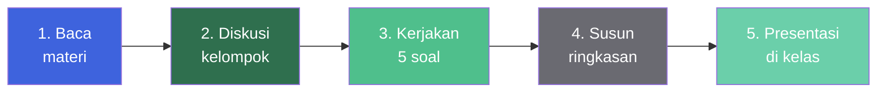
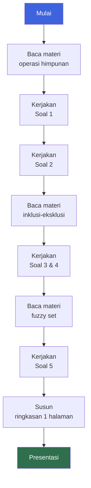

::: tip Sebelum Mengerjakan
Tugas ini memiliki **5 soal** dengan konteks penerapan teori himpunan pada sistem perangkat lunak. Sebelum mulai mengerjakan, pastikan kamu sudah membaca materi berikut:

- Operasi himpunan (union, intersection, difference, complement)
- Kardinalitas himpunan
- Prinsip inklusi-eksklusi
- Himpunan fuzzy (fuzzy set)
- Notasi pembentuk himpunan (rule-based)

Referensi bacaan tersedia di bagian [Referensi](#referensi) di bawah.
:::

## Petunjuk Tugas

Ikuti langkah-langkah berikut dalam mengerjakan tugas ini:



### Langkah Detail

1. **Baca materi** tentang operasi himpunan, inklusi-eksklusi, dan fuzzy set dari sumber bacaan (buku referensi atau sumber lain) untuk menyelesaikan soal 3–5.
2. **Diskusikan dalam kelompok kecil** (2–3 orang) atau sesuai Tim PBL.
3. **Siapkan ringkasan jawaban** (1 halaman) dalam bentuk PPT atau PDF untuk dipresentasikan pada pertemuan berikutnya.

::: warning Format Pengumpulan

- **Bentuk:** PPT atau PDF
- **Panjang:** 1 halaman ringkasan
- **Waktu presentasi:** Pertemuan berikutnya
- **Pengumpulan:** Melalui e-learning IF Polibatam (kecuali diinstruksikan lain)
  :::

## Daftar Soal

Lima soal dengan konteks sistem nyata. Klik setiap soal untuk melihat detail dan pertanyaannya.

### Tugas 1: Sistem Back-end E-commerce

::: info Konteks
Sebuah tim pengembang sedang merancang sistem **back-end e-commerce**. Sistem menyimpan katalog ID produk digital yang diwakili oleh himpunan bilangan bulat $x$.
:::

**Kategori A (Produk Terlaris):**

Didefinisikan secara eksplisit:

$$A = \{101, 102, 105, 108, 112\}$$

**Kategori B (Produk Promo Flash Sale):**

Didefinisikan dengan syarat:

$$B = \{x \mid x \text{ adalah bilangan bulat}, 100 \leq x \leq 115 \text{ dan } x \text{ habis dibagi } 3\}$$

**Pertanyaan:**

**a.** Nyatakan himpunan $B$ dengan cara **Enumerasi** (menuliskan semua anggotanya satu per satu).

**b.** Nyatakan himpunan $A$ menggunakan **Notasi Pembentuk Himpunan** (rule-based).

**c.** Jika pengembang ingin membuat struktur data array untuk menyimpan seluruh produk unik dari gabungan Kategori A dan B, hitung nilai **kardinalitasnya** (jumlah elemen unik).

::: details Petunjuk Pengerjaan

**Untuk bagian (a):**

- Cari semua bilangan bulat antara 100 dan 115 (inklusif) yang habis dibagi 3.
- Bilangan kelipatan 3 dalam rentang ini: mulai dari 102, 105, 108, ...
- Tuliskan semua dalam kurung kurawal.

**Untuk bagian (b):**

- Tentukan sifat atau pola yang menjadi ciri khas anggota himpunan $A$.
- Gunakan format $\{x \mid \text{sifat}(x)\}$ atau $\{x : \text{sifat}(x)\}$.
- Contoh: jika semua elemen $A$ adalah bilangan tiga digit antara 100–115, tuliskan sifat tersebut.

**Untuk bagian (c):**

- Gabungan $A \cup B$ berisi elemen unik dari kedua himpunan.
- Hitung $|A \cup B|$ dengan rumus: $|A \cup B| = |A| + |B| - |A \cap B|$
- Perhatikan elemen yang muncul di keduanya (irisan).
  :::

### Tugas 2: Sistem Analitik Lalu Lintas Web

::: info Konteks
Sistem **analitik lalu lintas web** mencatat ID Pengguna (_User ID_) yang melakukan aktivitas klik pada modul pembayaran selama 1 jam.
:::

**Data log mentah (array)** yang terekam:

```text
[1102, 1105, 1102, 1103, 1108, 1105, 1102, 1109, 1110, 1103,
 1102, 1112, 1115, 1108, 1110, 1112, 1105, 1102, 1118, 1109,
 1103, 1108, 1112, 1120, 1105, 1102, 1115, 1108, 1103, 1112]
```

**Pertanyaan:**

**a.** Tuliskan himpunan _User ID_ unik yang mengakses modul pembayaran dalam 1 jam tersebut (hilangkan duplikasi).

**b.** Jika himpunan pengguna dengan _User ID_ kelipatan 5 adalah $K$ dan himpunan pengguna dengan _User ID_ ganjil adalah $G$, tentukan:

- $K \cap G$
- $K \cup G$

**c.** Hitung kardinalitas himpunan _User ID_ unik yang **BUKAN** kelipatan 5 dan **BUKAN** ganjil (gunakan komplemen relatif).

::: details Petunjuk Pengerjaan

**Untuk bagian (a):**

- Kumpulkan semua _User ID_ dari array.
- Hilangkan angka yang muncul lebih dari sekali.
- Urutkan dari terkecil ke terbesar.
- Tuliskan dalam kurung kurawal.

**Untuk bagian (b):**

- Identifikasi semua _User ID_ kelipatan 5 → himpunan $K$.
- Identifikasi semua _User ID_ ganjil → himpunan $G$.
- **Irisan** $K \cap G$ = angka yang sekaligus kelipatan 5 **dan** ganjil (yaitu, angka ganjil kelipatan 5, misal 15, 25, 35, ...).
- **Gabungan** $K \cup G$ = semua angka yang ada di $K$ atau $G$ atau keduanya.

**Untuk bagian (c):**

- Komplemen relatif $U \setminus (K \cup G)$ = elemen di himpunan semesta yang tidak ada di $K \cup G$.
- Dengan kata lain: _User ID_ yang **genap** dan **bukan kelipatan 5**.
- Hitung jumlahnya.
  :::

### Tugas 3: Sistem Login Multi-platform

::: info Konteks
Sebuah perusahaan memiliki sistem login yang dipakai di tiga platform berbeda: **Web**, **Android**, dan **iOS**. Tim keamanan mencatat jumlah pengguna unik di setiap platform.
:::

Diketahui:

- $|W| = 120$ (pengguna aktif di Web)
- $|A| = 85$ (pengguna aktif di Android)
- $|I| = 60$ (pengguna aktif di iOS)
- $|W \cap A| = 40$
- $|W \cap I| = 25$
- $|A \cap I| = 20$
- $|W \cap A \cap I| = 10$
- $|U| = 200$ (total pengguna terdaftar)

**Pertanyaan:**

**a.** Hitung jumlah pengguna yang aktif di **minimal satu platform** menggunakan prinsip inklusi-eksklusi tiga himpunan.

**b.** Hitung jumlah pengguna yang **tidak aktif di platform manapun**.

**c.** Hitung jumlah pengguna yang aktif **hanya di Web** (tidak di Android maupun iOS).

::: details Petunjuk Pengerjaan

**Prinsip Inklusi-Eksklusi Tiga Himpunan:**

$$|W \cup A \cup I| = |W| + |A| + |I| - |W \cap A| - |W \cap I| - |A \cap I| + |W \cap A \cap I|$$

**Untuk bagian (a):**

- Substitusikan nilai yang diketahui ke rumus di atas.
- Hitung hasilnya.

**Untuk bagian (b):**

- Pengguna yang tidak aktif di platform manapun = komplemen dari $W \cup A \cup I$.
- Rumus: $|U| - |W \cup A \cup I|$.

**Untuk bagian (c):**

- Pengguna hanya di Web = elemen $W$ yang bukan bagian dari $A$ maupun $I$.
- Rumus: $|W| - |W \cap A| - |W \cap I| + |W \cap A \cap I|$
- Mengapa ditambah $|W \cap A \cap I|$? Karena elemen yang berada di ketiganya dikurangi dua kali (sekali di $W \cap A$ dan sekali di $W \cap I$), sehingga perlu ditambahkan kembali satu kali.
  :::

### Tugas 4: Sistem Rekomendasi Produk

::: info Konteks
Sebuah platform **e-commerce** memiliki sistem rekomendasi yang menganalisis produk yang dilihat pelanggan. Data dari 300 pelanggan menunjukkan:

- 180 pelanggan melihat **Elektronik** ($E$)
- 150 pelanggan melihat **Fashion** ($F$)
- 120 pelanggan melihat **Rumah Tangga** ($R$)
- 60 pelanggan melihat $E$ dan $F$
- 50 pelanggan melihat $E$ dan $R$
- 40 pelanggan melihat $F$ dan $R$
- 20 pelanggan melihat ketiganya

**Pertanyaan:**

**a.** Hitung jumlah pelanggan yang melihat **hanya Elektronik** saja.

**b.** Hitung jumlah pelanggan yang melihat **tepat dua kategori** (bukan tiga).

**c.** Jika perusahaan ingin menargetkan promosi ke pelanggan yang **tidak melihat satupun** dari ketiga kategori, berapa jumlah mereka?

::: details Petunjuk Pengerjaan

**Untuk bagian (a):**

- Hanya Elektronik = $E - (E \cap F) - (E \cap R) + (E \cap F \cap R)$.
- Atau dengan diagram Venn: hitung bagian $E$ yang tidak beririsan dengan $F$ maupun $R$.

**Untuk bagian (b):**

- Tepat dua kategori = $(E \cap F) + (E \cap R) + (F \cap R) - 3 \cdot (E \cap F \cap R)$.
- Mengapa dikurangi tiga kali? Karena setiap irisan ganda masih mengandung elemen yang berada di ketiga himpunan.

**Untuk bagian (c):**

- Tidak melihat satupun = komplemen dari $E \cup F \cup R$.
- Pertama, hitung $|E \cup F \cup R|$ dengan prinsip inklusi-eksklusi tiga himpunan.
- Kemudian, kurangi dari total 300.
  :::

### Tugas 5: Sistem Penilaian Kinerja Karyawan dengan Fuzzy Set

::: info Konteks
Departemen HRD sebuah perusahaan menggunakan **fuzzy set** untuk menilai kinerja karyawan. Berbeda dengan himpunan klasik (keanggotaan 0 atau 1), fuzzy set memungkinkan keanggotaan parsial antara 0 dan 1.
:::

Nilai kinerja karyawan direpresentasikan sebagai derajat keanggotaan $\mu$ pada himpunan fuzzy **"Kinerja Baik"**:

| Karyawan | Nilai Kinerja | Derajat Keanggotaan $\mu$ |
| -------- | ------------- | :-----------------------: |
| Andi     | 95            |            1.0            |
| Budi     | 85            |            0.8            |
| Citra    | 75            |            0.5            |
| Dewi     | 60            |            0.2            |
| Eko      | 45            |            0.0            |

**Pertanyaan:**

**a.** Jelaskan perbedaan utama antara **himpunan klasik** (crisp set) dan **himpunan fuzzy** (fuzzy set).

**b.** Tentukan nilai $\alpha$-cut untuk $\alpha = 0.5$. Apa artinya dalam konteks penilaian kinerja?

**c.** Jika perusahaan ingin memberi bonus kepada karyawan yang memiliki derajat keanggotaan $\mu \geq 0.7$, siapa saja yang berhak menerima bonus?

::: details Petunjuk Pengerjaan

**Untuk bagian (a):**

- **Himpunan klasik:** keanggotaan hanya 0 atau 1 (mutlak).
- **Himpunan fuzzy:** keanggotaan berupa nilai kontinu antara 0 dan 1 (parsial).
- Berikan contoh konkret dari data di atas untuk memperjelas perbedaan.

**Untuk bagian (b):**

- $\alpha$-cut dari himpunan fuzzy $F$ didefinisikan sebagai $F_\alpha = \{x \mid \mu_F(x) \geq \alpha\}$.
- Untuk $\alpha = 0.5$, cari semua karyawan dengan $\mu \geq 0.5$.
- Interpretasikan hasilnya: siapa saja yang dianggap "cukup baik" atau lebih.

**Untuk bagian (c):**

- Cari semua karyawan dengan $\mu \geq 0.7$.
- Bandingkan dengan tabel di atas.
- Sebutkan nama-nama karyawan yang berhak menerima bonus.
  :::

## Ringkasan Soal

Tabel ringkas kelima soal beserta konsep utama yang diuji.

| No. | Judul Soal                       | Konsep Utama                                 | Tingkat Kesulitan |
| :-: | -------------------------------- | -------------------------------------------- | :---------------: |
|  1  | Sistem Back-end E-commerce       | Himpunan eksplisit, rule-based, kardinalitas |       Mudah       |
|  2  | Sistem Analitik Lalu Lintas Web  | Deduplikasi, irisan, gabungan, komplemen     |   Mudah–Sedang    |
|  3  | Sistem Login Multi-platform      | Inklusi-eksklusi tiga himpunan               |      Sedang       |
|  4  | Sistem Rekomendasi Produk        | Diagram Venn, tepat dua kategori             |   Sedang–Sulit    |
|  5  | Sistem Penilaian Kinerja (Fuzzy) | Himpunan fuzzy, $\alpha$-cut                 |       Sulit       |

### Alur Pengerjaan yang Disarankan



## Konsep Kunci yang Diuji

Ringkasan konsep yang perlu kamu kuasai untuk mengerjakan tugas ini.

### Operasi Dasar Himpunan

| Operasi          | Notasi                     | Arti                                    |
| ---------------- | -------------------------- | --------------------------------------- |
| **Gabungan**     | $A \cup B$                 | Semua elemen yang ada di $A$ atau $B$   |
| **Irisan**       | $A \cap B$                 | Elemen yang ada di $A$ dan $B$          |
| **Selisih**      | $A - B$                    | Elemen di $A$ yang tidak ada di $B$     |
| **Komplemen**    | $A^c$ atau $U \setminus A$ | Elemen di semesta yang tidak ada di $A$ |
| **Kardinalitas** | $\|A\|$                    | Jumlah elemen dalam himpunan $A$        |

### Prinsip Inklusi-Eksklusi

**Dua himpunan:**

$$|A \cup B| = |A| + |B| - |A \cap B|$$

**Tiga himpunan:**

$$|A \cup B \cup C| = |A| + |B| + |C| - |A \cap B| - |A \cap C| - |B \cap C| + |A \cap B \cap C|$$

### Himpunan Fuzzy

| Istilah                 | Definisi                                                                                 |
| ----------------------- | ---------------------------------------------------------------------------------------- |
| **Derajat keanggotaan** | Nilai $\mu(x) \in [0, 1]$ yang menyatakan seberapa "anggota" $x$ terhadap himpunan fuzzy |
| **$\alpha$-cut**        | Himpunan klasik $F_\alpha = \{x \mid \mu_F(x) \geq \alpha\}$                             |
| **Support**             | Himpunan elemen dengan $\mu > 0$                                                         |
| **Core**                | Himpunan elemen dengan $\mu = 1$                                                         |

## Referensi

### Buku Referensi

| No. | Referensi                                                                                 |
| :-: | ----------------------------------------------------------------------------------------- |
|  1  | Munir, R. _Matematika Diskrit_. Bandung: Informatika, 2012.                               |
|  2  | Susanna S. Epp. _Discrete Mathematics with Applications_, 4th Edition. Brooks Cole, 2010. |
|  3  | Rosen, K. H. _Discrete Mathematics and Its Applications_. McGraw-Hill.                    |
|  4  | Seymour Lipschutz, Marc Lipson. _Discrete Mathematics_. McGraw-Hill, 2007.                |

### Sumber Belajar Online

| Sumber                                      | Tautan                                                                                   |
| ------------------------------------------- | ---------------------------------------------------------------------------------------- |
| **E-Learning IF Polibatam**                 | [Buka →](https://learningif.polibatam.ac.id)                                             |
| **Khan Academy — Set Theory**               | [Buka →](https://www.khanacademy.org/math/statistics-probability/probability-library)    |
| **MIT OpenCourseWare — Mathematics for CS** | [Buka →](https://ocw.mit.edu/courses/6-042j-mathematics-for-computer-science-fall-2010/) |

## Format Pengumpulan

::: warning Format Wajib

- **Bentuk berkas:** PPT atau PDF
- **Panjang:** 1 halaman ringkasan
- **Isi ringkasan:**
  - Identitas kelompok (nama anggota, NIM)
  - Jawaban setiap soal (5 soal)
  - Langkah pengerjaan yang jelas
  - Kesimpulan singkat

- **Pengumpulan:** Melalui e-learning IF Polibatam
- **Presentasi:** Pada pertemuan berikutnya

:::

::: tip Tips Mengerjakan

- **Kerjakan berurutan.** Soal 1–2 sebagai pemanasan, soal 3–4 lebih menantang, soal 5 paling sulit.
- **Gambar diagram Venn** untuk soal 3 dan 4 — membantu visualisasi.
- **Tulis langkah pengerjaan**, bukan hanya jawaban akhir.
- **Cek ulang hasil** dengan menghitung menggunakan cara berbeda.
- **Diskusikan dalam kelompok** — dua kepala lebih baik dari satu.
- **Presentasi dengan percaya diri** — tunjukkan pemahaman, bukan sekadar membacakan jawaban.
  :::

## Halaman Terkait

| Halaman                                                          | Deskripsi                                         |
| ---------------------------------------------------------------- | ------------------------------------------------- |
| [**Daftar Tugas**](/v1/task/)                                    | Semua tugas mata kuliah semester ini.             |
| [**Matematika Diskrit**](/v1/courses/rpl103-matematika-diskrit/) | Halaman mata kuliah RPL103 dengan materi lengkap. |
| [**Format & Aturan**](/format/page)                              | Konvensi dokumentasi dan panduan kontribusi.      |

::: info Tentang Halaman Ini
Halaman ini memuat **Tugas Matematika Diskrit — Teori Himpunan** untuk mata kuliah RPL103. Tugas ini terdiri dari 5 soal dengan konteks penerapan pada sistem perangkat lunak nyata.

**Dosen Pengampu:** Supardianto
**Mata Kuliah:** RPL103 — Matematika Diskrit
:::

::: tip Butuh Bantuan?
Jika ada bagian soal yang kurang jelas, tanyakan pada sesi perkuliahan atau melalui e-learning. Jangan menunda — pahami soalnya sebelum mengerjakan.
:::
