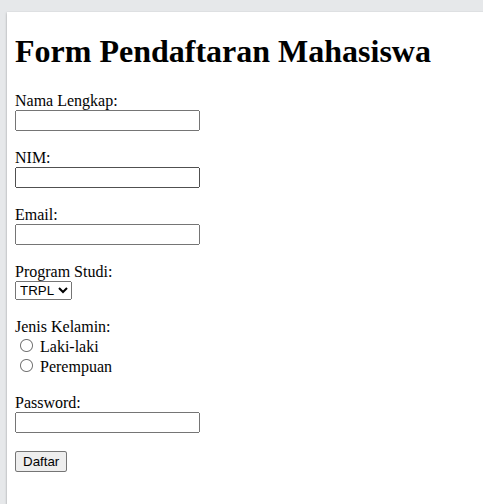

# TUGAS TEORI PERTEMUAN 2

Penulis :
```
NIM	:	4342611034
Nama	: 	MUHAMMAD RIDUWAN KHAFIDI
Kelas	:	TRPL MALAM B
```

## Soal 1 — Konsep Dasar HTML

Jelaskan apa yang dimaksud dengan HTML dan apa perannya dalam pengembangan aplikasi web.

Jelaskan pula perbedaan fungsi:

- HTML
- CSS
- JavaScript
- 
Mengapa ketiga teknologi tersebut umumnya digunakan secara bersama-sama dalam pengembangan
aplikasi web?

Jawaban :

1. apa itu html ?
Jadi html itu kayak gini,, nah jadi kalau kita bukak website ni,, kan ada itu kayak text atau kayak gambar table tombol dll nah itu sebenrnnya dari html,, nah sebenrnya browser itu ngak tau tetx ini itu apa ya apa dia paragraph atau judul dll,, tapi dengan html kita ngasih tau ke browser kalau ini itu paragraph ini itu gambar dll makanya dia tau.

2. perannya si html buat webdev
nah jadi di web itu html itu gunanya buat bikin kayak fondasi atau kayak kerangkanya dulu paham ngak??,, kayak gini,, jadi kota buat table, atau gambar atau tombol nah itu html yang kerjain jadi muncul lah di browser kayak apa apa itu,,

nah trsu apasih tujuanya css sama js ??

nah kalau si html tadi udah buat strukturnya maka ini ngelanjutin kerjanya s html itu.
Oke conoth paling ismplenya gini,, misalnya kita mau buat rumah ni,, nah jadi html itu kayak buat dinding nya dulu,, jadi rumah nya itu jadi tapi jelek kali kayak belum di plastter belum di kasih keramik atau lampu dll. Nah disni lah kerjannya si css sama js

nah jadi css ini buat si html (rumah) yang tadinay jelek jadi bagus,, nah kalau ada css itu ajdi rapi kayak di kasih warna di kasih animasi di kasih kayak apalah biar diliatnay itu enak na itu lah gunaya css.
Nah kalau js ini beda lagi,, js ini buat rumahnya itu hidup,, oke jadi rumah yang tadi udah ajdi ni
udah rapi di kasih css atau bayngkan aja ruamh yang mewah kali udah kebayang ngak? Tapi masi belum ada lampu sama saklar kan ga lucu, kelapdong rumahnya,, nah disini lah js itu bekerja js itu biar rumahnya banyka fiturnya
contohnay kayak di rumah itu ita tamain pintu atau lampu saklrar lift dll pokoknya dia ini biar hidup giut lah simplenya.

Nah jadi ke 3 jenis ini sama sama saling melengkapi menurutku karna udah da strukturnya ada style nya daa funsginya nah jadi ini pas kali.

---

## Soal 2 — Struktur Dokumen HTML

Perhatikan kode berikut:

```html
<!DOCTYPE html>
<html>
<head>
    <title>Profil Mahasiswa</title>
</head>

<body>
    <h1>Profil Mahasiswa</h1>
    <p>Selamat datang di halaman profil saya.</p>
</body>
</html>
```

Jelaskan fungsi dari:

1. `<!DOCTYPE html>`
2. `<html>`
3. `<head>`
4. `<title>`
5. `<body>`
6. `<h1>`
7. `<p>`

Kemudian jelaskan mengapa struktur dokumen HTML harus disusun secara terstruktur dan benar.

Jawaban :

1. `<!DOCTYPE html>`

ini buat ngasih tau ke brwoser kalau ini pakai versi html yang baru

2. `<html>`

nah kalau ini itu tag ini gunaya buat semua code html itu wajbi di didalam tag ini

3. `<head>`

kalau ini gunaya buat ngasih tau metadata di halaman, nah data data kayak judul, link link css atau js dll di buat di dalam ini nah tapi tag ini ngak ke lihatan dia di layar atau di halamannya

4. `<title>`
	
nah kalau ini itu namanya adlaah judul, letaknay di dalam head juga, nah ajdi ini gunya buat judl web, mislanya ke https://learning-if.polibatam.ac.id/ nah disini ada tilenya itu

```html
<title>Dashboard | E-Learning Jurusan Teknik Informatika</title>
```

5. `<body>`

intinya diisni itu bagian bagian yang mau di tampilin apa jadi di buat di dlaam ini

6. `<h1>`

ini namaya heading, atau judul, guanya itu buat text nay besr sama tebel

7. `<p>`

ini buat kita bisa nulis text biasa atau kayak paragraph igut

oke trus kenapa ya kita harus buat srktr html itu bagsu ??, ingat yang yadi yang rumah ruamh tadi itu,, jadi kalau htmlnya aja ga rapi sama ngak ter struktur dmapak ke css sama js nya itu besar kali , kayak ngak rapi aja giut sma aga bagus

---

## Soal 3 — Elemen dan Atribut HTML

Perhatikan kode berikut:

```html
<a href="https://github.com">
    GitHub
</a>


```

Identifikasi dan jelaskan:

1. HTML element
2. HTML tag
3. Attribute
4. Attribute value

Kemudian jelaskan fungsi dari atribut:

- `href`
- `src`
- `alt`

Menurut Anda, mengapa penggunaan atribut `alt` pada gambar penting dalam sebuah halaman web?

---

## Soal 4 — HTML Table

Sebuah aplikasi akademik harus menampilkan data berikut:

| NIM      | Nama | Program Studi | Semester |
|----------|------|---------------|----------|
| 33124001 | Andi | TRPL          | 3        |
| 33124002 | Budi | TRPL          | 3        |

Jawablah pertanyaan berikut:

a. Mengapa data tersebut cocok disajikan menggunakan HTML Table?

jawaban : 

karna menurutsaya jiak di sajika menngunkana paragraph atau ainya itu kurag cocok dan kurang enak di baca, jadi ini usdah tepat gunanya menggunakan table


b. Jelaskan fungsi dari:

- `<table>`

Ini itu tag pembungkus utama. nah jdi smua  baris, judul, sama isi tabel harus ada di tag ini. Kalau nggak ada `<table>`, browser ngak tau kalau kita itu mau buat table

- `<tr>`

kalau ini itu ganua buat bikin baris baru. nah jadi kalau mau baut baris nth dari judul atau apapun itu wajib pakai tag `<tr>` ini.

- `<th>`

kalau ini gunaya itu buat bikin nama kolom, nah ini di tarok di paling atas trus jga kalau pakai ini tulisanya tu jadi tebal sama rata tengah

- `<td>`

kalau ini itu buat bikin data lansung di dalam kolim.

c. Tuliskan kode HTML sederhana untuk menghasilkan tabel tersebut.

```html
<table>
    <tr>
        <th>NIM</th>
        <th>Nama</th>
        <th>Program Studi</th>
        <th>Semester</th>
    </tr>
    <tr>
        <td>33124001</td>
        <td>Andi</td>
        <td>TRPL</td>
        <td>3</td>
    </tr>
    <tr>
        <td>33124002</td>
        <td>Budi</td>
        <td>TRPL</td>
        <td>3</td>
    </tr>
</table>
```

---

## Soal 5 — HTML Form dan Analisis

Sebuah aplikasi **Pendaftaran Mahasiswa** membutuhkan form dengan data:

- Nama Lengkap
- NIM
- Email
- Program Studi
- Jenis Kelamin
- Password
- Tombol Daftar

Jawablah:

a. Tentukan elemen HTML atau `input type` yang paling tepat untuk masing-masing data tersebut.

| Data | Elemen / Input Type |
|---|---|
| Nama Lengkap | `<input type="text">` |
| NIM | `<input type="text">` |
| Email | `<input type="email">` |
| Program Studi | `<select>` + `<option>` |
| Jenis Kelamin | `<input type="radio">` |
| Password | `<input type="password">` |
| Tombol Daftar | `<button type="submit">` |

b. Jelaskan mengapa Anda memilih elemen tersebut.

1. Nama Lengkap

Elemen: `<input type="text">`  
Alasan: Karena isinya teks biasa (huruf).

2. NIM

Elemen: `<input type="text">`  
Alasan: Karena kalau pakai text ini aman karna angka 0 di awla itu ngak hilang

3. Email

Elemen: `<input type="email">`  
Alasan: biar browser otomatis ngecek formtnya kayak auto check `@` atau `.com`, kalau ngak nti di kasih peringatan

4. Program Studi

Elemen: `<select>` + `<option>`  
Alasan: karna pilihannya udah pasti

5. Jenis Kelamin

Elemen: `<input type="radio">`  
Alasan: karna pilihanya cuman 2, trus user jga harus pilih salah 1, antara laki laki atau perempuan

6. Password

Elemen: `<input type="password">`  
Alasan: biar text yang di ketik itu ngak keliatan atau jadi `****` atau `.....` biar org ga bisa liat jga 

7. Tombol Daftar  

Elemen: `<button type="submit">`  
Alasan: buat ngirim data form yang udah diisi ke server.

c. Buatlah kode HTML sederhana untuk form tersebut.

```html
<!DOCTYPE html>
<html>
<head>
    <title>Form Pendaftaran Mahasiswa</title>
</head>
<body>

<h1>Form Pendaftaran Mahasiswa</h1>

<form>
    <label>Nama Lengkap:</label><br>
    <input type="text" name="nama"><br><br>

    <label>NIM:</label><br>
    <input type="text" name="nim"><br><br>

    <label>Email:</label><br>
    <input type="email" name="email"><br><br>

    <label>Program Studi:</label><br>
    <select name="prodi">
        <option>TRPL</option>
        <option>TI</option>
        <option>SI</option>
    </select><br><br>

    <label>Jenis Kelamin:</label><br>
    <input type="radio" name="jk" value="L"> Laki-laki<br>
    <input type="radio" name="jk" value="P"> Perempuan<br><br>

    <label>Password:</label><br>
    <input type="password" name="password"><br><br>

    <button type="submit">Daftar</button>
</form>

</body>
</html>
```

Preview html ?



d. Jelaskan apa yang terjadi setelah pengguna menekan tombol **Daftar**.

1. Browser ambil semua isi yang diketik di form
2. Karena tombolnya `type="submit"`  form itu kayak ada pemicu atau apa ya, kayak gitu buat ngirim data.
3. data yang dikirim diterima lalu diproses
4. nah kalau udha di proses server bakal ngasih respon balik

e. Apakah HTML saja sudah cukup untuk menyimpan data pendaftaran tersebut ke dalam database? Jelaskan alasan Anda.

nah jadi jawabannya gini,, html aja gak cukup buat nyimpen data ke database,, kan html cuma buat bikin tampilan form aja,, kayak kolom nama nim email dll,, abis itu user isi terus klik daftar,, nah html cuma ngirim data nya ke server,, tapi dia itu ngak bisa nympaen sendiri,, soalnya database itu ada nya server bukan di browser,, html juga gak ada logika,, jadi dia gak bisa ngecek email udah ada belum,, nim bener apa ngak,, password kuat apa ngak,, pokoknya html tuh cuma kerangka/tampilan aja.

---

Sekian dari saya, terima kasih.

## License & Copyright

© 2026 Muhammad Riduwan Khafidi. All rights reserved.

This document was created for academic assignment purposes. It is prohibited to resell or claim as one's own work. You may copy and share it for learning purposes with attribution to the original source.

License: [CC BY-NC-SA 4.0](https://creativecommons.org/licenses/by-nc-sa/4.0/)


<!--
### 2. `Tugas Teori Pertemuan 2 — HTML.docx` → `Tugas Teori Pertemuan 2 — HTML.md`

```text
===== Page 1 =====

## TUGAS TEORI PERTEMUAN 2

HTML — Dasar, Struktur, Table, dan Form

Petunjuk

Jawablah seluruh pertanyaan dengan jelas dan menggunakan bahasa sendiri. Berikan contoh kode HTML jika diperlukan. Fokus penilaian adalah pemahaman konsep dan kemampuan memberikan alasan, bukan sekadar menghafal tag.

## Soal 1 — Konsep Dasar HTML

Jelaskan apa yang dimaksud dengan HTML dan apa perannya dalam pengembangan aplikasi web

Jelaskan pula perbedaan fungsi:

• HTML • CSS • JavaScript

Mengapa ketiga teknologi tersebut umumnya digunakan secara bersama-sama dalam pengembangan aplikasi web?

## Soal 2 — Struktur Dokumen HTML

Perhatikan kode berikut:

<!DOCTYPE html>

<html>

<head>

<title>Profil Mahasiswa</title> </head>

<body>

<h1>Profil Mahasiswa</h1>

<p>Selamat datang di halaman profil saya.</p>

</body>

</html>

Jelaskan fungsi dari:

1. <!DOCTYPE

===== Page 2 =====

2. <html 3. > 4. <head> 5. <title 6. > 7. <body> Kemudian jelaskan mengapa struktur dokumen HTML harus disusun secara terstruktur dan benar.

## Soal 3 — Elemen dan Atribut HTML

Perhatikan kode berikut:

<a href="https://github.com"> GitHub </a>


Identifikasi dan jelaskan:

1. HTML element

2. HTML tag

3. Attribute

4. Attribute value

Kemudian jelaskan fungsi dari atribut:

•
•
•

Menurut Anda, mengapa penggunaan atribut

alt pada gambar penting dalam sebuah halaman web?

## Soal 4 — HTML Table

Sebuah aplikasi akademik harus menampilkan data berikut:

<table>NIMNamaProgram StudiSemester33124001AndiTRPL333124002BudiTRPL3</table>

Jawablah pertanyaan berikut:

===== Page 3 =====

1. Mengapa data tersebut cocok disajikan menggunakan HTML Table? 2. Jelaskan fungsi dari: 3. Tuliskan kode HTML sederhana untuk menghasilkan tabel tersebut.

a. Mengapa data tersebut cocok disajikan menggunakan HTML Table?

b. Jelaskan fungsi dari:

c. Tuliskan kode HTML sederhana untuk menghasilkan tabel tersebut.

## Soal 5 — HTML Form dan Analisis

Sebuah aplikasi Pendaftaran Mahasiswa membutuhkan form dengan data:

• Nama Lengkap • NIM • Email • Program Studi • Jenis Kelamin • Password • Tombol Daftar

Jawablah:

a. Tentukan elemen HTML atau input yang paling tepat untuk masing-masing data tersebut.

b. Jelaskan mengapa Anda memilih elemen tersebut.

c. Buatlah kode HTML sederhana untuk form tersebut.

d. Jelaskan apa yang terjadi setelah pengguna menekan tombol Daftar.

e. Apakah HTML saja sudah cukup untuk menyimpan data pendaftaran tersebut ke dalam database? Jelaskan alasan Anda.---